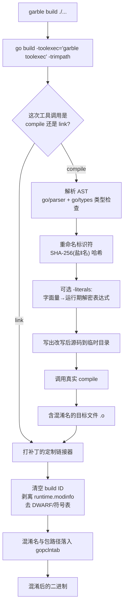
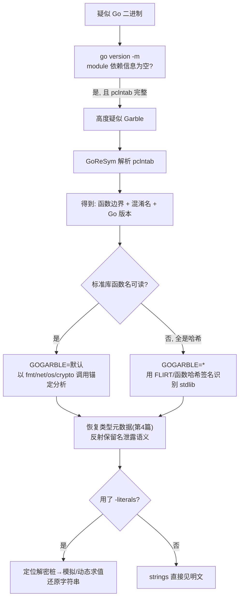

# Go与Rust现代二进制逆向（8）· Go混淆对抗：Garble
> [!abstract] TL;DR
> - Garble 是**源码/AST 级**混淆器：用 `-toolexec` 挂进 Go 工具链，在编译阶段重写标识符、可选加密字面量，在链接阶段剥离元数据；它**默认不改一条指令、不做控制流混淆**，逻辑层面对逆向几乎透明。
> - 用维护者自己的分类看透本质——**破坏性（destructive）**改造（哈希名字与位置、删 DWARF/build info）让信息「更少且不可逆」；**变换性（transformative）**改造（`-literals`、实验性控制流）只是把信息「藏起来」，理论上都可还原。默认只做前者。
> - 名称混淆 = 以「包 action ID（+`-seed`）为盐的 SHA-256」哈希，保留导出性（首字母大小写），跨包用不同盐防全局彩虹表；`//go:linkname` 目标与反射命中的字段/方法名被迫**保留明文**，是信息泄露点。
> - gopclntab **不被删除**（运行时/GC/栈回溯依赖它），结构完整——GoReSym/IDA/Ghidra 照样能枚举函数边界，只是名字成了哈希；被剥离的是 build ID 与 `runtime.modinfo` 依赖清单；`-tiny` 进一步删文件名/行号并关闭 panic 打印。
> - 关键对抗支点：**指令未变** → FLIRT/函数哈希签名对标准库依旧有效；`GOGARBLE` 默认只混淆主模块 → **标准库名通常仍可读**，可作分析锚点；`-literals` 击穿 `strings` 但挡不住调试器/模拟执行（GoStringUngarbler 之类工具专治）。

## 概述与定位

前面的第 3、4、7 篇都在讲「如何从 Go 二进制里把符号、类型、字符串**恢复**出来」，靠的正是 Go 编译器留下的丰盈元数据：gopclntab 里的函数名表、`rtype` 里的类型名、module 里的依赖清单。这些元数据是 Go 生态「开箱即得符号」的红利，却也是防守方最不想让攻击者白拿的东西。本篇的主角 **Garble**（`github.com/burrowers/garble`，Daniel Martí/mvdan 等维护）就是站在恢复方对面的那把「橡皮擦」——它在编译期把这些红利尽量抹掉或搅浑，是当前 Go 界事实上的标准混淆器，也是大量 Go 语言恶意样本（cobalt-strike 类 loader、勒索、挖矿）用来抬高分析成本的首选。

要给 Garble 精准定位，必须先记住一句话：**它是名称与元数据混淆器，不是代码保护器**。Garble 的作者把混淆分成两类，这个分类是理解它一切行为的骨架：

- **破坏性混淆（destructive）**：混淆后的二进制携带的信息**严格少于**普通构建。典型是删除 DWARF 调试信息与符号表、清空 build ID、剥离 module 依赖信息、把函数名/类型名/文件路径行号哈希成乱码。这类改造**不可逆**——原始名字根本没进二进制，你再努力也「无中生有」不出来。
- **变换性混淆（transformative）**：信息其实还在，只是被藏起来。典型是 `-literals` 把字符串变成运行时解密表达式、实验性的控制流平坦化。程序要能跑，明文/原逻辑就必须以某种形式存在于二进制里，因此这类改造**理论上都可还原**，只是抬高了成本。

Garble 默认**只做破坏性改造**，且默认作用于「当前主模块」的包。变换性的 `-literals`、`-tiny`（更激进的破坏）、实验性控制流都是 opt-in。这个设计取向直接决定了它的能力边界：对「读名字、读字符串、看 module 版本」这种廉价情报，Garble 打击很有效；但对「读指令、跟控制流、按签名认标准库」这种结构化分析，默认配置几乎无能为力。理解了这条，逆向策略就有了主心骨。

## 原理与机制

### 用 `-toolexec` 寄生工具链

Garble 不是一个独立编译器，而是 `go build` 的一层皮。你把 `go build` 换成 `garble build`，它内部实际执行的是：

```
go build -toolexec='garble toolexec' -trimpath ...
```

`-toolexec` 是 Go 官方给 `go build` 的一个钩子：工具链每次要调用底层的 `compile`（编译单个包）或 `link`（最终链接）时，都会先把命令行交给 `-toolexec` 指定的程序。于是 Garble 得以在每次真正编译/链接**之前**插进去做手脚。它为什么选这条路而不是 fork 一个编译器？因为 Go 内部结构（对象文件格式、pclntab 布局、runtime 私有约定）版本间变动大，寄生在官方工具链上能最大化复用官方逻辑、把维护面收敛到「AST 改写 + 少量链接器补丁」。代价是 Garble **强绑定 Go 版本**——它对当前 Go 发行版的内部实现打补丁，因此每个 Garble 版本只支持特定几个 Go 版本，用错版本会直接报错或产出坏二进制。这一点后面「安全性与正确使用」还会展开，对分析者也是指纹：Garble 样本往往用特定 Go 版本编译。

### 编译阶段：AST 重写

拦到一次 `compile` 调用时，Garble 拿到本包的源文件，走一遍 `go/parser` + `go/types`（必须做类型检查，否则无法知道一个 `Foo` 到底是哪个包的哪个符号、方法是否满足某接口），然后在 AST 上做两件事：

1. **重命名标识符**：把匹配 `GOGARBLE` 的包里的函数名、类型名、方法名、字段名、局部变量名、以及**包导入路径**统统换成哈希串。
2. **（可选）改写字面量**：`-literals` 下把字符串/部分数值字面量替换成运行期求值的表达式。

改写后的源码写到临时目录，再调真实 `compile` 编译。**注意：改的是源码文本层面的名字，生成的机器指令与未混淆版本本质一致**——这正是「不动代码」的技术根因，也是签名识别仍然奏效的原因。

### 链接阶段：定制链接器 + 剥离元数据

拦到 `link` 时，Garble 用一个**打过补丁的定制链接器**。它按当前 Go 版本 clone `cmd/link` 源码、应用自带补丁、编译出定制 `link` 并缓存复用。补丁的职责主要是：清空/覆写 `go:buildid`、剥离 `runtime.modinfo`（`go version -m` 读的依赖清单）、并确保混淆后的名字与包路径一致地落进 gopclntab。此外 Garble 默认**移除 DWARF 与标准符号表**（相当于 `-ldflags="-w -s"` 的效果），使 `nm`/`objdump -g` 失效，只剩 pclntab 派生的（混淆后）名字可用。

### 谁被混淆、谁被放过

不是所有名字都能改。有几类必须原样保留，否则程序会崩或链接失败，这也构成了逆向者的**信息泄露口**：

- **`GOGARBLE` 未命中的包**：默认只混淆主模块，标准库、第三方依赖的名字通常原封不动。
- **`//go:linkname` 目标**：跨包/汇编按**字符串名**链接，改了名就断链，必须保留。
- **反射访问到的字段/方法名**：Garble 做静态 `reflect` 分析，命中的名字保留明文——否则 `encoding/json`、`reflect.StructField` 之类运行期行为会变（比如 JSON 字段名突然变哈希）。检测是**启发式**的，检测不到就会「不加 garble 能跑、加了就崩」，这是 Garble 最常见的 bug 来源。
- **导出性必须保留**：混淆名首字母大小写跟随原名，因为 Go 可见性与链接依赖它。副作用是**泄露了「该符号原本是否导出」**。

下面这张图把整条流水线串起来：



## 结构与算法详解：名称哈希、字面量加密与 pclntab 改写

### 名称哈希算法

Garble 的命名混淆核心是一个带盐 SHA-256。概念上（非逐行源码）：

```
salt = actionID(pkg)              // Go 构建缓存的「包 action ID」：含源码、依赖、
                                  //   工具链版本的复合指纹，天然「每包唯一」
if -seed 提供:
    salt = combine(salt, seed)    // 叠加用户种子，一把改变全库所有名字
sum  = sha256(salt ‖ []byte(name))
raw  = sum[:hashLength]           // 取前若干字节，决定混淆名长度
id   = base64Ish(raw)            // 定制字母表，产出合法 Go 标识符
if id[0] 是数字: id = 前缀补字母   // 标识符不能以数字开头
id   = 按原名导出性调整首字母大小写 // 保留 export/unexport 语义
```

几个设计取舍值得拆开讲，因为它们决定了对抗策略：

- **为什么用「包 action ID」当盐？** 一是**确定性可复现**：同样的源码 + 同样的工具链 → 同样的 action ID → 同样的混淆名，CI 里可重放。二是**每包不同盐**：同一个名字 `Handler` 在包 A、包 B 会哈希成完全不同的串，逆向者**无法建一张全局「哈希→原名」彩虹表**去一次性还原所有包。action ID 本就含全部输入指纹，是现成的、无需额外存储的唯一盐。
- **`-seed` 的意义**：不给 seed 时，混淆仅由 action ID 决定（换任何输入都会变名，但同输入稳定）；给 `-seed=random` 则每次构建随机、名字全变，并把随机种子打印出来供复现；给固定 base64 seed 则跨构建稳定。对恶意样本分析，这意味着：**两个样本若代码相同且共用同一 seed，混淆名一致 → 可跨样本关联**；若用 random seed，名字对不上，关联失效。
- **哈希长度与熵**：早期 Garble 产出定长名，整张名字表呈现「一水儿 6~8 字符 base64」的可识别形态，本身就是指纹；新版让长度有变化以削弱这种模式化特征。
- **方法名一致性难题**：接口方法与其所有实现必须重命名成**同一个名**，否则接口不再被满足——这属于结构化类型的全局约束，Garble 靠 `go/types` 的类型信息保证一致改名，是其复杂度的一大来源。

### 字面量加密（`-literals`）的内部变体

默认构建里**字符串明文照旧躺在二进制里**——很多人误以为 Garble 会自动藏字符串，其实不会，你 `strings` 一把 URL、错误信息、密钥全在。只有 `-literals` 才把字符串（以及 `-ldflags=-X` 注入的字符串、部分数值字面量）改成运行期求值。Garble 在 `internal/literals` 下维护多种混淆器，随机（受 seed 影响）挑选、甚至可嵌套：

- **xor**：逐字节异或一个密钥。
- **swap**：按规则两两交换字节位置。
- **split**：拆成若干块，用一个基于运行期索引的 `switch` 重组顺序。
- **seed**：一个随字节滚动更新的种子做类流密码的逐字节加密。
- **shuffle**：打乱字节并存一份置换表，叠加异或密钥。

一个 `msg := "secret"` 在 xor 变体下大致变成：

```go
msg := func() string {
    b := []byte{0x11, 0x07, 0x16, 0x00, 0x1d, 0x17}
    k := []byte{0x62, 0x64, 0x75, 0x63, 0x6e, 0x74}
    for i := range b { b[i] ^= k[i%len(k)] }
    return string(b)
}()
```

两条边界要记牢：其一，**常量表达式里的字面量改不了**——数组长度、`const` 声明、`case` 标签这些位置要求编译期常量，换成运行期函数调用会直接编不过，所以 Garble 只动非常量位置的字面量。其二，从对抗角度看，这属于「变换性」混淆：明文一定会在运行期出现，因此**调试器下断、或用模拟执行跑一遍解密桩**就能还原（后文工具节详述）。它的实际价值是击穿「无脑 `strings` 扫」这种最廉价的分析，对稍有针对性的分析者只是拦路石而非高墙。

### gopclntab 到底被改了什么、剥了什么

这是本篇与第 3 篇的接缝，务必分清**「改内容」与「删结构」**。gopclntab（Go 的 PC-行号表）承载函数名、文件名、行号、以及 GC/栈回溯必需的 PC 映射，运行时强依赖它——所以 **Garble 不会删掉 gopclntab 本身**，删了程序就没法 panic 回溯、GC 扫栈也会出问题。它动的是「填进去的内容」：

```
gopclntab 头: magic(随 Go 版本演进) | quantum | ptrsize | nfunc | ...
  ├─ funcnametab   ← Garble: 函数名变哈希；表结构、偏移机制不变
  ├─ pctab / pcln  ← -tiny: 行号/位置信息被整段删除（非混淆，是删）
  ├─ functab([]_func) ← 函数条目与边界不变 → 逆向仍可完整枚举函数
  └─ filetab       ← -trimpath: 路径变模块相对；-tiny: 直接删
另: go:buildid           ← 清空
    runtime.modinfo(依赖清单) ← 剥离，go version -m 读不到
    DWARF / 标准符号表       ← 默认移除
```

推论极其重要：**因为 functab 结构与函数边界原样保留，GoReSym / IDA 的 Go 加载器 / Ghidra 的 Go 分析器照样能把每个函数「切」出来并命名**，只不过名字是哈希。换句话说，**被 Garble 混淆的 Go 二进制，其「函数化」程度仍远好于一个被 strip 的 C++ 二进制**——这是 Go 元数据红利的黑色幽默：连混淆器都不敢把它彻底删掉。真正被抹掉且不可逆的，是 build ID、module 依赖版本、DWARF 与明文名字。`-tiny` 则更进一步把位置信息（文件/行号）整段删除、并移除运行时打印 panic/fatal/trace 的代码，产物约小 15%，代价是崩溃时**连 PC 之外什么都不打印**、`garble reverse` 也失效。

## 工具视角与实战

### 一、判定：这是不是 Garble

先给几条强指纹的判定链：

```bash
go version -m ./app     # 依赖清单为空/残缺，但文件确是 Go(有 pclntab magic) → 高度疑似
go tool nm ./app | head # 大量短哈希名(如 main.p_b59Kl)、导出性尚在 → 疑似
strings ./app | grep -i "go1\."   # 通常仍能看到 Go 版本字符串
```

`runtime.buildVersion`（Go 版本串）一般仍在，GoReSym 据此判版本；`runtime.modinfo` 被剥导致 `go version -m` 空手而归——**「有完整 pclntab、却没有 module 信息、且名字是短哈希」三者同现，基本可以判定 Garble**（`-literals` 还会附带满屏的字节数组解密桩）。



### 二、恢复：把能拿的都拿回来

- **函数边界与（混淆）名**：直接上 GoReSym（第 7 篇），拿到函数表、类型、Go 版本。哪怕名字是哈希，**函数数量与边界**对分门别类、圈定 `main.*` 用户代码就极有价值。
- **标准库锚点（利用默认 GOGARBLE）**：默认只混淆主模块，**标准库、第三方依赖的名字往往是明文**！这意味着你能直接看到 `net/http`、`crypto/aes`、`os/exec` 的调用，顺着这些锚点反推用户代码意图。分析第一步应是：确认 stdlib 名字是否可读——可读就抓紧用它建立骨架。
- **签名识别（利用「不动指令」）**：即便对手上了 `GOGARBLE=*` 把标准库也哈希了，**函数机器码并未改变**，于是 FLIRT 签名、函数字节哈希（第 7 篇的思路）对标准库依旧命中——这是 Garble 「只混淆名字不混淆代码」留下的最大破口。
- **类型元数据**：`rtype` 结构（第 4 篇）里类型的 kind、size、字段布局、方法集偏移都在，只是类型名/方法名成了哈希；但**被反射用到的字段名被迫保留明文**，往往顺带泄露结构体语义（如一个含 `Cmd`、`Args`、`Sleep` 明文字段的结构体，用途呼之欲出）。
- **`-literals` 字符串还原**：解密桩是「小函数 + 字节数组 + 循环」的固定形态。手段有三：调试器里在 `return` 处断下读明文；用 Unicorn/Ghidra 模拟器**符号/具体执行**跑一遍；或直接用专治此道的工具——Mandiant 开源的 **GoStringUngarbler** 就是识别这些解密函数模式、以模拟执行批量抽出明文串。
- **动态兜底**：真跑起来，在 `runtime.gopanic` 或 `runtime.FuncForPC` 处观察，或让程序自己解密字符串后 dump 内存。

### 三、开发者自查视角（理解混淆才好对抗）

想吃透 Garble 产物，最快的路是在**自有代码**上复现：

```bash
garble build -o app ./...                 # 默认: 只混淆主模块, 破坏性
GOGARBLE='*' garble -literals -tiny build -o app ./...  # 全量+字面量+激进剥离
garble -seed=random build ./...           # 每次随机, 打印种子供复现
garble -debugdir=/tmp/gsrc build ./...    # 把改写后的源码吐出来, 直接读混淆结果
garble reverse ./app < panic.txt          # 用构建缓存把混淆栈回溯映射回真名(非 -tiny)
```

`-debugdir` 让你亲眼看到 AST 改写后的样子，`garble reverse` 揭示了「破坏性其实对**持有构建缓存的开发者**可逆、对拿到成品的分析者不可逆」这层不对称——这也解释了为何名字混淆是「destructive」：原名根本没进二进制，只活在开发者的构建缓存里。

## 安全性与正确使用

> [!caution] 合规边界（务必先读）
> 本篇的混淆与**去混淆**技术，仅用于：你自有或已获授权的软件、CTF 靶场、以及防御性安全研究（样本分析、检测规则开发、威胁情报）。一律以**防御/教育**为立场。
> - 不提供针对真实生产系统或他人系统的武器化步骤；不为**绕过商业软件授权/DRM**、也不为**逃避安全检测投递恶意载荷**提供成品配方。
> - 用 Garble 混淆**恶意代码以规避查杀**，在多数司法辖区涉嫌违法；本篇讲清其原理，是为了让防守方**认得出、拆得开**，不是教人把它当作免杀工具。
> - 去混淆他人二进制前，确认你有分析授权（恶意样本分析、漏洞研究、互操作等合法情形除外，且遵循当地法律与平台条款）。

**把 Garble 当「代码保护器」用是危险的误区。** 按维护者自己的分类：破坏性改造确实抹掉了名字与 build 信息，但它**完全不阻止**结构化分析——控制流、调用图、机器码一览无余，FLIRT 认标准库、GoReSym 切函数照旧。变换性的 `-literals`/控制流则「信息还在、只是藏着」，注定可还原，官方明说它们「有时能糊弄基础的、非 Go/非 garble 专门的分析」，仅此而已。所以正确心智是：**Garble 抬高的是「读名字/读字符串」这类廉价情报的成本，而非逆向的整体成本**。真要强保护，得在其上叠加加壳/反调试/VM 化保护器（那是另一套权衡，且各有被脱壳的历史）。

工程上还有一串**失败模式与边界**必须知道，否则「能编译」不等于「能正确运行」：

- **反射误伤**：静态 `reflect` 分析漏检 → 字段名被混淆 → JSON/ORM/配置解析在运行期悄悄错乱。这是「不加 garble 好好的、加了就崩」的头号原因，需要针对性地把相关包排除出 `GOGARBLE` 或调整代码。
- **`//go:linkname`、cgo、汇编按名引用、`-buildmode=c-shared/plugin` 的导出符号**：都要求名字稳定，Garble 需特判保留，配置不当即断链。
- **Go 版本强绑定**：Garble 打补丁依赖 Go 内部实现，只支持特定版本；升级 Go 常需同步升级 Garble，CI 里要锁版本。
- **可复现性管理**：跨构建要稳定名字就固定 `-seed`；要每版不同就 `random`——但 random 会让你自己也难以用 `garble reverse` 对旧版崩溃栈做回溯，需存好每次的种子。
- **`-tiny` 的代价**：崩溃不打印任何栈、位置信息全删，线上排障近乎抓瞎，上生产前掂量清楚。
- **性能**：默认（纯破坏性）几乎零运行时开销；`-literals` 增加解密与 init 成本，热点路径上可感知。

## 小结

Garble 的全部行为都能用一句话收束：**它在编译期擦掉/搅浑「名字与元数据」，但不碰指令与逻辑。** 破坏性改造（哈希名、删 build info/DWARF、剥 module 信息）让信息「更少且不可逆」，是它的主力，也是默认行为；变换性改造（`-literals`、实验性控制流）只是把信息「藏起来」，可被模拟执行/调试还原。对逆向者，这留下三个决定性支点：其一，**gopclntab 结构完整**，函数边界与（混淆）名照样恢复，Go 元数据红利只是打折未清零；其二，**指令未变**，FLIRT/函数哈希签名对标准库长期有效；其三，**默认只混淆主模块**，标准库明文名与被迫保留的反射字段名/linkname 是天然的语义锚点。认清「Garble 是名称混淆而非代码保护」，就不会被满屏哈希名唬住——把 GoReSym 切出的骨架、签名认出的标准库、模拟执行还原的字符串三者拼起来，混淆后的 Go 样本依旧是可拆解的。下一篇起我们转向 Rust，去看一门「几乎不留元数据红利」的语言在二进制层是何等另一番景象。

## 相关阅读

- 本系列：[[03.gopclntab与函数符号恢复|第 3 篇 · gopclntab 与函数符号恢复]]（Garble 改的正是这里的内容）、[[04.Go类型系统元数据恢复|第 4 篇 · Go 类型系统元数据恢复]]（混淆后类型结构仍可恢复）、[[05.Go字符串与切片与接口还原|第 5 篇 · Go 字符串与切片与接口还原]]（`-literals` 对应的还原）、[[07.Go逆向工具：GoReSym与IDA脚本|第 7 篇 · GoReSym 与 IDA 脚本]]（解析混淆后 pclntab 的主力工具）
- ABI 承接：[[23.C_C++运行时与ABI/01.运行时与ABI概览|运行时与 ABI 概览]]、[[22.调用规约/06.SystemV_AMD64调用规约|System V AMD64 调用规约]]
- 同族对照：[[36.Objective-C与iOS运行时/01.Objective-C运行时概览|Objective-C 运行时概览]]（元数据丰盈语言的另一例，可与 Go 对照）
- 应用场景：[[50.恶意代码分析与免杀对抗/00.恶意代码分析与免杀对抗总览|恶意代码分析与免杀对抗总览]]（Go 恶意样本常配合 Garble）
- 官方与工具：Garble 项目 `github.com/burrowers/garble`（README 含 destructive/transformative 设计说明与 `-literals`/`-tiny`/`-seed`/`GOGARBLE` 语义）；Mandiant GoReSym 与 GoStringUngarbler（后者专治 `-literals` 字符串还原）；Go 官方 `cmd/link` 中 pclntab 的设计文档（Russ Cox, "Go 1.2 Runtime Symbol Information"）。

[[00.Go与Rust现代二进制逆向总览|⬆ 系列总览]] | [[07.Go逆向工具：GoReSym与IDA脚本|← 上一章]] | [[09.Rust二进制结构与编译模型|→ 下一章]]
