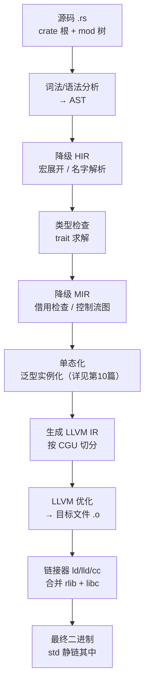
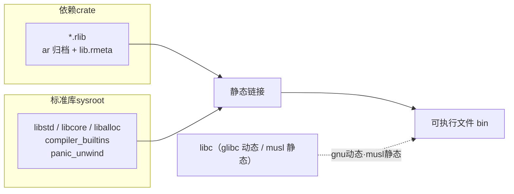
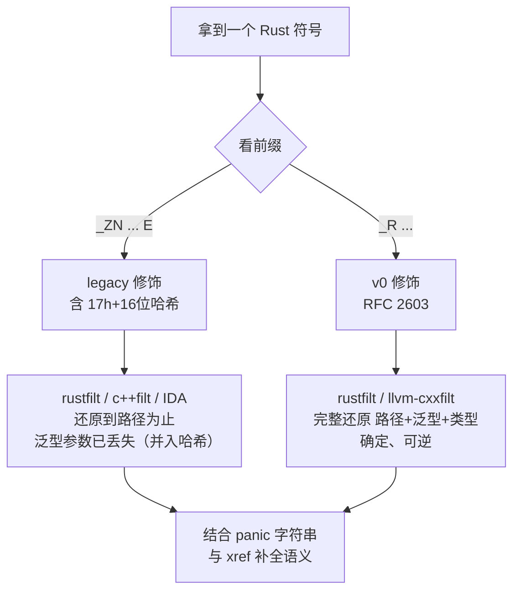

# Go与Rust现代二进制逆向（9）· Rust二进制结构与编译模型

> [!abstract] TL;DR
> - Rust 走 LLVM 后端，产物与 C/C++ 同构：**没有** Go 那样的 `.gopclntab`、类型元数据、itab 专属段，因此逆向 Rust 更像逆向 C++，而非逆向 Go——结构线索来自符号名与代码形态，而非运行时元数据表。
> - **crate 是编译单元**；`std`/`core`/`alloc`/`compiler_builtins` 默认**静态链入**二进制，`libc`（glibc）动态链接；`x86_64-...-musl` 目标可得全静态二进制。
> - 两套符号修饰长期并存：**legacy**（`_ZN...17h<16位哈希>E`，泛型参数被折进哈希、不可逆）与 **v0**（`_R...`，RFC 2603，完整编码泛型/路径、确定且可还原）；逆向者两种都得会手工拆解。
> - 默认 `release` **不 strip**，`.symtab` 保留修饰名 → 用 `rustfilt`/IDA/Ghidra 还原 `crate::mod::fn` 即可重建大量模块结构；一旦 `strip=symbols`，就只剩 `panic` 字符串与代码特征。
> - `panic` 消息会泄露 `/rustc/<commit-hash>/library/...` 与 `~/.cargo/registry/.../<crate>-<ver>/src/...`，可反推 **rustc 版本**与**依赖清单**——既是逆向抓手，也是需要在发布时收敛的信息泄露面。

## 概述与定位

本篇是《Go与Rust现代二进制逆向》从 Go 转入 Rust 的**第一块地基**。前八篇里，Go 之所以「可逆性极高」，根源在于它自带一套庞大运行时并把大量元数据固化进专属段（`gopclntab` 恢复函数边界、`typelink`/`itablink` 恢复类型与接口）——参见本系列 [[02.Go二进制结构与编译模型|第 2 篇]]。Rust 走的是**完全相反的哲学**：它没有独立运行时、没有 GC、没有反射，编译期把一切能确定的都确定下来，运行期只留最薄的一层。这决定了 Rust 二进制在逆向者眼里的第一印象——**它长得像 C++，不像 Go**。

要把这个「像 C++」讲透，得先定位 Rust 的编译栈。`rustc` 是前端，负责从源码一路降级到 MIR（借用检查、单态化在此附近发生），随后把 MIR 翻译成 **LLVM IR**，交给 LLVM 后端做优化与指令选择、生成目标文件，最后由系统链接器（`ld`/`lld`/`cc` 驱动）产出可执行文件。这条链路意味着：Rust 继承了 LLVM/C 生态的全部惯例——标准 ELF/PE/Mach-O 段布局、`.eh_frame` 承载栈展开信息（见 [[12.Rust panic与unwind元数据|第 12 篇]]）、DWARF 承载调试信息、C ABI 作为 FFI 边界（见 [[23.C_C++运行时与ABI/01.运行时与ABI概览]] 与 [[22.调用规约/06.SystemV_AMD64调用规约]]）。**没有任何一个「Rust 专属」的元数据段**。

这一「无专属段」的事实，正是本篇要反复强调的定位差异。用一段对照说明：

```
Go   二进制段：.text .gopclntab .go.buildinfo .typelink .itablink .noptrdata ...
                （自带运行时元数据，函数边界/类型/接口可从段结构机械恢复）
Rust 二进制段：.text .rodata .data .bss .eh_frame .eh_frame_hdr .comment .symtab ...
                （与 C/C++ 完全同构，无专属段；线索藏在符号名 + panic 字符串 + 代码形态里）
```

所以本篇的三条主线——**crate 布局**（编译与链接的组织单位）、**符号修饰**（从名字里抠出结构的唯一系统化通道）、**std 静链**（为什么二进制动辄几百 KB、里面塞了什么、如何识别）——共同回答一个问题：**面对一个剥离了大部分线索的 Rust 二进制，逆向者能从「编译模型」这一层拿回多少确定性信息**。单态化爆炸留待 [[10.Rust单态化与泛型膨胀|第 10 篇]]，所有权在汇编层的痕迹留待 [[11.Rust所有权在汇编层的痕迹|第 11 篇]]，trait 对象与 vtable 留待 [[13.Rust-trait对象与vtable还原|第 13 篇]]；本篇只铺地基。

## 原理与机制

### crate：编译单元与 crate 类型

Rust 的编译单元不是「文件」而是 **crate**。一个 crate 由一个根模块（`main.rs` 或 `lib.rs`）加其下 `mod` 树构成，`rustc` 一次编译一个 crate。这与 C/C++「一个 `.c`/`.cpp` 一个翻译单元」根本不同——**整个 crate 内的内联、泛型实例化、跨函数优化都在一次编译里完成**，crate 边界才是优化的天然墙。理解这点对逆向很关键：同一 crate 内的小函数往往被内联到消失，而跨 crate 调用（除非开 LTO）通常还保留清晰的 `call` 边界与修饰名。

crate 按产物形态分若干类型，逆向时会遇到不同壳子：

```
crate 类型        产物              链接语义 / 逆向含义
bin              可执行文件         最终目标；main 是 C-ABI shim → lang_start
lib / rlib       *.rlib            ar 归档：目标码 + lib.rmeta 元数据；仅供 Rust 间静态链
dylib            *.so / *.dll      Rust ABI 动态库（不稳定，少见）
cdylib           *.so/.dll/.dylib  C ABI 动态库；导出 #[no_mangle] extern"C"，FFI 常见
staticlib        *.a               C ABI 静态库，std 全打包进去
proc-macro       编译器插件         为宿主编译、编译期被 rustc 加载，不进目标二进制
```

其中 **`rlib` 值得单独讲**：它本质是一个 `ar` 归档，里面除了普通 `.o` 目标文件，还藏了一个 `lib.rmeta` 成员——序列化的 crate 元数据，包含类型信息、可导出泛型的 MIR（供下游 crate 单态化时实例化）、可内联函数体等。这是「泛型必须在使用处才能生成代码」的工程落点：上游把泛型的 MIR 存进 `.rmeta`，下游读出来再单态化。逆向最终二进制时通常见不到 `.rmeta`（它不进 `bin`），但**分析一个第三方 `rlib` 或 sysroot 时，`.rmeta` 是宝藏**。

### 编译流水线与 codegen units

从源码到二进制的降级链路，是识别「哪些结构会消失、哪些会保留」的依据：



流水线里有个逆向者必须理解的旋钮：**codegen units（CGU）**。`rustc` 把一个 crate 切成多个 CGU 并行喂给 LLVM，默认 `codegen-units=16`。CGU 越多编译越快，但跨 CGU 的内联/优化机会越少；因此 `release` 里为追求性能常设 `codegen-units=1`，把整个 crate 塞进一个 LLVM 模块做充分内联。**这直接影响逆向难度**：`codegen-units=1` + `lto` 的二进制，函数边界被大规模抹平、小函数内联殆尽；而默认多 CGU 的构建保留更多独立函数与调用边界。看到一个函数极少、巨型函数遍地的 Rust 二进制，八成开了单 CGU + LTO。

优化档位同理：`opt-level` 取 `0`（debug 默认）、`1`、`2`、`3`（release 默认）、`s`/`z`（优化体积）。`opt-level=z` 常见于嵌入式与体积敏感的恶意样本，它会激进合并、缩减，进一步吃掉可读性。

### std 静链：二进制里到底塞了什么

Rust 二进制「体积大」的直接原因是 **`std` 默认静态链入**。一个 `bin` 会静态包含这几层 sysroot 库：

- **`core`**：不依赖操作系统与分配器的最小核心（`Option`/`Result`/`slice`/`fmt` 基础/`panic` 抽象）。`#![no_std]` 时只剩它。
- **`alloc`**：依赖全局分配器的堆抽象（`Box`/`Vec`/`String`/`Rc`/`Arc`）。
- **`std`**：依赖操作系统的完整标准库（文件、线程、网络、`std::rt` 启动逻辑）。
- **`compiler_builtins`**：LLVM 期望存在的底层内建（`__udivti3`、`memcpy`/`memset` 回退等），相当于 Rust 版 `libgcc`/`compiler-rt`。
- **`panic_unwind` / `panic_abort`**：按 `panic` 策略二选一链入。

这些库在 sysroot 里是**预编译好的 rlib**（位于 `~/.rustup/toolchains/<tc>/lib/rustlib/<target>/lib/`），只有开 `-Z build-std` 才会从源码重编。**「预编译」这一点对逆向是决定性利好**：同一 `rustc 版本 + target + profile`，`std` 的机器码字节是稳定一致的，这让 FLIRT/函数签名匹配变得可行（详见下文工具节）。

需要澄清一个常见误解：**「std 静链」不等于「全静态二进制」**。在 `x86_64-unknown-linux-gnu` 上，`std` 静链，但 `libc`（glibc）默认**动态链接**——因为 glibc 的 NSS、`dlopen`、locale 等机制不适合全静态。想要全静态，得换 `x86_64-unknown-linux-musl` 目标。平台差异如下：



- **linux-gnu**：std 静、glibc 动，`ldd` 能看到 `libc.so.6`、`ld-linux`。
- **linux-musl**：可产全静态，`ldd` 显示 `not a dynamic executable`，常见于容器与投递型样本。
- **windows-msvc**：链接 UCRT/vcruntime，默认动态，`+crt-static` 转静态。
- **windows-gnu**：走 MinGW，链 `libgcc`/`msvcrt`。
- **macOS**：始终动态链接 `libSystem`（Apple 不支持静态 libc）。

### 最薄的运行时与入口

Rust 没有 Go 那样的调度器/GC，但也不是「零运行时」。入口链路是：CRT 的 `_start` → `__libc_start_main` → `main`（`rustc` 生成的 **C-ABI shim**，带 `#[no_mangle]`）→ `std::rt::lang_start`（对返回类型泛型）→ `lang_start_internal` → 用户 `fn main`。`lang_start` 干的活很少：安装 panic hook、设置栈溢出保护页与信号处理、记录 `argc/argv`、处理 `SIGPIPE`。**逆向切入点**：从 C 符号 `main` 进去，紧接着的对 `lang_start` 的调用几乎是 Rust 二进制的指纹，其第一个函数指针参数就是用户真正的 `main`。

### repr 与 Rust ABI：结构体布局不可想当然

最后一个机制层面的坑：**默认 `repr(Rust)` 下，结构体字段可被编译器自由重排**（为对齐/紧凑），枚举的判别式与布局也可能被优化（如 niche 优化把 `Option<&T>` 压成一个指针宽度、`None` 用空指针表示）。这意味着逆向时**不能假设字段偏移等于源码声明顺序**。只有 `repr(C)`（按 C 规则、FFI 用）、`repr(transparent)`、`repr(packed)`、`repr(align)` 才给出可预测布局。Rust 内部调用也用不稳定的 Rust 调用约定（返回值、聚合类型的传递方式可能与 SysV 不同），只有 `extern "C"` 边界才严格遵循 [[22.调用规约/06.SystemV_AMD64调用规约]]。把 C++ 的布局直觉硬套到 `repr(Rust)` 结构上，是新手逆向 Rust 的头号翻车点。

## 符号修饰与命名还原详解

符号名是从 Rust 二进制里系统化提取结构的**唯一**通道（相对 Go 靠元数据段而言）。Rust 历史上有两套修饰方案，逆向者两套都得会拆。

### 为什么需要修饰

修饰（name mangling）的动机与 C++ 一致：把带命名空间的路径、泛型参数、trait 实现关系等富信息，编码进链接器只认的、扁平的 ASCII 符号名里。Rust 的路径（`crate::mod::Type::method`）、泛型实例（`Vec<u8>` 与 `Vec<String>` 是两个不同函数）、同名不同 impl，都必须被唯一化，否则链接冲突。区别在于 Rust 有**单态化**——同一泛型函数会被实例化成多份，各自需要唯一符号，这对修饰方案的「表达能力」提出了 C++ 之外的额外要求。

### legacy 修饰：借壳 Itanium，泛型折进哈希

早期（也是很长一段时间的默认）方案沿用类 C++ Itanium 的 `_ZN...E` 外壳，但做了简化。逐字节拆一个真实符号：

```
_ZN4core3fmt9Formatter3pad17h833538687e1eba4bE
│   │    │   │         │   └────────┬────────┘ └ E：嵌套名结束标记
│   │    │   │         │            └ 17h8335...：长度17 = 'h' + 64位哈希(16 hex)
│   │    │   │         └ 3pad：len=3 → "pad"
│   │    │   └ 9Formatter：len=9 → "Formatter"
│   │    └ 3fmt：len=3 → "fmt"
│   └ 4core：len=4 → "core"
└ _ZN：Itanium 风格「嵌套名」前缀
还原：core::fmt::Formatter::pad
```

关键是那个 **`17h833538687e1eba4b`** 尾缀：`h` 打头（保证是合法标识符起始）后跟 16 位十六进制，是一个 64 位**消歧哈希**，由该项的完整路径 + 泛型参数 + crate 版本哈希（SVH）算出。它的作用是把「`Vec<u8>::push` 和 `Vec<String>::push`」这类单态化实例区分开。

**legacy 的致命缺陷正在这里**：泛型参数不被显式编码，而是**折进了哈希**——哈希不可逆。于是 `demangle` 一个 legacy 符号，你只能拿回 `core::fmt::Formatter::pad`，**永远拿不回它实例化时的具体泛型类型**。此外 legacy 用了 `$LT$`/`$GT$`/`$u20$` 之类的转义序列表达 `<`、`>`、空格等，还原时需要二次解码，且存在歧义（无法可靠区分某些嵌套）。这些历史包袱催生了 v0。

### v0 修饰：RFC 2603，完整、确定、可还原

v0（RFC 2603）以 `_R` 为前缀，是一套**自洽的语法**：确定性、可完整还原路径与泛型、不依赖平台字符转义。拆一个基本例子：

```
_RNvNtCs1234_7mycrate3foo3bar
│ │  │  │           │   └ Nv 的标识符 "bar"（值命名空间：函数/常量/静态）
│ │  │  │           └ Nt 的标识符 "foo"（类型命名空间）
│ │  │  └ Cs1234_7mycrate：crate 根，名 "mycrate"，s1234_ 为 SVH 消歧后缀
│ │  └ Nt：进入「类型」命名空间的嵌套
│ └ Nv：进入「值」命名空间的嵌套（最外层）
└ _R：v0 前缀
结构：Nv( Nt( C(mycrate), foo ), bar )  →  还原：mycrate::foo::bar
```

v0 的表达力来自一套「路径构造子 + 类型编码」的小型语法：

```
路径构造子：C=crate根  N<ns>=嵌套(ns: v值/t类型)  M=固有impl  X=trait impl  I..E=泛型参数<..>  B=backref回引
基本类型单字符：
  a=i8  s=i16  l=i32  x=i64  n=i128  i=isize      b=bool  c=char  e=str
  h=u8  t=u16  m=u32  y=u64  o=u128  j=usize       f=f32   d=f64
  u=()（unit）  z=!（never）  p=占位_  v=变长...
```

于是 `mycrate::foo::<i32>`（对 `i32` 的单态化）会编码成形如 `_RINvC..._7mycrate3foolE`——注意末尾的 **`l`**（即 `i32`）显式出现在 `I...E` 泛型括号里。**这正是 v0 相对 legacy 的质变：单态化的具体类型参数被写在符号里，可以被完整读回来。** 对逆向而言，一个 v0 二进制等于把「哪个泛型被用哪些类型实例化了」明明白白写在 `.symtab` 上，是 [[10.Rust单态化与泛型膨胀|第 10 篇]]恢复泛型膨胀谱系的直接依据。`B` 回引（backreference）则是压缩手段：重复出现的路径/类型用「指向前面某处」的 base-62 编号代替，避免符号名爆炸——demangler 必须维护一张已解析片段表才能正确展开。

判定与还原流程：



### 默认与迁移的现实

一个必须交代的版本现实：截至本文成稿，**多数目标的默认修饰仍是 legacy**，v0 需要通过 `-C symbol-mangling-version=v0`（或 `RUSTFLAGS`/cargo profile）**显式开启**。业界正在推动切换，`rustc` 自身与部分工具链已用 v0 构建；但短期内逆向现场**两种混杂**是常态——甚至同一二进制里，用户 crate 与某些预编译组件的修饰版本都可能不同。因此「先看前缀（`_ZN` vs `_R`）判定方案，再选对应 demangler」是硬技能，不能只依赖工具一键还原。

与 C++ 横向对比：Itanium C++ mangling 也编码模板参数且可逆，v0 在这点上「回到了正道」；但 v0 刻意**不编码生命周期的具体名字**（生命周期在单态化后无运行期意义，只保留高阶生命周期的存在性占位），也**不编码返回类型**（Rust 不靠返回类型重载）。理解「哪些信息被有意丢弃」，能帮逆向者管理预期——你不会从符号里读回借用关系（那属于 [[11.Rust所有权在汇编层的痕迹|第 11 篇]]的汇编层痕迹分析）。

## 工具视角与实战

### 第一步：确认「这是不是 Rust，什么版本」

面对未知二进制，先做归属判定，按信号强弱排序：

- **v0 符号**：出现 `_R` 打头的符号 → 几乎可确定是 Rust（v0 是 Rust 独有；legacy 的 `_ZN` 与 C++ 共享，不能单独定性）。
- **panic/源码路径字符串**：`strings` 抓 `/rustc/<40位commit hash>/library/std/src/...`、`called \`Option::unwrap()\` on a \`None\` value`、`index out of bounds`、`RUST_BACKTRACE`、`already borrowed: BorrowMutError`。这些是 std 内建的 panic 文案，几乎无法在不改源码的情况下去掉。
- **rustc 版本反推**：panic 路径里的 `/rustc/<commit>/` 那个 commit hash **一一对应某个 rustc 版本**，查 Rust 发布记录即可定版；`.comment` 段常留 `rustc version 1.xx.0` 与 LLVM 版本。
- **依赖指纹**：`~/.cargo/registry/src/index.crates.io-<hash>/<crate>-<version>/src/...` 直接暴露用到的三方 crate 名与版本——`serde-1.0.x`、`tokio-1.x`、`reqwest-0.11.x` 一目了然。
- **入口指纹**：C 符号 `main` 里紧跟对 `lang_start` 的调用。

命令层面，常用组合：

```bash
# 快速看修饰方案与 std 特征
nm -C ./target 2>/dev/null | grep -E '^_R|_ZN.*17h' | head
strings -n 8 ./target | grep -E '/rustc/|\.cargo/registry|panicked at|Option::unwrap'

# 还原符号：rustfilt 同时吃 legacy 与 v0
nm ./target | rustfilt
objdump -d ./target | rustfilt          # 反汇编里就地还原符号
llvm-cxxfilt _RNvNtCs1234_7mycrate3foo3bar   # v0 也可用 llvm 工具族

# 是否静态、动态依赖
file ./target; ldd ./target
readelf -p .comment ./target            # 掏 rustc / LLVM 版本
```

### 还原与结构重建

`rustfilt` 是首选还原器（legacy/v0 通吃）；`c++filt` 能还 legacy（因其借用 Itanium 外壳）但对 v0 支持差；`llvm-cxxfilt` 新版支持 v0。**IDA Pro** 内置 Rust demangler 且社区有识别 std 的脚本/签名；**Ghidra 11+** 显著改善了 Rust 支持（自带 demangler、类型恢复）；Binary Ninja 亦有插件。还原之后，把符号按 `crate::mod::` 前缀聚类，就能**在没有专属元数据段的情况下重建出模块/依赖树**——这是 Rust 逆向最高性价比的一步。

体积归因用 **`cargo-bloat`**（需可构建源码或调试信息），能列出「哪个函数/crate 吃了多少 `.text`」，对理解单态化膨胀极有用（承接第 10 篇）。

### std 静链的「双刃」：签名匹配

因为 sysroot 里的 `std` 是**预编译**的，同 `rustc 版本 + target + profile` 下 `std` 函数的字节高度一致，于是可以像对 libc 做 FLIRT 那样，为特定 rustc 版本的 `std` 生成函数签名库，一次性把二进制里成百上千个 `core::`/`alloc::`/`std::` 函数标注出来，把逆向注意力集中到用户代码。社区工具（如 `rustbinsign`/`rust-signaturify` 一类，思路上对标 Go 的 GoReSym，见 [[07.Go逆向工具：GoReSym与IDA脚本|第 7 篇]]）正是这么做的。**局限**要认清：签名对 rustc 版本、优化档、`codegen-units`、是否 LTO 都敏感，版本一错命中率骤降；且开了激进内联/LTO 后，std 函数被打散内联，签名法整体失效——这时只能退回 panic 字符串与代码模式识别。

### 剥离后的残局

默认 `cargo build --release` **不 strip**，`.symtab` 里修饰名俱在，是逆向的黄金场景。一旦对方在 profile 里设了 `strip = "symbols"`（或事后 `strip` 工具处理），`.symtab` 被清空，此时还剩两样东西通常拿不掉：**导出符号表**（`cdylib` 的 `#[no_mangle]` 导出仍在 `.dynsym`）与 **panic/`.rodata` 里的源码路径字符串**（除非改源码或做字符串混淆）。所以「strip 过的 Rust 样本」逆向策略是：先靠 panic 字符串定位关键函数（`unwrap` 处往往邻近业务逻辑），再靠 `.eh_frame` 恢复函数边界（[[12.Rust panic与unwind元数据|第 12 篇]]），最后靠 std 代码形态与调用图补语义。

## 安全性与正确使用

本篇机制本身不是攻防武器，但**编译模型直接决定二进制的信息暴露面**，发布方与分析方都需要正确理解其边界。

**信息泄露面（发布方视角）。** 默认构建会把远超预期的信息带进二进制：修饰符号泄露完整**内部模块路径与函数名**（等于半份源码结构图）；panic 字符串泄露**源码文件路径**（常含构建机用户名，如 `/home/alice/proj/src/...`）、`rustc` 精确版本、以及**全部三方依赖的名字与版本号**。后者尤其敏感——依赖清单一旦暴露，攻击者可直接比对已知 CVE：若样本静链了某个存在已知漏洞版本的 crate，就等于把攻击面写在了脸上。这也是**供应链指纹**的基础：从二进制反推 `Cargo.lock` 级别的依赖图，用于同源样本聚类与溯源。

**正确的加固边界（发布方视角）。** 若不希望暴露上述信息，应在 release profile 显式收敛：`strip = "symbols"` 去修饰名、`panic = "abort"` 顺带减少展开表与部分文案、`opt-level` + `lto = true` + `codegen-units = 1` 通过内联抹平边界（副作用是编译变慢、二进制少量增大或减小视情况）。需要清醒的是：**strip 只提高门槛，不改变语义**——panic 字符串默认仍在，想彻底去除需改代码（`panic_immediate_abort`、自定义 `#[no_std]` panic handler、或去 `unwrap`）。把 strip 当「保护」而非「混淆」，是正确的心理预期；真正的混淆对抗属于另一话题（Rust 侧尚无 Garble 那样成熟的通用方案，可对照 [[08.Go混淆对抗：Garble|第 8 篇]]）。

**可复现构建与取证一致性（双方视角）。** `/rustc/<commit>/` 这类**绝对路径**既是版本指纹也是可复现构建的敌人：不同机器构建出的二进制会因嵌入路径不同而字节相异。`--remap-path-prefix`（及 `RUSTFLAGS` 里的 remap）用于把构建机绝对路径重写成稳定占位，既利于可复现，也顺带削弱了路径泄露。对**取证/分析方**而言，反过来要意识到这些字段可被伪造：commit hash、`.cargo` 路径、`.comment` 版本串都可被人为篡改用于反溯源误导，**版本判定应交叉验证**（panic 路径 + `.comment` + std 代码特征三者印证），不可单凭一处下结论。

**合法使用边界。** 从二进制提取符号、版本、依赖用于漏洞评估、恶意样本分析、事件响应是正当的防御工作；但对**受版权/许可保护的闭源软件**做逆向须遵循当地法律与许可协议中的逆向条款。Rust 因内存安全、易交叉编译、静态自包含、生态成熟，正被越来越多恶意软件采用（勒索、加载器、C2），使得「识别 Rust 样本、还原其结构」成为防御方的刚需技能——本篇正是这条技能链的起点，实际研判流程见 [[50.恶意代码分析与免杀对抗/00.恶意代码分析与免杀对抗总览]]。

## 小结

- Rust 走 LLVM 后端、产物与 C/C++ 同构，**没有 Go 式专属元数据段**；逆向线索来自符号名、panic 字符串与代码形态，而非运行时表。定位对了，方法论才对。
- **crate 是编译单元**，crate 类型（bin/rlib/cdylib/staticlib…）决定壳子；`rlib` 里的 `.rmeta` 承载泛型 MIR。CGU 数量、`opt-level`、LTO 共同决定函数边界被抹平的程度。
- **std 静链**（core/alloc/std/compiler_builtins）使二进制庞大但「预编译一致」，为 std 签名匹配创造条件；但「std 静」≠「全静态」，glibc 默认动态，musl 才全静态，Windows/macOS 各有链接惯例。
- **符号修饰**是抠结构的主通道：legacy（`_ZN...h<hash>E`，泛型并入哈希、不可逆）与 v0（`_R...`，RFC 2603，泛型显式、可还原）并存；判前缀、选对 demangler、按前缀聚类重建模块树，是最高性价比的一步。
- 默认不 strip → 符号在、可读性高；strip 后退守 panic 字符串 + `.eh_frame` + 代码模式。发布方应显式收敛符号/路径/依赖泄露，分析方应交叉验证版本、警惕伪造。
- 承上启下：本篇铺好「结构 + 编译模型」地基，泛型膨胀交给[[10.Rust单态化与泛型膨胀|第 10 篇]]，所有权痕迹交给[[11.Rust所有权在汇编层的痕迹|第 11 篇]]，panic/unwind 交给[[12.Rust panic与unwind元数据|第 12 篇]]，trait/vtable 交给[[13.Rust-trait对象与vtable还原|第 13 篇]]。

## 相关阅读

- 官方：*The rustc Book* 与 *Rustc Dev Guide*（编译流水线、MIR、codegen units、符号名生成）——理解本篇机制的一手资料。
- RFC 2603 *`v0` symbol mangling*（`rust-lang/rfcs`）与 `rustc_symbol_mangling` 源码：v0 语法的权威定义。
- *The Rust Reference* 之 "Type layout"、"Linkage"、`repr` 相关章节：结构体布局、crate 类型与链接语义。
- 工具：`rustfilt`、`llvm-cxxfilt`、`cargo-bloat`、`cargo-binutils`；GoReSym 类比见本系列 [[07.Go逆向工具：GoReSym与IDA脚本]]。
- 本系列对照篇：[[02.Go二进制结构与编译模型]]（结构哲学正反面对照）、[[10.Rust单态化与泛型膨胀]]、[[11.Rust所有权在汇编层的痕迹]]、[[12.Rust panic与unwind元数据]]、[[13.Rust-trait对象与vtable还原]]。
- ABI 与调用规约地基：[[23.C_C++运行时与ABI/01.运行时与ABI概览]]、[[22.调用规约/06.SystemV_AMD64调用规约]]。
- 同族元数据对照：[[36.Objective-C与iOS运行时/01.Objective-C运行时概览]]（Swift/ObjC 富元数据与 Rust「无元数据」的鲜明对比，第 14 篇会正式接上）。
- 应用场景：[[50.恶意代码分析与免杀对抗/00.恶意代码分析与免杀对抗总览]]（Go/Rust 恶意样本的实战研判）。

[[00.Go与Rust现代二进制逆向总览|⬆ 系列总览]] | [[08.Go混淆对抗：Garble|← 上一章]] | [[10.Rust单态化与泛型膨胀|→ 下一章]]