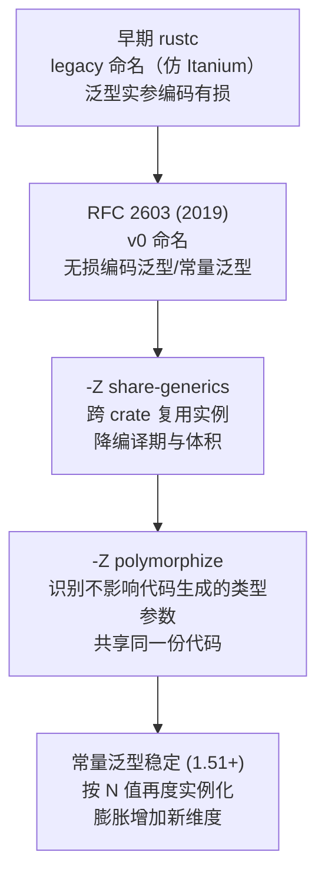
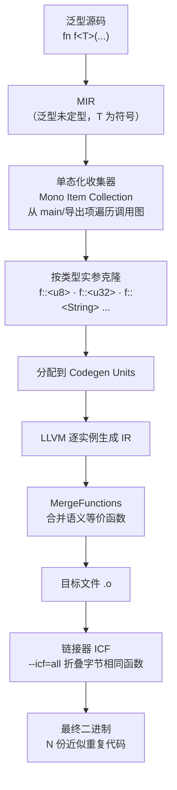
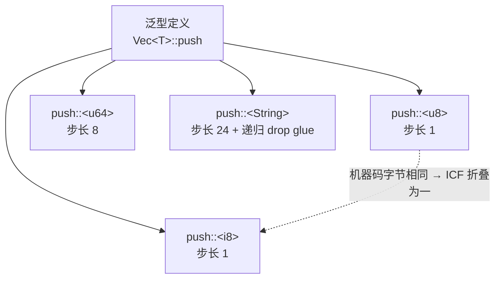
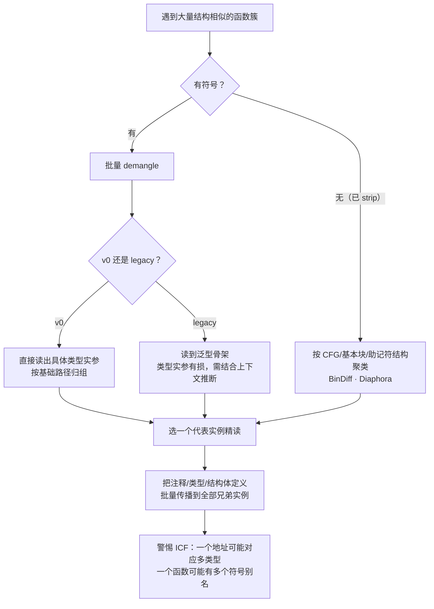

# Go与Rust现代二进制逆向（10）· Rust单态化与泛型膨胀
> [!abstract] TL;DR
> - Rust 泛型走**单态化（monomorphization）**：编译器为每个真正被用到的类型实参组合克隆一份专用机器码，与 C++ 模板同源，代价是二进制里塞满近似重复的函数——这就是「泛型膨胀」。
> - 同一泛型的各实例**控制流同构，只有类型尺寸相关的立即数不同**（步长/scale、memcpy 长度、对齐、drop glue 目标、分配大小），逆向时「读懂一份即读懂一簇」。
> - 符号名是首要情报：**legacy 命名对泛型实参有损、v0 命名（RFC 2603）无损编码具体类型实参与常量泛型**，`Vec<u8>` 与 `Vec<u32>` 能从符号直接还原。
> - 编译器与链接器又会反向去重——**ICF（相同代码折叠）、LLVM MergeFunctions、`share-generics`、`polymorphize`**——制造「多类型折叠成一个函数 / 一个函数多个符号别名」的陷阱，打破「一符号一类型」的天真假设。
> - Release 下小泛型被内联进调用点而「消失」，膨胀转移到调用处；Debug 下实例保留为独立函数、更易识别——逆向策略必须随优化级别切换。
> - 实战靠 `cargo-llvm-lines`/`cargo-bloat` 定位膨胀源，靠 BinDiff/Diaphora 聚类兄弟实例，靠 `rustc-demangle`/`rustfilt` 还原类型，把一次分析成果批量传播到全簇。

## 概述与定位

上一篇（第 9 篇）我们拆解了 Rust 二进制的整体骨架：`.text`/`.rodata` 的布局、crate 与 codegen unit 的切分、panic runtime 的接入点。本篇把镜头对准 Rust 性能哲学在二进制层最显眼、也最影响逆向工作量的一个后果——**泛型是怎样落地成机器码的**。这不是一个纯语言特性话题，而是一个会直接决定「一个中等规模 Rust 程序为什么有几百 KB 甚至几 MB、里面为什么充斥着一簇一簇长得几乎一样的函数」的工程现实。

Rust 对泛型（以及 trait 的静态派发、`impl Trait`、闭包）采用**单态化**：`fn f<T>(x: T)` 本身不产生任何可调用代码，只有当某处以 `f::<u32>(..)`、`f::<String>(..)` 具体化后，编译器才为每一种 `T` **克隆一份专属的 `f`**，把 `T` 全部替换成确定类型再走常规代码生成。这与 C++ 模板是同一血统的思路：用「编译期展开、生成多份」换「运行期零抽象开销」。它的反面是 Java 的类型擦除（泛型只有一份代码、运行期靠装箱与强转）、以及 Go 1.18 泛型的「GC 形状 + 字典」折中（后者在本系列 Go 部分已多次照面）。理解这条分水岭，是理解 Rust 二进制形态的钥匙。

对逆向而言，单态化是一把**双刃剑**。坏的一面：它制造大量重复代码，函数数量爆炸，符号表（若未 strip）动辄上万条，初看令人生畏；`serde`、迭代器适配器链、`async` 状态机这类「泛型套泛型」的结构会把实例数量推向组合爆炸。好的一面：这些重复是**高度结构化的冗余**——同一泛型的所有实例共享控制流，差异被压缩到少数几个与类型尺寸相关的常数上；只要吃透一个代表实例，就能把标注、类型、结构体定义批量套用到整簇。加之 v0 符号命名会把「到底实例化成了什么类型」明明白白编码进符号名，逆向甚至能直接把类型系统的一部分从二进制里读回来。本篇的目标，就是把「爆炸」与「去重」两股相反的力讲透，并给出在有符号 / 已 strip 两种战场下识别与利用重复代码的完整方法。

本篇聚焦「代码怎样被复制、怎样被去重、怎样被识别」。所有权痕迹（drop 的插入位置、借用在寄存器层的表现）留给第 11 篇；panic/unwind 元数据与 drop glue 在异常路径上的调用留给第 12 篇；`dyn Trait` 的动态派发与 vtable（单态化的对立选择）留给第 13 篇；Swift 的「见证表 + 特化」混合模型作为横向对照见第 14 篇。

## 原理与机制

### 单态化在 rustc 里发生在哪一步

Rust 的编译管线大致是：源码 → HIR → **MIR（中间表示，此时泛型仍是「未定型」的）** → 单态化收集 → LLVM IR → 目标文件 → 链接。关键在于 MIR 是**泛型无关**的：`f<T>` 的 MIR 里 `T` 是个符号，`size_of::<T>()`、字段偏移、`drop` 目标都还是待定的。真正的复制发生在 **单态化收集器（mono item collection）**：它从「根」（`main`、`#[no_mangle]` 导出项、`#[used]` 等）出发，沿调用图做可达性遍历，每遇到一个泛型调用就带着**具体的类型替换表（substitutions）**记录一个 `MonoItem`。同一个 `f<T>` 被 `u8`/`u32`/`String` 调用，就产生三个 MonoItem。收集完毕后，每个 MonoItem 被分配到某个 codegen unit，由 LLVM 各自生成一份带确定尺寸、确定偏移、确定 drop 目标的具体代码。

这里有个对逆向极重要的推论：**「泛型定义在哪个 crate」和「实例代码出现在哪个 crate 的目标文件里」是两回事**。泛型函数与 `#[inline]` 函数在 rlib 里是以 MIR 形式序列化保存的，它们的机器码**在实例化它们的下游 crate 里生成**。所以标准库 `Vec::push`、`Option::map` 这类泛型，会在你的可执行文件里被**重新单态化**并留下你自己的一份拷贝——这正是「hello world 也几百 KB」的一大来源，也解释了为何同一个 std 泛型会在无数 Rust 程序里以字节几乎一致的形态反复出现（可用于制作库函数指纹）。

### 泛型实例化为何会「爆炸」

实例数量近似等于「泛型参数各维度取值的笛卡尔积」。真正把它推向爆炸的是几类结构：

- **闭包**：Rust 里每个闭包都是一个**唯一的匿名类型**。`iter.map(|x| ..)` 中 `map` 是泛型于闭包类型的，写两处 `.map` 就是两个不同 `T`，各生成一份。
- **迭代器适配器链**：`v.iter().filter(..).map(..).collect()` 的类型是 `Collect<Map<Filter<Iter>>>` 这样层层嵌套的具体类型，每加一环都可能翻倍实例。
- **`async`**：每个 `async fn` 被编译成一个编译器生成的状态机结构体（又是唯一匿名类型），组合子对 future 类型泛型化，形成很深的单态化树。
- **`serde` 派生**：`#[derive(Serialize)]` 对「每种类型 × 每种数据格式」生成代码，是社区公认的膨胀之王。
- **常量泛型（const generics，1.51 起稳定）**：`[T; N]`、`fn g<const N: usize>()` 会**按 N 的每个取值再实例化一次**，给膨胀开了一个新维度。

### 泛型实现策略横向对比

单态化只是众多可选路线之一。看清它在光谱上的位置，才明白 Rust 二进制的形态为何如此：

| 策略 | 代表语言 | 代码份数 | 分发方式 | 运行期开销 | 二进制体积 | 逆向影响 |
| --- | --- | --- | --- | --- | --- | --- |
| 单态化 monomorphization | Rust / C++ | 每类型组合一份 | 静态直接调用，可内联 | 零 | 大（膨胀） | 大量结构同构的重复函数 |
| 类型擦除 type erasure | Java | 一份 | 装箱 + 强转 | 装箱/GC 压力 | 小 | 泛型实参基本丢失 |
| 具化泛型 reified generics | C# / .NET | 值类型特化 + 引用类型共享 | JIT 运行期实例化 | 中 | 中 | 运行期元数据可查 |
| GC 形状模板 stenciling | Go 1.18+ | 按 GC 形状分组 + 字典 | 传字典间接调用 | 字典间接 | 中 | 形状分组、字典参数可辨 |
| 见证表 witness tables | Swift | 一份泛型 + 值见证表 | 表驱动 | 表查找 | 小 | 见证表可还原（见第 14 篇） |

Rust 之所以选最「重」的一路，是它的核心承诺——**零成本抽象**：泛型代码的运行期表现必须与手写专用代码一致，不能有字典查找、不能有装箱、还要能被内联和常量折叠。代价（编译慢、体积大）被有意识地推给了编译期与磁盘。这也解释了 Rust 为何**同时**提供 `dyn Trait` 动态派发（第 13 篇）：当你愿意用一次间接调用换体积，就用 trait 对象；当你要极致速度，就用泛型单态化。逆向时看到「一簇同构函数」还是「一次 vtable 间接调用」，直接反映了原作者在这条权衡线上的取舍。

### 符号命名：legacy 与 v0

符号是逆向单态化最直接的情报源，两代命名方案信息量天差地别：

- **legacy 命名**：仿 Itanium C++ ABI，`_ZN` 前缀，用 `$LT$`/`$GT$`/`$u20$` 等转义尖括号、空格；末尾一个 `17h<16位十六进制>` 是实例的消歧哈希。它对**泛型实参的编码是有损且不规整的**：路径里往往能看到类型名的碎片，但常量泛型、生命周期、复杂嵌套类型难以完整、可逆地还原，很多时候只能读到「泛型骨架」，具体 `T` 要靠上下文推断。
- **v0 命名（RFC 2603，`_R` 前缀）**：为消除歧义与不可逆而生，**用一套紧凑但完整的语法把整个实例化——路径、泛型类型实参、常量泛型值、生命周期——全部无损编码**，并用反向引用（backref）压缩重复子串。这意味着 `Vec<u8>` 与 `Vec<u32>` 拥有**不同且可解码**的符号，逆向可以把类型实参从符号里精确读回。

这一步的差别对工作量影响巨大：一个用 v0 编译、未 strip 的二进制，等于把一部分类型系统直接写在了符号表里。下一段我们把 v0 的类型编码摊开，让你能徒手读符号。

## 单态化代码生成与去重详解

### 实例之间到底差在哪：只差「尺寸相关的常数」

理解「读懂一份即读懂一簇」的底气，在于看清同一泛型不同实例在机器码上的差异被压缩得多小。以对切片求和为例：

```
; sum_slice::<u32>   —— 元素 4 字节
.loop:
    add    eax, dword [rdi + rcx*4]   ; scale = 4，操作数 32 位
    inc    rcx
    cmp    rcx, rsi
    jb     .loop

; sum_slice::<u64>   —— 元素 8 字节
.loop:
    add    rax, qword [rdi + rcx*8]   ; scale = 8，操作数 64 位
    inc    rcx
    cmp    rcx, rsi
    jb     .loop
```

两个函数**控制流图完全同构**，差异只在：寻址的 scale（4 vs 8）、寄存器/操作数宽度（`eax`/`dword` vs `rax`/`qword`）。推广到一般泛型，实例间的变量集合基本就是这几类由类型决定的常数：

- **元素步长 / 数组寻址 scale**：等于 `size_of::<T>()`。
- **`memcpy`/`memmove` 的长度立即数**：拷贝一个 `T` 或 `n` 个 `T` 时的字节数。
- **分配与扩容的字节数**：`Vec` 扩容传给 `alloc` 的 `size`、`align` 直接由 `T` 的布局决定。
- **字段偏移**：对 `T` 内部字段的访问偏移，来自 `T` 的内存布局。
- **drop glue 目标地址**：需要析构的 `T` 会 call 对应的 `drop_in_place::<T>`；平凡类型这一步整段消失。

因此逆向一个泛型簇的正确姿势是：**精读一个代表实例，把它的控制流、错误分支、循环含义弄清楚；再对兄弟实例只核对那几个常数**，即可快速判定「这是 `Vec<u16>` 的 push」而不必从头再读一遍。

### v0 类型编码：徒手读符号

v0 用单字母编码基础类型，配合结构前缀编码复合类型。基础类型对照（源自 v0 规范 / `rust-demangle` 实现，可放心据此手读）：

```
i8   = a      bool = b      char = c      f64  = d
str  = e      f32  = f      u8   = h      isize= i
usize= j      i32  = l      u32  = m      i128 = n
u128 = o      i16  = s      u16  = t      ()   = u
i64  = x      u64  = y      !(never)= z   占位_ = p
```

结构上，`N` 系列前缀表示带命名空间的路径（`Nv` 值/函数、`Nt` 类型、`Nc` closure 等），`I ... E` 包裹泛型实参列表（对应源码里的 `<...>`），`C` 引出 crate 根，`B<idx>` 是反向引用。于是一个 `Option<u8>::unwrap` 的符号里，你会看到形如下面的片段（示意，省略哈希/反引用细节）：

```
_R ... I  Nt ... 6option 6Option  h  E ... 6unwrap
                                  ^ u8（h）就是这份实例的具体类型实参
        └───────── <  Option<u8>  > ─────────┘
```

一旦认得 `h=u8`、`x=i64`、`e=str` 这些码，即便解码器不在手边，也能从符号名一眼判断实例类型。这就是 v0 相较 legacy 对逆向的根本增益：**类型实参无损、结构化、可逐字节还原**。

### drop glue：一类特殊的单态化产物

`core::ptr::drop_in_place::<T>` 是编译器按类型自动合成的**析构胶水**，也是单态化的产物之一。对需要析构的 `T`，它负责递归析构其字段/元素（`Vec<String>` 的 drop glue 会遍历并逐个 drop `String`，再释放缓冲区）；对平凡类型（`u32`、`[u8; N]`）则可能是空函数或被彻底优化掉。在二进制里，drop glue 表现为**一簇短小、彼此调用、末端 call `dealloc` 的函数**，是识别「这里有个拥有所有权的容器/结构体」的强信号，也是异常展开（unwind）路径上的常客——这条线索留待第 11、12 篇深挖。逆向时把 drop glue 簇单独归类，往往能反推出原程序的所有权结构与类型组成。

### 反向去重：编译器/链接器如何把爆炸压回去

如果单态化只管复制，二进制会更夸张。实际上有四道去重工序在反向收敛，它们同时也是逆向的**陷阱来源**：

1. **LLVM MergeFunctions pass**：在 IR 层把语义等价的函数合并，或用 thunk 转发。
2. **链接器 ICF（Identical Code Folding，`lld --icf=all` / gold `--icf`）**：把**机器码字节完全相同**的函数折叠到同一地址。经典案例：`push::<u8>` 与 `push::<i8>` 因为 push 里没有区分有无符号的操作，生成的机器码逐字节相同，会被折叠成**一个函数**；`Box<A>` 与 `Box<B>` 的平凡 drop glue 也常被折叠。
3. **`-Z share-generics`**：跨 codegen unit / 跨 crate 复用同一份实例（debug 默认开），既省编译期又省体积，标准库本身即以 share-generics 编译并预置了常见实例。
4. **`-Z polymorphize`**：静态分析识别出「**对代码生成毫无影响的类型参数**」（例如只出现在 `PhantomData`、只以指针形式穿过而不解引用的 `T`），让这些参数不同的实例共享同一份代码。作用范围有限、仍属实验，但方向是把「无谓的膨胀」提前消掉。

去重带来的**逆向陷阱**必须牢记：ICF 之后，**一个地址可能同时是多种类型的实例**（天真地假设「一符号一类型」会误判类型数量）；反过来，符号表里**多个符号名可能别名同一个地址**（多个类型指向被折叠的同一份码）。看到两个不同类型的调用点跳到同一函数，别急着下结论「类型相同」——很可能只是它们的机器码恰好一致被折叠了。

### 与内联的相互作用：优化级别改变战场

单态化的产物是否以「独立函数」形式存留，深受内联影响，这直接决定逆向看到的形态：

- **Debug（`opt-level=0`）**：几乎不内联，每个实例都是独立可寻址函数，符号齐全，「重复函数簇」最清晰、最好识别，代价是体积臃肿。
- **Release（`opt-level=2/3` 或 `s/z`）**：激进内联，**小泛型（`Option::map`、简单迭代器适配器）会被内联进各调用点而不再作为独立函数存在**——膨胀从「函数数量」转移到「调用点代码量」，`Iterator::map` 这类可能在二进制里根本没有一个可调用实体，而是被抹进了每一个用它的地方；只有体积较大、被多处调用的实例才会保留为独立函数。

推论：**「一簇重复函数」这一识别模式，在 Debug 或中/大型泛型上最有效**；面对 release 里的小泛型，要转而在调用点内部寻找「内联进来的泛型片段」（重复出现的循环骨架 + 只有 scale/长度不同的常数）。

### 演进脉络







## 工具视角与实战

### 定位膨胀源（源码侧 / 白盒）

- **`cargo llvm-lines`**：按「生成的 LLVM IR 行数」为泛型函数排序，是**找单态化膨胀元凶**的第一工具。输出里常年霸榜的是 `serde` 派生、`Iterator` 适配器、`Result`/`?` 相关路径。它统计的是「同一泛型被实例化了多少次、每次多大」，能精确指向「哪个泛型被滥用实例化」。
- **`cargo bloat`**：按**最终二进制中函数占用的字节数**排序，可 `--crates` 聚合到 crate 粒度，回答「体积到底被谁吃掉了」。
- **`twiggy`**：面向 WebAssembly 的体积剖析器，支持支配树（dominators）分析，看清「删掉某函数能连带省下多少」。
- **`bloaty`（Bloaty McBloatface）**：通用二进制体积剖析，按段/符号/编译单元多维归因，对 ELF/Mach-O 都适用。

减小膨胀的手段（也是逆向时判断作者意图的反向线索）：把泛型函数拆成「薄泛型外壳 + 非泛型内核」（把与 `T` 无关的大块逻辑抽到 `fn inner(ptr: *const u8, size: usize)` 里，只让外壳单态化），或改用 `dyn Trait` 换体积。看到这种「泛型壳 + 统一内核」结构，说明原作者刻意做过去膨胀优化。

### 还原类型与识别簇（二进制侧 / 黑盒）

- **`rustc-demangle` / `rustfilt`**：解 legacy 与 v0 符号；新版 `llvm-cxxfilt`、binutils `c++filt`、以及 IDA 8.x+/Ghidra 内置的 Rust demangler 也已支持 v0。第一步永远是**批量 demangle 符号表**，按「去掉类型实参后的基础路径」对函数归组——同一路径的就是同一泛型的兄弟实例。
- **BinDiff / Diaphora / Ghidra Version Tracking**：在**已 strip**的战场上，靠控制流图同构、基本块数、助记符序列（忽略操作数）做**结构聚类**，把「长得一样只差常数」的实例自动聚到一起。可先用一个已知符号的参考二进制（同版本 rustc 编译的 debug 版）去 diff 目标，把 std 泛型簇的身份迁移过来。
- **FLIRT / 库函数指纹**：std 泛型在海量 Rust 程序里字节高度一致，可制作签名库批量认出 `core::fmt`、`Vec`、`Option`、迭代器等标准簇，先把「库噪声」标掉，聚焦用户代码。

### 一次完整的识别—传播工作流



落到 IDA/Ghidra：认定某函数是 `Vec::<T>::push` 的一个实例后，先据 scale/长度常数确定 `T` 的尺寸，建好 `Vec<T>` 的结构体（三元组 `ptr/cap/len`，注意标准库仅保证「指针+容量+长度」三元组、**字段顺序未作稳定承诺**，实践常见 ptr→cap→len），再把该结构体套用到全簇及其调用点。对 drop glue 簇单独打标签，配合它们的 `dealloc` 调用反推所有权。全程牢记 ICF 陷阱：核对目标地址是否被多个符号别名、是否被跨类型折叠。

## 安全性与正确使用

单态化本身不是漏洞，但它显著改变一个二进制的**信息暴露面**与**分析经济学**，攻防双方都需正视。

**信息泄露维度。** 这是最需要被认真对待的一点：**v0 符号会把大量类型系统信息无损写进二进制**。未 strip 的 release 产物里，攻击者/竞品能从符号名直接读出你用了哪些内部类型、泛型如何实例化、字段名与模块结构，等于附赠一份「部分源码结构图」，对闭源商业软件是实打实的知识产权与攻击面泄露。正确加固边界：发布构建应 `strip` 符号，或以 `-C symbol-mangling-version` 与 `strip = "symbols"`（Cargo profile）控制；对高价值目标可叠加第 8 篇讨论过的混淆思路。反过来，作为分析者，遇到保留 v0 符号的样本应意识到这是「送上门的情报」，优先榨取。

**冗余是一把双刃剑。** 单态化产生的结构化冗余，对**逆向者有利**（读一份懂一簇、可交叉验证、可用一个实例的错误处理路径推断全簇语义）；对**防御者不利**（更难靠「代码唯一性」隐藏逻辑，一处被攻破可类推全簇）。这意味着「靠泛型把关键逻辑散布成很多份」并不能提升隐蔽性——它们高度同构，反而更易被聚类识别。真要提高分析成本，应从算法/数据流层面着手，而非寄望于单态化制造的表面繁杂。

**指纹与供应链。** std 与热门 crate 的单态化实例字节高度稳定，可被制成指纹用于**识别 rustc 版本、依赖库、甚至具体 crate 版本**——这对恶意样本溯源与家族聚类是利器（Go/Rust 恶意样本分析见相关阅读），对希望隐藏技术栈的一方则是需要防范的旁路。防御侧若要削弱指纹，可考虑固定并裁剪依赖、开启 `panic=abort` 减少可辨识的展开机制、必要时做符号级混淆；但需权衡：过度改动会破坏可维护性与崩溃可诊断性。

**误用与正确使用的边界（工程侧）。** 单态化的「误用」主要体现在**无意识地制造膨胀**：对大函数滥用泛型、在泛型热路径里塞进与 `T` 无关的大块逻辑、对众多类型派生重型 trait，都会让体积与编译期失控，间接扩大攻击面（更多代码 = 更多潜在 gadget/漏洞面）。正确姿势是「薄泛型壳 + 非泛型内核」、审慎使用 `derive`、在体积敏感场景（嵌入式、Wasm）用 `cargo bloat`/`twiggy` 持续度量。作为逆向者，识别出这些去膨胀手法本身也是情报——它揭示了原作者的工程成熟度与关注点。

**分析伦理与合规边界。** 本篇技术用于安全研究、互操作、漏洞挖掘与恶意样本分析等正当目的；对第三方闭源软件实施逆向须遵守相应许可与当地法律。单态化让类型信息更易还原，不改变「是否有权分析该目标」这一前置问题——工具的锋利不等于授权。

## 小结

单态化是 Rust「零成本抽象」承诺在二进制层的直接体现：以编译期展开、生成多份专用代码，换取运行期不做字典查找、不装箱、可内联的极致性能，代价是**泛型膨胀**——一簇簇控制流同构、只差尺寸相关常数的重复函数。逆向的关键认知有三：其一，实例差异被压缩到 scale/拷贝长度/分配大小/字段偏移/drop 目标这几类常数上，故「读懂一份即读懂一簇」，应走「精读代表 + 批量传播」的路线；其二，符号命名分水岭巨大，**v0 无损编码类型实参**，能把类型系统的一部分直接读回，legacy 则只给骨架；其三，编译器/链接器的 ICF、MergeFunctions、share-generics、polymorphize 会反向去重，制造「一地址多类型 / 一函数多别名」的陷阱，必须打破「一符号一类型」的天真假设。再叠加优化级别对内联的影响——Debug 保留独立实例最好认，Release 把小泛型内联进调用点——逆向策略要随战场切换。工具上，白盒用 `cargo llvm-lines`/`cargo bloat` 定位膨胀源，黑盒用 demangle 归组、BinDiff/Diaphora 聚类、库指纹去噪。把这套「爆炸—去重—识别」的图景装进脑中，面对动辄上万函数的 Rust 二进制就不再是无从下手，而是一张有结构、可批处理的地图。

## 相关阅读

- 本系列：[[00.Go与Rust现代二进制逆向总览|⬆ 系列总览]]、[[09.Rust二进制结构与编译模型|← 编译模型（承接 codegen unit 与符号）]]、[[11.Rust所有权在汇编层的痕迹|→ 所有权与 drop 插入]]、[[12.Rust panic与unwind元数据|drop glue 在展开路径上的调用]]、[[13.Rust-trait对象与vtable还原|单态化的对立面：动态派发]]、[[14.Swift二进制与元数据逆向|见证表 vs 特化的横向对照]]
- ABI 与调用规约承接：[[23.C_C++运行时与ABI/01.运行时与ABI概览]]、[[22.调用规约/06.SystemV_AMD64调用规约]]（实例间寄存器/操作数宽度差异的底层依据）
- iOS 同族元数据对照：[[36.Objective-C与iOS运行时/01.Objective-C运行时概览]]（与 Swift 反射元数据可互参）
- 应用场景：[[50.恶意代码分析与免杀对抗/00.恶意代码分析与免杀对抗总览]]（Go/Rust 恶意样本的单态化指纹与溯源）
- 官方与规范：Rust RFC 2603《rust-symbol-name-mangling-v0》（v0 符号编码权威定义）；rustc-dev-guide「Monomorphization / Mono Item Collection」章节；《The Rust Programming Language》第 10 章（泛型/trait）；`cargo-llvm-lines`、`cargo-bloat`、`twiggy`、`rustc-demangle` 各自的官方仓库文档

[[00.Go与Rust现代二进制逆向总览|⬆ 系列总览]] | [[09.Rust二进制结构与编译模型|← 上一章]] | [[11.Rust所有权在汇编层的痕迹|→ 下一章]]