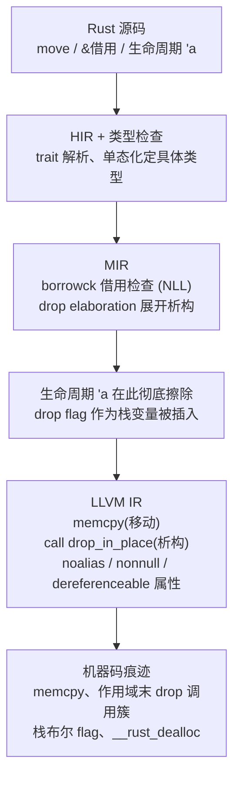
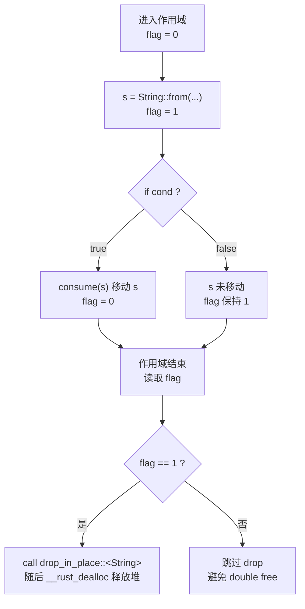
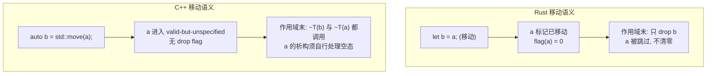

# Go与Rust现代二进制逆向（11）· Rust所有权在汇编层的痕迹
> [!abstract] TL;DR
> - Rust 的所有权（移动 / 借用 / 生命周期）几乎全是**编译期契约**：在 MIR 上完成 borrowck 与 drop elaboration 之后即被降级为普通控制流，LLVM IR 与机器码里**不存在"所有权"这个概念**。
> - **移动在字节层面等同于拷贝**（memcpy 或寄存器搬运），编译器只是"移动之后不再读源"；移动与 `Copy`、以及"被移动的源未被清零"这几件事在汇编上**无法区分**——这是内存取证与密钥擦除的关键陷阱。
> - **生命周期 `'a` 被彻底擦除**，二进制里没有任何残留；能反推的只有**动态存活区间**——即某个值在哪个作用域末尾、以何种顺序被 drop。
> - **Drop 是所有权留下的最强痕迹**：作用域末尾成簇的 `core::ptr::drop_in_place` 调用、栈上的 **drop flag 布尔字节**、以及堆类型收尾的 `__rust_dealloc`，共同勾勒出 RAII 清理结构。
> - 反向追踪一个指针"是否在作用域末尾走到 drop_in_place / dealloc"，即可判定它到底是**拥有型（值 / Box）还是借用型（&）**——这是从裸指令里区分 move 与 borrow 的可靠启发式。

## 概述与定位

Rust 的核心卖点是「无 GC 的内存安全」，其实现基石是**所有权系统**：每个值有唯一所有者、值可以被**移动**（move）转移所有权、可以被**借用**（`&T` 共享借用 / `&mut T` 独占借用），而**生命周期**（lifetime，`'a`）则是编译器用来证明「借用不会比被借用的值活得更久」的静态标注。这三件事——移动、借用、生命周期——听起来像运行时机制，但它们在本质上是**一组只在编译期成立的契约**。借用检查器（borrow checker）在 MIR 上验证这些契约后，就把它们「消费」掉了：真正生成的机器码里，既没有一个字节记录「谁是所有者」，也没有任何指令表示「这是一次借用」或「这个引用活到 `'a`」。

因此，本篇要回答的核心问题是：**当所有权抽象被编译器抹平之后，它在汇编层到底还留下了哪些可观测的痕迹？** 答案可以浓缩成三句话。其一，**移动/借用退化成了"拷贝与指针"**：移动是 memcpy 或寄存器搬运，借用是（胖）指针，二者在 ABI 上与最普通的 C 语义并无二致。其二，**生命周期完全消失**：你无法从二进制反推任何 `'a` 关系，能重建的只有「值在哪个作用域被销毁」这样的动态信息。其三，**Drop 是唯一留下强结构性痕迹的部分**：因为析构必须在运行时真实发生，编译器不得不在每条退出路径插入 `drop_in_place` 调用，并用**栈上的 drop flag** 处理「是否已被移动走」的运行时不确定性——这正是逆向者能抓住的把手。

在本系列中，本篇承接第 9 篇《Rust 二进制结构与编译模型》与第 10 篇《Rust 单态化与泛型膨胀》：单态化决定了**每个具体类型都会得到自己一份 `drop_in_place`**，这是理解 drop 痕迹的前提。本篇又向后连接第 12 篇《Rust panic 与 unwind 元数据》——drop 不只在正常路径运行，栈展开（unwinding）时也要在 landing pad 里逐个补跑，那部分留到第 12 篇细讲；以及第 13 篇《Rust trait 对象与 vtable 还原》——`dyn Trait` 虚表的**第 0 槽恒为 `drop_in_place`**，是所有权与多态的交汇点。ABI 层面的搬运/传参规则请对照 [[22.调用规约/06.SystemV_AMD64调用规约]] 与 [[23.C_C++运行时与ABI/01.运行时与ABI概览]]。

需要提前澄清「能与不能」：**能**恢复的是 drop 位置、drop 顺序（进而反推变量声明顺序与作用域边界）、堆分配/释放配对、拥有型 vs 借用型指针的区分；**不能**恢复的是生命周期标注、借用是 `&` 还是 `&mut`（只能从「是否写入」旁证）、以及一次 memcpy 到底是 move 还是 Copy 还是按值传参。把这条界线画清楚，是本篇一切实战判断的基准。

## 原理与机制

要理解痕迹，先要理解所有权是**在编译管线的哪一层被"用掉"的**。Rust 的降级路径是：源码 → HIR（High-level IR，做类型检查与 trait 解析）→ MIR（Mid-level IR，做借用检查与 drop 展开）→ LLVM IR → 机器码。关键在于 **MIR 这一层**：借用检查（NLL，非词法生命周期）在这里验证所有借用合法，之后**生命周期区域信息被丢弃**；`drop elaboration`（drop 展开）这个 MIR pass 把源码里隐式的「值离开作用域即析构」翻译成显式的 `Drop` 终结子，并进一步展开为「检查 drop flag → 条件调用 drop」的真实控制流。等交到 LLVM 手里时，一切都只剩下 `memcpy`、普通函数调用（`drop_in_place`）和一堆指针属性（`noalias`/`nonnull`/`dereferenceable`）——LLVM 从头到尾**不知道**什么叫所有权。



**移动的机制。** 对一个非 `Copy` 类型执行 `let b = a;`，语义上是所有权从 `a` 转移到 `b`，此后 `a` 不可再用。但在机器层面，这**只是把 `a` 的比特搬到 `b`**：小类型是寄存器 `mov`，大类型是 `call memcpy`。编译器所做的唯一额外工作，是在类型系统里把 `a` 标记为「已移动」，从而**不再生成读取 `a` 的代码**，并（在必要时）清除 `a` 的 drop flag 以免二次析构。这带来两个深刻结论：第一，**移动不清零源**——`a` 的旧字节还原样躺在栈上，只是没人再去读；第二，**移动与 `Copy` 在汇编上完全一致**，因为 `Copy` 类型的 `let b = a` 也是同一条 memcpy，区别纯粹在于借用检查器事后是否允许你再用 `a`。所以看到一条 memcpy，你无法断定它是移动、是 Copy、还是按值传参——这层语义信息在编译期就蒸发了。相比之下，`.clone()` 是**显式的函数调用**（如 `<Vec<T> as Clone>::clone`），在二进制里清晰可见，正好和「隐形的移动」形成对照。

**借用的机制。** `&T` 与 `&mut T` 在 ABI 上就是**指针**。对 `Sized` 类型是 8 字节瘦指针；对 DST（动态大小类型）是 16 字节**胖指针**：`&[T]` = 数据指针 + 长度，`&str` = 数据指针 + 字节长度，`&dyn Trait` = 数据指针 + 虚表指针。借用检查器的「不得别名可变引用」等规则是纯编译期的，但它们会**渗入 codegen**：Rust 会给 `&mut T` 参数打上 LLVM 的 `noalias`（历史上因 LLVM miscompile 多次开关，近年已稳定开启），给引用打上 `nonnull dereferenceable(N)`。这些属性不会作为显式信息保留到汇编，但它们**塑造了代码形状**——比如编译器敢于把一个值跨调用留在寄存器里、敢于重排 load/store，这些在 C 里往往不合法。更直观的一个痕迹是**空指针优化**：因为引用永不为空，`Option<&T>` 用「空指针」表示 `None`，整体只占一个指针宽度，且解引用前**没有 null 检查**。

**生命周期的机制——即"消失"。** 与 Java 泛型的类型擦除相反，Rust **保留类型**（单态化）却**擦除生命周期**。`fn f<'a>(x: &'a T) -> &'a U` 与去掉所有 `'a` 的版本编译出**逐字节相同**的机器码。生命周期只服务于编译期的两件事：借用检查与 **drop 检查（dropck，确保析构时不访问已失效借用）**，二者做完即弃。其运行时后果是：你**永远**无法从二进制反推「返回的指针借自参数 1 还是参数 2」「这个引用是不是 `'static`」。唯一能观测的是**动态存活区间**——某个**拥有**的值在哪个作用域末尾被 drop——但这属于「值的生命周期」，不是源码里的「生命周期标注」，两者必须分开看。

**Drop 的机制——最强痕迹。** 一个类型是否需要析构，由编译期查询 `mem::needs_drop::<T>()` 决定：纯 POD（如 `u32`、`[u8; 16]`）返回 false，**根本不生成任何 drop 代码**；含堆资源或实现了 `Drop` 的类型返回 true，编译器为其合成**drop glue（析构胶水）**，即单态化出来的 `core::ptr::drop_in_place::<T>`。它的展开规则很规整：**若 `T` 自身 `impl Drop`，先调用用户的 `<T as Drop>::drop(&mut self)`，再按声明顺序析构各字段**（注意用户 `drop` 拿的是 `&mut self` 而非 `self`，所以字段析构由编译器兜底，用户无法阻止）；局部变量在作用域末尾按**声明的逆序**析构；`Vec<T>` 的 glue 会**循环** `drop_in_place` 每个元素再 `__rust_dealloc` 释放缓冲；`Box<T>` 先析构内层再释放。这套「逆序、递归、成簇出现在作用域边界」的结构，就是 RAII 在汇编上的指纹。

## 降级路径与指令详解：从 MIR 到机器码的所有权痕迹

这一段把上面的机制落到**具体指令**，并讲清最容易被误读的几个模式。

**（一）Drop flag：条件析构的运行时补丁。** 所有权最微妙之处在于「是否需要 drop」有时**取决于运行时控制流**：一个值可能在某个分支里被移动走、在另一个分支里没有。编译器无法在编译期确定，于是在 drop elaboration 阶段插入一个**栈上的隐藏布尔——drop flag**。其逻辑是：值构造后置 flag=1，任何一条把它移动出去的路径把 flag 置 0，作用域末尾**读 flag 决定是否调用析构**。这既保证「没被移动的值一定析构」，又保证「被移动走的值不会二次析构（double free）」。



它在栈帧与指令上的样子大致如下（示意，具体偏移随版本/优化而变）：

```
栈帧布局(示意):
  [rsp+0x00] s: String 的 24 字节  (ptr, cap, len)
  [rsp+0x18] drop_flag_s: u8       ; 1=待析构, 0=已移动/已析构

作用域末尾:
  cmp  byte ptr [rsp+0x18], 0
  je   .Lskip_drop
  lea  rdi, [rsp+0x00]
  call core::ptr::drop_in_place<alloc::string::String>
.Lskip_drop:
```

**这个「栈布尔 + 条件 call 析构」的三件套是识别 Rust 的头号特征**。要提醒的是历史差异：现代（1.12 起、MIR 化之后）drop flag 是**独立的栈槽**；更早的 Rust 曾把 flag **嵌进值本身**（导致类型变大），debug 下还会把已析构内存**填充毒值**（历史上的 `0x1d` 填充字节 `POST_DROP`）。逆向老样本时要意识到这种形态差异。另外，release 优化下若编译器能**证明** drop 是无条件发生的，flag 会被彻底消除，只剩一条直白的 `call drop_in_place`——痕迹变干净，但也更难和普通调用区分。

**（二）移动 = 拷贝，且不清零源。** 大类型按值传参会退化成「拷贝到临时区 + 传指针」（SysV 下 >16 字节的聚合体归 MEMORY 类，通过指针间接传递；注意默认的 `extern "Rust"` ABI 本身未稳定，但间接传递大聚合体的行为一致）：

```
; struct Big([u8;256]);  take(a);   // 256 字节, 走内存类传参
    lea  rdi, [rsp+0x100]      ; 目标: 交给 take 的实参副本
    lea  rsi, [rsp+0x000]      ; 源: 局部 a
    mov  edx, 256
    call memcpy                ; "移动" == 逐字节拷贝, 与 Copy 不可区分
    lea  rdi, [rsp+0x100]
    call take
```

请把注意力放在**「源 `a` 拷完之后没有任何清零指令」**——这正是「移动不擦除源」的机器码证据，也是密钥/口令在内存里残留的根因。debug 构建里，Rust 因为「按值移动大结构体」会生成**大量 memcpy**，这既是性能痛点，也是逆向时的噪声来源。

**（三）拥有 vs 借用：跟指针到作用域末尾。** 既然 `&T`、`&mut T`、`Box<T>`、`*const T` 在指令里都是一个地址，如何区分「借用」与「拥有」？**看它的归宿**：拥有型指针（`Box`、按值持有的堆类型）在作用域末尾会走到 `drop_in_place` 乃至 `__rust_dealloc`；借用（`&`）则**永远不会被析构或释放**。于是「反向追一个指针，若它在函数末尾/退出路径上流入 drop_in_place 或 dealloc，则它拥有其指向物，否则只是借用」成为一条可靠启发式——这也是「移动/借用」这一对概念在二进制里**唯一稳定**的判别方式。

几个关键类型的字节布局，便于在反汇编里对号入座：

```
&T (T: Sized)   : 瘦指针, 8 字节, 就是一个地址; nonnull, 永不做 null 检查
Option<&T>      : 8 字节, None == 0(空指针)  —— 空指针优化
&[u8] / &str    : 胖指针 16 字节 = [ +0:数据指针 | +8:长度(usize) ]
&dyn Trait      : 胖指针 16 字节 = [ +0:数据指针 | +8:虚表指针 ]

dyn Trait 虚表(每项 8 字节):
  [0] drop_in_place::<ConcreteType>   <- 槽 0 恒为析构 glue
  [1] size  = N
  [2] align = A
  [3..] 各 trait 方法指针
Box<dyn Trait> 析构: 取 vtable[0] 间接 call, 再 __rust_dealloc(data, vtable[1], vtable[2])
```

**（四）堆类型的析构收尾于 dealloc。** 拥有堆内存的类型，其 drop glue 最终会调用全局分配器 shim。识别这些符号（`__rust_alloc`/`__rust_dealloc`/`__rust_realloc`/`__rust_alloc_zeroed`）能顺藤摸瓜找到所有「拥有堆资源的值」的销毁点。`Vec<T>` 的展开是典型：

```
; drop_in_place::<Vec<Foo>> 概念展开:
.Lloop:                         ; 1) 逐元素析构
    cmp  rbx, r14               ; cur == end ?
    je   .Ldone
    mov  rdi, rbx
    call core::ptr::drop_in_place<Foo>
    add  rbx, sizeof(Foo)
    jmp  .Lloop
.Ldone:                         ; 2) 释放缓冲
    mov  rdi, [vec_ptr]
    mov  rsi, cap_times_size    ; size
    mov  rdx, align
    call __rust_dealloc
```

若 `Foo` 是 POD（`needs_drop` 为 false），编译器会**省去元素循环**，只留一次 `__rust_dealloc`——这本身就泄露了元素类型「无需析构」的信息。

**（五）返回大值的 RVO 与就地构造。** 返回一个大结构体时，Rust 走 SysV 的 sret 约定：调用方在自己的栈上预留空间，把其地址通过隐藏的首参（`rdi`）传入，被调方**就地构造**并把该指针经 `rax` 传回。这是「移动的省略」（move elision）：值不是先建后搬，而是直接建在目的地。逆向时看到「函数第一个参数是个只写不读的输出指针」，多半就是返回大聚合体或 `sret`。

**（六）与 panic 的耦合：landing pad 里的重复 drop。** 在 `panic=unwind`（默认）下，drop 逻辑会被**复制一份到 cleanup landing pad**：正常路径跑一遍 drop，展开路径再跑一遍，由 `.gcc_except_table`（LSDA）驱动。于是同一个 `drop_in_place` 可能在函数里出现两次调用点。若用 `-C panic=abort` 编译，则**没有展开清理**，drop 只出现在正常路径，代码显著变简单。「是否存在带 drop 调用的 landing pad」因此成为判断 panic 策略的旁证——细节见第 12 篇。

**（七）横向对比，理解 why。** 与 C++ 析构相比，二者都是 RAII，但对「被移动走的对象」处理**截然不同**：C++ 的 move 只是把对象置于「有效但未指定」状态，**析构照常运行**，靠析构函数自己处理空状态；Rust 则用 drop flag **跳过**已移动值的析构。这就是为什么 Rust 二进制里有那么多栈布尔而 C++ 没有。



与 Go 相比差异更大：Go 用 GC 管理内存、用 `defer`（`deferproc`/`deferreturn` 或开放编码 defer）做收尾，是**运行时机制**；Rust 的 drop 则是**编译期内联展开**的确定性调用，不依赖任何运行时表。因此「作用域末成簇的 drop_in_place + dealloc」几乎不会与 Go 的 defer 形态混淆，可作为区分 Go/Rust 样本的辅助特征（参见 [[50.恶意代码分析与免杀对抗/00.恶意代码分析与免杀对抗总览]]）。与手写 C 相比，Rust 的清理是**编译器统一生成、结构高度规整**的，不像 C 那样散落着程序员手写的 `free()` 和 `goto cleanup`。

## 工具视角与实战

**符号与反修饰（demangle）。** 未剥离的 Rust 二进制里，drop 痕迹以符号形式直接可读：`core::ptr::drop_in_place<...>`、`<T as core::ops::drop::Drop>::drop`。Rust 有两套名字修饰：**legacy**（`_ZN...17h<hash>E` 风格，含哈希后缀）与 **v0**（`_R...`，更规整、可无损还原泛型参数，`-C symbol-mangling-version=v0` 开启）。用 `rustfilt`、`rustc-demangle`，或 IDA/Ghidra 内置的 Rust demangler 还原即可。看到大量 `drop_in_place<具体类型>` 实例，等于免费拿到了「哪些类型拥有资源、在哪销毁」的地图。

**剥离后的模式识别。** release + strip 后符号尽失，此时靠**结构**认 drop：其一，`__rust_dealloc` 等分配器 shim 常仍可通过对 `malloc`/`free` 的封装或字符串定位；其二，前述「栈布尔 flag + 条件 call」三件套；其三，函数尾部/各 return 前**成簇的、参数是局部变量地址的调用**；其四，`dyn Trait` 调用点对 `[vtable+0]` 的间接 call（析构走虚表 0 槽）。把这些锚点连起来，就能在无符号情况下重建 RAII 骨架。

**静态平台工具。** IDA/Ghidra 里，建议把识别出的 `drop_in_place<T>` 重命名并标注其 `T`，再用交叉引用找出所有调用点——这等价于「谁拥有这个资源」。对 Vec/String/Box 的 glue，可据「循环析构 + dealloc」的形状建 signature（FLIRT/自定义脚本）。第 7 篇介绍的 Go 侧 GoReSym 思路在此可类比：先恢复符号/类型元数据，再让 drop 痕迹变得可读。

**研究痕迹的正规姿势。** 想搞清某个模式的来龙去脉，最好在 Compiler Explorer（godbolt）或本地对照三层输出：`rustc --emit=mir`（或 nightly `-Z dump-mir=all`）看 **drop elaboration 的展开与 drop flag 的插入**；`--emit=llvm-ir` 看 `memcpy`/`drop_in_place`/`noalias`；`--emit=asm` 或 `cargo-show-asm`/`cargo asm` 看落地指令。对照 `-C opt-level=0` 与 `-C opt-level=3`：前者 flag 与 memcpy 齐全、结构直白；后者 flag 常被消除、drop 被内联、相同 cleanup 块被 LLVM 合并甚至外提，痕迹更隐蔽。**先在有源码的最小样例上把模式吃透，再拿去套无符号的真实样本**，是最省力的路径。

**一个实战小例。** 面对一段无符号函数：若发现「入口附近置某栈字节为 1 → 中途某分支置 0 → 出口 `cmp [rsp+X],0 / je / lea rdi,局部 / call sub_XXXX`」，几乎可以断定 `sub_XXXX` 是某类型的 `drop_in_place`，且该局部是一个**可能被条件移动走的拥有型值**（典型如 `String`/`Vec`/`Box`）。若 `sub_XXXX` 内部又 `call __rust_dealloc`，则该类型拥有堆缓冲，`X` 处的值就是它的所有者。据此可反标变量、还原作用域，进而理解数据流。

## 安全性与正确使用

**Drop 不是"一定会跑"的保证。** 逆向者与安全审计者都要牢记：Rust **不保证析构一定执行**。`mem::forget`、`ManuallyDrop<T>`、`Box::leak`、显式内存泄漏、`std::process::exit`、以及「panic 展开过程中再次 panic 触发 abort」都会跳过 drop。历史上著名的「leakpocalypse」正是因为「泄漏在 Rust 里是安全的」这一事实，迫使标准库重新设计作用域线程等 API。**结论：任何安全关键不变量（释放锁、清空敏感缓冲、撤销权限）都不能仅靠 Drop 兜底**；审计时也不能假设「作用域一结束资源就必然回收」。

**移动不擦除内存——密钥残留。** 前面反复强调「移动不清零源」，其安全含义是：口令、私钥、令牌在被 move 来 move 去的过程中，**旧位置的明文原样残留**在栈或堆里，直到被别的数据覆盖。想真正抹除，必须用 `zeroize`/`secrecy` 这类在 `Drop` 里做**易失（volatile）写**的库；而且要警惕**优化器会把"写零后不再读取的死存储"整段删掉**（dead store elimination），所以擦除必须借助 volatile 写或 `core::hint::black_box` 之类的屏障阻止编译器优化掉。逆向恶意样本时，反过来可利用这一点：在内存镜像里搜寻「已被逻辑移动、却未清零」的敏感数据。

**Drop 时机的经典陷阱。** 所有权/析构时机会导致隐蔽的正确性乃至安全（TOCTOU、锁）问题，最有名的两个：其一，**`let _ = expr;` 会立即析构**返回值。`let _ = mutex.lock();` 会在**当场**释放锁（守卫被立刻 drop），临界区形同虚设；必须写 `let _guard = mutex.lock();` 用具名绑定把守卫**留到作用域末**。其二，**临时值的析构点是所在语句的末尾**（`if let Some(x) = m.lock().unwrap().pop() { ... }` 里，`MutexGuard` 临时值会持有锁**直到整个 if 块结束**，远超直觉），可能造成锁被过久持有甚至死锁。这些都不是内存安全问题（借用检查器不会拦），却是所有权语义在时间维度上的真实风险，审计与逆向时都要按「drop 在作用域/语句边界发生」的规则去推演行为。

**Drop flag 是一项安全机制，但可被 unsafe 破坏。** drop flag + 移动追踪在正常安全代码里杜绝了二次释放/使用已释放。但 `unsafe` 下的 `mem::transmute`、手动 `ptr::drop_in_place`、`ManuallyDrop` 误用，都可能绕过这套簿记，制造 double free / use-after-free。逆向可疑的 unsafe 密集代码时，重点核查「同一所有权是否被析构了两次」「析构后是否还有读写」。

**正确使用/加固边界的建议。** 对开发者：安全关键清理用**显式**手段（`Drop` 之外再加 `try/finally` 式的显式调用或 `scopeguard`），而非默认「反正会 drop」；敏感数据用 `zeroize` 且验证优化后确实清零；注意 `let _` 与临时值的析构时机。对逆向/防御方：把 `drop_in_place` 与 `__rust_dealloc` 当作**资源生命周期地图**来重建对象所有权，用「拥有 vs 借用」的指针归宿判据厘清数据流；对照 [[36.Objective-C与iOS运行时/01.Objective-C运行时概览]] 可发现 Swift/ObjC 的 ARC（引用计数析构）与 Rust 的静态 RAII 在「确定性析构」上思路相近、实现迥异，交叉分析多语言样本时不要张冠李戴。

## 小结

Rust 的所有权是一套**编译期契约**，在 MIR 完成借用检查与 drop 展开后即被降级为普通控制流，机器码层面**没有所有权这个概念**。它留下的痕迹可以归纳为三类：**移动**退化成 memcpy/寄存器搬运，与 Copy、按值传参不可区分，且不清零源；**借用**退化成（胖）指针，`noalias`/`nonnull`/空指针优化只是间接塑形，`&` 与 `&mut` 从指令上难辨；**生命周期**彻底消失，无法反推 `'a`。真正可抓的把手是 **Drop**：作用域末尾成簇的 `drop_in_place`、栈上的 **drop flag 布尔**、堆类型收尾的 `__rust_dealloc`、以及 `dyn Trait` 虚表 0 槽的析构指针，共同勾勒出 RAII 结构。掌握「跟指针到作用域末尾以区分拥有/借用」「三件套识别 drop flag」「dealloc 定位资源销毁点」这几条判据，配合 v0 符号还原与 MIR/LLVM/ASM 三层对照，就能在有无符号的场景下都把所有权语义从二进制里还原出来。下一篇进入 panic 与 unwind 元数据，看 drop 如何在栈展开时被 LSDA 驱动着补跑。

## 相关阅读

- 本系列：[[10.Rust单态化与泛型膨胀|← 第 10 篇：单态化与泛型膨胀]]（每个类型一份 drop_in_place 的前提）、[[12.Rust panic与unwind元数据|→ 第 12 篇：panic 与 unwind 元数据]]（展开路径上的 drop）、[[13.Rust-trait对象与vtable还原|第 13 篇：trait 对象与 vtable]]（虚表 0 槽的析构指针）、[[00.Go与Rust现代二进制逆向总览|系列总览]]。
- ABI 与调用规约：[[22.调用规约/06.SystemV_AMD64调用规约]]、[[23.C_C++运行时与ABI/01.运行时与ABI概览]]。
- 跨语言对照：[[36.Objective-C与iOS运行时/01.Objective-C运行时概览]]（ARC 与 RAII 的确定性析构对比）、[[50.恶意代码分析与免杀对抗/00.恶意代码分析与免杀对抗总览]]（Go/Rust 恶意样本识别）。
- 官方文档：The Rustonomicon「Ownership」「Drop Flags」「Destructors」章（doc.rust-lang.org/nomicon/）；The Rust Reference「Destructors」「Lifetime elision」节（doc.rust-lang.org/reference/）；`std` 文档 `core::ptr::drop_in_place`、`core::mem::{drop, forget, needs_drop, ManuallyDrop}`；rustc dev guide 的 MIR「Drop elaboration」一节；RFC 0320（非零化动态 drop）与 RFC 2094（NLL，非词法生命周期）。

[[00.Go与Rust现代二进制逆向总览|⬆ 系列总览]] | [[10.Rust单态化与泛型膨胀|← 上一章]] | [[12.Rust panic与unwind元数据|→ 下一章]]