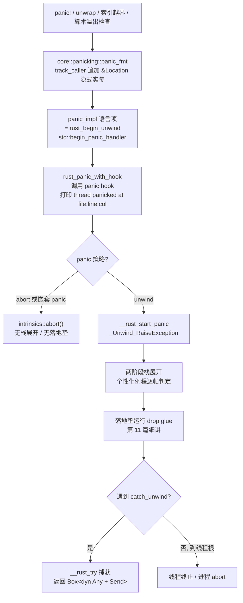
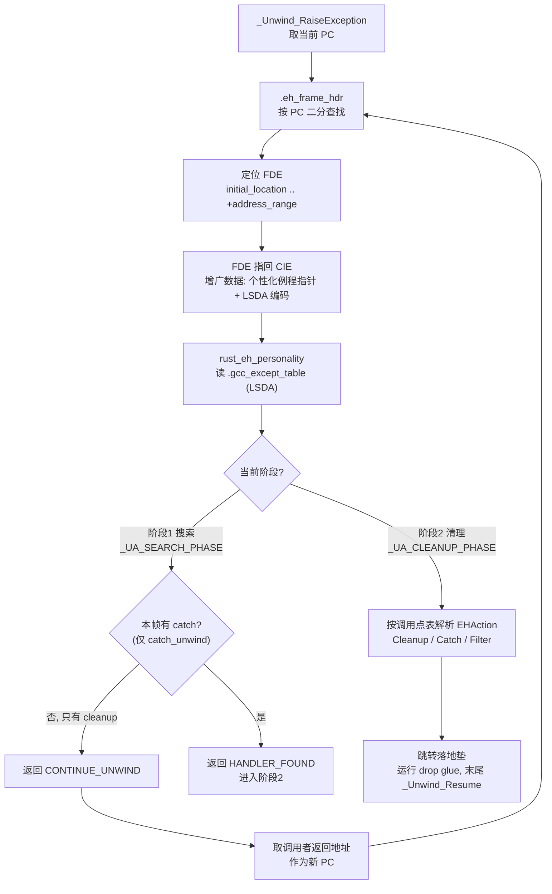

# Go与Rust现代二进制逆向（12）· Rust panic与unwind元数据
> [!abstract] TL;DR
> - panic 字符串是 Rust 逆向的头号锚点：`called Option::unwrap() on a None value`、`index out of bounds: the len is .. but the index is ..`、`attempt to add with overflow` 等标准文案直接暴露崩溃语义，配套的 `core::panic::Location` 结构（file/line/col）能把每个 panic 点映射回源码的文件与行列。
> - `#[track_caller]` 把 `&'static Location` 作为**隐式实参追加到调用约定尾部**，逆向时表现为 panic 系列函数（如 `panic_bounds_check(index, len, &loc)`）多出一个指向只读 24 字节结构的指针参数——顺着它就能还原源码坐标。
> - Rust 默认 `panic = "unwind"`，在 SysV/ELF 平台复用 Itanium 两阶段栈展开：`.eh_frame`（CIE/FDE，语言无关的寄存器恢复规则）+ `.gcc_except_table`（LSDA，语言相关的落地垫/调用点表），个性化例程 `rust_eh_personality` 把二者串起来。
> - `.eh_frame_hdr` 里按函数地址排序的二分查找表是一张事实上的**函数目录**，即便符号被 strip，也能用它恢复函数边界；`rust_eh_personality`、`_Unwind_Resume`、`__rust_begin_short_backtrace` 是识别 Rust 与裁剪栈回溯的稳定指纹。
> - MSVC 目标不走 DWARF，而是把 panic 伪造成 C++ 异常：经 `_CxxThrowException` 抛出、个性化例程用 `__CxxFrameHandler3`，元数据落在 `.pdata`/`.xdata`；`panic = "abort"` 则删掉落地垫、崩溃即 `abort`，二进制更小也更「干净」。
> - 安全面：内嵌的 `/rustc/<hash>/library/...` 与构建绝对路径会泄露 Rust 版本、用户名、项目结构；发布前应以 `-Cstrip`、cargo `trim-paths`、`--remap-path-prefix` 清理，极端场景用 `panic_immediate_abort` 抹掉全部格式化字符串。

## 概述与定位

本篇聚焦 Rust 二进制里两类彼此纠缠却又性质不同的产物：一是 **panic 触发路径与它携带的数据**（标准崩溃字符串、`Location` 位置表、panic 系列函数的调用形态），二是 **栈展开元数据**（SysV/ELF 上的 `.eh_frame` 与 `.gcc_except_table`，Windows 上的 `.pdata`/`.xdata`）。前者告诉逆向者「哪里、为什么会崩」，后者告诉运行时（也告诉逆向者）「崩了以后如何逐帧回溯、在哪运行析构、边界在哪」。二者叠加，构成 Rust 可执行文件里信息密度最高、也最难被优化抹掉的一片区域——因为字符串是数据、展开表是正确性所必需，编译器很难像折叠死代码那样把它们删干净。

在系列里，本篇承接第 09 篇《Rust二进制结构与编译模型》给出的段布局与符号约定、第 10 篇的单态化视角，尤其紧贴第 11 篇《Rust所有权在汇编层的痕迹》：**栈展开时真正运行的清理动作就是 drop glue**，而 drop 的识别与语义是第 11 篇的主题，本篇只把它当作「落地垫里被调用的东西」，不重复展开，重点放在**触发 panic 的入口、位置元数据的字节结构、以及展开器如何在这些表上导航**。本篇还自然衔接第 13 篇：panic 的载荷（payload）是 `Box<dyn Any + Send>`，本身就是一个 trait 对象，如何还原它留给下一篇的 vtable 专题。底层 ABI 层面则依赖 [[22.调用规约/06.SystemV_AMD64调用规约]] 与 [[23.C_C++运行时与ABI/01.运行时与ABI概览]]——两阶段展开的调用约定、CFA（规范帧地址）的计算，本质是对 SysV/Itanium ABI 的直接沿用。

为什么逆向者要专门盯着 panic 与 unwind？三条理由。其一，**panic 字符串抗优化、语义直白**：即使 release 全内联、符号全 strip，`called Result::unwrap() on an Err value: ` 这样的文案仍原样躺在 `.rodata`，交叉引用它就能定位到「此处在解包某个可能失败的操作」，是重建控制流意图的免费线索。其二，**`Location` 位置表能重建源码地图**：每个 panic 点都挂着一份 file/line/col，批量提取即可把成百上千个崩溃点还原成「地址 → 源文件:行:列」的映射，逼近一份最小化的调试信息，哪怕二进制里根本没有 DWARF。其三，**`.eh_frame` 恢复函数边界**：它的 `.eh_frame_hdr` 是一张按地址排序的函数目录，是 strip 后重建函数列表最可靠的手段之一，也是识别语言（`rust_eh_personality` vs `__gxx_personality_v0` vs Go 自带展开器）的指纹来源。理解这三者，等于拿到了 Rust 二进制的「语义索引 + 结构索引」。

## 原理与机制

**从 `panic!` 到栈展开，完整链路。** 一切 panic 最终汇聚到 `core::panicking::panic_fmt(fmt: fmt::Arguments) -> !`。无论是宏 `panic!("...")`、`unwrap`/`expect` 的失败分支、索引越界（`panic_bounds_check`）、还是 debug 下的算术溢出检查，编译器都把它们降低（lower）为对 `core::panicking` 里若干入口的调用，这些入口再统一走向 `panic_fmt`。`core` 只能**调用**却不能**定义**处理器：它声明了一个语言项 `#[lang = "panic_impl"] fn panic_impl(&PanicInfo) -> !`，具体实现由上层提供——`std` 把它实现为 `begin_panic_handler`，符号名 `rust_begin_unwind`；`no_std` 则要求用户用 `#[panic_handler]` 自己提供。这条「core 定义接口、std/用户定义实现」的分层，是理解符号走向的关键：**你在反汇编里看到 `core::panicking::*` 调用 `rust_begin_unwind`，就是跨过了 core→std 这道边界**。

进入 `std` 后，`begin_panic_handler` 构造 `PanicInfo`（含消息、`Location`、可否 unwind 的标志），交给 `rust_panic_with_hook`：它调用当前 panic hook（默认 hook 打印 `thread '<name>' panicked at <file>:<line>:<col>:` 加消息，并按 `RUST_BACKTRACE` 决定是否打印回溯），随后依据编译期策略分叉——若 `panic = "abort"` 或这是**嵌套 panic（panic 计数 > 1）**，直接 `intrinsics::abort()`；否则调用 `__rust_start_panic`，由 `panic_unwind` 运行时封装出 `_Unwind_Exception` 并调用 `_Unwind_RaiseException`，把控制权交给系统展开器。此后便是**两阶段栈展开**：个性化例程逐帧被询问、落地垫逐个运行 drop glue，直到某个 `catch_unwind` 帧捕获、或抵达线程根导致线程终止（`main` 无捕获则进程退出）。标准库还用 `__rust_begin_short_backtrace` / `__rust_end_short_backtrace` 这对空壳函数**夹住用户代码**，供回溯打印时裁掉运行时噪声帧——这两个符号在栈回溯与逆向里都是有用的锚。



**为什么是两阶段？** Itanium 异常模型把展开拆成「搜索阶段」和「清理阶段」：第一阶段（`_UA_SEARCH_PHASE`）只**询问不动手**，展开器自底向上走栈，对每个帧的个性化例程问「你这儿捕获吗」，找到捕获者才进入第二阶段（`_UA_CLEANUP_PHASE`）真正逐帧回退、运行析构、最后跳进捕获帧。这样设计的深层原因是**可判定性与状态一致性**：在动任何析构之前先确认「异常究竟会不会被接住」，若无人接住可以在栈完好、寄存器可打印的状态下直接 terminate（便于产出有意义的崩溃报告），而不是先毁掉半个栈才发现没人捕获。对 Rust 而言，只有 `catch_unwind`（以及线程根、`std::thread` 的入口）会在搜索阶段回答「捕获」，绝大多数普通帧只回答「我这儿有清理（cleanup），继续往上」。

**`panic = "unwind"` 与 `panic = "abort"` 是编译期的两副面孔。** 这是逆向时第一件要判定的事，因为它决定二进制的形状。`unwind`（默认）会为每个可能抛出的函数生成落地垫、`.gcc_except_table` 条目、引用 `rust_eh_personality` 与 `_Unwind_Resume`；`abort` 则把 panic 直接接到 `abort()`，**不生成落地垫、不运行 drop**（panic 路径上的局部变量不会被析构——这也是 `abort` 更小更快的代价），二进制里 `.gcc_except_table` 大幅萎缩甚至消失。注意一个易错点：`abort` 下 `.eh_frame` 的 **CFI 部分（栈回溯用）仍可能保留**，因为 backtrace 需要它；真正消失的是**落地垫与语言特定表**。是否强制保留展开表由 `-C force-unwind-tables` 控制。

**平台矩阵。** 同一套 panic 语义，落到不同目标是三种截然不同的元数据：

- **SysV/ELF（Linux、多数 Unix）**：DWARF 风格。`.eh_frame`（CIE/FDE，语言无关的寄存器恢复规则）+ `.gcc_except_table`（LSDA，语言相关）+ `rust_eh_personality`，底层调用 libgcc 或 LLVM libunwind 的 `_Unwind_RaiseException` / `_Unwind_Resume` / `_Unwind_Backtrace`。
- **Windows MSVC**：**不走 DWARF**。Rust 把 panic 伪造成一个 C++ 异常，用 `_CxxThrowException` 抛出，落地垫的个性化例程是 CRT 的 `__CxxFrameHandler3`，展开元数据是 SEH 的 `.pdata`（RUNTIME_FUNCTION 表）与 `.xdata`（UNWIND_INFO）。选 `__CxxFrameHandler3` 而非更通用的 `__C_specific_handler`（x64）/ `_except_handler3`（x86）是**刻意为之**：后两者会对**所有** SEH 异常（包括访问违例、非法指令）无条件运行清理，而 Rust 只想捕获自己抛的 panic，`__CxxFrameHandler3` 恰好只处理 `_CxxThrowException` 抛出的 C++ 异常，语义正好吻合。载荷 `Box<dyn Any+Send>`（两个指针）直接随 `_CxxThrowException` 传递，无需像 DWARF 路径那样额外堆分配。
- **Windows GNU / macORS / ARM**：windows-gnu 用 `_GCC_specific_handler` 把 SEH 桥到 GCC 风格个性化；macOS 把 `.eh_frame` 放进 `__TEXT,__eh_frame`，模型同 Itanium；ARM(EHABI) 则把展开表放在 `.ARM.extab`，`.ARM.exidx` 作为按函数排序的二分索引（相当于 ARM 版 `.eh_frame_hdr`），而 LSDA 因是「语言相关、架构无关」故格式与 x86_64 一致。

## 元数据结构与字节布局详解

### panic 字符串目录：逆向的语义锚点

标准 panic 文案是编译器/标准库写死的常量，静静躺在 `.rodata`（PE 为 `.rdata`，Mach-O 为 `__const`），被 `lea reg, [rip+off]` 之类的 PC 相对寻址引用。它们几乎是**只读的语义标签**，值得逆向者背下来一份目录：

- 解包类：`called \`Option::unwrap()\` on a \`None\` value`、`called \`Result::unwrap()\` on an \`Err\` value: `（末尾还会拼接错误的 `Debug` 输出，所以错误类型的 `Debug` 文本也常常一并出现在附近）。`expect` 则直接用用户传入的自定义消息，是**业务语义的直接泄漏**。
- 索引/切片类：`index out of bounds: the len is {} but the index is {}`、`range end index {} out of range for slice of length {}`、`range start index {} out of range for slice of length {}`、`slice index starts at {} but ends at {}`。
- 算术类（**仅 debug 或 `-C overflow-checks=on` 才生成**，故它们的存在本身就指示了构建 profile）：`attempt to add with overflow`、`subtract`/`multiply`/`negate`/`shift left`/`shift right` 同族，以及 `attempt to divide by zero`、`attempt to calculate the remainder with a divisor of zero`。
- 断言/占位类：`assertion failed: <expr>`、`assertion \`left == right\` failed`、`internal error: entered unreachable code`（`unreachable!`）、`not yet implemented`（`todo!`）、`not implemented`（`unimplemented!`）、`explicit panic`。
- 底层安全类：`misaligned pointer dereference`、`unsafe precondition(s) violated`、容量类 `capacity overflow`。

**为什么这些字符串这么难被优化掉？** 因为它们是被 `#[cold] #[inline(never)]` 的 panic 函数以数据形式引用的：编译器把「格式化 + 打印 + 展开」这堆重活集中到 `panic_fmt` 一处，正是为了让 `panic!()` 在调用点只留下「装配几个参数 + 一条 `call`」的最小足迹（减少对内联的污染），代价就是这些常量字符串必须实打实存在于只读段供其读取。逆向时的正确姿势：**先在字符串窗口锁定这些文案，再对每一条做交叉引用**，引用它的那个 `.cold` 分支往往就是某个关键操作（解包、索引、断言）的失败路径，顺藤摸瓜即可标注出成功路径的语义。

### `Location` 结构与 `#[track_caller]` 的隐式实参 ABI

每一个 panic 点都关联一份 `core::panic::Location`，这是把崩溃映射回源码的钥匙。它的定义与字段序（`file` → `line` → `col`）由语言项 `#[lang = "panic_location"]` 固定，编译器亲自合成这些常量、标准库亲自读取，故其内存布局是**编译器与 std 之间的事实契约**（尽管它不是 `repr(C)`、Rust 不对私有字段的布局作稳定承诺，实测二进制里稳定呈现为下列 24 字节形态）：

```
core::panic::Location  （x86_64，实测布局，位于 .rodata）
+0x00  file_ptr : *const u8   → 指向文件名字符串（同在 .rodata）
+0x08  file_len : usize       → 文件名字节长度
+0x10  line     : u32         → 行号（1 起）
+0x14  col      : u32         → 列号（1 起）
                               共 24 字节
```

关键机制在 `#[track_caller]`：被它标注的函数（`panic`、`panic_fmt`、`panic_bounds_check`、`unwrap`/`expect` 等）在 **ABI 层被追加一个隐式尾参 `&'static Location<'static>`**，指向「最外层非 track_caller 调用点」的位置。这解释了逆向时一个常见困惑——为什么 `panic_bounds_check` 明明源码写着两个参数（index、len），反汇编里却传了三个实参？第三个 `rdx`（SysV 第 3 参数寄存器）正是这枚指向 `Location` 的指针。`Location::caller()` 就是把这枚隐式实参读出来的入口，它沿调用链上溯，止步于第一个非 track_caller 的调用点，从而让 `v.unwrap()` 的崩溃报告指向**用户写 `unwrap` 的那一行**，而不是 core 内部。

```asm
; let x = v[i];  —— 越界检查内联在调用点
    cmp     rsi, rbx            ; i (rsi) 与 len (rbx) 比较
    jb      .in_bounds
    ; 越界：装配 panic_bounds_check 的实参
    mov     rdi, rsi            ; 参数1: index
    mov     rsi, rbx            ; 参数2: len
    lea     rdx, [rip+.L_loc]   ; 参数3: &Location  ← track_caller 隐式实参
    call    core::panicking::panic_bounds_check
.in_bounds:
    ...
.L_loc:                          ; 只读 24 字节 Location
    .quad   .L_file              ; file_ptr
    .quad   0x14                 ; file_len = 20
    .long   42                   ; line
    .long   9                    ; col
.L_file:
    .ascii  "src/handler/parse.rs"
```

**逆向的杀手锏由此而来**：对每一个 panic 系列函数的调用，取其最后一个指针实参 → 解引用出 24 字节 `Location` → 读出 file/line/col。批量做完，就得到一张「代码地址 → 源文件:行:列」的映射，等价于**一份从数据里榨出来的、最小化的行号表**——哪怕二进制根本没有 DWARF 调试信息。这一点是 Rust 相较 C/C++ 的独特馈赠：C 的 `assert` 也内嵌 `__FILE__/__LINE__`，但 Rust 把它系统化、结构化，几乎每个可能 panic 的标准库操作都自带精确坐标。

### 两阶段栈展开与个性化例程 `rust_eh_personality`

`rust_eh_personality`（`#[lang = "eh_personality"]`）是把语言无关的 `.eh_frame` 与语言相关的 `.gcc_except_table` 缝合起来的枢纽。其 C ABI 签名接收版本、动作标志（actions）、异常类别、异常对象、上下文，返回 `_Unwind_Reason_Code`；在非 Windows 上它委托给内部实现，通过 `_Unwind_GetLanguageSpecificData` 拿到当前帧的 LSDA、`_Unwind_GetRegionStart` 拿到函数起址，再解析出该 PC 对应的 `EHAction`：`Cleanup(lpad)`（有析构要跑）、`Catch(lpad)`（catch_unwind 的落地垫）、`Filter`（`_UA_FORCE_UNWIND` 下继续）、或「无动作，继续上抛」。



Rust 的落地垫**绝大多数是 cleanup（跑 drop），极少是 catch**——因为 Rust 没有 C++ 那种按类型 `catch (T&)` 的语义，它只有「运行析构」与「在 `catch_unwind` 处一把接住任意 Rust panic」两种。捕获匹配靠**异常类别**（`_Unwind_Exception.exception_class`）识别是不是「自家的」panic：Rust 的类别常量历史上是 8 字节 `MOZ\0RUST`（即 `0x4d4f5a_00_52555354`，源自早期 Mozilla），这串魔数在展开器数据里是一枚极好的 Rust 指纹。`catch_unwind` 内部由 `__rust_try` 内建（intrinsic）实现：它对应一个带落地垫的 `try`，捕获到后把载荷 `Box<dyn Any + Send>` 交回调用者。

### `.eh_frame` / `.eh_frame_hdr` 字节布局与函数目录

`.eh_frame` 是 CIE 与 FDE 记录的序列。CIE（公共信息条目）描述一组函数共享的展开约定，FDE（帧描述条目）描述单个函数的地址范围与增量 CFI 指令：

```
CIE: length | CIE_id(=0) | version | augmentation("zPLR") |
     code_align(ULEB) | data_align(SLEB) | return_addr_reg |
     aug_data{ personality_enc, personality_ptr(→rust_eh_personality),
               LSDA_enc, FDE_enc } | 初始 CFI 指令
FDE: length | CIE_ptr(≠0, 反向偏移到所属 CIE) |
     initial_location(函数起址 PC) | address_range(函数字节长度) |
     aug_data{ LSDA_ptr(→.gcc_except_table 某条 LSDA) } | 增量 CFI 指令
     ★ initial_location + address_range = 函数区间 → 恢复函数边界
```

对逆向最有价值的是 `.eh_frame_hdr`（由 program header `PT_GNU_EH_FRAME` 指向）：它头部四字节给出各字段编码，随后是 `eh_frame_ptr`、`fde_count`，再跟一张**按函数起址升序排列的二分查找表**——运行时用它 O(log n) 从 PC 定位 FDE，而逆向者用它枚举出**几乎所有函数的起址**。这就是为什么 strip 掉符号表后 IDA/Ghidra 仍能自动划出大量函数：它们在解析 `.eh_frame`。

```
.eh_frame_hdr（ELF，PT_GNU_EH_FRAME 指向它）
+0x00  version         : u8   = 1
+0x01  eh_frame_ptr_enc: u8        // 常见 DW_EH_PE_pcrel|sdata4
+0x02  fde_count_enc   : u8        // 常见 DW_EH_PE_udata4
+0x03  table_enc       : u8        // 常见 DW_EH_PE_datarel|sdata4
+0x04  eh_frame_ptr    : i32       // 指向 .eh_frame 起始
+0x08  fde_count       : u32       // FDE 数量 ≈ 函数数量
+0x0c  二分查找表[fde_count]：
         { initial_location : i32,   // 函数起址（相对 hdr）
           fde_ptr          : i32 }  // 对应 FDE（相对 hdr），按 initial_location 升序
       —— 等价一张 O(log n) 可检索的函数目录
```

### LSDA / `.gcc_except_table`：落地垫与调用点表

LSDA 沿用 `__gxx_personality_v0` 系风格：一段头部编码 + 调用点表 + 动作表 + 类型表。调用点表把函数内每个「可能抛出的区间」映射到落地垫地址与动作；Rust 由于是 catch-any，类型表几乎为空，动作绝大多数是 cleanup：

```
.gcc_except_table 中一条 LSDA
  lpstart_enc            : u8            // 落地垫基址编码, 常 DW_EH_PE_omit
 [lpstart]                              // 省略则 = _Unwind_GetRegionStart(FDE 起址)
  ttype_enc              : u8            // 类型表编码
 [ttype_off : ULEB]                     // 到类型表偏移（Rust catch-any, 常空）
  cs_enc                 : u8            // 调用点表编码
  cs_table_len : ULEB
  调用点表[]：{ cs_start, cs_len, cs_lpad, action }  // 每个可抛出的调用区间
  动作表[]  ：ULEB 链 → 类型过滤器索引
  类型表[]  ：catch 匹配用（Rust 主要 cleanup, 几乎不用）
```

### 内嵌路径与版本指纹

`Location` 里的文件名字符串常常暴露**构建环境的绝对路径**：标准库自身的 panic 点携带 `/rustc/<40 位十六进制 commit hash>/library/core/src/...`（以及 `std`/`alloc`），这枚 hash 唯一对应一个 rustc 版本——把它拿去 rustc 的发布记录一查，就锁定了编译器版本乃至 nightly 日期。用户代码的 panic 点则可能带 `src/main.rs` 这样的相对路径，或 `/home/<用户名>/projects/<项目名>/src/...`、`C:\Users\<用户名>\...` 这样的**绝对构建路径**，直接泄露开发者用户名与项目结构。对逆向者是情报，对开发者是需要在发布前清理的隐私面（见「安全性与正确使用」）。

## 工具视角与实战

**转储展开表。** ELF 上 `readelf --debug-dump=frames <bin>`、`objdump --dwarf=frames <bin>`、`llvm-dwarfdump --eh-frame <bin>` 都能把 CIE/FDE 解出来；`readelf -S` 先确认 `.eh_frame` / `.eh_frame_hdr` / `.gcc_except_table` 是否存在，PE 上则看 `.pdata` / `.xdata`（`dumpbin /UNWINDINFO` 或 llvm-readobj `--unwind`）。PE/COFF 的异常目录、`RUNTIME_FUNCTION` 表是 Windows 版的「函数目录」，作用等同 `.eh_frame_hdr`。

**恢复函数边界与识别语言。** IDA/Ghidra 载入 ELF 时会自动解析 `.eh_frame` 建函数；若目标被 strip，手动确认 `.eh_frame_hdr` 的 `fde_count` 与二分表往往能把函数总数与起址一次性捞出。个性化例程符号是语言指纹：`rust_eh_personality`（Rust）、`__gxx_personality_v0`（C++）、Go 自带运行时展开（无这套 DWARF 个性化）——三者一眼可分。看到 `__CxxFrameHandler3` + `_CxxThrowException` + Rust 风格 panic 字符串，基本可判定是 **MSVC 目标的 Rust**。

**从 panic 字符串反推语义。** 用 `rabin2 -z`、`strings`、或 IDA/Ghidra 的字符串窗口锁定标准文案，逐条做交叉引用：引用 `index out of bounds...` 的分支必是某次切片索引的失败路径，引用 `called Result::unwrap() on an Err value: ` 的地方必在解包某个 `Result`，其上文往往是一次 IO/解析/系统调用。把 `core::panicking::panic`、`panic_fmt`、`panic_bounds_check` 的全部调用者列出来，就得到一张「程序里所有会崩的点」的清单，是快速摸清错误处理骨架的捷径。

**脚本化提取 `Location` 源码地图。** 写一段 IDAPython/Ghidra 脚本：遍历上述 panic 函数的 xref，在每个调用点回溯出最后一个指针实参（`lea rdx/rcx/... , [rip+off]` 的目标），把该地址当作 24 字节 `Location` 解析——读 `file_ptr`（再解引用取字符串）、`file_len`、`line`、`col`，即可产出「代码地址 → 源文件:行:列」的表。这一步把散落的位置常量聚合成可读的伪源码地图，对没有 DWARF 的 release 二进制尤其增益。相较之下，Go 有第 07 篇讲的 GoReSym 这类现成利器直接还原 `gopclntab`；Rust 生态**缺少同等级的一键工具**，但 `.eh_frame` 的函数目录 + panic 字符串 + `Location` 位置表恰好是三者的手工等价物，配合 IDA 的 Rust 符号 demangler（`_ZN...` legacy 与 `_R...` v0 两种命名，见第 09 篇），已能走很远。

**判定 unwind vs abort。** 有 `.gcc_except_table` / 落地垫 / `_Unwind_Resume` / `rust_eh_personality` → `panic = "unwind"`；panic 打印后紧跟 `abort`、且无落地垫 → `panic = "abort"`（此时也别指望在崩溃路径上看到 drop）。这直接影响你对「异常安全」相关逻辑的判断，也影响能否用 `catch_unwind` 边界推断模块划分。`__rust_begin_short_backtrace`/`__rust_end_short_backtrace` 若在，则说明保留了标准回溯逻辑，动态调试时可用 `RUST_BACKTRACE=1`/`full` 让程序自己吐出符号化栈（前提是符号或行号信息尚存）。

## 安全性与正确使用

**信息泄露是本机制最现实的安全影响。** panic 字符串与 `Location` 会把**源文件绝对路径、开发者用户名、项目名与目录结构、Rust 版本（rustc commit hash）、以及内部不变量（断言文本、错误消息）**原样带进发布产物——固件、闭源二进制、被分析的样本莫不如此。这不是漏洞，却是货真价实的**无意披露（unintended disclosure）**：它降低攻击者的逆向成本、可能暴露内部路径命名规律、偶尔还会把敏感的业务错误文案直接印在二进制里。正确的加固边界：release 用 `-C strip=symbols`/`debuginfo` 去符号；用 cargo 的 `[profile.release] trim-paths = "..."`（Rust 1.77+ 稳定）把 `/rustc/...` 与工作目录前缀重映射；或直接 `RUSTFLAGS="--remap-path-prefix=/home/me=."`。要**彻底**抹掉格式化字符串，需上 `panic_immediate_abort` 特性（配合 build-std 重编标准库），它把 panic 直接降为 `abort`、删除格式化机器，字符串与位置表大面积消失——这是尺寸敏感/高保密构建的最强手段，代价是**丢失一切崩溃诊断信息**。

**不要指望「删掉 `.eh_frame` 来加固」。** 一个常见误区：既然展开表帮了逆向者，能不能删掉它？答案是——**在 `panic = "unwind"` 下不能**。展开表是正确性所必需：运行时靠它逐帧回退、运行析构、执行 `catch_unwind`；删了它，展开器无法前进，轻则 `abort`、重则未定义行为，程序的异常处理直接崩坏。合法的杠杆只有两个：要么接受 `panic = "abort"`（放弃跨帧展开与析构运行，换取更小更「干净」的二进制），要么用 `trim-paths`/`--remap-path-prefix` 在保留功能的前提下只削减泄露。把这条边界讲清楚，能避免「为混淆而破坏运行时」的错误加固。

**跨 FFI 展开的正确性与安全。** 让 panic 穿过 `extern "C"` 边界曾是未定义行为；自 Rust 1.81 起，这种情形会**被拦截为立即 `abort`**（配套文案 `panic in a function that cannot unwind`），把 UB 变成确定性崩溃——这是防御性的正确默认。若确实需要跨语言受控展开，应显式用 `extern "C-unwind"`（RFC 2945）声明边界允许 unwind，并在 C++/Rust 两侧都用支持展开的 ABI。另需注意 **嵌套 panic 立即 `abort`**（析构里再 panic 会触发），以及 `catch_unwind` 的 `UnwindSafe` 约束：捕获后要小心别把「展开到一半、不变量已破」的状态泄漏出去。

**可用性与攻击面视角。** 展开元数据是**双刃的**——它同样便利攻击者做逆向、打补丁、下 inline hook（有了精确函数边界，patch 更省事），但它本身不是可被利用的漏洞，LSDA 里的落地垫地址在常规威胁模型下不受攻击者控制。更实际的安全问题是 **panic 即拒绝服务**：若攻击者能用畸形输入触发可达的 `unwrap`/`expect`/越界索引，就能让线程或进程崩溃——因此在处理不可信输入的路径上，把 `unwrap`/`expect`/裸索引视为健壮性乃至可用性缺陷，改用 `?`、`get`、显式错误处理，是本机制给安全编码的直接告诫。恶意样本分析场景（见 [[50.恶意代码分析与免杀对抗/00.恶意代码分析与免杀对抗总览]]）里，部分加壳器会 strip 或重写 `.eh_frame`/`.gcc_except_table` 以妨碍分析——但那等于强行把程序推向 `abort` 语义甚至破坏展开，反而是它们「用了 Rust 却不敢真展开」的破绽。

## 小结

Rust 的 panic 与 unwind 元数据，对逆向者是三族高价值产物的合流：**panic 字符串 + `Location` 位置表**给出「哪里、为什么崩」的语义索引，且抗优化、能反推源码坐标；**`.eh_frame`/`.eh_frame_hdr` + `.gcc_except_table`**（Windows 上是 `.pdata`/`.xdata` + `__CxxFrameHandler3`）给出函数边界与展开规则，是 strip 后重建结构的骨架；**个性化例程与展开器符号**（`rust_eh_personality`、`_Unwind_Resume`、`_CxxThrowException`、`MOZ\0RUST` 异常类别）则是识别 Rust 及其平台/版本的指纹。理解 `#[track_caller]` 如何把 `&Location` 塞进调用约定尾部、两阶段展开如何在 CIE/FDE/LSDA 上导航、`unwind` 与 `abort` 如何塑造两副不同的二进制面孔，就能把这片区域从「看不懂的表」变成「随手可查的语义 + 结构双索引」。下一篇转向 panic 载荷 `Box<dyn Any>` 背后的机制——trait 对象与 vtable 的还原。

## 相关阅读

- 同系列：[[00.Go与Rust现代二进制逆向总览|⬆ 系列总览]] · [[11.Rust所有权在汇编层的痕迹]]（栈展开时运行的 drop glue）· [[13.Rust-trait对象与vtable还原]]（panic 载荷 `Box<dyn Any>` 即 trait 对象）· [[09.Rust二进制结构与编译模型]]（段布局与符号命名）· [[10.Rust单态化与泛型膨胀]] · [[07.Go逆向工具：GoReSym与IDA脚本]]（Go 侧对照）。
- ABI 基础：[[23.C_C++运行时与ABI/01.运行时与ABI概览]] · [[22.调用规约/06.SystemV_AMD64调用规约]]。
- 同族对照：[[36.Objective-C与iOS运行时/01.Objective-C运行时概览]]（元数据驱动的运行时可与 Swift/Rust 对照）。
- 应用场景：[[50.恶意代码分析与免杀对抗/00.恶意代码分析与免杀对抗总览]]（Go/Rust 恶意样本的展开表与字符串泄露）。
- 官方与规范：The Rustonomicon「Unwinding」章 · `std::panic` / `core::panic::Location` / `core::panicking` 标准库文档 · RFC 2070（panic implementation）、RFC 2945（`C-unwind` ABI）、RFC 1513（自定义 panic 运行时）· 《Itanium C++ ABI: Exception Handling》（两阶段展开与 `.gcc_except_table`/LSDA 规范）· DWARF 标准的 Call Frame Information（CFI）章 · LLVM「Exception Handling in LLVM」文档 · Ian Lance Taylor 的 `.eh_frame` / `.gcc_except_table` 系列博文（Airs）。

[[00.Go与Rust现代二进制逆向总览|⬆ 系列总览]] | [[11.Rust所有权在汇编层的痕迹|← 上一章]] | [[13.Rust-trait对象与vtable还原|→ 下一章]]