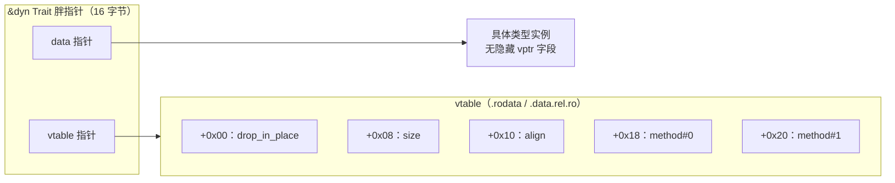
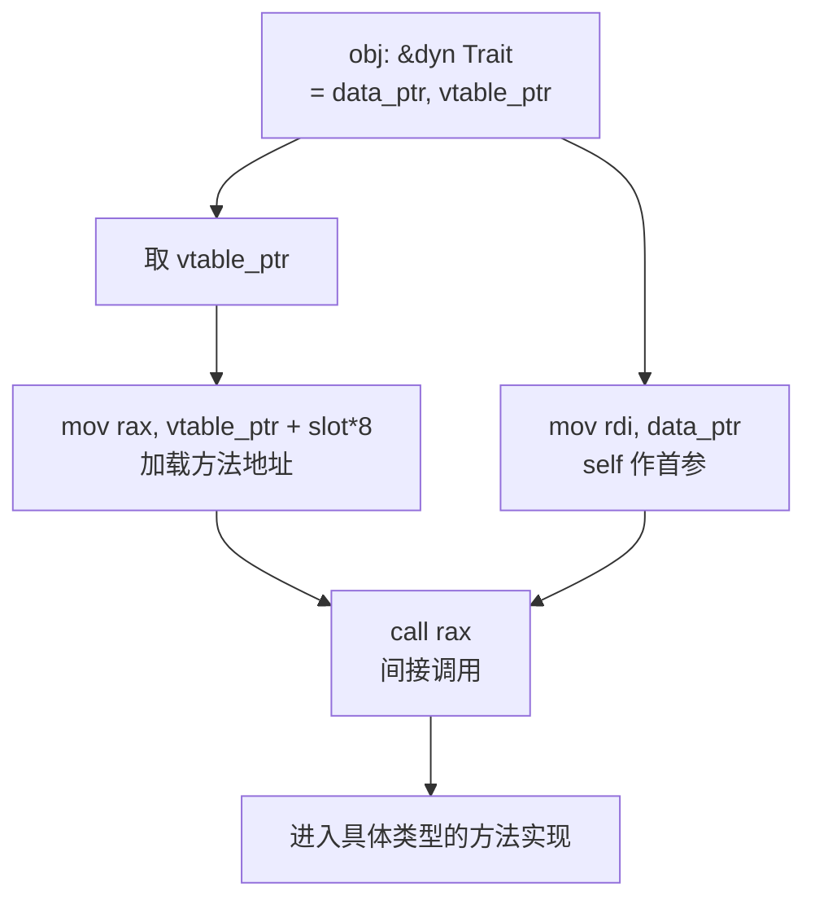
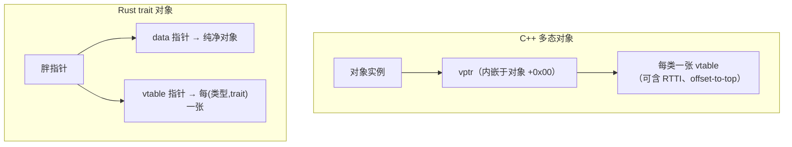
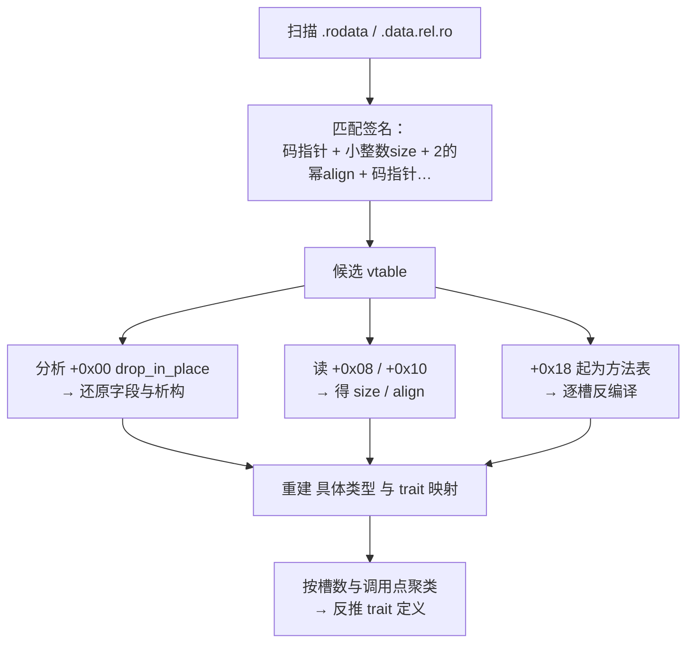

# Go与Rust现代二进制逆向（13）· Rust-trait对象与vtable还原
> [!abstract] TL;DR
> - `dyn Trait` 引用是**胖指针**：`(数据指针, vtable 指针)`，64 位下 16 字节；对象本身**不含**隐藏 vptr，这是与 C++ 最本质的布局差异。
> - Rust vtable 固定以三元头部 `[drop_in_place, size, align]` 开场，随后才是按序排列的 trait 方法指针——「码指针 + 两个小整数 + 一串码指针」是识别 vtable 的黄金签名。
> - 动态分发在汇编里表现为「从固定偏移（≥0x18）加载函数指针后 `call`」，而 vtable 地址通过 `lea rip+const` 烘焙进 unsizing 强制转换点。
> - 分辨胖指针的两种族群：第二字是 `.rodata` 常量地址→trait 对象；第二字是运行期算出的长度→切片（`&[T]`/`&str`）。
> - 在被单态化「抹平」的 Rust 二进制里，vtable 是少数幸存的结构化元数据「孤岛」：一条 `drop_in_place` 就能反推具体类型的字段与析构逻辑。
> - 供给侧风险与 C++ 同源：可写内存中的 vtable 指针被篡改即等于**控制流劫持**，`unsafe`/FFI 边界让 Rust 的类型安全无法兜底，需靠 CFI 前向边保护。

## 概述与定位

Rust 有两条多态路径。一条是**静态分发**：泛型经单态化在编译期为每个具体类型各生成一份代码（见 [[10.Rust单态化与泛型膨胀]]），运行期没有任何间接跳转，但会带来代码膨胀。另一条是**动态分发**：把「具体是什么类型」擦除掉，只保留「它能做什么」，用 `dyn Trait` 表达。本篇专讲后者，以及它在二进制里留下的两样东西——胖指针与 vtable，如何被逆向还原。

为什么逆向者要特别重视 vtable？因为 Rust 是一门「元数据吝啬」的语言。与 Go 截然相反（Go 把类型名、方法集、gc 位图都塞进运行时，见 [[04.Go类型系统元数据恢复]]），Rust 的 release 构建把泛型单态化、把类型名抹掉、把 trait 约束在编译期消解，最终二进制里几乎不存在「类型系统」的痕迹。**唯独 trait 对象是例外**：只要程序用了 `dyn Trait`，编译器就必须在只读数据段里留下一张张 vtable，每张都实打实地写着某个具体类型的析构入口、大小、对齐和方法地址。因此 vtable 是被抹平的 Rust 二进制中少见的「结构化孤岛」——顺着它，逆向者能反推出类型布局、方法归属，乃至整套 trait 的形状。

从定位上说，本篇承接 [[09.Rust二进制结构与编译模型]] 的段布局知识、[[22.调用规约/06.SystemV_AMD64调用规约]] 的寄存器传参约定，并与 [[36.Objective-C与iOS运行时/01.Objective-C运行时概览]] 形成对照——Objective-C 靠 `objc_msgSend` 的动态查表，Swift 有 witness table，C++ 有内嵌 vptr，而 Rust 走「外挂式胖指针」。理解这几种 vtable 方言的异同，是跨语言二进制分析的基本功。

## 原理与机制

### 胖指针：把「身份」与「行为」拆开

普通引用 `&T` 是一个机器字（8 字节）的瘦指针。而 `&dyn Trait` 是**胖指针（fat pointer / wide pointer）**，占两个机器字：

- **数据指针**：指向具体对象实例本身；
- **vtable 指针**：指向一张为「该具体类型 as 该 trait」量身生成的静态虚表。

关键在于——**对象实例里没有任何隐藏字段**。一个 `struct Foo { x: i32 }` 无论被多少个 trait 对象引用，它在内存里永远只是那 4 字节，没有 vptr 前缀。「我是谁」由数据指针承载，「我作为 Trait 该怎么表现」由 vtable 指针承载，两者在胖指针里并列。这解释了 Rust 一个招牌能力：**任何类型都能被强制成 trait 对象，无需在定义时预留虚表槽**。C++ 里一个类要多态就必须含虚函数、就得背上 vptr；Rust 里 `dyn` 的成本只在你真正用它时才付，是「零成本抽象」哲学的直接体现。

Rust 里胖指针其实有**两个族群**，逆向时务必分清：

1. **trait 对象指针**：`(data, vtable)`，第二字是指向 `.rodata` 的常量地址；
2. **切片/字符串指针**：`&[T]`、`&str` 也是胖指针，但形态是 `(data, len)`，第二字是运行期的**长度计数**（一个 `usize`，见 [[05.Go字符串与切片与接口还原]] 里对切片头的类比讨论）。

两者宽度相同、寄存器分配相同，肉眼看汇编很容易混淆。区分靠语义：vtable 那一字是编译期常量、由 `lea [rip+off]` 指进只读段；长度那一字是算出来的、会随运行变化。这条判据后面实战节还会反复用到。

### vtable 的三元头部与方法表

Rust 的 vtable 布局虽属「未稳定的实现细节」，但其骨架长期稳定，形如一个 C 结构体：

```
struct VTable {
    drop_in_place: fn(*mut ()),   // +0x00：析构 glue
    size:  usize,                 // +0x08：具体类型字节大小
    align: usize,                 // +0x10：具体类型对齐
    method0: fn(...),             // +0x18：第一个可分发方法
    method1: fn(...),             // +0x20：第二个……
    // ...
}
```

三元头部 `[drop_in_place, size, align]` 恒定出现，之后才是 trait 方法。为什么要塞进 size 和 align？因为 `Box<dyn Trait>` 释放时，具体类型已被擦除，分配器却需要知道要归还多大、多对齐的内存——这份信息只能提前存进 vtable。同理 `drop_in_place` 要在类型被擦除后仍能正确析构各字段，也必须以函数指针形式挂在虚表上。这三者共同构成了 `std::ptr::DynMetadata` 对外暴露的 `size_of()` / `align_of()` 的数据来源。

对逆向而言，这个头部是**最强签名**：连续内存里出现「一个指向代码段的指针，紧跟两个小整数（其中第三个还必是 2 的幂），再跟一串指向代码段的指针」，几乎可断定是 Rust vtable。注意 `drop_in_place` 槽在现代 rustc 里**始终非空**：即便类型无需清理，编译器也会生成一个平凡（直接返回）的 `drop_in_place::<T>`，所以该槽稳定是码指针，不会破坏「首字为代码地址」的假设。

### vtable 存放位置与重定位

vtable 是编译期常量，天然属于只读数据：

- 非 PIE / 静态链接：多落在 `.rodata`；
- Linux PIE（现代默认）：因为 vtable 内含**绝对地址**（drop、方法指针），需要装载期重定位，故通常落在 **`.data.rel.ro`**——一个「重定位后只读」的段，指针以 `R_X86_64_RELATIVE` 相对重定位或经 GOT 解析。逆向时若在 `.rodata` 找不到 vtable，务必转看 `.data.rel.ro`。

### unsizing 强制转换：vtable 何时被「烘焙」进代码

`let d: &dyn Trait = &foo;` 这类从 `&Foo` 到 `&dyn Trait` 的转换叫 **unsizing coercion（去尺寸化强制转换）**。编译器此刻同时知道具体类型和目标 trait，于是在该处插入对应 vtable 静态的地址。汇编里就是一条把 `.rodata`/`.data.rel.ro` 地址装入寄存器的 `lea`，其后该地址被当作胖指针的第二字。**找到这些指向只读段的 `lea`、且其结果参与构造 16 字节值，就是定位「trait 对象诞生点」的抓手。**

### 对象安全（dyn 兼容性）决定谁有 vtable

不是所有 trait 都能做成对象。只有满足**对象安全（object safety，新术语称 dyn compatibility）**的 trait 才有 vtable：方法须能通过指针分发——不能有泛型类型参数（无法单态化进单一槽位）、不能以值返回 `Self`、带 `where Self: Sized` 的方法会被排除出虚表。逆向含义很直接：**看到 vtable，就说明对应 trait 是对象安全的**；那些 `Self: Sized` 的辅助方法不会出现在表里，别指望能在 vtable 中找到它们。

## vtable 布局与动态分发指令详解

### 字节级视图

以一个 `size=24, align=8` 且实现了 `Display` 的 `MyStruct` 为例，64 位小端下其 vtable 的十六进制视图：

```
偏移      宽度   内容
+0x00     8      &core::ptr::drop_in_place::<MyStruct>   // 析构 glue（无 Drop 时为平凡函数）
+0x08     8      0x0000000000000018                       // size = 24
+0x10     8      0x0000000000000008                       // align = 8
+0x18     8      &<MyStruct as Display>::fmt              // 首个 trait 方法
// trait 若有更多方法，则 +0x20、+0x28 依声明序继续排布
```

夹在一堆代码指针中间的 `0x18` 与 `0x08` 两个「异类小整数」，正是人眼和脚本都易于锁定的锚点。

### 胖指针与虚表的关系图



### 动态分发的指令形态

调用 `obj.method(args)`（`obj: &dyn Trait`）时，ABI 只把**数据指针**当作 `self` 传给具体方法；vtable 指针只用于查表、并不传进被调函数（被调的是具体类型的普通方法，它只认得具体 `&self`）。典型汇编：

```asm
; 设 rsi = vtable 指针，某寄存器持 data 指针
mov     rax, rsi                 ; 取 vtable 基址
mov     rcx, [rax + 0x28]        ; 从槽位加载 method 地址（0x28 = 头部0x18 + 8）
mov     rdi, <data_ptr>          ; self 作第一个参数
mov     rsi, <arg1>              ; 其余实参
call    rcx                      ; 间接调用 —— 动态分发的标志
```

「从某指针的**固定偏移**（且偏移 ≥0x18）加载出一个地址、立刻 `call` 它」——这就是动态分发的指纹。偏移 0x18/0x20/0x28…… 能直接换算出方法在 trait 里的**声明序号**：`slot = (offset - 0x18) / 8`。



### 通过 vtable 的析构与 Box 释放序列

`Box<dyn Trait>` 析构是另一段可识别模式：先经 `[vtable+0x00]` 调 `drop_in_place(data)`，再读 `[vtable+0x08]`（size）、`[vtable+0x10]`（align）喂给分配器的 free。逆向看到「间接 call 头槽 + 随后从 +8/+16 取值传入释放函数」，即可判定这是 trait 对象的 drop 逻辑。反过来，`drop_in_place` 函数体本身极有价值：它逐字段析构，等于把**具体类型的字段布局**摊开给你看——哪几个字段是 `String`/`Vec`（会再调各自 drop）、哪些是 POD、总大小与 size 是否吻合，都能借此还原。

### 方法排序、supertrait 与 trait upcasting

单一无父 trait 时，方法在头部之后按声明序排布。涉及 **supertrait**（`trait Sub: Super`）时情况更丰富：`dyn Sub` 必须也能调用 `Super` 的方法。自 **Rust 1.86（2025）** 稳定 **trait upcasting** 后，`Sub` 的 vtable 会在自身方法之外，**内嵌指向同一具体类型 `Super` vtable 的指针**，从而支持把 `&dyn Sub` 上转型成 `&dyn Super`（做法是把胖指针的第二字换成 supertrait 的 vtable 地址）。逆向遇到「vtable 槽位里出现指向**另一张 vtable**（而非代码段）的指针」时，应识别为 supertrait 上转型入口，而非普通方法。

自动 trait（`Send`/`Sync` 等标记 trait）**不占虚表槽**：`dyn Trait + Send + Sync` 与 `dyn Trait` 复用同一张 vtable。所以别被 `+ Send` 误导以为方法变多了。

### `Any` 与向下转型

`dyn Any` 的 vtable 含一个返回 `TypeId`（128 位类型哈希）的方法，`downcast_ref::<T>()` 就是比对 `self.type_id() == TypeId::of::<T>()`。逆向看到「某 vtable 方法返回一个 16 字节常量、随后与另一个常量比较相等再决定分支」，多半是 `Any` 的向下转型现场；那个常量就是目标类型的 `TypeId`，可作类型指纹。

### 闭包也是 trait 对象

`Box<dyn Fn(..)->..>` 同样走胖指针 + vtable：闭包被编译成一个匿名结构体（捕获变量即其字段），并自动实现 `Fn`/`FnMut`/`FnOnce`。所以「一张 vtable 的唯一方法接收 self 加若干参数、且该 self 结构体字段像是被捕获的上下文」，往往就是闭包对象。回调、事件处理器在 Rust 里常以此形态出现。

### 与 C++ 虚表的深层对比



差异根源在设计取向：C++ 把 vptr **嵌进对象**，一个对象只有一张主 vtable（多继承另说），代价是「要多态就得预先设计虚函数、每个实例背 8 字节 vptr」。Rust 把虚表**外置到胖指针**，同一个类型可被任意多个 trait 各配一张 vtable，实例本身零负担；代价是引用变宽（16 字节）、且无法像 C++ 那样从「一个瘦对象指针」直接找到虚表。这也导致：C++ 逆向常从对象首字段回溯 vtable，Rust 逆向必须从**胖指针的第二字**或 unsizing 处的 `lea` 入手。此外 C++ vtable 前常挂 RTTI/`offset-to-top`，Rust 则用 `drop/size/align` 三元头替代——两者头部语义完全不同，跨语言分析切勿套用同一模板（ABI 背景见 [[23.C_C++运行时与ABI/01.运行时与ABI概览]]）。

## 工具视角与实战

Rust 逆向没有 Go 的 gopclntab（[[03.gopclntab与函数符号恢复]]）那种「一站式」符号宝库，更依赖启发式。落地手法：

1. **扫描只读段找 vtable**。在 `.rodata` 与 `.data.rel.ro` 上滑窗匹配签名：`[指向.text的指针][小整数 size][2的幂 align][≥1 个指向.text的指针]`。IDA/Ghidra/Binary Ninja 都可脚本化——遍历段内每个 8 字节对齐位置，验证第 0 字在代码段、第 1 字为合理小整数、第 2 字为 2 的幂且 ≤ 4096，之后连续 N 字均落在代码段。命中即候选 vtable。

2. **从 `drop_in_place` 还原类型**。反编译头槽指向的函数，看它对 `self` 各偏移调用了哪些 drop（`String`/`Vec`/`Box` 各有特征 drop），据此重建字段类型与偏移；size/align 用来交叉校验。

3. **逐个反编译方法槽**，`slot = (off-0x18)/8` 标注方法序号。

4. **聚类反推 trait**。把「方法个数相同、且在相同调用点被间接调用」的 vtable 归为一族——它们大概率对应同一个 trait；每张 vtable 的具体类型由其 `drop_in_place` 揭示。于是可重建「trait X 有 k 个方法，被类型 A（size 24）、B（size 8）实现」这类事实。



**符号与去混淆**：若二进制未 strip，vtable 常带可解符号。用 `rustfilt` / `rustc-demangle` 反解 v0（或 legacy）mangling，多呈 `<alloc::string::String as core::fmt::Display>` 这类 `<类型 as trait>` 路径，并可能带 vtable 标注——一眼锁定 (类型, trait) 配对。release 构建即便设 `strip=true` 抹去符号，**panic 字符串**里仍常残留源文件路径与类型名（见 [[12.Rust panic与unwind元数据]]），可与 vtable 互证。也有 `rustbinsign` 之类工具为标准库/常见 crate 生成 FLIRT 式签名，辅助识别 `core`/`alloc` 的 vtable 与函数。

**胖指针两族群的现场区分**（再次强调）：调用点第二字若由 `lea [rip+const]` 指进只读段→trait 对象；若是运行期算术得到的计数→切片。误判会让你把 `&[u8]` 的长度当成 vtable 去解引用，白费功夫。

**注意 Rc/Arc 的数据指针偏移**：`Rc<dyn Trait>` / `Arc<dyn Trait>` 的数据指针指向的是 `RcBox`/`ArcInner` 内的值字段，**前面还有引用计数头**。顺着数据指针找对象时，别忘了具体对象未必在分配块起始处——强/弱计数在其之前。

**devirtualization（去虚化）**：开 LTO 或具体类型可静态确定时，编译器会把动态分发直接内联成普通调用，vtable 与间接 `call` 双双消失。故并非所有 trait 用法都留虚表——找不到某处 vtable，可能是被去虚化了，而非你漏看。

## 安全性与正确使用

vtable 机制的安全影响与 C++ 同源，逆向者与防御者都需正视：

- **虚表劫持即控制流劫持**。胖指针的 vtable 字若位于可写内存并被攻击者控制（典型是 `unsafe` 代码里的越界写、悬垂胖指针、类型混淆），那么下一次动态分发就会跳到攻击者选定的地址。这正是经典 C++ vtable / vptr 覆盖攻击在 Rust 上的翻版。Rust 的类型系统在 safe 代码里能杜绝此类破坏，但**一旦跨过 `unsafe`、FFI、或与 C/C++ 混链**（[[23.C_C++运行时与ABI/01.运行时与ABI概览]]），安全保证即失效，vtable 便回到「和 C++ 一样脆弱」的处境。

- **transmute 与类型混淆是未定义行为**。把一个 trait 对象的胖指针 `transmute` 成另一个 trait 的胖指针、或伪造 vtable 指针，都是 UB：布局虽当前如此，但 vtable 结构未被标准稳定，跨编译器版本可能改动，任何硬编码偏移的「手搓 vtable」都可能在升级后崩坏。正确姿势是只经安全的 unsizing 强制转换获得 trait 对象，需要读取元数据时用 `std::ptr::metadata` / `DynMetadata` 而非手算偏移。

- **加固边界：前向边 CFI**。抵御虚表劫持的标准手段是**控制流完整性（CFI）**的前向边保护：Clang/LLVM 的 CFI、内核 kCFI、Windows CFG 等会在每次间接 `call` 前校验目标是否为合法函数入口，使被篡改的 vtable 指向的「野地址」无法通过校验。Rust 工具链亦逐步支持 LLVM CFI。逆向加固后的二进制时，会看到间接调用前多出「类型 ID 校验 + 失败即 `ud2`/中止」的额外指令，识别它们有助于判断样本的防护等级。

- **对分析工作的双刃性**。vtable 还原是**恶意样本分析**（[[50.恶意代码分析与免杀对抗/00.恶意代码分析与免杀对抗总览]]）的利器：近年 Rust 编写的加载器、勒索样本增多，虚表能帮分析者快速厘清「插件式」架构（一族实现同一 trait 的模块）。但也须警惕**误报**：切片胖指针、普通函数指针数组、C++/Swift 的虚表都可能撞签名，务必用 drop/size/align 三元头与调用点语义二次确认，避免把非 Rust 结构错标为 trait 对象而误导整份分析。

正确使用的底线：把 vtable 布局当作**可观察但不可依赖**的实现细节——用它做识别与推断没问题，但任何生产代码都不该硬编码其偏移；防御侧则应确保承载 vtable 指针的内存不可被越权写入，并叠加 CFI 作纵深防御。

## 小结

Rust 的动态分发把「身份」和「行为」拆成胖指针的两字：数据指针指向纯净无 vptr 的对象，vtable 指针指向 `[drop_in_place, size, align, 方法…]` 的静态虚表。这套「外置虚表」设计换来了「任意类型零负担成为 trait 对象」的表达力，也在被单态化抹平的二进制里留下了难得的结构化线索。逆向的主线因此清晰：靠三元头部签名在只读段捞出 vtable，从 `drop_in_place` 反推类型布局、从 size/align 校验、从方法槽与调用点偏移还原 trait 形状与方法序号，再辅以符号反解、panic 字符串与切片/trait 胖指针的甄别收束结论。安全层面它与 C++ 虚表同祸福：safe 代码固若金汤，`unsafe`/FFI 之外则需 CFI 兜底。掌握这套方法，Rust 二进制中最「话密」的那部分元数据，就为你所用了。

## 相关阅读

- 系列总览与相邻篇：[[00.Go与Rust现代二进制逆向总览|系列总览]]、[[09.Rust二进制结构与编译模型]]、[[10.Rust单态化与泛型膨胀]]、[[11.Rust所有权在汇编层的痕迹]]、[[12.Rust panic与unwind元数据]]、[[14.Swift二进制与元数据逆向]]
- ABI 与调用规约承接：[[23.C_C++运行时与ABI/01.运行时与ABI概览]]、[[22.调用规约/06.SystemV_AMD64调用规约]]
- 跨语言 vtable 对照：[[36.Objective-C与iOS运行时/01.Objective-C运行时概览]]（Swift/ObjC 元数据可与 Rust vtable 对读）
- 应用场景：[[50.恶意代码分析与免杀对抗/00.恶意代码分析与免杀对抗总览]]（Go/Rust 恶意样本的虚表还原）
- 官方文档与规范：The Rust Reference — Trait objects；The Rustonomicon — Exotically Sized Types（胖指针/去尺寸化）；`std::ptr::DynMetadata` 与 `std::ptr::metadata` API 文档；Rust 1.86 Trait Upcasting 稳定说明；rust-lang RFC「object safety / dyn compatibility」相关条目

[[00.Go与Rust现代二进制逆向总览|⬆ 系列总览]] | [[12.Rust panic与unwind元数据|← 上一章]] | [[14.Swift二进制与元数据逆向|→ 下一章]]
