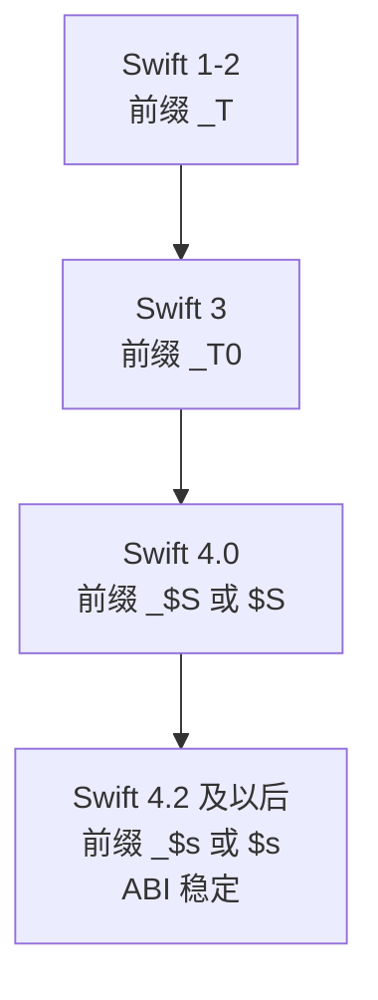
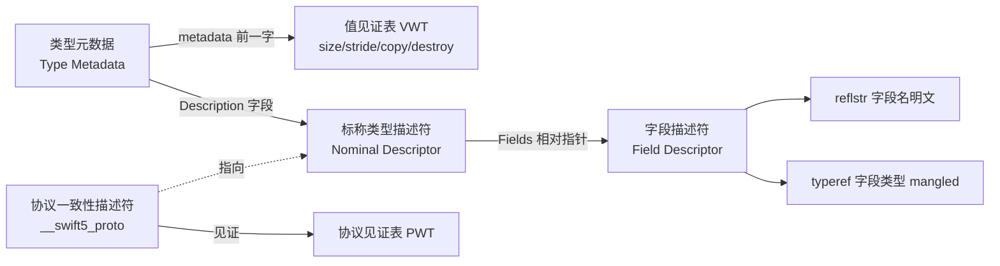
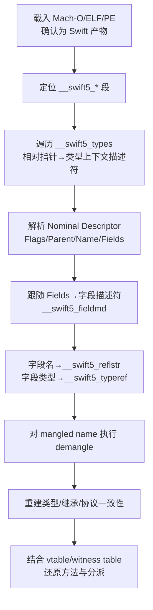

# Go与Rust现代二进制逆向（14）· Swift二进制与元数据逆向
> [!abstract] TL;DR
> - Swift 是「AOT 编译的原生二进制」却又「携带 Go/ObjC 级别的运行时元数据」的混血：它像 Rust 一样编译成机器码，却因为**运行期泛型（runtime generics）**而必须在二进制里保留完整的类型元数据、值见证表与协议见证表——这正是逆向的最大突破口。
> - 关键落点是 Mach-O 的一组 `__swift5_*` 段（`__swift5_types`/`__swift5_fieldmd`/`__swift5_reflstr`/`__swift5_typeref`/`__swift5_proto` 等），它们用**32 位相对指针**把类型描述符、字段名、字段类型、协议一致性串成一张可遍历的图。
> - Swift 名字修饰（mangling）是一套确定性文法，`$s`（Swift 4.2+，ABI 稳定后）开头，编码模块/类型/成员/泛型/后缀；`swift demangle` 可逆向还原成 `模块.类型.成员 : 类型`。
> - Swift 类元数据是 **Objective-C 类结构的超集**（isa/superclass/cache/data 在前，Swift 扩展在后），因此可与 series 36 的 ObjC 运行时对照阅读；`swiftcc` 用专用的 self 寄存器（x86-64 r13 / arm64 x20）与 error 寄存器（r12 / x21）也是识别 Swift 函数的强特征。
> - 对抗面：去反射元数据（`-disable-reflection-metadata`）、符号裁剪、resilience 导致的字段偏移间接化、以及 arm64e 的指针认证（PAC）会显著抬高逆向成本，但**无法删除运行时依赖的核心元数据**——这是 Swift 逆向永远存在的下限。

## 概述与定位

本系列前十三篇分别拆解了 Go 与 Rust 两条现代原生语言链路：Go 以 `gopclntab` 和 `runtime._type` 为核心携带一整套面向 GC、反射与接口的运行时元数据（02–06 篇）；Rust 则走**单态化（monomorphization）**路线，默认几乎不保留运行期类型信息，只在 trait 对象 vtable（13 篇）与 panic/unwind（12 篇）等必要处留下痕迹。Swift 恰好是理解这两种哲学的第三个坐标点——它既不是 Go 那种带 runtime 调度器的托管风格，也不是 Rust 那种「编译后类型信息基本蒸发」的极简风格，而是走了一条独特的中间路线：**原生编译 + 运行期泛型 + 丰富反射元数据**。

为什么把 Swift 放进一套「Go 与 Rust 逆向」的系列里？因为三者共同定义了「现代 AOT 语言二进制」的问题域：编译器如何在没有 JVM/CLR 这类虚拟机的前提下，把类型系统、泛型、协议/接口、内存管理这些高层语义投影到机器码与只读数据段里，而逆向者要做的就是把这个投影反演回来。Swift 的答案信息量极大：它把类型的内存布局、拷贝/析构语义、字段名与字段类型、协议一致性关系统统编码成结构化的元数据放在二进制里，供运行时按需读取。这意味着——**只要没有被刻意裁剪，一个 Swift 二进制里的类型系统几乎是可以被完整重建的**，其可恢复程度甚至高于 Go，远高于 Rust。

Swift 的主战场是 Apple 生态（iOS/iPadOS/macOS/watchOS/tvOS 的 Mach-O 二进制），但随着 Swift on Server 与 Swift on Windows 的成熟，ELF 与 PE/COFF 产物也越来越常见，本篇会覆盖三种容器下的差异。定位上，本篇聚焦「**静态元数据的结构与还原**」：元数据段布局、相对指针、标称类型描述符、字段/反射元数据、名字修饰、协议见证表，以及配套的工具链与实战流程；ARC 引用计数、`swiftcc` 调用约定、arm64e PAC 会作为识别与陷阱点串讲。武器化对抗与免杀不是本篇重点（那属于 series 50），但「元数据泄露了什么、如何加固、加固的下限在哪」会在安全板块讲透。

## 原理与机制

### 编译模型：从 SIL 到机器码，为什么元数据非留不可

Swift 的编译管线是 `swiftc` 源码 → **SIL（Swift Intermediate Language，带所有权与 ARC 语义的中间表示）** → LLVM IR → 目标机器码。这条链路与 Rust（HIR/MIR → LLVM IR）在「最终落到 LLVM」这一点上同构，但 Swift 在类型的运行期表达上做了一个根本不同的决定：**泛型默认不单态化，而是在运行期通过类型元数据参数化执行**。

这一点是理解整个 Swift 元数据体系的钥匙。Rust 的 `Vec<T>` 会为每个具体 `T` 生成一份独立机器码（13 篇讲的膨胀正源于此），运行期不需要知道「T 是什么」。Swift 的 `Array<T>` 或一个泛型函数 `func f<T>(_ x: T)` 默认只生成一份代码，`T` 的具体类型信息在调用时以**隐藏参数**的形式传入——传入的正是 `T` 的**类型元数据指针**。函数内部凡是需要「拷贝一个 T」「析构一个 T」「知道 T 有多大」的地方，都不是编译期常量，而是运行期通过元数据挂着的**值见证表（Value Witness Table, VWT）**间接完成。于是元数据不是可选的调试信息，而是泛型代码正确运行的**刚需**，编译器无法把它优化掉（除非该泛型被特化 specialization，那是优化，不是默认 ABI）。这就从机制上保证了 Swift 二进制里总有一层结构化类型信息可供逆向。

### Mach-O 里的 `__swift5_*` 段：元数据的物理落点

在 Apple 平台的 Mach-O 中，Swift 元数据以一组专用段（section）承载，绝大多数位于只读的 `__TEXT` 段内：

```
__TEXT,__swift5_types     类型上下文描述符表（32 位相对指针数组，指向各标称类型描述符）
__TEXT,__swift5_protos    协议描述符（protocol descriptor）
__TEXT,__swift5_proto     协议一致性描述符（protocol conformance descriptor）
__TEXT,__swift5_fieldmd   字段元数据（field descriptor：字段名 + 字段类型 mangled ref）
__TEXT,__swift5_reflstr   反射字符串（字段名等明文）
__TEXT,__swift5_typeref   类型引用（mangled type name，供运行期重建元数据）
__TEXT,__swift5_assocty   关联类型描述符（associated type）
__TEXT,__swift5_capture   闭包捕获描述符
__TEXT,__swift5_builtin   内建类型描述符
__TEXT,__swift5_mpenum    多载荷枚举描述符
__DATA,__swift5_replace   动态替换（dynamic replacement，热重载/@_dynamicReplacement）
```

「swift5」这个数字前缀本身就是版本信息：它对应 **Swift 5 ABI 稳定**之后的元数据格式。历史上存在过 `__swift3_*`、`__swift4_*` 段名，但自 2019 年 Swift 5 在 Apple 平台宣布 ABI 稳定、Swift 运行时随操作系统内置（`/usr/lib/swift/libswiftCore.dylib`）以来，你在真实样本里见到的几乎都是 `__swift5_*`，其布局也因 ABI 稳定而**被文档化、被冻结**——这对逆向是极大利好，意味着一套解析器可以长期复用。

遍历的入口是 `__swift5_types`：它是一个 32 位相对指针数组，每个元素指向一个类型的**标称类型描述符（nominal type descriptor）**。顺着描述符里的相对指针，可以走到字段描述符（拿字段名与字段类型）、走到父上下文（拿模块名与嵌套关系）、走到元数据访问函数（`Ma`）。`__swift5_proto` 则让你枚举「哪个类型实现了哪个协议」。这张图的可遍历性，是后文实战流程的地基。

### 值见证表、引用计数头与元数据 kind：对象在内存里长什么样

一个 Swift 堆对象（类实例）的起始布局是：

```
偏移 0 : metadata 指针（指向该类的类型元数据，即 ObjC 世界里的 isa）
偏移 8 : InlineRefCounts（64 位内联引用计数，编码 strong/unowned，溢出时转 side table）
偏移 16: 实例字段……
```

对比 series 36 的 ObjC 对象——ObjC 对象起始只有一个 isa（在 nonpointer isa 方案里 isa 内部打包了引用计数）；Swift 则是「metadata 指针 + 独立的引用计数字」。这个差异在动态分析时很关键：Swift 用自己的 `swift_retain`/`swift_release` 而非 `objc_retain`，逆向时看到成对的 `swift_retain/swift_release` 就能确认是 Swift 原生对象而非纯 ObjC 对象。

类型元数据的第一个字（word）是它的 **kind**。对于类，这个字是一个合法的 isa 指针（数值很大，用于 ObjC 互操作）；对于非类类型，它是一个较小的枚举值，常见取值：

```
Struct        = 0x200 (512)      Tuple         = 0x301
Enum          = 0x201 (513)      Function      = 0x302
Optional      = 0x202            Existential   = 0x303（协议类型）
Opaque        = 0x300            Metatype      = 0x304
```

判据是：若首字 > 0x7FF（LastEnumeratedMetadataKind），它是 isa 指针 → 类；否则按枚举值解读。紧挨在元数据地址**前面一个字**（即 `metadata[-1]`）存着**值见证表指针**，VWT 的布局是一串函数指针加上尺寸信息：

```
+0  initializeBufferWithCopyOfBuffer
+8  destroy                      // 析构一个值
+16 initializeWithCopy           // 拷贝构造（+1 保留语义）
+24 assignWithCopy
+32 initializeWithTake           // 移动（take，不 retain）
+40 assignWithTake
+48 getEnumTagSinglePayload
+56 storeEnumTagSinglePayload
+64 size    (机器字)
+72 stride  (对齐后步长，数组元素间距)
+80 flags   (低 8 位=对齐掩码；含 isNonPOD/isNonInline 等位)
+84 extraInhabitantCount
```

VWT 是理解「泛型如何在运行期操作未知类型」的核心：泛型代码要拷贝一个 `T`，就 `call [VWT+16]`；要销毁就 `call [VWT+8]`；要知道大小就读 `[VWT+64]`。逆向时在一段泛型函数里看到大量「加载元数据 → 加载 VWT → 间接调用固定偏移」的模式，就能判定这是通过值见证在操作泛型值，而这些偏移的语义是完全确定的。

### 调用约定：`swiftcc` 的 self / error 寄存器

Swift 有自己的调用约定 `swiftcc`。两个最有辨识度的特征：**self（上下文）寄存器**在 x86-64 上是 `r13`、arm64 上是 `x20`（LLVM 的 `swiftself` 属性）；**error 寄存器**在 x86-64 上是 `r12`、arm64 上是 `x21`（`swifterror`）。抛错的 Swift 函数不是通过返回值传递错误，而是把错误对象写进 error 寄存器，调用方检查该寄存器是否非空来走 catch 路径。这与 series 22 的 SystemV AMD64 标准约定（参数走 rdi/rsi/rdx…）不同，是识别「这是一个 Swift 原生函数」的强信号；同时也提示逆向者：不要把 r13/r12（或 x20/x21）当成普通被调用者保存寄存器来解读。

## 元数据布局、相对指针与名字修饰详解

这一段把前面点到为止的机制展开成「读者不看代码也能自己动手解析」的粒度，因为**相对指针的算法**和**名字修饰的文法**是 Swift 逆向真正的手艺所在。

### 相对指针：为什么 Swift 不用绝对指针，以及如何跟随

Swift 元数据几乎不用 64 位绝对指针，而是用 **32 位有符号相对指针**：字段里存的不是目标地址，而是「目标地址 − 本字段地址」的偏移量。跟随规则是：

```
设字段位于地址 P，其中存放 int32 值 V
直接相对指针：  target = P + V
可间接相对指针（indirectable）：
    若 (V & 1) == 1： target = *(uintptr*)( P + (V & ~1) )   // 先算出一个中转槽，再解引用
    否则：            target = P + V
```

为什么这么设计？三个深层原因。其一，**位置无关**：相对偏移在模块被 dyld 加载到任意基址时都无需重定位（rebase），省掉了大量 `__DATA` 里的重定位项，减小二进制、加快启动、对代码签名友好（`__TEXT` 保持只读不被写补丁）。其二，**尺寸减半**：32 位偏移比 64 位指针省一半空间，元数据本就密集，收益可观。其三，**可间接位（低位标志）**允许「有时直接指向目标、有时指向一个装着目标地址的 GOT 式槽位」，用来处理跨模块引用——当目标在别的动态库里、编译期不知道其地址时，就间接一跳。

对逆向者的直接影响是：**你不能像看 C 指针那样直接 double-click 跟过去**，必须以「字段自身地址」为基准做加法；反汇编器若没有 Swift 感知，会把这些相对指针显示成一堆看似无意义的小整数。这也是为什么专用的 Swift 解析器（Ghidra 的 Swift analyzer、脚本化的 IDA 插件）价值巨大——它们内建了相对指针的跟随逻辑，能把这张图正确地连起来。

### 标称类型描述符：类型的「身份证」

从 `__swift5_types` 走到的每个目标是一个标称类型描述符。以结构体描述符为例，其头部字段序列大致为：

```
Flags               uint32   低 8 位是 ContextDescriptorKind
Parent              rel32    父上下文（模块/外层类型）
Name                rel32    类型名（明文 mangled 片段）
AccessFunction      rel32    元数据访问函数（符号后缀 Ma）
Fields              rel32    指向字段描述符（__swift5_fieldmd）
NumFields           uint32
FieldOffsetVector   uint32   字段偏移向量在元数据中的位置
……（泛型签名、trailing objects 视 Flags 而定）
```

`Flags` 低字节的 `ContextDescriptorKind` 决定这是什么：`Module=0`、`Extension=1`、`Anonymous=2`、`Protocol=3`、`Class=16`、`Struct=17`、`Enum=18`。顺着 `Parent` 一路上溯能拼出完整的命名空间（比如某类型属于哪个模块、是否是某类型的嵌套类型）；顺着 `Name` 拿到类型名；顺着 `Fields` 进入字段层。这套描述符就是把「源码里的类型声明」结构化后的产物，逆向时逐字段解析即可重建出等价于 `struct/class/enum` 声明的骨架。

### 字段与反射元数据：字段名与字段类型如何落地

字段描述符（`__swift5_fieldmd` 中）布局为：

```
MangledTypeName  rel32   本类型的 mangled 名（可空）
Superclass       rel32   父类（类才有）
Kind             uint16  0=Struct 1=Class 2=Enum 3=MultiPayloadEnum 4=Protocol …
FieldRecordSize  uint16  每条记录字节数（通常 12）
NumFields        uint32
── 之后是 NumFields 条 FieldRecord：
   Flags            uint32   （如 IsVar 表示 var）
   MangledTypeName  rel32 →  指向 __swift5_typeref 中该字段类型的 mangled 引用
   FieldName        rel32 →  指向 __swift5_reflstr 中的字段名明文
```

这是 Swift 逆向里含金量最高的一块：**字段名以明文存放在 `__swift5_reflstr`，字段类型以 mangled 引用存放在 `__swift5_typeref`**。也就是说，一个未裁剪的 Swift 二进制，其每个 struct/class 的每个属性叫什么名字、是什么类型，都是白纸黑字可读的。`Mirror` 反射、`print` 一个自定义类型时的默认输出、以及 `Codable` 的部分行为，都依赖这层数据；正因为它服务于语言特性而不仅是调试，编译器默认生成它。逆向者据此能把「一个 24 字节的匿名结构体」还原成 `struct User { name: String; age: Int; active: Bool }` 级别的可读结构。反过来，这也解释了为什么加固的第一刀往往砍向反射元数据（见安全板块）。

### 名字修饰（mangling）：一套确定性文法

Swift 符号名是被 mangle 过的确定性编码，逆向时必须能读。前缀的历史演进本身就是版本指纹：



（Mach-O 符号表里 C 层再加一个下划线，所以你常看到 `_$s…`。）mangling 的基本构造是「长度前缀 + 标识符」拼接，配合一批单/双字母算子。常见片段：

- 标准库类型双字母缩写：`Si`=Swift.Int、`Su`=UInt、`Sb`=Bool、`Sd`=Double、`Sf`=Float、`SS`=String、`Sa`=Array、`SD`=Dictionary。
- 类型种类：`V`=struct、`C`=class、`O`=enum、`P`=protocol。
- 成员/构造：`v`=属性（后接 `g`getter / `s`setter / `M`modify）、`f`+`C`=分配式构造器（allocating init）、`f`+`c`=初始化构造器、`F`=函数。
- 元数据类符号后缀：`Ma`=类型元数据访问函数、`Mn`=标称类型描述符、`WV`=值见证表、`Wv`=字段偏移、`TW`=协议见证、`Tj`=方法分派 thunk、`To`=ObjC 桥接 thunk。

一个可完整手工拆解的例子——符号 `$s4main5PointV1xSivg`：

```
$s      Swift 4.2+ 前缀
4main   模块名 "main"（长度 4）
5Point  类型名 "Point"（长度 5）
V       struct
1x      成员名 "x"（长度 1）
Si      Swift.Int
v       属性（变量）
g       getter
⇒  main.Point.x.getter : Swift.Int
```

理解了这套文法，即使 `swift demangle` 不在手边，也能对着符号读出语义；更重要的是，`__swift5_typeref` 里的字段类型引用正是这种 mangled 串，运行时函数 `swift_getTypeByMangledName` 会把它重建成元数据——逆向者手工 demangle，做的正是同一件事的静态版本。

### 元数据关系图与协议见证表

把上面几块连起来，一个类型的元数据图谱是：



**协议**这条线值得单独说。Swift 的协议（protocol）类似 Rust 的 trait / Go 的 interface。一个类型遵循某协议时，编译器生成一张**协议见证表（Protocol Witness Table, PWT）**，把协议要求的每个方法映射到具体实现；`__swift5_proto` 里的一致性描述符登记「类型 X 遵循协议 P」，让运行时 `swift_conformsToProtocol` 能动态查表。当你把一个值当作协议类型使用（存在类型 existential），运行期用一个 **existential container** 承载它：内含一个 3 机器字的内联缓冲区（放得下就内联，放不下就堆分配并存指针）、一个类型元数据指针、以及一或多个协议见证表指针。

这与 series 13 的 Rust trait 对象（`&dyn Trait` = 数据指针 + vtable 指针的胖指针）、series 36 的 ObjC（基于 selector 的 `objc_msgSend` 字符串化动态分派）形成三方对照：Rust 用胖指针 + 静态 vtable，最省但类型信息在运行期几乎不可见；ObjC 用 selector 全动态、可自省但慢；Swift 走中间——协议见证表像 vtable 一样按槽位分派（快），但一致性描述符又保留了足够元数据供运行期查询（可自省）。在反汇编里区分三种分派也有确定特征：类方法走「加载 isa/元数据 → 调 `[metadata + 固定vtable偏移]`」；协议方法走「加载见证表指针 → 调 `[wt + 固定偏移]`」；`@objc` 成员才走 `objc_msgSend(self, selector)`。

### 类元数据 = ObjC 类结构的超集

Apple 平台上，Swift 类元数据的头部**逐字段兼容 ObjC 的 `class_t`**：先是 isa、superclass、cache（buckets+mask）、data（rodata 指针，低位打标志），之后才接 Swift 扩展字段（class flags、instanceSize、instanceAlignMask、classSize、指向标称描述符的 Description、ivar destroyer，然后是内联的 vtable 方法指针、字段偏移向量、泛型参数）。这样设计是为了**让 ObjC 运行时能把 Swift 类当普通 ObjC 类来遍历**（KVO、`isKindOfClass:`、消息转发等互操作才成立）。对逆向的意义是：你可以用成熟的 ObjC 类解析工具先扒出 isa/superclass/方法列表的外壳，再切换到 Swift 视角解析后半段的 vtable 与 Description——两套 series（本篇与 36）的方法论在这里是叠加而非互斥的。

## 工具视角与实战

### 识别：先确认「这是 Swift」

拿到样本先做归类。静态特征：存在 `__swift5_*` 段（`otool -l` 或 `size -x -l`）；符号表里有 `_$s…`/`_$S…`/`_T…` 前缀；链接了 `libswiftCore.dylib`（`otool -L`）；反汇编里出现 `swift_retain`/`swift_release`/`swift_allocObject`/`swift_getGenericMetadata` 等 runtime 调用；函数用 r13/r12（x20/x21）传 self/error。有了 `__swift5_*` 段基本可断定为 Swift，且段名里的 `5` 告诉你是 Swift 5 ABI。

### 元数据解析与 demangle 的工具箱

- **`swift demangle`**（Swift 工具链自带）：符号 → 可读签名的标准工具，`echo '$s4main5PointV1xSivg' | swift demangle`；批量可 `nm -gU binary | swift demangle`。
- **`swift-reflection-dump`**（工具链自带、极实用）：`swift-reflection-dump --arch arm64 MyBinary` 直接 dump 出字段描述符、关联类型、内建类型、捕获描述符——本质是把 `__swift5_fieldmd/typeref/reflstr` 解析成人读格式，一步拿到类型的字段名与字段类型。
- **`dsdump`**（Derek Selander）：`dsdump --swift --verbose MyBinary`，同时输出 ObjC 与 Swift 的类/方法/协议，适合快速鸟瞰类型全景。
- **`nm` / `otool` / `dyld_info` / `objdump`**：看符号、段、加载命令、绑定信息的基础件。
- **Ghidra（11.x+）**：内建 Swift 段分析器与 demangler，能自动跟随相对指针、解析类型描述符并应用去修饰名，是当下开源静态逆向的首选。
- **IDA Pro**：自带 Swift demangle，配合社区的 Swift metadata 解析插件可重建类型；对相对指针需插件辅助。
- **radare2 / rizin**：`rabin2 -qs` 列符号并 demangle，metadata 解析逐步完善；**Hopper** 也有 Swift 支持。
- **Frida**：动态侧王牌——运行时枚举类型元数据、hook `swift_allocObject`、打印 existential/见证表、在 `swift_getTypeByMangledName` 处观察 typeref 的实际解析结果。

### 一条静态还原流水线



落到细节：遍历 `__swift5_types` 时对每个元素用相对指针公式算出描述符地址；读 `Flags` 判 kind；顺 `Parent` 拼命名空间、顺 `Name` 取类型名；顺 `Fields` 进字段描述符，逐条 FieldRecord 取字段名（reflstr）与字段类型（typeref，再 demangle）；对类，读 `Superclass` 建继承链、读元数据后半段的 vtable 建方法表；扫 `__swift5_proto` 补全「谁遵循了什么协议」。走完这套，一个未加固 Swift 二进制的类型系统骨架就基本重建完毕。

### 平台差异：ELF 与 PE/COFF

Swift on Linux 的 ELF 里同样有这组元数据，但节名改为 `swift5_type_metadata`、`swift5_protocol_conformances`、`swift5_protocols`、`swift5_fieldmd`、`swift5_typeref`、`swift5_reflstr`、`swift5_assocty`、`swift5_capture`、`swift5_builtin` 等，运行时通过链接器的 `__start_/__stop_` 符号或注册构造器来发现它们。Swift on Windows 的 PE/COFF 受 8 字符节名限制，采用截断名如 `.sw5tymd`（types）、`.sw5tyrf`（typeref）、`.sw5rfst`（reflstr）、`.sw5flmd`（fieldmd）、`.sw5prtc`（conformances）、`.sw5prt`（protos）、`.sw5cptr`（capture）、`.sw5bltn`（builtin）、`.sw5asty`（assocty）。逆向 server 端或跨平台 Swift 时，先按容器识别正确的节名，解析算法（相对指针、描述符布局、mangling）三平台一致，可复用同一套解析器。

### 两个高频陷阱

**Resilience（库演进）**：标注 `@frozen` 的类型布局在编译期固定；而 resilient 库里非 frozen 的 public struct/enum，其字段偏移**不是编译期常量**，代码要从元数据的字段偏移向量里运行期加载。反汇编里你会看到「先取偏移再访问」的间接寻址，而非固定 displacement——静态还原结构体布局时若假设偏移为常量就会错位。**arm64e 指针认证（PAC）**：新款 Apple 设备对 vtable 项、部分元数据指针、见证表函数指针做签名，指针高位带 PAC 位。静态工具须把高位掩掉才能得到真实地址，动态 hook 则须正确重签名，否则跳转即崩。此外还有 **Swift 并发**：`async` 函数不是普通栈帧，而是被切成多个 partial function、async 上下文在专用寄存器/堆分配帧里流转，控制流在 `await` 处断开——按普通函数去连 CFG 会失真。

## 安全性与正确使用

Swift 元数据的丰富性是一把双刃剑，理解其安全影响与加固边界，对开发者与分析者同等重要。

**信息暴露面**：未加固的 Swift 二进制近乎「自带源码级类型文档」。字段名明文（reflstr）、字段类型、类/协议名、继承关系、方法符号（可 demangle 回 `模块.类型.方法`）统统可读。对于闭源商业 App，这直接泄露内部数据模型、业务实体结构、模块划分——竞品或攻击者能据此快速定位「登录态存哪个字段」「支付金额是哪个类型的属性」，大幅降低进一步逆向、篡改或构造攻击的门槛。这类信息价值本质上属于知识产权与攻击面，需要被当作资产来管理。

**加固手段与其边界**：其一，**去反射元数据**——Xcode 的 Reflection Metadata Level 设为不生成，或 `swiftc -disable-reflection-metadata`，会去掉 `__swift5_fieldmd/reflstr` 中供 `Mirror` 使用的字段名等，显著削弱可读性；代价是依赖运行期反射的功能（部分 `Mirror`、某些序列化路径）会退化，需评估。其二，**符号裁剪**（strip）去掉本地符号，让 demangle 无从下手（但导出符号与元数据里的名字未必全没）。其三，**第三方混淆**如 SwiftShield 通过重命名类型/方法把语义打乱。但必须认清一条硬下限：**运行期泛型、协议见证、ARC、元数据访问所必需的那部分元数据无法删除**——标称类型描述符、值见证表、协议一致性、vtable 是语言正确运行的前提，删了程序就跑不起来。因此 Swift 逆向的可行性有一个永久非零的下界，混淆只能抬高成本、不能归零。这条边界必须在威胁建模时讲清楚：**不要把「难以逆向」当作安全控制，敏感逻辑与密钥绝不能仅靠混淆保护**，该上服务端校验、白盒密码、可信执行环境的，混淆替代不了。

**正确使用的姿态**：对开发者，合理选择反射级别（在不破坏功能前提下尽量收紧）、开启 arm64e PAC（在支持的设备上提升控制流完整性）、对确需保护的常量走运行期获取而非硬编码；同时明白这些是「提高逆向成本」而非「阻止逆向」的纵深措施。对防御方与分析者，Swift 元数据是**正当的分诊利器**：macOS 上 Swift 恶意样本虽仍少于 C/ObjC，但在增长，其携带的类型/协议元数据能快速勾勒样本的能力边界与模块结构，加速研判（可对接 series 50 的分析方法论）。使用前提是**授权与合法性**——逆向自有产物、获授权的安全评估、恶意样本研究属正当用途；未经许可逆向他人商业软件以获取商业秘密则涉及法律与许可风险。技术能力中立，用途的正当性由授权与目的决定。

## 小结

Swift 在「现代 AOT 语言」谱系里占据了 Go 与 Rust 之间的独特生态位：它像 Rust 一样编译成原生机器码、无虚拟机，却因**运行期泛型**这一根本 ABI 决策，被迫在二进制里保留 Go/ObjC 量级的结构化元数据。这层元数据以 Mach-O 的 `__swift5_*` 段（ELF/PE 有对应节名）为物理载体，用 32 位相对指针把标称类型描述符、字段描述符、反射字符串、类型引用、协议一致性串成一张可遍历的图；值见证表支撑泛型对未知类型的操作，协议见证表支撑协议分派，类元数据是 ObjC 类结构的超集以完成互操作。名字修饰是一套确定性文法，`$s` 前缀（Swift 4.2+/ABI 稳定）可被 `swift demangle` 或手工还原成人读签名。

逆向实战的主线因此清晰：识别 Swift（段名/符号/runtime 调用/self-error 寄存器）→ 遍历 `__swift5_types` → 解析描述符与字段元数据 → demangle → 重建类型、继承与协议 → 结合 vtable/见证表还原方法与分派，`swift-reflection-dump`、`dsdump`、Ghidra Swift 分析器、Frida 是趁手工具。陷阱在 resilience 的字段偏移间接化、arm64e 的 PAC、以及 async 的非线性控制流。安全上，元数据泄露了大量内部结构，可通过去反射元数据、strip、混淆抬高成本，但运行期刚需的核心元数据删不掉——Swift 逆向的可行性存在永久下界，这既是防御者要认清的现实，也是分析者可依靠的抓手。至此，本系列以 Go 的 pclntab/类型元数据、Rust 的单态化/vtable、Swift 的运行期泛型元数据，凑齐了三种现代原生语言把高层语义投影进二进制的完整光谱。

## 相关阅读

- 官方 ABI 文档：Swift 仓库 `docs/ABI/Mangling.rst`（名字修饰文法）、`docs/ABI/TypeMetadata.rst` 与 `docs/ABI/TypeLayout.rst`（元数据与布局），以及 runtime 源码 `include/swift/ABI/Metadata.h`、`MetadataValues.h`（kind 常量、VWT 布局的一手依据）。
- 工具链文档：`swift demangle`、`swift-reflection-dump`（Swift 工具链），Derek Selander 的 `dsdump` 与《Advanced Apple Debugging & Reverse Engineering》；Ghidra Swift 分析器说明。
- 同库 ABI 承接：[[23.C_C++运行时与ABI/01.运行时与ABI概览]]、[[22.调用规约/06.SystemV_AMD64调用规约]]（对照 `swiftcc` 的 self/error 寄存器）。
- iOS 同族对照：[[36.Objective-C与iOS运行时/01.Objective-C运行时概览]]（Swift 类元数据为 ObjC 类结构超集，两篇叠加阅读）。
- 应用场景：[[50.恶意代码分析与免杀对抗/00.恶意代码分析与免杀对抗总览]]（Swift/Go/Rust 原生恶意样本的分诊）。
- 本系列横向对照：[[10.Rust单态化与泛型膨胀]]（与 Swift 运行期泛型的根本差异）、[[13.Rust-trait对象与vtable还原]]（trait 对象 vs 协议见证表）、[[04.Go类型系统元数据恢复]]（Go 运行时元数据的另一范式）。

[[00.Go与Rust现代二进制逆向总览|⬆ 系列总览]] | [[13.Rust-trait对象与vtable还原|← 上一章]]