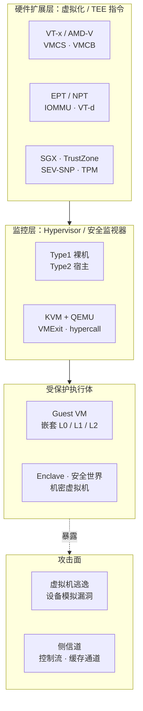
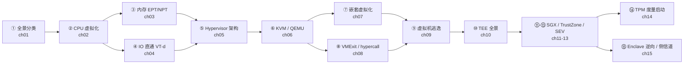

# 虚拟化与TEE机密计算 · 系列总览

> 从 CPU/内存/IO 虚拟化到 Hypervisor 架构、虚拟机逃逸，再到 SGX/TrustZone/SEV 可信执行环境与机密计算——一条"用硬件制造隔离、再用隔离守护机密"的主线贯穿始终。虚拟化解决的是**如何把一台物理机切成多台互不可见的虚拟机**，TEE 解决的是**如何在不可信的宿主上圈出一块连 hypervisor 与 OS 都窥探不到的飞地**，二者共享 VT-x/EPT/IOMMU/远程证明这同一套硬件语汇。承接 [[38.Windows内核与驱动逆向/25.HyperV架构与VBS|HyperV/VBS]] 与 [[21.Asm/40 虚拟化扩展对比|虚拟化扩展]]。

## 技术全景一图

## 篇目导航

| # | 章节 | 说明 |
| --- | --- | --- |
| 01 | [[01.虚拟化技术全景与分类]] | 全/半/硬件辅助虚拟化、容器与虚拟机 |
| 02 | [[02.CPU虚拟化：VT-x与AMD-V]] | VMCS/VMCB、根与非根模式、特权压缩 |
| 03 | [[03.内存虚拟化：EPT与NPT与影子页表]] | 二级地址转换、页表走查、TLB 标签 |
| 04 | [[04.IO虚拟化与设备直通VT-d]] | 模拟/半虚拟化/直通、IOMMU、SR-IOV |
| 05 | [[05.Hypervisor架构：Type1与Type2]] | 裸机与宿主型、微内核式 hypervisor |
| 06 | [[06.KVM与QEMU协作原理]] | KVM 内核态、QEMU 用户态设备模拟 |
| 07 | [[07.嵌套虚拟化]] | L0/L1/L2、VMCS 影子化 |
| 08 | [[08.VMExit与超级调用hypercall]] | 退出原因、陷入模拟、半虚拟化接口 |
| 09 | [[09.虚拟机逃逸原理与案例]] | 设备模拟漏洞、逃逸利用链剖析 |
| 10 | [[10.可信执行环境TEE全景]] | 隔离模型、威胁模型、远程证明 |
| 11 | [[11.Intel-SGX架构与Enclave]] | EPC、ECREATE/EENTER、密封与证明 |
| 12 | [[12.ARM-TrustZone与安全世界]] | 安全/普通世界、SMC、TEE OS |
| 13 | [[13.AMD-SEV与机密虚拟机]] | 内存加密、SEV-SNP、证明链 |
| 14 | [[14.TPM与度量启动]] | PCR、度量链、密封解封，呼应系列 39 |
| 15 | [[15.Enclave逆向与侧信道攻击]] | enclave 二进制分析、控制通道与缓存侧信道 |

## 推荐学习路径

> [!tip] 学习建议与阅读顺序
> - **先虚拟化、后 TEE**：ch01-09 建立"硬件如何造出隔离"的直觉后，再看 ch10-15"隔离如何服务于机密性"会顺理成章——两者复用 EPT/IOMMU/证明链等同一批底层机制。
> - **两条主线可并行**：资源虚拟化（CPU→内存→IO，ch02-04）与信任链（TPM→SGX/SEV→侧信道，ch11-15）能交叉阅读；架构篇（ch05-08）是黏合二者的中间层。
> - **逆向/漏洞视角切入**：若只为攻击面分析，走 ch08（陷入面）→ ch09（逃逸利用链）→ ch15（enclave 侧信道）三章即可拼出完整攻击地图。
> - **务必动手**：ch06 配合 `/dev/kvm` 与 QEMU 源码走查设备模拟；SGX 章节先用 SDK 的 simulation 模式跑通 ECREATE/EENTER，再上真机 EPC 与远程证明。

## 与知识库既有体系的衔接

- 内核呼应：[[38.Windows内核与驱动逆向/25.HyperV架构与VBS]]、[[38.Windows内核与驱动逆向/29.CI.dll与代码完整性WDAC]]
- 硬件承接：[[21.Asm/40 虚拟化扩展对比]]、[[24.内存管理与堆分配器/02.进程地址空间与虚拟内存]]
- 启动链呼应：[[39.固件与IoT嵌入式逆向/21.安全启动链绕过技术]]（度量启动/TPM）
