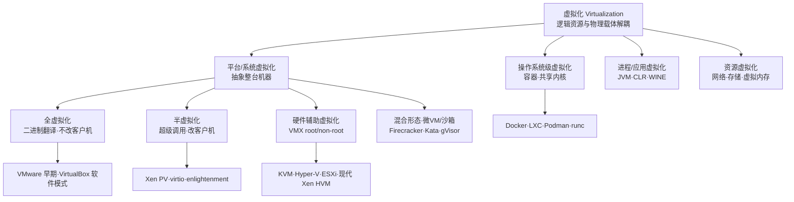
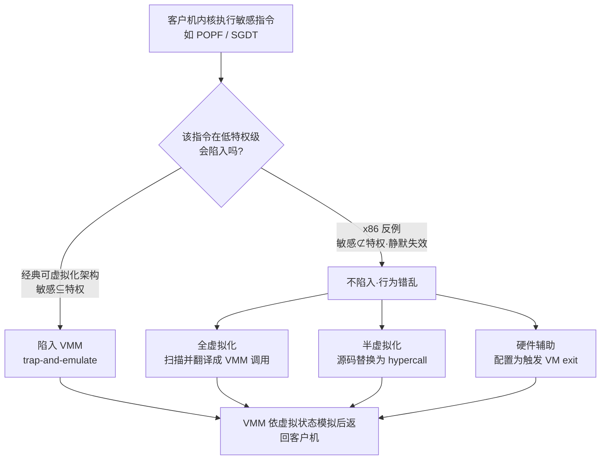
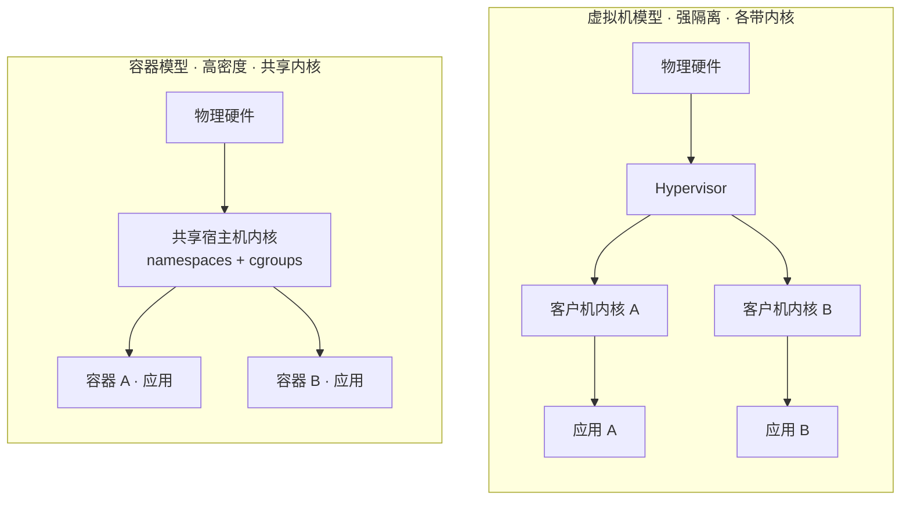

# 虚拟化与TEE机密计算（1）· 虚拟化技术全景与分类
> [!abstract] TL;DR
> - 虚拟化的本质是在逻辑资源与物理载体之间插入一层「可控的间接抽象」，从而实现复用（一变多）、聚合（多变一）与仿真（把 A 呈现为 B）；本篇是全系列的「地图」，先立分类学与术语，后续各篇再钻 CPU/内存/IO/逃逸/TEE 的细节。
> - 一切系统虚拟化的理论基石是 Popek-Goldberg 定理（1974）：当「敏感指令集合 ⊆ 特权指令集合」时，才能用 trap-and-emulate 高效构造 VMM；x86 恰恰不满足，存在 17 条「敏感但不特权」的指令，这是全/半/硬件辅助三条技术路线分岔的根因。
> - 全虚拟化（二进制翻译，VMware 早期）不改客户机、动态改写内核指令流；半虚拟化（Xen PV）改客户机源码、把敏感操作换成 hypercall；硬件辅助（VT-x/AMD-V）新增 VMX root/non-root 正交模式，让客户机可合法跑在 ring 0。
> - 容器是操作系统级虚拟化：共享宿主机内核、靠 namespaces + cgroups 隔离，密度高、启动快，但隔离边界弱（内核提权即逃逸）；虚拟机各带独立内核、经 hypervisor 隔离，边界强但开销大。二者不是替代而是不同隔离强度的取舍。
> - 隔离强度阶梯：进程 < 容器 < 虚拟机 < 机密虚拟机/TEE。普通虚拟化里 hypervisor、宿主机乃至云厂商都在可信基（TCB）内；机密计算（SGX/SEV/TDX）的目标正是把 TCB 收缩到 CPU 本身，这构成了本系列后半程的动机。

## 概述与定位

虚拟化（virtualization）常被通俗地理解为「在一台机器上跑很多台机器」，但这只是它最著名的一个应用面。更准确的定义是：**在资源的使用者与资源的物理实现之间引入一层间接映射，使逻辑视图与物理载体解耦**。这层解耦一旦成立，就自然衍生出三种能力——**复用**（把一份物理资源切成多份逻辑资源，如一颗物理 CPU 上并行跑多台虚拟机）、**聚合**（把多份物理资源拼成一份逻辑资源，如把多块磁盘聚成一个逻辑卷）、**仿真**（把资源 A 伪装成资源 B，如在 x86 上呈现一颗 ARM CPU）。我们熟悉的虚拟内存、RAID、VLAN，本质上都是「虚拟化」这个思想在不同层次的落地，只是习惯上不叫这个名字。

为什么虚拟化在数据中心与安全领域如此重要？核心价值有四条：其一是**整合与利用率**，物理服务器长期空转是巨大浪费，把多份负载塞进同一台机器可以显著提升硬件利用率；其二是**隔离与多租户**，不同租户/业务跑在各自的虚拟机里，一个崩溃或被攻破不至于波及邻居；其三是**封装与可移动性**，一台虚拟机被抽象成一组文件（磁盘镜像 + 配置），于是快照、克隆、热迁移、回滚这些原本在物理世界不可想象的操作变得廉价；其四是**硬件无关性**，虚拟机看到的是一套稳定的虚拟硬件，底层物理平台怎么换都不影响客户机。正是这四条把虚拟化推成了云计算的地基。

本篇的定位是**整个系列的全景地图**。它不深入任何单一机制的实现细节，而是负责搭好坐标系：把「虚拟化」这个被严重重载的词拆清楚，建立分类学（按抽象层次分、按客户机是否感知分、按有无硬件支持分、按 hypervisor 位置分），讲清全/半/硬件辅助三条路线的原理分岔点，并把容器与虚拟机这对「既像又不像」的东西辨析到位。至于 CPU 虚拟化的 VT-x/AMD-V 细节留给 [[02.CPU虚拟化：VT-x与AMD-V|第 2 篇]]，内存的 EPT/影子页表留给 [[03.内存虚拟化：EPT与NPT与影子页表|第 3 篇]]，IO 直通留给 [[04.IO虚拟化与设备直通VT-d|第 4 篇]]，Type1/Type2 架构留给 [[05.Hypervisor架构：Type1与Type2|第 5 篇]]，逃逸留给 [[09.虚拟机逃逸原理与案例|第 9 篇]]，TEE 与机密计算则是 [[10.可信执行环境TEE全景|第 10 篇]] 之后的下半程。读完本篇，你应当能拿到任意一个「虚拟化产品」并迅速把它归位到分类树上，知道它解决的是哪一层的问题、用的是哪条技术路线、隔离边界画在哪里。

下面先给出全景分类树，后文各节围绕它展开。



## 原理与机制

要理解全部技术路线，先要抓住一个最朴素的机制原型：**陷入与模拟（trap-and-emulate）**。它的思路是：把客户机操作系统从它以为的最高权限「降级」（de-privilege）到一个较低的权限级别去运行；客户机里那些真正会改动全局硬件状态的**特权指令**，在低权限下执行时会触发一个异常（陷入，trap），控制权于是转交给运行在最高权限上的监控程序——**虚拟机监控器（VMM / hypervisor）**；VMM 针对「这台虚拟机的虚拟状态」把这条指令的效果模拟出来，再把控制权还给客户机。客户机浑然不觉自己被降了级，因为它每次想碰硬件都被 VMM 无缝接管并给出「符合预期」的结果。这里的关键词是**虚拟状态**：VMM 为每台虚拟机维护一整套影子的机器状态（虚拟的控制寄存器、虚拟的中断描述符表、虚拟的页表基址等），客户机的特权操作全部作用在这套影子状态上，永远碰不到真实硬件。

这套机制之所以能同时「快」又「安全」，依赖于一个统计学前提：客户机绝大多数指令是**无害的普通计算指令**（算术、访存、分支），它们可以原封不动地直接在物理 CPU 上跑（直接执行，direct execution），只有极少数特权指令才需要陷入、由 VMM 慢速模拟。这正是 Popek 与 Goldberg 在 1974 年为「合格的 VMM」立下的**三条性质**：**等价性/保真性**（客户机在 VMM 下的行为应与在裸机上基本一致）、**资源控制/安全性**（VMM 必须完全掌控被虚拟化的资源，客户机无法越权）、**高效性**（绝大多数指令必须无需 VMM 干预、直接由硬件执行——这一条把纯软件解释器/仿真器排除在「虚拟化」之外）。第三条尤为关键：它是虚拟化与仿真（emulation）的分水岭，仿真器逐条翻译解释、不要求直接执行，因此可以跨指令集，但慢得多。

在 x86 上落地 trap-and-emulate 会立刻撞上**特权级（ring）模型**这道坎。x86 有 ring 0（内核）到 ring 3（用户态）四个特权级，客户机内核本来住在 ring 0。要虚拟化它，就得把它降级——经典做法是「环降级/环压缩」：VMM 占 ring 0，客户机内核挤到 ring 1，客户机应用留在 ring 3（所谓 0/1/3 模型）。可这引出两个麻烦：一是**环别名（ring aliasing）**，某些指令能让客户机读到自己真实的 CPL（当前特权级）而发现自己不在 ring 0，虚拟化假象破功；二是更致命的——**x86 上有一批指令，在低特权级执行时既不陷入、又按真实状态给结果**，VMM 根本拦不住它们。这才是三条技术路线分岔的真正根源，下一节将用 Popek-Goldberg 定理把它讲透。

面对 x86 这个「不满足经典可虚拟化条件」的架构，工程界先后给出三种破局思路，也就是本篇的三大分类：

- **全虚拟化（full virtualization）**：不改动客户机操作系统一行代码，靠 VMM 在运行时**动态二进制翻译（dynamic binary translation, DBT）**客户机的内核指令流，把那些「拦不住」的问题指令就地改写成对 VMM 的调用。代价是翻译开销，收益是能跑任意未修改的操作系统。VMware 在 1999 年用这条路第一次把 x86 虚拟化做成了商品。
- **半虚拟化（paravirtualization）**：干脆修改客户机操作系统的源码，让它**主动配合**——把敏感操作替换成显式的**超级调用（hypercall）**去请求 hypervisor 代劳。没有陷入、没有翻译，效率高；代价是客户机必须为特定 hypervisor 移植，闭源系统改不动。Xen 在 2003 年以此成名。
- **硬件辅助虚拟化（hardware-assisted virtualization）**：从 CPU 层面动刀，Intel VT-x（2005）与 AMD-V（2006）新增了一对**正交的运行模式**——VMX root（给 VMM）与 VMX non-root（给客户机）。客户机可以合法地跑在 non-root 的 ring 0，问题指令改由硬件按配置触发「陷出」（VM exit）交给 VMM。既不用改客户机、又不用软件翻译，成为今天的绝对主流。

另有两根**分类维度**需要与上面三条正交地记住：一是**抽象层次**——平台/系统虚拟化（抽象整机，即 VM）、操作系统级虚拟化（抽象内核之上的运行环境，即容器）、进程/应用虚拟化（抽象一个语言运行时，如 JVM）；二是**hypervisor 的位置**——Type 1「裸金属」直接跑在硬件上（ESXi/Xen/Hyper-V），Type 2「宿主型」跑在一个通用操作系统之上（VMware Workstation/VirtualBox），这条留待 [[05.Hypervisor架构：Type1与Type2|第 5 篇]] 详解。

## 判定定理与指令分类详解

这一节是本篇的理论心脏。1974 年 Gerald Popek 与 Robert Goldberg 在论文《Formal Requirements for Virtualizable Third Generation Architectures》里，第一次把「一台机器能不能被高效虚拟化」这个工程直觉，变成了可判定的形式命题。要理解它，先把指令集做一次三分类。

```text
指令三分类（Popek & Goldberg, 1974）
──────────────────────────────────────────────
特权指令 (privileged)
  · 在用户态执行必陷入 (trap)，在系统态正常执行
  · 例：LGDT/LIDT、MOV CRn、HLT、IN/OUT（受 IOPL 约束）

敏感指令 (sensitive) —— 会破坏 VMM 控制或暴露真实状态者
  ├ 控制敏感 (control-sensitive)
  │   · 试图改变资源配置：改内存映射、切处理器模式、开关中断
  │   · 例：MOV to CR0/CR3、CLI/STI、LIDT
  └ 行为敏感 (behavior-sensitive)
      ├ 位置敏感：结果依赖代码所处的物理地址/段
      └ 模式敏感：结果依赖当前特权级/运行模式
          · 例：PUSHF 读出真实 IF/IOPL；SGDT 读出真实 GDTR

无害指令 (innocuous) —— 既非特权也非敏感，可直接上硬件跑
──────────────────────────────────────────────
可虚拟化判定（定理一）：
    敏感指令集合 ⊆ 特权指令集合  ⇒  可用 trap-and-emulate 构造 VMM
```

**定理一（可虚拟化性）** 的直觉极其漂亮：一台 VMM 能不能靠「降级客户机 + 陷入模拟」这套朴素机制建成，只取决于一件事——**所有敏感指令是不是都是特权指令**。如果是，那么把客户机降到用户态后，每一条可能破坏隔离或暴露真相的指令都会乖乖陷入 VMM，VMM 就能逐一接管、用虚拟状态模拟出正确结果，等价性与资源控制两条性质自动满足；同时无害指令占绝大多数、直接执行，高效性也满足。反之，只要存在**哪怕一条**敏感却不特权的指令，它在用户态执行时不陷入、还按真实硬件状态返回，VMM 就既拦不住它（丧失控制）、客户机又能借它窥破虚拟化（丧失等价），trap-and-emulate 当场失效。

Popek-Goldberg 还给了 **定理二（递归可虚拟化性）**：如果一台机器可虚拟化、且其 VMM 本身也满足可虚拟化条件（能在自己构造的虚拟机里再跑一份自己），那么它就是递归可虚拟化的——这正是**嵌套虚拟化**的理论出处，细节见 [[07.嵌套虚拟化|第 7 篇]]。

现在把定理一套到 x86 上，答案是**不满足**。2000 年 John Robin 与 Cynthia Irvine 在 USENIX Security 的经典分析里，逐条审计了 Pentium 指令集，点名了 **17 条「敏感但不特权」** 的指令——它们是 x86 长期无法被经典虚拟化的病灶：

```text
x86 破坏经典可虚拟化性的 17 条「敏感但不特权」指令
（Robin & Irvine, USENIX Security 2000）
──────────────────────────────────────────────
访问敏感寄存器/内存 (6)：SGDT  SIDT  SLDT  SMSW  PUSHF  POPF
引用保护系统/段机制 (11)：LAR  LSL  VERR  VERW  POP  PUSH
                          CALL  JMP  INT n  RET  STR
                          MOV（涉及段寄存器）
──────────────────────────────────────────────
共同病灶：在 ring>0 执行时「既不陷入、又按当前真实特权级/真实系统
表给结果」—— VMM 拦不住，客户机又看穿了虚拟化假象
```

举三个最能说明问题的例子。**POPF**：客户机内核想通过 POPF 关中断（清 IF 位），但 POPF 在用户态执行时，对 IF 等特权标志位的修改会被 CPU **静默忽略**——既不报错也不陷入。于是客户机以为自己关了中断、VMM 却毫不知情，虚拟中断逻辑彻底错乱。**SGDT/SIDT**：这两条「存储全局/中断描述符表寄存器」的指令在任何特权级都能执行且不陷入，客户机一执行就读到了**真实的、被 VMM 重定位过的** GDTR/IDTR 值，立刻发现自己不在裸机上——这正是后来 Joanna Rutkowska 那枚著名的「Red Pill」检测虚拟机的原理（用 SIDT 读 IDTR 基址，虚拟环境下会被顶到异常高的地址）。**PUSHF**：把 EFLAGS 压栈时会连同真实的 IOPL、IF 一起暴露，客户机据此就能推断自己的真实特权级。这些指令的共性，恰是定理一里最忌讳的「敏感却不特权」。

于是三条技术路线，本质上是**三种把这 17 条指令重新纳入 VMM 掌控的手段**：

- **全虚拟化用二进制翻译堵漏**：VMM 在客户机内核代码执行前扫描指令流，把每一条问题指令就地替换成一段陷入 VMM 的桩代码或直接内联模拟逻辑，翻译结果缓存在**翻译缓存（translation cache）**里以摊薄成本；用户态代码则不翻译、直接执行。这样即便硬件不肯陷入，软件也强行把控制权夺回来了。
- **半虚拟化从源头绕过**：既然这些指令是刺头，那就在客户机内核源码里**根本不生成它们**，改写成对 hypervisor 的 hypercall。刺头指令消失，问题也就不存在了；代价是要能改客户机源码。
- **硬件辅助从架构消灭问题**：VT-x/AMD-V 新增的 non-root 模式让客户机能在 ring 0 原生执行，而这 17 条指令可以被 VMCS/VMCB 控制结构配置为**触发 VM exit**，硬件亲自把它们送回 VMM。定理一的前提被 CPU 用一个新维度直接补齐了，细节见 [[02.CPU虚拟化：VT-x与AMD-V|第 2 篇]]。



最后要提醒一个常被忽略的边界：**CPU 可虚拟化只是必要条件，不是充分条件**。即便解决了指令层面，客户机还需要虚拟的内存（客户机物理地址到宿主机物理地址的二次翻译，靠影子页表或 EPT/NPT，见 [[03.内存虚拟化：EPT与NPT与影子页表|第 3 篇]]）与虚拟的 IO（设备模型或直通，见 [[04.IO虚拟化与设备直通VT-d|第 4 篇]]）。一台完整可用的虚拟机，是 CPU、内存、IO 三重虚拟化叠加的产物，本节只解决了第一重。

## 工具视角与实战

把上面的分类学落到真实产品上，才能把知识变成判断力。按 hypervisor 位置与技术路线，主流生态大致可以这样归位：

- **Type 1 裸金属**：VMware ESXi、Xen（含 Citrix Hypervisor）、Microsoft Hyper-V、Linux **KVM**（KVM 让 Linux 内核本身变成 hypervisor，学界对它算 Type 1 还是 1.5 有争论）。数据中心与公有云底座几乎全在这一档。
- **Type 2 宿主型**：VMware Workstation/Fusion、Oracle VirtualBox、Parallels Desktop、以及 QEMU 单独运行时。面向开发者与桌面，装在已有操作系统之上。
- **技术路线的历史标本**：VMware 早期（VT-x 之前）与 VirtualBox 的软件模式是**二进制翻译**的活化石；**半虚拟化**今天很少以「整机 PV」形态存在，却以**virtio**（半虚拟化 IO 驱动，即便在硬件辅助的 HVM 客户机里也普遍使用，因为纯模拟设备太慢）、Hyper-V 的 enlightenment、VMware 的准虚拟化接口等**局部形态**无处不在——记住这点很重要：现代虚拟机往往是「硬件辅助 CPU/内存 + 半虚拟化 IO」的混血。
- **容器与其运行时**：Docker（由 containerd + **runc** 承载）、LXC/LXD、Podman、systemd-nspawn。它们是操作系统级虚拟化的代表，下一节详辨。
- **混合形态：微 VM 与沙箱**——这是近十年最有意思的演化，专为「既要容器的密度、又要虚拟机的隔离」而生：AWS **Firecracker**（Rust 写的极简 VMM，为 Lambda/Fargate 每秒拉起上千个 microVM）、**Cloud Hypervisor**、**Kata Containers**（把每个 OCI 容器塞进一台轻量 VM，对上仍是标准容器接口）、Google **gVisor**（用户态实现的「内核」Sentry 拦截并重放系统调用，严格说不是虚拟机而是**系统调用沙箱**，用性能换更小的攻击面）。
- **仿真器（注意：不是虚拟化）**：QEMU 的 TCG 引擎、Bochs、DOSBox、Apple Rosetta 2。它们逐条翻译/解释指令、可**跨指令集**（x86 上跑 ARM、Apple Silicon 上跑 x86），但因为不满足 Popek-Goldberg 的「高效性/直接执行」条件，本质是 emulation 而非 virtualization。实践中 QEMU 常与 KVM 搭档：KVM 负责需要直接执行的 CPU/内存虚拟化、QEMU 负责设备模型，这对经典组合见 [[06.KVM与QEMU协作原理|第 6 篇]]。

从**逆向工程与实战**视角，「检测自己是否运行在虚拟机里」是绕不开的技能，攻防两端都要用。最规范的方法是 **CPUID**：叶子 `1` 的 ECX 第 31 位是「hypervisor present」软约定位，几乎所有 hypervisor 都会置位；叶子 `0x40000000` 返回 hypervisor 厂商签名字符串，如 `KVMKVMKVM`、`Microsoft Hv`、`VMwareVMware`、`XenVMMXenVMM`，据此可精确识别是谁。更底层、更隐蔽的手法则利用上一节那些「敏感不特权」指令的副作用：**SIDT/SGDT/SLDT**（Red Pill 家族）读出被顶高的描述符表基址、**RDTSC 时序探测**（陷入模拟带来的异常延迟）、特定 IO 端口后门（VMware 的 `0x5658` 魔术端口）。恶意软件普遍内置这类**反虚拟机（anti-VM）**逻辑，一旦嗅到沙箱就休眠或改变行为以躲避自动化分析；而分析人员则反过来加固沙箱、隐藏这些指纹。这条攻防线与 [[09.虚拟机逃逸原理与案例|第 9 篇]] 的逃逸、[[15.Enclave逆向与侧信道攻击|第 15 篇]] 的侧信道一脉相承。

选型上的实战判断可以浓缩成几句：**跨指令集或跑古董系统**用仿真（QEMU TCG/Bochs）；**要跑未修改的多种操作系统、强隔离**用硬件辅助虚拟化（KVM/Hyper-V/ESXi）；**高密度、快启动、DevOps 交付**用容器；**多租户又不信任负载**在容器外再套一层微 VM 或沙箱（Kata/gVisor/Firecracker）；**做 CI/教学/安全实验要在虚拟机里再开虚拟机**则依赖嵌套虚拟化（见第 7 篇）。

## 安全性与正确使用

虚拟化在安全上的第一价值是**隔离**，但「隔离」有强弱之分，把它排成一条**隔离强度阶梯**能澄清大量误解：**进程隔离 < 容器隔离 < 虚拟机隔离 < 机密虚拟机/TEE 隔离**。理解这条阶梯的关键，是看**共享了什么、以及谁在可信基（TCB）里**。

普通进程之间共享同一个内核、同一套地址空间管理，靠页表权限位隔离，边界最弱。**容器**在此之上用内核的 **namespaces**（pid/net/mnt/uts/ipc/user/cgroup/time 等命名空间，让每个容器看到独立的进程树、网络栈、文件系统视图）与 **cgroups**（限制 CPU/内存/IO 配额，防止一个容器饿死邻居）做隔离——但**内核仍是共享的一份**。这意味着容器的攻击面是**整个系统调用 API**（数百个 syscall）加上共享内核的全部漏洞：任何一个内核提权漏洞（如历史上的 Dirty COW、各种 eBPF/OverlayFS 漏洞），都可能被容器内攻击者用来「捅穿内核」直接拿到宿主机，即**容器逃逸**。所以业界的共识是：**默认配置的容器不是抵御恶意负载的安全边界**，多租户敌意场景必须叠加 seccomp 白名单、能力位裁剪（drop capabilities）、用户命名空间（rootless）、SELinux/AppArmor，或干脆换用 gVisor/Kata 这类更强隔离。



**虚拟机**把边界画得更狠：每台 VM 带自己独立的客户机内核，彼此不共享内核，交互只经由 hypervisor 暴露的**狭窄接口**（少数 hypercall + 设备模型）。攻击面从「整个 syscall API」收窄到「hypervisor 的那点接口」，逃逸难度大得多。但它不是铜墙铁壁——历史上的逃逸多出在**设备模拟**的代码里（QEMU 虚拟网卡/软驱/显卡等模型的内存破坏漏洞，如 VENOM、各类 virtio 越界），这也是为什么减小攻击面（禁用无用设备模型、优先 virtio、Firecracker 式极简 VMM）本身就是加固手段，详见 [[09.虚拟机逃逸原理与案例|第 9 篇]]。

真正把安全模型推向极致的，是对**威胁模型与 TCB**的重新审视。在普通虚拟化里，**hypervisor、宿主机操作系统、乃至云服务商的运维**统统在你的可信基之内——他们理论上能读你虚拟机的全部内存。对于跑在公有云上的敏感负载，这是个尴尬的信任假设。**机密计算（confidential computing）**的目标，正是把 TCB 从「整个软件栈 + 云厂商」收缩到「CPU 芯片本身」：Intel SGX 用 enclave 把可信代码封进加密内存（见 [[11.Intel-SGX架构与Enclave|第 11 篇]]），AMD SEV 与 Intel TDX 则把**整台虚拟机**的内存对 hypervisor 加密隔离（机密虚拟机，见 [[13.AMD-SEV与机密虚拟机|第 13 篇]]），ARM 用 TrustZone/CCA 划出安全世界（见 [[12.ARM-TrustZone与安全世界|第 12 篇]]）。这条把「hypervisor 移出信任边界」的主线，就是本系列从虚拟化过渡到 TEE 的动机所在。

正确使用的边界还包括两点常被低估的风险。其一是**侧信道**：虚拟化只隔离了显式的资源视图，却无法隔离**共享的微架构**——Cache、TLB、分支预测器、乱序执行的瞬态状态跨越了 VM 与 enclave 的逻辑边界，L1TF、MDS、Spectre/Meltdown 这类攻击能让攻击者从旁路窃取邻居机密，缓解需要微码更新、核调度隔离乃至禁用超线程，详见 [[15.Enclave逆向与侧信道攻击|第 15 篇]]。其二是**度量与信任根**：光有隔离还不够，你还得能**证明**跑起来的确实是你期望的那套软件、没被篡改——这就要靠可信启动链与 TPM 度量（见 [[14.TPM与度量启动|第 14 篇]] 与 [[39.固件与IoT嵌入式逆向/21.安全启动链绕过技术|安全启动链绕过技术]]），以及 TEE 的远程证明（remote attestation）。隔离、度量、证明三者合一，机密计算才成立。

## 小结

本篇把「虚拟化」这个被重载的词拆成了一张可操作的地图。核心脉络有五条：**其一**，虚拟化是逻辑资源与物理载体的解耦，衍生出复用、聚合、仿真三种能力；按抽象层次分为平台/系统级（VM）、操作系统级（容器）、进程/应用级（JVM 类）与资源级（网络/存储/内存）。**其二**，一切系统虚拟化的理论脊梁是 Popek-Goldberg 定理——「敏感指令 ⊆ 特权指令」是 trap-and-emulate 可行的充要门槛，x86 因 17 条「敏感不特权」指令不达标，这是全部技术分岔的根因。**其三**，全虚拟化（二进制翻译）、半虚拟化（hypercall）、硬件辅助（VMX root/non-root）是把这 17 条刺头重新纳入 VMM 掌控的三种手段，现代虚拟机多为「硬件辅助 CPU/内存 + 半虚拟化 IO」的混血。**其四**，容器与虚拟机不是替代关系而是隔离强度的取舍：容器共享内核、密度高但攻击面是整个 syscall API，虚拟机各带内核、边界强但开销大，中间还长出了 Kata/gVisor/Firecracker 这类微 VM 与沙箱。**其五**，隔离强度阶梯（进程 < 容器 < VM < 机密 VM/TEE）背后是 TCB 的逐级收缩，机密计算把 hypervisor 与云厂商移出信任边界，正是本系列下半程的主题。

带着这张地图，接下来的各篇会逐层钻进去：CPU 怎么虚拟化（VT-x/AMD-V）、内存怎么二次翻译（EPT/影子页表）、IO 怎么直通（VT-d）、hypervisor 怎么架构（Type1/2）、KVM 与 QEMU 怎么分工、嵌套怎么套娃、VM exit 与 hypercall 怎么进出、逃逸怎么发生，直至 TEE 与机密计算的全景。

## 相关阅读

- 同系列纵深：[[02.CPU虚拟化：VT-x与AMD-V]]、[[03.内存虚拟化：EPT与NPT与影子页表]]、[[04.IO虚拟化与设备直通VT-d]]、[[05.Hypervisor架构：Type1与Type2]]、[[06.KVM与QEMU协作原理]]、[[07.嵌套虚拟化]]、[[09.虚拟机逃逸原理与案例]]、[[10.可信执行环境TEE全景]]
- 内核呼应：[[38.Windows内核与驱动逆向/25.HyperV架构与VBS]]、[[38.Windows内核与驱动逆向/29.CI.dll与代码完整性WDAC]]
- 硬件承接：[[21.Asm/40 虚拟化扩展对比]]、[[24.内存管理与堆分配器/02.进程地址空间与虚拟内存]]
- 启动链呼应：[[39.固件与IoT嵌入式逆向/21.安全启动链绕过技术]]（度量启动 / TPM）
- 奠基文献：G. Popek & R. Goldberg,《Formal Requirements for Virtualizable Third Generation Architectures》(CACM, 1974)——可虚拟化判定定理原文
- J. Robin & C. Irvine,《Analysis of the Intel Pentium's Ability to Support a Secure Virtual Machine Monitor》(USENIX Security, 2000)——x86 17 条问题指令
- K. Adams & O. Agesen,《A Comparison of Software and Hardware Techniques for x86 Virtualization》(ASPLOS, 2006)——二进制翻译 vs 硬件辅助的量化对比
- P. Barham 等,《Xen and the Art of Virtualization》(SOSP, 2003)——半虚拟化奠基论文
- Intel® 64 and IA-32 Architectures Software Developer's Manual, Vol. 3C（VMX 章节）；OCI Runtime Specification（容器运行时标准）

[[00.虚拟化与TEE机密计算总览|⬆ 系列总览]] | [[02.CPU虚拟化：VT-x与AMD-V|→ 下一章]]
