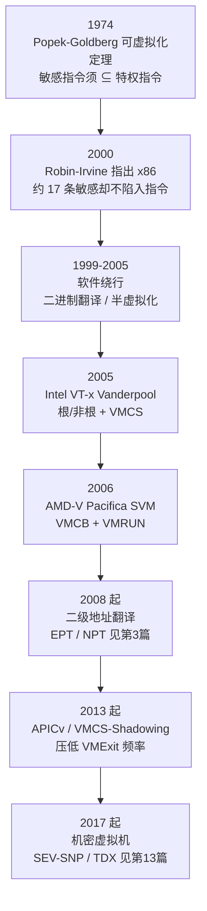
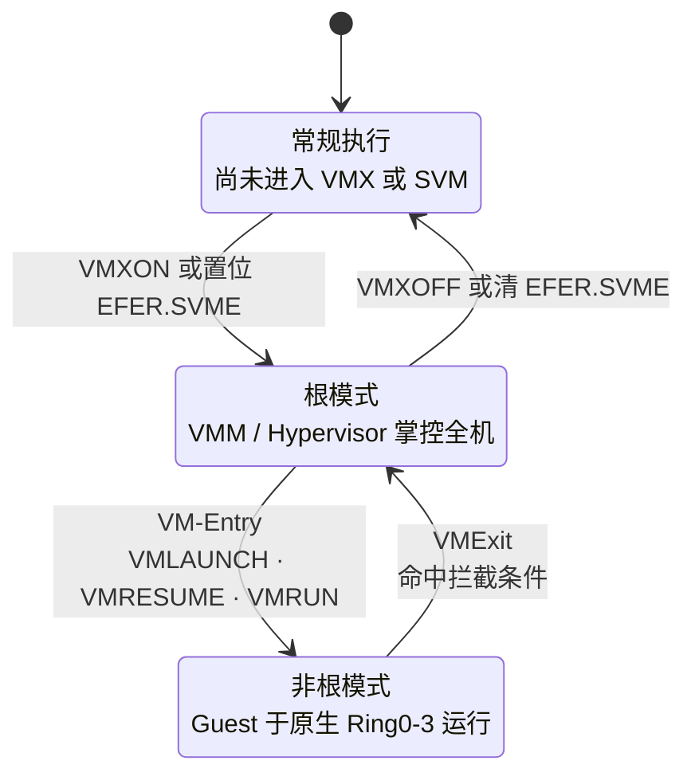
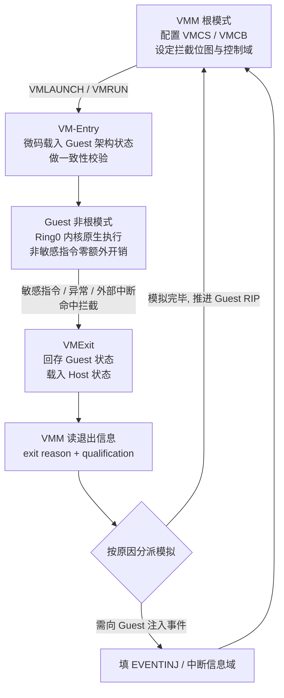
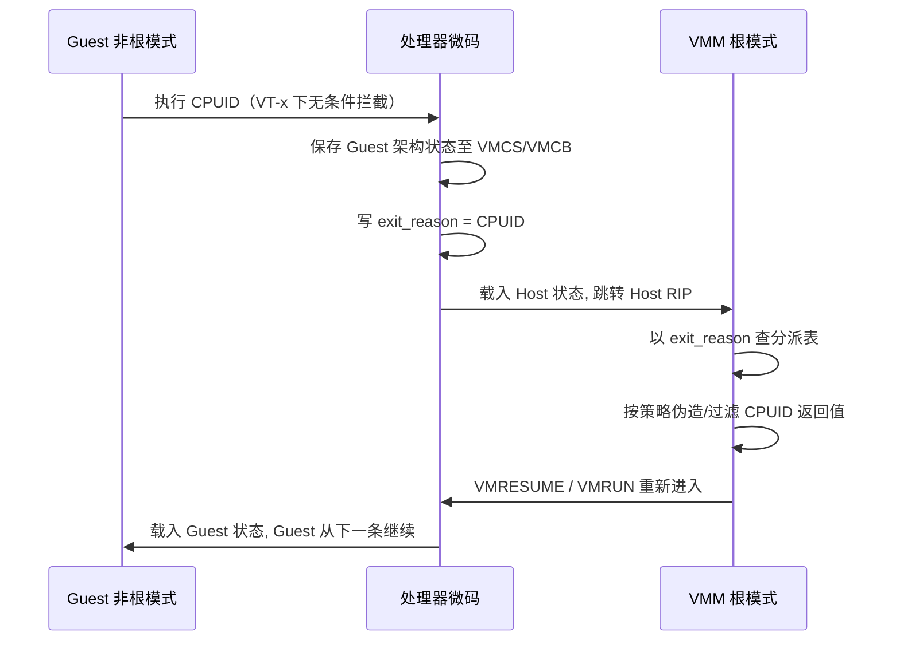

# 虚拟化与TEE机密计算（2）· CPU虚拟化：VT-x与AMD-V

> [!abstract] TL;DR
> - VT-x/AMD-V 的关键创新不是"多加一个 Ring"，而是在 Ring0–3 之外正交出一维「根/非根」操作模式：Guest 内核得以在自己真正的 Ring0 原生运行，一举消除了软件虚拟化里的**特权压缩**与 **Ring 别名**难题。
> - 世界切换（VMExit/VMEntry）由处理器微码驱动，以一块 4 KiB 控制结构为枢纽：Intel 称 **VMCS**（不透明，只能经 VMREAD/VMWRITE 访问），AMD 称 **VMCB**（公开 ABI，可当普通内存直接读写），这一差异折射出两家截然不同的设计哲学。
> - 硬件虚拟化在芯片层补齐了 Popek–Goldberg「敏感指令须 ⊆ 特权指令」的缺口：x86 那 17 条"敏感却不陷入"的指令，如今被异常位图 / I/O 位图 / MSR 位图 / 拦截位图精确捕获或放行。
> - VMExit 代价高昂（数百至数千周期），于是衍生出一整套「减少退出」的机关：CR0/CR4 掩码与读影子、TSC offset、事件注入、中断窗口退出、VPID/ASID、乃至 APICv/AVIC 的虚拟中断投递。
> - Intel 与 AMD 分野：Intel 用不透明 VMCS 换取实现自由与片上缓存，VMLAUNCH/VMRESUME 分离；AMD 用直读 VMCB 换取编程简洁，靠 VMLOAD/VMSAVE 拆分状态、靠 Clean Bits 提示缓存——理解这层取舍是读懂两家 hypervisor 代码的前提。
> - 逆向视角：一个 hypervisor 的"灵魂"就是它的 VMExit 分派表与 VMCS/VMCB 配置；而 `CPUID.1:ECX[31]`、`CPUID 0x40000000` 厂商串、以及 `RDTSC` 围绕 `CPUID` 的时序差，是探测其存在的三把标尺。

## 概述与定位

本篇是《虚拟化与TEE机密计算》系列的第 2 篇，聚焦**处理器层面**的硬件辅助虚拟化：Intel VT-x（代号 Vanderpool，架构名 VMX）与 AMD-V（代号 Pacifica，架构名 SVM）。系列第 1 篇给出了全/半/硬件辅助虚拟化的宏观分类，本篇则钻进 CPU，回答一个具体问题：**处理器如何在硬件上支撑起"一台机器同时跑多个操作系统内核、每个都以为自己独占 Ring0"这件事**。为避免与相邻篇重复，需要先划清边界：二级地址翻译（EPT/NPT/影子页表）属于内存虚拟化，交给第 3 篇；设备直通与 IOMMU（VT-d）交给第 4 篇；VMExit 退出原因的**逐条处理逻辑**与半虚拟化 hypercall 的 ABI 归第 8 篇；嵌套虚拟化的 VMCS 影子化归第 7 篇；逃逸利用归第 9 篇。本篇只负责把 CPU 的两种执行模式、控制结构、以及世界切换这条**主干机制**讲到骨头里。

要理解 VT-x/AMD-V 为何长成今天这副模样，必须回到 1974 年 Popek 与 Goldberg 的经典论文《Formal Requirements for Virtualizable Third Generation Architectures》。他们把指令分成两类：**特权指令**（privileged）——在非特权态执行会触发陷入（trap）；**敏感指令**（sensitive）——会读取或改变系统资源配置（control-sensitive 改配置，behavior-sensitive 行为随模式而变）。定理给出了一台机器可用"陷入–模拟"（trap-and-emulate）方式被经典虚拟化的充分条件：**敏感指令集合必须是特权指令集合的子集**。只要满足这一点，VMM 就能让 Guest 直接在硬件上跑，遇到敏感操作自动陷入 VMM 代理执行，从而既高效又透明。

x86 的"原罪"恰恰在于它**不满足**这个条件。2000 年 Robin 与 Irvine 的分析（《Analysis of the Intel Pentium's Ability to Support a Secure Virtual Machine Monitor》）逐条清点，指出 x86 上存在约 **17 条**"敏感却不陷入"的指令：`SGDT/SIDT/SLDT/STR`（在用户态就能读出 GDTR/IDTR/LDTR/TR 而不报错）、`SMSW`（读机器状态字）、`PUSHF/POPF`（`POPF` 在低特权态会**静默丢弃**对 IF 等标志位的修改，而不是陷入）、`LAR/LSL/VERR/VERW`、以及对段寄存器的若干 `MOV`/`PUSH` 等。这些指令在 Ring3 执行既不报错、又能窥见或影响真实系统状态，使得纯粹的陷入–模拟在 x86 上根本无法保证透明性。

在硬件虚拟化到来之前，业界只能绕行，走出三条路：其一是**全二进制翻译**（VMware Workstation/ESX 的经典做法），VMM 在运行前/运行时扫描并改写 Guest 内核码流，把危险指令替换成陷入 VMM 的桩，代价是复杂的翻译器与缓存；其二是**半虚拟化**（Xen 的 paravirtualization），直接修改 Guest 内核源码，把敏感操作换成对 hypervisor 的显式 hypercall，代价是必须能改 Guest（闭源 Windows 就难办）；其三是各种段限保护 + 影子结构的组合技。三条路都能work，但都在透明性、性能、工程复杂度之间做了痛苦妥协。2005 年 Intel VT-x、2006 年 AMD-V 的登场，正是要用**芯片层的一刀**斩断这团乱麻——让处理器原生提供一个"敏感操作可被 VMM 精确捕获、Guest 无需改动、切换开销可控"的执行环境。这就是本篇的主角。



## 原理与机制

### 特权压缩：软件虚拟化绕不过的坎

先把"特权压缩"（privilege/ring compression，又称 ring deprivileging）这个种子概念讲透，因为它是理解硬件方案价值的钥匙。在经典软件虚拟化里，VMM 必须占据最高特权级 Ring0——只有这样它才能拦截 Guest 的越权行为、掌控页表与中断。但 Guest 操作系统的内核**也是**按 Ring0 设计的：它要设 GDT/IDT、切 CR3、开关中断、读写控制寄存器。两个都想要 Ring0，硬件却只有一份。软件方案的对策是把 Guest 内核**下压**（deprivilege）到较低特权级：32 位下常压到 Ring1（用段限保护把 Guest 挡在 VMM 内存之外），或直接压到 Ring3。Guest 的特权层被"压缩"进更窄的空间，这就是特权压缩。

特权压缩会引出一连串透明性裂缝，统称为软件虚拟化的"经典难题"（VMware 的 Adams 与 Agesen 在 2006 年《A Comparison of Software and Hardware Techniques for x86 Virtualization》里做过权威归纳）：

- **Ring 别名（ring aliasing）**：Guest 内核以为自己在 Ring0，但一条 `MOV AX, CS` 或 `PUSH CS` 就能读出当前 CPL 其实是 1 或 3，透明性当场破功。
- **敏感非特权指令不陷入**：上一节那 17 条，在 Ring1/Ring3 依旧不报错。`POPF` 想改 IF 却被静默忽略，Guest 的中断开关逻辑会诡异地失灵。
- **地址空间压缩**：VMM 必须常驻在 Guest 的地址空间某处以便截获，Guest 却可能想用到那段地址，二者相争。
- **64 位下段限保护失效**：x86-64 长模式取消了段限检查，Ring1 那套"用段限把 Guest 圈住"的把戏不再成立，只能退到 Ring3 + 分页保护，又让 `SYSCALL/SYSRET`、快速系统调用路径变得别扭。

这些裂缝正是二进制翻译和半虚拟化不得不存在的根本原因：要么运行时改码流抹平裂缝，要么改源码回避裂缝。

### 正交的第三维：根模式与非根模式

VT-x/AMD-V 的破局思路极其漂亮：**不在 0–3 这条既有的特权轴上做文章，而是垂直地新增一维操作模式**。处理器从此有了两种"世界"——**根操作模式**（VMX root / host mode）与**非根操作模式**（VMX non-root / guest mode）。关键点在于：这两种模式各自**都拥有完整的 Ring0–3**。VMM 运行在根模式（通常其内核在根模式的 Ring0）；Guest 运行在非根模式，且 Guest 内核就跑在**非根模式的 Ring0**——它拿到了梦寐以求的、货真价实的 Ring0，`MOV AX, CS` 读出来就是 0，`POPF` 该陷入就陷入，特权压缩与 Ring 别名从根上消失。

那 VMM 凭什么还能管住 Guest？凭的是：非根模式虽然有 Ring0，但整个非根模式**被架构定义为"受监管"**——大量原本无条件执行的敏感操作，在非根模式下会依据 VMM 预先配置的策略触发 **VMExit**，把控制权连同现场一并交还给根模式的 VMM。可以这样理解特权层级的重排：软件方案是"横向压缩"（把 Guest 从 Ring0 挤到 Ring1/3），硬件方案是"纵向加层"（在整个 Ring 体系之外、之下垫了一层根模式）。Guest 的特权没有被压缩，而是被**装进了一个可随时被外层叫停的沙盒**。



### 两套指令集：VMX 与 SVM 的动词表

进入这两个世界、在其间穿梭，各自有一小组新增指令。Intel VMX 侧的核心动词包括：`VMXON`/`VMXOFF`（开/关 VMX 操作，需先在 `IA32_FEATURE_CONTROL` 里解锁）、`VMPTRLD`/`VMCLEAR`/`VMPTRST`（装载/清除/存储"当前 VMCS 指针"）、`VMREAD`/`VMWRITE`（读写 VMCS 字段）、`VMLAUNCH`/`VMRESUME`（首次/后续进入非根模式）、`INVEPT`/`INVVPID`（刷二级页表/VPID 相关 TLB）、`VMCALL`（Guest 主动陷入 VMM，即 hypercall 载体）、以及后来的 `VMFUNC`（免退出的受控 VM 功能调用）。

AMD SVM 侧则精简得多：`VMRUN`（进入非根模式，一条搞定，无首次/后续之分）、`VMLOAD`/`VMSAVE`（批量载入/保存一部分段寄存器与 MSR 状态）、`VMMCALL`（对应 VMCALL 的 hypercall）、`STGI`/`CLGI`（置/清全局中断标志 GIF，用于在世界切换窗口里屏蔽物理中断）、`INVLPGA`（按 ASID 失效 TLB 项）、`SKINIT`（安全初始化，度量启动相关）。注意 AMD **没有** VMREAD/VMWRITE 这类专用访问指令——因为 VMCB 就是普通内存，直接 `MOV` 就能读写，这一点下一节会展开其深层动因。

### 世界切换：一次 VMExit 到底搬动了什么

无论 Intel 还是 AMD，**世界切换**（world switch）都是全部机制的心脏，且完全由处理器**微码**原子地完成，软件无法把它拆开看。一次 VM-Entry：微码从控制结构的 Guest 状态区把 Guest 的架构状态（通用寄存器中的 RSP/RIP/RAX、全部控制寄存器 CR0/CR3/CR4、段寄存器**连同隐藏的描述符缓存**、RFLAGS、以及一批 MSR）灌进 CPU，并做一轮一致性校验，然后处理器"变身"为非根模式的 Guest，从 Guest 的 RIP 继续跑。一次 VMExit：当 Guest 触发了被配置为拦截的事件，微码立刻把当前 Guest 架构状态**回存**到控制结构的 Guest 状态区，从 Host 状态区**载入** VMM 的现场，写好"为什么退出"的信息，然后跳到 VMM 预设的 Host RIP。对 VMM 而言，一条 `VMLAUNCH`/`VMRUN` 指令"执行完毕"返回时，其实已经是 Guest 跑了一段、又因故退出之后的事了——这条指令的"下一条"就是 VMExit 处理入口。



这里埋着 VT-x/AMD-V 性能工程的第一性原理：**世界切换很贵**。保存/恢复一整套架构状态、刷新流水线、可能连带 TLB 失效，一次往返轻则数百、重则数千个时钟周期。因此整套架构的设计主线，其实是"**在不失控的前提下，尽量少退出**"——这也是下一节那一大堆位图、掩码、影子、offset 的存在理由。谁能把高频操作（读 CR8/TPR、时间戳、APIC 访问、部分 MSR）留在非根模式里就地消化而不退出，谁的虚拟化开销就低。

## 结构与执行详解：VMCS、VMCB与世界切换

这一节把控制结构掰开揉碎——它是 CPU 虚拟化真正的"数据结构课"，也是逆向一个 hypervisor 时最先要读懂的东西。

### VMCS：Intel 的不透明控制结构

Intel 用 **VMCS**（Virtual Machine Control Structure）描述一个虚拟 CPU。它是一块 4 KiB 对齐的物理内存页，VMM 通过物理地址（VMCS 指针）用 `VMPTRLD` 把它设为"当前 VMCS"。逻辑上，VMCS 被划分为六大功能区：

```
VMCS 4 KiB 物理页（内部编码格式由处理器实现私有）
+---------------------------------------------------------------+
| off 0  : VMCS revision identifier（bit31=shadow-VMCS 标志）    |
| off 4  : VMX-abort indicator                                  |
| off 8~ : VMCS data —— 下述六大逻辑区，字段经编码后存放         |
+---------------------------------------------------------------+
六大逻辑区（一律经 VMREAD/VMWRITE 按"字段编码"访问，不可直读）：
1. Guest-State Area      VM-Entry 载入 CPU / VMExit 回存
                         CR0/CR3/CR4、RSP/RIP/RFLAGS、
                         6 段选择子+隐藏描述符、GDTR/IDTR、
                         IA32_EFER、活动状态、中断可注入状态…
2. Host-State Area       VMExit 时载入 CPU（VMM 的现场）
3. VM-Execution Control  pin-based / proc-based(主+次) 控制、
                         异常位图、I/O 位图、MSR 位图、
                         CR0/CR4 guest-host mask + read shadow、
                         TSC offset/scaling、EPTP、VPID、CR3-target…
4. VM-Exit Control       退出时行为（是否保存/载入某些 MSR 等）
                         + VM-exit MSR-store / MSR-load 列表
5. VM-Entry Control      进入时行为 + VM-entry MSR-load 列表
                         + VM-entry interruption-information（事件注入）
6. VM-Exit Information    只读：exit reason、exit qualification、
                         guest-linear/physical-address、
                         VM-exit interruption-information…
```

最反直觉、也最能体现设计哲学的一点是：**VMCS 不能用普通 `MOV` 读写，必须用 `VMREAD`/`VMWRITE` 按"字段编码"（一个 32 位常量枚举，如 `GUEST_RIP=0x681E`）间接访问**。为什么 Intel 要这么"麻烦"？三层深因：其一，**格式自由**——VMCS 的物理布局被声明为实现私有，Intel 得以在不同微架构上任意改动字段的内部排布、甚至压缩编码，而软件只认字段号，永不依赖偏移，向前兼容一劳永逸。其二，**片上缓存**——处理器可以把"当前 VMCS"的部分字段缓存进片内高速存储，`VMREAD` 命中缓存即返回，避免每次都走内存；正因为可能缓存，才需要 `VMCLEAR` 在切换 VMCS 前把脏字段刷回内存并解除"当前"身份。其三，**一致性与原子性**——间接访问给了微码校验字段合法性的机会。代价是 VMM 每设置一个字段都要一条 `VMWRITE`，初始化一个 VMCS 动辄上百条，这也是 Intel 世界切换偏重的原因之一。

VMCS 还有"启动状态"的概念：一个 VMCS 要么处于 clear、要么 launched。`VMCLEAR` 置为 clear；`VMLAUNCH` 要求 clear、做全套一致性检查后置为 launched；`VMRESUME` 要求 launched，跳过部分检查因而更快。VMM 必须自己记住某个 VMCS 是否已 launch，从而选对指令——这就是为什么 Intel 有 `VMLAUNCH`/`VMRESUME` 两条进入指令而 AMD 只需一条 `VMRUN`。此外 `VMXON` 自身还需要一块独立的 **VMXON region**（同样带 revision id），与 VMCS 是两码事。

### 控制域详解：一整套"少退出"的机关

VM-Execution 控制区是 VMM 调教 Guest 行为的旋钮盘，每一个都直接影响性能与安全，值得逐个理解其"为什么"：

- **Pin-based 控制**：管外部异步事件——是否拦截外部中断（external-interrupt exiting）、NMI、以及中断/NMI 窗口退出（interrupt-window / NMI-window exiting，用于"Guest 一旦能收中断就退出，好让 VMM 注入"）。
- **Processor-based 主/次控制**：管同步指令——是否拦截 `HLT`、`INVLPG`、`RDTSC`、`RDPMC`、`MWAIT`、对 CR3/CR8 的访问、`MOV DR`、`RDMSR`/`WRMSR`（配合 MSR 位图）、`I/O`（配合 I/O 位图）等。次级控制里还有 enable-EPT、enable-VPID、unrestricted-guest、APIC 虚拟化等开关（多为后续世代逐步追加，所以叫"secondary"）。
- **异常位图（exception bitmap）**：32 位，逐位决定哪种向量号的异常/故障导致 VMExit。经典用法：拦截 `#PF`（影子页表时代）、`#UD`（模拟未实现指令）、`#DB`（调试）。
- **I/O 位图 / MSR 位图**：各覆盖 64K I/O 端口 / 相关 MSR 空间，**按位**决定某端口/某 MSR 的访问是否退出。设计意图非常明确：让 VMM 只拦截真正关心的少数端口/MSR，其余放行，把退出频率压到最低。
- **CR0/CR4 guest-host mask 与 read shadow**：对每一位，mask=1 表示该位由 VMM"接管"——Guest 读到的是 read shadow 里 VMM 伪造的值，试图改写则触发退出（或被夹住）；mask=0 表示该位归 Guest 自由支配。这让 VMM 能只虚拟化 `CR0.PG/PE`、`CR4.VMXE` 等少数关键位，而放任 Guest 随意翻动无害位，避免"改个缓存位也退出"的灾难。
- **TSC offset / TSC scaling**：给 Guest 读到的时间戳加偏移、乘比率，用于时间虚拟化与迁移后的时钟连续性——也是反检测的战场（见安全一节）。
- **事件注入（VM-entry interruption-information field）**：VMM 想给 Guest"塞"一个中断或异常时，填好 valid 位、类型、向量号、错误码，下次 VM-Entry 时微码就在 Guest 里精确地、确定性地投递该事件。这是虚拟中断控制器把中断"送进"Guest 的标准通道。

退出信息区（只读）则是 VMM 破案的线索：**exit reason**（基本退出原因编号，如 CPUID、EPT violation、CR-access、I/O、MSR-read）、**exit qualification**（原因相关的细节，比如 CR-access 退出里编码了是哪个 CR、读还是写、用的哪个 GPR）、以及 EPT 相关退出会填的 **guest-linear-address / guest-physical-address**。第 8 篇会专门讲这些原因怎么逐一处理，本篇只需知道它们存在于何处、由谁填写。

### 隐藏段状态与 unrestricted guest：两个易被忽略的关键

有两个细节，不懂就会在写/逆 hypervisor 时踩坑。其一是**隐藏段状态（描述符缓存）**：x86 的段寄存器不只是那个 16 位选择子，还有 CPU 内部缓存的 base/limit/access-rights。世界切换时若只恢复选择子、再从 Guest 的 GDT 重新加载，既慢又危险（Guest 的 GDT 可能压根没建好，或与当前状态不符）。因此 VMCS/VMCB 的状态区**显式保存了每个段的隐藏部分**，微码直接灌入，不走 GDT。VM-Entry 的一致性检查会严格核对这些隐藏字段是否自洽，配置不当会直接 entry 失败（`VMLAUNCH` 返回并置标志位）。其二是 **unrestricted guest**（Intel 次级控制的一个开关，AMD 靠 NPT 天然支持）：早期 VT-x 不能让 Guest 直接跑实模式或未开分页的保护模式，KVM 只能用软件模拟器或 v8086 硬撑那段"大实模式"启动代码；unrestricted guest + EPT 让处理器可以直接在非根模式跑实模式 Guest，BIOS/引导阶段的模拟负担被彻底卸掉。

### VMCB：AMD 的直读控制块与相反取舍

AMD 用 **VMCB**（Virtual Machine Control Block）承担同样职责，也是 4 KiB 物理页，但设计取向几乎处处与 Intel 相反：

```
VMCB 4 KiB 物理页（格式为公开 ABI，可当普通内存直接 MOV 读写）
+000h  Control Area
        · 拦截位图：CR/DR 读写、异常、指令
          （CPUID/HLT/INVLPG/IOIO/MSR/VMRUN…）
        · IOPM_BASE / MSRPM_BASE（I/O 与 MSR 权限位图基址）
        · ASID（TLB 标签）、TLB_CONTROL
        · V_INTR 虚拟中断：V_TPR / V_IRQ / V_INTR_VECTOR / V_INTR_PRIO
        · EXITCODE / EXITINFO1 / EXITINFO2 / EXITINTINFO（退出信息）
        · EVENTINJ（事件注入）
        · N_CR3 / NP_ENABLE（嵌套页表，见第3篇）
        · VMCB Clean Bits（告知 CPU 哪些区未改、可用缓存）
+400h  State-Save Area
        · ES/CS/SS/DS/FS/GS/GDTR/LDTR/IDTR/TR（含隐藏描述符）
        · CR0/CR2/CR3/CR4/EFER/RFLAGS/RIP/RSP/RAX、CPL
        · 部分段基址与 SYSENTER/STAR/LSTAR/CSTAR/SFMASK/
          KernelGSBase 需由 VMLOAD/VMSAVE 显式搬运
```

VMCB 的 State-Save Area 就是**普通内存**，VMM 用 `MOV` 直接读写，无需 VMREAD/VMWRITE。好处是编程直观、可轻松拷贝/比较整块 VMCB；代价是格式变成了**公开 ABI**，AMD 不能像 Intel 那样随意改内部布局。为弥补失去的"片上缓存"红利，AMD 后来引入了 **VMCB Clean Bits**：VMM 在再次 `VMRUN` 前，用一组"clean"位告诉处理器"这些区我没动过"，处理器便可复用上次缓存的对应状态，跳过重新载入——这在功能上逼近了 Intel 的片上 VMCS 缓存。

另一处精妙分工是 `VMRUN` 与 `VMLOAD`/`VMSAVE`。`VMRUN` 只自动保存/恢复**一部分**状态；而 FS/GS/TR/LDTR 的选择子与隐藏部分、以及 `KernelGSBase`、`STAR/LSTAR/CSTAR/SFMASK`、`SYSENTER_*` 这批**很少改动**的段/MSR 状态，`VMRUN` 并不自动搬——VMM 需要在合适时机用 `VMSAVE`（存宿主）/`VMLOAD`（载 Guest）显式处理。这是一个赤裸裸的**性能取舍**：既然这些状态多数退出并不涉及，就别每次都无脑搬，交给 VMM 按需搬。相较之下 Intel 走"多自动、但给你 MSR save/load 列表去批量增删"的路线，靠 VM-exit/entry 控制位与三张 MSR 列表（exit-store、exit-load、entry-load）来精细控制哪些 MSR 参与切换。此外 AMD 的宿主状态保存在 `VM_HSAVE_PA` MSR 指向的独立宿主保存区，而非塞在 VMCB 里——又一处与 Intel"host-state 就在 VMCS 内"的不同。

### 一次 CPUID 退出的完整时序

把上述结构串成动态过程，看 Guest 执行一条被拦截的 `CPUID` 会发生什么：



`CPUID` 在 VT-x 下是**无条件**导致 VMExit 的（无法用位图豁免），这既是 hypervisor 得以伪造/过滤 CPU 特性位（例如向 Guest 隐藏 VMX、或声明"hypervisor present"）的抓手，也是**时序探测**的软肋：一次 `CPUID` 因为强制世界切换，耗时远高于原生，`RDTSC` 一夹就露馅——这条在安全一节还会回来。

### Intel VT-x 与 AMD-V 横向对比

| 维度 | Intel VT-x（VMX） | AMD-V（SVM） |
|---|---|---|
| 控制结构 | VMCS，不透明，`VMREAD`/`VMWRITE` | VMCB，公开 ABI，直接内存读写 |
| 进入指令 | `VMLAUNCH`（首次）/`VMRESUME`（后续） | `VMRUN`（统一一条） |
| 超级调用 | `VMCALL` | `VMMCALL` |
| 开/关 | `VMXON`/`VMXOFF` + `IA32_FEATURE_CONTROL` 解锁 | 置位 `EFER.SVME` + `VM_CR` 未禁用 |
| 宿主状态 | VMCS host-state area，自动载入 | `VM_HSAVE_PA` 指向的独立保存区 |
| 附加状态 | 三张 MSR save/load 列表 | `VMLOAD`/`VMSAVE` 显式搬段/MSR |
| TLB 标签 | VPID（`INVVPID` 维护） | ASID（`INVLPGA` 维护） |
| 二级页表 | EPT（见第 3 篇） | NPT/RVI（见第 3 篇） |
| 缓存提示 | 片上缓存当前 VMCS | VMCB Clean Bits |
| 全局中断门 | pin-based 控制间接达成 | `STGI`/`CLGI` 控制 GIF |
| 虚拟中断加速 | APICv（posted-interrupt） | AVIC |

一句话概括这张表背后的哲学分野：**Intel 以"不透明 + 间接访问"换取实现自由与硬件缓存的长期收益，AMD 以"透明内存 + 显式搬运"换取编程简洁与灵活控制**。没有绝对优劣，但它决定了两家 hypervisor 代码在 VMCS/VMCB 初始化那一段长得完全不一样——逆向时看到成排的 `VMWRITE(常量, 值)` 是 Intel 路径，看到对一块结构体成员的直接赋值再 `VMRUN` 是 AMD 路径。

## 工具视角与实战

### 探测：这台机器/这个进程在虚拟化里吗

侦察分两问。第一问"CPU 支不支持虚拟化扩展"：`CPUID.01H:ECX.VMX[bit 5]` 置位表示支持 VT-x；`CPUID.8000_0001H:ECX.SVM[bit 2]` 置位表示支持 SVM。第二问"我此刻是不是跑在 hypervisor 之上"：软件约定用 `CPUID.01H:ECX[bit 31]`（hypervisor-present 位）标示存在 hypervisor；再读 `CPUID.40000000H`，其 EBX:ECX:EDX 会返回 12 字节厂商串——`KVMKVMKVM\0\0\0`、`Microsoft Hv`、`VMwareVMware`、`VBoxVBoxVBox`、`XenVMMXenVMM`、QEMU/TCG 的 `TCGTCGTCGTCG` 等，据此可判定具体 hypervisor 品牌。

```
关键探测位（CPUID）
  CPUID.01H : ECX bit 5  = VMX  supported (Intel)
  CPUID.01H : ECX bit 31 = hypervisor present（软件约定）
  CPUID.8000_0001H : ECX bit 2 = SVM supported (AMD)
  CPUID.40000000H : EBX/ECX/EDX = hypervisor vendor 12B 串

使能门控 MSR
  Intel: IA32_FEATURE_CONTROL(0x3A) —— lock 位 + VMXON-outside-SMX 位
         IA32_VMX_BASIC(0x480) 及一组 VMX capability MSR
         （报告各控制位"允许 0/允许 1"的可置范围）
  AMD:   EFER(0xC0000080).SVME(bit12)
         VM_CR(0xC0010114).SVMDIS / .LOCK
         VM_HSAVE_PA(0xC0010117) —— 宿主保存区物理地址
```

一个务实细节：VMX capability MSR（如 `IA32_VMX_PINBASED_CTLS`）以"低 32 位=必须为 1 的位、高 32 位=允许为 1 的位"的形式，告诉 VMM 每个控制位在本代 CPU 上到底能不能改。写 hypervisor 时**必须先读这些 MSR 再决定控制字**，硬编码控制位是新手常见崩因——不同世代允许的位不同，硬编的次级控制位在老 CPU 上会让 `VMLAUNCH` 直接失败。

### 从零搭一个最小 hypervisor（bluepill 式）

理解全流程最好的方式是走一遍"薄 hypervisor"的骨架：读能力 MSR 确认支持并解锁 → 分配 VMXON region 与 VMCS（各写好 revision id）→ `VMXON` 进入根模式 → `VMCLEAR` 后 `VMPTRLD` 设定当前 VMCS → 用上百条 `VMWRITE` 填 Guest 状态区（让 Guest 从"当前这台正在运行的 OS 现场"继续，即把宿主自身"就地降格"为 Guest）、Host 状态区（指向 VMM 的 VMExit 入口）、以及各控制域与位图 → `VMLAUNCH`。这套"把正在运行的操作系统在运行中吞进 VM"的手法，正是 2006 年 Joanna Rutkowska 的 **Blue Pill** 概念验证（用 AMD-V 实现）与微软/密歇根大学的 **SubVirt**（用 VT-x）所展示的 hyperjacking。KVM 的生产级实现则分别在内核模块 `kvm_intel`（`vmx.c`）与 `kvm_amd`（`svm.c`）里，把这套骨架工程化，核心是一张按 `exit_reason` 索引的 VMExit 分派表。

### 逆向一个 hypervisor：先找 VMExit 处理器

逆向 hypervisor（无论是安全产品、反作弊、还是恶意 rootkit）时，最高价值的锚点就是**VMExit 处理入口**。思路：VMM 必然把某个函数地址写进了 VMCS 的 Host-RIP 字段（Intel）或作为 `VMRUN` 之后的返回点（AMD），顺着对该字段的 `VMWRITE(HOST_RIP, ...)`、或 `VMRUN` 后紧接的代码，就能定位处理器主体；再看它如何读 exit reason（Intel 是 `VMREAD(0x4402)` 读 basic exit reason，AMD 是读 VMCB+0x70 的 EXITCODE）并 `switch`/查表分派，整个 hypervisor 的行为面就摊开了。分析其 VMCS/VMCB 配置（拦截了哪些指令、哪些异常、哪些 MSR）即可判断它想监视/篡改什么。动态侧可借 QEMU/KVM 的 `KVM_GET_VCPU_EVENTS`、Bochs 内建调试器、或读实机上"当前 VMCS"来核对字段。

### 时序侧信道：探测器与反探测器的猫鼠

因为 `CPUID` 强制退出，一段"`RDTSC` → `CPUID` → `RDTSC`，比较差值是否异常偏大"的代码就是经典的 hypervisor 探测器；恶意软件用它来"见虚拟机就装死"以躲避沙箱。防守方（想隐身的 hypervisor）则反制：拦截 `RDTSC`/`RDTSCP` 并借 TSC offset/scaling 把时间"抹平"，或干脆放行部分 `RDTSC` 但难以同时抹平所有旁路。这是一场没有终局的军备竞赛，也解释了为什么 TSC 虚拟化的控制位在架构里如此重要。

## 安全性与正确使用

CPU 虚拟化把 hypervisor 抬到了**全系统最高信任基（TCB）**的位置：它比任何 Guest 内核都更特权，能看到、改动每一台 Guest 的全部寄存器与内存。这带来一体两面的安全影响。

**攻击者视角的风险。** 其一是 **hyperjacking / 薄 hypervisor rootkit**：如 Blue Pill/SubVirt 所示，攻击者可在运行时把正在跑的 OS 悄悄装进一台 VM，自己坐进根模式，从此对上层完全透明地监控与篡改。防御的现实抓手正是上一节的探测手段（时序、CPUID 一致性、已知厂商串缺失），以及用**度量启动/TPM**（见系列第 14 篇与 [[39.固件与IoT嵌入式逆向/21.安全启动链绕过技术]]）从加电起就锁死"根模式里跑的是不是可信 hypervisor"。其二是**逃逸**：CPU 虚拟化本身的世界切换机制相当稳固，真正的逃逸面通常在 hypervisor 的**设备模拟**与对 Guest 输入的处理上（属第 9 篇），但根源都与 VMM 对 Guest 提供的状态/结构缺乏充分校验有关。

**误用与正确加固边界。** 写 hypervisor 时最常见、也最危险的错误，是**在事件注入或状态回写时不校验 Guest 可控的值**：Guest 状态区里的段选择子、CR 值、RIP 都可能被 Guest（或恶意 Guest）设成非法值，VMM 若不经检查就据此模拟或注入，轻则 VM-Entry 一致性检查失败、重则把非法状态引入自身逻辑。正确姿势是：一切 Guest 可控字段视为不可信输入，注入前校验向量号/类型/错误码组合是否合法，回写前确认 RIP/段状态自洽；用 CR0/CR4 mask 精确圈定"哪些位 Guest 不许碰"，用最小化的拦截位图只截真正需要的指令/MSR/端口（既是性能也是攻击面收敛）。此外别忽视**宿主状态泄露**：AMD 下若忘了用 `VMSAVE` 妥善保存宿主的 FS/GS 基址、`KernelGSBase`、SYSCALL 相关 MSR，世界切换后宿主敏感状态可能残留或错乱，既是正确性 bug 也可能被侧信道利用。世界切换窗口内还应善用 `CLGI`/`STGI`（AMD）或对应的中断拦截控制，避免在半切换态被物理中断打断。

**防御性正用。** 虚拟化扩展也是现代安全架构的基石而非仅是威胁：Windows 的 **VBS（基于虚拟化的安全）** 就用 VT-x/AMD-V 让 Hyper-V 这个安全 hypervisor 把系统切成 VTL0（普通内核）与 VTL1（安全内核），再借二级地址翻译（SLAT）强制 **HVCI** 的代码完整性——这条线与 [[38.Windows内核与驱动逆向/25.HyperV架构与VBS]]、[[38.Windows内核与驱动逆向/29.CI.dll与代码完整性WDAC]] 直接呼应。同样的机制，用于 rootkit 是攻击、用于隔离可信内核就是防御，差别只在"根模式里坐着谁、以及它是否被度量证明可信"。至于把 Guest 内存也对 hypervisor 加密隐藏、连"最高 TCB"都不再信任的机密虚拟机路线（SEV-SNP/TDX），是系列第 13 篇的主题。侧信道（缓存/时序）对 enclave 与 VM 的威胁，则留给第 15 篇。

## 小结

- **一句话**：VT-x/AMD-V 通过新增正交的「根/非根」操作模式，让 Guest 内核在真正的 Ring0 原生运行、敏感操作按 VMM 预设策略陷入，从硬件层根除了软件虚拟化的特权压缩与 Ring 别名，代价是把复杂度搬进了一块 4 KiB 控制结构与昂贵的世界切换。
- **控制结构是核心**：Intel 的 VMCS 不透明、经 VMREAD/VMWRITE 访问、可片上缓存；AMD 的 VMCB 是直读的公开 ABI、靠 Clean Bits 与 VMLOAD/VMSAVE 弥补——两条设计哲学决定了两家 hypervisor 代码与逆向锚点的形态。
- **一切围绕"少退出"**：异常位图、I/O/MSR 位图、CR 掩码与读影子、TSC offset、事件注入、中断窗口退出、VPID/ASID、APICv/AVIC，全是为把高频操作留在非根模式而生。
- **易错点**：先读能力 MSR 再定控制字（勿硬编码）、隐藏段状态必须自洽、Guest 可控字段一律当不可信输入校验、AMD 别漏 VMSAVE/VMLOAD。
- **承上启下**：本篇讲清了 CPU 层的模式与结构；地址翻译（EPT/NPT）见第 3 篇，退出原因逐条处理与 hypercall 见第 8 篇，嵌套见第 7 篇，逃逸见第 9 篇。

## 相关阅读

- Intel® 64 and IA-32 Architectures Software Developer's Manual, Volume 3C：Chapter 23–34（VMX Operation / VMCS / VM Entries / VM Exits）——VT-x 的权威规范。
- AMD64 Architecture Programmer's Manual, Volume 2: System Programming, Chapter 15《Secure Virtual Machine》——SVM/VMCB 的权威规范。
- G. J. Popek, R. P. Goldberg, *Formal Requirements for Virtualizable Third Generation Architectures*, CACM 1974——可虚拟化定理原始出处。
- J. Robin, C. Irvine, *Analysis of the Intel Pentium's Ability to Support a Secure Virtual Machine Monitor*, USENIX Security 2000——x86 敏感非特权指令清点。
- K. Adams, O. Agesen, *A Comparison of Software and Hardware Techniques for x86 Virtualization*, ASPLOS 2006——软/硬件虚拟化取舍的经典实证。
- J. Rutkowska, *Blue Pill* / King et al., *SubVirt*（2006）——薄 hypervisor rootkit 概念验证。
- 系列内：[[01.虚拟化技术全景与分类|← 全/半/硬件辅助虚拟化分类]]、[[03.内存虚拟化：EPT与NPT与影子页表|→ 二级地址翻译]]、[[07.嵌套虚拟化|嵌套与 VMCS 影子化]]、[[08.VMExit与超级调用hypercall|退出原因与 hypercall]]、[[09.虚拟机逃逸原理与案例|逃逸利用]]、[[13.AMD-SEV与机密虚拟机|机密虚拟机]]。
- 知识库承接：[[21.Asm/40 虚拟化扩展对比]]、[[24.内存管理与堆分配器/02.进程地址空间与虚拟内存]]、[[38.Windows内核与驱动逆向/25.HyperV架构与VBS]]、[[38.Windows内核与驱动逆向/29.CI.dll与代码完整性WDAC]]、[[39.固件与IoT嵌入式逆向/21.安全启动链绕过技术]]。

[[00.虚拟化与TEE机密计算总览|⬆ 系列总览]] | [[01.虚拟化技术全景与分类|← 上一章]] | [[03.内存虚拟化：EPT与NPT与影子页表|→ 下一章]]
