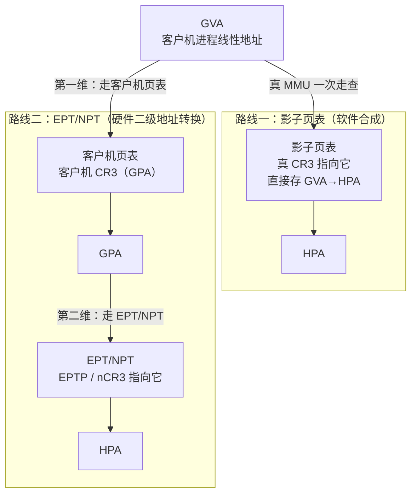
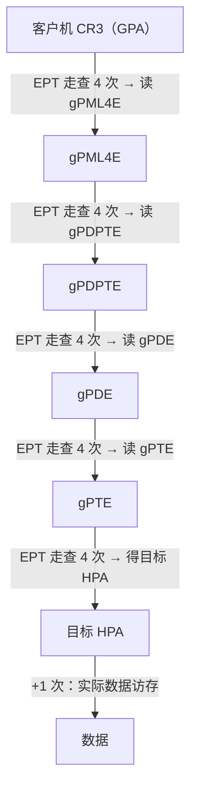

# 虚拟化与TEE机密计算（3）· 内存虚拟化：EPT与NPT与影子页表
> [!abstract] TL;DR
> - 内存虚拟化的本质是把「客户机虚拟地址 GVA → 客户机物理地址 GPA → 宿主物理地址 HPA」两段映射合成为一段：影子页表（Shadow Page Table）用软件把两段压成一张 GVA→HPA 表交给真 MMU；EPT/NPT 让硬件做二级地址转换（SLAT），MMU 同时走两维页表。
> - 影子页表靠「写保护客户机页表 + 缺页 VMExit」维持一致，代价是海量陷入（客户机每次改页表、切 CR3、INVLPG 都可能退出）；EPT/NPT 把客户机缺页、CR3 切换、进程切换全部留在客户机内原生执行，只有 GPA 层出错才以 EPT violation 退出。
> - SLAT 的代价是二维页表走查：4 级客户机页表 × 4 级 EPT，最坏一次走查要 **24 次访存**（原生只需 4 次），靠嵌套 TLB、页表走查缓存（PWC）与大页把均摊成本压下来。
> - TLB 标签（Intel 的 VPID、AMD 的 ASID，叠加客户机内部的 PCID）让 guest 与 host、不同 vCPU 的翻译共存于同一张 TLB，VM 进出不再全刷；INVEPT 作废「客户机物理映射」，INVVPID 作废「线性映射」，二者叠加才作废「组合映射」。
> - EPT 的 R/W/X 分离权限位（含仅执行页、MBEC 区分内核/用户执行）既是 HVCI/VBS 在客户机内核「之下」强制 W^X 的地基，也是 EPT hook、内存隐藏、虚拟机自省（VMI）取证的硬件抓手。

## 概述与定位

上一章我们解决了「CPU 怎样被虚拟化」——VT-x/AMD-V 用根/非根两种执行模式，让客户机的特权指令要么直接跑、要么陷入 Hypervisor。但只解决 CPU 是不够的：客户机操作系统坚定地相信自己独占一整块物理内存，从 0 号物理页开始连续编址，还要用自己的页表把进程的虚拟地址翻译到「物理」地址。问题在于，客户机眼里的「物理地址」根本不是真物理地址——它只是宿主分配给这台虚拟机的一段（往往还不连续的）宿主物理内存的一个视图。于是内存虚拟化要回答的核心问题是：**如何在客户机毫不知情、且尽量不牺牲性能的前提下，把「客户机自认为的物理地址」再翻译一层到真正的宿主物理地址。**

为把术语钉死，本篇统一用三个地址空间：

- **GVA（Guest Virtual Address）**：客户机进程看到的线性地址，由客户机页表管理。
- **GPA（Guest Physical Address）**：客户机内核眼中的「物理地址」，其实是虚拟机的伪物理空间。
- **HPA（Host Physical Address）**：宿主机真正的物理地址，Hypervisor 说了算。

原生系统只有 GVA→物理一层翻译，MMU 走查客户机页表即可。虚拟化下多了 GPA→HPA 这一层，历史上有两条路线来实现它：

1. **影子页表（Shadow Page Table）**——纯软件方案。Hypervisor 在幕后维护一套「影子」页表，把 GVA 直接映射到 HPA（即把客户机的 GVA→GPA 与自己的 GPA→HPA 两段**函数复合**成一段），让真 MMU 用这套影子表工作。客户机自己的页表被架空成「参考数据」。
2. **二级地址转换 SLAT（Second-Level Address Translation）**——硬件方案。CPU 增加一套由 Hypervisor 控制的「第二维」页表：Intel 叫 **EPT（Extended Page Tables，扩展页表）**，AMD 叫 **NPT（Nested Page Tables，嵌套页表，早期市场名 RVI/Rapid Virtualization Indexing）**。客户机页表照常管 GVA→GPA，EPT/NPT 管 GPA→HPA，MMU 硬件一次走查同时穿过两维。

本篇聚焦 CPU 侧的内存翻译，即 vCPU 取指/访存路径上的地址转换。设备通过 DMA 直接访问内存时的 GPA→HPA 重映射（IOMMU/VT-d/AMD-Vi）是另一套机构，留给[[04.IO虚拟化与设备直通VT-d|下一章]]；把 EPT 再叠一层给客户机内 Hypervisor 用的「嵌套 EPT」属于[[07.嵌套虚拟化]]的范畴。理解本篇是理解 HVCI/VBS、机密虚拟机（SEV/TDX 的内存加密都建立在二级页表之上）乃至 Enclave 侧信道的地基。

## 原理与机制

### 为什么不能让客户机页表直接管真物理内存

最朴素的想法是：既然客户机有页表，就让 MMU 直接用它。但客户机页表里的物理地址字段填的是 GPA，若 MMU 拿 GPA 当 HPA 去访存，客户机就能读写任意宿主物理页——隔离荡然无存，一台虚拟机随手就能踩到另一台或宿主内核。所以 GPA→HPA 这层翻译**必须存在且必须由 Hypervisor 掌控**，客户机无权绕过。分歧只在于这层翻译由软件合成（影子页表）还是由硬件承担（EPT/NPT）。

### 影子页表：把两段映射压成一段

影子页表的思路是数学上的函数复合。设客户机映射 $f: GVA \to GPA$（由客户机页表定义），Hypervisor 映射 $g: GPA \to HPA$（由内存分配决定），那么影子页表就是 $g \circ f: GVA \to HPA$。真 CR3 被 Hypervisor 偷偷指向影子表；客户机以为自己写进 CR3 的值生效了，实际上每次客户机加载 CR3 都会 VMExit，Hypervisor 据此切换/构造对应的影子表。

难点在**保持一致性**：客户机随时会修改自己的页表（映射新页、换出页、改权限），而影子表是它的「编译结果」，客户机改了源、影子却不知道。经典解法是**写保护客户机页表页**——Hypervisor 在影子映射里把「装着客户机 PTE 的那些物理页」标记为只读。客户机一旦写自己的页表，就触发缺页 → VMExit，Hypervisor 解码这条写指令、更新对应影子表项、再放行。另一种等价视角是把影子表当作一个「**虚拟 TLB**」：影子项按需惰性填充（客户机首次访问某 GVA 缺页时才由 Hypervisor 补上），并在客户机执行 INVLPG 或切 CR3 时按 TLB 语义作废。

影子页表逻辑自洽，在没有硬件 SLAT 的年代（早期 VMware、早期 Xen）是唯一选择，但它的**性能税极重**：

- **陷入风暴**：客户机的每一次缺页都可能要退出——既有客户机真正要处理的缺页，也有「客户机页表没变、只是影子没填」的**隐藏缺页（hidden/shadow fault）**，后者对客户机完全透明却照样吃一次 VMExit。写保护还让「改页表」这种高频操作全部走陷入。fork 密集、进程切换密集的负载会被打得很惨。
- **内存膨胀**：每个客户机进程上下文（每个 CR3 值）都要一套独立影子表，Hypervisor 得缓存许多套并做替换，元数据开销大。
- **A/D 位与大页维护复杂**：访问位/脏位、大页拆分合并都得软件模拟同步。

一句话：影子页表把「客户机页表活动」整体变成了 Hypervisor 的负担。硬件 SLAT 就是冲着消灭这些陷入去的。

### EPT/NPT：让硬件走两维页表

SLAT 的核心是给 MMU 加一套「第二维」页表，其根指针存在 CPU 的虚拟化控制结构里：Intel 把 **EPT 指针（EPTP）**放进 VMCS，AMD 把**嵌套 CR3（nCR3）**放进 VMCB。开启后：

- 客户机页表原封不动地管 GVA→GPA，客户机可以自由改它、切 CR3、执行 INVLPG，**统统不再 VMExit**——因为这些都发生在 GPA 之下，动不了宿主。
- MMU 走查客户机页表时，凡是遇到一个 GPA（客户机 CR3 的值、每一级客户机页表项里的下一级基址、以及最终数据页地址），都会**再用 EPT/NPT 把这个 GPA 翻成 HPA** 才能继续。
- 只有当某个 GPA 在 EPT 里映射不存在或权限不符时，才触发 **EPT violation** 退出，交给 Hypervisor 处理（用于 MMIO 模拟、按需分页、内存自省等）。

代价是**页表走查从一维变二维**，访存次数暴涨（下一节详解）。但因为绝大多数翻译命中 TLB，且客户机日常的缺页/切换全部原生化，实测吞吐远胜影子页表——这是一次典型的「用更长的冷路径换更少的陷入」的软硬件权衡。

下图对比两条路线：影子页表把两段折叠给真 MMU 一次走完；EPT/NPT 保留两维、由硬件穿两层。



## 数据结构与走查算法详解

### EPT 页表结构与表项位布局

EPT 复刻了 x86-64 四级分页的层级（EPT PML4 → EPT PDPT → EPT PD → EPT PT），但**表项位布局是 Intel 另起炉灶设计的**，与普通页表不同。一个 EPT 叶子项（EPT PTE，映射 4KB 页）的关键字段大致如下：

```
位  0     R      读权限
位  1     W      写权限
位  2     X      执行权限（开启 MBEC 时特指“监督态执行”）
位  5:3   memtype EPT 内存类型（0=UC，6=WB，…；覆盖客户机 PAT 与 MTRR 的最终缓存策略）
位  6     IPAT   忽略 PAT
位  7     —      叶子项保留（非叶子的 PDPTE/PDE 里此位=1 表示映射大页 1GB/2MB）
位  8     A      访问位（EPTP 使能 A/D 后由硬件置位）
位  9     D      脏位（同上）
位  10    XU     用户态执行权限（开启 MBEC 后独立于位 2 的监督态执行）
位 N-1:12 PFN    目标 HPA 的物理页帧号
位  63    SVE    抑制 #VE（虚拟化异常），配合把 EPT violation 转成客户机内可处理的 #VE
```

几个「为什么这样设计」的点值得展开：

- **没有独立的 Present 位**：EPT 项的「存在与否」由 R/W/X 三位是否全 0 推断——全 0 即不存在，访问就触发 EPT violation。这个设计让 Hypervisor 能用「读写皆无但可执行」「可读不可执行」等任意组合表达细粒度策略，而不必像普通页表那样受 P 位束缚。
- **R/W/X 完全解耦**：普通 x86 页表里没有独立「读」位（可读是隐含的），也长期没有独立执行位（后来才有 NX）。EPT 把三者拆开，才可能出现「**仅执行页**（X=1, R=0, W=0）」——这是 EPT hook 做「取指看到 A 页、读数据看到 B 页」split-view 隐藏的硬件基础。注意仅执行页需要 CPU 报告支持该能力，否则「X=1 而 R=0」会被判为 **EPT 配置错误（misconfiguration）**。
- **EPT violation vs EPT misconfiguration**：前者是「项合法但当前访问越权/缺失」，是**正常且可用**的退出（Hypervisor 借它做 MMIO、按需分页、introspection）；后者是「项本身非法」（保留位置位、无效内存类型 2/3/7、写而不可读 W=1&R=0、不支持仅执行却 X=1&R=0 等），几乎总是 Hypervisor 的 bug，语义更接近硬件报错。二者退出原因不同，调试时要分清。
- **内存类型内建**：EPT 叶子项自带缓存类型字段，Hypervisor 可强制某段 GPA 的缓存策略，这对 MMIO（必须 UC）和一致性至关重要。

AMD NPT 是另一种取舍：**嵌套页表直接复用标准 AMD64 页表格式**（P、R/W、U/S、NX 等位含义与普通页表一致），不像 Intel 那样发明新格式。好处是权限位语义天然对齐、软件复用普通页表代码；代价是不像 EPT 那样把内存类型、#VE、子页写权限（SPP）等特性一次性塞进项里，这些特性 Intel 是逐代加上去的。

### 二级页表走查：24 次访存是怎么来的

这是本篇最硬核的一段。原生 4 级分页走一次页表最多 4 次访存（读 PML4E、PDPTE、PDE、PTE），加最终数据访问即「4+1」。开启 EPT 后，客户机走查里出现的**每一个 GPA 都要先经 EPT 翻成 HPA 才能访问**，于是走查退化成二维。

推导最坏情况（客户机 4 级 × EPT 4 级）：客户机走查过程中需要访问 5 个 GPA——

1. 客户机 CR3（客户机 PML4 的基址，GPA）；
2. gPML4E 里取出的 gPDPT 基址（GPA）；
3. gPDPTE 里取出的 gPD 基址（GPA）；
4. gPDE 里取出的 gPT 基址（GPA）；
5. gPTE 里取出的最终数据页地址（GPA）。

前 4 个 GPA 各需「4 次 EPT 访存定位 HPA + 1 次读该客户机页表项」= 5 次，共 4×5 = 20 次；第 5 个 GPA 只需 4 次 EPT 访存得到最终 HPA（数据本身的读写是走查之外的「+1」）。合计 **20 + 4 = 24 次访存**，恰好是原生 4 次的 6 倍。



如果两维都是 5 级分页（LA57），最坏是 $5\times(5+1)+5 = 35$ 次。可见走查开销随层级平方级增长，这正是硬件必须靠缓存来救场的原因。

### 页表走查缓存与嵌套 TLB：把 24 次摊薄

24 次只是理论最坏值，真实系统很少每次都付全款，靠三重缓存兜底：

- **TLB 命中**：绝大多数访存命中最终 GVA→HPA 的组合映射（combined mapping），根本不走查。
- **页表走查缓存（Page Walk Cache, PWC）**：缓存走查中间节点（如某 PML4E/PDPTE 的结果），相邻地址复用前缀，省掉高层重复走查。
- **嵌套 TLB（AMD 明确命名 Nested TLB）**：专门缓存「客户机页表指针的 GPA→HPA 翻译」。因为一次走查里前 4 个 GPA（客户机各级页表基址）在同一进程内高度复用，缓存住它们就能把二维走查的第二维大幅短路。
- **大页**：EPT 侧用 2MB/1GB 大页（PDPTE/PDE 的位 7 置位）减少 EPT 维层数；客户机侧用大页减少第一维层数。两维叠加，大页对 SLAT 的收益比原生更显著。

所以工程上「客户机+宿主都尽量用大页、给 TLB 减压」是虚拟化调优的通用手筋。

### TLB 标签：VPID、ASID 与 PCID 的三层协作

若 TLB 不带标签，那么每次 VM 进出（根/非根切换）、每次切换 vCPU 都必须整表刷新 TLB，冷启动惩罚会吃掉 SLAT 省下的收益。于是硬件给 TLB 项打**标签**，让不同世界的翻译共存：

- **VPID（Virtual-Processor Identifier，Intel，16 位）**：VMCS 里给每个 vCPU 分配一个 VPID，TLB 项带上它。VPID 0 保留给 VMM（根模式）。这样 guest 与 host、不同 vCPU 的线性映射在 TLB 里各自为政，VM 进出不再全刷。
- **ASID（Address-Space Identifier，AMD）**：VMCB 里的等价机制，配合 TLB_CONTROL 字段控制刷新粒度，理念与 VPID 相同。
- **PCID（Process-Context Identifier）**：这是**客户机操作系统内部**用的进程标签（CR3 低位），作用于 GVA→GPA 一维，用来避免进程切换刷 TLB。它与 VPID 正交：PCID 区分「同一客户机内的不同进程」，VPID 区分「不同 vCPU/世界」。二者叠加，进程切换与 VM 切换都能免刷。

Intel SDM 把 TLB 里缓存的映射分三类，理解它们才知道该用哪条作废指令：

- **线性映射（linear mapping）**：GVA→物理，带 VPID 与 PCID 标签，客户机 INVLPG 与 **INVVPID** 作废它。
- **客户机物理映射（guest-physical mapping）**：GPA→HPA，带 EPTP 标签，**INVEPT** 作废它。
- **组合映射（combined mapping）**：GVA 一路到 HPA（穿两维），同时带 VPID/PCID/EPTP，**INVVPID 与 INVEPT 都会作废它**。

对应的作废指令粒度也各有讲究：INVEPT 有「单上下文（某 EPTP）/全局」两型；INVVPID 有「单地址/单上下文/全上下文/单上下文但保留全局项」四型。Hypervisor 改了 EPT 项却忘了正确的 INVEPT，或跨 vCPU 忘了 TLB shootdown，就会留下**过期映射**——轻则崩溃，重则跨 VM 信息泄露，是虚拟化里极隐蔽的一类 bug。

### 顺带一提的进阶特性

- **A/D 位加速**：EPTP 使能后，硬件在 EPT 项里置访问/脏位，用于活迁移的脏页追踪（另一路做法是清 EPT 的 W 位、靠首次写触发 violation 建脏位图，KVM 两种都用）。
- **MBEC（Mode-Based Execute Control）**：把执行权限拆成「监督态执行 XS」与「用户态执行 XU」，让 Hypervisor 能对内核代码与用户代码施加不同的可执行策略——HVCI 保护内核完整性时用得上。
- **SPP（Sub-Page write Permission）**：把 4KB 页再切成 128B 粒度控制写权限，用于更细的内存保护/introspection。
- **#VE（虚拟化异常，向量 20）**：把某些 EPT violation 从「VMExit」转成「客户机内可处理的异常」，减少退出——是后续 TDX 等机密计算里客户机与 VMM 协作的机制之一。

## 工具视角与实战

**主流 Hypervisor 全用 SLAT**：KVM 的 MMU 子系统同时实现影子页表（无 EPT 的老硬件/嵌套场景兜底）与 EPT/NPT（`tdp_mmu`，two-dimensional paging），Xen 的 `p2m`（physical-to-machine）表本质就是 EPT/NPT，Hyper-V、VMware ESXi 亦然。看一台机器是否在跑 EPT：Intel 上 `cat /proc/cpuinfo | grep ept`、KVM 的 `kvm_intel` 模块参数 `ept=Y`；调试时从 VMCS 的 EPT-pointer 字段（编码 `0x201A`）读出 EPTP，低 3 位是内存类型、位 5:3 是「走查层数−1」（4 级即 3），高位是 EPT PML4 的 HPA，之后就能手工按上面结构走查 GPA。

**EPT hook / split-view 隐藏**是逆向圈最爱的玩法。利用「仅执行页」，让同一段 GVA 在**取指**时经 EPT 落到「打了 hook 的代码页」，而在**读**时落到「原始未改的代码页」，从而对客户机内的完整性校验/反作弊隐藏 inline hook——这就是当年软件版 "Shadow Walker" 的硬件正规版。实现上把 hook 页设为仅执行，一旦发生读/写就 EPT violation，Hypervisor 把该 GPA 的 EPT 项临时换成「可读写、不可执行」的原始页视图并单步，单步完再换回执行视图。开源框架如 HyperPlatform、Gbhv、DdiMon、hvpp 都是这套路数。


**虚拟机自省（VMI）与恶意软件分析**：LibVMI、DRAKVUF 等借 EPT violation 在 Hypervisor 层拦截客户机的执行/写入，实现无 agent 的断点、系统调用追踪、隐蔽内存快照——因为断点设在 EPT 层，客户机内的反调试查不到自己代码被改。DRAKVUF 的「隐身断点」正是把目标页设为不可执行、命中即退出的套路。

**Windows VBS/HVCI 的地基**：VBS 把一个安全内核（Secure Kernel）跑在更高信任级，用 SLAT（EPT）在**普通客户机内核之下**强制物理内存的 W^X——普通内核即使被攻陷、拿到 ring0，也改不了 EPT，因而无法把一段可写内存变成可执行、无法加载未签名驱动。HVCI 就是靠 EPT + MBEC 让「代码页可执行不可写、数据页可写不可执行」成为客户机无法逾越的硬边界。细节见[[38.Windows内核与驱动逆向/25.HyperV架构与VBS]]与[[38.Windows内核与驱动逆向/29.CI.dll与代码完整性WDAC]]。

**性能观测**：Intel PMU 有 EPT 走查周期相关事件（如 `EPT.WALK_*`、`PAGE_WALK`），可量化二维走查开销；`perf kvm`、`kvm_stat` 能看 EPT violation 频率与退出原因分布，是判断「MMIO 抖动」或「按需分页风暴」的入口。

## 安全性与正确使用

**SLAT 首先是隔离与完整性的地基。** GPA→HPA 这层由 Hypervisor 独占，客户机无论怎么折腾自己的页表都跨不出宿主分给它的物理页，这是多租户隔离的底线；再往上，HVCI/VBS 用 EPT 把「内核代码完整性」变成客户机内核自己都撤不掉的约束，把「拿到 ring0 就为所欲为」这一经典假设直接打破。可以说，现代 Windows 的内核加固、以及 SEV/TDX 机密虚拟机的内存保护，全都站在二级页表这块地基上。

**但同一套机制也是双刃剑。** EPT 的「取指与读写走不同视图」能力，善用是 HVCI、是 VMI 取证；恶用就是 Hypervisor 级 rootkit 的隐藏手段——把恶意代码藏在只在取指时可见的页里，客户机内任何扫描器（它只能发起「读」）都看不到真身。反作弊、EDR 与作弊器/rootkit 在这条战线上长期对攻。防御视角的要点是：**信任根必须比 EPT 更低**（度量启动/TPM 保证 Hypervisor 自身可信，见[[39.固件与IoT嵌入式逆向/21.安全启动链绕过技术]]），否则被攻陷的 Hypervisor 之上一切 EPT 保护都是空谈。

**误用风险集中在一致性与配置两处：**

- **TLB 作废纪律**：改了 EPT/客户机映射却用错 INVEPT/INVVPID 型别，或跨 vCPU 漏做 TLB shootdown，会留下过期的组合映射。后果从客户机随机崩溃，到最坏的**跨 VM 或 VM→宿主的陈旧翻译泄露/写入**——这是一类极难复现、却安全影响严重的 bug，是[[09.虚拟机逃逸原理与案例]]里反复出现的母题。
- **EPT 配置错误**：叶子项写了无效内存类型、保留位、或「可写不可读 / 不支持仅执行却仅执行」等非法组合，触发 misconfiguration 退出甚至机器检查异常；权限位配反（该 UC 的 MMIO 配成 WB）则导致数据一致性灾难。构造 EPT 时务必逐位核对 SDM/APM 的合法性约束。
- **按需分页与 MMIO 模拟的解码风险**：EPT violation 后 Hypervisor 常需解码触发指令来模拟访问，指令模拟器的每一处偏差都是攻击面。

**侧信道**是安全性的最后一环，也为本系列尾声埋伏笔。二维走查、共享的 TLB 与页表走查缓存、EPT 的 A/D 位活动，都会在时间维度上泄露客户机的访存模式；这类「页粒度/TLB 粒度」的观测正是攻击 SGX 等 Enclave 的利器（见[[15.Enclave逆向与侧信道攻击]]）。正确使用意味着：在高安全场景配合分区、刷新与常数时间实现来收敛这些侧信道，而不是假装它们不存在。

**正确使用的边界清单**：客户机与宿主都尽量用大页并对齐、给 TLB/PWC 减压；活迁移优先用 EPT A/D 位而非频繁清写位；改映射后严格按映射类别选对作废指令并做全 vCPU shootdown；把内存类型交给 EPT 强制而非信任客户机 PAT；对暴露给客户机的 #VE/SPP 等协作特性做完备的输入校验。

## 小结

内存虚拟化要解决的是「客户机以为的物理内存」到「真物理内存」这多出来的一层翻译。影子页表用软件把两段映射复合成一段喂给真 MMU，逻辑自洽但被写保护与缺页陷入拖垮，是无硬件年代的权宜之计；EPT/NPT 用一套 Hypervisor 掌控的二级页表实现硬件二级地址转换，把客户机的缺页、CR3 切换、进程切换全部原生化，代价是二维页表走查（4×4 最坏 24 次访存），再靠嵌套 TLB、页表走查缓存与大页把均摊成本压回可用区间。VPID/ASID（叠加客户机内的 PCID）给 TLB 打标签，让多世界翻译共存、VM 进出免全刷，而 INVEPT/INVVPID 的正确使用则是安全与一致性的生命线。EPT 的 R/W/X 分离权限位，向上撑起了 HVCI/VBS 的内核完整性与机密虚拟机的内存保护，也成了 EPT hook、VMI 与 rootkit 争夺的战场。理解这套二级页表，是继续读懂 VT-d、嵌套虚拟化、虚拟机逃逸乃至 SEV/TDX 机密计算的必经之路。

## 相关阅读

- Intel® 64 and IA-32 Architectures Software Developer's Manual, Volume 3C：Chapter 28–29（VMX、EPT、VPID、INVEPT/INVVPID、EPT violation/misconfiguration 位定义）——EPT 一切细节的权威出处。
- AMD64 Architecture Programmer's Manual, Volume 2: System Programming：Chapter 15（SVM、Nested Paging、nCR3、ASID）——NPT 与 EPT 差异的对照文本。
- Ravi Bhargava et al., "Accelerating Two-Dimensional Page Walks for Virtualized Systems," ASPLOS 2008——二维走查开销与嵌套 TLB/PWC 的经典分析。
- KVM 文档 `Documentation/virt/kvm/mmu.rst`——影子页表与 TDP（EPT/NPT）在真实 Hypervisor 中的工程化实现。
- 同系列：[[02.CPU虚拟化：VT-x与AMD-V|← CPU 虚拟化（VMCS/VMCB、根非根模式）]]、[[04.IO虚拟化与设备直通VT-d|IOMMU 侧的 GPA→HPA 重映射]]、[[07.嵌套虚拟化|嵌套 EPT]]、[[09.虚拟机逃逸原理与案例|EPT 相关逃逸]]、[[15.Enclave逆向与侧信道攻击|页/TLB 粒度侧信道]]。
- 同库承接：[[24.内存管理与堆分配器/02.进程地址空间与虚拟内存|普通分页与地址空间基础]]、[[21.Asm/40 虚拟化扩展对比|硬件虚拟化扩展横向对比]]、[[38.Windows内核与驱动逆向/25.HyperV架构与VBS|VBS 如何用 SLAT]]、[[38.Windows内核与驱动逆向/29.CI.dll与代码完整性WDAC|HVCI 的代码完整性]]。

[[00.虚拟化与TEE机密计算总览|⬆ 系列总览]] | [[02.CPU虚拟化：VT-x与AMD-V|← 上一章]] | [[04.IO虚拟化与设备直通VT-d|→ 下一章]]
