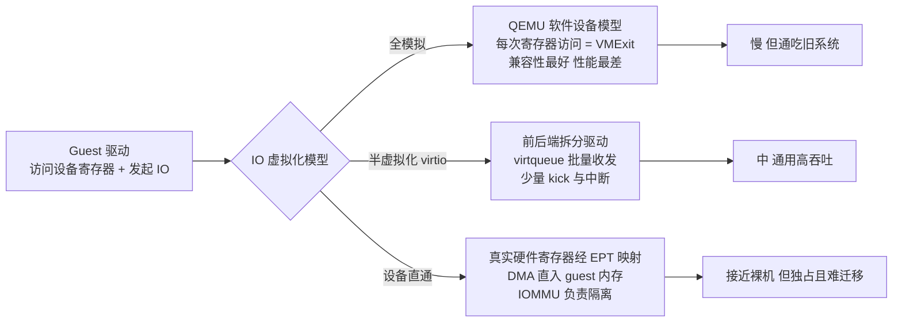
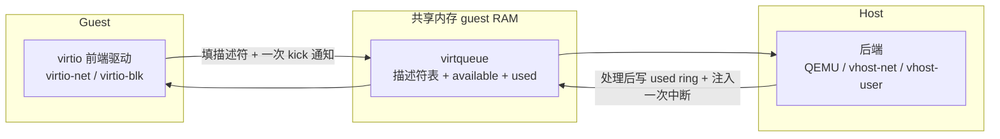
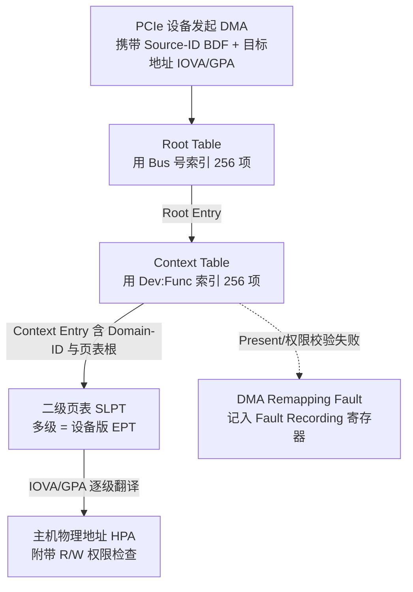
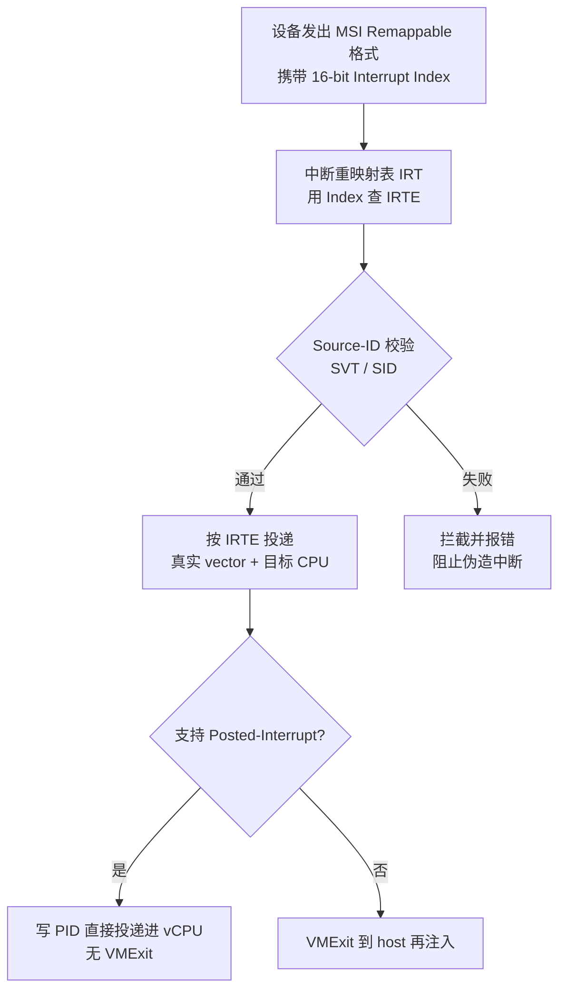
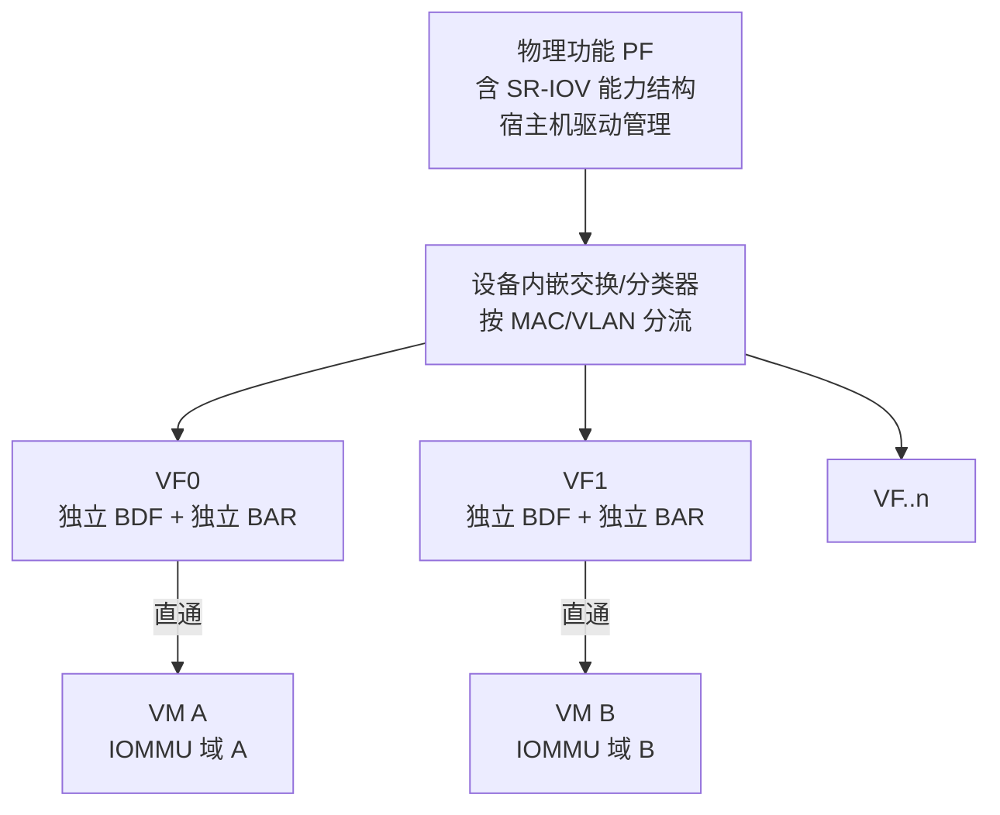

# 虚拟化与TEE机密计算（4）· IO虚拟化与设备直通VT-d

> [!abstract] TL;DR
> - IO 虚拟化有三条主线：全模拟（兼容性最好、最慢）、半虚拟化 virtio（改一次 guest 驱动换来批量化与更少 VMExit）、设备直通（接近裸机但牺牲迁移与内存超分）；性能、兼容性、灵活性三者此消彼长，没有免费午餐。
> - 直通的硬件前提是 IOMMU（Intel 叫 VT-d）：它用设备的 Requester-ID（BDF）查两级结构（Root Table→Context Table→二级页表），把设备发出的 DMA 地址（IOVA/GPA）翻译成 HPA，本质就是"给设备的 EPT"，从而把设备的 DMA 关进这台 VM 的地址空间。
> - VT-d 还负责中断重映射（IRTE）：拦截 MSI 携带的目标向量/CPU 并做 Source-ID 校验，防止恶意设备伪造中断；配合 Posted-Interrupt 可把中断直接投递进 vCPU 而不触发 VMExit。
> - SR-IOV 让一块物理网卡在硬件里切出多个 VF，每个 VF 有独立 BDF 与 BAR，可各自直通给不同 VM；Scalable-IOV 改用 PASID 做区分，把切分做得更细、更软、数量更多。
> - IOMMU 既是隔离手段也是攻击面：ACS 缺失导致的 P2P 绕过、4KB 页粒度导致的 sub-page 泄露、ATS "已翻译"标志被滥用、缺失 FLR 导致的复位残留，都是直通场景里真实存在的风险。

## 概述与定位

在本系列里，CPU 虚拟化（第 02 篇 VT-x/AMD-V）解决"指令怎么安全地代执行"，内存虚拟化（第 03 篇 EPT/NPT/影子页表）解决"GPA 怎么翻译成 HPA"。但一台虚拟机要真正干活，还得能看见硬盘、网卡、显卡、控制器——这就是 IO 虚拟化要回答的第三根支柱。它要同时解决三个层面的问题：guest 如何"看见"一台设备（枚举与配置空间）、guest 如何访问设备寄存器（PIO/MMIO 的读写路径）、以及设备如何把数据搬进搬出内存而不越界（DMA 与中断）。前两者靠 CPU/内存虚拟化的既有机制就能兜住，唯独 DMA 与中断是设备"主动发起"的、绕过 CPU 页表的旁路访问，必须引入一套专门的硬件——IOMMU——来管束，这正是本篇的重心。

理解 IO 虚拟化，最好把它看成一条连续的"频谱"，而不是三个孤立的方案。频谱的一端是**全模拟**：hypervisor 用纯软件模仿一颗真实芯片，guest 用它原本的驱动，兼容性拉满但慢得令人发指。中间是**半虚拟化（virtio）**：双方约定一套为虚拟化量身定制的高效接口，guest 换上专用驱动，用少量的"通知"换来大批量的数据搬运。另一端是**设备直通**：干脆把一台物理设备（或它切出来的一片）整个交给 VM，guest 驱动直接摸真寄存器、设备直接 DMA 进 guest 内存，性能逼近裸机。频谱之外还有个折中的**受控直通（mediated passthrough）**：控制面走软件中介、数据面走直通。选择哪一段，取决于你要的是兼容性、吞吐、还是可迁移/可超分——这三者几乎不可兼得，这是本篇要反复强调的工程直觉。

本篇聚焦"设备面与 DMA 面"：三种模型的原理与取舍、IOMMU/VT-d 的地址翻译与中断重映射内部结构、SR-IOV 与 Scalable-IOV 的硬件切分。至于寄存器访问怎么 trap 到 hypervisor，会复用第 03 篇 EPT 的机制；KVM 与 QEMU 如何协作承载这些设备模型，留给第 06 篇；本篇不与之重复，只在需要时引用。



## 原理与机制

### 全模拟：以 trap-and-emulate 为代价换兼容

全模拟的做法是在 hypervisor 里写一份设备的软件模型，比如 QEMU 模拟 Intel e1000 网卡、RTL8139、AHCI/IDE 硬盘控制器、PS/2 键鼠、VGA。guest 里跑的是操作系统自带的、未经修改的真实驱动，它以为自己在操作真芯片。奥妙全在寄存器访问的拦截上：设备寄存器要么走**端口 IO（PIO）**，guest 执行 `IN/OUT` 指令时直接触发 VMExit（退出原因为"IO instruction"），hypervisor 拿到端口号与数据后模拟其副作用；要么走**内存映射 IO（MMIO）**，hypervisor 在 EPT 里把那段 MMIO 物理区间设成不存在，guest 一访问就触发 EPT violation 退出，hypervisor 再解码触发访问的那条指令、算出目标寄存器与值，完成模拟。

慢的根因也就一目了然：发一个网络包，驱动可能要读写几十次寄存器（设描述符、敲门铃、查状态），每一次都是一次 VMExit，而一次往返动辄几千个时钟周期；DMA 搬数据也是软件在内存里 memcpy 模拟。既然这么慢，为什么还留着它？因为兼容性是它的护城河——安装期还没有 virtio 驱动、跑上古操作系统、或者要精确复现某颗真实芯片行为（逆向/兼容性测试）时，全模拟是唯一能开机的路。理解这一点，就知道全模拟不是"落后方案"，而是频谱里"兼容性优先"的那一端。

### 半虚拟化 virtio：用批量化摊薄退出成本

virtio 的哲学是"别再假装自己是真硬件了"。既然 guest 知道自己被虚拟化，双方就约定一套为软件-软件通信优化的接口。它采用**前后端拆分驱动**：前端是 guest 里的 virtio 驱动（virtio-net、virtio-blk、virtio-scsi、virtio-gpu 等），后端在宿主侧（QEMU 用户态，或内核态的 vhost）。二者通过 **virtqueue** 通信——一段位于 guest 内存、双方共享的环形缓冲区，内部由三部分构成：描述符表（每项描述一段 buffer 的地址、长度、标志、以及链向下一项的 next）、available ring（guest 告诉后端"这些描述符准备好了"）、used ring（后端告诉 guest"这些处理完了"）。

```
struct virtq_desc {   // split ring，每项 16 字节
    le64 addr;    // buffer 的 guest 物理地址
    le32 len;     // 长度
    le16 flags;   // NEXT(链) / WRITE(设备写) / INDIRECT(间接表)
    le16 next;    // 链式描述符的下一项索引
};
```

它快在**批量化**：guest 可以一口气填好几十上百个描述符，然后只做一次"kick"（一次 MMIO 写触发 VMExit 通知后端）；后端一次性处理完，也只回一次中断。几十次 IO 的退出成本被摊薄成一两次，这是相较全模拟数量级的提升。工程上还有两次"把后端往下沉"的优化：**vhost** 把后端搬进宿主内核（vhost-net/vhost-scsi），省掉 QEMU 用户态的上下文切换；**vhost-user** 把后端搬到另一个用户态进程（DPDK 做的 vSwitch、SPDK 做的存储），通过共享内存 + Unix socket 通信，让数据面彻底绕开内核。virtio 也有版本演进：legacy（0.9.5，寄存器塞在 PCI BAR0 的 IO 空间）、modern（1.0，改用 PCI capability 描述各结构、更规整）、以及 packed virtqueue（1.1，把三个环合成一个更缓存友好的紧凑环）。理解 virtio 的关键，是抓住"共享环 + 通知合并"这条主线，其余都是围绕它降开销的变体。



### 设备直通：把真设备交给 VM，也把 DMA 风险交出来

直通（passthrough / device assignment）走到频谱另一端：把一台真实 PCIe 设备整台分配给某个 VM。guest 驱动摸到的是真寄存器——hypervisor 通过 EPT 把设备的 MMIO BAR 直接映射进 guest 物理地址空间，于是寄存器读写**不再 trap**，速度等同裸机；设备的 DMA 引擎也直接把数据搬进/搬出 guest 内存。代价同样直接：设备被这台 VM 独占（无法像 virtio 那样一份后端服务多台）；破坏在线迁移（设备内部状态与未决 DMA 难以捕获/搬运）；无法内存超分（下面会讲，设备可能随时 DMA，宿主必须把 guest 内存整段 pin 住、不能换出或气球回收）。

直通要成立，需要两个硬件前提各管一面：**EPT 负责寄存器面**（把 MMIO 映射进 guest，让访问不 trap）；**IOMMU 负责数据面**（翻译并隔离设备的 DMA）。为什么 IOMMU 非有不可？两个理由。其一是**安全**：没有 IOMMU 时，一台 DMA 设备能读写任意物理地址，直通给 VM 就等于把整机内存的读写权交出去——guest 里一个恶意驱动让设备 DMA 到 hypervisor 或别的 VM 的内存，整个隔离瞬间崩塌。其二是**正确性**：guest 用它以为的"物理地址"（其实是 GPA）去编程设备的 DMA 描述符，而真实内存是 HPA，中间必须有人把 GPA 翻译成 HPA——这活儿 CPU 侧由 EPT 干，设备侧就得由 IOMMU 干。所以"IOMMU 的二级页表 = 设备版的 EPT"是贯穿本篇的核心心智模型。

### 受控直通：控制面中介、数据面直通的折中

在全直通与全模拟之间，还有一档**受控直通（mediated passthrough，mdev）**。典型是 Intel GVT-g 把一颗 GPU 切成多个 vGPU、NVIDIA vGPU（GRID）同理：软件中介（mediator）接管特权与上下文切换等控制面操作，而渲染命令提交这种性能关键的数据面尽量直通。Linux 用 vfio-mdev 框架承载。它让一台不支持 SR-IOV 硬件切分的设备也能被多台 VM 共享，代价是控制面仍有软件开销。理解它的意义在于：直通不是"全有或全无"，硬件与软件可以在不同的路径上分工。

## 结构与流程详解：VT-d 地址翻译、中断重映射与 SR-IOV

这一段深入 IOMMU 内部。IOMMU 坐在 PCIe root complex 与内存之间，干两件事：**DMA 重映射（DMAR）**——翻译并校验设备 DMA 的目标地址；**中断重映射（IR）**——翻译并校验设备发出的中断。先看 DMA 重映射。

### DMAR 的翻译结构：用 BDF 查两级表走到设备版 EPT

一次设备 DMA 请求携带两样东西：它想访问的地址（IOVA，在 VM 直通场景里 guest 用 GPA 编程设备，所以这个 IOVA 就是 GPA）和它的 **Requester-ID / Source-ID**，即设备的 PCIe BDF。

```
Requester-ID / Source-ID（16 bit）
 15            8 7      3 2   0
+--------------+--------+-----+
|   Bus (8)    | Dev(5) | Fn3 |
+--------------+--------+-----+
例：01:00.0 → Bus=0x01 Dev=0x00 Fn=0 → Source-ID=0x0100
```

IOMMU 用这个 Source-ID 走两级表：先用 **Bus 号**索引 **Root Table**（一张 4KB 页，256 项）得到 Root Entry，它指向该总线专属的 **Context Table**；再用 **Dev:Func**索引 Context Table（256 项）得到 **Context Entry**。Context Entry 是关键，它包含：Present 位、指向**二级页表（Second-Level Page Table，SLPT）**根的指针、**Domain-ID（DID）**（表示该设备归属哪个隔离域/地址空间，同一 VM 的设备共享同一域、同一套页表）、地址宽度 AW、翻译类型等。二级页表是一张多级（3/4/5 级）页表，结构与 EPT 神似：把 IOVA/GPA 按 4KB（或 2MB/1GB 大页）逐级翻译成 HPA，每级带 R/W 权限位。任一级 Present/权限校验失败，就产生 DMA Remapping Fault，记入 Fault Recording 寄存器——这是逆向时定位"某设备 DMA 越界"的一手证据。



为了不让每次 DMA 都走一遍多级表，IOMMU 内部有 **IOTLB**（还有 Context/PASID 缓存）缓存翻译结果。一旦软件改了映射，必须显式发失效命令（寄存器失效或更高效的**队列失效 Invalidation Queue**）把旧条目清掉。这里是 bug 与漏洞的高发区：失效发漏了、或用了惰性/延迟失效策略，就会留下一段"旧翻译仍生效"的窗口，设备可能借此访问已被回收的页。

### Legacy 与 Scalable 模式：PASID 打开的进程级隔离

早期 VT-d 是 **Legacy 模式**：Root→Context→二级页表，一台设备只对应一个地址空间。VT-d 3.0 引入 **Scalable 模式**，在 Context 之后多插了 PASID 粒度：Root Entry → Scalable-Mode Context Entry → **PASID Directory** → **PASID Table Entry**，后者才指向**一级页表（FLPT）**和/或**二级页表（SLPT）**。这带来三种翻译组合：一级翻译（FLPT，采用与 CPU 相同的 IA-32e 页表格式，用于 SVM/共享虚拟地址，让设备直接吃进程的虚拟地址）；二级翻译（SLPT，GPA→HPA，等价 EPT）；以及嵌套（先一级再二级，VA→GPA→HPA，用于 VM 内部的 SVM）。核心是 **PASID（Process Address Space ID，20 bit）**：它让一台设备能同时挂多个地址空间/多个进程，是共享虚拟内存（SVM/SVA）的地基。

### ATS 与 PRI：把翻译缓存到设备、把缺页交回 OS

高端设备可通过 **ATS（Address Translation Services）**在自己内部维护一份地址翻译缓存（ATC/device-TLB）：设备先向 IOMMU 请求翻译、缓存下来，之后直接发"已翻译"的请求，省掉 IOMMU 每次查表的延迟。代价是引入了信任问题（安全段会细说）。**PRI（Page Request Interface）**则让设备在访问未调入的页时，向 OS 发缺页请求、等 OS 调页后再重试——它与 ATS+PASID 配合，才能实现真正的 SVM 按需调页，从而**在理论上摆脱"整段内存必须 pin"**的限制。不过在主流直通部署里，出于稳健性通常仍选择 pin。

### 中断重映射与 Posted-Interrupt

DMA 之外，中断同样是设备主动发起、绕过 CPU 页表的旁路。x86 上一个 MSI/MSI-X 中断本质是往特殊地址（`0xFEExxxxx`）写一笔、data 里编码目标向量与 CPU。没有中断重映射时，一台直通/恶意设备可以往任意地址写任意 data，等于能给任意 CPU 注入任意向量的中断——攻击宿主易如反掌。**IR** 的做法是：把 MSG 改成 Remappable 格式，只携带一个 16-bit 的 Interrupt Index（句柄）；IOMMU 用它查 **中断重映射表 IRT** 的表项 **IRTE**，IRTE 里存着真正的向量、目标 CPU、投递模式，还有一段 **Source-ID 校验（SVT/SID）**确认这个中断确实来自被允许的那台设备（防伪造）。于是设备只能触发 hypervisor 预先给它编好的那些中断。更进一步，**Posted-Interrupt** 允许 IOMMU/APIC 把中断直接"投递"进内存里的 Posted-Interrupt Descriptor 并通知正在跑的 vCPU，**不经 VMExit** 就把中断送进 guest——对高中断率的高速网卡直通，这是决定性的性能优化。



### SR-IOV：在硬件里把一颗设备切成多份

前面的直通是"整台设备给一台 VM"，太奢侈。**SR-IOV（Single Root I/O Virtualization）**是 PCIe 标准扩展，让一颗设备在硬件层切出多个可独立直通的功能。支持它的功能在配置空间里有 SR-IOV Extended Capability，角色分两类：**PF（Physical Function）**是完整功能，带 SR-IOV 能力、负责配置与管理 VF；**VF（Virtual Function）**是"轻量功能"——它有**自己独立的 Requester-ID（BDF）**（这是隔离的命门，IOMMU 才能按 BDF 把不同 VF 关进不同域）、自己的 MMIO BAR（VF BAR 在能力结构里以固定步长描述）、一份精简的配置空间（很多字段继承自 PF）、以及独立的 DMA 能力。VF 不能被普通 PCI 扫描枚举，OS 要用 SR-IOV 能力里的 First VF Offset、VF Stride 字段（配合 ARI 突破 8 功能上限）算出各 VF 的 BDF。设备内部还有一个嵌入式的分类器/二层交换（网卡就是内嵌 L2 switch），按 MAC/VLAN 把流量分流到对应 VF 的队列。把一个 VF 直通给 VM：guest 看到一张网卡、DMA 进自己的内存、IOMMU 凭 VF 的 BDF 隔离，互不越界。



SR-IOV 的 VF 偏"重"：每个都要占一段 BAR、一份配置空间与硬件资源，数量常被限制在几十到几百，且创建相对静态。**Scalable-IOV（S-IOV）**是 Intel 的更细粒度替代：设备暴露许多"可分配设备接口（ADI）"，由宿主侧的 VDCM（Virtual Device Composition Module）用软件组合出虚拟设备，区分靠 **PASID** 而非 BDF，中断用设备私有的 IMS（Interrupt Message Store）而非标准 MSI-X 表。于是实例可以更多（上千）、更动态、更轻，典型用在 DSA（数据流加速器）、QAT 等加速器上。二者的取舍很清楚：SR-IOV 硬件切分、隔离靠 BDF、成熟通用；S-IOV 软硬结合、隔离靠 PASID、密度更高但依赖专用驱动栈。

### 跨平台的同构：AMD-Vi 与 ARM SMMU

这套思想不是 Intel 独有。**AMD-Vi（AMD IOMMU）**用 Device Table（按 BDF 索引）→ DTE（Device Table Entry）→ IO 页表，同样有中断重映射，概念一一对应。**ARM SMMUv3** 则用 StreamID（相当于 BDF）→ Stream Table Entry → Context Descriptor，明确分成 stage-1（相当于一级/进程页表）与 stage-2（相当于 EPT），两级翻译的模型与 VT-d scalable 如出一辙。记住"Source-ID → 查表 → 两级/两阶段翻译 + 中断重映射"这条主干，换平台只是换名词。

## 工具视角与实战

在 Linux 上启用与观察这套机制，路径相当固定。内核命令行加 `intel_iommu=on`（AMD 用 `amd_iommu=on`）打开 IOMMU；常配 `iommu=pt`（passthrough/identity 模式：宿主自用的设备走恒等映射、等于对它们旁路 DMA 翻译以减小 IOTLB 压力、提升宿主设备性能，只有被显式分配的设备才走真正的翻译）。开机后用 `dmesg` 过滤 `DMAR`/`IOMMU` 看初始化日志，用 `ls /sys/kernel/iommu_groups/` 查看 IOMMU 分组——这是分配的最小单位。

现代分配设备走 **vfio** 框架（早已取代旧的 KVM device assignment）。它有三层概念：**container**（一个 IOMMU 上下文/地址空间，绑到 QEMU 进程）、**group**（IOMMU 组，硬件能隔离的最小设备集合，由 ACS 与拓扑决定）、**device**（组内的具体设备）。流程是：打开 `/dev/vfio/vfio` 建 container、打开 `/dev/vfio/<groupid>` 拿 group、把 group 塞进 container、设 IOMMU 类型，然后 `VFIO_IOMMU_MAP_DMA` 把 guest 内存映射进 IOMMU。正因为 QEMU 会把 guest 整段 RAM 都映射进 IOMMU（设备随时可能 DMA 到其中任一页），guest 内存必须被 pin 住——这解释了直通为何与内存超分/气球不共存。把设备绑到 vfio-pci 常用 `driver_override` 写 sysfs、或内核命令行 `vfio-pci.ids=厂商:设备`；QEMU 侧一句 `-device vfio-pci,host=0000:01:00.0` 就完成直通。创建 SR-IOV 的 VF 则是 `echo N > /sys/class/net/eth0/device/sriov_numvfs`。

逆向/排障视角有几个高价值动作。`lspci -vvv` 能看到设备的能力位：`Single Root I/O Virtualization (SR-IOV)`、`Address Translation Service (ATS)`、`Process Address Space ID (PASID)`、`Page Request Interface (PRI)`——由此判断一台设备支持哪档虚拟化。分析崩溃或越界时，DMAR Fault 日志里的 Source-ID 与 fault 地址能直接指认"哪台设备想 DMA 到哪个不该碰的地址"。若要在 guest 内部再跑用户态驱动（DPDK）或做嵌套直通，需要给 guest 塞一个 **vIOMMU**（QEMU 的 `intel-iommu` 设备），让 guest 自己也有一套 IOMMU 页表，宿主再通过嵌套翻译或影子把 guest 的 stage-1 与宿主的 stage-2 叠起来。读设备驱动源码时，抓住 virtqueue/ring 的描述符布局与 door-bell 寄存器偏移，往往就能还原数据面的全貌。

## 安全性与正确使用

IO 虚拟化的安全性几乎全系于 IOMMU 这一根弦，用对了是护城河，配错了是直通门。首先，**IOMMU 是 DMA 攻击的主要防线**。历史上 FireWire、Thunderbolt、ExpressCard 乃至内部 PCIe 这类具备 DMA 能力的外设可以读写全部物理内存，催生了 Inception、PCILeech 这类工具——插一个恶意 Thunderbolt 设备就能把内存整段 dump 出来、抠密钥、改内核。IOMMU 把每台设备的 DMA 限制在 OS/hypervisor 明确映射的那些页里，Windows 的 Kernel DMA Protection、Linux 的 IOMMU strict 模式都是这条思路的落地。

但**"开了 IOMMU"不等于安全**，2019 年的 Thunderclap 研究正是当头一棒：很多系统即便开了 IOMMU，也把映射开得过宽（整页、共享缓冲区暴露给设备）、在保护建立好之前就使能了设备、或用了惰性/延迟失效留下时间窗口——攻击者照样得手。这说明 IOMMU 是必要不充分条件，**映射策略同样是安全边界**。与之相关的是**sub-page 问题**：IOMMU 的保护粒度是 4KB 页，若一段合法的 DMA buffer 与其他敏感数据挤在同一页，设备就能顺带读写整页的其余部分；缓解要靠专用 bounce buffer 或按页对齐分配。

其次是几个直通特有的坑。**ACS 缺失导致 P2P 绕过**：若两台设备在一个不强制 ACS 的 PCIe 交换/桥下面，它们之间的点对点 DMA 可以不经 IOMMU，于是被隔离性合并进同一个 IOMMU 组、必须整组一起分配；社区流传的"ACS override 补丁"强行伪装 ACS 存在来拆分组、图省事，实则是真实的安全漏洞，生产环境绝不能用。**中断伪造**：没有中断重映射时，直通设备能伪造 MSI 给宿主注入任意中断，因此 **IR + Source-ID 校验是安全直通的前提**，早期无 IR 的平台做直通本质上是不安全的。**ATS 信任问题**：设备可以把请求标成"已翻译"让 IOMMU 直接放行，一台被攻陷或恶意的设备借此就能绕过翻译访问任意 HPA——所以 ATS 只应对可信的板载设备开启，对不可信/外插设备要禁。**复位残留**：把一台设备从一个 VM 收回再分给另一个 VM 时，必须复位（FLR，Function Level Reset）清干净内部状态与未决 DMA；缺失或实现有缺陷的 FLR 会造成跨租户数据泄露或复位后 DMA 仍在跑。

最后是几条可操作的**正确使用/加固清单**：对不可信设备用 strict（非惰性）失效模式；务必启用中断重映射；生产环境禁用 ACS override；对不可信/外插设备关闭 ATS；跨租户共享前确认设备支持 FLR；在 guest 内跑用户态/嵌套驱动时给它配 vIOMMU。运维层面还要接受两条硬边界：直通设备要 pin 内存、放弃超分；直通会破坏在线迁移，需要靠 virtio 与 VF 做 bond、迁移前切回 virtio，或依赖较新 vfio 的 VF 迁移区来缓解。把这些当成机制自带的约束，而不是可以随手绕过的麻烦，才是安全地用好 IO 直通的姿态。

## 小结

IO 虚拟化是一条从全模拟、到 virtio 半虚拟化、到设备直通/受控直通的连续频谱，本质是在兼容性、性能、可迁移/可超分之间做权衡：全模拟拿 VMExit 换通吃旧系统，virtio 用共享环加通知合并摊薄开销，直通用独占与 pin 换裸机性能。直通之所以能安全成立，全靠 IOMMU/VT-d：它以设备的 BDF 为索引走 Root→Context→二级页表，把设备 DMA 的 GPA 翻译成 HPA 并做权限隔离，就是一份"设备版 EPT"；同时用 IRTE 做中断重映射与 Source-ID 校验，充当设备的中断防火墙，并可借 Posted-Interrupt 免 VMExit 直投中断。SR-IOV 在硬件里按 BDF 把一颗设备切成多个可独立直通的 VF，Scalable-IOV 则改用 PASID 把切分做得更细更软。而这套机制既是隔离手段也是攻击面——ACS、页粒度、ATS 信任、FLR 复位每一处都可能成为缺口，唯有把映射策略与硬件特性一起管好，直通才是护城河而非后门。

## 相关阅读

- 同系列上一篇（寄存器 trap 与"设备版 EPT"的地址翻译同源）：[[03.内存虚拟化：EPT与NPT与影子页表]]
- 同系列下一篇（谁来承载这些设备模型与 vfio 后端）：[[05.Hypervisor架构：Type1与Type2]]
- 同系列（KVM/QEMU 如何协作实现 virtio 与直通的具体分工）：[[06.KVM与QEMU协作原理]]
- 同系列（DMA/中断隔离失效如何演化为逃逸）：[[09.虚拟机逃逸原理与案例]]
- 内核呼应（Hyper-V 的设备虚拟化与 VBS 隔离）：[[38.Windows内核与驱动逆向/25.HyperV架构与VBS]]
- 内核呼应（代码完整性与驱动加载策略，与直通驱动信任相关）：[[38.Windows内核与驱动逆向/29.CI.dll与代码完整性WDAC]]
- 硬件承接（VT-x/EPT 与本篇 VT-d 的扩展对比）：[[21.Asm/40 虚拟化扩展对比]]
- 硬件承接（GPA/HPA 与进程地址空间基础）：[[24.内存管理与堆分配器/02.进程地址空间与虚拟内存]]
- 启动链呼应（度量启动/TPM 与硬件信任根）：[[39.固件与IoT嵌入式逆向/21.安全启动链绕过技术]]
- 官方规范：Intel《Virtualization Technology for Directed I/O (VT-d) Architecture Specification》、PCI-SIG《Single Root I/O Virtualization and Sharing Specification》、OASIS《Virtio Specification 1.x》、Linux 内核文档 Documentation/driver-api/vfio.rst、AMD《I/O Virtualization Technology (IOMMU) Specification》、ARM《System MMU (SMMUv3) Architecture Specification》

[[00.虚拟化与TEE机密计算总览|⬆ 系列总览]] | [[03.内存虚拟化：EPT与NPT与影子页表|← 上一章]] | [[05.Hypervisor架构：Type1与Type2|→ 下一章]]
