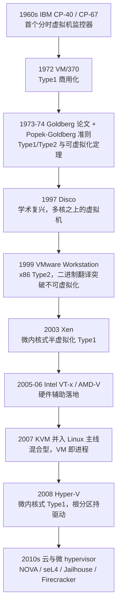
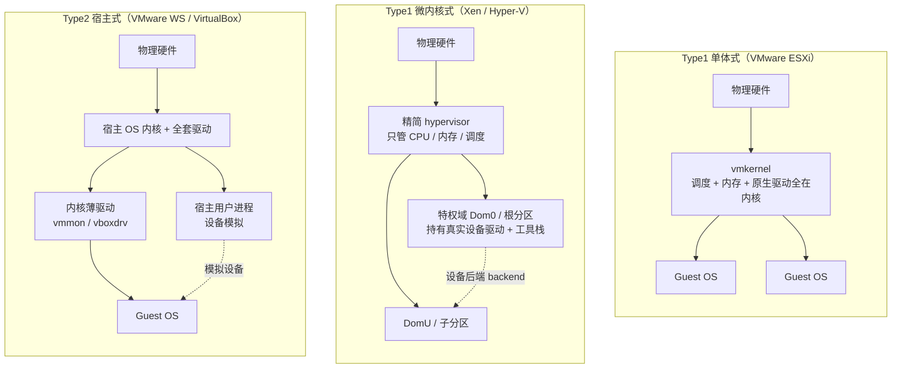
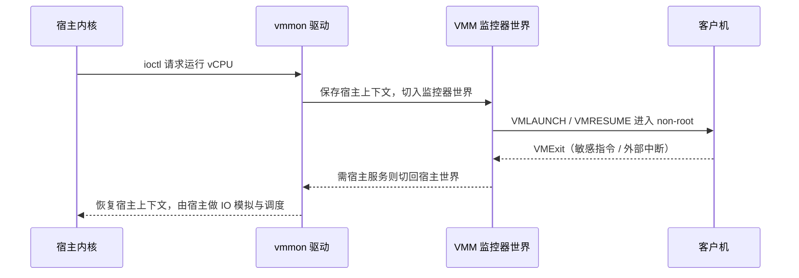

# 虚拟化与TEE机密计算（5）· Hypervisor架构：Type1与Type2

> [!abstract] TL;DR
> - Type1/Type2 是**结构性分类**（谁最先拿到硬件、驱动放哪、谁做调度、TCB 边界在哪），与第 1 篇的「全/半/硬件辅助」分类、第 2 篇的 root/non-root 机制**正交**，别混为一谈。
> - 术语源自 Goldberg 1973 博士论文：**Type1 直接跑在裸机上**（ESXi/Xen/Hyper-V），**Type2 跑在宿主 OS 之内/之侧**（VMware Workstation/VirtualBox/纯 QEMU）。
> - Type1 内部还要再分**单体式**（ESXi：驱动全在 vmkernel）与**微内核式**（Xen/Hyper-V：hypervisor 极简，把真实驱动委托给特权域 Dom0/根分区）——这是本篇的核心张力。
> - Type2 靠内核薄驱动做 **world switch**「借」宿主的 ring0/VMX 运行监控器，代价是全上下文切换开销 + 宿主 OS 整体进 TCB。
> - **KVM 打破二分**：把 Linux 变成 hypervisor，VM 就是普通进程/线程——它到底 Type1 还是 Type2 的争论，恰好说明真实世界是**谱系而非二元**。
> - 安全上 hypervisor 既可能是攻击面（宿主设备模拟、Blue Pill 式 hyperjacking），也可能被反用为**防御边界**（VBS/VTL/HVCI 让 hypervisor 比内核更高权来保护内核）。

## 概述与定位

「Hypervisor」（虚拟机监控器，VMM，Virtual Machine Monitor）是那层让一台物理机同时跑多个「以为自己独占硬件」的客户机的软件。本系列前四篇拆的是**机制**：第 2 篇讲 CPU 如何靠 VT-x/AMD-V 的 root/non-root 双态截获敏感指令，第 3 篇讲内存如何靠 EPT/NPT/影子页表做 GPA→HPA 二级翻译，第 4 篇讲设备如何靠模拟、半虚拟化（virtio）与 VT-d 直通落地。这些回答的都是「**怎么虚拟化一类资源**」。本篇换一个正交的视角：把这些机制**装配成一个完整产品**时，这层软件应该**摆在软件栈的哪一层**？谁最先从固件手里接过硬件？物理设备的驱动住在谁家？CPU 时间片和物理内存由谁分配？可信计算基（TCB，Trusted Computing Base）的边界画在哪里？——回答这组问题的分类法，就是 **Type1 与 Type2**。

必须先厘清一个常见混淆：Type1/Type2 与「全虚拟化 / 半虚拟化 / 硬件辅助虚拟化」是**两个正交的坐标轴**（后者是第 1 篇的主题）。一台 ESXi 是 Type1，但它既能对老系统做全虚拟化、又能对 enlightened 客户机做半虚拟化、还用 VT-x 做硬件辅助——分类维度不同。同理「Type1 就一定快、Type2 就一定慢」也是过度简化：真正决定单条敏感指令开销的是 VMExit 成本（第 2/8 篇），Type1/Type2 影响的是**世界切换的路径长度、驱动栈的层数、以及有多少代码进了 TCB**。

术语本身有确切出处：Robert P. Goldberg 在 1973 年的哈佛博士论文《Architectural Principles for Virtual Computer Systems》里首次区分——**Type1 VMM 直接运行在裸机之上**（它自己就是「那个操作系统」），**Type2 VMM 运行在一个宿主操作系统之内**（宿主才是直接管硬件的那个）。次年 Popek 与 Goldberg 在 CACM 给出可虚拟化架构的形式化准则（等价性 / 资源控制 / 效率三性质，以及「敏感指令 ⊆ 特权指令」定理），奠定了整个领域的理论地基。半个世纪过去，硬件辅助与 KVM 这类混合体把 Type1/Type2 的界线揉得越来越模糊，但这套「按谁拥有裸机来分层」的直觉，至今仍是理解任何 hypervisor 产品架构的第一把尺子。



## 原理与机制

要判定一个 hypervisor 是 Type1 还是 Type2、以及它是单体还是微内核，只需机械地追问五个问题，答案会自然把它归位：

1. **谁最先从固件手里接过 CPU 控制权**（引导顺序）？
2. **物理设备的真实驱动住在哪一层**？
3. **CPU 调度与物理内存分配由谁做主**？
4. **敏感指令触发的 VMExit / 超级调用由谁直接处理**？
5. **TCB 的边界包住了哪些代码**？

**Type1 的答案**是：hypervisor 由 UEFI/固件直接加载，是最先拿到裸机的软件；它自带（或通过一个特权域持有）设备驱动；它有**自己的调度器与内存管理器**；VMExit 直接落在它手里；TCB 里没有一个通用桌面/服务器 OS。**Type2 的答案**是：宿主 OS（Windows/Linux/macOS）先完整启动、掌管全部硬件；hypervisor 以一个**内核模块 + 用户态进程**的形态寄生其上；VM 的物理资源仍由宿主 OS 分配；TCB 因此包含整个宿主 OS。

这里的关键机制是 Type2 特有的 **world switch（世界切换）**。x86 上要执行 VMLAUNCH/VMRESUME、要写 VMCS，必须身处 ring0 且 CPU 处于 VMX root 态；而一个 Type2 产品的主体是个 ring3 用户进程（如 VMware 的 `vmx` 进程），它没有这个权限。于是它安装一个内核态薄驱动（VMware 的 `vmmon`、VirtualBox 的 `vboxdrv`），通过 `ioctl` 请求「运行这个 vCPU」。驱动做的事非常「暴力」：把宿主当前的完整 CPU 上下文（GDT/IDT/CR3/段寄存器/控制寄存器……）整体保存下来，加载监控器（VMM）自己的一套上下文，然后跳进 VMM——此刻 VMM 拥有了自己的 IDT/GDT，短暂地「成为整台机器」，再用 VMLAUNCH 进入客户机。当客户机触发 VMExit、或 VMM 需要宿主服务（访问真实磁盘、定时器、宿主重新调度）时，再反向做一次世界切换，把宿主上下文恢复回去，控制权交还宿主内核与那个 `vmx` 用户进程去做设备模拟。**「借宿主的 ring0、靠全上下文互换在两个世界间来回跳」**，正是 Type2 天然多一层开销、且宿主 OS 始终是资源主人的根因。

Type1 没有这一层「借」的动作——它本来就是 ring0/root 的主人，进出客户机只是一次常规的 VM entry/exit。代价是：既然没有宿主 OS 可依赖，**驱动谁来写**？让 hypervisor 自己带上万种网卡/存储控制器的驱动（单体式，如 ESXi），TCB 会膨胀且工程量巨大；于是另一条路应运而生——把 hypervisor 本身砍到极小，只留 CPU/内存/调度这些「非它不可」的核心，把庞大的驱动栈**下放给一个被降权的特权虚拟机**去跑（微内核式，如 Xen 的 Dom0、Hyper-V 的根分区）。这就是本篇标题里「微内核式 hypervisor」的由来，它把操作系统内核界几十年的「宏内核 vs 微内核」之争，原样复刻到了虚拟化层。



## 架构谱系与实现详解

真实产品并非非黑即白地落在 Type1 或 Type2 两个点上，而是散布在一条**谱系**上，坐标由「hypervisor 有多薄」「驱动离核有多远」「是否复用了一个通用 OS」共同决定。下面沿这条谱系逐档拆解。

### 判据不是二分，而是多维谱系

用一张对照表把维度摊开，比背「Type1=裸机、Type2=宿主」这句口号有用得多：

| 维度 | Type1 单体（ESXi） | Type1 微内核（Xen/Hyper-V） | Type2 宿主（VMware WS/VBox） | 混合（KVM） |
| --- | --- | --- | --- | --- |
| 最先接管硬件 | hypervisor | hypervisor | 宿主 OS | 宿主 OS（但内核即 hypervisor） |
| 真实驱动位置 | vmkernel 内 | 特权域 Dom0/根分区 | 宿主内核 | 宿主 Linux 内核 |
| 调度器 | 自带 | 自带 + Dom0 内部 | 复用宿主 | 复用 Linux 调度器 |
| hypervisor TCB | 大（含驱动） | 小（但含特权域） | 巨（整个宿主 OS） | Linux 内核规模 |
| 典型场景 | 数据中心 | 云 / 桌面安全 | 开发者桌面 | 云 / 通用 |

### Type1 单体式：VMware ESXi

ESXi 的核心是 `vmkernel`——一个**专为跑虚拟机而生的 POSIX-like 微型内核**，网卡、HBA、NVMe 等原生驱动以可加载模块的形式**直接编进内核地址空间**。它没有通用 Linux 宿主（早期的 ESX 还带一个基于 Linux 的服务控制台 COS 用于管理，现代 ESXi 已彻底砍掉，管理面收敛为 hostd/DCUI 等原生进程）。「单体」的含义正是：驱动与调度同处一个特权内核，路径最短、性能可预期，这也是它统治数据中心的原因；但代价是**驱动即 TCB**——一个第三方存储驱动的漏洞就直接是 hypervisor 的漏洞，这与宏内核 OS 里「一个坏驱动蓝屏整机」是同构的风险。

### Type1 微内核式：Xen 与 Hyper-V（本篇重点）

**Xen** 是微内核式 Type1 的教科书。Xen hypervisor 本体只有数十万行量级，只管内存、vCPU 调度、事件通道与 grant table，**一行设备驱动都不带**。引导时由 GRUB/EFI 先加载 Xen 二进制，Xen 再拉起 **Dom0**——一个被授予特权的半虚拟化客户机（通常是 Linux），真实驱动、`xl`/toolstack、以及给其它客户机用的**设备后端**都住在 Dom0。普通客户机 DomU 里跑的是**分离驱动（split driver）**的前端：`blkfront`/`netfront` 把请求经共享环 + 事件通道递给 Dom0 里的 `blkback`/`netback` 后端，由后端调用真实驱动落盘/发包。这套「前端-后端」正是半虚拟化 I/O 的骨架。为把 Dom0 这个「大到本身就是风险」的特权域再拆小，Xen 提供**解耦（disaggregation）**：**驱动域**（把网卡/存储驱动隔离进独立最小域，崩了不拖垮 Dom0）、**stub domain**（把每个 VM 的 QEMU 设备模拟关进各自的极小域，逃逸也出不了那个域）、以及 **XSM/FLASK**（把 SELinux 式的强制访问控制搬进 hypervisor，细粒度约束域间操作）。

**Hyper-V** 是同一思想的另一血脉。Windows 启动早期由 `hvloader` 抢先加载 hypervisor 本体（Intel 用 `hvix64.exe`、AMD 用 `hvax64.exe`），之后 Windows 自己「降格」成**根分区（root/parent partition）**——它持有物理驱动、跑 VMMS/VID 等管理组件与各设备的 **VSP（Virtualization Service Provider）**。子分区（child partition）里 enlightened 的客户机跑 **VSC（Service Consumer）**，经 **VMBus** 与根分区的 VSP 通信（等价于 Xen 的前端-后端）；未启蒙的老系统则退回到模拟设备。Hyper-V hypervisor 内**没有任何第三方驱动**——这就是微内核式。Xen 的 Dom0 与 Hyper-V 的根分区在角色上几乎是一一对应的：都是「被 hypervisor 降权、但持有真实驱动与工具栈的那个特权 OS」。区别在于 Hyper-V 把这套架构进一步用于**安全**：引入 **VTL（Virtual Trust Level）**，VTL0 跑普通 NT 内核、VTL1 跑 `securekernel.exe`，hypervisor 用 SLAT/EPT 保证 VTL1 的内存连 VTL0 的内核都碰不到——这正是 VBS/HVCI 的地基（详见 [[38.Windows内核与驱动逆向/25.HyperV架构与VBS]]）。

微内核式的**深层动机**是 TCB 最小化：hypervisor 本体越小，越容易审计、越难被攻破；把庞大易错的驱动栈丢进一个可被替换、可被隔离、崩溃可重启的降权域，既复用了成熟 OS 的驱动生态，又不让它们污染最高特权层。代价是**多一跳**：一次客户机 I/O 要经「前端 → 共享环 → 后端域 → 真实驱动」，比单体式内核里一把梭多了域间切换的开销——这就是 ESXi 与 Xen/Hyper-V 在「极致性能 vs 极小 TCB」上的经典取舍。

### Type2 宿主式：VMware Workstation / VirtualBox / 纯 QEMU

**VMware Workstation/Player** 是 Type2 的原型：一个 per-VM 的 `vmx` 用户进程负责设备模拟与 UI，一个 `vmmon` 内核驱动负责世界切换，VMM 监控器在「监控器世界」里运行客户机。1999 年它靠**二进制翻译（BT）**在没有 VT-x 的 x86 上突破了「popf 等敏感指令不陷入」的不可虚拟化难题（Adams & Agesen 2006 的论文系统比较了 BT 与硬件辅助）；VT-x 普及后转为硬件辅助，但「宿主 + 驱动 + 用户进程」的三件套结构不变。**VirtualBox** 同构：`VBoxSVC`/VM 用户进程 + `vboxdrv` 内核驱动，早期还带自研的 raw-mode 软件虚拟化（代码扫描 + 打补丁），6.1 起已弃用、全面转向 VT-x/AMD-V 的 HM 模式。**纯 QEMU（TCG）** 则走另一极端——用动态二进制翻译**软件模拟**整个 CPU，不依赖硬件虚拟化，严格说是「模拟器」，慢但能跨架构（在 x86 上跑 ARM 固件）；一旦挂上 KVM 加速，它就退化为「设备模型」，CPU 交给硬件跑（KVM/QEMU 的分工细节见第 6 篇）。Type2 存在的理由很朴素：**装在一台不改造的普通桌面 OS 上就能用**，开发测试、跨平台、随开随关；代价是性能多一层世界切换、且宿主 OS 的任何漏洞都是 VM 的漏洞。



### 混合与收敛：KVM 的归类之争

**KVM** 是把谱系揉皱的那个。它是一组 Linux 内核模块（`kvm.ko` + `kvm-intel.ko`/`kvm-amd.ko`），加载后暴露 `/dev/kvm`，**把整个 Linux 内核变成 hypervisor**。它到底算 Type1 还是 Type2，业界吵了十几年：说它 **Type1** 的（Red Hat 的口径）理由是——虚拟化逻辑就在内核里、直接握有 VMX、Linux 内核本身就是那个「裸机上的调度器与内存管理器」，客户机进出是原生的 VM entry/exit，没有 Type2 那种「借 ring0」的世界切换；说它 **Type2** 的理由是——Linux 毕竟是个先完整启动、还能同时当普通服务器用的通用 OS，hypervisor 只是它的一个模块。诚实的答案是**它是混合/收敛型，Type1/Type2 本就是谱系的两端而非二选一**。KVM 最漂亮的设计是：**每个 VM 就是一个普通 Linux 进程、每个 vCPU 就是一个线程、客户机物理内存就是该进程 `mmap` 出来的虚拟内存**，`ioctl(KVM_RUN)` 进客户机。这样它**免费复用**了 Linux 已有的一切——CFS 调度器、cgroups 配额、NUMA 亲和、透明大页、KSM 内存去重——这是任何从零写调度器的 Type1 都要眼红的工程杠杆。这正解释了为什么「按谁拥有裸机分层」这把老尺子，量不准现代混合体。

### 分区/分离内核式：安全导向的极简 hypervisor

谱系的最左端是一批把「hypervisor 越小越好」推到极致的研究/专用系统。**NOVA** 微 hypervisor 本体仅约万行，把设备模拟等策略全推到用户态 VMM；**seL4** 是**经形式化验证**的微内核，可充当 hypervisor，用数学证明其隔离性；**Jailhouse**（Siemens）是**静态分区 hypervisor**——它不做调度、不做设备模拟，只把 CPU 核、内存区、设备**一次性划分**给彼此隔离的 cell，代码极薄，专供实时/混合关键性（把一个 Linux 与一个 RTOS 硬隔在同一芯片上）；**Bareflank/hvpp/HyperPlatform** 一类**薄 hypervisor**则用「后发制人」的 late-launch 手法，把一个**已在运行的 OS**就地「抬」进客户机——这既是研究框架，也是 rootkit 技法的原型（见「安全性」一节）。云上的 **Firecracker**（AWS，Rust 写的极简 VMM，设备模型只留 virtio 几件套）与 **Cloud Hypervisor** 则是「KVM 之上的极简监控器」，它们**不是 hypervisor 本身**（硬件虚拟化交给 KVM），而是把 QEMU 那个庞大设备模型替换成攻击面极小的替代品，用于 serverless 的 microVM。它们共同的动机只有一个：**TCB 越小，越可审计、越可验证、越难逃逸**。

## 工具视角与实战

**判定「我是否在 hypervisor 之下、是哪一家」**是逆向与取证的第一步，靠 CPUID 两条叶就能拿到强线索：

```
; 1) 是否被虚拟化：CPUID.01H:ECX[31] "hypervisor present" 提示位
mov eax, 1
cpuid
bt  ecx, 31          ; =1 说明某 VMM 主动置位；=0 多半裸机（但可被刻意隐藏）
jc  in_hypervisor

; 2) 厂商标识：叶 0x40000000
mov eax, 0x40000000
cpuid
; EAX = 支持的最大 hypervisor 叶号
; EBX:ECX:EDX = 12 字节厂商 ASCII 串
```

常见 12 字节厂商串（`EBX:ECX:EDX` 拼接）：

```
KVM            -> "KVMKVMKVM\0\0\0"
Microsoft Hv   -> "Microsoft Hv"      ; Hyper-V / VBS
VMware         -> "VMwareVMware"
Xen            -> "XenVMMXenVMM"
VirtualBox     -> "VBoxVBoxVBox"
QEMU(TCG)      -> "TCGTCGTCGTCG"       ; 纯软件模拟，无硬件加速
Parallels      -> "prl hyperv "
```

上层工具把这套探测封装好了：Linux 侧 `systemd-detect-virt`、`virt-what`、`lscpu`（看 `Hypervisor vendor` 行）、`dmidecode -s system-product-name`（VMware/VirtualBox 会在 DMI 留名）、`/proc/cpuinfo` 的 `hypervisor` flag；判断本机是否**是 KVM 宿主**则看 `lsmod | grep kvm` 与 `/dev/kvm`。Windows 侧 `msinfo32` 会显示「已检测到 Hyper-V/基于虚拟化的安全性正在运行」，Sysinternals 的 `coreinfo -v` 能列出 VMX/EPT 支持与 hypervisor 存在位，`systeminfo` 也有相应字段。**识别架构类型**的经验法则：能在客户机里 `xl list` 看到 Dom0 → Xen；有 VMBus/`vmbus` 设备与根分区特征 → Hyper-V；有 `vmmon`/`vboxdrv` 内核对象 → 对应的 Type2 宿主产品。

**逆向视角**上，Type2 的世界切换是最好的活教材：直接反 `vmmon.sys`/`vboxdrv.sys`，能看到保存/恢复宿主 GDT/IDT/CR3 的上下文互换与跳入 VMM 的桩；反 `kvm-intel` 则能看到 VMLAUNCH/VMRESUME 与 VMExit 分发表。想从零理解薄 Type1，SimpleVisor（Alex Ionescu）、hvpp（Petr Beneš）、HyperPlatform（Satoshi Tanda）这几个开源薄 hypervisor 是最短路径——它们把「构造 VMCS、设置 EPT、处理 CPUID/MSR 类 VMExit」压到几千行可读代码。另外 VMware 有个著名的**后门 I/O 端口 `0x5658`（"VX"）**，客户机用特定 magic 读它可与宿主通信，也常被用作 VMware 检测指纹。性能层面记住：Type2 每次进出客户机多一对世界切换，微内核式 Type1 每次 I/O 多一跳域间通信，单体式 Type1 与 KVM 路径最短——这决定了压测数字的量级差异。

## 安全性与正确使用

**先做 TCB 账**：谁进了可信计算基，谁的漏洞就是虚拟化隔离的漏洞。**Type2** 最惨——整个宿主 OS（内核 + 全部驱动）+ 监控器 + 用户态设备模拟全在 TCB 里，攻击面最大。**单体式 Type1（ESXi）**没有通用宿主 OS，但所有原生驱动都在 vmkernel 里，TCB 依旧不小。**微内核式 Type1（Xen/Hyper-V）**的 hypervisor 本体 TCB 极小，但**特权域 Dom0/根分区在 TCB 内**——攻破 Dom0 基本等于攻破全局，这正是 Xen 用驱动域/stub domain/XSM 做解耦、把 Dom0 再拆小的理由。历史上真实逃逸大多不在 hypervisor 核心，而在**设备模拟**这块又大又老的代码（如 QEMU 软盘控制器一类的越界写导致宿主内存破坏）——所以「关掉用不到的模拟设备、能 virtio + IOMMU 直通就别全模拟」是最有性价比的收敛动作。逃逸的具体原理与案例见第 9 篇，本篇只强调：**架构选型直接决定了这块攻击面有多大**。

**误用与主动攻击面**：Type2 的宿主 OS 是最弱一环——把一台需要高保障隔离的负载丢进桌面 VMware 里，本质上把安全性绑在了宿主 Windows/macOS 的补丁状态上，这是常见误判。更隐蔽的是 **hyperjacking（虚拟化劫持）**：2006 年 Joanna Rutkowska 的 **Blue Pill** 演示了用薄 hypervisor 把一个**正在运行的 OS**就地抬进客户机、让恶意 VMM 潜伏在其**下方**——OS 从此活在一个它感知不到的笼子里。防御要靠**启动链可信**：UEFI Secure Boot 拦住未签名的引导态 hypervisor、DRTM（Intel TXT / AMD SKINIT）做动态度量根、度量启动 + TPM 把每一层的哈希封进 PCR（详见 [[39.固件与IoT嵌入式逆向/21.安全启动链绕过技术]] 与本系列第 14 篇），再加 HVCI、内核 DMA 防护堵住旁路。

**反转视角——hypervisor 作为防御边界**：正因为 hypervisor 比 OS 内核更高权，它也能被**反用为保护 OS 自身的工具**。这正是微软 VBS 的思路：hypervisor 用 VTL 把系统切成 VTL0（普通 NT 内核）与 VTL1（安全内核），即便 VTL0 内核被 rootkit 完全控制，也碰不到 VTL1 里 Credential Guard 保管的凭据；HVCI 更让 hypervisor 用 EPT 对内核内存强制 W^X——内核想执行一页未经签名校验的代码，会被下面这层拦下（机制细节见 [[38.Windows内核与驱动逆向/29.CI.dll与代码完整性WDAC]]）。同一个 hypervisor，既可能是 Blue Pill 的匕首，也可能是 VBS 的盾牌，差别只在**谁先取得了最高特权、以及启动链是否可信**。

**正确使用/加固边界**小结：微内核式部署要**把 Dom0/根分区当成皇冠明珠去守**（最小化其上服务、上驱动域与 stub domain、开 XSM/FLASK）；生产环境**及时给监控器与设备模型打补丁**（逃逸补丁往往在 QEMU 而非内核）；能直通就别全模拟、直通必开 IOMMU（否则设备 DMA 可绕过隔离，见第 4 篇）；高保障场景优先选 TCB 可审计/可验证的极简 hypervisor（seL4/Jailhouse/Firecracker 一类），而不是把安全寄托在一个通用宿主 OS 上；嵌套虚拟化会把「谁是最高特权」再叠一层，信任模型要重新推演（见第 7 篇）。核心判据始终是一句话：**hypervisor 只有在它的 TCB 确实比它所保护的东西更小、更硬时，才真的是一条安全边界**——一个塞满第三方驱动的单体 hypervisor，未必比它上面的客户机更可信。

## 小结

Type1/Type2 是按「谁拥有裸机、驱动放哪、谁做调度、TCB 边界在哪」划分的**结构性分类**，与全/半/硬件辅助虚拟化正交。Type1 直接跑在硬件上，又分**单体式**（ESXi，驱动全在内核、路径短但 TCB 大）与**微内核式**（Xen/Hyper-V，hypervisor 极简、把驱动委托给降权的特权域 Dom0/根分区，TCB 小但多一跳）——后者正是本篇「微内核式 hypervisor」的要点。Type2 寄生在宿主 OS 上，靠内核薄驱动做 world switch「借」ring0 运行监控器，方便但把整个宿主 OS 拖进 TCB。KVM 把二分揉成谱系：Linux 即 hypervisor、VM 即进程，复用了整套内核基础设施。安全上，架构选型直接决定攻击面大小，而 hypervisor 既可能是 hyperjacking 的匕首、也可能被反用为 VBS 那样保护内核的盾牌，胜负手在于**谁先夺得最高特权、启动链是否可信、TCB 是否真的更小更硬**。理解了这层「装配结构」，再回看第 2/3/4 篇的机制、第 6 篇的 KVM/QEMU 分工、第 9 篇的逃逸，就能把「机制」与「产品形态」对上号。

## 相关阅读

- 本系列：[[00.虚拟化与TEE机密计算总览|系列总览]]、[[01.虚拟化技术全景与分类|(1) 虚拟化技术全景与分类]]（分类维度对照）、[[02.CPU虚拟化：VT-x与AMD-V|(2) CPU虚拟化：VT-x与AMD-V]]（root/non-root 机制）、[[03.内存虚拟化：EPT与NPT与影子页表|(3) 内存虚拟化]]、[[04.IO虚拟化与设备直通VT-d|(4) IO虚拟化与设备直通VT-d]]（前端-后端/直通/IOMMU）、[[06.KVM与QEMU协作原理|(6) KVM与QEMU协作原理]]（混合型细节）、[[09.虚拟机逃逸原理与案例|(9) 虚拟机逃逸原理与案例]]（设备模拟攻击面）
- 同库呼应：[[38.Windows内核与驱动逆向/25.HyperV架构与VBS]]（根分区/VTL/微内核式 Type1 实证）、[[38.Windows内核与驱动逆向/29.CI.dll与代码完整性WDAC]]（HVCI/hypervisor 反用为防御）、[[21.Asm/40 虚拟化扩展对比]]（VT-x/AMD-V/ARM 扩展横比）、[[24.内存管理与堆分配器/02.进程地址空间与虚拟内存]]（KVM「VM 即进程内存」的地基）、[[39.固件与IoT嵌入式逆向/21.安全启动链绕过技术]]（度量启动/TPM/防 hyperjacking）
- 一手资料与经典论文：R. P. Goldberg,《Architectural Principles for Virtual Computer Systems》(Harvard PhD, 1973)；Popek & Goldberg,《Formal Requirements for Virtualizable Third Generation Architectures》(CACM, 1974)；Barham et al.,《Xen and the Art of Virtualization》(SOSP 2003)；Adams & Agesen,《A Comparison of Software and Hardware Techniques for x86 Virtualization》(ASPLOS 2006)；Steinberg & Kauer,《NOVA: A Microhypervisor-Based Secure Virtualization Architecture》(EuroSys 2010)；*Intel SDM* Vol.3C（VMX）与 *AMD APM* Vol.2（SVM）；Microsoft *Hypervisor Top-Level Functional Specification (TLFS)*；Xen `Disaggregation`/`XSM-FLASK` 文档、seL4 与 Jailhouse 官方文档、AWS Firecracker 设计文档。

[[00.虚拟化与TEE机密计算总览|⬆ 系列总览]] | [[04.IO虚拟化与设备直通VT-d|← 上一章]] | [[06.KVM与QEMU协作原理|→ 下一章]]