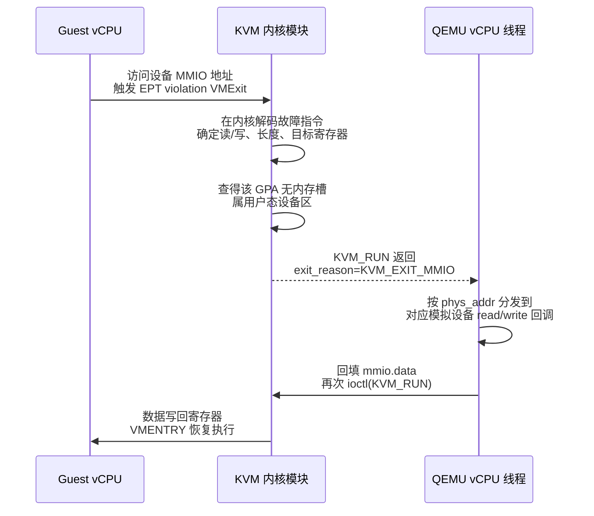
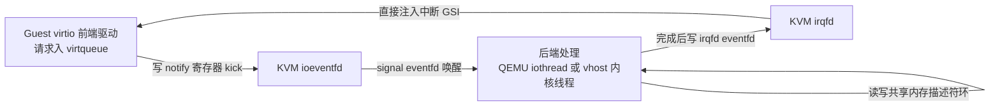
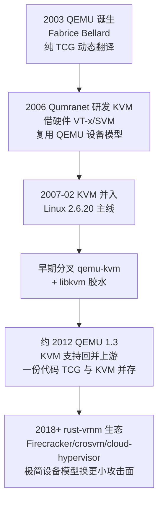
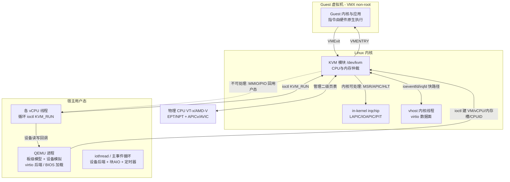

# 虚拟化与TEE机密计算（6）· KVM与QEMU协作原理
> [!abstract] TL;DR
> - KVM 是把 CPU 硬件虚拟化扩展（VT-x/AMD-V）封装成 `/dev/kvm` 字符设备的内核模块，只做"最快、最需要特权"的 CPU 与内存仲裁；它本身**不是完整 hypervisor，也不模拟任何设备**，是一个"虚拟化使能器"。
> - QEMU 是运行在宿主用户态的 VMM，提供机器板级模型、设备模拟与固件加载；两者通过"**三层文件描述符 + `KVM_RUN` ioctl + mmap 共享的 `kvm_run` 结构**"协作。
> - 协作核心是一个运行循环：vCPU 线程 `ioctl(KVM_RUN)` 陷入内核并 VMENTRY 进入 guest，遇到内核处理不了的 MMIO/PIO 就 VMExit 回用户态，QEMU 查 `exit_reason` 完成设备模拟后重入 guest。
> - 为削减昂贵的用户态往返，KVM 把 LAPIC/IOAPIC/PIT 做进内核（in-kernel irqchip），并用 `ioeventfd`（门铃）/`irqfd`（中断注入）配合 virtio/vhost 把数据热路径留在内核。
> - "内核快路径 / 用户态慢路径"的切分是**性能与安全的权衡**：设备模拟越靠用户态越安全（可 seccomp/sVirt 沙箱、崩溃不塌内核），越进内核越快但内核攻击面越大。

## 概述与定位

要理解 KVM 与 QEMU 的关系，先要接受一个反直觉的事实：**KVM 单独存在时，跑不起来一台虚拟机**。它没有磁盘、没有网卡、没有串口、没有 BIOS，甚至没有一个供你敲命令的界面。KVM 做的事情非常克制——它把 Intel VT-x（VMX）或 AMD-V（SVM）这套"CPU 层面的虚拟化扩展"包装成一组内核 ioctl，让用户态程序能够"创建一个虚拟 CPU、给它一段物理内存、然后让真实硬件直接运行这段代码"。真正把这些原语拼成"一台看起来像 PC 的机器"，是用户态 VMM 的职责，而 QEMU 就是最主流、功能最全的那个 VMM。

这条分工线是本篇的主角。用一句话概括：**KVM 负责让 guest 指令尽量在硬件上原生跑（CPU 与内存的快路径），QEMU 负责在软件里把 guest 看到的那些设备"演"出来（设备模拟的慢路径）**。guest 里一条普通的算术指令、一次访存，都由物理 CPU 在 VMX non-root 模式下直接执行，KVM 根本不介入；只有当 guest 去碰一个不存在的物理设备（读写网卡寄存器、敲串口端口）时，硬件才触发 VMExit 陷入 KVM，KVM 判断"这我处理不了"，就把控制权连同一份"发生了什么"的描述交还给 QEMU，由 QEMU 用几百行 C 代码模拟出那块芯片的行为，再让 guest 继续跑。

在本系列里，这一篇是"落地篇"。前面 [[05.Hypervisor架构：Type1与Type2]] 从架构层讲清了 Type-1（裸金属，如 Xen/ESXi）与 Type-2（宿主型，如 VirtualBox）的分野，而 KVM 是个有趣的"骑墙者"：它是内核模块，借宿主 Linux 的调度器、内存管理、驱动栈，从这个角度看像 Type-2；但它又让 guest 指令直接跑在硬件特权级上、宿主内核本身就是 hypervisor，从这个角度看又有 Type-1 的性能特征——所以业界常戏称它是"Type-1.5"。[[02.CPU虚拟化：VT-x与AMD-V]] 讲的 VMCS/VMCB、根/非根模式，是 KVM 之下的硬件底座；[[03.内存虚拟化：EPT与NPT与影子页表]] 讲的二级地址翻译，是本篇"内存槽"机制之下的地址映射引擎；[[04.IO虚拟化与设备直通VT-d]] 讲的 VT-d/IOMMU 与设备直通，是本篇"软件设备模拟"的对立面（直通把真实设备交给 guest，模拟则纯软件伪造）。为避免重复，**本篇不再展开 VMCS 字段、EPT 页表结构、IOMMU 页表**，只聚焦 KVM 与 QEMU 之间那道"接口与运行循环"；VMExit 的成因分类与开销分析留给 [[08.VMExit与超级调用hypercall]]，而设备模拟代码里的 bug 如何被利用去逃逸，则是 [[09.虚拟机逃逸原理与案例]] 的题目。

## 原理与机制

### 一切从 /dev/kvm 开始：三层文件描述符模型

KVM 对用户态暴露的全部能力，入口只有一个字符设备 `/dev/kvm`。围绕它，KVM 设计了一套优雅的**三层文件描述符层级**，每一层对应一个作用域，用 ioctl 操作：

- **系统级（system fd）**：`open("/dev/kvm")` 得到的 fd。在它上面做全局查询与创建：`KVM_GET_API_VERSION`（必须返回 12）、`KVM_CHECK_EXTENSION`（探测某个 `KVM_CAP_*` 能力是否可用，这是 KVM 的特性协商机制）、`KVM_GET_VCPU_MMAP_SIZE`（问 `kvm_run` 该 mmap 多大），以及最关键的 `KVM_CREATE_VM`。
- **虚拟机级（VM fd）**：`ioctl(kvm_fd, KVM_CREATE_VM)` 返回一个代表"一台虚拟机"的 fd。在它上面配置整机资源：`KVM_SET_USER_MEMORY_REGION`（登记内存槽）、`KVM_CREATE_IRQCHIP`/`KVM_CREATE_PIT2`（创建内核中断控制器/定时器）、`KVM_IRQFD`/`KVM_IOEVENTFD`（注册快路径 eventfd）、`KVM_CREATE_VCPU`。
- **虚拟 CPU 级（vCPU fd）**：`ioctl(vm_fd, KVM_CREATE_VCPU, id)` 每调一次生出一个 vCPU fd。在它上面操作单个 CPU 的状态：`KVM_SET_REGS`/`KVM_SET_SREGS`（通用/段寄存器）、`KVM_SET_CPUID2`（伪造 CPUID 结果）、`KVM_SET_MSRS`，以及那条让 CPU 真正跑起来的 `KVM_RUN`。

这个层级设计的深层原因是**权限与生命周期的自然嵌套**：vCPU 属于某台 VM，VM 属于打开 `/dev/kvm` 的进程；fd 关闭即资源回收，进程一死内核自动清理所有 VM/vCPU，无需守护进程。它也天然契合 Unix"一切皆文件"的哲学——你甚至能把 vCPU fd 传给另一个线程去 `KVM_RUN`。

### 共享内存信箱：mmap 出来的 kvm_run

KVM 与 QEMU 每次 VMExit 都要交换"发生了什么"的信息。如果走 ioctl 参数来回拷贝会很慢，于是 KVM 用了**零拷贝共享内存**：对 vCPU fd 做 `mmap`，映射出一块 `struct kvm_run`（大小由 `KVM_GET_VCPU_MMAP_SIZE` 给出，通常一页多）。这块内存内核与用户态同时可见，`KVM_RUN` 返回后，QEMU 直接读 `run->exit_reason` 就知道为何退出，读 union 里对应的子结构就拿到细节，写回数据也是直接改这块内存——一次系统调用里完成双向通信，没有额外拷贝。

```c
struct kvm_run {
    /* in：用户态 -> 内核 */
    __u8 request_interrupt_window; /* 请求 KVM 在可注入中断的窗口退出 */
    __u8 immediate_exit;           /* 置1令本次 KVM_RUN 立刻返回（用于"踢出"vCPU） */
    /* out：内核 -> 用户态 */
    __u32 exit_reason;             /* KVM_EXIT_IO / _MMIO / _HLT / _SHUTDOWN ... */
    __u8 ready_for_interrupt_injection;
    __u8 if_flag;                  /* guest 当前 EFLAGS.IF，指示能否收中断 */
    union {                        /* 按 exit_reason 解读的子结构 */
        struct {                       /* KVM_EXIT_IO：端口 IO */
            __u8  direction;           /* IN=0 / OUT=1 */
            __u8  size;                /* 1/2/4 字节 */
            __u16 port;                /* 端口号，如串口 0x3f8 */
            __u32 count;               /* rep 前缀的重复次数 */
            __u64 data_offset;         /* 数据在本页内偏移：(char*)run + data_offset */
        } io;
        struct {                       /* KVM_EXIT_MMIO：内存映射 IO */
            __u64 phys_addr;           /* guest 物理地址 */
            __u8  data[8];             /* 读则内核回填/写则内核带出 */
            __u32 len;
            __u8  is_write;
        } mmio;
        /* ... 还有 hypercall / internal_error / system_event 等 */
    };
};
```

### 心脏：KVM_RUN 运行循环

把上面的原语拼起来，就是每个 vCPU 线程都在跑的那个循环。它的骨架简单到令人吃惊，却是整个协作模型的心脏：

```c
for (;;) {
    ioctl(vcpu_fd, KVM_RUN, NULL);      /* 阻塞：陷入内核 -> VMENTRY -> guest 原生执行 */
    switch (run->exit_reason) {         /* 返回：说明发生了内核处理不了的事 */
    case KVM_EXIT_IO:                   /* guest 敲了端口，QEMU 模拟设备 */
        dispatch_pio(run);  break;
    case KVM_EXIT_MMIO:                 /* guest 访问了设备 MMIO 区，QEMU 模拟 */
        dispatch_mmio(run); break;
    case KVM_EXIT_HLT:                  /* guest 执行 hlt */
        handle_halt();      break;
    case KVM_EXIT_SHUTDOWN:             /* triple fault 等，需复位/关机 */
    case KVM_EXIT_FAIL_ENTRY:           /* VMENTRY 失败：guest 状态非法 */
    case KVM_EXIT_INTERNAL_ERROR:       /* KVM 内部（常为指令模拟）失败 */
        handle_fatal(run);  return;
    }
}
```

理解这个循环的关键是分清**两种 VMExit**。硬件的 VMExit 会陷入 KVM 内核，但 KVM 里绝大多数 exit 会被**就地处理并直接 VMENTRY 回 guest，`KVM_RUN` 根本不返回用户态**——比如访问内核 LAPIC、执行 `cpuid`（KVM 已缓存 QEMU 设的值）、读某些 MSR、`hlt` 时的 halt-polling 等。只有当 exit 需要用户态设备模型参与时（QEMU 模拟的 MMIO/PIO、无法在内核完成的指令模拟、断电复位），`KVM_RUN` 才带着 `exit_reason` 返回。所以那句 `ioctl(KVM_RUN)` 背后，可能是硬件在 guest 里跑了千万条指令、KVM 内核悄悄处理了成百次 exit，才终于有一次"惊动"了 QEMU。**这条"能在内核处理就绝不回用户态"的原则，是 KVM 性能的第一根支柱**。

### 内存槽：把 QEMU 的进程地址空间借给 guest 当物理内存

guest 眼里的"物理内存"，本质是 QEMU 进程地址空间里一段用 `mmap` 申请的匿名内存。QEMU 通过 `KVM_SET_USER_MEMORY_REGION` 告诉 KVM 一个映射三元组：guest 物理地址（GPA）起点、长度、以及它对应的宿主虚拟地址（HVA）。KVM 拿到这个 GPA→HVA 的登记后，配合 [[03.内存虚拟化：EPT与NPT与影子页表]] 里的二级页表硬件，建立起 GPA→HPA 的真实映射，让 guest 的每次访存都由 EPT/NPT 硬件直接翻译，无需软件介入。

```c
struct kvm_userspace_memory_region region = {
    .slot            = 0,
    .guest_phys_addr = 0x100000,           /* GPA */
    .memory_size     = 512UL << 20,        /* 512MB */
    .userspace_addr  = (uint64_t)hva,      /* QEMU mmap 得到的 HVA */
    .flags           = 0,                  /* 可置 KVM_MEM_LOG_DIRTY_PAGES 开脏页跟踪 */
};
ioctl(vm_fd, KVM_SET_USER_MEMORY_REGION, &region);
```

这个设计把 guest 内存管理"外包"给了宿主内核：guest 内存能被换出、能被 KSM 合并去重、能透明大页——因为它就是普通的用户态内存。KVM 通过挂 `mmu_notifier` 感知宿主页表变动（页被换出/迁移时），同步作废对应 EPT 表项，保证一致性。关于 HVA/GPA/GVA 三层地址如何在一个进程里共存，可回看 [[24.内存管理与堆分配器/02.进程地址空间与虚拟内存]]。

## 接口、运行循环与设备模拟详解

上一节给了骨架，这一节把血肉填满：一次设备访问在 KVM 与 QEMU 之间到底怎么流转，以及为削减开销而层层加码的优化机制。

### MMIO 一次往返的全过程（为什么慢，慢在哪）

设想 guest 里的网卡驱动执行 `mov eax, [0xfebc0010]`，去读一个映射在 0xfebc0000 的虚拟网卡寄存器。这段物理地址没有对应内存槽，于是硬件在二级页表翻译时触发 **EPT violation**，VMExit 陷入 KVM。此时一个棘手问题浮现：**硬件告诉 KVM 的信息不够**——EPT violation 只给出故障 GPA，却不直接给出"这是几字节的读还是写、结果要放进哪个寄存器"。x86 指令长度可变、寻址方式繁多，KVM 必须**在内核里解码那条触发故障的指令**（`arch/x86/kvm/emulate.c` 里有一个精简的 x86 指令模拟器），才能填出 `mmio.phys_addr`、`mmio.len`、`mmio.is_write`。

解码完成后，KVM 判断该 GPA 落在用户态设备区间，于是 `KVM_RUN` 带 `exit_reason=KVM_EXIT_MMIO` 返回。QEMU 的 vCPU 线程醒来，按 `phys_addr` 在它的"内存区域"（`MemoryRegion`）树里查找归属的模拟设备，调用该设备的 `read` 回调算出寄存器值，写进 `run->mmio.data`，再 `ioctl(KVM_RUN)`。KVM 把数据回填进 guest 目标寄存器，VMENTRY 让那条 `mov` 语义上"完成"，guest 继续。



这条链路的代价是：一次 VMExit（上下文从 non-root 切到 root，保存/恢复 VMCS 状态）+ 内核指令解码 + 一次内核到用户态的 `KVM_RUN` 返回 + QEMU 抢锁分发 + 一次 `KVM_RUN` 重入 + 一次 VMENTRY。相比 guest 原生一条 `mov`（几个时钟周期），整套下来轻则数千、重则上万周期。**这就是"设备模拟慢"的根源，也是后续所有优化的动机**：要么减少 exit 次数，要么缩短每次 exit 的路径。端口 IO（`KVM_EXIT_IO`）流程类似，只是 x86 的 `in`/`out` 指令语义明确，硬件能直接给出端口号、方向、宽度，KVM 无需解码指令，`io.data_offset` 指向紧跟 `kvm_run` 之后的数据缓冲区。

### 把中断控制器搬进内核：in-kernel irqchip

设备模拟的另一半是**中断**：模拟网卡收到包后要给 guest 打一个中断，这需要模拟中断控制器（PIC/APIC）。如果这些芯片也放在 QEMU 用户态，那么每次注入中断、guest 每次读写 APIC 寄存器、每次 EOI（中断结束应答），都要一次用户态往返——中断密集的负载会被拖垮。

于是 KVM 提供 `KVM_CREATE_IRQCHIP`，把 **i8259 PIC、IOAPIC、每个 vCPU 的 Local APIC** 全部实现进内核；`KVM_CREATE_PIT2` 把 i8254 定时器也搬进内核。这样 guest 访问 APIC、做 EOI、定时器触发，全在内核闭环，不惊动 QEMU。更进一步，现代 CPU 的 **APICv（Intel）/ AVIC（AMD）** 硬件虚拟 APIC 能让相当一部分 APIC 操作和中断投递连 VMExit 都不产生——KVM 的内核 LAPIC 正是驾驭这些硬件特性的载体。此时 QEMU 只需在**建立阶段**通过 `KVM_SET_GSI_ROUTING` 配好"GSI（全局中断号）→ 谁"的路由表，运行时的中断投递就交给内核。这是 KVM 性能的第二根支柱：**把高频的中断状态机留在内核**。

### 两把快路径钥匙：ioeventfd 与 irqfd

即便如此，纯 MMIO/PIO 往返对虚拟设备仍太重。KVM 借 Linux 的 `eventfd` 造了两条旁路，把设备通知彻底"事件化"：

- **`ioeventfd`（门铃 / doorbell）**：`KVM_IOEVENTFD` 让 QEMU 登记"当 guest 写某个 MMIO/PIO 地址（可带 datamatch 值匹配）时，别陷回用户态，而是给这个 eventfd 发信号"。于是 guest 的"通知设备有活干了"这个写操作，退化成一次内核里的 eventfd 唤醒——处理该设备的 iothread 被唤醒去干活，vCPU 几乎不受阻。
- **`irqfd`（中断线）**：`KVM_IRQFD` 把一个 eventfd 绑到一条 guest 中断（GSI）。谁往这个 eventfd 写一下，KVM 就直接给 guest 注入对应中断，全程不经 QEMU、不走 ioctl。这条路让**内核里的后端（vhost）、直通设备（VFIO）能绕过用户态直接给 guest 打中断**。

这两把钥匙把"guest 通知后端"和"后端通知 guest"两个方向都从"用户态往返"降级为"内核 eventfd 信号"，是虚拟 IO 从"能用"迈向"高性能"的关键。

### virtio 与 vhost：为虚拟化重新设计的设备

模拟一块真实网卡（如 e1000）意味着精确复刻它每一个寄存器的时序行为，既慢又易出 bug。**virtio** 换了思路：既然 guest 知道自己在虚拟机里，就别装真实硬件了，直接用一套"为虚拟化而生"的半虚拟化设备标准（OASIS virtio 规范）。其核心是 **virtqueue**——一组建立在 guest/host 共享内存里的描述符环（descriptor ring），guest 前端驱动把 IO 请求挂进环，通过写 notify 寄存器"敲门"（走 `ioeventfd`），后端处理完把结果放回环、用 `irqfd` 打中断通知 guest。数据搬运走共享内存，控制信令走两条 eventfd 旁路，把每次 IO 的 exit 次数压到极低。



而 **vhost** 更激进：连 virtio 后端的数据面都嫌 QEMU 用户态太慢，干脆把它移进内核。`vhost-net` 在内核起一个 vhost 线程直接收发网络包，QEMU 只负责一次性的**控制面**（协商特性、建立 virtqueue、配好 ioeventfd/irqfd），之后数据面完全内核内闭环，连"回 QEMU"都省了。`vhost-user` 则是另一变体：把数据面放到**另一个用户态进程**（如 DPDK/SPDK），经共享内存 + Unix socket 通信，用于极致网络/存储加速。这里有个耐人寻味的螺旋——KVM 当初把设备模拟推到用户态图安全，vhost 又为性能把热路径拉回内核，安全与性能的拉锯从未停止（下一节再谈其代价）。

### 加速器抽象：QEMU 眼里 KVM 只是一个后端

值得强调的是，QEMU 并非只为 KVM 服务。它内部有一层**加速器（accelerator）抽象**，KVM 只是其中一个后端；同一套设备模型之上，还能挂 TCG（纯软件动态二进制翻译，无需硬件虚拟化，也能跨架构模拟）、macOS 的 HVF（Hypervisor.framework）、Windows 的 WHPX（Windows Hypervisor Platform，底层是 Hyper-V）、以及历史上的 HAXM。命令行 `-machine accel=kvm:tcg` 表示"优先 KVM，不行退回 TCG"。这层抽象的价值在于：**设备模拟、迁移、快照这些复杂逻辑只写一遍，就能跨不同虚拟化底座复用**。反过来看 KVM，它也不绑定 QEMU——kvmtool、Firecracker、crosvm、cloud-hypervisor 都是"不用 QEMU 的 KVM 客户"，只是各自的设备模型简繁不同。Windows 侧对应的 Hyper-V/VBS 体系可参见 [[38.Windows内核与驱动逆向/25.HyperV架构与VBS]]，其分层理念与 KVM+QEMU 有可比性。

### 一段协作史：从各自为战到分叉再回并

理解今天的分工，回望这段历史很有帮助。QEMU 由 Fabrice Bellard 于 2003 年前后创造，最初是**纯动态二进制翻译（TCG）**的全系统模拟器——不需要任何硬件虚拟化，靠软件翻译 guest 指令，慢但能跨架构。2006 年 Qumranet 的 Avi Kivity 等人意识到：既然 Intel/AMD 已把虚拟化扩展做进了硬件，何不写一个内核模块直接驾驭它、而把成熟的设备模型这块"借"QEMU 来用？于是 KVM 在 **2007 年 2 月并入 Linux 2.6.20 主线**，一举成为最短路径的开源虚拟化方案。早期 KVM 用的是一个**分叉的 qemu-kvm**（外加 libkvm 胶水层），与上游 QEMU 并行演进、时有分歧；直到约 2012 年（QEMU 1.3 前后），KVM 支持才**完整回并进上游 QEMU**，从此"QEMU 一份代码同时支持 TCG 与 KVM"。2018 年后，AWS 的 Firecracker、Google 的 crosvm、Intel 的 cloud-hypervisor 组成 rust-vmm 生态，证明了"KVM 之上不一定非得是 QEMU"——用 Rust 写极简设备模型，能换来更小攻击面与更快冷启动。



### CPU 模型与 CPUID：guest 看到的是哪颗 CPU 由 QEMU 说了算

guest 执行 `cpuid` 看到的厂商、型号、特性位，不是宿主 CPU 的真实值，而是 QEMU 通过 `KVM_SET_CPUID2` 预先写给 KVM 的一张表。`-cpu host` 表示"尽量透传宿主特性"，`-cpu Haswell` 则把 guest 伪装成某代 CPU。这么设计有两个刚需：一是**迁移兼容**——集群里新旧机器混跑，必须给 guest 呈现一个各节点都支持的最小公共特性集，否则 guest 用了目标机没有的指令，迁移过去就崩；二是**特性屏蔽/伪造**，比如屏蔽某个有侧信道风险的特性，或给 guest 伪造它需要的位。MSR 同理由 `KVM_GET/SET_MSRS` 与 MSR filter 管控。

### 线程模型与 BQL：为什么设备模拟难扩展

QEMU 的经典线程模型是：**每个 vCPU 一个线程**，各自跑自己的 `KVM_RUN` 循环；另有主事件循环（glib main loop）与可选的 iothread 跑设备后端、定时器、块设备 AIO。麻烦在于历史包袱——大量设备模拟状态由一把粗粒度大锁 **BQL（Big QEMU Lock，`qemu_global_mutex`）** 保护。vCPU 线程进入 `KVM_RUN` 前会**释放** BQL（好让别的线程干活），一旦 MMIO/PIO 退出要做设备模拟，就得**重新抢** BQL。于是多个 vCPU 同时频繁访问设备时，会在 BQL 上排队，设备模拟无法真正并行。这正是 `ioeventfd` + 专用 iothread + vhost 存在的另一层意义：把热路径移出 BQL 保护的临界区。近年 QEMU 也在推进多队列、per-device 细粒度锁来缓解，但"BQL 是虚拟设备可扩展性瓶颈"这个认知，是理解 QEMU 性能调优的一把钥匙。

### 踢出 vCPU 与脏页跟踪：热迁移的两块拼图

有时 QEMU 需要**打断一个正在 guest 里飞驰的 vCPU**（要暂停虚拟机、要投递异步事件）。经典做法是给 vCPU 线程发一个信号（配合 `KVM_SET_SIGNAL_MASK` 让信号在 `KVM_RUN` 期间原子解除屏蔽，触发 `-EINTR` 返回）；较新的做法是 `KVM_CAP_IMMEDIATE_EXIT`——置 `run->immediate_exit=1` 让本次 `KVM_RUN` 立刻返回，省掉信号开销。**热迁移**则依赖脏页跟踪：给内存槽打上 `KVM_MEM_LOG_DIRTY_PAGES`，KVM 用写保护或 Intel PML（Page Modification Logging）硬件记录哪些页被改写，QEMU 通过 `KVM_GET_DIRTY_LOG` 拿到位图，迭代地把脏页传到目标端，最后一轮短暂停机拷完收尾。大内存 VM 下位图扫描本身也贵，于是又有了 `KVM_CAP_DIRTY_LOG_RING` 脏页环这个更省的变体。热迁移的完整编排由 QEMU 主导，KVM 只提供脏页原语——又一次"机制在内核、策略在用户态"的分工体现。

### 整体架构一图流



## 工具视角与实战

**看清 exit 分布：`kvm_stat`**。KVM 在 `/sys/kernel/debug/kvm/` 下暴露一堆计数器，`kvm_stat`（Python 工具，随 qemu/kvm 附带）能实时刷新各类 exit 的每秒次数：`mmio_exits`、`io_exits`、`halt_exits`、`ept_violation`、`irq_injections`、`nmi_injections` 等。调优第一步就是看谁在刷屏——如果 `mmio_exits` 高得离谱，往往是某个设备没走 virtio/ioeventfd，退回了逐次陷出；`halt_exits` 高可能是 halt-polling 参数需要调。

**逐条追踪：ftrace / trace-cmd / perf kvm**。`/sys/kernel/debug/tracing/events/kvm/` 下有 `kvm_exit`、`kvm_entry`、`kvm_mmio`、`kvm_pio`、`kvm_msr`、`kvm_inj_virq` 等 tracepoint。`trace-cmd record -e kvm` 抓一段再 `trace-cmd report`，能看到每次 exit 的 `reason` 与 guest RIP，精确到"guest 哪条指令在反复触发陷出"。`perf kvm stat` 则按 exit reason 聚合统计。这套是定位虚拟机性能问题的主力。

**动手写一个最小 KVM 客户**。理解协作最好的方式是亲手实现那个循环。下面这段（改编自内核 `Documentation/virt/kvm/api.rst` 的经典示例）不到 60 行，就能跑一段实模式代码往串口打字：

```c
int kvm = open("/dev/kvm", O_RDWR);
int vmfd = ioctl(kvm, KVM_CREATE_VM, 0);

/* 一页 guest 物理内存：mmap 得 HVA，登记为 GPA=0x1000 的内存槽 */
void *mem = mmap(NULL, 0x1000, PROT_READ|PROT_WRITE,
                 MAP_SHARED|MAP_ANONYMOUS, -1, 0);
memcpy(mem, guest_code, guest_code_len);   /* 一段 out dx,al; hlt 的机器码 */
struct kvm_userspace_memory_region region = {
    .slot = 0, .guest_phys_addr = 0x1000,
    .memory_size = 0x1000, .userspace_addr = (uint64_t)mem,
};
ioctl(vmfd, KVM_SET_USER_MEMORY_REGION, &region);

int vcpufd = ioctl(vmfd, KVM_CREATE_VCPU, 0);
int msize  = ioctl(kvm, KVM_GET_VCPU_MMAP_SIZE);
struct kvm_run *run = mmap(NULL, msize, PROT_READ|PROT_WRITE,
                           MAP_SHARED, vcpufd, 0);

struct kvm_sregs sregs; ioctl(vcpufd, KVM_GET_SREGS, &sregs);
sregs.cs.base = 0; sregs.cs.selector = 0;          /* 实模式，CS:IP 指向 0x1000 */
ioctl(vcpufd, KVM_SET_SREGS, &sregs);
struct kvm_regs regs = { .rip = 0x1000, .rax = 'H', .rdx = 0x3f8, .rflags = 0x2 };
ioctl(vcpufd, KVM_SET_REGS, &regs);

for (;;) {
    ioctl(vcpufd, KVM_RUN, NULL);
    if (run->exit_reason == KVM_EXIT_HLT) break;
    if (run->exit_reason == KVM_EXIT_IO && run->io.port == 0x3f8
        && run->io.direction == KVM_EXIT_IO_OUT)
        putchar(*((char *)run + run->io.data_offset));  /* 串口输出 */
}
```

跑通它，你就把本篇所有抽象都摸了一遍：三层 fd、内存槽、`kvm_run` 共享内存、`KVM_RUN` 循环、`KVM_EXIT_IO` 分发。这也是理解 Firecracker/crosvm 源码的最佳起点——它们无非把这个循环扩成了完整的 virtio 设备模型。

**逆向视角**。分析一个陌生虚拟机镜像或云主机时，QEMU 命令行（`ps aux | grep qemu` 或 `/proc/<pid>/cmdline`）会暴露它的整个"硬件配置单"：`-machine`、`-cpu`、`-device virtio-net`、`-drive`、`-bios/-kernel`。QEMU monitor（`(qemu) info qtree`/`info mtree`/`info registers`）能列出设备树、内存区域映射与 vCPU 寄存器。对 QEMU 进程本身用 gdb attach，可在某个设备的 MMIO 回调下断，观察 guest 如何驱动虚拟硬件——这条路在分析"guest 试图利用设备模拟 bug"时尤其有用（详见 [[09.虚拟机逃逸原理与案例]]）。

## 安全性与正确使用

KVM+QEMU 的安全模型，本质是围绕**"谁在演设备、演砸了会波及谁"**展开的，理解它才能既跑得快又不把宿主暴露成筛子。

**最大攻击面在 QEMU 的设备模拟代码。** guest 对虚拟设备寄存器的每一次读写，都会喂进 QEMU 里那几百个设备模型的 C 回调；这些回调解析 guest 完全可控的输入，历史上频繁出现越界、整数溢出、use-after-free（如著名的 VENOM/CVE-2015-3456 软驱模拟溢出、以及多起 virtio/网卡模拟漏洞）。攻破一个设备回调，攻击者就能在**宿主上下文里**执行代码——这正是虚拟机逃逸的主战场。因此**纵深防御的第一原则是：把 QEMU 关进沙箱**。生产实践包括：QEMU 以非 root、每 VM 独立低权用户运行；启用 **seccomp** 白名单（`-sandbox on`）砍掉它用不到的系统调用；用 **SELinux sVirt** 给每个 VM 的 QEMU 进程与其镜像文件打上唯一 MCS 标签，即便逃逸也只能碰自己那台 VM 的资源；能直通就用 VFIO 直通（见 [[04.IO虚拟化与设备直通VT-d]]）替代模拟，从根上消掉模拟攻击面。**这正体现了 KVM 当初把设备模拟放到用户态的安全红利**：QEMU 崩了不塌内核，且可被 OS 的隔离机制层层看管。

**性能优化会反向扩大攻击面，需权衡。** vhost 把数据面搬进内核换来了吞吐，代价是**在内核里新增了一块处理 guest 可控输入的代码**——vhost-net/vhost-vsock 都出过内核态漏洞，一旦被利用就是内核级沦陷，远比 QEMU 用户态逃逸严重。同理，in-kernel irqchip、KVM 那个 x86 指令模拟器（`emulate.c`，为处理 MMIO 而解码 guest 指令，逻辑复杂、历史上多次爆洞）都是内核里直面 guest 输入的部件。所以"开不开 vhost、用不用内核 irqchip"不是纯性能题，而是**性能收益 vs. 内核攻击面**的取舍：对不信任的多租户 guest，可能宁可牺牲些吞吐也要收缩内核暴露；这也是 Firecracker/crosvm 这类**极简 VMM**的立身之本——它们只保留 virtio 等极少数设备、砍掉 BIOS 与传统设备、把 QEMU 那张巨大设备表压到最小，用"更小的攻击面 + 语言级内存安全（Rust）"服务 serverless 这类高密度不可信负载。

**访问控制与资源约束。** `/dev/kvm` 的读写权限等于"能创建虚拟机"，通常仅授予 `kvm` 组；随意放开等于给普通用户开了直接调用虚拟化扩展的口子。KVM 本身对 guest 是强隔离的（二级页表把 guest 物理地址牢牢限制在其内存槽内，越界访存只会触发 EPT violation 而非碰到宿主内存），但要防**资源耗尽型**滥用：guest 可以疯狂制造 VMExit 或占满 vCPU，需靠 cgroup 限制 CPU/内存、QEMU 侧限制 IOPS/带宽来兜底。**热迁移**要注意迁移通道的机密性与完整性——脏页与设备状态明文传输等于把整个 VM 内存暴露在网络上，须走加密通道。

**信任边界的现代演进。** 传统 KVM 模型里，**宿主（KVM+QEMU）对 guest 是全知全能的**——能读 guest 全部内存、能改其寄存器。这对"不信任云厂商"的机密计算场景不成立。于是有了 `guest_memfd` 与 `KVM_SET_USER_MEMORY_REGION2` 这类新接口，把 guest 私有内存与宿主用户态映射解耦，配合 [[13.AMD-SEV与机密虚拟机]] 讲的 SEV-SNP、Intel TDX，用硬件加密+完整性保护让**宿主也无法窥探/篡改 guest 内存**——这是 KVM 从"宿主可信"迈向"宿主不可信"的深刻转变，QEMU 的角色也从"全权设备模拟者"退化为"不受信的 IO 代理"。启动链侧对 guest 完整性的度量/证明，与 [[38.Windows内核与驱动逆向/29.CI.dll与代码完整性WDAC]]、[[39.固件与IoT嵌入式逆向/21.安全启动链绕过技术]] 讲的度量启动思路一脉相承。**正确使用 KVM+QEMU，就是清楚地知道自己处在哪一档信任模型里，并据此选沙箱强度、设备暴露面与是否上机密计算**。

## 小结

KVM 与 QEMU 的协作，是一次教科书级的"机制与策略分离、快慢路径分层"设计。KVM 守着 `/dev/kvm`，用三层文件描述符、mmap 共享的 `kvm_run` 和一条 `KVM_RUN` ioctl，把"让 guest 指令原生跑在硬件上"这件最需特权、最讲性能的事做到极致——能在内核闭环的（APIC、MSR、halt、二级页表缺页）绝不惊动用户态。QEMU 则在用户态用一整套设备模型、加速器抽象、CPU/CPUID 伪装、线程模型，把 guest 眼里那台"完整 PC"演出来。两者之间那道"内核快路径 / 用户态慢路径"的切分线上，布满了为削减 VMExit 往返而生的精巧机构：in-kernel irqchip 把中断状态机留在内核，`ioeventfd`/`irqfd` 把双向通知降级为 eventfd 信号，virtio 用共享内存描述符环重新定义了设备，vhost 又把数据面拉回内核换吞吐。而这条切分线同时也是安全边界：设备模拟越靠用户态越可沙箱、崩溃越可控，越进内核越快但内核攻击面越大——从 sVirt/seccomp 沙箱，到 Firecracker 的极简主义，再到 SEV/TDX 让宿主彻底失去对 guest 的窥探权，整部 KVM+QEMU 的演进史，就是性能与安全在这条线上反复拉锯、不断重划信任边界的历史。读懂这条线，你就读懂了现代云计算底座的心脏。

## 相关阅读

- 本系列上一篇：[[05.Hypervisor架构：Type1与Type2]]（KVM 为何是"Type-1.5"，宿主型与裸金属之辨）
- 本系列下一篇：[[07.嵌套虚拟化]]（把 KVM 跑进 KVM，L0/L1/L2 的 VMCS 影子化）
- 硬件底座：[[02.CPU虚拟化：VT-x与AMD-V]]、[[03.内存虚拟化：EPT与NPT与影子页表]]（内存槽之下的二级地址翻译）、[[04.IO虚拟化与设备直通VT-d]]（软件模拟的对立面：设备直通）
- 承接篇目：[[08.VMExit与超级调用hypercall]]（VMExit 成因与开销的系统分类）、[[09.虚拟机逃逸原理与案例]]（QEMU 设备模拟 bug 如何变成逃逸）、[[13.AMD-SEV与机密虚拟机]]（宿主不可信模型与 guest_memfd）
- 硬件与地址空间：[[21.Asm/40 虚拟化扩展对比]]（VMX/SVM 指令与结构对比）、[[24.内存管理与堆分配器/02.进程地址空间与虚拟内存]]（HVA/GPA/GVA 如何在一个进程共存）
- 横向对照：[[38.Windows内核与驱动逆向/25.HyperV架构与VBS]]（Windows 侧 Hyper-V 的分层）、[[38.Windows内核与驱动逆向/29.CI.dll与代码完整性WDAC]] 与 [[39.固件与IoT嵌入式逆向/21.安全启动链绕过技术]]（度量/完整性思路）
- 官方文档与规范：Linux 内核 `Documentation/virt/kvm/api.rst`（KVM API 权威定义）、QEMU 官方文档 `docs/`（accelerator/device model）、OASIS virtio 规范（virtqueue 与 vhost-user 协议）、Intel SDM Vol.3 与 AMD APM Vol.2（VMX/SVM 硬件语义）

[[00.虚拟化与TEE机密计算总览|⬆ 系列总览]] | [[05.Hypervisor架构：Type1与Type2|← 上一章]] | [[07.嵌套虚拟化|→ 下一章]]