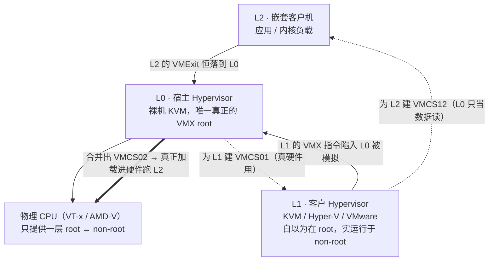
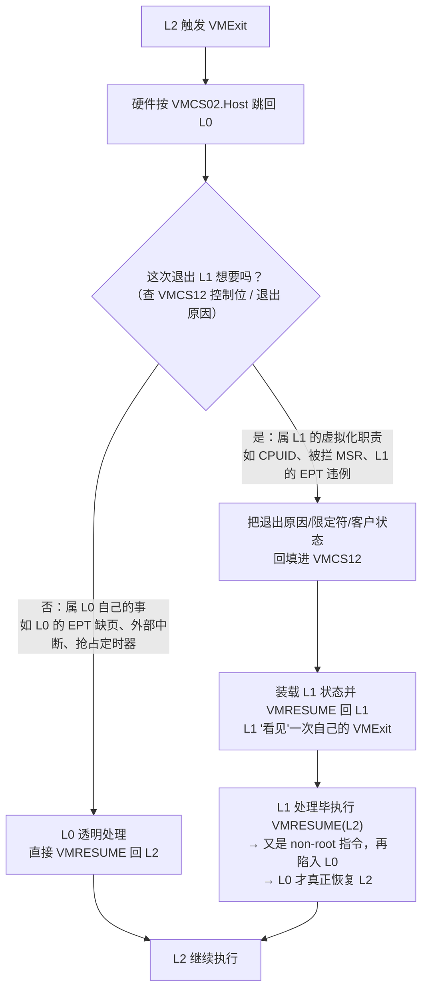
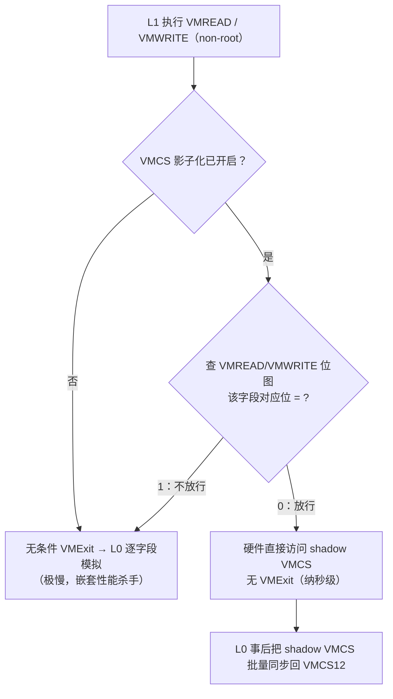
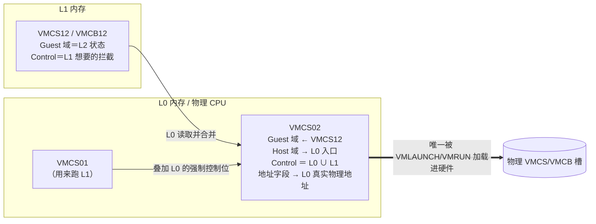

# 虚拟化与TEE机密计算（7）· 嵌套虚拟化
> [!abstract] TL;DR
> - 硬件只提供**一层** root/non-root：真正的 L0 独占 VMX root，L1 被"降级"到 non-root 运行，它执行的所有 VMX 指令（VMLAUNCH/VMREAD/INVEPT…）都无条件陷入 L0 被**陷阱-模拟**（trap & emulate），L2 才是那个真正跑在 non-root 的负载。
> - L0 同时维护**三份** VMCS：`VMCS01`（用来跑 L1）、`VMCS12`（L1 亲手为 L2 写的，L0 只把它当**数据**读）、`VMCS02`（L0 把前两者**合并**出来、真正 VMLAUNCH 进物理 CPU 跑 L2 的那份）；合并规则＝Guest 域取自 VMCS12、Host 域指回 L0 入口、控制位取 L0 与 L1 的**并集**。
> - 每次 L2 退出**必先落到 L0**，L0 再依 VMCS12 的控制位判定"这次退出 L1 想不想要"：想要就把退出信息回填 VMCS12、恢复 L1，让 L1"看见"一次属于自己的 VMExit——**一次逻辑退出常被放大成多次 L0↔L1 往返**，这是嵌套慢的根因。
> - **VMCS 影子化**（Haswell 引入的硬件特性）＋VMREAD/VMWRITE 位图，让 L1 在 non-root 里直接读写 shadow VMCS 而**不陷出**；Hyper-V 系的 **eVMCS**（enlightened VMCS）用普通内存结构＋clean 位彻底免陷，二者把纳秒级的字段访问从"每次一陷"救回来。
> - 内存要"三级压一级"：L0 用 **nested EPT** 把 `EPT12∘EPT01` 组合成硬件唯一能加载的 `EPT02`（Turtles 论文称**多维分页**）；AMD 的 VMCB 可用普通 MOV 访问，天生免去"字段影子化"这一难题，但同样要合并 VMCB 与嵌套页表。
> - 安全上嵌套把整台 VMX/SVM 模拟器搬进 L0，**攻击面显著变大**：历史上 KVM 的 nested SVM 因未校验 L1 提供的 VMCB 字段（CVE-2021-3653/3656）可致 L2 读写宿主物理内存；而 WSL2、VBS/Credential Guard、Kata、云上 CI 又都依赖它——必须**按需开启并紧跟补丁**。

## 概述与定位

嵌套虚拟化（nested virtualization）指**在一台虚拟机里再运行一个 Hypervisor**，从而在客户机内部再开客户机。业界用 L0/L1/L2 三个层号来描述这个"套娃"：**L0** 是直接跑在物理硬件上的裸机 Hypervisor（例如宿主机上的 KVM 或 ESXi）；**L1** 是作为 L0 的一台普通虚拟机、但其内部又运行着一个 Hypervisor 的客户机（例如 L0 的 VM 里装了 KVM、Hyper-V、VMware 或 VirtualBox）；**L2** 则是 L1 这个客户 Hypervisor 再开出来的虚拟机——它离物理硬件隔了两层。理论上还能有 L3、L4……"turtles all the way down"（乌龟叠乌龟，一路向下），但每多一层性能都成倍恶化，实战几乎止步于 L2。

为什么这件事今天不可回避？因为它已经从"实验室玩具"变成**日常基础设施**：Windows 的 **WSL2** 本质是一台轻量 Hyper-V 虚拟机，当整台 Windows 本身又跑在云上虚拟机里时，WSL2 就是 L2；**VBS（基于虚拟化的安全）/Credential Guard/HVCI** 用 Hyper-V 把凭据与内核代码完整性隔进一个更高信任级，若 Windows 是 VM，这套机制就必须靠嵌套才能生效；**Windows Sandbox**、macOS 上的容器方案、**Kata Containers**（把每个容器塞进微型 VM）、以及云厂商允许你在其 VM 上再跑 KVM 做 CI/CD、做 Hypervisor 开发与恶意软件分析——全都是嵌套的消费者。可以说，嵌套虚拟化是"虚拟化能被虚拟化"这一自指能力的落地。

**本篇的边界**：VT-x/AMD-V 的基本原理（VMCS/VMCB、root/non-root、VMLAUNCH 语义）已在[[02.CPU虚拟化：VT-x与AMD-V]]讲透，EPT/NPT/影子页表在[[03.内存虚拟化：EPT与NPT与影子页表]]，KVM 与 QEMU 的分工在[[06.KVM与QEMU协作原理]]，而 VMExit 的完整分类、hypercall/超级调用的约定留给[[08.VMExit与超级调用hypercall]]，逃逸案例归[[09.虚拟机逃逸原理与案例]]。本篇聚焦一个核心命题：**当硬件只肯给一层虚拟化时，软件如何"变"出第二层、第三层**——答案的两大支柱就是种子点名的 **L0/L1/L2 分层模型**与 **VMCS 影子化/合并**。

理解嵌套的**第一性原理**只有一句话：**x86 的 VT-x（以及 AMD-V）在硬件层面只有一层 root/non-root**。CPU 的世界里只存在"我是 Hypervisor（VMX root mode）"和"我是被管的客户机（VMX non-root mode）"两种状态，它**根本不认识"嵌套"这个概念**。于是 L1 想当 Hypervisor、想执行 VMLAUNCH 去跑自己的 VM，硬件却已经把 L1 自己关在 non-root 里了。矛盾就此产生，而解决它的全部技巧，都是围绕"如何在单层硬件上模拟出多层语义"展开的。

## 原理与机制

嵌套的骨架是经典的 **trap-and-emulate（陷阱-模拟）**：把 L1 当成一台"以为自己是 Hypervisor、其实是客户机"的机器，让它的每一条特权 VMX 指令都陷回真正的老板 L0，由 L0 代为完成语义。

**为什么 L1 的 VMX 指令一定会陷出？** 因为按 Intel SDM 的规定，在 VMX non-root 模式下执行 `VMXON/VMXOFF/VMPTRLD/VMPTRST/VMCLEAR/VMLAUNCH/VMRESUME/VMREAD/VMWRITE/INVEPT/INVVPID/VMCALL` 等一族指令会**无条件产生 VMExit**（VMREAD/VMWRITE 在开启"VMCS 影子化"后可有条件放行，详见下一段）。L1 被 L0 塞在 non-root 里运行，它一执行这些指令，控制权就自动弹回 L0。L0 于是化身"VMX 解释器"：L1 执行 `VMXON`，L0 记下 L1 进入了 VMX 操作态；L1 执行 `VMPTRLD(ptr)`，L0 记下 L1 当前活动的 VMCS 指针指向哪块内存；L1 执行 `VMWRITE(field,val)`，L0 就把 val 写进它在内存里维护的、代表"L1 眼中那份 VMCS"的数据结构；等 L1 执行 `VMLAUNCH`，L0 才真正开始"帮 L1 把 L2 跑起来"。

**三份 VMCS 是整个机制的心脏。** 关键在于：L1 亲手填的那份 VMCS，硬件**不能直接用**——它在 L1 的内存里、按 L1 的理解排布，而真正的硬件切换是从 L0（root）切到 L2（non-root），不是从 L1 切到 L2。于是 L0 在逻辑上握着三份：

- **VMCS01**：描述"L0 → L1"这层切换，是 L0 用来跑 L1 的**真·硬件 VMCS**。L1 平时就靠它在 non-root 里执行。
- **VMCS12**：L1 为了跑 L2 而 `VMWRITE` 出来的那份，代表"L1 → L2"这层切换。**L0 只把它当纯数据读取**，从不直接 VMLAUNCH 它。
- **VMCS02**：L0 把 VMCS01 的宿主视角与 VMCS12 的客户请求**合并**出来的那份，代表"L0 → L2"这层真实切换。**只有它会被 VMPTRLD 进物理 CPU 并 VMLAUNCH**。

下面这张图先把三层与三份 VMCS 的对应关系钉死，后文再展开合并算法。



**跑 L2 的一趟完整流程**是这样的：L1 执行 `VMLAUNCH` → 陷入 L0 → L0 读出 L1 当前活动 VMCS12 的全部字段 → L0 据此构造/更新 VMCS02（把 L2 的寄存器状态搬进 Guest 域，把 Host 域改成"退出后回到 L0 自己的处理入口"，把控制位取 L0 与 L1 的并集）→ L0 对 VMCS02 执行真正的 `VMLAUNCH` → 硬件进入 non-root、开始跑 L2。此刻物理 CPU 以为自己只是"root(L0) 跑了个 non-root 客户机"，浑然不知这个客户机在软件语义上其实是 L2。

**退出则必然"先回 L0、再看要不要转发给 L1"。** 因为 VMCS02 的 Host 域指向 L0，L2 一旦触发 VMExit，硬件把控制权交还的是 **L0** 而非 L1。L0 拿到退出原因后做一次仲裁：如果这次退出是 L0 自己关心的（比如 L0 给 L1 做的 EPT 缺页、投递给 L0 的外部中断、L0 的抢占定时器），L0 悄悄处理完直接 VMRESUME 回 L2，**L1 全程不知情**；如果这次退出是 L1 作为 Hypervisor 本就想拦截的（比如 L2 执行了 CPUID、访问了 L1 想虚拟化的 MSR、触发了 L1 设的 EPT 违例），L0 就把退出原因、退出限定符、L2 的客户状态**回填进 VMCS12**，装载 L1 的状态并 VMRESUME 回 L1，让 L1"看见"一次它自己的 L2 发生的 VMExit。L1 处理完后照例 `VMRESUME`——这又是一条 non-root 指令，于是**再次陷入 L0**，L0 才最终把 L2 真正恢复。**一次逻辑上的 L2 退出，被放大成"L2→L0→L1→L0→L2"多跳**，这就是嵌套天生比单层慢的结构性原因。

## VMCS 影子化与三级状态合并详解

这一段是本篇的重心，把"合并算法、退出仲裁、硬件 VMCS 影子化、eVMCS、嵌套 EPT、AMD 差异"六块逐一拆开。

**（一）VMCS 的物理排布，解释了为什么必须"合并"而非"转发"。** 一块 VMCS 是不超过 4KB 的物理页，但它的字段**不能用普通 MOV 读写**，必须走 `VMREAD/VMWRITE` 指令、以"字段编码"为索引访问，具体偏移由 CPU 实现私有。这套设计是为了让 CPU 能把热字段缓存进片上、并自由决定内存布局，但副作用是：L0 无法把 L1 写的 VMCS12"原样"塞给硬件，因为两台机器的物理布局可能不同，更因为 Host 域必须被改写。VMCS 的头部结构对逆向很关键：

```
VMCS 区域（≤ 4KB，物理页对齐）
+--------------------------------------------------------------+
| off 0x000 : [bit0..30] VMCS 修订标识   [bit31] 影子 VMCS 标志 |  ← 硬件直接读这 4 字节
| off 0x004 : VMX-abort 指示码                                  |
| off 0x008 : 实现私有数据区（仅 VMREAD/VMWRITE 可访问）        |
|    ├─ Guest-state area     客户机寄存器 / 段 / CR0·CR3·CR4 …  |
|    ├─ Host-state area      VMExit 后要装回的宿主状态          |
|    ├─ VM-execution ctls    Pin/Proc/Secondary 拦截位、EPTP、  |
|    │                       VMCS-link 指针、读/写位图地址 …    |
|    ├─ VM-exit  ctls        退出时行为（MSR 存取、地址空间…）  |
|    ├─ VM-entry ctls        进入时行为 / 事件注入              |
|    └─ VM-exit info（只读） 退出原因、退出限定符、GPA …       |
+--------------------------------------------------------------+
影子 VMCS：把 bit31 置 1，被父 VMCS 的 "VMCS-link 指针" 引用，
并需 "VMCS shadowing" 执行控制位（Secondary 第 14 位）为 1 才生效。
```

**（二）合并（merge）算法：VMCS02 = f(VMCS01, VMCS12)。** L0 构造 VMCS02 时按域分类处理：**Guest-state 域**几乎照抄 VMCS12——因为要跑的正是 L2，它的 RIP、RSP、CR3、段选择子、CR0/CR4 都该来自 L1 给 L2 设的值。**Host-state 域**必须全部改写成指向 L0 自己的再入口（L0 的 RIP、RSP、GDT、IDT），保证"L2 一退出就回到 L0"而不是回到 L1，否则 L0 就失去了仲裁权、嵌套模型直接崩塌。**控制位（execution/exit/entry controls）**取**并集语义**：任何一层想拦截的事件，VMCS02 都必须拦截。举例，若 L1 想拦 L2 的 `HLT`、而 L0 想拦 L2 的外部中断，则 VMCS02 里这两个拦截位都要置 1——因为退出先回 L0，L0 有能力再判断"这是 L1 要的还是我要的"；反过来若漏置了 L1 想要的拦截位，L1 就永远收不到那个退出，语义即被破坏。此外 VMCS02 里所有**物理地址型字段**（EPTP、I/O 位图、MSR 位图、APIC-access 页、VMREAD/VMWRITE 位图地址）都必须换成 L0 世界里真实有效的物理地址，而不能沿用 L1 填的"L1 物理地址"。

**（三）能力 MSR 决定 L1 能用多少 VMX 特性。** L1 在开机时会读 `IA32_VMX_BASIC / IA32_VMX_PROCBASED_CTLS / IA32_VMX_EPT_VPID_CAP` 等一族**能力 MSR**来探测硬件支持哪些 VMX 特性，这些 RDMSR 也会陷入 L0，由 L0 **返回一个 L0 有能力模拟的特性子集**。这解释了一个常见现象：**嵌套客户机看到的 VMX 能力往往少于裸机**——L0 只肯暴露它自己会合并、会虚拟化的那些控制位；L1 若强行在 VMCS12 里置了一个 L0 不支持的控制位，L0 在模拟 VMLAUNCH 时会按 SDM 的进入检查（VM-entry checks）让它**失败**，返回相应错误码给 L1。这套"能力协商"是嵌套正确性的第一道闸门。

**（四）退出仲裁：`nested_vmx_reflect_vmexit` 的判定逻辑。** 前文说过退出先回 L0，这里给出仲裁的严谨版本。以最经典的 CPUID 为例：CPUID 在 non-root 下**无条件退出**、且没有任何控制位能关掉它，L2 一执行 CPUID 就退到 L0；L0 判断"L1 作为 Hypervisor 一定想虚拟化 CPUID"，于是把退出反射给 L1，L1 伪造一个 CPUID 结果、再 VMRESUME——如上所述又陷回 L0，L0 才恢复 L2。对多数退出原因，L0 的判据是"去 VMCS12 里查 L1 对应的控制位是否为 1"：置 1（L1 想要）→反射给 L1；置 0（L1 不关心）→L0 自己吞掉并透明恢复 L2。下图把这套仲裁画成状态流：



**（五）硬件 VMCS 影子化：把 VMREAD/VMWRITE 从"每次一陷"里救出来。** 一个 Hypervisor 在建立 VMCS 和处理每次退出时会执行**海量** VMREAD/VMWRITE。若这些指令统统陷入 L0 模拟，嵌套将慢到不可用。Intel 在 Haswell（2013）引入 **VMCS shadowing**：L0 在 VMCS01 里打开 Secondary 执行控制的"VMCS shadowing"位（第 14 位），把 **VMCS-link 指针**指向一块 **shadow VMCS**（其头部 bit31 置 1 标明身份），再配两张 4KB 的 **VMREAD 位图 / VMWRITE 位图**（每个 VMCS 字段编码对应一位）。此后 L1 在 non-root 里执行 VMREAD/VMWRITE 时，硬件先查位图：该字段位为 **0** → 直接在 shadow VMCS 上完成访问、**不产生 VMExit**（纳秒级）；为 **1** → 才退出到 L0 模拟。于是 L0 把"热字段"位清 0 放行给硬件、只把少数需要特判的字段位置 1，绝大部分字段访问被硬件消化，L0 再择机把 shadow VMCS 与逻辑上的 VMCS12 批量同步。注意 shadow VMCS 只服务"字段读写免陷"，它**不能被 VMLAUNCH**——真正跑 L2 用的仍是合并出来的 VMCS02。



**（六）eVMCS（enlightened VMCS）：用半虚拟化彻底绕开陷阱。** Hyper-V 的 TLFS 定义了 enlightened VMCS——L0 与 L1 事先约定一块**普通内存**里的结构来承载"VMCS 语义"，L1 用普通 MOV 直接读写、辅以一张 **clean fields 位图**标记"这次只改了哪些字段"，进入客户机时 L0 只需重新处理被标脏的字段。它连 VMREAD/VMWRITE 指令都不用，因此在没有 VMCS shadowing 的场景也能大幅提速，是 KVM 与 Hyper-V 互相嵌套时（KVM 当 L1 跑在 Hyper-V 上，或 KVM 当 L0 跑 Hyper-V 当 L1）的关键优化。它与硬件 VMCS 影子化殊途同归——一个靠硬件放行、一个靠软件约定，目标都是消灭"每字段一次陷出"。

**（七）嵌套 EPT / 多维分页：把三级地址翻译压进硬件唯一的一级。** L2 访存要走三级翻译：L2 客户虚拟地址→L2 客户物理（L2 自己的页表）→L1 客户物理（**EPT12**，L1 为 L2 配的 EPT）→宿主物理（**EPT01**，L0 为 L1 配的 EPT）。可硬件只做**一级** EPT。于是 L0 必须像影子页表压缩客户页表那样，把 EPT12 与 EPT01 **函数复合**成一张 **EPT02**（L2 客户物理直达宿主物理），装进 VMCS02。Turtles 论文称之为 **multi-dimensional paging（多维分页）**。当 L2 访存触发 EPT02 缺项（nested EPT violation），L0 先走 L1 内存里的 EPT12 求 L2gpa→L1gpa，再走 EPT01 求 L1gpa→hostpa：两级都命中就填好 EPT02 项并恢复；若 EPT12 缺项 → 这是 L1 该管的，**反射给 L1**；若 EPT01 缺项 → 是 L0 的按需调页，L0 自理。为保持 EPT02 与 EPT12 一致，L0 会写保护 EPT12 页或在模拟 `INVEPT` 时同步失效，避免 L1 改了页表而 EPT02 用了陈旧翻译。

**（八）AMD-V（SVM）的差异：VMCB 天生免"字段影子化"。** AMD 用 **VMCB**（4KB，分控制区与状态保存区）承载虚拟化状态，且**用普通内存指令访问**、以 `VMRUN` 一条指令带指针启动客户机——没有 VMREAD/VMWRITE 这套特殊指令。因此 AMD 嵌套**根本不存在"VMCS 字段访问要不要陷出"的难题**：L0 拦截 L1 的 `VMRUN`，用普通 MOV 读出 VMCB12，合并成 VMCB02 再 `VMRUN` 跑 L2。代价则转移到别处：L0 必须严格**校验 L1 提供的 VMCB 字段**（否则就是逃逸口子，见安全段的两个 CVE）。AMD 侧的加速特性是 **VLS（Virtual VMLOAD/VMSAVE）**、**VGIF（虚拟全局中断标志）**，用来减少 L1 频繁 VMLOAD/VMSAVE、STGI/CLGI 造成的拦截；嵌套页表侧则要合并 L1 的 nCR3 与 L0 的 nCR3，逻辑与 Intel 的 nested EPT 对称。三份 VMCS 的合并关系，一图收束：



## 工具视角与实战

**在 KVM（L0）上开启嵌套。** Intel 平台默认常关，需给 `kvm_intel` 模块传 `nested=1`；AMD 的 `kvm_amd` 在较新内核默认已开。检查与开启：

```bash
# 宿主机 L0：查当前是否已开（Y=已开）
cat /sys/module/kvm_intel/parameters/nested      # Intel
cat /sys/module/kvm_amd/parameters/nested        # AMD

# 若为 N，重载模块开启（会断开现有 VM，需先关机）
sudo modprobe -r kvm_intel && sudo modprobe kvm_intel nested=1
# 持久化：/etc/modprobe.d/kvm.conf
#   options kvm_intel nested=1     （AMD 则 options kvm_amd nested=1）
```

**把虚拟化能力暴露给 L1。** 光开 L0 还不够，必须让 L1 的 vCPU **看得见 vmx/svm 特性位**，否则 L1 内核连 `/dev/kvm` 都创建不出来。QEMU 用 `-cpu host`（透传物理 CPU 全部特性，最省事）或 `-cpu <model>,+vmx`（Intel）/`+svm`（AMD）单独补齐；libvirt 用 `<cpu mode='host-passthrough'/>`，或 host-model 下显式 `<feature policy='require' name='vmx'/>`。进 L1 后验证：`grep -E 'vmx|svm' /proc/cpuinfo` 有输出、`ls /dev/kvm` 存在、`dmesg | grep -i kvm` 看到 KVM 初始化即成功。

**Hyper-V（Windows）侧的嵌套开关。** 要在一台 Hyper-V 虚拟机里再跑 Hyper-V/WSL2，需对该 VM（须先关机）执行：

```powershell
Set-VMProcessor -VMName "L1" -ExposeVirtualizationExtensions $true
# 常见附带约束：该 VM 需关闭动态内存；若 L2 要联网，
# 需给 L1 的网卡开 MAC 地址欺骗 Set-VMNetworkAdapter -MacAddressSpoofing On
```

**观测与调试嵌套。** 逆向/排障时最有用的是 KVM 的 nested 专用 tracepoint 与统计：

```bash
# 看嵌套退出的实时计数与原因分布
sudo perf kvm stat live
# 抓嵌套相关事件（L2 退出到 L0、L0 向 L1 注入退出）
sudo trace-cmd record -e kvm:kvm_nested_vmexit -e kvm:kvm_nested_vmexit_inject \
                      -e kvm:kvm_nested_vmrun -e kvm:kvm_nested_intr_vmexit
sudo trace-cmd report | less
# kvm_stat 里的 nested_* 计数器亦可看放大程度
```

若发现 L2 里某类操作奇慢，八成是**退出被放大**（一次 L2 退出多跳 L0↔L1）或**未启用 VMCS 影子化/eVMCS**导致 VMREAD/VMWRITE 逐条陷出——前者看 tracepoint 里同一 GPA/原因的往返次数，后者看 CPU 是否具备并启用了 shadowing（Haswell 及以后），或让 L1 的 Hyper-V 走 eVMCS 路径。

**迁移与快照的坑：nested state 必须单独序列化。** 一台正在跑 L2 的 L1，其"嵌套状态"（当前活动 VMCS12 指针、shadow VMCS 内容、L0 内部为 L2 维护的中间态）**不在**常规客户机寄存器里。KVM 为此提供 `KVM_CAP_NESTED_STATE` 及 `KVM_GET_NESTED_STATE / KVM_SET_NESTED_STATE` ioctl，热迁移/存盘时必须一并搬运，否则迁移后 L2 会错乱甚至崩溃。这是"L1 带活的 L2 做热迁移"长期困难、直到该 API 才被驯服的根因，实战里排查"迁移后嵌套客户机卡死"要第一个想到它。

## 安全性与正确使用

**嵌套的本质是把一整台 VMX/SVM 模拟器搬进 L0，攻击面因此显著扩张。** 单层虚拟化里，L0 主要暴露"设备模拟 + 少量指令模拟"给客户机；一旦开启嵌套，L0 还要额外向 L1 暴露**整套 VMX/SVM 语义的模拟实现**——VMLAUNCH 的进入检查、VMCS/VMCB 字段的合并、退出反射、嵌套 EPT/NPT 的组合。这套代码逻辑极其复杂、由 L1（潜在恶意方）喂入数据驱动，任何一处"忘了校验 L1 填的字段"都可能演变成 **L2/L1 读写宿主内存**乃至 **guest→host 逃逸**。

**两个教科书级的 nested SVM 漏洞**恰好点破核心原则——**"L0 必须把 L1 提供的 VMCB/VMCS 字段当作不可信输入严格净化"**。CVE-2021-3653：KVM 合并 L1 的 VMCB 时未校验 `int_ctl` 字段，恶意 L1 可借此为 L2 打开 **AVIC**（高级虚拟中断控制器），使 L2 得以读写宿主物理页，导致宕机、敏感数据泄露乃至逃逸。CVE-2021-3656：KVM 未校验 `virt_ext` 字段，恶意 L1 可关闭 VMLOAD/VMSAVE 拦截并启用 VLS，从而读写宿主物理内存的一部分。二者的病根一模一样：**L0 直接信任了 L1 可控的控制位**。这也说明合并算法里"控制位取并集"绝不能天真照抄——凡是会赋予 L2 更高硬件权限的位，L0 都必须先按自己的策略夹逼（clamp）与校验。

**正确使用与加固边界**：其一，**按需开启**——不需要嵌套的宿主就别打开 `nested=1`，直接砍掉这块攻击面；不需要给客户机 vmx/svm 的就别透传特性位。其二，**紧跟补丁**——嵌套代码是 KVM 里 CVE 高发区，宿主内核与 QEMU 要及时更新。其三，**分清信任边界**：嵌套**不提供任何机密性保证**，L0 对 L1、L1 对 L2 都是完全透明的——L0 能读写 L1 及 L2 的全部内存与寄存器。真正要对宿主/更高层保密，得靠[[13.AMD-SEV与机密虚拟机]]、Intel TDX 这类 CoCo 机制，而 CoCo 与嵌套的组合（在机密 VM 内再嵌套）是受限且仍在演进的方向，不能想当然。其四，理解**它同时也是安全能力的载体**：Windows 的 VBS/Credential Guard/HVCI 正是用嵌套把凭据与内核代码完整性抬进更高信任级（呼应[[38.Windows内核与驱动逆向/25.HyperV架构与VBS]]、[[38.Windows内核与驱动逆向/29.CI.dll与代码完整性WDAC]]）——当 Windows 本身跑在云 VM 里时，这些防护的有效性直接依赖底层嵌套实现是否正确、是否被暴露。其五，**逆向与反分析视角**：嵌套是分析"蓝药丸"式 Hypervisor 级 rootkit 的利器（把可疑 Hypervisor 塞进 L1 里观察），但反过来，恶意软件也会用 CPUID 行为、RDTSC 时序、VMX 能力缺失、双重退出造成的异常延迟来**探测自己是否被嵌套**，据此改变行为逃避沙箱——分析环境要对这些指纹有所收敛。

## 小结

嵌套虚拟化的全部魔法，源自一个硬约束与一套软补偿的对撞：**硬件只有一层 root/non-root**，而我们想要多层。补偿的两根支柱正是种子点名的两点——**L0/L1/L2 分层模型**把"谁是真老板、谁在假装老板"厘清（L0 独占 root，L1 被降级到 non-root、其 VMX 指令悉数陷入 L0 被 trap-and-emulate，L2 才是真正的 non-root 负载）；**VMCS 影子化/合并**则解决"L1 写的 VMCS 硬件不能直接用"：L0 维护 VMCS01/12/02 三份，把 VMCS12（数据）与 VMCS01（宿主视角）合并成唯一可加载的 VMCS02，Guest 域取 L2、Host 域指回 L0、控制位取并集且对危险位严格夹逼。退出必先回 L0 再仲裁反射，导致**退出放大**这一性能顽疾，而 **Haswell 的 VMCS shadowing**（读写位图放行 shadow VMCS）与 **eVMCS**（内存结构＋clean 位）把逐字段陷出救了回来；内存侧靠 **nested EPT/多维分页**把三级翻译压进硬件一级；AMD 的 VMCB 可普通内存访问，免去字段影子化却把重担压在"净化 L1 输入"上——两个 nested SVM CVE 就是反面教材。掌握这套模型，才能读懂 WSL2、VBS、Kata、云上嵌套究竟在底层发生了什么，也才能在逆向 Hypervisor 级威胁时站对层号。下一篇转入[[08.VMExit与超级调用hypercall]]，把本篇反复出现的"退出/反射/恢复"这条控制流讲到毛细血管级。

## 相关阅读

- 同系列：[[02.CPU虚拟化：VT-x与AMD-V]]（VMCS/VMCB 与 root/non-root 基础）、[[03.内存虚拟化：EPT与NPT与影子页表]]（本篇 nested EPT 的前置）、[[06.KVM与QEMU协作原理]]（L0 侧实现）、[[08.VMExit与超级调用hypercall]]（退出/超级调用细节）、[[09.虚拟机逃逸原理与案例]]（嵌套逃逸的下游）、[[13.AMD-SEV与机密虚拟机]]（机密性与嵌套的边界）
- 内核呼应：[[38.Windows内核与驱动逆向/25.HyperV架构与VBS]]、[[38.Windows内核与驱动逆向/29.CI.dll与代码完整性WDAC]]
- 硬件承接：[[21.Asm/40 虚拟化扩展对比]]、[[24.内存管理与堆分配器/02.进程地址空间与虚拟内存]]
- 启动链呼应：[[39.固件与IoT嵌入式逆向/21.安全启动链绕过技术]]
- 权威文档与论文：Intel SDM Volume 3C（VMX operation、VMCS shadowing、VM-entry/exit checks 各章）；AMD APM Volume 2《System Programming》（SVM、Nested Paging、VMCB 布局）；Nadav Har'El 等《The Turtles Project: Design and Implementation of Nested Virtualization》OSDI 2010（嵌套 VMX、VMCS 合并、多维分页的开山之作）；Linux 内核 `Documentation/virt/kvm/`（nested state、api ioctl）；Microsoft Hyper-V TLFS（enlightened VMCS 定义）

[[00.虚拟化与TEE机密计算总览|⬆ 系列总览]] | [[06.KVM与QEMU协作原理|← 上一章]] | [[08.VMExit与超级调用hypercall|→ 下一章]]
