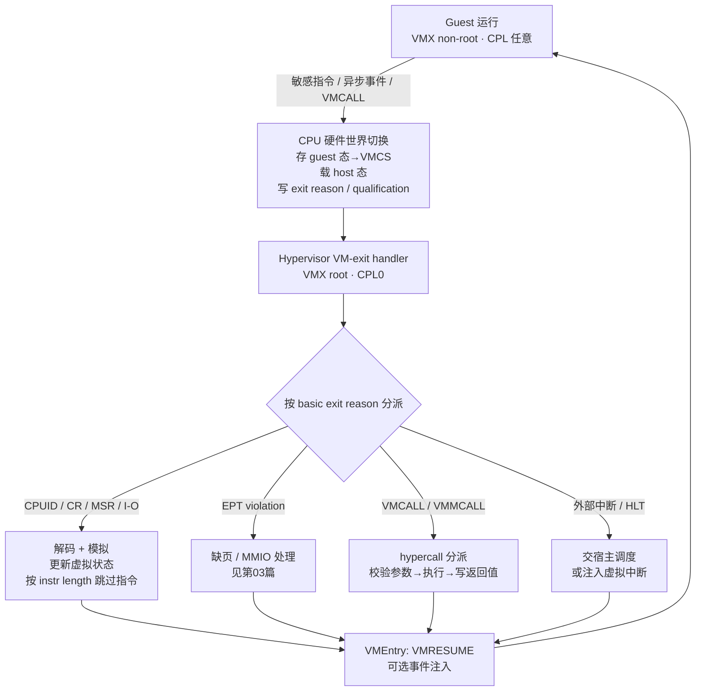
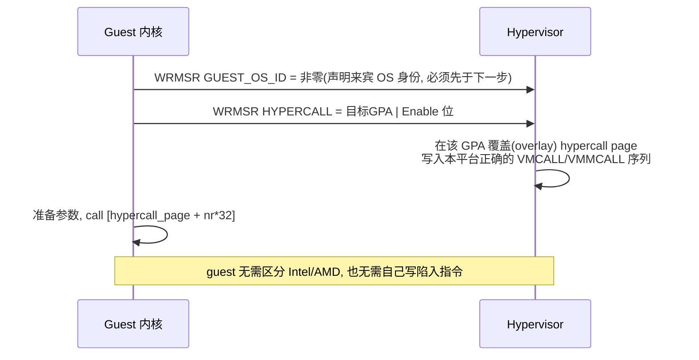
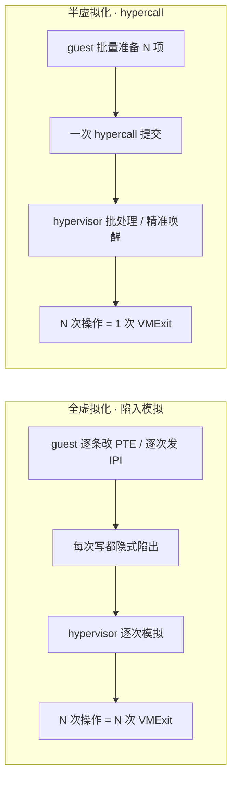
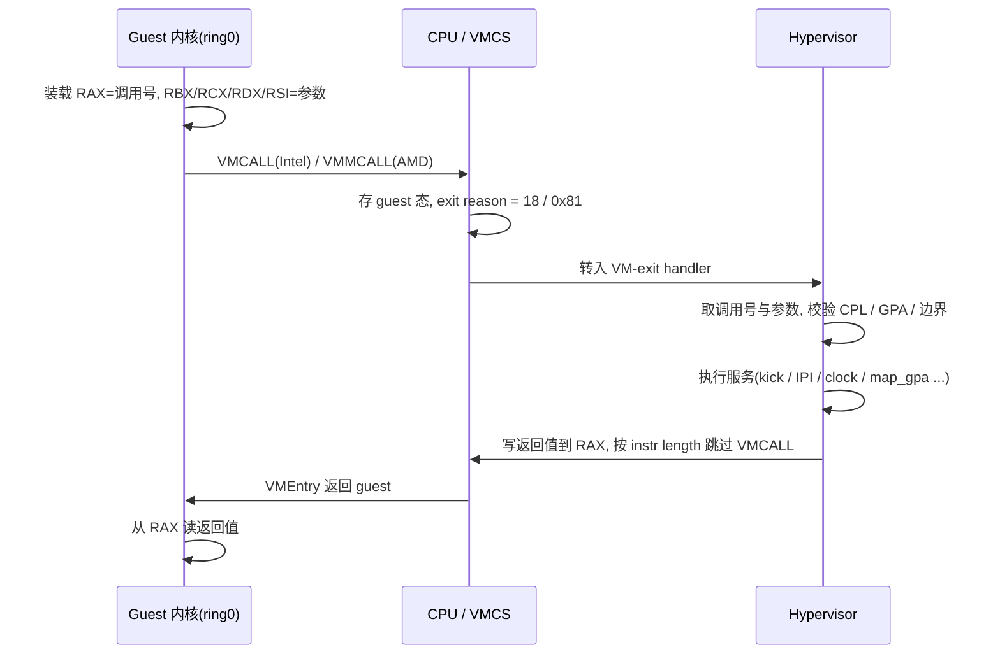

# 虚拟化与TEE机密计算（8）· VMExit与超级调用hypercall
> [!abstract] TL;DR
> - VMExit 是 guest（VMX non-root）跌回 hypervisor（VMX root）的唯一硬件通道：由 VMCS 的执行控制位决定哪些指令/事件触发，硬件把 basic exit reason 写进退出原因字段、把上下文写进 exit qualification，hypervisor 据此分派。
> - 陷入模拟（trap-and-emulate）是全虚拟化的根：敏感指令陷出→解码→在虚拟状态上模拟→按 instruction length 推进 RIP→VMEntry 返回；x86 早期因 SGDT/SIDT/SMSW/POPF 等敏感指令在 ring3 不陷入而无法直接 trap-and-emulate，VT-x/AMD-V 新增根/非根模式才补齐 Popek-Goldberg 的可虚拟化条件。
> - Hypercall 是"主动的 VMExit"：guest 用 VMCALL(Intel)/VMMCALL(AMD) 显式调用 hypervisor，语义等价于把 syscall 再下沉一层；每家 hypervisor 定义各自 ABI，KVM 用 RAX 传调用号，Xen/Hyper-V 用 hypercall page 抹平指令差异。
> - 半虚拟化接口用 hypercall 替换热点路径上昂贵的隐式陷入：pvclock、async PF、pv-EOI、pv-spinlock、pv-IPI、pv-TLB-flush、steal time，把"隐式陷入 N 次"压成"显式调用 1 次"。
> - 发现与协商靠 CPUID 0x40000000 签名叶 + 特性叶 + 一组 MSR；Linux 用 pv_ops 在启动时把特权操作打补丁成原生指令或某家 hypercall，实现一份内核跑遍裸机与各家 hypervisor。
> - 机密计算把这道边界反转成"guest 不信任 host"：SEV-ES/SNP 用 GHCB+VMGEXIT、TDX 用 TDCALL/TDVMCALL，寄存器必须显式经加密屏障共享，退出通道变成受控、最小化的信息交换边界。

## 概述与定位

本篇聚焦硬件辅助虚拟化的"控制面"——guest 与 hypervisor 之间那一次次的世界切换（world switch）。VMExit 是 CPU 从"来宾在跑"（Intel 的 VMX non-root、AMD 的 guest 模式）跌回"管理程序在跑"（VMX root）的硬件事件；hypercall 则是 guest 主动踩下这道机关的软件路径。可以这样对齐直觉：应用用 syscall/中断陷入内核，内核用 VMCALL/敏感指令陷入 hypervisor；前者的上下文保存区是内核栈与 TSS，后者的上下文保存区是 VMCS。VMExit 与 hypercall 的关系，正如"异常/中断"与"系统调用"的关系——一个是被动触发、一个是主动请求，但走的是同一条硬件下沉通道。

界定边界：VT-x/AMD-V 的模式与 VMCS 布局在[[02.CPU虚拟化：VT-x与AMD-V]]已铺开，本篇不重述寄存器字段全表，而是深挖三件事——为什么会退出、退出后怎么模拟、以及如何用 hypercall 把昂贵的隐式陷入换成便宜的显式调用。EPT violation 的地址翻译细节属[[03.内存虚拟化：EPT与NPT与影子页表]]；KVM 用户态/内核态如何接手退出、virtio 的 ioeventfd/irqfd 属[[06.KVM与QEMU协作原理]]；L2→L0→L1 的退出反射属[[07.嵌套虚拟化]]；把这道边界当武器打穿属[[09.虚拟机逃逸原理与案例]]。本篇是这些主题的"公因子"。

为什么值得单独成篇：VMExit 的频率与单次代价几乎决定了虚拟化的性能天花板——一次世界切换动辄上千个时钟周期，热路径上每秒成千上万次退出，累积起来就是可观的"虚拟化税"；半虚拟化接口是压低这条曲线的主要杠杆；而这道边界同时是安全上最敏感的信任分界：在传统虚拟化里它挡的是"guest 想越权打 host"，在机密计算（[[13.AMD-SEV与机密虚拟机]] 等）里它反过来还要挡"host 想偷看或篡改 guest"。理解退出与 hypercall，才算真正握住了虚拟化的方向盘。

## 原理与机制

**两种世界与 VMCS 这块"上下文黑板"。** 硬件虚拟化把 CPU 劈成两个操作模式：非根模式跑 guest，根模式跑 hypervisor。二者共享同一套物理寄存器，因此每次切换都要有人把一方的寄存器"存下来"、把另一方的"摆回去"。Intel 用一块内存结构 VMCS（AMD 对应 VMCB）承担这个"上下文黑板"：它分成 guest-state area、host-state area、VM-execution controls、VM-exit/entry controls、VM-exit information 等区域。VMExit 发生时，CPU 自动把 guest 的 RIP/RSP/RFLAGS、CR0/CR3/CR4、段选择子与描述符、部分 MSR 存进 guest-state area，再从 host-state area 加载 hypervisor 的对应状态，然后跳到 host RIP。一个关键且常被忽略的细节：除 RSP/RIP/RFLAGS 外，通用寄存器 RAX–R15 并不由硬件自动保存/恢复——它们由 hypervisor 的汇编入口桩手动压栈/弹栈。这正是逆向一个 hypervisor 时，退出处理函数开头总是一长串 `mov [rbx+off], rax/rcx/...` 的原因。

**什么会触发退出。** 触发源分四类。其一是"无条件陷出"的指令：CPUID、GETSEC、INVD、XSETBV 以及所有 VMX 指令（VMLAUNCH/VMRESUME/VMREAD/VMWRITE/VMCLEAR/…），只要在非根模式执行就必然退出——因为它们要么泄露宿主真实拓扑、要么本身就是虚拟化管理指令。其二是"受控陷出"的指令：HLT、MWAIT、RDTSC、RDPMC、INVLPG、MOV-CR、MOV-DR、I/O 指令、RDMSR/WRMSR 等，是否退出取决于 VMCS 里的执行控制位（pin-based、primary/secondary processor-based controls）以及 I/O bitmap、MSR bitmap。其三是异步事件：外部中断、NMI、异常（#PF、#GP、#UD 等，可用 exception bitmap 精确挑选哪些拦截）、EPT violation/misconfiguration、VMX 抢占定时器到期。其四就是本篇主角——guest 用 VMCALL/VMMCALL 主动请求的 hypercall。设计哲学是"默认透传、按需拦截"：能让 guest 直接在硬件上跑的就别退出，只有会破坏隔离或需要仲裁的操作才陷出。

**退出信息三件套。** 退出后 hypervisor 从 VMCS 读三样东西定位现场：basic exit reason（一个整数枚举，如 10=CPUID、12=HLT、18=VMCALL、28=CR 访问、30=I/O、31=RDMSR、32=WRMSR、48=EPT violation）；exit qualification（随原因而变的上下文位域）；以及 guest-linear-address、guest-physical-address、VM-exit interruption-information、IDT-vectoring information、VM-exit instruction length、instruction-information 等辅助字段。其中 instruction length 用于"跳过被模拟的指令"，IDT-vectoring information 则解决一个微妙问题：若退出恰好发生在 guest 正通过 IDT 投递某个中断/异常的半途，硬件会把"正在投递的事件"记进这个字段，让 hypervisor 在 VMEntry 时重新注入，保证事件不丢。

**返回与事件注入。** 反向路径是 VMEntry：首次用 VMLAUNCH（VMCS 状态从 clear 变 launched），之后快路径用 VMRESUME。VMEntry 会做严格的 guest-state 一致性检查，任何不合法（如非法段属性、CR 位组合）都会导致 entry failure（退出原因 33/34），这是调试"进不去 guest"时的第一个观察点。hypervisor 若要给 guest 送一个中断或异常，就填 VM-entry interruption-information field，VMEntry 时硬件按 guest IDT 投递——这套"事件注入"机制让 hypervisor 能模拟中断控制器、注入虚拟设备中断。

**为什么要死磕退出代价。** 一次退出-返回的硬件开销在现代 CPU 上约 1000–1500 周期，早期 Prescott/Merom 时代高达数千周期，再加上处理函数本身的成本。KVM 把退出分成"轻量"与"重量"两档：能在内核里就地处理的（如注入定时器中断、pv 服务）是轻量退出；需要甩给用户态 QEMU 的设备模拟（如某些 MMIO、PIO）是重量退出，还要额外一次内核↔用户态上下文切换。这条"退出预算"是后续所有优化（EPT 省掉影子页表的写陷入、APICv/posted interrupt 省掉中断相关退出、MSR/I-O bitmap 免掉良性访问的退出、以及本篇的半虚拟化）的共同动机。



## 退出原因分类、指令模拟与hypercall ABI详解

### 退出原因的分类与 exit qualification 的"一码多义"

basic exit reason 只是个粗粒度枚举，真正的信息在 exit qualification 里，而它的位域含义随退出原因彻底不同——这是初学者读 hypervisor 代码最容易懵的点。理解它的钥匙是：硬件不想为每种退出各开一堆专用字段，于是复用同一个 64 位字，让语义"看菜下饭"。

```
; 同一个 exit qualification 字段，语义随 basic exit reason 而变
I/O 指令(30):    端口号 / 访问宽度(1|2|4) / 方向(in|out) / string / rep / 立即数端口
CR 访问(28):     哪个 CR / 访问类型(MOV to|from CR, CLTS, LMSW) / 源或目的 GPR 编号 / LMSW 源数据
MOV DR(29):      哪个 DR / 方向 / GPR 编号
EPT violation(48): 触发的访问权限位(读|写|取指) / 该 GPA 当前 EPT 权限 / GLA 是否有效 / 是否页遍历中
异常/NMI(0):     配合 VM-exit interruption-information 给出向量、类型、错误码有效位
INVLPG(14):      被无效化的线性地址
任务切换(9):     选择子 / 切换源(CALL|IRET|JMP|门)
```

以 I/O 退出为例：hypervisor 读出"端口 0x3F8、宽度 1、方向 out"，就知道 guest 在往串口写一个字节，于是把这个字节喂给虚拟串口设备。以 CR 访问为例：捕获 `MOV CR3, rax` 能让影子页表方案同步页目录（EPT 时代已很少拦 CR3），捕获 `MOV CR0` 能拦截 guest 开关分页/保护模式。设计上"一码多义"省了硬件字段，代价是软件侧必须严格按原因解析，解析错一位就可能把写当成读、把端口号当成宽度——这也是 hypervisor 漏洞的温床之一（详见[[09.虚拟机逃逸原理与案例]]）。

### 陷入模拟的完整状态机：为什么 x86 曾经"陷不住"

trap-and-emulate 的思想朴素得像操作系统本身：把敏感操作降权，让它在越权时陷入更高特权层，由后者代为完成并维护一份"虚拟视图"。Popek 与 Goldberg 1974 年给出了它成立的形式条件——一台机器可被高效虚拟化，当且仅当其**敏感指令集是特权指令集的子集**（敏感=会读写或依赖特权状态/资源配置的指令）。只要满足这条，把 guest 降到低特权跑，所有敏感指令都会因越权而陷出，hypervisor 就能全部接管。

x86 恰恰长期不满足这条件，这是虚拟化史上著名的"x86 之痛"。至少十余条指令敏感却不特权：`SGDT/SIDT/SLDT/STR` 在 ring3 能读出 GDTR/IDTR/LDTR/TR 的真实值而不陷入（泄露宿主，且 guest 看到的不是自己的），`SMSW` 能读 CR0 低位，`PUSHF/POPF` 中 `POPF` 在 ring3 会**静默忽略** IF 等特权标志的修改而不报错——于是 guest 内核以为自己关了中断，其实没关。这些指令"陷不住"，纯 trap-and-emulate 就地失效。工业界给出三条绕路：VMware 用**二进制翻译**（BT），在运行前把 guest 内核码流扫描改写，把危险指令替换成会陷入的等价序列；Xen 用**半虚拟化**（PV），干脆改 guest 源码，把特权操作显式换成 hypercall（本篇后半的主线）；以及 ring 降权+打补丁的混合法。直到 Intel VT-x / AMD-V 引入一个"比 ring0 更底层"的模式，让**任意**敏感操作都可配置为陷出，x86 才第一次满足 Popek-Goldberg，纯硬件 trap-and-emulate 成为现实。

模拟一条指令的完整状态机是：退出→读 exit reason 定位指令类别→（必要时）用软件解码器取指、解析 ModRM/SIB/前缀/操作数→在虚拟状态（虚拟寄存器、虚拟设备、虚拟中断控制器）上施加该指令的语义效果→把结果写回 guest 的寄存器或内存→读 VM-exit instruction length 推进 guest RIP 跳过这条指令→VMEntry 返回。注意"推进 RIP"只适用于 trap 语义（指令已完成、跳过即可）；若是 fault 语义（如需要重放的缺页），则不推进、修好条件后原地重执行。对由指令执行触发的退出，硬件通常填好 instruction length；但对 EPT violation 这类缺页退出，长度不总可靠，KVM 会用自带的 x86 指令解码器（`arch/x86/kvm/emulate.c`）重新取指来判断长度与语义。这个软件解码器还负责另外几种硬件搞不定的场景：老 CPU 无 unrestricted guest 时的实模式/大实模式代码、MMIO 访问的指令重建、以及非法 guest 状态。它功能强大也因此是**攻击面**——历史上 KVM emulator 出过多个 CVE。硬件后来用 **unrestricted guest**（secondary control）让 guest 能直接在非根模式跑实模式（配合 EPT 恒等映射），大幅削减了对软件模拟器的依赖。

### hypercall：主动陷入的指令与 ABI

hypercall 把"被动陷入"变成"主动调用"。指令层面，Intel 用 `VMCALL`（在非根模式执行→退出原因 18），AMD 用 `VMMCALL`（→ #VMEXIT，exit code 0x81）。二者语义相同但编码不同，这给"一份 guest 二进制跑双厂 CPU"制造了小麻烦，解法见下一节的 hypercall page。ABI 层面各家自定义，但都遵循"寄存器传调用号+参数、寄存器回返回值"的 syscall 式约定。

```
; KVM hypercall（x86-64）调用约定
RAX = 调用号 (KVM_HC_*)
RBX = arg0   RCX = arg1   RDX = arg2   RSI = arg3
指令 = VMCALL(Intel) / VMMCALL(AMD)   ; kvm_hypercall 用 alternatives 在启动时择一
返回 = RAX（负值为 -KVM_Exxx 错误码）
典型调用号:
  KVM_HC_KICK_CPU      5   ; pv-spinlock 唤醒被抢占的持锁 vCPU
  KVM_HC_CLOCK_PAIRING 9   ; 主机 TSC 与 realtime 配对，供精确授时
  KVM_HC_SEND_IPI      10  ; 一次调用向多 vCPU 群发 IPI
  KVM_HC_SCHED_YIELD   11  ; 定向让出 CPU 给目标 vCPU
  KVM_HC_MAP_GPA_RANGE 12  ; 机密VM页状态(私有/共享)变更通知
```

```
; Hyper-V hypercall 输入（TLFS 约定）
RCX = hypercall input value：[15:0]=Call Code, [16]=Fast, [26:17]=Rep Count ...
RDX = 输入参数 GPA(慢调用) 或 首个输入(快调用)
R8  = 输出 GPA(慢调用) 或 次个输入(快调用)
返回 = RAX（Hypercall Result Value：状态码 + 已完成 Rep 数）
入口 = call 到 HYPERCALL MSR 指定的 hypercall page

; Xen hypercall（x86-64）约定
RAX = __HYPERVISOR_* 调用号
RDI, RSI, RDX, R10, R8, R9 = 参数   ; 用 R10 代替 RCX（RCX 会被 syscall/vmcall 破坏）
入口 = call 到 hypercall_page 的第 nr 个 32 字节槽
```

三家的差异折射设计取向。KVM 走极简，直接把 VMCALL 当"操作码"、RAX 当"功能号"，因为它与 Linux 内核同源、可随时改协议。Hyper-V 走"接口契约"，把 call code、fast/slow、rep count 打包进一个 input value，支持一次 hypercall 批量处理多个同类项（rep），并区分"快调用"（纯寄存器/XMM 传参，零内存往返）与"慢调用"（参数放 GPA 指向的输入页），这是为高频操作省内存拷贝。Xen 承袭 PV 时代的 syscall 风格，特意用 R10 顶替 RCX——因为 vmcall/syscall 会破坏 RCX。这些细节在逆向一个 guest 驱动或 rootkit 时是"指纹"：看到 `mov eax, 5; vmcall` 基本可判定在跟 KVM 说话，看到 `call [hypercall_page]` 前置一串 `mov rcx, ...` 则是 Hyper-V/Xen。

### hypercall page：抹平 VMCALL/VMMCALL 与平台差异

Hyper-V 与 Xen（HVM/PVH）不让 guest 直接写死 `VMCALL` 或 `VMMCALL`，而是引入 **hypercall page**：guest 先声明身份，再告诉 hypervisor 一个物理页地址，hypervisor 就在那页里**填好当前平台正确的指令序列**（Intel 上填 VMCALL、AMD 上填 VMMCALL，甚至 PV 上填 INT/SYSCALL），guest 只管 `call` 进这页。这样同一个 guest 内核二进制，无需在运行时判断自己跑在 Intel 还是 AMD 上，指令差异被 hypervisor 悄悄抹平。



Hyper-V 里这道流程还有个硬约束：必须**先**写非零的 `HV_X64_MSR_GUEST_OS_ID`（表明"我是个懂 Hyper-V 的来宾"），再写 `HV_X64_MSR_HYPERCALL` 打开 hypercall page，否则 hypervisor 拒绝建立页面。这既是握手，也是一道"来宾自证"的安全门。Xen HVM 的 hypercall page 机制同理，通过 CPUID 叶拿到页所在的 MSR 号后建立。

### 发现与协商：CPUID 签名叶、特性叶与一组 MSR

guest 怎么知道自己被虚拟化、对方是谁、支持哪些 hypercall？靠三层探测。第一层是 `CPUID.01H:ECX[31]` 这个"hypervisor present"约定位——真实硬件恒为 0，几乎所有 hypervisor 都把它置 1（这也是最廉价的反虚拟化检测点）。第二层是 `CPUID 0x40000000` 签名叶：EAX 给出最大可用叶号，EBX:ECX:EDX 拼出厂商签名字符串，如 KVM 的 `KVMKVMKVM`、Hyper-V 的 `Microsoft Hv`、Xen 的 `XenVMMXenVMM`、VMware 的 `VMwareVMware`、QEMU 纯软 TCG 的 `TCGTCGTCGTCG`。第三层是 `0x40000001` 起的特性叶，逐位声明能力：KVM 在此暴露 `KVM_FEATURE_CLOCKSOURCE / ASYNC_PF / PV_EOI / PV_TLB_FLUSH / PV_SEND_IPI / STEAL_TIME` 等；Hyper-V 用 `0x40000000–0x4000000A` 一整簇叶（TLFS 定义），并在 `0x40000001` EAX 给出接口签名 `Hv#1`。

除了 CPUID，运行期开关多用 **MSR**：KVM 用 `MSR_KVM_SYSTEM_TIME`（登记 pvclock 共享页 GPA）、`MSR_KVM_ASYNC_PF_EN`、`MSR_KVM_PV_EOI_EN`、`MSR_KVM_STEAL_TIME`；Hyper-V 用一批 synthetic MSR（`HV_X64_MSR_HYPERCALL`、`HV_X64_MSR_VP_INDEX`、SynIC 的 SINT/SIMP/SIEF、synthetic timer 的 STIMER 等）。这套"CPUID 声明能力、MSR 登记地址与开关、hypercall 走热路径"的三段式，就是现代 enlightenment 的标准骨架。逆向时反过来看：guest 里出现对 `0x40000000` 的 CPUID 和对这些 MSR 的读写，就是它在"认亲"和"对接"半虚拟化。

### 半虚拟化接口全景：把隐式陷入换成显式调用

半虚拟化的一句话本质是**用一次显式 hypercall，替换掉热路径上原本要发生的 N 次昂贵隐式陷入**，或替换掉一个语义在虚拟化下会"失真"的硬件行为。逐个拆解为什么每个都值得存在：

- **pvclock / kvm-clock（读时间不陷出）**：guest 读时间若走 RDTSC 且被拦截，就是一次退出；而 TSC 在跨核、变频、热迁移后还可能不连续。pvclock 在一块 guest/host 共享页里放 `{tsc_timestamp, system_time, tsc_to_system_mul, tsc_shift, flags}`，guest 本地 `rdtsc` 后按公式 `time = system_time + ((rdtsc - tsc_timestamp) * mul) >> shift` 自算纳秒时间，**零退出**且迁移后由 host 更新参数保持单调。
- **async PF（异步缺页，把 host 阻塞变 guest 调度）**：当 host 发现 guest 要访问的页被换出到磁盘，传统做法是**阻塞整个 vCPU 线程**等 I/O。async PF 让 host 先给 guest 注入一个"页暂不在位"的异步缺页信号，guest 缺页处理器据此把当前任务挂起、调度**别的**任务继续跑；页就绪后 host 再注入"页已就绪"。一次 host 侧的干等，被转化成 guest 侧的正常调度。
- **pv-EOI（中断结束不陷出）**：中断处理尾声写 APIC EOI 会触发退出。pv-EOI 让 guest 通过共享内存里的一个 bit 表示"已 EOI"，中断密集负载下省下大量退出。
- **pv-spinlock（治 Lock Holder Preemption）**：物理机上自旋锁靠忙等，但虚拟化下持锁的 vCPU 可能被 hypervisor 调度出去（LHP 问题），其它 vCPU 就空转烧 CPU 等一个"根本没在跑"的锁。pvqspinlock 让等待者自旋一小段后干脆 `HLT`（陷出→host 去调度持锁 vCPU），持锁者解锁时用 `KVM_HC_KICK_CPU` 把等待者踢醒。用"主动让出+精准唤醒"取代"盲目空转"。
- **pv-TLB-flush / pv-IPI（群发不再逐个陷出）**：远程 TLB 击落传统靠 IPI，向 N 个 vCPU 发 IPI 就是 N 次 APIC 写、N 次退出，且会白白打扰已被换出的 vCPU（它们重新调度时自会刷）。`KVM_HC_SEND_IPI` / Hyper-V 的 `HvCallSendSyntheticClusterIpi`、以及 pv-TLB-flush，把"给一群 vCPU 发信号"压成**一次** hypercall，并跳过休眠中的 vCPU。
- **steal time（被偷走的时间可见）**：共享页报告"本 vCPU 可运行但没被调度上"的累计时长，guest 调度器与计费据此校正，避免把 hypervisor 抢走的时间误算成任务耗时。
- **设备半虚拟化（virtio 等）**：用共享环形队列 + 通知（kick/中断）取代逐寄存器 MMIO 陷入模拟；其 ioeventfd/irqfd 通路属[[06.KVM与QEMU协作原理]]，此处不展开。



### pv_ops：一份内核跑遍裸机与各家 hypervisor

若为 Xen、KVM、Hyper-V、裸机各编一个内核，发行版会疯掉。Linux 用 **pv_ops（paravirt_ops）** 解决：把所有"可能因环境而异"的特权操作（读写 CR、TLB 刷新、PTE 更新、开关中断、时钟源等）抽象成一张函数指针表，启动早期做**硬件探测**（CPUID 签名叶）后，用 alternatives/静态补丁把这些指针**就地打补丁**成——裸机上的原生指令，或某家 hypervisor 的 hypercall 序列。于是同一个内核二进制，插到哪就"长"成哪家的样子，且热路径上没有函数指针间接跳转的额外开销（因为被 inline patch 成直接指令了）。这也解释了为什么现代 Linux 能在裸机、KVM、Hyper-V、Xen HVM 之间无缝漂移。Hyper-V 场景下还有 **enlightened VMCS（eVMCS）**，用共享内存镜像替代 VMREAD/VMWRITE，专为嵌套虚拟化省退出，细节见[[07.嵌套虚拟化]]。



## 工具视角与实战

**从宿主观测退出。** KVM 把退出全过程铺在 tracepoint 上：`kvm:kvm_exit`（带 exit_reason 与 guest RIP）、`kvm:kvm_entry`、`kvm:kvm_hypercall`、`kvm:kvm_mmio`、`kvm:kvm_msr`、`kvm:kvm_pio`、`kvm:kvm_userspace_exit`。最顺手的聚合工具是 `perf kvm stat`：`perf kvm stat live` 实时给出各 exit reason 的次数、占比与平均处理时延直方图，`perf kvm stat record/report` 离线分析。老牌 `kvm_stat`（读 `/sys/kernel/debug/kvm/*`）能看 `exits`、`mmio_exits`、`io_exits`、`halt_exits`、`irq_injections`、`tlb_flush` 等计数器。定位"虚拟化税"时的标准动作：先看总退出率，再看哪个 reason 占大头——若 `MSR_WRITE`/`IO`/`HLT` 异常高，往往对应缺失的半虚拟化开关或忙等的 guest。用 `bpftrace` 挂 `tracepoint:kvm:kvm_exit` 按 `args->exit_reason` 直方图化，是快速画退出画像的一招。

**从 guest 内部识别与调用。** 判断"我在不在虚拟机里、宿主是谁"：`cpuid` 工具读 `0x40000000` 叶看签名，`systemd-detect-virt`、`dmesg | grep -i hypervisor`（内核会打印 "Hypervisor detected: KVM/Microsoft Hyper-V/Xen"）、`dmidecode` 看 BIOS 厂商。想亲手发一个 hypercall，内核态一段内联汇编即可：`asm volatile("vmcall" : "=a"(ret) : "a"(nr), "b"(a0), "c"(a1), "d"(a2))`（AMD 上换 `vmmcall`，或直接用内核的 `kvm_hypercall*` 包装）。想从零写个 hypervisor 观察退出，走 `/dev/kvm` 的 `KVM_CREATE_VM`→`KVM_CREATE_VCPU`→`mmap` kvm_run→`KVM_RUN`，从返回的 `kvm_run->exit_reason`（`KVM_EXIT_IO/MMIO/HLT/...`）就能亲眼看到退出分派。

**QEMU/Xen/Hyper-V 侧的追踪。** QEMU 用 `-d in_asm,int,cpu` 打指令流与中断，`-trace` 开子系统 trace；配合 `-accel kvm` 时大部分退出在内核消化、只有重量退出回到 QEMU 设备模型。Xen 用 `xl dmesg`、`xentrace`/`xenalyze` 抓 hypervisor 事件（含 hypercall 与 vmexit 分类），`xl debug-keys` 打运行态。Hyper-V 侧靠 TLFS 对照 synthetic MSR/hypercall 号，Windows 上用 `hvix64/hvax64` 的调试与性能计数器。

**逆向视角。** 逆一个 hypervisor 二进制，找到"退出分派表"是纲：它通常是一个以 basic exit reason 为索引的跳转表或大 `switch`，每个 case 对应一个 handler；`VMCALL`/`VMMCALL` 的 handler 就是 hypercall 分发点，顺藤能摸清它自定义的 ABI 与功能集。逆 guest 侧的 rootkit/驱动，看它对 `0x40000000` 的探测和对 hypercall 指令的使用能判定其目标平台。反虚拟化（anti-VM）常用两招：查 `CPUID.01H:ECX[31]` 与签名叶；以及**给 VMExit 计时**——在 guest 里对 `CPUID`（必陷出指令）前后 `RDTSC`，若耗时远高于原生的几十周期（动辄上千），即推断"我在被虚拟化"。理解退出代价，才能理解这类计时探测为何有效，以及 hypervisor 为何要用 TSC offsetting/scaling 去平滑它。

## 安全性与正确使用

**这道边界是 guest→host 的头号攻击面。** hypercall 分发与指令模拟，是"不可信 guest"能直接驱动"可信 hypervisor"执行代码的入口，历史上大量虚拟机逃逸就走这里（案例见[[09.虚拟机逃逸原理与案例]]）。正确姿势是把每个 handler 当解析不可信输入的解析器来写：校验调用号在合法范围；校验所有 GPA 参数的边界、对齐与可访问性，且**一次性拷入**再用，避免 guest 在 handler 执行途中改内存造成的 TOCTOU；对长度/计数做整数溢出检查；对 rep count 设上限防 DoS。KVM 的 x86 指令模拟器与 QEMU 设备模型都出过 CVE，减小暴露面的手段包括：尽量用 unrestricted guest 削减软件模拟、用 MSR/I-O bitmap 让良性访问不进模拟器、禁用不需要的 hypercall/enlightenment、给虚拟设备做 fuzzing。

**特权与来源校验。** hypercall 通常应要求 guest 处于 ring0；KVM 对多数 hypercall 校验 `CPL==0`，非 0 则回 `-KVM_EPERM`，防止 guest 用户态程序绕过内核直接摇 hypervisor。Hyper-V 用"先写 GUEST_OS_ID 再开 hypercall page"作握手。这些都是"最小授权+显式声明"的体现：默认不开放，能力经 CPUID/MSR 协商后按需启用。

**退出通道上的侧信道与其缓解。** 世界切换是天然的隔离与投机边界，也是插入缓解的最佳落点：L1TF 需在 VMEntry 前刷 L1D cache，MDS 需执行 VERW 清微架构缓冲，Spectre-BTB 类需在切换时做 IBPB/retpoline。这些缓解都挂在退出/进入路径上，直接抬高单次退出成本——安全与性能在此明码标价。此外，退出本身的**时序**会泄露信息：guest 能通过给敏感指令计时推断自己被虚拟化甚至嵌套层级，hypervisor 用 TSC offset/scaling 与谨慎的退出策略来钝化这类观测。

**机密计算下信任方向反转。** 在 SEV-ES/SEV-SNP 与 Intel TDX 里，guest 寄存器状态被加密（SEV 的 VMSA、TDX 的受保护状态），hypervisor **读不到也改不了** guest GPR，于是传统"退出后 host 随便看 guest 寄存器"的模型被打破。SEV-ES/SNP 引入 **GHCB（Guest-Hypervisor Communication Block）**：对需要 host 协助的非自动退出（NAE，如 CPUID、IOIO、MSR、MMIO），guest 的 `#VC` 异常处理器把**必要且最小**的寄存器显式搬进这块共享（未加密）页，再执行 `VMGEXIT` 陷出；host 只能看到 GHCB 里被主动暴露的字段，服务后把结果写回 GHCB，guest 校验后拷回寄存器。TDX 则用 `TDCALL`（guest→SEAM 里的 TDX Module）与其子叶 `TDVMCALL`（经 TDX Module 转发给不可信 VMM），并用 `#VE` 把 Module 不处理的指令甩回 guest，由 guest 决定是否 `TDVMCALL`。两者共有的一步是 GPA 私有/共享状态切换（`KVM_HC_MAP_GPA_RANGE` / GHCB Page State Change / TDX 的 MapGPA），把要给 host DMA 的页显式标为共享。正确使用的铁律是：**guest 必须把 host 经这条通道返回的一切数据视为不可信**并做校验，寄存器暴露要最小化，切勿把私有数据经共享页泄露。这条反转的边界，是[[13.AMD-SEV与机密虚拟机]]与本系列 TEE 各篇的共同枢纽，也呼应[[38.Windows内核与驱动逆向/25.HyperV架构与VBS]] 里 VBS/VSM 用同类机制在 Windows 上竖起的信任隔离。

## 小结

VMExit 是硬件虚拟化的"控制面"：VMCS 执行控制位决定谁陷出，硬件把 basic exit reason 与 exit qualification 摆上黑板，hypervisor 按图分派、必要时解码模拟、按 instruction length 推进 RIP 后 VMEntry 返回，通用寄存器需软件手动存取、事件靠注入机制补投。trap-and-emulate 是全虚拟化的根，而 x86 因敏感非特权指令一度"陷不住"，逼出了二进制翻译、半虚拟化与最终的 VT-x/AMD-V 新模式。hypercall 是主动的退出，各家 ABI 各异却同构，hypercall page 抹平指令差异，CPUID 签名/特性叶加一组 MSR 完成发现与协商，pv_ops 让一份内核跑遍所有环境。半虚拟化的统一主题是"把 N 次隐式陷入压成 1 次显式调用或省掉失真的硬件语义"，pvclock/async PF/pv-EOI/pv-spinlock/pv-IPI/pv-TLB-flush 各自解决一类退出热点或语义失真。安全上，这道边界是逃逸的首要攻击面，须以解析不可信输入的严谨对待；在机密计算里它更被反转成"guest 不信任 host"的受控、最小化信息交换通道，GHCB/VMGEXIT 与 TDCALL/TDVMCALL 是其代表。握住退出与 hypercall，就握住了虚拟化性能与安全的双重方向盘。

## 相关阅读

- 本系列前置与承接：[[02.CPU虚拟化：VT-x与AMD-V]]（VMX/SVM 模式与 VMCS 字段全貌）、[[03.内存虚拟化：EPT与NPT与影子页表]]（EPT violation 的翻译细节）、[[06.KVM与QEMU协作原理]]（退出如何落到内核/用户态与 virtio 通知）、[[07.嵌套虚拟化]]（退出反射与 eVMCS）、[[09.虚拟机逃逸原理与案例]]（本边界被武器化）、[[13.AMD-SEV与机密虚拟机]]（GHCB/VMGEXIT 与信任反转）、[[11.Intel-SGX架构与Enclave]] 与 [[12.ARM-TrustZone与安全世界]]（TEE 的另一类陷入边界 EENTER/SMC）。
- 内核与固件呼应：[[38.Windows内核与驱动逆向/25.HyperV架构与VBS]]（Hyper-V 的 hypercall/VSM 与 VBS）、[[38.Windows内核与驱动逆向/29.CI.dll与代码完整性WDAC]]、[[39.固件与IoT嵌入式逆向/21.安全启动链绕过技术]]（度量启动/TPM 的信任链）。
- 硬件与内存背景：[[21.Asm/40 虚拟化扩展对比]]（VMX 与 SVM 指令/结构对比）、[[24.内存管理与堆分配器/02.进程地址空间与虚拟内存]]（GPA/GLA 与地址空间基础）。
- 权威规范与文献：Intel SDM Vol.3C（VMX，第 24–28 章：VMCS、VM-exit reasons、exit qualification）、AMD APM Vol.2（SVM，第 15 章：VMRUN/#VMEXIT/VMMCALL）、Linux 内核 Documentation/virt/kvm/（hypercalls.rst、cpuid.rst、msr.rst）、Xen hypercall ABI 与 include/public/xen.h、Microsoft Hyper-V TLFS（Top-Level Functional Specification）、AMD GHCB Specification、Intel TDX Module 与 GHCI 规范、Popek 与 Goldberg (1974)《Formal Requirements for Virtualizable Third Generation Architectures》。

[[00.虚拟化与TEE机密计算总览|⬆ 系列总览]] | [[07.嵌套虚拟化|← 上一章]] | [[09.虚拟机逃逸原理与案例|→ 下一章]]