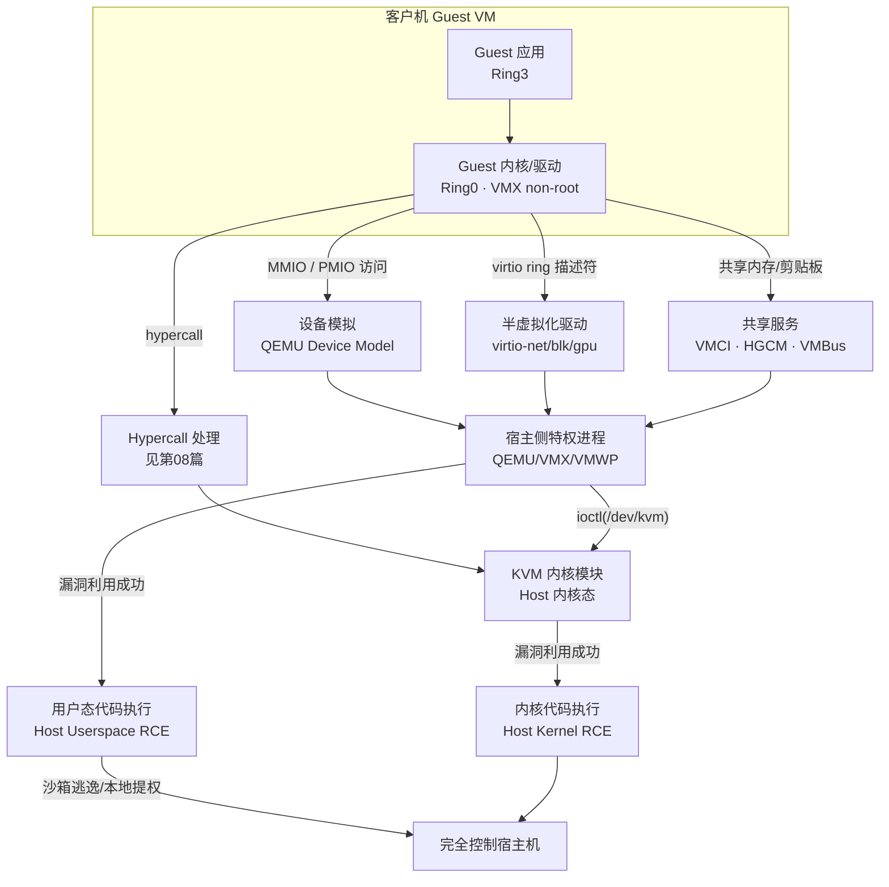
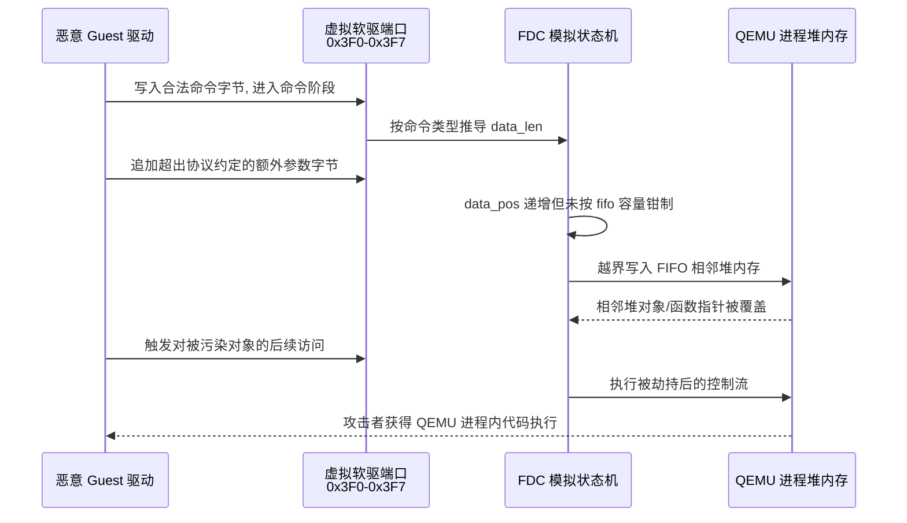
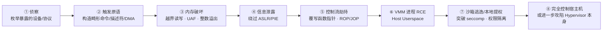
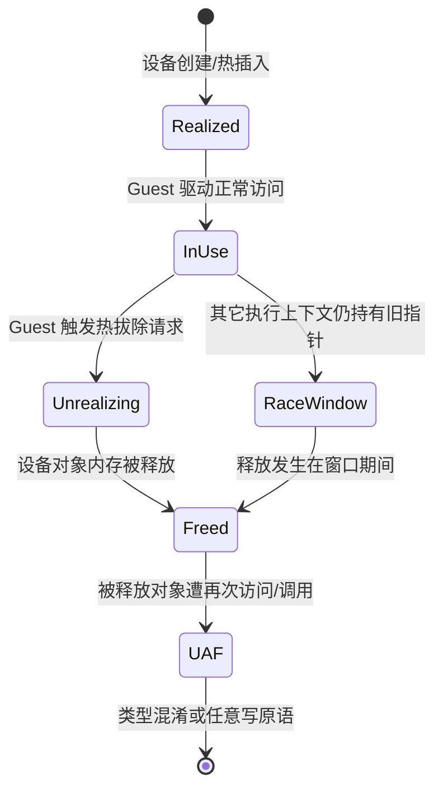
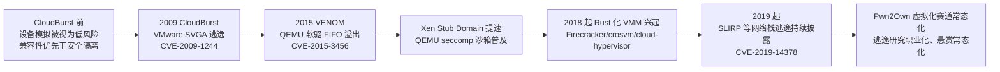

# 虚拟化与TEE机密计算（9）· 虚拟机逃逸原理与案例
> [!abstract] TL;DR
> - VM 逃逸的本质是击穿"guest ring0 也是笼中之物"这一假设：guest 内核态权限被 VMCS/VMCB 的执行控制位精确圈定在 non-root/guest 模式内，逃逸打穿的是 non-root/root 这道边界，而非 guest 自身的 ring0/ring3。
> - 设备模拟是逃逸利用链里出现频率最高的入口：软驱、网卡、显卡、USB 控制器等遗留/复杂设备用 C/C++ 实现且历史上默认开放，VENOM(CVE-2015-3456)与 CloudBurst(CVE-2009-1244)分别在 QEMU 与 VMware 生态验证了同一种漏洞模式跨厂商复现。
> - 完整逃逸利用链可归纳为侦察、触发原语、内存破坏、信息泄露、控制流劫持、VMM 进程 RCE、沙箱逃逸/本地提权、完全控制宿主机八步；QEMU 用户态 RCE 与 KVM 内核态 RCE 是严重程度截然不同的两种终态。
> - KVM/Xen/VMware/Hyper-V 四种架构的攻击面纵深不同：QEMU 逃逸止步于用户态进程、Xen 用 stub domain 把 QEMU 进一步降权隔离、VMware 的 VMX 运行在 UserWorld 沙箱、Hyper-V 从设计上把 VMWP 排除在 hypervisor 信任基之外。
> - 防御主线是"缩小攻击面 + 权限隔离 + 内存安全重写"三条并行路径：禁用非必要遗留设备、seccomp/sVirt 强制访问控制、以及 Firecracker/crosvm/cloud-hypervisor 代表的 Rust 化极简设备模型。
> - 本篇仅做原理与已公开案例的教育性剖析，不提供可直接武器化的利用代码；一切复现实验须限定在自建或已获授权的隔离靶场内进行。

## 概述与定位

虚拟机逃逸（VM Escape）指客户机（guest）内部的攻击者——哪怕已经拿到 guest 内核态（ring0/CPL0）的完全控制权——突破 hypervisor 或其协作组件划定的隔离边界，在宿主机（host）上获得代码执行能力的一类攻击。这里必须先纠正一个直觉误区：guest 内核态权限和"逃出笼子"是两件完全不同的事。guest 里的 ring0 只是 VMX non-root 模式（或 AMD 的 guest 模式）里的 ring0，它能为所欲为的范围被 VMCS/VMCB 的执行控制位精确圈定——凡是配置为"陷出"的操作，无论 guest 内核多么"高权限"都会先摔回 host。真正的边界不是 ring0/ring3，而是 non-root/root、guest 模式/host 模式；逃逸要打穿的正是这后一道边界，让代码执行权从"non-root 里的 ring0"跳到"root 模式里的宿主进程甚至宿主内核"。

本篇是这个系列前八章硬件与软件机制积累后的第一次"转换视角"：[[02.CPU虚拟化：VT-x与AMD-V]]讲清了根/非根模式与 VMCS 结构，[[03.内存虚拟化：EPT与NPT与影子页表]]讲清了二级地址翻译，[[04.IO虚拟化与设备直通VT-d]]讲清了模拟/半虚拟化/直通三种 IO 路径，[[05.Hypervisor架构：Type1与Type2]]讲清了不同厂商如何切分特权层，[[06.KVM与QEMU协作原理]]讲清了内核态 KVM 与用户态 QEMU 如何分工，[[08.VMExit与超级调用hypercall]]讲清了 guest→hypervisor 的每一次陷入如何被捕获与分派。这些章节共同的立场是"设计者视角"——机制为什么这样搭，怎样又快又对地实现隔离。本篇换成"攻击者视角"：同一套机制，一旦某个环节的实现有内存安全缺陷，隔离边界就会从单向的墙变成双向的门。

需要划清三条边界，避免与相邻主题混淆。其一，虚拟机逃逸不是容器逃逸：容器共享宿主内核，逃逸往往利用 namespace/cgroup 隔离不彻底或内核本身的漏洞；虚拟机有独立内核与硬件辅助的隔离层，逃逸必须打穿 hypervisor 或其设备模拟代码，天然门槛更高、但一旦成功危害面也更大（可影响同宿主上的所有租户）。其二，虚拟机逃逸不是"guest 内部提权"：从 guest 的 ring3 打到 guest 的 ring0 是纯 guest 操作系统的漏洞利用，不涉及虚拟化边界，虽然它常常是逃逸链的前置步骤（先拿到 guest 内核态，才有资格直接摆弄设备寄存器）。其三，虚拟机逃逸也不等于[[04.IO虚拟化与设备直通VT-d]]里讨论的直通设备 DMA 攻击——后者是攻击者已控制一块直通给 guest 的真实硬件、利用 IOMMU/VT-d 配置疏漏直接 DMA 进宿主内存，属于硬件层面的信任问题；本篇聚焦的是纯软件层面的设备**模拟**（QEMU/VMX/VMWP 用软件模仿出的虚拟寄存器与虚拟协议）中的内存安全漏洞，两者攻击原理不同但常被放在同一份"虚拟化攻击面"清单里讨论，故须在此明确切割。

之所以把逃逸单独辟一整章，是因为它是虚拟化安全里信息密度最高、案例最丰富、也最贴近真实红队/漏洞研究工作的主题。云计算的多租户模型把"虚拟机之间互不可见"当作最基本的安全承诺——一旦这个承诺被打破，后果是同一物理宿主上其他客户的数据全部暴露在攻击者视野里，这也是为什么各大云厂商都为虚拟机逃逸单独设立了远高于普通漏洞的悬赏金额。下文将按"原理与机制"厘清攻击面全貌，再用一整节深挖设备模拟漏洞的模式分类与两条经典公开案例（VENOM、CloudBurst）复盘完整利用链，最后落到工具、实战与防御。

## 原理与机制

**信任边界模型：谁在跟谁说话。** 一台典型的宿主机上，信任关系从内到外分四层：guest 应用（ring3）信任 guest 内核（ring0）；guest 内核信任它看到的"硬件"——但这层硬件对纯模拟设备而言完全是假的，是 QEMU/VMX/VMWP 这类宿主侧进程用软件维护的一份状态机；这个宿主侧进程/组件本身运行在宿主操作系统的某个特权层上（Linux 用户态进程、或 ESXi 的 UserWorld、或 Windows 根分区用户态），它的行为受宿主内核/hypervisor 的进一步约束；最底层是真正裁决一切的 hypervisor 本身（KVM 模块+Linux 内核、Xen hypervisor、VMkernel、hvix64.exe）。逃逸链的每一级利用，本质都是让"下级"误信"上级"发来的数据无需校验，抑或利用下级自身实现里的内存安全缺陷让攻击者代码直接跑在下级的执行上下文里。这跟操作系统里"用户态欺骗内核态"的攻击模式同构，只是层数更多、每一层的可信来源都不一样。

**攻击面分类学。** 把所有可能被 guest 主动触达、又运行在更高信任层里的代码路径列全，大致可分六类：(1) 设备模拟——QEMU/VMX 等为兼容遗留操作系统而软件实现的完整寄存器级协议，如软驱控制器、网卡（e1000/rtl8139）、IDE/SCSI 控制器、VGA/Cirrus/QXL 显卡、USB 主机控制器、声卡，这是历史上出问题最多的一类，也是本篇第三节的重点；(2) 半虚拟化驱动——virtio 系列（net/blk/gpu/fs/vsock），协议比全模拟简单得多，但仍是 C/C++ 写的、仍要解析 guest 提供的描述符，一样能出内存破坏；(3) 共享内存与剪贴板/文件类服务——VMware 的 VMCI 与 HGCM（Shared Folders/拖放/剪贴板）、VirtualBox 的对应机制、Hyper-V 的 VMBus——这类服务通常运行在特权更高的宿主进程里、协议又偏复杂（要做序列化/反序列化），是 Pwn2Own 上的常客；(4) hypercall 处理——[[08.VMExit与超级调用hypercall]]里讲过 guest 能主动摇的这一整套 ABI，处理函数如果对参数（尤其是 GPA 与长度）校验不严，同样是入口；(5) 虚拟 GPU/3D 加速——SPICE/QXL、VMware SVGA-3D、Hyper-V RemoteFX vGPU，指令流/着色器解析逻辑极其复杂，历史漏洞密度也极高；(6) 嵌套/迁移/快照相关通道——热迁移时序列化的设备状态、嵌套虚拟化里 L1 对 L2 退出的二次处理（参见[[07.嵌套虚拟化]]），这类通道触发条件苛刻但一旦命中往往是同类里最严重的。六类里 (1)(2)(5) 都属于广义的"设备模拟"，是本篇标题里"设备模拟漏洞"覆盖的核心范围。

**为什么设备模拟是攻击面里最大的一块。** 三个原因叠加。第一是历史包袱：为了让任意年代的客户机操作系统都能装机即用，QEMU 这类模拟器必须精确复刻几十年前真实芯片的寄存器级行为（软驱控制器协议脱胎于 Intel 82078，声卡脱胎于 Sound Blaster 16），这些协议本身就充满历史遗留的状态机复杂度，早已不是"现代人会设计出来"的干净接口。第二是实现语言：QEMU、VMware 的核心组件、Hyper-V 的 VMWP 绝大部分用 C/C++ 写成，一次索引越界、一次整数溢出就是一次内存破坏，而设备模拟代码要频繁处理"guest 完全控制"的输入（命令字节、描述符、DMA 长度），天然是最容易被外部输入污染的代码路径。第三是权限落差：guest 里哪怕只是驱动程序（通过端口/MMIO 指令），也能直接和运行在宿主特权上下文里的模拟代码对话——这中间没有类似"系统调用参数校验"那样约定俗成、被反复审计过的关卡，很多设备模型的参数校验完全取决于最初移植/实现时是否想到了恶意输入这一情形。



**逃逸的两种终态：用户态 RCE 与内核态 RCE 严重程度不同。** 这是原理层面最容易被忽略、却极其关键的一点。在 KVM/QEMU 架构下，设备模拟运行在 QEMU 这个普通 Linux 用户态进程里，即便攻击者完全控制了它的执行流，拿到的也只是这个进程的权限——通常是专门建的低权限账户（如 `qemu`/`libvirt-qemu`），离"宿主机 root"还有至少一步本地提权或沙箱逃逸的距离。但如果漏洞出在 KVM 内核模块本身（`/dev/kvm` 的 ioctl 处理逻辑，或需要软件模拟指令语义的 x86 emulator），那攻击者一步到位拿到的就是宿主**内核态**代码执行——不需要额外提权，直接是最高权限。这也是为什么安全研究和厂商公告里，"QEMU 逃逸"和"KVM 逃逸"会被严格区分标注严重级别：前者通常还要连一个本地提权洞才能"打满"，后者天生就是满分。

**四家主流架构的权限分层差异，决定了各自的天然纵深。** KVM 把 hypervisor 核心逻辑收在 Linux 内核里、设备模拟甩给用户态 QEMU，天然形成一道纵深——QEMU 出事不直接等于内核出事。Xen 是裸金属 Type-1，设备模拟历史上放在 Dom0 用户态，VENOM 一类事件后 Xen 社区推动把 QEMU 进一步塞进一个叫 stub domain 的极简虚拟机（其本身也是一台被硬件隔离的 guest，只是专职做 IO 模拟），即使 QEMU 被攻破，攻击者拿到的也只是这个功能单一的 stub domain 的控制权，离 Xen hypervisor 本身还隔着一层硬件虚拟化边界。VMware ESXi 的 VMX 进程运行在 VMkernel 之上一个称为 UserWorld 的受限执行环境里，并叠加沙箱限制其可执行的操作。Hyper-V 的架构则从根上把这件事设计成"根分区用户态的 VMWP 进程压根不在 hypervisor 的信任基（TCB）里"——hvix64.exe 是一个刻意做得极小的独立可信层，VMWP 出问题在设计意图上应当止步于根分区，不直接波及 hypervisor。四家的共同思路是同一句话："让处理最复杂、最容易出错的设备模拟代码，运行在离真正的仲裁者尽量远的地方。"这条思路在下一节的具体案例里会反复印证。

## 设备模拟漏洞与逃逸利用链剖析

### 漏洞模式分类学：六种典型内存破坏原语

设备模拟代码里反复出现的内存破坏原语可以归纳为六类，理解这套分类比记住任何单个 CVE 编号都更有长期价值，因为新漏洞几乎总是这六类的变形重组。

一、**命令/协议状态机的缓冲区溢出**。很多遗留设备用一个固定大小的 FIFO 或寄存器组来收发命令字节与参数字节，设备模型内部维护"当前处于哪个阶段（phase）、还期望收多少字节"的状态。如果状态机对"phase 切换"和"应期望字节数"的推导存在遗漏分支——比如某个命令理论上不该出现、却被 guest 硬发送，或者合法命令后面跟了不属于协议规定的额外参数字节——覆盖检查就可能被绕过，写指针继续往缓冲区尾部之后推进，覆盖相邻的堆内存。VENOM 就是这一类的教科书案例，下文详细复盘。

二、**尺寸计算里的整数溢出/下溢**。设备模拟经常要根据 guest 提供的字段计算一次拷贝或一次分配的大小——虚拟磁盘的扇区数乘扇区大小、virtio 描述符链的总长度、DMA 传输的字节数。当这些字段直接来自 guest（本质是不可信输入）又参与乘法或加法时，如果没有对结果做上界检查，字段值很容易在乘积绕回后产生一个远小于实际需求的分配尺寸，随后的拷贝却按未溢出前的逻辑长度执行，形成经典的"小分配、大拷贝"越界写。

```
/* VIRTIO 规范定义的描述符结构(vring_desc), 每个字段均由 guest 填写:
   len/addr 参与"本次传输多大、拷到哪"的计算, 若设备模型对 len 的
   上界或对链式描述符(next)的总长度求和缺少校验, 即可能诱发第二类
   (整数溢出/尺寸计算错误)漏洞 */
struct vring_desc {
    uint64_t addr;   /* Guest 物理地址 (GPA)              */
    uint32_t len;    /* 本描述符覆盖的长度                 */
    uint16_t flags;  /* VRING_DESC_F_NEXT/WRITE/INDIRECT  */
    uint16_t next;   /* 链式下一描述符索引                 */
};
```

三、**释放后使用（Use-After-Free）**。设备的生命周期管理（热插拔、迁移、重置）与实际 IO 处理往往运行在不同的执行上下文——QEMU 的设备回调传统上受 BQL（Big QEMU Lock）保护以序列化访问，但引入 IOThread、多队列 virtio 等细粒度并发模型后，如果某条路径在持锁窗口之外仍缓存了指向设备对象的裸指针，guest 精心构造的热拔除时序就可能让"对象已释放、指针还在用"的窗口暴露出来，被利用为堆喷（heap spray）后的类型混淆或直接的任意写。

四、**越界读导致的信息泄露**。读设备的 MMIO/配置空间、或读一段本应被截断的数据缓冲区时，如果读取长度同样来自不可信输入且未做上界钳制，多读出来的字节会包含相邻堆内存里的指针或数据，这是攻破 ASLR/PIE、把"能写但不知道写哪"升级为"知道写哪里"的关键一步，往往和第一类漏洞配对使用。

五、**QOM 对象模型里的类型混淆**。QEMU 用 QOM（QEMU Object Model）模拟面向对象的设备继承体系，设备对象在不同抽象层级之间做类型转换（cast）依赖运行时类型标签；如果某条代码路径在类型标签校验前就完成了向下转型并调用了该类型特有的虚函数表，攻击者精心布局的"伪装成目标类型"的堆对象就能让程序调用一个完全不属于预期类的函数指针。

```
/* MemoryRegionOps 简化示意: QEMU 用一张函数指针表描述一段
   MMIO 区域的读写行为, opaque 通常指回具体设备对象。
   第五类(类型混淆)与第一/二类溢出常常在此处汇合——
   越界写只要能覆盖到某个设备对象内嵌的这张表, 就能把
   "读写MMIO"变成"跳转到任意地址" */
typedef struct MemoryRegionOps {
    uint64_t (*read)(void *opaque, uint64_t addr, unsigned size);
    void     (*write)(void *opaque, uint64_t addr,
                       uint64_t data, unsigned size);
    int endianness;
    /* ...校验/合法地址范围等字段省略... */
} MemoryRegionOps;
```

六、**DMA 目标地址校验缺失**。设备模拟"代表"guest 完成 DMA 时，理应严格校验目标地址落在 guest 自己的物理地址空间（GPA）范围内；如果校验遗漏或存在旁路（比如只校验了起始地址没校验加上长度后的结束地址），guest 就可能诱导模拟代码把数据写入本不该触达的宿主侧内存区域，这与硬件直通场景下 IOMMU/VT-d 配置缺陷导致的真实 DMA 攻击（属[[04.IO虚拟化与设备直通VT-d]]的范畴）是同一逻辑问题在软件模拟层的翻版。

### 案例一：VENOM——软驱FIFO溢出与CVE-2015-3456

2015 年 5 月由 CrowdStrike 研究员 Jason Geffner 披露的 VENOM（Virtualized Environment Neglected Operations Manipulation，CVE-2015-3456）是设备模拟类逃逸漏洞里流传最广的案例，原因不仅是漏洞本身的技巧性，更是它命中了"默认开启面"这个放大器——受影响的软驱控制器（Floppy Disk Controller，模拟自 Intel 82078，代码沿用自 Bochs 项目）在 QEMU 里长期作为默认设备存在，哪怕虚拟机配置里根本没有挂载任何软盘镜像，控制器本身的 IO 端口（0x3F0–0x3F7）依然对 guest 开放。这意味着漏洞的暴露面几乎等于"用了该版本 QEMU 代码的所有虚拟机"，而不是"专门配置了软驱的少数虚拟机"，这也是它 CVSS 评分极高的直接原因。

漏洞的核心机制是命令/数据 FIFO 的边界处理缺陷：控制器把命令字节与后续数据都收进同一块固定容量的 FIFO 缓冲区，写入位置由"当前命令预期消耗多少字节"驱动前进。QEMU 的实现在特定命令序列下——发送一个合法命令后，紧跟着写入超出该命令协议规定数量的额外数据字节——未能正确地把写入位置限制在 FIFO 实际容量之内，于是继续写入的字节越过数组边界，覆盖进程堆上与该 FIFO 缓冲区相邻的其它数据结构。以下是这类状态机的简化示意（非逐行还原源码，用于说明缺陷模式）：

```c
/* 简化示意: 软驱控制器命令/数据 FIFO 的状态机核心 */
typedef struct FDCtrl {
    uint8_t  fifo[FD_FIFO_SIZE];  /* 固定容量的命令/数据缓冲区   */
    uint32_t data_pos;            /* 当前写入偏移                */
    uint32_t data_len;            /* 由命令类型推导出的期望长度   */
    int      phase;               /* 命令阶段/执行阶段/结果阶段   */
} FDCtrl;

/* 缺陷模式: data_len 由命令首字节静态推导, 但部分命令分支在
 * 进入数据阶段后, 没有把 data_pos 相对 sizeof(fifo) 做硬性
 * 边界钳制——继续写入即可越过 fifo[] 尾部, 污染相邻堆内存 */
```



由于该软驱控制器代码最初源自 Bochs、被 QEMU 直接复用，凡是内部集成了这份代码的虚拟化平台都受到牵连：QEMU 自身、以 QEMU 作为设备模拟组件的 Xen（HVM 客户机经由 qemu-dm/stub domain）、KVM，以及独立实现但同样源自这份代码遗产的 VirtualBox 均在受影响之列；VMware 与 Microsoft Hyper-V 因软驱模拟是各自独立实现的代码，未受此漏洞影响——这本身就是"代码复用扩大了同一漏洞爆炸半径"的直接例证。攻击者一旦具备 guest 内核态权限（读写这几个 IO 端口本身需要 ring0/IOPL 权限，故这是逃逸链里典型的"前置条件"），即可按上述方式在宿主侧进程的堆上制造越界写，后续再配合堆喷布局与信息泄露原语，最终演变为宿主进程内的任意代码执行。修复方式是在 FIFO 写入路径上补齐针对 `data_pos` 相对缓冲区实际容量的边界校验。VENOM 之后，QEMU 与下游发行版加快了对遗留设备默认开启策略的收紧，也直接推动了 Xen 把 QEMU 移入 stub domain 的既有工作提速。

### 案例二：CloudBurst——VMware SVGA驱动与CVE-2009-1244

比 VENOM 更早、同样极具代表性的是 2009 年由 Immunity 的 Kostya Kortchinsky 在 CanSecWest/Black Hat 上公开的 CloudBurst（CVE-2009-1244）。它证明了设备模拟漏洞并非 QEMU 生态独有，闭源、独立实现的商业 hypervisor 在同一类攻击面上一样会犯同样性质的错误。目标是 VMware 系列产品（Workstation、ACE、Player 以及同期 ESX/ESXi 版本）里模拟的 SVGA-II 虚拟显卡驱动——该驱动负责解析 guest 显卡驱动发来的绘图相关请求。guest 一侧可以构造畸形的图形操作请求，触发宿主侧负责处理这些请求的进程（Workstation 上是 `vmware-vmx` 进程，即前文提到的 VMX 组件）内部的一处缓冲区溢出，从而在该进程的执行上下文里取得任意代码执行。

这个案例值得放在 VENOM 之后对照阅读，因为二者呈现出高度一致的结构模式，尽管代码库完全独立：都是"guest 通过合法但畸形的协议请求→触碰宿主侧模拟代码里一处边界检查缺失→在宿主特权进程的堆/栈上写出边界→劫持该进程的控制流"。这印证了本篇分类学里的判断——漏洞模式是跨厂商、跨代码库反复出现的通用现象，根源在于"设备模拟"这类任务本身的复杂度和历史包袱，而不是某一份具体代码写得特别差。CloudBurst 之后，VMware 持续加固了 VMX 进程的隔离（在后续 ESXi 版本里，VMX 运行于前文提到的 UserWorld 沙箱并叠加了更严格的权限限制），这条演进路线与 Xen 引入 stub domain、QEMU 加强 seccomp 沙箱是同一防御思路在不同产品线上的体现。

### 案例三：SLIRP、virtio 与 Pwn2Own 虚拟化赛道的常态化案例

除了两起标志性历史案例，设备模拟与相关网络栈的漏洞其实持续不断地被发现。QEMU 内置的用户态网络栈 SLIRP（`-netdev user` 模式下用于免配置 NAT 上网）在 2019 年披露过一处 IP 分片重组逻辑（`ip_reass`）里的堆越界访问（CVE-2019-14378），提醒我们攻击面不止于传统意义的"设备"，网络协议栈本身的重组/解析逻辑同样是不可信输入的重灾区。virtio 系列虽然协议远比全模拟设备简洁，但描述符链解析、队列长度校验等环节一样出现过需要打补丁的边界问题，说明"改用半虚拟化"能显著收窄攻击面、却不能把这类风险归零。

另一条重要的证据链来自 Pwn2Own 近些年设立的虚拟化/hypervisor 赛道。自该赛道常态化以来，来自不同团队的研究者反复通过 VMware Workstation/ESXi、Oracle VirtualBox、Microsoft Hyper-V 里的 USB 主机控制器、网卡模拟、共享剪贴板/文件夹服务（如 VirtualBox 的 HGCM）、以及虚拟 3D 加速管线找到可用的逃逸链，并获得该赛道通常远高于普通浏览器/内核类别的悬赏金额——这个金额本身就是产业界对这类漏洞现实危害的定价。持续多年的比赛结果传递出一个稳定信号：只要设备模拟这类复杂状态机代码存在，新的漏洞就会持续被发现，防御的重心不能只押注在"修完已知 CVE"，更要放在下一节要讲的架构性缓解（缩小面、强隔离、内存安全重写）上。

### 逃逸利用链八步法：从侦察到完全控制

把前面的漏洞模式串成一条完整的、可复现的攻击链，大致要走过八个阶段，这套流程既是攻击者的方法论，也是防御者排查"某个漏洞到底能不能被打穿"时应该逐环检验的清单。



第一步侦察决定了整条链的可行性上限：攻击者需要弄清目标虚拟机的具体配置（机器类型、`-device` 参数）暴露了哪些设备模型，QEMU 开源这一事实在这里成为攻击者的天然优势——源码、提交历史、issue 追踪器一应俱全，甚至可以对比某个安全补丁提交前后的差异直接定位漏洞根因（即所谓 n-day 补丁差异分析）；而 VMware、Hyper-V 这类闭源实现则需要依赖逆向。第二步要把协议层面的"畸形但合法"输入转化成确定可控的内存破坏触发条件，通常需要在 guest 里写一个自定义内核驱动直接操纵目标设备的端口/MMIO/描述符，绕开操作系统自带驱动的正常协议约束。第三步的内存破坏本身往往只给出一个"有限原语"（比如只能越界写固定几字节、只能在特定尺寸的堆块之后写），第四步的信息泄露与第五步的控制流劫持之间常常互相依赖——没有泄露出的地址就无法构造精确的 ROP 链，而有些泄露原语本身又要先用一次小规模的控制流原语才能触发，两者在实战中经常交替进行、反复打磨。第六步拿到的 RCE 运行在 VMM 进程（QEMU/VMX/VMWP）的上下文里，第七步是否还需要额外一次本地提权，完全取决于该进程当前的权限模型——是否已启用 seccomp-bpf 系统调用过滤、是否运行在专门的低权限账户下、是否被 SELinux/AppArmor 的强制访问控制策略进一步约束。第八步是否能进一步击穿 hypervisor 本身，则取决于前文提到的架构差异：在 KVM 场景下，即便拿到了 QEMU 的完整 RCE，要更进一步拿到宿主内核态权限，仍需要单独一个 KVM 内核态漏洞（往往通过 `/dev/kvm` 的 ioctl 接口，比如某些需要软件模拟指令语义的边缘路径）——这正是为什么"QEMU 逃逸"和"KVM 逃逸"在披露公告里会被清晰区分成两种不同严重度的原因，也是本节要强调的核心结论之一。

**释放后使用类漏洞的时序本质。** 第三类漏洞（UAF）值得单独用状态机说明，因为它的可利用性完全建立在"竞争窗口"这个时间维度上，而非单纯的边界计算错误：



这张状态机揭示的关键点是：`InUse` 到 `RaceWindow` 这条分支只有在细粒度并发模型（多 IOThread、多队列）下才会出现——传统单 BQL 模型把整个设备生命周期串行化，天然不存在这条分支，这也是为什么很多 UAF 类逃逸漏洞是伴随着虚拟化平台为提升 IO 性能而引入更细粒度锁模型才浮现出来的：性能优化与攻击面之间的这类此消彼长，在虚拟化系统设计里反复出现，不独见于设备模拟。

### 平台架构对利用链长度的影响

前文已从原理层面说明了 KVM/Xen/VMware/Hyper-V 四种权限分层的差异，这里用一张图把"拿到设备模拟代码执行"到"完全控制宿主/hypervisor"之间还要跨越几层显式画出来，便于横向比较：

```mermaid
flowchart TD
    subgraph KVMSTACK["KVM / QEMU"]
        K1["Guest"] --> K2["QEMU 用户态进程<br/>设备模拟"]
        K2 -->|"ioctl"| K3["KVM 内核模块"]
        K3 --> K4["Linux Host 内核"]
    end
    subgraph XENSTACK["Xen"]
        X1["Guest HVM"] --> X2["QEMU<br/>Stub Domain 或 Dom0 用户态"]
        X2 -->|"hypercall"| X3["Xen Hypervisor<br/>裸金属 Type-1"]
    end
    subgraph VMWSTACK["VMware ESXi"]
        V1["Guest"] --> V2["VMX 进程<br/>UserWorld 沙箱"]
        V2 --> V3["VMkernel"]
    end
    subgraph HVSTACK["Hyper-V"]
        H1["Guest 子分区"] --> H2["VMWP 进程<br/>根分区用户态"]
        H2 -->|"VMBus / Hypercall"| H3["hvix64.exe<br/>Hypervisor 核心"]
    end
```



四条路径的"纵深级数"并不相等：KVM 一侧，QEMU 到 KVM 内核模块之间隔着一次 ioctl 边界，这次调用本身就是一道天然关卡（KVM 对每个 ioctl 命令都有独立的参数校验路径）；Xen 一侧，若 QEMU 跑在 stub domain 里，攻击者拿到的其实是另一台被硬件虚拟化边界隔开的迷你虚拟机，离 Xen hypervisor 本身还差着一整层 VT-x/AMD-V 的保护；VMware 与 Hyper-V 则分别用 UserWorld 沙箱和"VMWP 天生不在 TCB 内"的设计原则给出了纵深。共同规律是：**纵深的本质是在"最容易出漏洞的代码"和"最不能出问题的代码"之间人为插入尽可能多道独立的信任检查点**，每一道关卡未必能挡住所有攻击，但会实实在在地拉长利用链的步数、抬高研究门槛、缩小可用漏洞的交集——这也是下一节防御视角要展开的核心逻辑。

**从案例演进看防御范式的迁移。** 把几起关键事件按时间顺序串起来，能看到一条清晰的"缩小攻击面"演进线索：



这条演进线的内在逻辑是：每一次公开的重大逃逸案例，都直接催化了下一阶段的架构级缓解措施——CloudBurst 让业界正视"设备模拟代码需要被当作不可信输入处理"，VENOM 让"默认开启的遗留设备"这一隐藏攻击面被系统性收紧并加速了权限隔离架构（stub domain）的落地，而近几年 Rust 化极简 VMM 的兴起则是对"干脆从语言层面消灭内存安全问题"这条思路的产业级押注。理解这条演进脉络，比孤立记住某一个 CVE 编号更有实战价值——它告诉我们下一代虚拟化平台的攻击面会长成什么样子。

## 工具视角与实战

**源码级差异分析（n-day patch diffing）。** QEMU、KVM、Xen 均为开源项目，安全公告发布前后的提交历史是研究该漏洞的第一手材料：用 `git log`/`git blame` 定位到修复补丁本身，再用 `git diff` 对比补丁前后版本，往往能直接看清漏洞成因，这是研究已披露 CVE 最高效的路径，也是历史上不少"n-day 秒变 0-day"事件的方法论基础——很多用户升级不及时，公开补丁反而成了现成的漏洞情报。对闭源的 VMware VMX、Hyper-V VMWP，则要退回传统二进制静态分析（IDA Pro/Ghidra/Binary Ninja 做函数级别的比对与特征提取）与动态调试结合的路子。

**QEMU 进程可以直接用宿主侧 gdb 调试，这是相对真实硬件 hypervisor 研究的一大优势。** 因为 QEMU 本身就是宿主机上一个普通的用户态进程，`gdb -p $(pidof qemu-system-x86_64)` 或直接以 gdb 启动即可下断点、看寄存器、查看堆布局，配合 `-monitor stdio`/QMP（QEMU Machine Protocol）接口从另一条通道查询设备状态机的内部字段，能把"guest 侧发送了什么"和"宿主侧内存发生了什么"两条时间线对齐分析。更进一步，QEMU 自带确定性的记录回放（record/replay，`-icount` 相关选项）能力，第一次复现出的崩溃可以被精确重放，省去传统模糊测试里"崩溃难以稳定复现"的痛点。研究双向联动的场景（guest 内核态与宿主 QEMU 进程同时调试）通常需要 guest 一侧同步接入调试通道——Windows guest 走 WinDbg 经串口/网络内核调试，Linux guest 走 `kgdb`——与宿主侧 gdb 协同观察数据如何跨越这条信任边界。

**AddressSanitizer（ASan）与模糊测试是发现新漏洞的主力手段。** 用 ASan 编译的 QEMU 版本能在越界读写发生的第一时间精确定位并附带调用栈，极大降低了对第一类、第二类内存破坏原语的分析成本；这类构建也是 OSS-Fuzz 等持续模糊测试基础设施长期对 QEMU 跑覆盖率制导模糊测试的标准配置。QEMU 项目自身在较新版本里内置了基于 libFuzzer 思路、复用 qtest 框架直接对设备模型输入通道做模糊测试的官方 fuzzer（`qemu-fuzz`），可以脱离完整的 guest 启动流程、直接对某个设备的 MMIO/PMIO/DMA 接口喂入随机化数据，是目前挖掘新设备模拟漏洞最主流的自动化手段。学术界还产出过一批更进一步的方案：针对整个虚拟机快照做变异重放的基于快照的模糊测试、针对硬件辅助虚拟化本身做灰盒模糊测试的方案，思路都是尽量在不启动完整 guest OS 的前提下把"喂输入→跑一次目标代码→看有没有崩溃"这个循环做得尽可能快。

**内核态攻击面要用另一套工具。** `/dev/kvm` 暴露的 ioctl 接口本身也是可以被独立模糊测试的目标，syzkaller 这类内核语法感知的模糊测试框架配有针对 KVM ioctl 的描述文件，能专门探测 KVM 内核模块自身（而非 QEMU 用户态设备模拟）的漏洞——回顾前文的严重度区分，这条路径挖到的漏洞价值天然更高。

**实战与研究规范。** 真正复现一个历史 CVE，建议在隔离的实验环境（本地虚拟机、容器或专用靶机，且不联外网）里拉取存在漏洞的历史版本源码单独编译、对照公开补丁做差异定位，而不是尝试对任何联网或生产环境的虚拟化基础设施做验证性攻击。Pwn2Own 等赛事赛后公开的复盘分析（部分获奖团队会在博客/会议演讲中公开细节）是学习"完整利用链如何一步步拼接"的优质公开材料，适合按本篇的八步模型逐段对照阅读。

## 安全性与正确使用

> [!caution] 合规边界
> 本节及全文对漏洞模式、历史 CVE 与利用链结构的剖析，目的是帮助读者理解攻击面从而更好地防御，**仅适用于自建/已获授权的隔离实验环境、CTF 靶场与合法安全研究场景**。不得将本文内容用于攻击任何真实生产系统、他人虚拟化基础设施或未获授权的云租户环境；不提供、也不应被解读为提供可直接对现实目标使用的武器化利用代码或完整 exploit；不得用于绕过任何商业软件的授权或许可限制。云厂商的漏洞赏金计划通常明确划定了安全港（safe harbor）范围，任何研究都应在对应计划授权范围内进行，超出范围的未授权访问在多数司法辖区属于违法行为。

**缩小攻击面是成本最低、收益最直接的第一道防线。** 既然前文反复论证遗留设备模拟代码是问题的主要来源，最直接的对策就是不给攻击者机会接触它们：显式禁用软驱、并口、不必要的 USB 控制器与声卡，选择尽量精简的机器类型，QEMU 的 `-nodefaults` 参数可以整体关闭一批"为了兼容性而默认开启"的设备；能用半虚拟化（virtio 系列）替代全模拟设备的场景应当优先选择——协议更简单、代码路径更短，虽不能把风险归零，但显著收窄了可攻击面的绝对面积。这条思路的极致体现是 AWS Firecracker：它只实现 virtio-net/virtio-block/virtio-vsock、串口与键盘这几种最小必需设备，不带 BIOS、不模拟任何遗留硬件，用 Rust 编写从语言层面消除整类内存安全问题，专为多租户高密度场景（如 Lambda、Fargate 的函数计算场景）设计，是"攻击面即产品设计目标"这一理念的代表作；同源思路的 Google crosvm、Intel 主导的 cloud-hypervisor 均属于 rust-vmm 生态下的同类实践。

**权限隔离与沙箱是攻击面无法收敛到零时的第二道防线。** QEMU 自带的 seccomp-bpf 系统调用过滤（`--sandbox on`）能把即便已经拿到代码执行的攻击者可用的系统调用集合压缩到最小必需集；配合专用低权限账户运行（绝不用 root 启动 QEMU 进程）、Linux 命名空间/cgroup 限制资源与可见性、libvirt 的 sVirt 机制（基于 SELinux/AppArmor 对每个虚拟机进程施加强制访问控制标签，使不同虚拟机的 QEMU 进程之间也互相隔离）共同构成纵深防御。前文反复出现的架构级思路——Xen 的 stub domain/驱动域拆分、VMware 的 UserWorld 沙箱——本质上都是同一原则在不同产品线上的具体化：把最容易出问题的代码放进一个即便被攻破、影响半径也被硬性限制住的容器里。

**内存安全语言重写是最根本、也是当前产业界正在押注的长期解法。** 与其不断给 C/C++ 实现的设备模型打补丁，不如从源头切换到内存安全的实现语言——rust-vmm 项目群（提供 `kvm-ioctls`、virtio 相关 crate 等可复用组件）、基于它构建的 Firecracker 与 cloud-hypervisor、以及 Google 的 crosvm，都是这一方向的具体产品化成果。这不是说 Rust 实现就绝对没有漏洞（逻辑漏洞、`unsafe` 块内的问题依然可能存在），而是从统计意义上消灭了本篇归纳的六类原语里至少一半以上直接由内存不安全语言引发的问题类别（缓冲区溢出、UAF、类型混淆的很大一部分）。

**补丁管理与检测同样不可缺位。** 及时跟进 QEMU 安全公告、Xen 的 XSA（Xen Security Advisory）通报、以及各大发行版的虚拟化组件更新，是抵御 n-day 攻击最基本的动作——本篇反复强调开源代码的补丁差异对攻击者是免费情报，对防御者同样是免费预警。检测侧建议对宿主机上的 QEMU/VMX 一类进程做异常行为监控：正常运行的设备模拟进程极少会主动 fork/exec 出子进程或发起非预期的网络连接，一旦观测到此类行为，是虚拟机逃逸成功后横向动作的强主机侧指标，值得纳入 EDR/主机入侵检测的规则库。直通场景下还需确保 IOMMU/VT-d 开启中断重映射与严格的 DMA 重映射模式，防止真实硬件层面的直通 DMA 攻击与本文讨论的软件模拟层漏洞叠加扩大风险面。

## 小结

虚拟机逃逸打穿的不是 guest 的 ring0/ring3 边界，而是 VMX/SVM 的 non-root/root 边界——设备模拟是这道边界上暴露面最大、历史包袱最重、内存安全问题最集中的入口，VENOM（CVE-2015-3456）与 CloudBurst（CVE-2009-1244）分别在开源与闭源两大生态里证明了这一点，二者呈现出高度一致的"协议畸形输入→边界检查缺失→宿主特权进程内代码执行"结构。完整的逃逸利用链可归纳为侦察、触发原语、内存破坏、信息泄露、控制流劫持、VMM 进程 RCE、沙箱逃逸/本地提权、完全控制宿主机（或进一步攻陷 hypervisor 本身）这八步，QEMU 用户态 RCE 与 KVM/hypervisor 内核态 RCE 是两种危害程度截然不同的终态，这个区分贯穿了本篇对 KVM/Xen/VMware/Hyper-V 四种架构攻击面纵深的横向比较。防御的主线沿着"缩小攻击面—权限隔离—内存安全重写"三条并行路径展开，Firecracker/crosvm/cloud-hypervisor 代表的 Rust 化极简 VMM 是这条演进线当前最前沿的产业实践。掌握本篇的分类学与利用链模型，既是理解虚拟化安全历史案例的钥匙，也是评估任何新披露 CVE 危害程度的通用框架。

## 相关阅读

- 系列前置：[[04.IO虚拟化与设备直通VT-d]]（模拟/半虚拟化/直通三种 IO 路径的全貌）、[[05.Hypervisor架构：Type1与Type2]]（不同厂商的特权层切分方式）、[[06.KVM与QEMU协作原理]]（内核态与用户态的分工边界）、[[08.VMExit与超级调用hypercall]]（本篇利用的陷入与 hypercall 通道本身）、[[07.嵌套虚拟化]]（嵌套场景下的退出反射与额外攻击面）。
- 系列后续：[[10.可信执行环境TEE全景]]（TEE 从根本上反转"guest 信任 host"的假设，是对本篇攻击面的另一种回应）。
- 内核与固件呼应：[[38.Windows内核与驱动逆向/25.HyperV架构与VBS]]（Hyper-V 侧的信任基与 VBS/VSM 隔离设计）、[[38.Windows内核与驱动逆向/29.CI.dll与代码完整性WDAC]]、[[39.固件与IoT嵌入式逆向/21.安全启动链绕过技术]]（度量启动链与本篇讨论的运行时逃逸互为补充的两类信任问题）。
- 硬件与内存背景：[[21.Asm/40 虚拟化扩展对比]]（VMX/SVM 指令与结构对比）、[[24.内存管理与堆分配器/02.进程地址空间与虚拟内存]]（堆布局与地址空间基础，是理解本篇内存破坏原语的前置知识）。
- 权威资料：CVE-2015-3456（VENOM）官方公告与 QEMU `hw/block/fdc.c` 修复提交、CVE-2009-1244（CloudBurst）及 Kostya Kortchinsky 公开的分析材料、CVE-2019-14378（QEMU SLIRP）公告、Xen Security Advisories（XSA）索引、QEMU 官方安全流程文档（`docs/devel/security.rst`）、rust-vmm 项目文档与 AWS Firecracker 设计文档、Pwn2Own 历年虚拟化赛道结果公告。

[[00.虚拟化与TEE机密计算总览|⬆ 系列总览]] | [[08.VMExit与超级调用hypercall|← 上一章]] | [[10.可信执行环境TEE全景|→ 下一章]]
