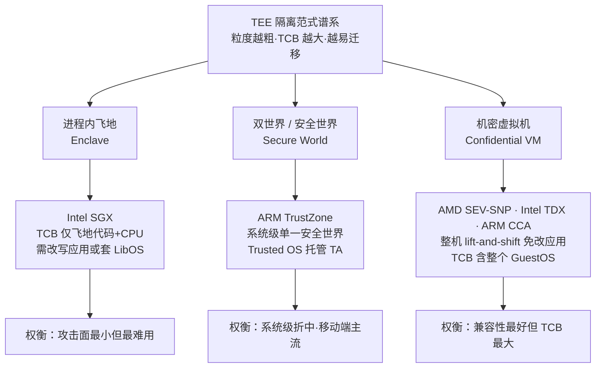
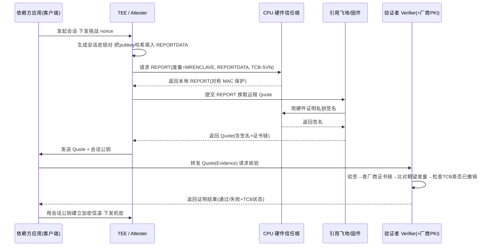
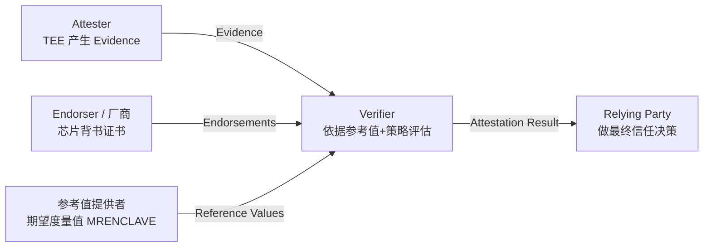
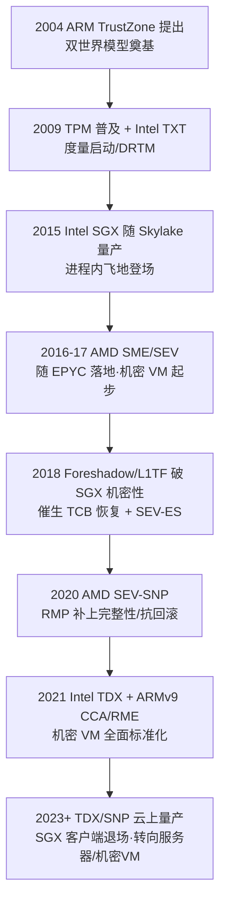

# 虚拟化与TEE机密计算（10）· 可信执行环境TEE全景

> [!abstract] TL;DR
> - TEE 用硬件把「运行中的数据（data-in-use）」从特权软件手里保护起来：它把经典环模型倒置——内核、Hypervisor、SMM、固件统统划入不可信集合，只有 CPU 硅片与飞地/机密 VM 内的代码留在 TCB 内。
> - 隔离粒度是理解全景的主轴，三种范式沿「TCB 大小 ↔ 兼容性」权衡展开：进程内飞地（SGX，TCB 最小但要改写应用）、双世界（TrustZone，系统级安全世界）、机密虚拟机（SEV-SNP/TDX/CCA，整机 lift-and-shift 但把 GuestOS 纳入 TCB）。
> - 威胁模型决定一切：TEE 默认防「拥有 root/ring0/ring-1 的软件对手」与部分物理对手（总线嗅探靠内存加密），但**默认不防侧信道、不防拒绝服务**；「内存加密 ≠ 内存完整性」正是 SEV 早期版本被攻破的根因。
> - 远程证明是 TEE 可信的落点：度量值（回答"跑的是什么"）+ 硬件证明密钥签名（回答"是不是真硅片、补丁打没打"）+ 厂商 PKI，构成一条从 CPU 熔丝到依赖方的信任链；RFC 9334（RATS）把角色标准化为 Attester / Verifier / Relying Party。
> - 证明只证明「启动了哪段代码」，不证明「这段代码没漏洞」：Iago 攻击、边界输入校验、TCB 版本新鲜度、回滚保护、密钥绑定，才是把证明结果转成真实安全的工程纪律。
> - 本篇是全景与坐标系，SGX / TrustZone / SEV / TPM 的架构细节与飞地逆向分别在第 11–15 篇展开。

## 概述与定位

**可信执行环境（Trusted Execution Environment, TEE）是一块由处理器硬件强制隔离的执行环境，它为其中运行的代码与数据提供机密性（confidentiality）与完整性（integrity），且这种保护对系统里最高特权的软件——操作系统内核、Hypervisor、SMM、乃至 BIOS/固件——同样成立。** GlobalPlatform 的经典定义强调「与主 OS 并存但隔离，抵御一般软件攻击」；机密计算联盟（Confidential Computing Consortium, CCC）给出的更精炼：机密计算是「在基于硬件的、可被证明的 TEE 中执行计算，从而保护使用中的数据」。两句话点出两个关键词：**硬件强制**与**可被证明**——前者是隔离，后者是远程证明，二者缺一不可。

要理解 TEE 为什么必要，先看数据保护的三态：静止数据（data-at-rest）有全盘加密、传输数据（data-in-transit）有 TLS，唯独**使用中的数据**——一旦被解密进内存、进寄存器参与计算——就完全暴露在运行它的那台机器的特权软件面前。云计算把这道缺口放大到极致：你的明文数据、密钥、模型权重，都要在别人的物理机、别人的 Hypervisor 之下跑。TEE 就是为封堵「data-in-use」这道缺口而生的硬件机制，机密计算则是它在云上的产业化名字。

**在本虚拟化系列里，TEE 章节标志着视角的一次根本反转。** 前九篇（VT-x、EPT、VT-d、Hypervisor、KVM/QEMU、嵌套、VMExit、逃逸）都站在 Hypervisor 一侧：Hypervisor 是可信的仲裁者，Guest 是被管理、被防范逃逸的对象（见 [[09.虚拟机逃逸原理与案例|上一章]]）。到了 TEE，剧本被撕掉重写——**Hypervisor 与宿主内核变成了头号假想敌**，而被保护的恰恰是 Guest（或 Guest 里的一小块飞地）。经典的 ring0 > ring3、ring-1 > ring0 的信任偏序被打破：在 TEE 的世界里，ring3 里的一个飞地可以不信任它脚下的 ring0，一个机密 VM 可以不信任它脚下的 ring-1。谁拥有更高特权，谁反而被排除在信任边界之外。这个「特权倒置」是读懂后续所有机制的总钥匙。

围绕这把钥匙，全篇回答三个问题，也正是本篇的三条主线：**隔离模型**（拿什么当被保护单元、硬件靠什么把它围起来）、**威胁模型**（防谁、不防谁、CIA 哪几项）、**远程证明**（远端凭什么相信你真的在一个货真价实、补丁齐全的 TEE 里跑着预期的代码）。

**边界声明**：本篇是「全景 / 坐标系」，只搭骨架、给对比、讲共性原理与协议范式。具体到 Intel SGX 的 EPC/EENTER/EGETKEY 指令语义在 [[11.Intel-SGX架构与Enclave|第 11 篇]]；ARM 安全世界与 SMC/EL3 在 [[12.ARM-TrustZone与安全世界|第 12 篇]]；AMD SEV/SEV-SNP 的机密 VM 与 RMP 在 [[13.AMD-SEV与机密虚拟机|第 13 篇]]；TPM 与度量启动（静态/动态信任根）在 [[14.TPM与度量启动|第 14 篇]]；飞地逆向与侧信道攻击在 [[15.Enclave逆向与侧信道攻击|第 15 篇]]。凡属这些专篇的细节，此处点到为止、只做定位。

## 原理与机制

### 硬件信任根：一切信任的锚点

TEE 的信任不是凭空长出来的，它必须锚定在一个**软件无法伪造、无法读取的硬件秘密**上——信任根（Root of Trust, RoT）。典型实现是厂商在流片时烧进芯片的一次性熔丝（fuse）里的一组器件级根密钥，配合片上不可导出的密钥派生逻辑。由它派生出：加密内存用的临时密钥、签署证明报告用的证明密钥、封印数据用的封印密钥。信任根之上叠加**安全启动 / 度量启动**（度量启动细节见 [[14.TPM与度量启动|第 14 篇]]），保证 TEE 的固件本身没被篡改。远程证明的整条证书链，最终都收敛到「厂商为这颗真实芯片背书」这一点上——这也是为什么 TEE 的信任本质上是**对硅片制造商的信任**（信 Intel/AMD/ARM/Apple），一个必须清醒承认的前提。

### 三种隔离范式：沿「TCB 大小 ↔ 兼容性」的谱系

理解 TEE 全景，最有用的一根轴是**被保护单元的粒度**，它直接决定可信计算基（TCB）的大小与编程代价。三种主流范式：



**范式一·进程内飞地（Enclave）。** 代表是 Intel SGX。它在一个普通用户态进程内部划出一块加密内存区（SGX 里叫 EPC，Enclave Page Cache），只有飞地内的代码能访问这块内存的明文；CPU 之外的一切——包括同进程的其它代码、内核、Hypervisor、乃至拿探针接总线的物理攻击者——看到的都是密文。TCB 被压到极致：只剩飞地那几千行代码加 CPU 本身。代价也最重：飞地里不能直接执行系统调用（要「出飞地」由不可信 OS 代劳），早期 EPC 只有约 128 MB 保留空间（可用约 93 MB），应用要么按 SDK 重写、要么套一层 LibOS（Gramine/Occlum）把 Linux 系统调用在飞地内模拟出来。**攻击面最小，但最难编程。**

**范式二·双世界（Secure World）。** 代表是 ARM TrustZone。CPU 被劈成「安全世界」与「普通世界」两套并行状态，由总线上一根 NS（Non-Secure）位贯穿传播，安全世界的内存/外设普通世界碰都碰不到；世界切换由运行在最高特权 EL3 的安全监视器（Secure Monitor）经 SMC（Secure Monitor Call）指令仲裁。安全世界里跑一个精简的可信 OS（OP-TEE、高通 QSEE、Trusty、Kinibi），托管指纹、DRM、支付等可信应用（TA）。粒度是**系统级、单一**的——全机就一个安全世界，而非每进程一个。它是手机 SoC 的事实标准。

**范式三·机密虚拟机（Confidential VM）。** 代表是 AMD SEV/SEV-ES/SEV-SNP、Intel TDX、ARM CCA（Realm）。被保护单元直接是**整台 Guest VM**：每台机密 VM 用一把 Hypervisor 拿不到的密钥加密自己的内存，Hypervisor 仍负责调度与资源管理，却读不到 VM 的明文、也（在带完整性的版本里）改不动。好处是**免改应用**——现有虚拟机原封不动搬上去（lift-and-shift）；代价是 TCB 膨胀到把整个 Guest 内核、初始化固件（如 OVMF）都算进来。这是云上机密计算的主战场。

还有一根正交的轴值得单列：**集成式 vs 协处理器式**。上面三种都把 TEE 做进主 CPU 的执行流；另一路是把可信环境放到一颗物理隔离的独立协处理器上——Apple 的 Secure Enclave Processor（SEP，自带 sepOS）、TPM 分立芯片、Google Titan、微软 Pluton。协处理器式隔离更彻底（连主 CPU 的推测执行漏洞都波及不到它），但吞吐低、只适合护密钥与做证明，不适合跑通用负载。

### 威胁模型：防谁、不防谁

TEE 的**定义性假设**是：**特权软件是恶意的或已被攻陷。** 把典型对手能力摆成一张梯子，越往上特权越高，而 TEE 恰恰要把梯子顶端排除出信任边界：

```
对手能力梯子（TEE 通常纳入防护的层级 = 打 ✓ 者被排除出 TCB）
  物理探针 / 冷启动 / 总线嗅探  ← 内存加密防（SGX ✓ / SEV ✓ / TDX ✓ / CCA ✓）
  恶意 SMM (ring -2)            ← 部分防（TDX/SNP 对 SMM 有约束）
  恶意 Hypervisor (ring -1)     ← ✓ 核心目标（SGX / SEV / TDX / CCA 全防）
  恶意 OS 内核 (ring 0)         ← ✓ 核心目标（全部 TEE 都防）
  同进程其它代码 (ring 3)       ← ✓（SGX 飞地防）
  --- 信任边界 ---
  飞地/机密VM 内的代码           ← 在 TCB 内（不防它自身的漏洞）
  CPU 硅片 + 微码 + 安全处理器固件 ← 信任根（必须信）
```

被 TEE 保护的目标属性可拆成三层：**机密性**（对手读不到明文，靠内存加密引擎，通常 AES-XTS/AES-XEX 一类，密钥由信任根派生、软件不可导出）、**完整性**（对手改不动、改了能被检测，靠完整性树 / 反向映射表）、**新鲜性 / 抗回滚**（对手不能拿一段旧的合法密文重放，靠计数器 / 版本数组）。

这里藏着 TEE 最容易被误解、也最致命的一课：**内存加密 ≠ 内存完整性。** AMD 最初的 SEV 与 SEV-ES 只加密不做完整性，攻击者虽读不到明文，却能在密文上做位翻转、页重映射、密文重放等操作，衍生出一串针对性攻击；直到 **SEV-SNP 引入反向映射表（RMP）**才补上完整性与页归属校验。SGX 从一代起就用**内存加密引擎（MEE）+ 完整性 Merkle 树 + 计数器**同时给出机密性、完整性、新鲜性（代价是 EPC 容量受限于树的覆盖范围；到 Ice Lake 级大容量 SGX 则改用 TME-MK 并放宽了片外完整性树的形态）。读 TEE 规格时，第一件事就是问清楚：**它到底给了 C、I、F 三项里的哪几项。**

同样关键的是 TEE **默认不防**什么，误以为它是银弹会直接翻车：

- **侧信道**——缓存时序、分支预测、推测执行（Spectre/Meltdown 家族）、Foreshadow/L1TF、MDS/ZombieLoad 等，**不在多数 TEE 的默认威胁模型内**。2018 年 Foreshadow 正是用 L1 缓存的推测泄漏直接抽走了 SGX 飞地的明文与证明密钥，逼出了后续的微码修补与 TCB 恢复机制。侧信道是 [[15.Enclave逆向与侧信道攻击|第 15 篇]]的主场。
- **拒绝服务（DoS）**——Hypervisor/OS 永远能拒绝调度你、饿死你。TEE 给的是机密性与完整性，**从不承诺可用性**。
- **飞地/Guest 自身的漏洞**——TEE 只保证「没人从外面偷看你」，不保证「你自己写的代码没缓冲区溢出」。一个有洞的飞地照样被打穿。

### 主流 TEE 技术横向对比

把当前主流技术摆进一张表，全景一目了然（细节各归专篇）：

| 技术 | 厂商 | 隔离单元 | 内存加密 | 完整性 | TCB 规模 | 应用改动 |
|---|---|---|---|---|---|---|
| SGX | Intel | 飞地（进程子集） | 有（MEE/TME-MK） | 有（Merkle 树，一代） | 最小 | 需改写 / 套 LibOS |
| TDX | Intel | 机密 VM（Trust Domain） | 有（MKTME） | 有 | GuestOS + TDX 模块 | 免改（lift-and-shift） |
| SEV / ES / SNP | AMD | 机密 VM | 有（SME/AES） | 仅 SNP（RMP） | GuestOS + AMD-SP 固件 | 免改 |
| TrustZone | ARM | 安全世界（系统级） | 可选（外设控制器） | 视实现 | Trusted OS + TA | 需写成 TA |
| CCA / RME | ARM | Realm（类 VM） | 有（MPE） | 有（GPT/GPC） | Realm + RMM | 免改 |
| Keystone / CoVE | RISC-V | 飞地 / 机密 VM（PMP 基） | 可选 | 视实现 | SM + eapp | 需改 / 免改 |
| Secure Enclave | Apple | 独立协处理器 | 有 | 有 | sepOS | 不适用（护密钥） |

一句话读表：**从左到右 TCB 递增、兼容性递增、单位攻击面递增**——没有免费午餐，选型就是在「最小可信基」与「零改造迁移」之间定坐标。

## 远程证明协议与信任链详解

隔离解决了「谁进不来」，但远端还有个更根本的疑问：**我凭什么相信数据包另一端真的是一个 TEE，而不是一台普通机器上装模作样的模拟器？相信它跑的真是我审计过的那段代码、而非被替换过的版本？相信它所在的平台已经打过了 Foreshadow 那类补丁？** 回答这三问的机制，就是 TEE 皇冠上的明珠——**远程证明（Remote Attestation）**。它把「硬件信任根」这份本地信任，跨网络传递成远端可验证的密码学证据。

### 度量：回答「跑的是什么」

一切从**度量（Measurement）**开始。TEE 在飞地 / 机密 VM 启动的那一刻，由硬件对其**初始代码与数据**逐页做密码学哈希，得到一个度量值（SGX 里是 MRENCLAVE）。它精确地钉死了「启动时装进来的到底是哪一串字节」——改一个字节，度量值就变。与之配套还有一个**签名者度量**（MRSIGNER，签发者公钥的哈希），用于表达「这段代码是谁签发的」，从而支持「同一签发者的任意版本」这类更宽的封印/身份策略。度量是证明的语义核心：证明报告说到底就是「**我硬件担保：此刻这块隔离区的初始度量 = X**」。

### 本地证明 vs 远程证明

证明分两档。**本地证明**解决「同一台机器上，飞地 A 如何向飞地 B 证明自己」：CPU 用一个只有本平台派生得出的对称密钥，为 A 的 REPORT 打 MAC，B 用同一密钥校验——纯对称、极快、不出芯片。**远程证明**解决「向机器之外的依赖方证明」：本地的对称 REPORT 必须被一个特殊的「引用飞地 / 引用固件」转换成用**硬件证明密钥（非对称私钥）签名的 Quote**，再让远端凭厂商 PKI 验签。SGX 的架构里，远程证明正是「本地证明 → 引用飞地（Quoting Enclave）签名 → 远端验证」的三段接力，TDX 更直接复用了 SGX 的这套引用基础设施来签 TD Quote。

### Quote 的字段布局（概念版）

一份远程证明报告（Quote）本质是「度量 + 绑定数据 + 平台状态 + 签名」的打包。用文字布局表达其骨架（SGX 具体二进制格式见 [[11.Intel-SGX架构与Enclave|第 11 篇]]）：

```
远程证明报告 Quote 的概念性字段布局
+---------------------------+--------------------------------------------------+
| 字段                      | 含义 / 回答什么问题                              |
+---------------------------+--------------------------------------------------+
| 版本 / TEE 类型           | 报告格式版本、这是 SGX/TDX/SNP 哪种 TEE          |
| 度量值 MRENCLAVE          | 初始代码+数据的哈希 → "跑的到底是什么"           |
| 签名者 MRSIGNER           | 签发者公钥哈希         → "这段代码谁签的"        |
| 属性 ATTRIBUTES           | DEBUG / MODE64 等安全属性位（DEBUG=1 可被调试！）|
| TCB 版本 CPUSVN / TEE-SVN | 微码/固件安全版本号    → "补丁打没打、是否已知漏"|
| 用户数据 REPORTDATA(64B)  | 由飞地填入：绑定 nonce / 会话公钥的哈希          |
| 平台配置                  | 配置项、可信固件版本等                           |
| 签名 SIGNATURE            | 硬件证明密钥对以上全部内容的非对称签名           |
+---------------------------+--------------------------------------------------+
```

其中 **REPORTDATA 这 64 字节是把证明与会话绑定的枢纽**：飞地在里面填入自己临时生成的会话公钥（或其哈希），于是「这份证明」与「随后要建立的加密信道」被硬件签名死死钉在一起——远端验完证明，就能确信收到的公钥确实来自那个被证明过的、真实的飞地，而不是中间人伪造的。这一步堵死了「证明是真的、但信道被劫持到别的端点」的攻击，是把证明落成可用安全信道的关键。

### 证明流程时序



### 密钥供应与厂商 PKI：三条主流路线

Quote 上那把签名私钥从哪来、依赖方又拿什么根去验，是各家分野所在：

- **SGX EPID（早期）**：用群签名保护隐私（验证方看不出是哪台具体机器），但每次验证都要**在线**回连 Intel 证明服务（IAS），Intel 是必经的中心节点。
- **SGX DCAP（数据中心证明原语）**：改用 ECDSA。平台的**供应证明密钥（PCK）**由 Intel 签发证书，缓存在本地的 PCCS 服务里；验证方用 Intel 根 + 中间 CA 离线验签，**无需每次回连 Intel**，适合数据中心自建验证。这是当下企业部署的主流。
- **AMD SEV-SNP**：证明报告由芯片内的 AMD 安全处理器（AMD-SP）用**版本化芯片背书密钥（VCEK/VLEK）**签名，验证方顺着 AMD 的 ARK → ASK → VCEK 证书链（从 AMD KDS 密钥分发服务取）验回 AMD 根。

无论哪条路线，链的尽头都是**厂商为这颗真实硅片背书**这一根锚点——再次印证「TEE 信任 = 信硅片厂商 + 信其 PKI 运维」。

### RATS：把证明角色标准化（RFC 9334）

IETF 在 RFC 9334（RATS Architecture，2023）里把远程证明抽象成一组与厂商无关的角色，读任何一家 TEE 的证明文档都能往上套：



- **Attester**：产生证据（Evidence），即 TEE 本身。
- **Verifier**：拿 Evidence，对照**背书**（Endorsements，厂商证书）+ **参考值**（Reference Values，你期望的度量值）+ **评估策略**，产出**证明结果**（Attestation Results）。这是最重的一环，把「一堆签名字节」翻译成「可信 / 不可信 + 为什么」。
- **Relying Party**：拿证明结果做决策（放不放行、发不发密钥）。

RATS 还定义了两种拓扑，实战选型常遇到：**护照模型（Passport）**——Attester 先找 Verifier 换来一张「护照」（证明结果），再拿护照去见 Relying Party（依赖方只需信 Verifier，验证逻辑集中）；**背景调查模型（Background-check）**——Attester 把 Evidence 直接交给 Relying Party，由后者转交 Verifier 核验再拿回结果（依赖方全程在环，控制力强）。云厂商的托管证明服务（如各家 Attestation Service）多按护照模型运作。

### 封印：把证明的信任落到持久化数据

证明解决「此刻可信」，但飞地重启后要复用上次的密钥怎么办？答案是**封印（Sealing）**：用一把由硬件信任根 + 飞地身份（MRENCLAVE 或 MRSIGNER）共同派生的封印密钥加密数据落盘（SGX 用 EGETKEY 取密钥）。选 MRENCLAVE 派生 → 只有**同一版本**飞地能解（升级即失效，最严）；选 MRSIGNER 派生 → **同一签发者的任意版本**都能解（利于平滑升级，但要防降级攻击）。封印把「谁能读这份数据」硬绑定到「谁能通过证明」，是证明信任在时间维度上的延续。

### TCB 恢复与新鲜性：为什么必须查版本

Quote 里的 **TCB 版本（CPUSVN / TEE-SVN）**不是摆设。当 Foreshadow 这类漏洞爆出、厂商发布微码修补后，会**抬高 TCB 版本号并撤销旧版本对应的证明密钥**——这套机制叫 **TCB 恢复（TCB Recovery）**。于是一个尽责的 Verifier 必须检查报告里的 TCB 版本是否达到最新安全基线：**接受一个报着过期 TCB 的平台，等于主动接受一台已知可被 Foreshadow 抽走密钥的机器**。这就是为什么「证明通过」永远要连着「TCB 状态」一起看——很多现实事故就栽在验证方图省事、不校验 TCB 新鲜度上。

## 工具视角与实战

**开发 SDK 与运行时。** 最贴近硬件的是各家原生 SDK（Intel SGX SDK 用 EDL 描述可信/不可信边界，生成 ECALL/OCALL 桩）。跨 TEE 的抽象层是微软的 **Open Enclave SDK**（一套 API 同时落到 SGX 与 OP-TEE/TrustZone）。想「零改造跑 Linux 应用」则走 **LibOS** 路线：**Gramine**（原 Graphene-SGX）在飞地内实现一层 libc/系统调用垫片，把未改动的可执行文件塞进 SGX；**Occlum** 用 Rust 写的内存安全 LibOS，支持多进程；Red Hat 的 **Enarx** 把 WebAssembly 作为可移植负载塞进 TEE。云原生侧，**机密容器（Confidential Containers, CoCo）**把机密 VM 接进 Kubernetes，让整个 Pod 跑在 SEV-SNP/TDX 里。

**证明工具链。** SGX 侧：EPID 走 IAS；DCAP 走 PCCS + 引用生成服务（QGS）+ 引用验证库（QVL）。SEV-SNP 侧：Guest 内用 `sev-guest` 内核驱动 / `snpguest` 工具取报告，验证方从 AMD KDS 拉 VCEK 证书验链。值得关注的是 Linux 近年统一出的 **configfs-tsm** 接口（`/sys/kernel/config/tsm/report/`）——不管底下是 TDX、SEV-SNP 还是 CCA，都用同一套文件接口生成证明报告，把「取 Quote」这件事标准化了，写跨平台证明代码时优先用它。验证侧的开源实现可看 CCC 旗下的 **Veraison**。

### 逆向视角：调试飞地与不可信边界

从逆向工程角度，TEE 有几个必须先内化的硬约束：

- **调试位（DEBUG attribute）是生死线。** SGX 飞地若以 DEBUG=1 构建，可用 `sgx-gdb` 配合 EDBGRD/EDBGWR 指令读写飞地内存、单步调试——但**生产飞地 DEBUG=0，硬件直接拒绝任何调试读写**，你连一个字节都看不进去。这就是为什么飞地逆向从来不是「附加调试器」那么简单：对生产飞地，动态分析这条路被硬件焊死，只能转向**不可信运行时**（分析 ECALL/OCALL 桩、URTS）与**侧信道**（[[15.Enclave逆向与侧信道攻击|第 15 篇]]）。Quote 里那个 DEBUG 属性位也因此成为验证方的红线——**任何以 DEBUG=1 上报的飞地都必须被拒绝**，否则等于放行一个可被随意读写内存的「飞地」。
- **ECALL/OCALL 边界是唯一入口。** 飞地不能自己发系统调用，一切与外界交互都要「出飞地」委托不可信 OS。这条边界既是功能接口、也是最大攻击面——逆向与审计的重心永远压在这条边界的参数校验上。
- **启动门控的历史包袱。** 早期 SGX 飞地启动要经「启动飞地（LE）」签发 EINITTOKEN，实为 Intel 的准入管控；后来的**灵活启动控制（FLC）**把这道门交给了平台属主，逆向老样本时要注意这个版本差异。

### 演进脉络（用 flowchart 表达，非时间轴组件）



一句话总结这条脉络：**技术重心从「最小 TCB 的飞地」滑向「零改造迁移的机密 VM」**——因为产业最痛的是「把现有工作负载原样搬上可信云」，而不是逐个重写应用。SGX 在客户端 CPU 上被弃用、在服务器与机密 VM 场景延续，正是这一取舍的注脚。

## 安全性与正确使用

TEE 是强力工具，但**误用它比不用它更危险**——因为它带来虚假的安全感。把它用对，要守住下面几条边界：

**其一：证明「启动了哪段代码」，不证明「这段代码没漏洞」。** 远程证明能钉死度量值 = X，但 X 里若有缓冲区溢出、逻辑漏洞，飞地照样被从内部打穿。证明通过 ≠ 安全，它只是「你在和预期的、真实的 TEE 说话」的前提，之后所有传统安全工程（内存安全、最小权限、代码审计）一个都不能少。

**其二：不可信边界上的每一个输入都要当敌意数据校验——警惕 Iago 攻击。** 飞地依赖不可信 OS 代劳系统调用，恶意 OS 可以返回精心构造的畸形返回值（比如 `malloc` 返回一个落在飞地内部的指针、`read` 返回矛盾的长度）来诱导飞地自毁，这类攻击被命名为 **Iago 攻击**。正确姿势：**把 ECALL 参数与 OCALL 返回值全部视为攻击者控制**，长度、指针范围、状态一致性逐项校验；LibOS 之所以复杂，一大半工作就是在这条边界上做防御性检查。

**其三：侧信道不在默认防护内，必须软件补偿。** 缓存/时序/推测执行侧信道能绕过隔离抽走秘密。对策是在飞地内用**常数时间密码学**、避免依赖秘密的分支与内存访问模式（乃至 oblivious 算法），并在验证侧坚持 TCB 新鲜度检查，确保平台已打对应微码。把侧信道当「别人的问题」是机密计算事故的高发区（详见 [[15.Enclave逆向与侧信道攻击|第 15 篇]]）。

**其四：分清内存加密与完整性、堵住回滚。** 选型时问清楚拿到的是 C/I/F 里哪几项：只加密不做完整性（如原始 SEV）挡不住位翻转与密文重放；封印数据若不配单调计数器 / 新鲜性证据，攻击者可把你回滚到一段旧的、已知密钥已泄露的合法状态。**新鲜性不是可选项，是安全属性的一等公民。**

**其五：把证明结果真正接进决策，且绑定信道。** 常见反模式是「验了 Quote 签名就完事」——却不比对期望度量、不查 TCB 撤销状态、不校验 REPORTDATA 里绑定的会话公钥。正确闭环是：验签 → 核厂商链 → **比对参考度量值** → **检查 TCB 未过期/未撤销** → **确认 DEBUG=0** → 用报告里绑定的公钥（而非另路收到的公钥）建密信道下发密钥。任何一环省略，前面的隔离与加密都可能被从协议层旁路。

**其六：清醒承认信任前提与可用性边界。** 用 TEE 就是选择信任硅片厂商及其 PKI 运维（密钥被拖库、证书被误签，链就断了）；同时 TEE **不提供可用性**——Hypervisor 随时能饿死你，别把 TEE 当抗 DoS 手段。

顺带一提一个软件构造的近亲：Windows 的 **VBS/VSM**（虚拟安全模式，VTL0 普通 / VTL1 安全）用 Hyper-V 在**软件层**实现了一个类 TrustZone 的双世界（Secure Kernel + trustlets 托管 Credential Guard、HVCI），信任根落在 Hypervisor + 安全启动 / DRTM 上，默认不含逐 VM 内存加密（需与 SEV-SNP 结合才成「机密 VBS」）。它印证了本篇的谱系观：**隔离既可由专用硬件给，也可由更高特权的 Hypervisor 给，代价是把 Hypervisor 拉进 TCB**——与机密 VM 正好相反（后者要把 Hypervisor 踢出 TCB）。这对照见 [[38.Windows内核与驱动逆向/25.HyperV架构与VBS]] 与 [[38.Windows内核与驱动逆向/29.CI.dll与代码完整性WDAC]]。

## 小结

- **一句话**：TEE 用硬件信任根把「运行中的数据」从特权软件与部分物理对手手里隔离出来，再用远程证明把这份本地信任跨网络传递给远端，构成「机密计算」的两根支柱。
- **三条主线复盘**：**隔离模型**沿 TCB 大小分三范式——进程飞地（SGX，最小 TCB、要改写）、双世界（TrustZone，系统级）、机密 VM（SEV-SNP/TDX/CCA，免改但 TCB 含 GuestOS）；**威胁模型**倒置经典环序，把 ring0/ring-1/固件划为敌人，给 C/I/F 三属性中的若干项，但默认不防侧信道与 DoS，且「加密 ≠ 完整性」；**远程证明**用度量 + 硬件密钥签名 + 厂商 PKI 建信任链，RFC 9334 把角色标准化为 Attester/Verifier/Relying Party。
- **最易踩的坑**：证明只证代码身份不证代码无洞；Iago 边界校验、TCB 新鲜度、DEBUG 位、密钥/信道绑定、抗回滚，一个都不能省。
- **承上启下**：本篇给坐标系，接下来 [[11.Intel-SGX架构与Enclave|第 11 篇]] 深入 SGX 飞地与指令语义，[[12.ARM-TrustZone与安全世界|第 12 篇]] 解剖安全世界与 SMC，[[13.AMD-SEV与机密虚拟机|第 13 篇]] 讲机密 VM 与 RMP，[[14.TPM与度量启动|第 14 篇]] 补齐信任根与度量启动，[[15.Enclave逆向与侧信道攻击|第 15 篇]] 收束到攻防实战。

## 相关阅读

- **官方规范 / 标准**：GlobalPlatform《TEE System Architecture》；IETF RFC 9334《Remote ATtestation procedureS (RATS) Architecture》；机密计算联盟（Confidential Computing Consortium）技术白皮书《A Technical Analysis of Confidential Computing》。
- **厂商文档**：Intel SGX Developer Reference 与 Intel TDX Module 架构规范；AMD《SEV-SNP: Strengthening VM Isolation with Integrity Protection》白皮书；ARM《Arm CCA / Realm Management Extension》体系文档；Linux 内核 `configfs-tsm`（统一证明报告接口）文档。
- **经典论文 / 书目**：Costan & Devadas,《Intel SGX Explained》（IACR ePrint 2016/086，飞地机制的百科式详解）；Checkoway & Shacham,《Iago Attacks》（ASPLOS 2013）；Foreshadow / L1TF 原始论文（USENIX Security 2018）。
- **同系列专篇**：[[11.Intel-SGX架构与Enclave]] · [[12.ARM-TrustZone与安全世界]] · [[13.AMD-SEV与机密虚拟机]] · [[14.TPM与度量启动]] · [[15.Enclave逆向与侧信道攻击]]。
- **同库交叉**：[[38.Windows内核与驱动逆向/25.HyperV架构与VBS]]（VBS/VSM 软件双世界）· [[38.Windows内核与驱动逆向/29.CI.dll与代码完整性WDAC]]（代码完整性）· [[21.Asm/40 虚拟化扩展对比]]（硬件虚拟化扩展对照）· [[24.内存管理与堆分配器/02.进程地址空间与虚拟内存]]（地址空间与内存视图）· [[39.固件与IoT嵌入式逆向/21.安全启动链绕过技术]]（度量启动 / 信任根 / TPM 承接）。

[[00.虚拟化与TEE机密计算总览|⬆ 系列总览]] | [[09.虚拟机逃逸原理与案例|← 上一章]] | [[11.Intel-SGX架构与Enclave|→ 下一章]]
