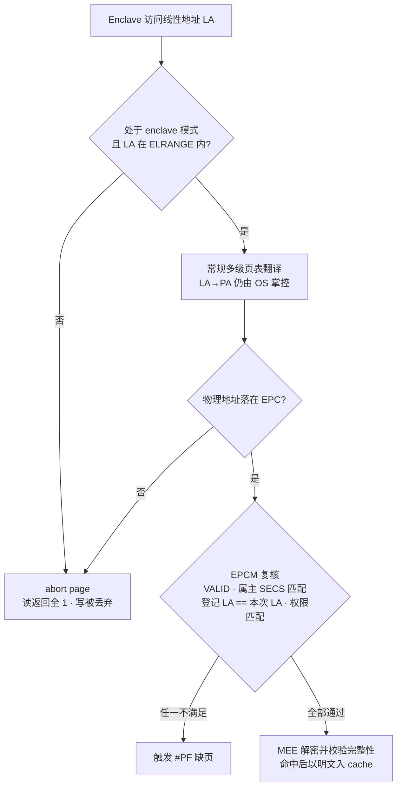
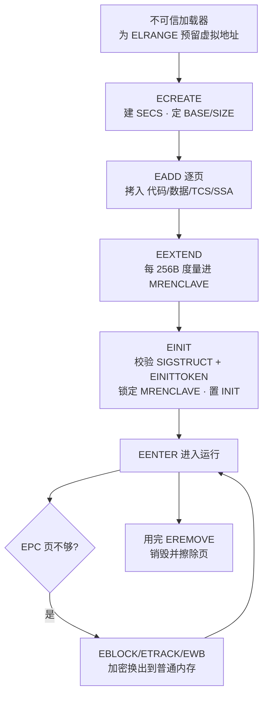
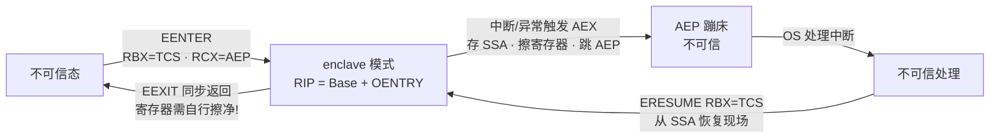
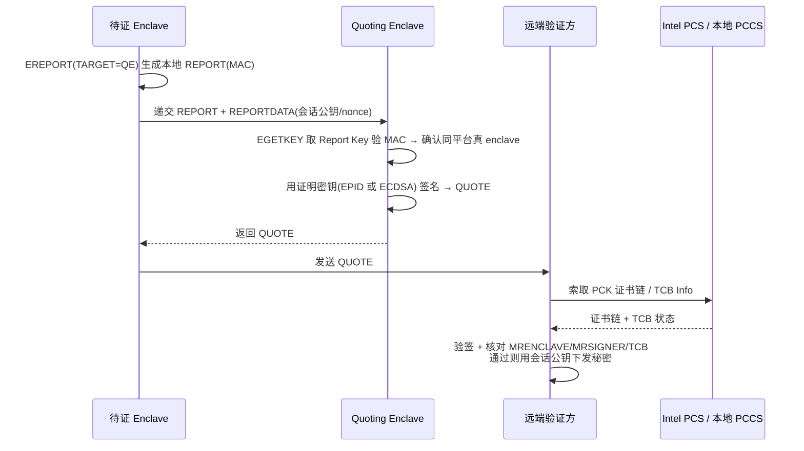

# 虚拟化与TEE机密计算（11）· Intel-SGX架构与Enclave
> [!abstract] TL;DR
> - SGX 把信任根从「整台机器」收缩到「CPU 封装的硅 + 你自己那段 enclave 代码」，OS / Hypervisor / BIOS / SMM 乃至插在内存总线上的物理探针，全部被划到 TCB（可信计算基）之外——代价是应用必须被切成「可信/不可信」两半。
> - EPC 是从物理内存里划出的加密页池，每一页由硬件 EPCM 表登记「属主 enclave + 允许映射的线性地址 + 权限」；MEE 在数据离开 CPU 封装写往 DRAM 时做「机密性 + 完整性 + 抗重放」三重保护，页表仍由 OS 管，却改不动 EPCM 的最终裁决。
> - Enclave 生命周期是一串 ENCLS/ENCLU 指令：`ECREATE→EADD→EEXTEND→EINIT` 负责构建并把代码与布局哈希进 `MRENCLAVE`；`EENTER/EEXIT/AEX/ERESUME` 负责受控进出，入口点被钉死、AEX 会自动擦寄存器。
> - 密封（EGETKEY 派生 Seal Key，按 `MRENCLAVE` 或 `MRSIGNER` 绑定）解决「数据落盘只有我能解」；证明（EREPORT 本地 + Quoting Enclave 出具 Quote 远程，EPID 与 DCAP 两条路线）解决「远端凭什么信我这段代码在真 SGX 里跑」。
> - SGX 明确不防侧信道：受控信道、Foreshadow/L1TF、Plundervolt、LVI、MDS 逐个撕开缝隙，Foreshadow 甚至偷走证明密钥、逼 Intel 走 TCB recovery——威胁模型的边界必须刻进脑子（攻击细节留给第 15 篇）。

## 概述与定位

Intel SGX（Software Guard Extensions）在 2015 年随 Skylake（第 6 代酷睿）落地，它给 x86 加了两族新指令——特权态的 `ENCLS` 与用户态的 `ENCLU`，以及一套硬件内存加密与度量证明机制，目标只有一个：在一台你并不完全信任的机器上，划出一小块叫 **enclave（飞地）** 的受保护执行环境，让其中的代码与数据即便面对最高权限的软件（内核、虚拟机监控器、SMM/BIOS）甚至物理攻击者（冷启动读条、总线嗅探）也保持机密性与完整性。

理解 SGX 的关键，是理解它把**威胁模型倒置**了。传统安全假设「内核可信、应用互相提防」；SGX 反过来假设「除了 CPU 封装内的硅和你亲手写进 enclave 的那几页代码，其余一切都可能是敌人」。这就是所谓 **TCB 最小化**：把可信计算基压缩到极致。第 10 篇《可信执行环境 TEE 全景》已从宏观勾勒了 TEE 的共性（隔离 + 度量 + 证明），本篇聚焦 SGX 这一具体实现的架构细节与指令语义。

在 TEE 家族的坐标系里，SGX 是**「进程内飞地」型**：隔离粒度最细（一个进程里可以有多个 enclave，每个只保护自己那点代码），TCB 最小，但代价是应用必须显式改造——你得决定哪些函数进 enclave、数据如何跨边界搬运。这与第 12 篇的 **ARM TrustZone**（把整颗芯片劈成「安全世界/普通世界」两半，安全世界跑一整套 secure OS，粒度粗、TCB 大）、以及第 13 篇的 **AMD SEV / Intel TDX**（保护整台虚拟机，客户机几乎无需改造，但把整个 guest 内核纳入 TCB）形成鲜明对照。一句话记忆：**SGX 保护「一段代码」，TrustZone 保护「一个世界」，SEV/TDX 保护「一台虚拟机」**；TCB 越小越难被攻破，却越难编程、侧信道面越暴露。

平台演进上有几处必须知道的分水岭。**SGX1**（Skylake）只支持静态 enclave，构建时定死内存布局；**SGX2** 增加了 EDMM（Enclave 动态内存管理），允许运行期增页、扩堆栈、动态创建线程。**FLC（Flexible Launch Control）** 从 Gemini Lake / Coffee Lake 起把「谁能启动 enclave」的钥匙 `IA32_SGXLEPUBKEYHASH` MSR 开放给平台属主，打破了早期必须由 Intel 的 Launch Enclave 放行的垄断，也是 DCAP 证明的前提。还有一个现实转折：Intel 已在**客户端**平台（第 11、12 代酷睿桌面）移除 SGX——直接后果是依赖 SGX 做内容保护的 4K UHD 蓝光播放链崩了；而**服务器端**（Xeon Scalable：Ice Lake-SP、Sapphire Rapids）不但延续 SGX、还把 EPC 扩到几百 GB，同时把机密计算的主线让位给面向机密虚拟机的 TDX。所以今天谈 SGX，语境基本是「服务器机密计算 + 存量客户端逆向」。

## 原理与机制

### EPC、EPCM 与 MEE：加密内存三件套

SGX 的物理地基叫 **PRM（Processor Reserved Memory）**，由 BIOS 通过 `PRMRR`（Processor Reserved Memory Range Registers）在启动早期从物理内存里划出一段，对普通软件彻底不可见。PRM 里最核心的部分是 **EPC（Enclave Page Cache）**——一个以 4KB 为单位的**加密页池**，所有 enclave 的代码、数据、控制结构都住在这里。SGX1 客户端典型配置是 128MB PRM，扣掉元数据后约 93MB 可用作 EPC 页；这个「小」正是后面要讲的换页机制存在的根因。

光有加密页还不够，关键在于**谁能访问哪页**。每一个 EPC 页都有一条对应的 **EPCM（EPC Map）** 表项，这是一张只有 CPU 微码能改的硬件元数据表，字段包括：`VALID`（是否有效）、页类型（`PT_SECS`/`PT_REG`/`PT_TCS`/`PT_VA`/`PT_TRIM`）、**属主 enclave**（指向其 SECS）、**该页被允许映射到的线性地址**、RWX 权限、以及 `BLOCKED` 状态。EPCM 的存在，构成了 SGX 最精妙的设计——**双层访问控制**：

- OS 依旧掌管常规多级页表，负责把线性地址翻译成物理地址（LA→PA）。SGX **不夺走** OS 的页表管理权。
- 但当一次访问落进 EPC 时，CPU 会额外用 EPCM 复核：这页是不是有效？属主是不是当前正在运行的 enclave？EPCM 里登记的「允许线性地址」是否**恰好等于**本次访问用的线性地址？权限对不对？任一条不满足就 `#PF` 缺页。

这一层为什么必须有？因为 OS 是敌人。恶意内核可以任意改页表，把 enclave 的某个虚拟页重映射到别处、或把两页对调搞地址混淆攻击。EPCM 通过「把线性地址绑进硬件元数据」让这类重映射当场失败——**你能改页表，但改不动 EPCM 的裁决**。对称地，**非 enclave 代码访问 EPC 会得到 abort page 语义**：读返回全 1（`0xFF…`），写被静默丢弃；enclave 访问越出自己的 ELRANGE 或踩到别家的页，则触发异常。

数据出了 CPU 封装、写往 DRAM 时才由 **MEE（Memory Encryption Engine）** 接管：用 AES 计数器模式做机密性、用 MAC 做完整性、用一棵**计数器树（版本树）** 做抗重放，树根保存在片上 SRAM 里，攻击者改不了、也无法用旧密文回放。反过来，数据一旦进了 CPU 的 cache，就是明文——所以 SGX 防的是「封装外」的攻击，对「封装内」的缓存侧信道无能为力（这正是后面安全一节的重点）。

一个重要的平台差异：服务器上 EPC 动辄几百 GB（Ice Lake-SP、Sapphire Rapids），此时给每页维护计数器树在成本上不现实，于是这些平台改用基于 **TME-MK（多密钥全内存加密）** 的变体，**放弃了 MEE 那棵抗重放计数器树**以换取扩展性——也就是说，大 EPC 服务器 SGX 的**完整性/抗重放保证被有意降级**了。逆向或做威胁建模时，绝不能把「客户端 SGX 的强完整性」直接套到大内存服务器上。

### SECS / TCS / SSA：enclave 的三张控制结构

Enclave 内部有三张关键硬件结构，都住在 EPC 里：

- **SECS（SGX Enclave Control Structure）**：每个 enclave 唯一，保存 enclave 的「身份档案」——基址 `BASEADDR`、大小 `SIZE`、属性 `ATTRIBUTES`（含 `DEBUG`、`MODE64BIT`、`XFRM` 等）、度量值 `MRENCLAVE`、签名者度量 `MRSIGNER`、产品号 `ISVPRODID`、版本号 `ISVSVN`、`SSAFRAMESIZE` 等。**关键点：SECS 对所有软件不可见，连 enclave 自己都读不到**——它只能被 SGX 指令间接操作，这样才能保证度量值等身份信息不被篡改。
- **TCS（Thread Control Structure）**：每一个「能进入 enclave 的逻辑线程」对应一个 TCS，保存入口点偏移 `OENTRY`、State Save Area 偏移 `OSSA`、可用 SSA 槽数 `NSSA` 与当前槽 `CSSA`、以及 `FLAGS`（如 `DBGOPTIN`）。**入口点被 `OENTRY` 钉死**，意味着外部无法从任意地址跳进 enclave 中段——这是一条防御导向的控制流约束。
- **SSA（State Save Area）**：当 enclave 执行中被中断/异常打断（AEX，见下节），CPU 把当时的寄存器现场存进当前 SSA 帧，之后 `ERESUME` 再从这里恢复。SSA 的大小由 `SSAFRAMESIZE` 决定，须容纳通用寄存器区加上按 `XFRM` 展开的 XSAVE 区。

`ELRANGE`（Enclave Linear Range）由 `BASEADDR + SIZE` 定义、必须 2 的幂对齐，是 enclave 代码唯一被允许执行与寻址自身的线性区间。这些结构合起来，构成了「一个 enclave 长什么样、能从哪进、被打断了怎么办」的完整硬件语义。

## 指令与执行详解：从 ECREATE 到远程证明

这是本篇的深度板块。SGX 的全部魔法都由两族指令承载：**`ENCLS`（Supervisor，ring 0）** 供 OS 管理 enclave，叶子函数有 `ECREATE / EADD / EEXTEND / EINIT / EREMOVE / EBLOCK / ETRACK / EWB / ELDU / EPA`，以及 SGX2 的 `EAUG / EMODT / EMODPR`；**`ENCLU`（User，ring 3）** 供 enclave 内外使用，叶子函数有 `EENTER / EEXIT / EGETKEY / EREPORT / EACCEPT / EMODPE / ERESUME`。下面按「构建 → 进出 → 密封 → 证明 → 换页」的顺序拆解。

### 构建四部曲：ECREATE → EADD → EEXTEND → EINIT

一个 enclave 由**不可信的加载器**（普通用户态程序 + 内核 SGX 驱动）搭建，但每一步都被硬件度量，因此加载器无法偷改内容而不被发现。分步来看：

1. **`ECREATE`**：分配并初始化 SECS，定下 `BASEADDR`、`SIZE`、`SSAFRAMESIZE`、`ATTRIBUTES`。此刻 `MRENCLAVE` 被初始化为 SHA-256 的初始状态，并把 `ECREATE` 的参数吸收进去。
2. **`EADD`**：把一页页内容（代码、数据、TCS、SSA）从普通内存拷进 EPC，同时建立该页的 EPCM 表项（属主、线性地址、权限、类型）。每次 `EADD` 也会把「这一页加在什么偏移、什么类型、什么权限」记进 `MRENCLAVE`。
3. **`EEXTEND`**：真正度量页**内容**。它一次只哈希 256 字节，所以度量满一页需要调用 **16 次**。为什么拆这么细？因为度量要在指令粒度上可中断、可交错，避免长时间占用而影响实时性。
4. **`EINIT`**：定稿。它校验开发者提供的 **`SIGSTRUCT`**（enclave 签名结构，用 RSA-3072、指数 3 签名，内含期望的 `MRENCLAVE`、属性、`ISVPRODID/ISVSVN` 和签名者公钥）与 **`EINITTOKEN`**（由 Launch Enclave 用 Launch Key 背书的启动令牌；FLC 平台上则由 `IA32_SGXLEPUBKEYHASH` 决定放行策略）。校验通过后，**锁定 `MRENCLAVE`、置 `INIT` 位**，此后 enclave 不能再被 `EADD`，正式可运行。

两个身份指纹在这里成形：**`MRENCLAVE` = 对「整个构建日志（ECREATE 参数 + 每次 EADD 的布局 + 每段 EEXTEND 的内容）」做增量 SHA-256 的结果**，代表「代码 + 数据 + 内存布局」的精确身份，改一个字节就变；**`MRSIGNER` = SHA-256(签名者 RSA 公钥模数)**，代表「作者」身份。两者是后续密封与证明策略的基石。

### 受控进出：EENTER / EEXIT / AEX / ERESUME

Enclave 与外界的每一次穿越都受硬件监督。**`EENTER`**（`RBX` 指向 TCS，`RCX` 给出 AEP 异步退出指针）把 CPU 切入 **enclave 模式**，`RIP` 被强制设为 `BASEADDR + TCS.OENTRY`——**你只能从钉死的入口进入，不能跳到函数中段**。**`EEXIT`** 同步退出，跳回不可信代码；但有个致命陷阱：**`EEXIT` 不会自动清空寄存器**，如果 enclave 在退出前没手动擦掉 `RAX/RSI` 里的密钥残留，就会直接泄露给外界——寄存器卫生是 enclave 开发者的责任。

真正体现硬件功力的是 **AEX（Asynchronous Enclave Exit）**：当 enclave 执行中来了中断、缺页或其它异常，CPU 不能让不可信的中断处理程序看到 enclave 的寄存器现场，于是自动完成一套动作——把当前寄存器**存入当前 SSA 帧**、把寄存器**擦成合成值**、`CSSA` 加一、把 `RIP` 设到之前登记的 **AEP（Asynchronous Exit Pointer）** 蹦床上，然后退出 enclave 模式。外部中断处理完后，蹦床通常执行 **`ERESUME`**（`RBX` 指向 TCS）从 SSA 恢复现场、`CSSA` 减一、继续原处执行。这里有个易被忽视的约束：**`NSSA` 必须 > 当前 `CSSA` 才有空闲 SSA 帧供 AEX 使用**，否则 AEX 会失败——这既是设计约束，也是一类拒绝服务/单步攻击（SGX-Step 正是反复用定时中断诱发 AEX 来逐指令观测）的着力点。

### 密封（Sealing）：数据落盘只有我能解

Enclave 的内存一断电就没了，但很多场景要把秘密（密钥、状态）持久化到磁盘。**密封**就是用 **`EGETKEY`** 派生一把**绑定到本平台 + 本 enclave 身份**的 Seal Key，把数据加密后落盘，日后只有「同一平台上的同一 enclave（或同一作者的 enclave）」能解开。

`EGETKEY` 派生 Seal Key 时的输入包括：熔丝在芯片里的**根密封密钥**（永不出 CPU）、`KEYREQUEST` 里选的 **KEYPOLICY**、`CPUSVN`、`ISVSVN`、`OWNEREPOCH` 和随机 `KEYID`。KEYPOLICY 有两种典型选择，深层含义完全不同：

- **绑 `MRENCLAVE`**：只有**字节级完全相同**的那个 enclave 能解。最严格，但 enclave 一升级（哪怕改一行）`MRENCLAVE` 就变，老数据解不开——不利于版本迁移。
- **绑 `MRSIGNER`**：**同一作者签名**的任意 enclave（含新版本）都能解。牺牲一点严格性换来平滑升级/数据迁移能力，是生产中常用策略。

`CPUSVN/ISVSVN` 的引入是为了配合 **TCB recovery**：当微码打补丁修复了硬件漏洞，`CPUSVN` 递增，新数据用新 SVN 派生密钥；老数据仍可用「不高于当时 SVN」的密钥解开，从而既能读回历史数据、又不让被攻破的旧 TCB 继续背书新秘密。`OWNEREPOCH` 则由平台属主设定，一旦更换（如二手转让），全部旧密封数据作废。

### 证明（Attestation）：远端凭什么信我

密封解决「对自己证明」，证明解决「对别人证明」——让一个远程验证方相信「某段特定代码确实运行在真正的 SGX enclave 里、且未被篡改」。分本地与远程两级。

**本地证明**回答「同一块 CPU 上的两个 enclave 能否互信」。源 enclave 调 **`EREPORT`**，输入目标的 `TARGETINFO`（目标的 `MRENCLAVE` + 属性）和 64 字节自定义 `REPORTDATA`，输出一个 **REPORT** 结构（含自己的 `MRENCLAVE/MRSIGNER/ISVPRODID/ISVSVN/ATTRIBUTES/CPUSVN/REPORTDATA` 和一个 MAC）。这个 MAC 用 **AES-CMAC**、以「**目标** enclave 的 Report Key」计算。目标 enclave 收到后，调 `EGETKEY(KEYNAME=REPORT)` 取回**自己的** Report Key（因为绑定到自己的度量，值恰好等于 EREPORT 用的那把），重算 MAC 一比对，就确认了「对方也在同平台的真 enclave 里，且身份如其所述」。**根密钥永不出 CPU，MAC 无法伪造**是全部信任的锚点。

**远程证明**把这份本地 REPORT 升级成可被外网验证的 **Quote**。核心角色是架构 enclave **QE（Quoting Enclave）**：它先用本地证明确认待证 enclave 的 REPORT 真实，再用一把**证明密钥**对 Quote 签名。两条工程路线：

- **EPID（早期）**：QE 用 **EPID（增强隐私 ID）群签名** 私钥签 Quote，支持完全匿名或假名两种模式，验证方把 Quote 交给 **Intel Attestation Service（IAS）** 联网核验。优点是隐私友好，缺点是每次验证都要依赖 Intel 在线服务。
- **DCAP / ECDSA（当下服务器主流）**：基于证书链自主验证。**PCE（Provisioning Certification Enclave）** 用从熔丝密钥派生的 **PCK（Provisioning Certification Key）** 给 QE 的 ECDSA 证明密钥签发证书；证书链为 `Intel SGX Root CA → PCK Platform/Processor CA → 平台 PCK 证书`。QE3 用 **ECDSA P-256** 签 Quote，验证方经 **PCCS（证书缓存服务）** 拿到 PCK 证书链与 Intel 签名的 **TCB Info**，即可**离线**验签、并核对 `MRENCLAVE/MRSIGNER/TCB` 状态，去掉了「每次证明都联 Intel」的依赖——这正是私有云/第三方云做机密计算的刚需，也是 FLC 的用武之地。

### 换页与 SGX2 动态内存

因为 EPC 太小，OS 必须能把 EPC 页换出到普通内存又不破坏安全。这套动作是：`EBLOCK` 标记页为阻塞、`ETRACK` 确保所有逻辑核的 TLB 都刷掉旧映射（防止别的核还拿着旧翻译），`EWB` 把页**加密 + 打 MAC + 附版本号**写到普通 DRAM，版本号存在专门的 **VA（Version Array）页**里（由 `EPA` 创建）用来**抗重放**——没有 VA，攻击者就能把旧版本的加密页回放进来。换回时用 `ELDU/ELDB`，并核对 VA 里的版本。

**SGX2** 补上了动态内存管理（EDMM）：`EAUG` 运行期向 enclave 追加新页、`EACCEPT` 由 enclave **自己确认接受**这页（防止 OS 偷塞页进来），`EMODPR/EMODPE` 收紧/放开权限、`EMODT` 改页类型。这让 enclave 能动态扩堆栈、扩堆、按需创建线程，而不必像 SGX1 那样在构建期就把所有内存布局定死——对跑 LibOS、跑大内存工作负载至关重要。

## 工具视角与实战

从工程与逆向角度，SGX 应用有一套固定「形状」，认得出来就好分析。**Intel SGX SDK** 用一门 **EDL（Enclave Definition Language）** 描述边界接口，`edger8r` 工具据此生成可信/不可信两侧的**桥接代码**：`ECALL` 是「外部调用进 enclave」（底层走 `EENTER` + 一张按序号索引的分发表），`OCALL` 是「enclave 回调外部函数」（底层 `EEXIT` 出去、跑完再 `EENTER/ERESUME` 回来）。`sgx_sign` 用开发者私钥生成 `SIGSTRUCT`、算出预期 `MRENCLAVE`。逆向一个 enclave，第一步就是找 EDL / ECALL 表 / 桥函数，摸清攻击面。

EDL 里的**指针属性**是安全的命门也是逆向重点：`[in]` 把不可信缓冲深拷贝进 enclave、`[out]` 拷出、`[user_check]` 则**完全不检查、直接给你原始不可信指针**。误用 `[user_check]` 或不校验长度，就会把「指向不可信内存的指针」当可信数据用，酿成经典的边界越权与 **TOCTOU**（检查与使用之间被换掉）漏洞——这类 bug 是 enclave 审计的头号目标。

想跑**未改造的现成应用**，可用 **LibOS 方案**：**Gramine**（原 Graphene-SGX）、**Occlum**、**SCONE** 把一层最小操作系统塞进 enclave，让普通 Linux 程序几乎零改动地跑在里面；另有 **Open Enclave SDK**、**Fortanix EDP**（Rust 原生）、**Teaclave** 等生态。代价是 LibOS 本身也进了 TCB，面积和侧信道风险随之变大。

调试与逆向层面有个关键区分：**DEBUG enclave**（`ATTRIBUTES.DEBUG=1`）允许用 `EDBGRD/EDBGWR` 从外部读写其内存，SDK 的调试器据此工作；而**生产 enclave 无法被调试**，运行时内存对外只是密文。静态上，签名后的 enclave 是个普通 `.so`/`.dll`（如 `enclave.signed.so`），能反汇编看代码、能复现 `MRENCLAVE` 计算；动态上则要靠驱动 ioctl 理解加载过程——现代内核走 `/dev/sgx_enclave`（in-tree 驱动）配合 `/dev/sgx_provision`，老平台是带外的 `/dev/isgx`。要在指令级观测 enclave，研究者用 **SGX-Step** 框架逐指令单步——这已属侧信道范畴，第 15 篇《Enclave 逆向与侧信道攻击》专门展开。

## 安全性与正确使用

SGX 的安全边界必须**精确**理解，含糊其辞就会误用。它**保证**的是：面对高权限软件与封装外物理攻击，enclave 的内存机密性与完整性、以及「代码身份可被远程证明」。它**不保证**的，同样清清楚楚：

- **侧信道**。SGX 从设计上就不防微架构侧信道。**受控信道攻击**（Xu 等）里，恶意 OS 故意取消 enclave 页映射、靠观察缺页序列，在 **4KB 页粒度上无噪声地**推断 enclave 的执行路径与数据访问模式；缓存计时、分支预测、`SGX-Step` 单步更把粒度推到指令级。
- **瞬态执行攻击**。**Foreshadow / L1TF（2018）** 通过投机执行从 L1 缓存里读出 enclave 明文，绕过 EPCM 的 abort 语义，**直接偷走了 Seal Key 与证明密钥**——一旦证明密钥泄露，攻击者就能伪造 Quote，整个远程信任崩塌。Intel 靠微码（enclave 退出时刷 L1D）+ **TCB recovery**（抬高 `CPUSVN`、作废旧证明）才补上。**Plundervolt**（软件欠压注错）、**LVI**（载入值注入）、**MDS/ZombieLoad**、**ÆPIC Leak** 是同一家族的不同切面。攻击细节留给第 15 篇，这里只强调结论：**把侧信道排除在威胁模型外，是 SGX 的前提，不是它的缺陷**——但你的设计必须正视它。
- **enclave 自身的 bug 与拒绝服务**。enclave 内部的内存破坏漏洞，SGX 一点都不帮你挡；OS 随时可以拒绝调度你的 enclave（可用性从来不在 SGX 的保证之内）。

由此推出**正确使用与加固边界**：

1. **最小化 enclave 面积**。只把真正的秘密与最小逻辑放进去，代码越少、攻击面与侧信道面越小——这正是 SGX 相对 SEV/TDX 的立身之本，别把整个应用一股脑塞进 enclave 白白放大 TCB。
2. **边界零信任**。跨 `ECALL/OCALL` 的每一个指针都要深拷贝 + 严格长度/范围校验，慎用 `[user_check]`，并按「值可能在校验后被换掉」来防 TOCTOU。
3. **密码学要抗侧信道**：用常量时间实现，避免依赖秘密的分支与查表；`EEXIT` 前手动擦净寄存器与用过的 SSA，别把残留泄给外界。
4. **密封策略按迁移需求选** `MRENCLAVE` 还是 `MRSIGNER`；证明协议里**必须带 nonce/时间因子防重放**，并把 `REPORTDATA` 绑定到本次会话公钥，杜绝中间人把旧 Quote 拿来复用。
5. **验证方要认真查 TCB**：核对 Quote 的 `MRENCLAVE/MRSIGNER` 之外，务必检查 TCB Info、拒绝 `OutOfDate` 的平台，才能真正抵御被降级/已知漏洞的硬件。
6. **管好启动控制**：FLC 平台上 `IA32_SGXLEPUBKEYHASH` 决定谁能启动 enclave，属主须谨慎设置，避免恶意 enclave 被随意放行。

横向看，SGX 与 SEV/TDX 是「小 TCB 难编程、侧信道面大」对「大 TCB 易迁移、粒度粗」的取舍：没有银弹，选型取决于你更怕「信任基太大」还是更怕「改造成本太高」。

## 小结

SGX 用一套硬件机制把信任根压到「CPU 硅 + 一段 enclave 代码」：**EPC + EPCM** 提供受硬件裁决的加密内存与双层访问控制，**MEE** 守住封装外的机密性/完整性/抗重放；**`ECREATE→EADD→EEXTEND→EINIT`** 把代码与布局固化成 `MRENCLAVE` 身份，**`EENTER/EEXIT/AEX/ERESUME`** 保证受控进出；**密封**（`EGETKEY`）解决持久化秘密的自我绑定，**证明**（`EREPORT` 本地、QE 出具 Quote 远程，EPID 与 DCAP 两路）解决远端信任的建立。它的力量与软肋一体两面：TCB 极小带来强隔离，却把侧信道与编程复杂度推给了开发者。用对了，它是机密计算最锋利的一把刀；用错了——把侧信道忘在脑后、把边界指针当可信——它也会静默地漏光你以为被保护的一切。下一篇转向 ARM TrustZone，看「两个世界」这条完全不同的技术路线如何解同一道题。

## 相关阅读

- 系列同侪：[[10.可信执行环境TEE全景]]（TEE 共性与本篇定位）、[[12.ARM-TrustZone与安全世界]]（世界切换路线对照）、[[13.AMD-SEV与机密虚拟机]]（机密虚拟机路线对照）、[[14.TPM与度量启动]]（度量与信任根）、[[15.Enclave逆向与侧信道攻击]]（Foreshadow / 受控信道 / SGX-Step 细节）
- 内核与完整性呼应：[[38.Windows内核与驱动逆向/25.HyperV架构与VBS]]、[[38.Windows内核与驱动逆向/29.CI.dll与代码完整性WDAC]]
- 硬件与内存承接：[[21.Asm/40 虚拟化扩展对比]]、[[24.内存管理与堆分配器/02.进程地址空间与虚拟内存]]
- 启动链呼应：[[39.固件与IoT嵌入式逆向/21.安全启动链绕过技术]]
- 官方与经典文献：Intel SDM Vol. 3D（SGX 指令与体系结构，第 34–43 章）；Intel SGX Developer Reference 与 SGX SDK 文档；Costan & Devadas, "Intel SGX Explained"（IACR ePrint 2016/086，最完整的公开体系解读）；Intel DCAP / ECDSA Quote 库与 TCB Info 规范；Gramine、Occlum 项目文档。

[[00.虚拟化与TEE机密计算总览|⬆ 系列总览]] | [[10.可信执行环境TEE全景|← 上一章]] | [[12.ARM-TrustZone与安全世界|→ 下一章]]