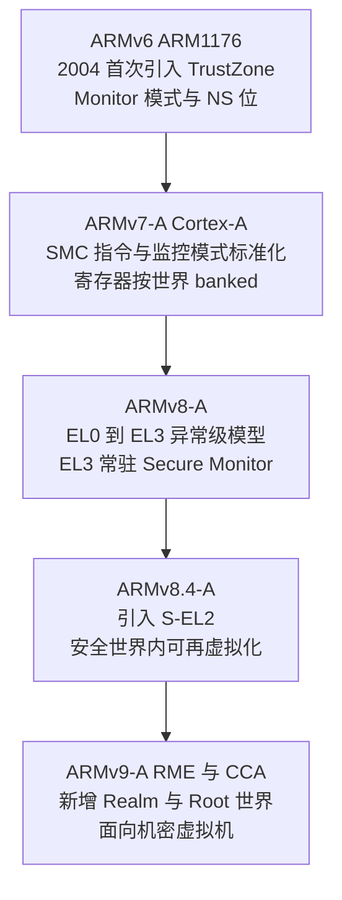
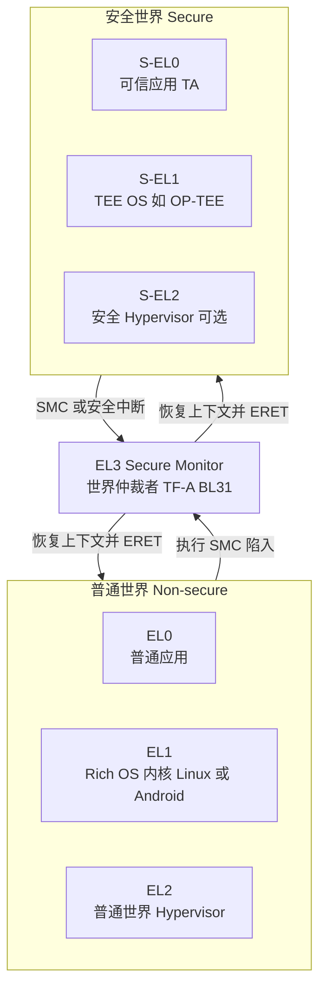
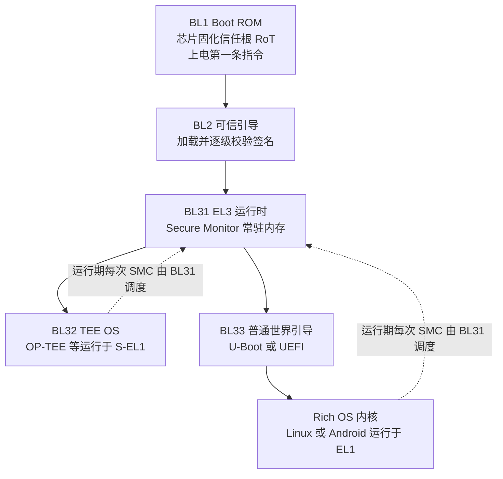
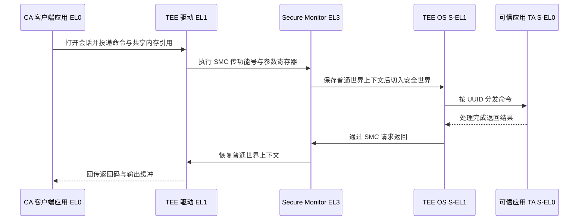

# 虚拟化与TEE机密计算（12）· ARM-TrustZone与安全世界
> [!abstract] TL;DR
> - TrustZone 是 SoC 级的硬件安全扩展：用一根 NS（Non-secure）位把同一颗 CPU、总线、内存、外设一分为二——普通世界跑 Rich OS，安全世界跑 TEE OS，隔离由硬件强制而非软件约定，可见性是**非对称**的（安全能读普通，普通读不到安全）。
> - ARMv8 用常驻 EL3 的 Secure Monitor 做世界仲裁，`SMC` 指令是唯一合法的世界切换门；SMCCC 规定了功能号编码与寄存器传参约定，连电源管理 PSCI 也复用同一条 SMC 通道。
> - TEE OS（OP-TEE / QSEE / Kinibi / TEEGRIS / Trusty）在 S-EL1 运行，可信应用 TA 在 S-EL0；普通世界的 CA 通过“共享内存 + SMC 陷入”与 TA 通信，RPC 机制让安全世界反向借用普通世界的存储与网络服务。
> - 相对 SGX，TrustZone 粒度粗、TCB 大（整个 TEE OS 加全部 TA 都可信且高特权），默认不加密 DRAM、不抗物理攻击；安全世界一旦被攻破，特权高于内核，后果比普通内核漏洞更严重。
> - 典型陷阱是 Boomerang / 混淆代理（TA 盲信普通世界传入的指针写穿内核）与 CLKSCREW / VoltJockey（调压调频故障注入翻转安全世界计算）；加固方向是最小化 TA、严格校验共享内存边界、用 S-EL2 沙箱隔离 TA、强制安全启动。
> - ARMv9 的 RME/CCA 在两世界之上再加 Realm 与 Root 两世界，把机密虚拟机能力补齐——这是 TrustZone 世界模型的自然延伸（机密虚拟机对照见下一章 AMD-SEV）。

## 概述与定位

ARM TrustZone 是一套**片上系统（SoC）级的硬件安全扩展**。它不新增一颗协处理器、也不是软件沙箱，而是给整颗芯片引入一个额外的“安全维度”：从 CPU 内核、Cache、MMU，一直到 AXI/AMBA 总线、内存控制器、GIC 中断控制器、乃至每一个外设，都携带一位 **NS（Non-secure）标志**。这一位把整机划成两个**世界（World）**——**安全世界（Secure World）**与**普通世界（Normal / Non-secure World）**。普通世界运行我们熟悉的富操作系统（Rich OS，如 Linux/Android）与它上面的一切应用；安全世界运行一个精简的可信操作系统（TEE OS）与若干**可信应用（Trusted Application, TA）**。二者物理上共用同一颗 CPU、同一块 DRAM，但被硬件强制隔离。

在本系列的坐标里，本篇承接第 10 篇《可信执行环境 TEE 全景》：TrustZone 正是移动与嵌入式领域 TEE 的**事实标准硬件底座**——你手机里的指纹比对、人脸解锁、移动支付、DRM 视频版权（Widevine L1）、Android 密钥库（Keystore）与设备认证，绝大多数都落在 TrustZone 的安全世界里执行。它与第 11 篇 Intel SGX 形成鲜明对照：SGX 是**应用内的飞地（Enclave）**，在一个不可信的 OS 之上凿出一小块可信区域，TCB 极小、粒度细；TrustZone 反过来，是**系统级的世界划分**，把“可信”做成一整个操作系统，粒度粗、TCB 大。两者是 TEE 光谱的两个极端，理解其取舍是本篇的主线。

必须澄清一个高频误解：**TrustZone 不是虚拟化**。虚拟化（第 01–08 篇）是“水平切分”——EL2 的 Hypervisor 通过二阶段地址翻译把一份硬件复用给多个平级的虚拟机；而 TrustZone 是“垂直切分”——它与虚拟化正交，在**每一个**异常级之上再叠加一位安全态。你完全可以在普通世界里跑 Hypervisor（EL2）带多台虚拟机，同时安全世界（S-EL1/S-EL0）独立存在。ARMv8.4 之后甚至给安全世界也补上了 S-EL2，让安全世界内部也能再虚拟化。把这两个维度想成一张二维表：一维是异常级（特权高低），另一维是安全态（可信与否）。

TrustZone 的历史演进是一条“把世界切分越做越细”的主线：



需要补充的是，本篇聚焦 **Cortex-A 应用处理器上的 TrustZone-A**；微控制器上还有 **TrustZone-M**（ARMv8-M，Cortex-M23/M33/M55），它没有独立的监控异常级，而是用内存映射的 SAU/IDAU 划分安全与非安全区域，用特殊的分支指令在同一特权栈上快速跨域调用——机制形态差别很大，本篇会在对比处点到，不展开。

## 原理与机制

### NS 位：一切的语义根

TrustZone 全部魔法的原点，是一位物理信号 **NS**。在 ARMv8-A 中，它由 EL3 的系统寄存器 **`SCR_EL3.NS`** 控制：当 EL3 通过 `ERET` 返回到较低异常级时，`SCR_EL3.NS` 决定那一级运行在哪个世界——`NS=0` 进入安全世界，`NS=1` 进入普通世界。EL3 自身**恒为安全**（在 ARMv9 RME 里更精确地说是 Root 世界）。这一位不是软件层的布尔变量，而是会**随每一次访存物理地传播到片上总线**：AXI/AHB 事务里有一根 `AxPROT[1]`（即 NS 信号），标记本次读写是安全还是非安全发起的。

为什么要“物理传播”而不是靠软件记账？因为设计目标是：**即使普通世界的内核被完全攻陷，它也无法伪造出一次“安全”访存**。普通世界发出的所有总线事务，NS 恒被硬件钉死为 1，无论它怎么改页表、怎么提权，都改不了这一位。于是“可信”与“不可信”的边界不再是操作系统的软件承诺，而是刻在硅片数据通路上的电气事实。这就是 TrustZone 相对纯软件隔离的根本价值。

### 异常级 × 安全态：二维特权矩阵

ARMv8-A 用四个异常级承载这张二维表，EL3 作为两个世界之间唯一的“闸门”常驻其间：



对照 ARMv7-A：那时没有 EL0–EL3 的整齐编号，安全态由 `SCR.NS` 控制，世界切换落在一个特殊的 **Monitor 模式**里，许多寄存器（如 `SP`、`SPSR`、部分系统寄存器）是**按世界 banked**（每个世界一份物理副本），切换时硬件自动切分。ARMv8 把这套整理成异常级模型：进入 EL3 就等于进入监控代码，`ELR_EL3`/`SPSR_EL3`/`SP_EL3` 独立成组，逻辑更清爽。理解“ARMv7 的 Monitor 模式 ≈ ARMv8 的 EL3”这一映射，读旧固件与新固件才不会串味。

### 一条 NS 位如何贯穿全系统

只有 CPU 认这位还不够——DRAM、外设、中断都得认，否则普通世界可以绕过 CPU 直接让 DMA 去读安全内存。于是 TrustZone 在片上放了一圈“执法者”：

- **TZASC（TrustZone Address Space Controller，典型实现 TZC-400）**：坐在内存控制器前，把物理 DRAM 划成若干区域，每个区域可配置“仅安全可访问 / 仅非安全 / 都可”。当一笔 `NS=1` 的事务命中“仅安全”区域，控制器直接拒绝（返回错误或读到全零）。这是**把同一块物理内存切成安全 RAM 与普通 RAM** 的关键部件。
- **TZPC（TrustZone Protection Controller）**：给外设打安全标签，决定某个 UART、Crypto 引擎、传感器只能被哪个世界访问——移动支付时把触摸屏与显示控制器临时划归安全世界，就是靠它实现 **Trusted UI**。
- **TZMA（TrustZone Memory Adapter）**：为片上 SRAM 划分安全/非安全边界，常用于放启动早期的安全代码。
- **GIC（通用中断控制器）**：中断也分组。GICv3 里 Group 0 与 Secure Group 1 属安全世界、Non-secure Group 1 属普通世界；配合 `SCR_EL3.FIQ/IRQ` 的路由位，安全中断（惯例走 **FIQ**）可以**抢占**正在运行的普通世界并陷到 EL3/安全世界处理，普通中断（**IRQ**）则交回 Rich OS。这套分组保证“安全外设的中断不会落到不可信内核手里”。

在内核内部，NS 位还渗透进 **Cache 与 MMU**。Cache 行按 NS 打标签，安全访问与非安全访问即便命中同一物理地址也被视作**不同的行、互不别名**，普通世界因此无法通过 Cache 侧读到安全数据的明文残留。MMU 页表描述符里带 **NS / NSTable** 位：安全世界的翻译可以指定某页输出到安全或非安全物理空间，从而实现前面说的**非对称可见性**——安全世界既能访问自己的安全内存，也能访问普通世界内存（这是它能与 CA 共享缓冲、也是 Boomerang 攻击面的根源）；而普通世界的访存 NS 恒为 1，从物理上就到不了安全内存。“安全可见普通、普通看不见安全”这条不对称规则，请务必记牢，它同时是 TrustZone 的能力来源与风险来源。

## 世界切换与 SMC 调用详解

### SMC 指令与监控闸门

两个世界之间**唯一合法的主动通道**是 **`SMC`（Secure Monitor Call）** 指令。普通世界（通常在 EL1 内核态）执行 `SMC #imm`，CPU 立刻**同步陷入 EL3**，控制权交给常驻的 Secure Monitor。EL0 用户态一般无权直接 `SMC`（受 `SCR`/`HCR` 与陷阱位约束），必须经由内核代发。Monitor 拿到控制权后要做一件苦活：**保存当前世界的完整寄存器上下文**（通用寄存器、栈指针、系统寄存器中按世界不 banked 的部分、必要时 FP/SIMD），**切换 `SCR_EL3.NS`**，**恢复目标世界的上下文**，再 `ERET` 进去。一次完整的“普通→安全→普通”往返因此涉及两次这样的上下文乾坤大挪移，还会带来 Cache/TLB 局部性的破坏——这就是**世界切换开销**的来源，也是 TEE 调用为何“不能太频繁、宜批量”的原理性理由。

### SMCCC：功能号与寄存器约定

裸的 `SMC` 只是陷入，参数怎么传、要调哪个功能，由 **SMC Calling Convention（SMCCC，文档 Arm DEN 0028）** 规定。核心是一个 32 位的**功能标识符**放在 `W0/R0`，其余参数按序放 `X1..X7`（乃至 `X8..X17`）：

```
SMC/HVC 功能标识符 Function Identifier（位于 W0，32 位）
 31  30   29         24 23            16 15                    0
+---+---+------------------+----------------+---------------------+
|FC |CC | Owning Entity 6b |  保留 MBZ 8b   |  Function Number 16b |
+---+---+------------------+----------------+---------------------+
  |   |          |                                    |
  |   |          |                                    +- 具体功能号
  |   |          +- 服务归属：0=Arm架构 1=CPU 2=SiP 3=OEM
  |   |             4=标准安全服务(PSCI 等) 5/6=Hypervisor
  |   |             48-49=可信应用调用 50-63=可信 OS 调用
  |   +- 0=SMC32 采用 32 位调用约定 / 1=SMC64 采用 64 位调用约定
  +- 0=Yielding Call 可被中断可让出 / 1=Fast Call 原子快调用

示例：
  0x8400_0000  PSCI_VERSION   Fast + SMC32 + Owner=4 + Func=0
  0xC400_0003  PSCI_CPU_ON    Fast + SMC64 + Owner=4 + Func=3
```

两处设计值得咀嚼。其一，**Fast Call 与 Yielding Call 的分野**（bit31）。Fast Call 语义上是“原子的、短的、不可被普通世界中断的”，Monitor/TEE 会尽快返回，适合读版本号、开关电源核这类瞬时操作；Yielding Call（旧称 Standard Call）则允许在安全世界里执行较久，并且**可以被普通世界的中断打断**——这对交互体验至关重要：一次 TA 里的耗时加密不能让整机的普通世界中断饿死。其二，**Owning Entity（bit29:24）把号段分给不同主人**：4 号段是标准安全服务（PSCI 就在此），2/3 号段留给芯片厂商（SiP）与 OEM 定制，48–63 号段专供可信应用与可信 OS。逆向一个陌生固件的 SMC 处理函数时，先按这张号段表判断“这是标准服务还是厂商私货”，能迅速缩小分析范围。

`SMC32` 与 `SMC64`（bit30）则决定参数按 32 位还是 64 位寄存器解读，AArch32 的调用者只能用 SMC32。**PSCI（Power State Coordination Interface，Arm DEN 0022）**是理解 SMC 通用性的最佳样本：CPU 上电（`CPU_ON`）、下电、系统关机重启、热插拔，Linux 内核统统通过 SMC 请 EL3 固件代劳——因为只有 EL3 有资格协调整颗多核 SoC 的电源状态。可见 SMC 不止服务于 TEE，它是**普通世界向最高特权固件求助的通用接口**。

### 中断、RPC 与调度模型

安全世界不是一个能被普通世界随意调度的对等 OS，它更像“被 CA 线程借用算力的库”。典型模型是：普通世界某线程发起 Yielding SMC 进入安全世界执行 TA，若期间来了普通世界的 IRQ，硬件把它交回普通世界处理，随后普通世界再发一个“resume”类 SMC 让安全世界从断点续跑——这就是 Yielding Call 可让出的意义。反过来，安全世界执行中若需要普通世界才有的能力（比如把加密后的数据落到 Rich OS 的文件系统、访问网络、读时间），它会通过 **RPC（Remote Procedure Call）反向请求**：TEE OS 用一个特殊返回值经 Monitor 回到普通世界的 TEE 驱动，由用户态守护进程 `tee-supplicant` 完成实际 I/O，再发 SMC 把结果送回安全世界继续。这套“安全世界主动借普通世界打杂”的设计，是 TEE OS 得以保持精简（自己不实现完整文件系统/网络栈）的关键工程折中。

### 启动链：信任从上电第一条指令长出来

世界隔离要成立，前提是**安全世界的代码本身可信**，这靠**安全启动 / 信任链（Chain of Trust）**保证。ARM 参考实现是 **Trusted Firmware-A（TF-A）**，把固件分级加载、逐级验签：



信任根 **RoT** 固化在芯片 Boot ROM（BL1）里不可改，它用片内熔丝（eFuse/OTP）里烧录的公钥哈希去验 BL2 的签名，BL2 再验 BL31、BL32、BL33……每一级都在跳转前校验下一级，**任何一环签名不符即停机**。于是“安全世界代码可信”这个假设，被一路回溯到不可篡改的硅片信任根。这也解释了为什么 **安全启动一旦被绕过，TrustZone 的全部隔离都失去意义**——攻击者可以直接换上自己的 TEE OS。这条链与本库《安全启动链绕过技术》《TPM 与度量启动》呼应：签名验证是“授权启动”，度量启动（TPM/PCR）是“记录启动”，二者互补。BL31 加载完毕后即成为运行期常驻的 Secure Monitor，此后普通世界与安全世界的每一次 `SMC` 都由它接住并转发。

### 一次 TA 调用的完整往返

把上面的机制串起来，一次“普通世界应用调用可信应用”的时序如下：



注意数据不是塞在寄存器里搬的——大块数据走**共享内存**：普通世界分配一块非安全物理内存，把它的物理地址通过 SMC 参数告知安全世界，TEE OS 用自己的页表映射进来读写。寄存器只传“功能号 + 共享内存的地址与长度”这类元数据。共享内存必须落在**非安全内存**这一点，正是后文安全小节的要害。

## 工具视角与实战

### OP-TEE：读懂一个开源 TEE 的全貌

**OP-TEE**（由 TrustedFirmware.org/Linaro 维护）是最值得逆向工程师精读的开源 TEE，因为它把 GlobalPlatform 标准落成了看得见源码的形态。它的组件分布横跨两个世界：

- **安全世界**：`optee_os` 即 BL32，运行在 S-EL1，负责内存管理、TA 加载与调度、密码学、安全存储；TA 是运行在 S-EL0 的独立进程，以 **UUID** 标识、用开发者密钥签名。
- **普通世界**：Linux 的 **TEE 子系统驱动**（`drivers/tee/optee`，暴露 `/dev/tee0` 与 `/dev/teepriv0`）负责把用户请求打包成 SMC；用户态 `libteec`（即 `optee_client`）实现 **GlobalPlatform TEE Client API**；守护进程 `tee-supplicant` 承接前述 RPC，替安全世界完成安全存储落盘、加载 TA 二进制等杂活。

客户端侧 API 是一套稳定的三段式：`TEEC_InitializeContext` 拿到与 TEE 的上下文，`TEEC_OpenSession` 按 UUID 打开到某个 TA 的会话，`TEEC_InvokeCommand` 携带参数（含 `TEEC_RegisterSharedMemory`/`AllocateSharedMemory` 注册的共享缓冲）发起一次命令。TA 内部则实现 **TEE Internal Core API**：`TA_CreateEntryPoint`、`TA_OpenSessionEntryPoint`、`TA_InvokeCommandEntryPoint` 是入口回调，密码学与安全存储通过 `TEE_*` 系列函数调用。这套“客户端 API + 内部 API”的分工是 GlobalPlatform 规范的核心，几乎所有商用 TEE 都兼容它，是逆向时对号入座的模板。

安全存储值得单说：TEE 自己没有磁盘，它把数据加密后经 RPC 交给普通世界落盘，但为了防**回滚/重放**（普通世界把旧密文换回去），敏感场景会用 **RPMB（Replay Protected Memory Block）**——eMMC/UFS 里一块特殊分区，读写要用只有安全世界知道的密钥做 HMAC 认证、并带**单调递增计数器**，普通世界即便持有旧密文也无法让它“时光倒流”。理解 RPMB，才理解 TEE 的“防回滚”是怎么在一个不可信存储介质上实现的。

### 商用 TEE OS 横向与逆向切入

真机上你会遇到形形色色的 TEE OS，机制同源、形态各异：高通的 **QSEE/QTEE**、三星 Exynos 上的 Trustonic **Kinibi**（前身 `<t-base`/MobiCore）与三星自研 **TEEGRIS**、Google 的 **Trusty**（Pixel 上使用，可跑在 TrustZone 或独立 VM 里）、华为 **iTrustee/TrustedCore** 等。它们的 TA 大多是**厂商签名的私有格式二进制**，加载前由 TEE OS 验签。

逆向的常规路径是：从固件镜像里**定位并提取 TEE OS 与 TA**（按魔数、按 ELF 特征、按厂商容器格式切分），载入 **Ghidra/IDA** 反编译；对着 SMCCC 号段表与 GlobalPlatform 入口签名**恢复符号**（`TA_InvokeCommandEntryPoint` 的 `cmd_id` 分发 switch 往往是攻击面地图）；进一步可**模糊测试 SMC 接口与 TA 命令处理器**，重点盯参数校验缺失。动态分析上，**QEMU 的 `virt` 平台加 OP-TEE** 是绝佳的可控靶场：能在纯软件环境里跑通 TF-A + OP-TEE + Linux + TA 的完整链路，单步观察世界切换。要注意的是**生产设备的硬件调试通道（JTAG/SWD）通常在出厂时被熔丝永久关闭**，安全世界不可被外部调试器窥探，这既是防线也是逆向的障碍——所以离线镜像分析与仿真才是主战场。

### Android 里的 TrustZone

在 Android 上，TrustZone 是一堆安全特性的地基：**Keymaster/KeyMint** 把密钥生成与签名放进安全世界，私钥永不出 TEE；**StrongBox** 更进一步要求独立安全芯片；**Gatekeeper/Weaver** 在 TEE 内做锁屏口令校验与**限速防爆破**（尝试次数与延迟由安全世界记账，普通世界改不了）；**指纹/人脸的模板比对**在安全世界完成，普通世界只拿到“通过/不通过”的布尔结果，生物特征原始数据不落入 Rich OS。这些正是本库《HyperV 架构与 VBS》《CI.dll 与代码完整性 WDAC》在 x86 侧用 VBS/VTL 追求的目标，在 ARM 侧用 TrustZone 实现的对应物——把“最该保护的一小撮秘密”搬到内核也够不着的地方。

## 安全性与正确使用

### 威胁模型：防什么、不防什么

TrustZone 的设计威胁模型是**抵御软件态的普通世界攻陷**：哪怕 Rich OS 内核被 root、被植入 rootkit，它也读不到安全世界内存、伪造不出安全访存、篡改不了 TEE 内的密钥与计数器。但要清醒：**基线 TrustZone 默认不加密 DRAM，也不抵御物理攻击**。安全内存只是被 TZASC 挡住了非安全的总线访问，其明文仍躺在物理颗粒里——冷启动攻击、总线探针、对 DRAM 直接读取，在没有额外内联内存加密的 SoC 上是可行的。这与 SGX 的 MEE（内存加密引擎）、以及下一章 AMD-SEV 给整台虚拟机加密内存，是**威胁模型上的根本差异**：SGX/SEV 把“物理内存也不可信”纳入防护，TrustZone 基线版本没有。部分高端 SoC 会外挂内联加密补上这一环，但那是实现增强而非架构默认。

### 大 TCB 与“被攻破即满盘皆输”

TrustZone 最被诟病的是 **TCB 巨大**：整个 TEE OS 加上厂商与第三方塞进去的全部 TA，都运行在同一个高特权安全世界里、彼此默认不隔离，任何一个 TA 的漏洞都可能沦陷整个安全世界。更严峻的是**权限倒挂**：安全世界特权高于普通世界内核，因此一个 TEE 提权漏洞的破坏力**超过**普通内核 0-day——攻击者能拿到设备主密钥、伪造认证、突破 DRM，甚至以安全世界之尊反向控制普通世界。历史上高通 QSEE、Trustonic 等 TEE 都出过被公开利用的严重漏洞（密钥提取、安全世界代码执行）。这与 SGX “TCB 极小”的哲学正相反，是选择“系统级 TEE”必须承受的代价。

### 两类经典攻击面

- **Boomerang / 混淆代理（Confused Deputy）**：因为安全世界**能访问普通世界内存**，若某 TA 盲目信任 CA 通过共享内存传入的指针、不校验其归属就解引用读写，攻击者可构造一个指向**普通世界内核内存**的指针，诱使高特权的 TA 替自己去读写内核——用 TEE 当“提权跳板”。防御的铁律是：**TA 必须校验 CA 传入的每一个指针与长度确实落在非安全内存范围内**，绝不能拿去访问安全内存或让其越界。
- **CLKSCREW / VoltJockey（故障注入）**：普通世界往往能通过 DVFS（动态调压调频）接口调节 CPU 电压频率，攻击者把电压/频率推到临界点，在安全世界执行密码学的瞬间**诱发计算错误（bit flip）**，据此做差分故障分析提取 AES 密钥，或让签名校验误判从而加载自签名代码。根因是“调压调频这类能耗管理接口跨越了世界边界却未被纳入安全考量”。防御方向是限制普通世界对敏感电源域的控制、关键运算加冗余校验。

### 正确使用与加固边界

把 TrustZone 用对，工程上有几条硬边界：**最小化 TA 数量与代码面**，每引入一个 TA 就是给共享的高特权世界增加一处攻击面；**严格校验所有跨世界输入**，共享内存的地址/长度必须验证归属非安全内存并防整数溢出，命令分发的 `cmd_id` 与参数类型要白名单化；**密码学实现常量时间**，避免把侧信道从安全世界泄给普通世界（侧信道细节见第 15 篇）；**用 S-EL2 沙箱化 TA**，ARMv8.4 的安全世界虚拟化让 TEE OS 能把互不信任的 TA 关进各自的地址空间，把“一个 TA 沦陷即全军覆没”降级为“单 TA 隔离爆炸”；**安全启动必须真正强制**，否则前述一切隔离都建在流沙上。

### 演进：从两世界到四世界

ARMv9 的 **RME（Realm Management Extension）与 CCA（Confidential Compute Architecture）**是 TrustZone 世界模型的自然延伸：在安全/非安全两世界之上，再加 **Realm** 与 **Root** 两个世界，EL3 升格为 Root 世界的仲裁者，用**颗粒保护表（Granule Protection Table, GPT）**在每次访存时做**颗粒保护检查（GPC）**，动态裁定每一页物理内存当前归哪个世界所有。Realm 世界专门承载**机密虚拟机**——让云上的虚拟机连宿主机 Hypervisor 都不可信，从而对齐 Intel TDX、AMD SEV 的能力。这条演进线把 TrustZone 从“移动端两世界隔离”推向“云端机密计算”，其机密虚拟机的具体形态与对手方案，正是下一章《AMD-SEV 与机密虚拟机》的主题。

## 小结

TrustZone 的精髓可以压缩成一句话：**用一位物理传播的 NS 信号，把整颗 SoC 垂直切成互不信任的两个世界，并用一个常驻 EL3、由 SMC 唯一召唤的 Secure Monitor 守住它们之间的闸门**。它以“系统级、粗粒度、大 TCB”换来对整机安全外设与安全存储的统治力，成为移动与嵌入式 TEE 的事实底座；代价是威胁模型不含物理内存攻击、安全世界一旦被攻破后果高于内核。理解它，关键抓三个层次：硬件层的 NS 位如何贯穿 CPU/总线/内存/中断并保持“安全可见普通、普通看不见安全”的非对称；执行层的 SMC/SMCCC 如何编码功能与传参、世界切换的开销从何而来、信任链如何从 Boot ROM 长到 TEE OS；工程层的 OP-TEE 组件分布、GlobalPlatform 双 API、RPMB 防回滚，以及 Boomerang、CLKSCREW 这两类必须设防的经典攻击。掌握这三层，无论是逆向一份陌生手机固件的 TA，还是评估一个 TEE 方案的安全边界，都有了原理支点。

## 相关阅读

- 同系列 · TEE 全景与底座：[[10.可信执行环境TEE全景]]、[[11.Intel-SGX架构与Enclave]]
- 同系列 · 机密虚拟机与侧信道：[[13.AMD-SEV与机密虚拟机]]、[[15.Enclave逆向与侧信道攻击]]
- 内核呼应（x86 侧的等价目标 VBS/代码完整性）：[[38.Windows内核与驱动逆向/25.HyperV架构与VBS]]、[[38.Windows内核与驱动逆向/29.CI.dll与代码完整性WDAC]]
- 硬件承接（虚拟化扩展与地址空间）：[[21.Asm/40 虚拟化扩展对比]]、[[24.内存管理与堆分配器/02.进程地址空间与虚拟内存]]
- 启动链呼应（安全启动/度量启动）：[[39.固件与IoT嵌入式逆向/21.安全启动链绕过技术]]
- 官方规范与文档：ARM Architecture Reference Manual（ARMv8-A / ARMv9-A，AArch64 安全态与异常级章节）；ARM SMC Calling Convention（Arm DEN 0028）；Power State Coordination Interface / PSCI（Arm DEN 0022）；ARM Security Technology - Building a Secure System using TrustZone Technology（PRD29-GENC-009492C 白皮书）；Trusted Firmware-A（TF-A）官方文档；OP-TEE 官方文档（optee.readthedocs.io）；GlobalPlatform TEE System Architecture / TEE Client API / TEE Internal Core API 规范；ARM Realm Management Extension（RME）与 Confidential Compute Architecture（CCA）规范。

[[00.虚拟化与TEE机密计算总览|⬆ 系列总览]] | [[11.Intel-SGX架构与Enclave|← 上一章]] | [[13.AMD-SEV与机密虚拟机|→ 下一章]]