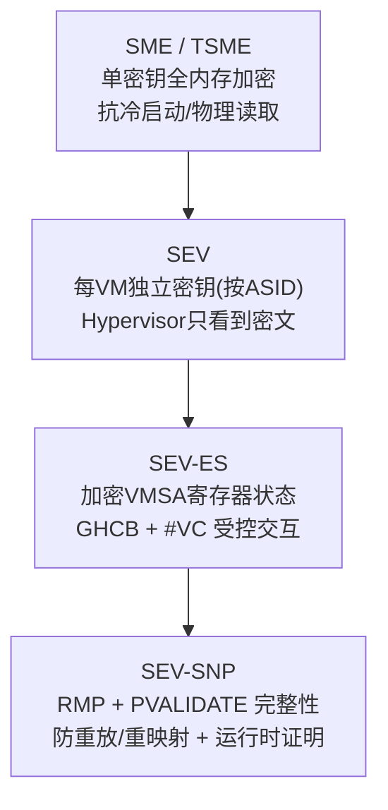
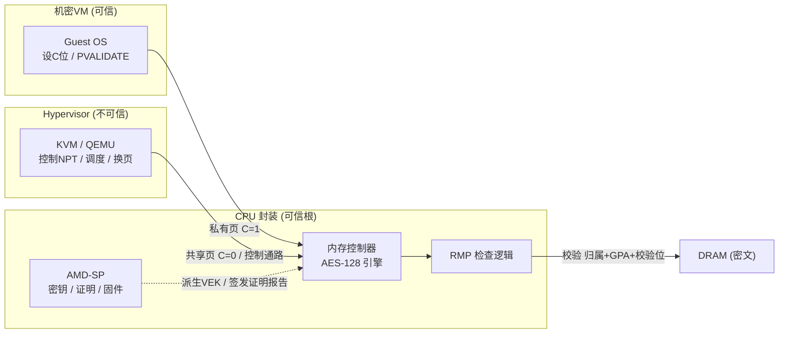
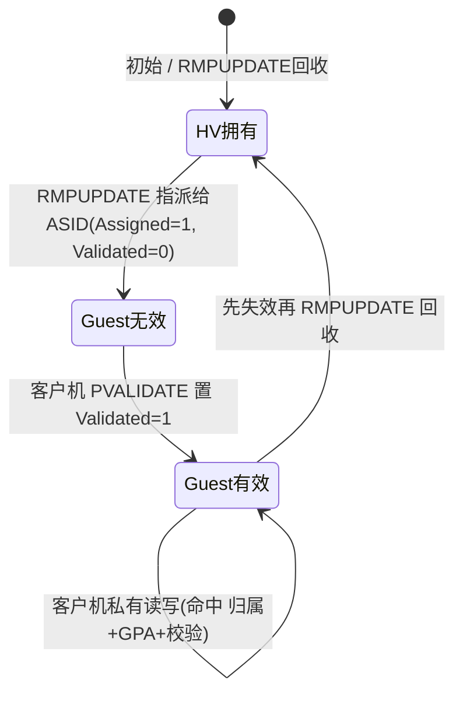
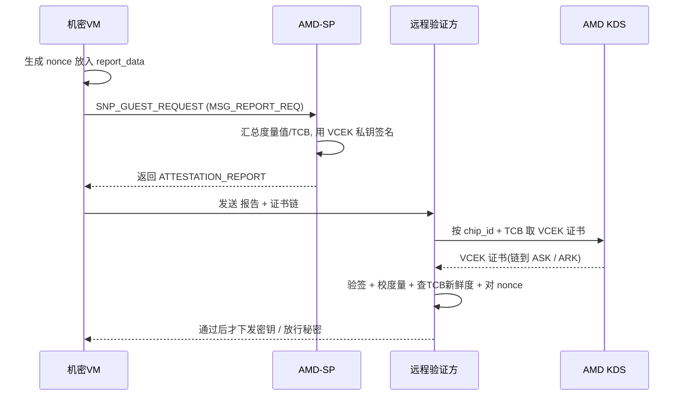

# 虚拟化与TEE机密计算（13）· AMD-SEV与机密虚拟机
> [!abstract] TL;DR
> - AMD-SEV 把「整台虚拟机」当作机密计算单元：内存控制器里的 AES 引擎按 ASID 给每台 VM 配独立密钥，让不可信 Hypervisor 拿到的只是密文——这是与 Intel-SGX「把应用改造进 Enclave」完全不同的路线（lift-and-shift 原封不动搬迁 vs 重写应用）。
> - 三代演进各补一块短板：SEV 只加密内存但寄存器仍明文；SEV-ES 用加密的 VMSA + GHCB + `#VC` 把寄存器状态也保护起来；SEV-SNP 引入 RMP 反向映射表 + `PVALIDATE`，补上「完整性 / 防重放 / 防重映射」这块最致命的缺口。
> - SNP 的完整性不是 SGX 那种加密 Merkle 树，而是硬件为每个物理页在 RMP 里记「归属 + 校验位」，保证「私有页只能被属主 VM 写、且读到的一定是自己最后写入的值」，代价是每次访存多一趟 RMP 查表。
> - 证明链由 AMD 根密钥 `ARK → ASK → VCEK` 逐级签名，VCEK 由芯片唯一秘密与 TCB 版本共同派生，报告里带 384 位启动度量值与 guest 提供的 nonce——回滚固件会换掉密钥、令旧报告作废，从而挡住降级攻击。
> - SEV 不是银弹：确定性加密带来密文侧信道（CipherLeaks），加上 CacheWarp、WeSee、AMD-SP 电压毛刺等攻击，说明「先验证证明报告、再注入密钥，并保持 TCB 最新」才是唯一正确用法。

## 概述与定位

机密计算要解决的是「使用中数据（data in use）」的保护问题。传统加密只覆盖静态存储（at rest）与传输链路（in transit），而数据一旦被载入内存参与运算，就以明文暴露给操作系统、Hypervisor 乃至云平台运维人员。在公有云场景里，租户被迫把「宿主机管理员不会窥探我的内存」当成信任前提——而 AMD-SEV（Secure Encrypted Virtualization，安全加密虚拟化）要做的，正是从体系结构层面把这个前提变成可验证的密码学保证：**让 Hypervisor 失去读取客户机明文内存的能力，从而把它踢出可信计算基（TCB）**。

在 TEE 的大版图（详见 [[10.可信执行环境TEE全景]]）里存在两条技术路线。一条是 **Enclave 路线**，以 Intel-SGX 为代表（见 [[11.Intel-SGX架构与Enclave]]），思路是把 TCB 缩到极小——只信任一小段被隔离的应用代码，但代价是应用必须重写、切分成 enclave 内外两半。另一条是 **机密虚拟机（Confidential VM）路线**，以 AMD-SEV、Intel TDX、ARM CCA 为代表，思路相反：把一整台未经修改的虚拟机（含 Guest OS 与全部应用）作为机密单元整体加密。SEV 的最大卖点就是 **lift-and-shift**——现有负载几乎原封不动搬进机密 VM 即可，代价是 TCB 大得多（整个 Guest OS 都在信任边界内）。

要精确理解 SEV，必须先钉死它的**威胁模型**：

- **可信**：CPU 封装内部（含内存加密引擎）、AMD-SP 安全处理器及其签名固件、以及客户机自身（Guest OS + 应用）。
- **不可信**：Hypervisor、宿主 OS、同宿主上的其它 VM、云平台管理员、以及连接在总线上的外设。对纯物理层（DRAM 冷启动读取）而言，SME/SEV 的加密只保证机密性、不保证完整性。
- **不在防护范围（by design）**：微架构侧信道、以及后文要重点讲的**密文侧信道**——这些属于 [[15.Enclave逆向与侧信道攻击]] 的主战场，SEV 只做有限缓解。

SEV 家族是逐代长出来的，每一代都精确对应一类被攻破的短板，这条演进线是理解全篇的骨架：



- **SME（Secure Memory Encryption）/ TSME（Transparent SME）**：随 Zen 架构 EPYC（Naples，2017）引入。用一把密钥透明加密内存，主要对抗**物理攻击**（有人拔内存条冷启动读取）。TSME 由固件开启、对软件全透明，是裸机安全的基础件。
- **SEV**：给**每台 VM** 一把独立密钥，Hypervisor 读客户机内存只能得到密文。这是「机密虚拟机」的起点，但寄存器状态未保护。
- **SEV-ES（Encrypted State）**：把 VMEXIT 时保存的寄存器状态也加密，堵住「从 VMCB 直接读客户机寄存器」的口子。
- **SEV-SNP（Secure Nested Paging）**：补上**内存完整性**与**运行时证明**，是当前机密虚拟机的主力形态，也是本篇第三段深挖的核心。

## 原理与机制

### 可信根：AMD-SP 与内存加密引擎

SEV 的信任锚点是 **AMD-SP（AMD Secure Processor，早期叫 PSP）**——一颗独立于 x86 核心的协处理器（基于 ARM Cortex-A5），运行 AMD 签名的固件，负责生成/托管所有加密密钥、执行 SEV API 命令、以及最终**签发证明报告**。密钥在 AMD-SP 内部生成，**从不以明文暴露给任何 x86 侧软件**——包括 Hypervisor，也包括客户机自己。Hypervisor 只能通过一组「命令接口」（SEV API / SNP ABI）请求 AMD-SP 做事（启动加密 VM、度量、回收密钥），而拿不到密钥本身。

真正干加解密活的是**内存控制器里的 AES-128 引擎**：数据在写回 DRAM 前被加密、从 DRAM 读入前被解密，全程对流水线透明。关键在于——**CPU 缓存里保存的是明文**，只有落到 DRAM 的那一刻才是密文。这解释了为什么 SEV 能抗「拔内存条冷启动」却不能天然抗「能观察缓存的微架构侧信道」。

### C 位：一个物理地址比特决定「私有还是共享」

SEV 复用**物理地址中的一个比特**作为加密开关，业界称之为 **C 位（C-bit / encryption bit）**。页表项里把该位置 1，则这一页走加密通路（私有页）；置 0 则明文存放（共享页，用于和 Hypervisor 做 I/O）。C 位的具体位置、以及因此损失的物理地址位数，由 CPUID 报告：

```
CPUID Fn8000_001F：
  EAX bit0 SME  bit1 SEV  bit3 SEV-ES  bit4 SEV-SNP ...
  EBX[5:0]   C 位在物理地址中的位置 (Cbit)
  EBX[11:6]  因加密而减少的可用物理地址位数 (PhysAddrReduction)
  ECX        本平台支持的加密客户机数 / ASID 数
客户机内 MSR 0xC001_0131 (SEV_STATUS)：bit0 SEV, bit1 SEV-ES, bit2 SEV-SNP 是否生效

页表项 C 位 = 1 → 该页私有(加密)；C 位 = 0 → 该页共享(明文, 供 virtio/DMA 等 I/O)
```

**为什么用地址比特而不是单独的控制寄存器？** 因为分页机制天然是「按页」管理的，把加密属性塞进物理地址就能让**同一台 VM 内不同页有不同加密语义**，且沿用现有 TLB/页表硬件通路，几乎零额外结构成本。代价是牺牲了一位物理地址位（可寻址物理内存上限相应缩小），这在 CPUID 里明确告知系统软件。

### 从 SME 到 SEV：ASID 选密钥

SME 只有一把密钥。SEV 的关键跃迁是**每台 VM 一把密钥（VEK，VM Encryption Key）**，靠硬件的 **ASID（Address Space ID）**标签来选：VM 运行时带着自己的 ASID，内存引擎据此选用对应密钥。Hypervisor 自己跑在 ASID 0（或另一套密钥）下，因此它去访问客户机的私有页时，硬件用「错误的密钥」解密，得到的只是乱码密文。**「换个密钥就读不懂」正是 SEV 隔离的物理本质**。ASID 数量是有限硬件资源（不同代 EPYC 常见几百个量级），这构成一个实际运维上限：**同时运行的机密 VM 数受 ASID 池约束**，池耗尽就起不了新 SEV VM。

客户机自己决定哪些页私有、哪些共享：绝大多数内存置 C=1 保护起来，只有需要和外界交换数据的缓冲区（virtio 队列、DMA bounce buffer / SWIOTLB）置 C=0 明文共享。**这条「共享页是唯一的合法明文通道」的边界，后面安全一节会反复出现**——凡从共享页读进来的数据都等于「攻击者可控输入」，必须像处理网络输入一样校验。

### SEV-ES：把寄存器状态也关进保险箱

SEV 有个刺眼的漏洞：**VMEXIT 时 CPU 会把客户机通用寄存器保存进 VMCB，而 VMCB 是 Hypervisor 可读的**——于是加密了内存却漏了寄存器，攻击者能直接读走 RAX/RIP 甚至寄存器里的密钥。SEV-ES 的解法是引入 **VMSA（VM Save Area）**：客户机寄存器状态被保存进**用客户机密钥加密**的 VMSA，Hypervisor 看不到明文。

但 Hypervisor 处理某些退出（如 I/O 端口、CPUID、部分 MSR 访问）确实需要知道少量寄存器值。SEV-ES 为此设计了**受控暴露**机制：

- **自动退出（AE）**：硬件能自行处理的退出，客户机状态始终加密。
- **非自动退出（NAE）**：需要 Hypervisor 介入的事件，会在客户机内触发 **`#VC` 异常（VMM Communication Exception，向量 29）**。客户机的 `#VC` 处理程序把「本次确实需要共享的那几个寄存器」显式填进一块共享页 **GHCB（Guest-Hypervisor Communication Block）**，再执行 `VMGEXIT` 退出给 Hypervisor。

**这个设计把控制权翻转了**：不再是「硬件默认把一切寄存器倒给 Hypervisor」，而是「客户机自己决定每次向外暴露哪几个寄存器」。GHCB 建立之前的早期启动阶段，还有一套基于 GHCB MSR（0xC0010130）的精简协议兜底。`#VC`/`VMGEXIT` 与传统 `VMEXIT`/hypercall 的关系可对照 [[08.VMExit与超级调用hypercall]] 理解。

### 为什么 SEV-ES 还不够：NPT 仍在 Hypervisor 手里

即便加密了内存和寄存器，Hypervisor 依然掌控**嵌套页表 NPT**（GPA→SPA 的映射，见 [[03.内存虚拟化：EPT与NPT与影子页表]]）以及页的换入换出。这意味着它虽读不懂密文，却能**重排、重放、重映射、别名化**这些密文页——把 VM 当成一个「加解密预言机」来间接套取信息，或往里注入构造好的密文。这类完整性缺失正是 SEV/SEV-ES 被系列攻击攻破的根因，也逼出了 SEV-SNP。下图勾勒各部件的信任边界：



## SEV-SNP 内存完整性与证明链详解

这是本篇技术密度最高的一段，围绕两根支柱展开：**RMP 反向映射表提供的完整性**，与 **ARK/ASK/VCEK 构成的证明链**。前者解决「Hypervisor 能否篡改我」，后者解决「远端凭什么相信我真的跑在正版 SNP 里」。

### 完整性缺口有多致命：先看它堵的是什么

SEV/SEV-ES 只给机密性、不给完整性，具体后果是：

- **重映射（remapping）**：Hypervisor 改 NPT，把 VM 的 GPA X 指向另一块物理页，或把两个 GPA 别名到同一物理页，制造信息交叉。
- **重放（replay）**：先保存某私有页的旧密文，稍后覆盖回去，把 VM 的内存回退到历史状态。
- **注入（injection）**：原始 SEV 的加密是**确定性**的——密文只由「明文 + 物理地址」决定（XEX 类可调分组密码，tweak 是物理地址的函数，无 nonce/计数器）。一旦攻击者摸清 tweak 函数（**SEVurity**，2020），配合无完整性，就能构造出「解密后是我想要的指令」的密文注进去，等于往加密 VM 里植入代码。
- **加解密预言机**：**SEVered**（2018）利用重映射把 VM 变成解密预言机，成片提取明文。

SNP 的目标就是用一套**硬件强制的所有权/一致性检查**把这些全部变成可被检测的错误。

### RMP：反向映射表如何锁死每一个物理页

SNP 的核心新结构是 **RMP（Reverse Map Table，反向映射表）**：**全系统唯一一张表，为每个 4KB 系统物理页（SPA）保留一条 16 字节条目**，位于固件预留的保护内存中。名字里的「反向」是精髓——普通嵌套页表是 `GPA → SPA` 的正向映射，而 RMP 记录 `SPA → (属主, 该属主眼中的 GPA)` 的**反向**信息，于是硬件可以反过来核对「Hypervisor 给出的这条正向映射是否自洽」。

```
RMP 条目（每 4KB 系统物理页一条，16 字节）关键字段：
  Assigned   : 该页是否已指派给某个客户机（1=已指派）
  ASID       : 属主客户机的地址空间ID（决定用哪把密钥）
  GPA        : 属主客户机看到的 guest 物理地址（页号）
  Validated  : 客户机是否已对该页执行过 PVALIDATE
  Page_Size  : 0 = 4KB, 1 = 2MB
  Immutable  : 仅固件可改（用于 VMSA、固件页等）
  VMPL0..3   : 每个特权级各自的 读/写/执行 许可
  Lock       : 原子更新用

硬件对「客户机私有访问」的放行条件（任一不满足 → RMP 违例 / #NPF）：
  Assigned == 1  且  RMP.ASID == 本VM的ASID
  且  RMP.GPA == 本次访问所用的 GPA
  且  Validated == 1
```

SNP 生效后，**每一次内存访问都要在 NPT 走完得到 SPA 之后，再查一次 RMP** 做上述核对。这一条组合拳同时封死多种攻击：

- **单一属主**：一个物理页只能属于一个 ASID，Hypervisor（ASID 0）自然读不了客户机私有页；两个客户机也无法别名到同一物理页。
- **GPA 绑定**：条目里记着「属主认为这页应该出现在哪个 GPA」，若 Hypervisor 偷偷改 NPT 把它挪到别的 GPA，访问时 `RMP.GPA` 对不上，硬件直接报错——**重映射当场失效**。
- **反重放**：私有页归属稳定，Hypervisor 无法把别的内容伪装成该页而不被 GPA/ASID 校验拦下。

由此得到 SNP 对完整性的**精确承诺**：*若客户机能读到一个私有页，它读到的一定是自己最后写入该页的值*。注意这**不是** SGX 内存加密引擎那种加密 Merkle 树式的密码学完整性（那种能检测 DRAM 单比特翻转），而是**基于所有权跟踪的一致性保证**——更省（无需为每页存 MAC、无需完整性树遍历），但也因此 SNP 明确**不宣称**能抵御「有能力任意改写 DRAM 的物理攻击者」，它的靶子始终是**恶意 Hypervisor**。这是与 [[11.Intel-SGX架构与Enclave]] 完整性模型的关键分野。

### PVALIDATE：为什么「验证必须由客户机亲自做」是命门

RMP 里的 `Validated` 位是防线的枢纽。规则是：**一个私有页在首次使用前，必须由客户机自己执行 `PVALIDATE` 指令把 Validated 置 1**，硬件只承认「客户机亲手验证过」的页。反过来，Hypervisor 侧用 `RMPUPDATE`（指派/回收页、改页大小）、`PSMASH`（把 2MB 条目拆成 4KB）操作 RMP，但**它无权替客户机设置 Validated**。

**为什么非得客户机亲自验证？** 设想若 Hypervisor 能预先「验证」一个它控制的页再塞给客户机，重映射攻击就复活了。把 `PVALIDATE` 设成**只能在客户机上下文里执行、且客户机自己记账**（同一页重复验证会返回错误），就确保了「这页确实是我这台 VM 主动纳入、且只纳入一次」的语义。页状态机因此收敛为三态：



### VMPL：机密 VM 内部再分层

SNP 还引入 **VMPL（Virtual Machine Privilege Level，0–3，VMPL0 最高）**，RMP 条目为每个 VMPL 记录独立的 RWX 许可，`RMPADJUST` 供客户机调整。**这让机密 VM 内部也能做纵深防御**：可以在 VMPL0 跑一个极小的可信服务层 **SVSM（Secure VM Service Module，如 COCONUT-SVSM）**，向跑在 VMPL1 的 Guest OS 提供 **vTPM**（度量启动能力，见 [[14.TPM与度量启动]]）、实时迁移代理等服务——把这些敏感能力从庞大的 Guest OS 里剥离出来，缩小其可攻击面。

### 证明链：从 AMD 根密钥到一份可验证的报告

有了机密性和完整性，还差最后一环：**远端凭什么相信「和我通信的这台 VM，真的是运行在正版 SNP 硬件上、装载的是我期望的镜像、且 TCB 没被降级」？** 这靠**远程证明（attestation）**与一条自 AMD 根信任逐级向下的**证明链**：

- **ARK（AMD Root Key）**：AMD 的自签名根密钥，按产品线（如 Milan、Genoa）各一把。
- **ASK（AMD SEV Signing Key）**：由 ARK 签名。
- **VCEK（Versioned Chip Endorsement Key）**：由**芯片内熔丝烧死的唯一秘密**与**当前 TCB 版本**共同派生，其证书由 AMD 的 **KDS（Key Distribution Service，`kdsintf.amd.com`）**签发并链到 ASK。也可用 **VLEK（Versioned Loaded Endorsement Key）**——由云厂商加载的替代密钥，便于在不暴露 chip_id 的前提下背书。

**TCB 版本被"焊进"密钥派生**，是这条链最精巧之处。TCB 版本包含 bootloader、TEE（PSP OS）、SNP 固件、微码四个 SVN。一旦运维把固件/微码回滚到有已知漏洞的旧版，芯片派生出的 VCEK 随之改变，旧 TCB 对应的证书便无法验证「当前上报的 TCB」——**降级攻击天然被密钥体系拒绝**。验证方只需检查 `reported_tcb` 是否足够新即可拒绝陈旧平台。

启动时，AMD-SP 通过 `SNP_LAUNCH_START/UPDATE/FINISH` 对**初始内存逐页**（含 GPA、页类型、内容）以及**每个 vCPU 的 VMSA** 做 SHA-384，得到 384 位**启动度量值**；镜像属主还能用 ID block/auth block 预先授权「期望的度量值与签名密钥」。运行时，客户机可随时向 AMD-SP 索取一份证明报告：

```
SNP ATTESTATION_REPORT 关键字段（v2 约 1184 字节，尾部为签名）：
  version / guest_svn / policy       报告版本、客户机SVN、启动策略(debug/迁移/SMT/最低ABI)
  family_id / image_id / vmpl        身份标识与请求所在的 VMPL
  current_tcb / reported_tcb         当前与上报的 TCB(bootloader/TEE/SNPfw/ucode 四个SVN)
  platform_info                      SMT、TSME 等平台状态
  report_data[64]                    客户机提供的 nonce（绑定挑战、防重放）
  measurement[48]                    启动度量值 SHA-384（初始内存 + 各 vCPU VMSA）
  host_data[32] / id_key_digest[48]  宿主注入数据 / 授权 ID 密钥摘要
  chip_id[64]                        芯片唯一标识（据此向 KDS 取 VCEK 证书）
  signature                          ECDSA P-384（VCEK 私钥签名整份报告）
```

完整的运行时证明流程如下：



**验证方要逐项核对**：ARK 自签名 → ASK 由 ARK 签 → VCEK 由 ASK 签（经 KDS 证书）→ 报告由 VCEK 签；再比对 `measurement` 是否等于期望镜像的度量值、`policy` 是否可接受、`reported_tcb` 是否够新、`report_data` 是否等于本次下发的 nonce。**全部通过后，才把磁盘解密密钥等秘密下发给这台 VM**。与 SGX 证明（度量的是单个 enclave）、TrustZone（见 [[12.ARM-TrustZone与安全世界]]）相比，SEV 证明的粒度是**整台 VM 的启动全景**，这正是「机密虚拟机」路线的直接体现。

## 工具视角与实战

**特性探测**是第一步。宿主侧看 SYSCFG MSR（0xC0010010）的内存加密/SNP 使能位、以及 `/sys/module/kvm_amd/parameters/sev*`；客户机内读 CPUID `Fn8000_001F` 与 `SEV_STATUS`（MSR 0xC0010131）即可判定当前处于 SEV / SEV-ES / SEV-SNP 哪一档。

**宿主软件栈**：KVM 通过 `/dev/sev` 向 AMD-SP 固件下命令；QEMU 用 `-object sev-guest,...` 或 `-object sev-snp-guest,...` 配置策略、C 位位置（`cbitpos`）、`reduced-phys-bits` 等；客户机固件用支持 SEV/SNP 的 **OVMF**（AmdSev/AmdSevX64 构建）。整条链要求**宿主 BIOS、宿主内核、客户机内核、OVMF** 全部具备 SNP 支持，缺一环则悄悄降级或起不来——这是实战里最常见的踩坑点。

**客户机证明工具**：virtee 生态（Rust）的 `snpguest` 可通过 `/dev/sev-guest` 的 ioctl（`SNP_GET_REPORT`、`SNP_GET_DERIVED_KEY`）取报告、从 KDS 拉取 VCEK 证书并本地验签；宿主侧 `sevctl`/`sev-tool` 管理平台与证书。机密容器领域（Kata Containers、CNCF Confidential Containers/CoCo）把这套证明流程封装成「启动即证明、证明通过才解密镜像层」的自动化管道。

**逆向与运维视角——你能看到什么、看不到什么**，这是本节最有价值的部分：

- 从宿主 dump 客户机 RAM，得到的是**密文**；SEV-ES/SNP 下连 VMSA（寄存器现场）也是密文，普通 KVM 调试无法单步进入私有态。
- **调试开关是巨大的安全旋钮**：SEV 的启动 policy 里有 DEBUG 位，一旦置位，Hypervisor 便可用 `LAUNCH_/DBG_DECRYPT`/`DBG_ENCRYPT` 读写客户机明文——**生产环境必须关闭**，否则机密性形同虚设。逆向研究者往往正是在本地开 DEBUG policy 来观察加密 VM 内部。
- **AMD-SP 固件是签名 blob**，安全研究者会逆向 PSP 固件、分析其命令解析与密钥管理；而客户机**内部**用 gdb 调试与普通 Linux 无异——信任边界之内一切照常。
- 想研究密文本身的规律（例如复现密文侧信道），可在宿主侧持续观测某固定物理地址（如 VMSA 页）的密文变化——这正是下节 CipherLeaks 类攻击的观测手法。

## 安全性与正确使用

**先钉死能力边界**：SEV 防的是「恶意 Hypervisor / 同租户 / 云管理员**读取或篡改**客户机内存与寄存器」。它**不**完整防护：针对 DRAM 的物理完整性攻击（SME 的 AES 无完整性）、微架构侧信道，以及——影响最深远的——**密文侧信道**。逐一看历代攻击，正是理解「正确用法」的最好教材：

- **SEVered（2018）**：无完整性 + NPT 重映射 → 把 VM 当解密预言机提取明文。SNP 的 RMP 从原理上封死。
- **SEVurity（2020）**：已知 tweak 函数 + 无完整性 → 注入可执行密文。SNP 完整性解决。
- **CipherLeaks / 密文侧信道（USENIX 2021）**：因 SEV 加密是**确定性**的（同一物理地址、同一明文 → 同一密文），攻击者持续观测**固定地址的 VMSA 密文**，即可建立「密文块 ↔ 寄存器值」字典，在 VM 做 RSA/ECDSA 时泄漏寄存器、进而恢复密钥。**SNP 并未彻底根除**：它保完整性，却仍保留确定性加密。AMD 的缓解是对 VMSA 加随机化保护，但作为一类问题依然存在——**因此客户机内的密码学实现必须是常量时间、且避免把秘密放在固定地址**，不能指望 SEV 替你抹平。
- **CacheWarp（CVE-2023-20592，2023）**：Hypervisor 用 `INVD` 丢弃（不写回）已修改的缓存行，把客户机内存回退到旧的、同样"合法"的状态，绕过「读到最后写入值」的直觉。已由微码修复。
- **WeSee / Heckler（2024）**：向 SNP 客户机**恶意注入 `#VC`（向量 29）或中断**，诱使客户机处理器解析攻击者可控数据，达成读写内存或劫持控制流。缓解依赖 SNP 的 **Restricted / Alternate Injection** 特性 + 客户机对注入事件与共享内存输入的严格校验。
- **AMD-SP 电压毛刺（Buhren 等，CCS 2021，"One Glitch to Rule Them All"）**：物理注入故障提取芯片背书密钥，从而**伪造证明报告**。需物理接触，新芯片有缓解——它提醒验证方要检查芯片撤销与 TCB。

据此，**正确使用与加固边界**可归纳为几条硬规则：

1. **证明是唯一入口，且不可跳过**：绝不向一台「未经完整验证」的 VM 下发任何秘密。验证必须覆盖——证书链、`measurement` 匹配期望镜像、`policy` 可接受、`reported_tcb` 足够新、`report_data` 等于本次 nonce。**把秘密与度量值绑定**（度量不符即拒发）。
2. **收紧启动 policy**：生产环境**关闭 DEBUG**、要求 SNP 与最低 ABI 版本、非必要不允许迁移（迁移须走可信 MA 迁移代理）、按需处理 SMT。
3. **保持 TCB 最新**：微码/固件不落后，验证方主动拒收陈旧 `reported_tcb`——这与 VCEK「按 TCB 派生」的设计配合，才能真正堵住降级。
4. **善用 VMPL0/SVSM**：把 vTPM、迁移代理等敏感服务下沉到 VMPL0，缩小 Guest OS 的信任面。
5. **把共享内存当敌意输入**：C=0 的共享页（virtio、bounce buffer）里的一切都可能被 Hypervisor 篡改，客户机驱动必须像校验网络包一样校验它——这是抵御 WeSee 类注入的关键。
6. **不要越界依赖**：SEV 不负责抗侧信道、也不抗物理完整性攻击，密码学代码仍需常量时间实现。ASID 池是硬上限，容量规划要计入。

## 小结

SEV 家族是一条「逐代补短板」的清晰演进：SME 加密内存 → SEV 每 VM 独立密钥、把 Hypervisor 挡在密文外 → SEV-ES 用加密 VMSA + GHCB + `#VC` 保护寄存器现场 → SEV-SNP 用 **RMP + PVALIDATE** 补上完整性、用 **ARK/ASK/VCEK + 启动度量** 补上运行时证明。两个「命门」值得反复记住：**RMP 的反向映射 + 客户机亲自 PVALIDATE**，是完整性的技术核心，靠「所有权一致性」而非加密 Merkle 树，省而够用、但只针对恶意 Hypervisor；**TCB 版本焊进 VCEK 派生**，让证明链天然抗降级。作为机密虚拟机路线的代表，SEV 的价值在于让现有负载 lift-and-shift 进机密环境，但其安全性**完全系于「先证明、后授信」这一纪律**，且始终残留确定性加密带来的密文侧信道与注入类攻击面——用得对，它是把 Hypervisor 逐出 TCB 的利器；用得草率（不验证、开 DEBUG、TCB 陈旧），它只是一层可被绕开的糖衣。

## 相关阅读

- 同系列 · 定位与对照：[[10.可信执行环境TEE全景]] · [[11.Intel-SGX架构与Enclave]] · [[12.ARM-TrustZone与安全世界]]
- 同系列 · 机制承接：[[03.内存虚拟化：EPT与NPT与影子页表]]（NPT 是 RMP 的前置）· [[08.VMExit与超级调用hypercall]]（`#VC`/`VMGEXIT` 对照）
- 同系列 · 后续延伸：[[14.TPM与度量启动]]（vTPM 与度量启动）· [[15.Enclave逆向与侧信道攻击]]（密文侧信道深挖）
- 内核呼应：[[38.Windows内核与驱动逆向/25.HyperV架构与VBS]] · [[38.Windows内核与驱动逆向/29.CI.dll与代码完整性WDAC]]
- 硬件承接：[[21.Asm/40 虚拟化扩展对比]] · [[24.内存管理与堆分配器/02.进程地址空间与虚拟内存]]
- 启动链呼应：[[39.固件与IoT嵌入式逆向/21.安全启动链绕过技术]]（度量启动 / TPM）
- 官方规范与文档：AMD《SEV-SNP: Strengthening VM Isolation with Integrity Protection and More》白皮书；《AMD64 Architecture Programmer's Manual, Vol.2 System Programming》§15.34 SEV/SNP；《SEV Secure Nested Paging Firmware ABI Specification》；《SEV API Specification》；《GHCB Specification》；Linux 内核 `Documentation/virt/coco/sev-guest.rst`；AMD KDS（Key Distribution Service）与 VCEK 证书格式说明；virtee `snpguest`/`sev` 工具文档

[[00.虚拟化与TEE机密计算总览|⬆ 系列总览]] | [[12.ARM-TrustZone与安全世界|← 上一章]] | [[14.TPM与度量启动|→ 下一章]]
