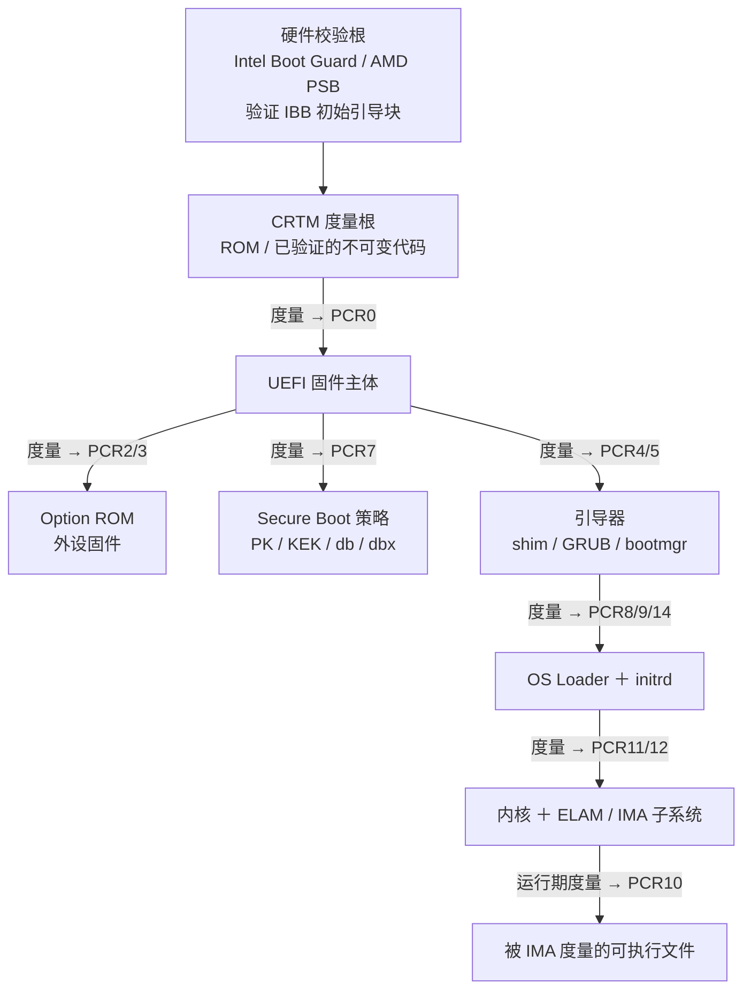
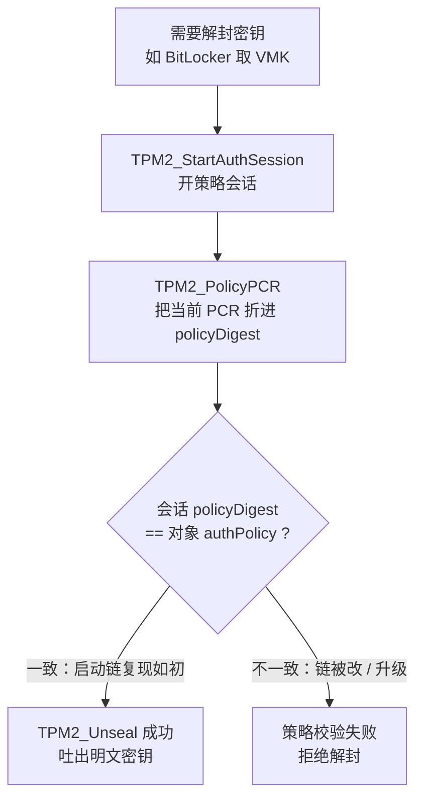
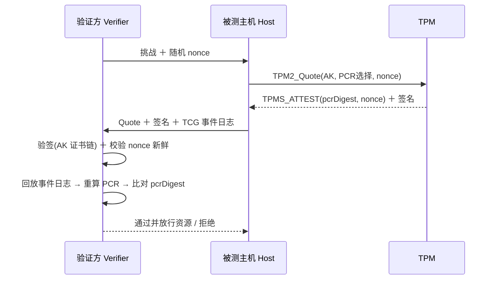

# 虚拟化与TEE机密计算（14）· TPM与度量启动

> [!abstract] TL;DR
> - TPM 是**被动信任锚**：它自己不阻止任何代码运行，只干两件事——「记账」（把度量值单向累积进 PCR）和「背书」（用受保护密钥签报告、按 PCR 状态密封/解封密钥）；策略判定发生在验证方或解封方，而非 TPM 内部。
> - PCR 的唯一写入手段是单向 extend：`PCR ← H(PCR ‖ 度量)`，**顺序敏感、不可回退、重启才清零**，因此一组 PCR 唯一地把整条启动链「指纹化」，改动任一环节都会导致终值发散。
> - 度量链靠「先度量后执行」的传递信任从 CRTM 逐级展开；SRTM 自上电起累积（占 PCR0–15），DRTM（Intel TXT `SENTER` / AMD `SKINIT`）可在运行中重建信任根（占 PCR17–22，复位初值是全 1 而非全 0）。
> - 密封（Seal）把密钥绑定到 PCR 状态，只有启动链复现出同一组 PCR 才能解封（Unseal）；BitLocker 正是据此把卷主密钥 VMK 锁进 TPM——这是「度量」真正产生强制力的地方。
> - 度量启动是「**检测**」而非「阻止」，与 Secure Boot 的「拦截」互补；单看 PCR 值毫无意义，必须配 **TCG 事件日志回放**才能审计出到底度量了什么。
> - dTPM 的致命软肋在**总线**：TPM-only 的 BitLocker 会让 VMK 明文流过 LPC/SPI 被嗅探；fTPM 无外部总线但与 CPU 同芯，面临 TPM-Fail 时序侧信道、faulTPM 电压故障注入等新型攻击。

## 概述与定位

在前面几章里，我们看到的 SGX、TrustZone、SEV/TDX 都是「让一段代码或一台虚拟机在不可信环境里保密运行」的**执行侧**技术。本章的 TPM 属于另一条正交的轴：它不提供隔离执行环境，不加密你的内存，也不跑你的 enclave；它是一块**专职做「可信度量、密钥保管与远程证明」的密码学协处理器**。一句话定位——前几章解决「我运行时别被人看/被人改」，TPM 解决「我这台机器**从上电到内核**这条启动链，到底是不是我期望的那个样子，并且能不能拿出可验证的证据」。

要理解 TPM 的一切设计，先记住它的**被动性**：TPM 是个 slave 设备，挂在 LPC/SPI/I²C 总线或集成在芯片组里，CPU 通过读写它的寄存器接口（TIS 或 CRB）下发 `TPM2_*` 命令、取回响应。它**从不主动打断启动**，也没有能力去「拦截」某个不合规的引导器。它能做的仅仅是：当别人（固件、引导器、内核）把一段度量喂给它时，把这段度量**不可逆地累加**进内部的平台配置寄存器（PCR）；以及在需要时，用只有它自己知道的密钥去**签名**当前 PCR 快照，或**按 PCR 状态解封**一份密钥。判定「这条链是否可信」这件事，永远发生在 TPM 之外——要么是远端验证方拿到签名报告后比对，要么是解封逻辑「PCR 不对就解不出密钥」。

这就引出与 Secure Boot 的关键区别，也是本章反复呼应 [[39.固件与IoT嵌入式逆向/21.安全启动链绕过技术]] 的原因。Secure Boot 是**阻止式（enforcement）**的门卫：签名不对就拒绝加载，是「预防」。度量启动（Measured Boot）是**记录式（recording）**的公证员：无论好坏，来什么都度量、都放行，把证据留在 PCR 里，「好坏」留到事后由密封/证明来裁决，是「检测」。二者互补而非替代——Secure Boot 挡掉已知坏东西，Measured Boot 留下可审计的完整轨迹，即便攻击者用了一个「签名合法但被恶意配置」的组件，Secure Boot 放它过去，PCR 却会忠实记下它的指纹。

TPM 的价值最终要落到三个动词上，本章围绕它们展开：**度量（measure）**——把启动链每一环的哈希 extend 进 PCR；**密封（seal/unseal）**——把秘密绑定到「正确的 PCR 状态」，环境不对就取不出（BitLocker、systemd-cryptenroll 的根基）；**证明（attest/quote）**——把 PCR 快照签名交给远端核验（远程证明、设备健康证明，也是机密虚拟机 vTPM 与硬件证明报告对接的桥梁）。理解了「度量→密封/证明」这条主线，TPM 就不再是一堆晦涩命令，而是一台「启动链的记账＋公证机」。

## 原理与机制

### TPM 的物理形态与内部构造

TPM 是 TCG（Trusted Computing Group）定义的标准，有多种落地形态，威胁模型各异：**dTPM（离散芯片）**是主板上一颗独立封装、挂在 LPC 或 SPI 总线上的安全芯片，物理独立但**通信要过外部总线**（这正是嗅探攻击的入口）；**fTPM（固件 TPM）**把 TPM 逻辑跑在已有 TEE 里——Intel PTT 跑在 CSME/ME、AMD fTPM 跑在 PSP、ARM 平台跑在 TrustZone 安全世界，无外部总线但与主 CPU 共享硅片，暴露于故障注入/侧信道；**集成 TPM**做进芯片组；**vTPM（虚拟 TPM）**是纯软件实现（swtpm），供虚拟机使用，也是本系列机密虚拟机的关键拼图。Windows 11 的硬性门槛是 **TPM 2.0**，把这块从「服务器/企业机可选」推成了消费级标配。

内部构造上，TPM 2.0 是一台小型密码机，含：**真随机数发生器（RNG）**、**哈希引擎**（SHA-1/SHA-256，高端含 SHA-384）、**非对称引擎**（RSA-2048、ECC P-256 等）、**非易失存储 NV**（存永久密钥、单调计数器、用户自定义 NV index）、**易失的 PCR 组**，以及组织密钥的**层级（hierarchy）**。2.0 用四个层级替代了 1.2 僵硬的单一密钥树：**平台层（Platform）**给固件用、**存储层（Owner/Storage）**给 OS 与用户用、**背书层（Endorsement）**承载身份、**空层（Null）**每次重启即换根。每个层级有一颗**主种子（Primary Seed）**，主密钥不是随机生成后存起来，而是用 KDF 从「种子＋模板」**确定性派生**——这意味着同样的模板每次都派生出同一把主密钥，无需在 NV 里占地方存它。**背书密钥 EK** 就从背书种子按标准模板派生，出厂时厂商签发 **EK 证书**，成为「这确实是一颗真 TPM」的身份根。

### PCR：只能累加、不能改写的度量寄存器

平台配置寄存器 PCR 是理解 TPM 的核心。每个 PCR 是一个哈希长度的寄存器（SHA-256 bank 里是 32 字节），**你无法直接写它一个值**，唯一的更新方式是 **extend（延伸）**：

```
extend 操作：  PCR_new = H( PCR_old ‖ digest )
其中 digest = 本次要度量的数据的哈希（长度＝该 bank 的哈希长度）
初值：       上电复位后，PCR0–16、23 = 全 0；PCR17–22 = 全 1（0xFF…FF）
清零时机：   只有平台复位（重启/掉电）才把 PCR 归位；运行期永远只能继续 extend
```

这个设计有三个「为什么」值得讲透。**其一，为什么单向？** 因为 `H(PCR ‖ x)` 依赖旧值，攻击者即便控制了 extend 的输入，也无法把 PCR「改回」某个期望值——要达到目标终值，等价于对哈希做原像/碰撞攻击。于是「一旦度量进去，就抹不掉」。**其二，为什么顺序敏感？** extend 是链式折叠，先 A 后 B 与先 B 后 A 得到完全不同的终值，因此 PCR 不仅记录了「度量了哪些东西」，还记录了「以什么顺序」，把启动的因果链固化进去。**其三，为什么用少量寄存器聚合而非逐条存？** 因为 TPM 资源极其有限，一条链上百个组件不可能各占一个寄存器；用一个 PCR 折叠任意多次度量，是把「无界长度的历史」压进「定长指纹」的工程折中——代价是 PCR 终值不可读懂，必须借助**事件日志**回放才知道里面到底累加了什么。

TCG 为 PC 平台约定了 PCR 的用途分配，这张表是读懂任何一台机器度量结果的字典：

```
PCR     抓取内容（PC Client 固件规范约定）              复位初值   谁来 extend
0       CRTM / UEFI 固件代码（SRTM 根）                  0          固件
1       主板固件配置、部分 UEFI 变量                     0          固件
2       Option ROM 代码（显卡/网卡等外设固件）           0          固件
3       Option ROM 配置                                  0          固件
4       引导器/IPL 代码（MBR、bootmgr、shim、GRUB）      0          固件→引导器
5       引导器配置、GPT 分区表                            0          固件→引导器
6       平台电源状态转换事件                             0          固件
7       Secure Boot 策略（PK/KEK/db/dbx 与开关状态）     0          固件
8–9     引导器自用（GRUB 命令行、内核＋initrd 度量）     0          引导器
10      Linux IMA 运行期文件度量                         0          内核
11      BitLocker / Windows 卷加密访问控制               0          操作系统
12–13   Windows 度量启动日志、ELAM 反恶意早期驱动        0          操作系统
14      shim 的 MokList（用户注册的第三方证书）          0          shim
17–22   DRTM（TXT/SKINIT 动态度量）                      全 1       微码/ACM
23      应用可复位 PCR（locality 0 可重置）              0          应用
```

注意 PCR17–22 的初值是**全 1** 而不是全 0：这是刻意留的「哨兵」。全 0 是一个「合法的空度量」终值，如果 DRTM 从未发生，却让这些寄存器停在全 0，验证方就无法区分「做过一次内容为空的动态度量」和「压根没做动态度量」。用全 1 作初值，只有真正执行 `SENTER`/`SKINIT` 时硬件才会把它们复位成 0 并开始 extend，于是「非全 1」这一事实本身就证明了「DRTM 确实发生过」。

### 度量链：先度量后执行的传递信任

度量启动之所以能覆盖整条启动，靠的是**传递信任（transitive trust）**与铁律「**先度量、后移交控制**」：每一环在把控制权交给下一环之前，先把下一环的代码/配置度量进 PCR。链条的起点是 **CRTM（Core Root of Trust for Measurement）**——上电后第一段执行的、被假定绝对可信的代码，它必须是不可变的（ROM）或被硬件校验过的（见下）。CRTM 度量固件主体 → 固件度量 Option ROM 与引导器 → 引导器度量内核与 initrd → 内核（IMA）度量运行期加载的可执行文件。整条链像多米诺骨牌，每一块在推倒下一块之前先给它拍张照存进 PCR。



这里有个**致命前提**：传递信任「只跟最弱一环一样强」，而链的最底端 CRTM 若能被篡改，整条链就失去意义——攻击者刷掉 SPI Flash 里的固件，让它「度量出期望的旧哈希，却执行恶意新代码」，PCR 照样漂亮，度量却是一场骗局。这正是**硬件校验根**存在的原因：Intel **Boot Guard**、AMD **PSB（Platform Secure Boot）**在 CPU 内部用熔丝里的公钥哈希去**验证**最初的引导块（IBB），先保证 CRTM 本身没被换，再让度量链从一个可信起点出发。这条「验证根 → 度量根」的衔接，就是 [[39.固件与IoT嵌入式逆向/21.安全启动链绕过技术]] 与本章的接口：Secure Boot/Boot Guard 保「代码没被换」，度量启动记「换没换的证据」，二者叠起来才是完整的可信启动。

### SRTM 与 DRTM：静态根与动态根

度量根分两种。**SRTM（静态度量根）**就是上面从上电 CRTM 开始、一路累加的链，覆盖 PCR0–15，缺点是链很长、任何早期固件微小变化都会波及后面所有 PCR，且必须每次冷启动重来。**DRTM（动态度量根）**用一条特殊 CPU 指令在**运行中**凭空建立一个新信任根，无需重启：Intel 是 `GETSEC[SENTER]`（TXT），AMD 是 `SKINIT`。其原理是：指令执行时，CPU 进入一个**受保护的原子状态**，禁用中断/DMA/调试，把一段厂商签名的 **ACM（Authenticated Code Module）** 或 SLB 载入、由微码验证并度量进 PCR17，再由它度量将要运行的 **MLE（度量启动环境）** 进 PCR18，随后跳入执行。DRTM 的意义是把可信链的起点从「几百 KB 的固件」缩短到「一小段被硬件当场验证的代码」，大幅缩小可信计算基（TCB），也让 late launch（如 tboot 引导 Xen/Linux、Windows 的 System Guard Secure Launch/DRTM）成为可能。DRTM 运行在**locality 4**——TPM 用局部性（locality 0–4）区分命令来源，只有 locality 4 的硬件时序才能复位 PCR17+，这从接口层面锁死了「谁能重置动态 PCR」。

### 事件日志：让不可读的 PCR 变可审计

PCR 终值是一串哈希，人类和验证方都读不懂「里面累加了什么」。补齐这块的是 **TCG 事件日志**：固件/内核每做一次 extend，就在一块内存日志里追加一条记录，写明「往第几号 PCR、extend 了什么类型的事件、原文数据是什么、算出的 digest 是多少」。验证时把日志里每条 digest 按序**回放**（模拟 extend），若最终重算出的值等于 TPM 里读到的真实 PCR，就证明「这份日志没被篡改、且确实对应当前 PCR 状态」，进而能逐条看懂启动链。UEFI 通过 `EFI_TCG2_PROTOCOL.GetEventLog` 暴露它，Linux 在 `/sys/kernel/security/tpm0/binary_bios_measurements` 落地。**PCR 与事件日志是一对**：PCR 提供不可伪造的「校验和」，日志提供可读的「明细账」，缺一不可。

## 度量、策略与密封的密码学详解

### 密封与解封：把秘密钉死在启动状态上

密封（Seal）是度量启动从「记录」变成「强制」的关键一跃。它的语义是：把一份秘密（通常是别的加密密钥）**加密封装成一个 TPM 对象，并附加一条策略，规定「只有当 PCR 处于某组指定值时才允许解封」**。在 TPM 2.0 里，被密封的数据是一个 **keyedHash 对象**：调用 `TPM2_Create` 在存储层某个父密钥下创建，`sensitive` 部分放明文秘密，对象的 `authPolicy` 字段设为一个**策略摘要（policyDigest）**，这个摘要正是「PCR 必须等于某某值」这一条件的密码学编码。对象的私密部分由父密钥（最终链到 TPM 内部、永不出芯片的存储主种子）加密，因此**离开这颗 TPM 就是一坨无法解密的密文**。

解封时不能只报个密码，必须**满足策略**：先 `TPM2_StartAuthSession` 开一个策略会话，再调用 `TPM2_PolicyPCR`——这一步会把**当前**选中的 PCR 值折进会话的 policyDigest。最后 `TPM2_Unseal` 时，TPM 拿会话累积出的 policyDigest 与对象创建时钉死的 authPolicy **逐字节比对**：一致才吐出明文，不一致直接返回策略失败。妙处在于：policyDigest 里含了 PCR 的实际值，所以只要启动链变了一个 bit，当前 PCR 就变，`TPM2_PolicyPCR` 折出来的摘要就变，与旧 authPolicy 对不上，**解封物理性地失败**——不需要任何软件去「判断」，密码学自己拒绝。BitLocker 就是把卷主密钥 VMK 这样密封进 TPM：正常启动链解出 VMK 自动解盘，一旦引导链被动过，VMK 解不出，只能退回恢复密钥。



### 增强授权 EA：policyDigest 是怎么算出来的

TPM 1.2 的密封是「把 PCR 值直接塞进封装 blob」，僵硬且只支持 AND 逻辑。TPM 2.0 换成**增强授权（Enhanced Authorization, EA）**：任何「授权条件」都表达为一条**策略摘要的迭代计算**，每个 `TPM2_Policy*` 命令按固定公式把自己那份约束折进会话摘要。以 PolicyPCR 为例：

```
policyDigest_new = H( policyDigest_old ‖ TPM_CC_PolicyPCR ‖ pcrSelect ‖ digestTPM )
  · policyDigest_old：会话初始为全 0
  · TPM_CC_PolicyPCR：命令码常量（0x0000017F），把「这是一条 PCR 约束」编码进去
  · pcrSelect：选了哪些 PCR（bitmap）
  · digestTPM：被选中的那些 PCR 值拼接后的哈希（即当前 PCR 快照的摘要）
```

正因为 `digestTPM` 是当前 PCR 的函数，创建对象时用「期望 PCR」算出的 authPolicy，与解封时用「实际 PCR」算出的 policyDigest，只有在两者 PCR 相同才相等。EA 还能组合：**PolicyOR** 把多条子策略摘要再哈希成一条，实现「满足其一即可」；**PolicyAuthorize** 允许「凡被某公钥签名认可的策略都放行」——这解决了密封的**脆弱性难题**：如果只死绑 PCR，固件一升级 PCR0 就变、密封立刻失效，运维会被恢复密钥淹没。用 PolicyAuthorize，厂商可以对「一批合法的新 PCR 值」签名，机器无需重新密封即可接受升级后的状态，把「绑死」变成「绑到一个可授权更新的策略」。**PolicySigned/PolicySecret** 则把授权外包给外部密钥或另一实体的秘密，构成更复杂的授权网。

### 远程证明与 Quote：把 PCR 快照签给别人看

密封是「本机自证」，**证明（attestation）**是「向远端他证」。核心命令 `TPM2_Quote`：给定一把**证明密钥 AK**（限制用途、不能签任意数据，只能签 TPM 自产的结构，防止被滥用去伪造）、一组要报告的 PCR 选择、以及验证方给的**新鲜随机数 nonce**，TPM 返回一个 `TPMS_ATTEST` 结构并对它签名。该结构里含：魔数 `TPM_GENERATED`（证明「这是 TPM 内部产生的，不是外面伪造喂进来签的」）、`qualifiedSigner`（签名者身份摘要）、`extraData`（回填 nonce，抗重放）、时钟/固件版本，以及 `TPMS_QUOTE_INFO`（选了哪些 PCR、这些 PCR 的摘要 pcrDigest）。



验证方做四件事：**验签**（用 AK 公钥，且 AK 要能链到可信的 EK 证书，证明「这把 AK 属于一颗真 TPM」）、**校验 nonce**（防止拿旧 quote 重放）、**回放事件日志重算 PCR 并与 quote 里的 pcrDigest 比对**（读懂并确认启动链）、最后按策略判定是否放行。AK 与 EK 的绑定通常经 Privacy CA 或 **DAA（直接匿名证明）** 完成，以在「可验证真 TPM」与「不暴露唯一身份」之间取平衡。这套机制正是**机密虚拟机的接口**：SEV-SNP/TDX 提供硬件层的证明报告，而 vTPM 可以运行在加密的客户机内、其 EK 由硬件证明背书，于是「经典的 TPM 度量启动语义」被搬进机密 VM，云上工作负载既能用熟悉的 PCR/Quote，又把信任根扎在 [[13.AMD-SEV与机密虚拟机|SEV]] 这类硬件证明上。

## 工具视角与实战

Linux 侧的主力是 **tpm2-tools**（走 TCTI 经 `tpm2-abrmd` 资源管理器或直接 `/dev/tpmrm0`）。读 PCR、看日志、跑一遍密封解封的典型流程：

```bash
# 读全部 SHA-256 bank 的 PCR 值
tpm2_pcrread sha256

# 解析固件事件日志（把不可读的 PCR 翻译成「度量了哪些组件」）
tpm2_eventlog /sys/kernel/security/tpm0/binary_bios_measurements

# 把一段秘密密封到「当前 PCR0,7 状态」，再尝试解封
tpm2_createprimary -C o -c prim.ctx                       # 存储层主密钥
tpm2_startauthsession -S sess.ctx                          # 策略会话
tpm2_policypcr   -S sess.ctx -l sha256:0,7 -L pol.dat      # 生成 PCR 策略摘要
tpm2_create -C prim.ctx -L pol.dat -i secret.bin \
            -u seal.pub -r seal.priv                       # 创建被密封对象
tpm2_load  -C prim.ctx -u seal.pub -r seal.priv -c seal.ctx
# 解封：必须再开一个策略会话、把当前 PCR 折进去
tpm2_startauthsession --policy-session -S s2.ctx
tpm2_policypcr -S s2.ctx -l sha256:0,7
tpm2_unseal -p session:s2.ctx -c seal.ctx                  # PCR 不变→吐出秘密；变了→失败

# 远程证明：签一份 PCR 报告
tpm2_quote -c ak.ctx -l sha256:0,4,7 -q <nonce> -m quote.msg -s quote.sig
```

**逆向/排障视角**下，最有用的是把 `tpm2_eventlog` 的输出当「启动链反汇编」来读：每条记录的 `EventType`（如 `EV_EFI_BOOT_SERVICES_APPLICATION` 表示加载了某个 EFI 程序、`EV_EFI_VARIABLE_DRIVER_CONFIG` 表示把某个 Secure Boot 变量度进了 PCR7）配合原文数据，能精确还原「固件到底跑了谁、加载了哪个引导器、Secure Boot 开没开」。当一台机器**升级固件后 BitLocker 突然要恢复密钥**，正确姿势就是对比升级前后的事件日志，定位是 PCR0（固件代码变了）还是 PCR7（Secure Boot 策略变了）导致解封失败，从而决定是「正常升级、重新密封即可」还是「有人动了手脚」。

Windows 侧，PowerShell `Get-Tpm` 看 TPM 状态，`tpm.msc` 是管理台，`manage-bde -protectors -get C:` 看 BitLocker 用了哪些 PCR 作为绑定，`tpmtool getdeviceinformation` 与 **WBCL（Windows Boot Configuration Log，即 Windows 的 TCG 日志）** 提供度量明细；早期反恶意驱动 **ELAM** 的度量落在 PCR12/13，与 [[38.Windows内核与驱动逆向/29.CI.dll与代码完整性WDAC]] 的代码完整性、以及 [[38.Windows内核与驱动逆向/25.HyperV架构与VBS]] 的 VBS/Credential Guard 共同织成 Windows 的可信启动网。做实验不必有真 TPM：用 **swtpm** 起一个软件 TPM，QEMU 以 `-tpmdev emulator -device tpm-crb` 挂进虚拟机，即可在 VM 里完整复现度量、密封、Quote 全流程，也是研究 vTPM 与机密虚拟机对接的沙盒。

## 安全性与正确使用

TPM 加固的第一课是**认清它保什么、不保什么**。它保证「度量不可伪造、密钥不出芯片、报告可验证」，但**不保证** CRTM 之下的硬件没被换、不保证解封后的明文在系统内存里的安全、也不保证「度量为真」——若某个度量组件在度量下一环**之前**已被攻陷，它完全可以「度量出好值、执行坏码」（一种度量-使用之间的 TOCTOU）。所以 TPM 必须与硬件校验根（Boot Guard/PSB）、Secure Boot、内存加密（前几章）叠加，单独用它是纸糊的。

**最经典的现实攻击是总线嗅探。** dTPM 与 CPU 的通信要过 LPC 或 SPI，而 TPM-only 模式的 BitLocker 解封后，**VMK 会以明文流过这条外部总线**——用逻辑分析仪或廉价探针在开机瞬间抓总线，就能把 VMK 读走（Dolos Group 那篇「从被盗笔记本到公司内网」即实证了 SPI TPM 上直接嗅出 BitLocker 密钥）。缓解手段有三：启用 **TPM＋PIN**（解封还要人给 PIN，光嗅总线不够）、启用 **TPM 2.0 会话参数加密（总线加密）**（用带盐的 HMAC 会话把命令/响应的敏感参数加密，让总线上看到的是密文，但其盐密钥交换本身有 bootstrap 信任难题，且早期 Windows 默认并不开）、或干脆用 **fTPM**（无外部总线可嗅）。

但 fTPM 并非银弹，它把攻击面从「总线」换成了「同芯侧信道与故障注入」：**TPM-Fail（CVE-2019-16863，2019）**利用 Intel fTPM 与某些 ST dTPM 在 ECDSA/EC-Schnorr 签名里 nonce 处理的**时序泄漏**，远程恢复私钥；**faulTPM（2023）**对 AMD fTPM（PSP）做**电压故障注入**，把 fTPM 的种子与对象整体挖出，直接击穿密封数据与 BitLocker；**TPM Genie（2018）**是总线**中间人插入器**，向「读 PCR 后就轻信」的软件或配网流程喂伪造内容——它伪造不了 AK 签名的 Quote（只要 AK 私钥在芯片内），但能欺骗那些「只读裸 PCR、不验签、不回放日志」的懒惰验证逻辑。

**PCR 绑定策略的选择是一门权衡艺术。** 只绑 PCR7（Secure Boot 状态）最稳、几乎不受固件小升级影响，但**覆盖太弱**：只要攻击者拿到任何一个被 db 认可的合法引导器（如曾被签名、后被发现有漏洞的组件），PCR7 不变，密封照解——这正是历史上多起「合法签名组件被用作绕过跳板」的根源。绑上 PCR4/11 等**具体二进制**的度量覆盖更强，却**极脆**：任何合法升级都改 PCR，频繁触发恢复密钥、体验灾难。正确姿势是按威胁模型取平衡，并善用 **PolicyAuthorize** 把「一批合法状态」交给厂商签名授权，让密封既覆盖关键环节又能容忍受控更新；同时**务必妥善保管恢复密钥**，因为合法固件升级注定会改 PCR0。

远程证明侧的正确使用要点：**必须用新鲜 nonce**（否则旧 Quote 可重放）、**必须验 AK→EK 的证书链**（否则攻击者用自己控制的另一颗 TPM 冒充——即 cuckoo/中继攻击，把证明请求转发给一台状态干净的机器代答）、**必须回放事件日志核对 pcrDigest** 而非只看某个 PCR 数字。EK 证书与「眼前这台物理机」的绑定问题（你验证了「一颗真 TPM 状态良好」，但它是不是你面前这台？）需要额外的物理/位置证据来收口。最后，在机密虚拟机语境里，vTPM 的信任必须扎根于底层硬件证明（SEV-SNP/TDX 报告），否则一个宿主可随意伪造 vTPM 状态，度量启动就成了自欺欺人。

## 小结

TPM 是启动链的**记账＋公证机**：它以 PCR 的**单向 extend** 把「谁、以什么顺序、跑了什么」压成不可伪造的定长指纹（度量），以**密封/解封**把秘密钉死在「正确的 PCR 状态」上、环境不对就密码学性地取不出（强制），以 **Quote 远程证明**把 PCR 快照签给远端核验（他证）。它是**被动**的——不阻止、只记录，判定发生在别处；因而必须与硬件校验根（Boot Guard/PSB，保 CRTM 不被换）、Secure Boot（挡已知坏码）、内存加密与机密虚拟机（保运行时）叠成完整可信栈。用它的三大纪律：**别单看裸 PCR**（要配事件日志回放）、**别让密钥明文过总线**（TPM＋PIN 或会话加密，或用 fTPM 换威胁模型）、**PCR 绑定要在覆盖与脆弱之间权衡并留好恢复密钥**。下一章转向 [[15.Enclave逆向与侧信道攻击|Enclave 逆向与侧信道]]，与本章的 TPM-Fail/faulTPM 一脉相承——当信任根落到硬件，攻防就转入时序、功耗、故障注入这些「物理层」战场。

## 相关阅读

- TCG, *Trusted Platform Module Library Specification, Family 2.0*（Part 1 架构 / Part 3 命令，PCR、EA、密封、Quote 的权威定义）
- TCG, *PC Client Platform Firmware Profile Specification*（PCR 用途分配、事件日志 `TCG_PCR_EVENT2` 结构、EV_* 事件类型）
- TCG, *PC Client Platform TPM Profile (PTP) Specification*（TIS/CRB 接口、locality 语义）
- W. Arthur, D. Challener, K. Goldman, *A Practical Guide to TPM 2.0*（Apress，开源可读，层级/种子/EA/密封的最佳入门）
- Intel, *Trusted Execution Technology (TXT) Software Development Guide*（DRTM、`GETSEC[SENTER]`、ACM/MLE、PCR17–22）
- UEFI Forum, *UEFI Specification* §「TCG2 Protocol」（`EFI_TCG2_PROTOCOL`、`GetEventLog`）
- 同库·启动链呼应：[[39.固件与IoT嵌入式逆向/21.安全启动链绕过技术]]（度量启动 vs 安全启动、CRTM 与校验根的衔接）
- 同库·内核呼应：[[38.Windows内核与驱动逆向/25.HyperV架构与VBS]]、[[38.Windows内核与驱动逆向/29.CI.dll与代码完整性WDAC]]（ELAM/度量启动喂给代码完整性与 VBS）
- 同库·硬件承接：[[21.Asm/40 虚拟化扩展对比]]、[[24.内存管理与堆分配器/02.进程地址空间与虚拟内存]]
- 本系列前篇：[[13.AMD-SEV与机密虚拟机]]（硬件证明报告，与 vTPM 对接）、[[11.Intel-SGX架构与Enclave]]、[[10.可信执行环境TEE全景]]

[[00.虚拟化与TEE机密计算总览|⬆ 系列总览]] | [[13.AMD-SEV与机密虚拟机|← 上一章]] | [[15.Enclave逆向与侧信道攻击|→ 下一章]]