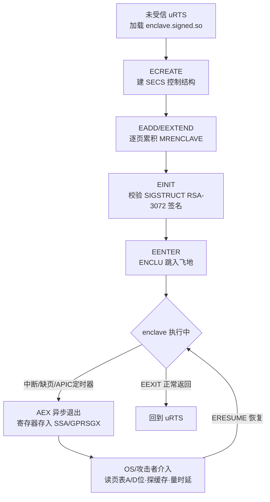
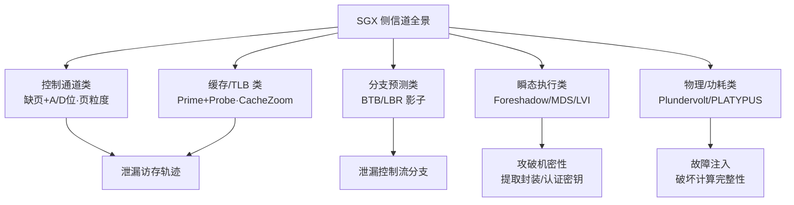
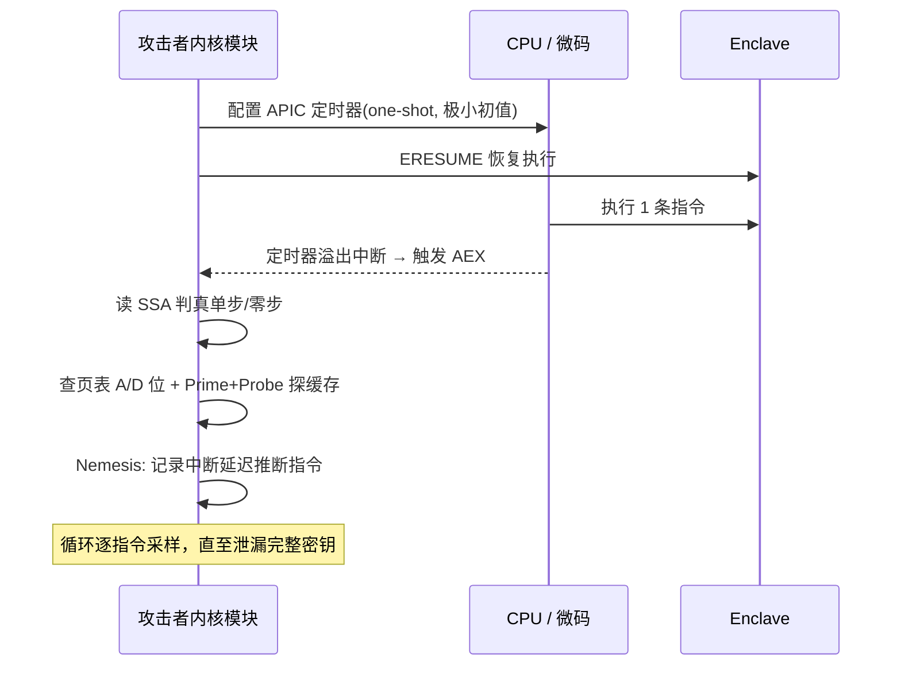

# 虚拟化与TEE机密计算（15）· Enclave逆向与侧信道攻击
> [!abstract] TL;DR
> - SGX 只保护 enclave **运行时**内存（EPC）的机密性与完整性，代码在磁盘上是**明文**——MRENCLAVE 是 SHA-256 度量值而非加密密钥，所以静态逆向一个未加壳 enclave 与逆向普通 `.so` 无本质差别，唯一拦路虎是 PCL 加密壳与生产模式禁调试。
> - SGX 威胁模型把 OS/Hypervisor 当敌人，却在文档里**显式声明侧信道不在保护范围内**；这条"设计免责声明"正是全部攻击的立足点：攻击者握有 ring0 特权，能任意操纵页表、APIC 定时器、缓存与电压。
> - 控制通道攻击（controlled-channel）用"取消映射页 + 观察缺页"把 enclave 访存轨迹暴露到 **4KB 页粒度**；SGX-Step 用 APIC 定时器中断把粒度压到**单条指令**，再叠加 A/D 位与缓存探测逼近字节级。
> - 缓存侧信道（Prime+Probe / Flush+Reload / CacheZoom）绕过内存加密引擎 MEE：DRAM 里是密文，但 **cache 里是明文**，配合单步可做到 L1 行级分辨率恢复 AES 查表、RSA 平方-乘。
> - Foreshadow（L1TF）用瞬态执行直接从 L1 读出 EPC 明文，**攻破了 SGX 的根信任**——连远程认证私钥都能被提取；这一系微架构漏洞（MDS/CacheOut/LVI/ÆPIC/Plundervolt）才是 SGX 最致命的一类，也直接导致 Intel 在消费级 CPU 砍掉 SGX。
> - 没有单一银弹：防御靠**数据无关（constant-time）编程 + ORAM + AEX 检测（T-SGX/AEX-Notify）+ 微码补丁 + 关超线程**，且每一层都有性能代价，属于"深度防御 + 持续打补丁"的军备竞赛。

## 概述与定位

本篇是《虚拟化与TEE机密计算》系列的收官章，站在**进攻方与防御研究者**的双重视角，把前面 [[11.Intel-SGX架构与Enclave]] 讲清的"enclave 怎么建、怎么度量、怎么认证"翻过来问一个更尖锐的问题：**一个号称"连 root 都读不到内部"的飞地，究竟能被逆向到什么程度、能被泄漏出什么秘密？** 如果说第 11 篇是"如何正确使用 SGX"，本篇就是"SGX 在真实攻击面前哪里会碎"。

要理解为什么 enclave 会被攻破，必须先厘清 SGX 的安全边界到底画在哪。SGX 承诺的是两件事：**完整性**（enclave 的初始代码/数据被 MRENCLAVE 锁定，改一个字节 EINIT 就失败）与**运行时机密性**（EPC 页在离开 CPU 进入 DRAM 时被 MEE 加密，物理探针抓总线只能拿到密文）。但 SGX **没有**承诺三件事，而这三件事恰是本篇的主战场：其一，它不保证**磁盘上代码的机密性**——签名保护的是"没被篡改"，不是"看不见"；其二，它不保证**执行的数据无关性**——enclave 若按秘密分支、按秘密地址访存，微架构就会把秘密"广播"出去；其三，它把**侧信道明确排除在 TCB 之外**，Intel 官方文档白纸黑字写着 side channel 属于开发者自己要处理的问题。于是攻击者的定位就清晰了：**不去砸密码学、不去砸内存加密，而是从"共享的微架构状态"和"被 OS 掌控的资源管理"这两个缝里,把秘密一比特一比特抠出来。**

这个定位与系列其他篇形成鲜明对照。[[09.虚拟机逃逸原理与案例]] 里逃逸是"从被隔离方冲破边界拿到宿主控制权"；这里恰好反向——攻击者本就是**特权宿主**（ring0/hypervisor），目标是**向内窥视**被保护的 enclave。[[13.AMD-SEV与机密虚拟机]] 的 SEV 保护整台虚拟机、粒度粗，泄漏走的是**密文侧信道**（CipherLeaks）；[[12.ARM-TrustZone与安全世界]] 的 secure world 靠总线过滤隔离，泄漏走的是**共享 cache**（ARMageddon）。SGX 粒度最细、承诺最激进，攻击面反而最丰富、被研究得最透，是理解 TEE 侧信道的最佳标本。

## 原理与机制

### enclave 二进制到底是什么

一个用 Intel SGX SDK 编译出的 enclave，本质是一个**特殊的共享库**：Linux 下是 `enclave.signed.so`，Windows 下是 `enclave.signed.dll`。它由未受信运行时（uRTS，链接进宿主进程）通过一串 `ENCLS` 特权指令加载：`ECREATE` 建控制结构 SECS，`EADD` 逐页把代码/数据搬进 EPC，`EEXTEND` 每次对 256 字节做一次 SHA-256 累积（一个 4KB 页要 16 次），`EINIT` 校验 SIGSTRUCT 里的 RSA-3072 签名并把 MRENCLAVE 冻结。之后宿主用 `EENTER`（一条 `ENCLU` 用户态指令）跳进去。

关键在于：**这套加载流程输入的是明文**。`.so` 里 enclave 的 `.text` 段就是可反汇编的机器码，SGX 的元数据（TCS 布局、SSA 数量、页权限）躺在一个名为 `.note.sgxmeta` 的 note 段里。逆向者拿 Ghidra/IDA 打开它，和逆向任何 ELF 没有本质区别——所有 ECALL 的实现、内嵌的密钥派生逻辑、甚至硬编码常量都一览无余。这就是本篇第一条主线"**enclave 二进制分析**"的物理基础：**SGX 的机密性只在"运行时 + 在 CPU 外"这个时空切片里成立，落到磁盘就失效了。**

### 攻击者的特权位置与 AEX

SGX 侧信道之所以远比普通进程的侧信道凶险，是因为攻击者**不是一个受限的邻居进程，而是全能的内核**。他能：改 enclave 线性地址对应的页表项（PTE）、清除/读取 A/D（accessed/dirty）位、把页标记为 not-present 诱发缺页、重编程 Local APIC 定时器在任意时刻打断 enclave、在同一物理核的兄弟超线程上跑探测代码、甚至通过 MSR 调电压调频率。防御者被迫在"敌人掌握一切资源管理权"的假设下自保。

把这些能力串起来的枢纽是 **AEX（Asynchronous Enclave Exit，异步飞地退出）**。当 enclave 执行中来了中断或异常，CPU 不会把上下文暴露给 OS，而是：把通用寄存器存进当前 SSA 的 GPRSGX 区、把寄存器擦成合成值、把 RIP 设为宿主预置的 AEP（异步退出指针），再走正常的中断分发。OS 处理完，用 `ERESUME` 从 SSA 恢复。**AEX 是设计用来"安全地"让出 CPU 的，却成了攻击者最好的采样探针**：每一次他能强行触发 AEX，就等于给 enclave 的执行按下一次暂停键，在暂停的缝隙里读页表、探缓存、量时延。

下图勾勒加载度量链与运行时被 AEX 撬开的攻击面：



### 侧信道的五大门类

SGX 的泄漏渠道可归为五类，越往后越致命。**控制通道类**：以页/A-D 位为观测量，泄漏访存轨迹；**缓存/TLB 类**：以 cache line 命中/失效为观测量，绕过 MEE；**分支预测类**：以 BTB/LBR 共享状态为观测量，恢复控制流；**瞬态执行类**：Meltdown 家族，直接读出 EPC 明文，**破坏机密性根基**；**物理/功耗类**：以电压/功率/频率为观测量，既能泄漏也能**注入故障破坏完整性**。



## 二进制逆向与侧信道机制详解

### 一、enclave 静态逆向的落地流程

拿到一个 `enclave.signed.so`，逆向的第一步不是猛看反汇编，而是**恢复接口边界**。SGX SDK 用 EDL（Enclave Definition Language）描述 ECALL/OCALL，`edger8r` 工具据此生成"受信桥"（trusted proxy）和"未受信桥"（untrusted bridge）。逆向时最有价值的锚点是 **`g_ecall_table`**：它是一个 `{函数指针, 是否私有}` 的静态数组，`EENTER` 后 tRTS 的分发器 `do_ecall` 用宿主传入的 ECALL 序号在这张表里查地址再跳转。找到这张表，就等于拿到了 enclave 对外暴露的全部功能清单；顺着每个表项进去，就是一个个真正的业务函数。OCALL 侧对称地有 `ocall_table`，指向那些需要求助宿主的桩（读文件、发网络包）。

识别 SDK 生成的样板代码是提速关键。tRTS 的入口 `enclave_entry` 会根据 TCS 判断这是首次进入还是从 OCALL 返回；参数从未受信栈拷进受信栈时会调用 `sgx_is_outside_enclave` / `sgx_is_within_enclave` 做边界检查——**这两个检查的缺失或写错，就是 enclave 最经典的漏洞类**（宿主传入一个指向 enclave 内部的指针，诱导 enclave 把秘密写到攻击者能读的地方，或制造越界）。逆向者盯着每个 ECALL 的指针参数有没有被正确校验,往往比分析密码学更快出成果。

真正让静态分析失效的是 **PCL（Protected Code Loader，受保护代码加载器）**：它把 enclave 的敏感代码段加密，运行时先做远程认证、拿到解密密钥后在 EPC 内解密再执行。此时磁盘上是密文，IDA 只能看到解密循环和一坨熵值拉满的数据。对付 PCL 只能转**动态分析**——但这里有第二道闸：**生产模式（ATTRIBUTES.DEBUG=0）的 enclave 无法被调试**，`EDBGRD`/`EDBGWR` 这两条读写 EPC 的 `ENCLS` 调试叶只对 `DEBUG=1` 的调试 enclave 生效，`sgx-gdb` 也只能碰调试 enclave。于是逆向生产 + PCL enclave 的现实路径，往往退化为：要么找厂商误发的调试版，要么干脆上侧信道从执行行为反推逻辑。

作为参照，SIGSTRUCT（签名结构，1808 字节）是判定 enclave 身份的核心，逆向和做认证校验时都要读它，关键字段布局如下（用代码块表达字节偏移，不硬塞进 Mermaid）：

```
偏移(0x)  长度   字段            说明
0x000     16    HEADER          固定头部魔数
0x010      4    VENDOR          0=非Intel, 0x8086=Intel
0x080     384   MODULUS         签名者 RSA-3072 公钥 (e=3) → SHA256 得 MRSIGNER
0x200      4    EXPONENT        固定为 3
0x204     384   SIGNATURE       对结构前后两半的 RSA 签名
0x3C0      32   ENCLAVEHASH     即 MRENCLAVE（初始内容的 SHA-256 度量）
0x400      2    ISVPRODID       产品 ID
0x402      2    ISVSVN          安全版本号，用于防回滚
0x410     384   Q1
0x590     384   Q2              辅助签名验证的预计算值
                总长 1808 字节
```

TCS（线程控制结构）则决定了运行时行为，也是攻击者定位 AEX/SSA 的依据：

```
偏移     字段        说明
0x00     STATE       0=可用, 1=已被某逻辑核占用
0x08     FLAGS       DBGOPTIN 等标志
0x10     OSSA        SSA 数组相对 enclave 基址的偏移
0x18     CSSA        当前 SSA 槽号，每次 AEX 递增
0x1C     NSSA        SSA 槽总数
0x20     OENTRY      enclave 入口点偏移（EENTER 后的 RIP）
0x30     OFSBASGX    FS 基址偏移
0x38     OGSBASGX    GS 基址偏移
```

### 二、控制通道攻击：把访存轨迹压到页粒度

控制通道攻击（Xu、Cui、Peinado，IEEE S&P 2015）的洞见极简：**OS 掌管 enclave 线性地址的页表，那就用页表当探针。** 攻击者把 enclave 即将访问的某些页 PTE 的 present 位清零，enclave 一碰这些页就触发缺页，缺页走 AEX 交给 OS——OS 于是精确地知道"enclave 此刻访问了哪一页"。处理时把该页恢复、把上一页重新设为 not-present，如此往复，就得到一条**页粒度的访存轨迹**。对很多算法这已足够致命：JPEG 解码的路径、freetype 字体渲染的字形、乃至某些密码实现里"按秘密选表"的分页差异，都在 4KB 粒度上留下指纹。

Intel 的缓解是**把缺页地址 CR2 的低 12 位清零**再报给 OS，即只给页对齐地址、不给页内偏移。但这只是把分辨率限制在 4KB，没堵住通道。更隐蔽的变体是**不诱发缺页、只监控 A/D 位**：清掉目标页 PTE 的 accessed 位，`ERESUME` 让 enclave 跑一会，再回来看 A 位有没有被硬件置 1——置 1 就说明访问过。因为 AEX/EENTER 会刷新相关 TLB 表项、强制重新走页表，A 位监控才得以逐次生效。它比缺页法更安静（不产生大量异常、更难被 enclave 侧的时钟检测发现）。

缺页错误码里那一位 SGX 标志，正是硬件把"这是 enclave 内的访问违例"透露给 OS 的信道之一：

```
缺页错误码(PFEC)关键位
 bit0  P    1=保护性违例 0=页不存在
 bit1  W/R  1=写 0=读
 bit2  U/S  用户/内核
 bit4  I/D  取指
 bit15 SGX  1=违例源自 enclave 访问控制（EPCM 检查）
注：SGX 缺页上报的 CR2 低 12 位被清零 → 仅页粒度
```

### 三、单步执行：SGX-Step 把粒度打到单指令

页粒度不够精细时，**SGX-Step**（Van Bulck 等，SysTEX 2017）登场，它是整个领域的地基工具。核心手法：**用 Local APIC 定时器做单步**。攻击者把 APIC 定时器配成 one-shot、初值调到极小，紧接着 `ERESUME` 进 enclave；enclave 刚执行**一条**指令，定时器就溢出发中断、触发 AEX。反复"设定时器→ERESUME→吃中断"，就把 enclave 变成可以逐指令暂停的状态机。每一步暂停里，攻击者叠加前述 A/D 位监控（看这一条指令碰了哪页）或缓存探测（看碰了哪条 cache line），分辨率从"页"跃升到"指令 + cache line"。

单步会遇到两个工程陷阱。其一是"**零步（zero-stepping）**"：定时器来得太早，AEX 发生在指令**架构性完成之前**，同一条指令会被重放——这既是噪声也是武器（重放可用于放大功耗采样、或做 CrossTalk 式的重复触发）。SGX-Step 通过观测 SSA 里 RIP 是否推进、以及页表 A 位是否置位来区分真单步与零步。其二是**中断延迟本身泄密**——这就是 **Nemesis**（Van Bulck 等，CCS 2018）：从 `ERESUME` 到中断被真正接住的周期数，取决于被打断指令的类型与操作数（乘法比加法慢、cache 命中比缺失快），于是"量中断延迟"就能反推 enclave 正在执行什么指令、甚至操作数特征。单步框架 + Nemesis 时延，构成了细粒度侧信道的黄金搭档。

下图是单步控制通道的采样循环时序：



### 四、缓存与分支：绕过 MEE 的经典武器

MEE 加密的是 DRAM，**cache 里始终是明文**，这决定了所有经典缓存侧信道对 SGX 依旧有效，而且因为攻击者是内核、能把兄弟超线程钉在同物理核、能精准单步，效果被**放大**。**CacheZoom**（Moghimi 等，CHES 2017）就是把 L1 的 Prime+Probe 与单步结合：每一条 enclave 指令后探一遍 L1 的 64 个组，得到近乎无噪的"这一步访问了哪条 line"，足以恢复 AES 的 T-table 查表下标、RSA 滑窗的平方-乘序列。LLC 层面则有跨核 Prime+Probe，不需要同核但分辨率略低。方向也能反过来：Schwarz 等的"Malware Guard Extension"演示了**从 enclave 内部**发起 Prime+Probe 去打同机的普通进程——enclave 反而成了藏身的攻击载体，因为其内存对 OS 不可见。

分支预测类的代表是**分支影子（Branch Shadowing，Lee 等，USENIX 2017）**：BTB（分支目标缓冲）与 LBR（末分支记录）在 enclave 与外部之间共享。攻击者在 enclave 外精心布置一段"影子代码"，其分支地址与 enclave 内某分支在 BTB 里发生**别名冲突**，再通过 LBR 或错误预测的时延，推断 enclave 那条分支这次是**跳还是不跳**——直接泄漏 `if(secret)` 这种秘密相关控制流。它的可怕在于：即便代码做到了页对齐、cache 无关，只要还有秘密分支，BTB 就把它出卖了。

### 五、瞬态执行：Foreshadow 直接掀翻机密性根基

前四类泄漏的是"访问模式"，需要密码分析二次恢复秘密；**Foreshadow / L1TF（L1 Terminal Fault，CVE-2018-3615，Van Bulck 等 USENIX 2018）则直接读出 EPC 明文**，是量级不同的灾难。原理：当一个页表项 present=0 时，CPU 本应立即产生"终端错误"，但在错误架构性交付**之前**，乱序引擎已经用 PTE 里残留的物理地址从 **L1 缓存**投机取到了数据，并让后续指令把它编码进缓存侧信道；等错误真正抛出、流水线回滚时，秘密已经被 Flush+Reload 读走。因为 EPC 数据一旦进过 L1 就是明文，SGX 的内存加密**完全不设防**。

Foreshadow 的真正杀伤在于**它能提取 enclave 的封装密钥与认证密钥**：攻破 Intel 的 Quoting Enclave、拿到 EPID/DCAP 的私钥后，攻击者就能**伪造远程认证报告**——让一个根本不在真 SGX 里跑、或已被篡改的"enclave"通过认证。这动摇的是整个 SGX 信任链的地基。此后同族漏洞层出不穷：**MDS（RIDL/ZombieLoad/Fallout，2019）**从行填充缓冲、存储缓冲采样跨域数据；**CacheOut / SGAxe（2020）**从 L1D 逐出采样，专门用来批量抽认证密钥；**LVI（Load Value Injection，CVE-2020-0551）**反向操作——把攻击者的值**注入** enclave 的瞬态执行，诱导它把秘密送进侧信道，是 Meltdown 的镜像；**ÆPIC Leak（CVE-2022-21233，2022）**更进一步，从 xAPIC 的 MMIO 寄存器**架构性**读出陈旧 EPC 数据，连瞬态都不需要，配合 SGX-Step 定位可精准抓取。

物理层的两把刀值得单列。**Plundervolt（CVE-2019-11157，S&P 2020）**通过 MSR `0x150` 给 CPU **欠压**，让 enclave 内的乘法或 AES 轮运算算错一位——这是**故障注入**，破坏的是完整性而非机密性，错误的中间值再经差分分析反推密钥；`VoltPillager` 则用硬件直接打 SVID 电压总线，绕过软件 MSR 缓解。**PLATYPUS（CVE-2020-8694/8695，S&P 2021）**读 RAPL 功耗接口，从功率曲线区分 enclave 处理的数据；Hertzbleed 一族更把 DVFS 频率随数据变化变成**远程**时序信道。

## 工具视角与实战

**静态逆向**首选 Ghidra 或 IDA 加载 `enclave.signed.so`。落地要点：先定位 `.note.sgxmeta` 读取 TCS/SSA 布局，再从 `g_ecall_table` 顺藤摸瓜标出所有 ECALL 实现，重点审计每个指针参数是否经过 `sgx_is_outside_enclave` 校验。自动化上，**TeeRex**（Cloosters 等，USENIX 2020）专门对 enclave 二进制做符号执行，自动挖宿主-飞地边界的空指针解引用、越界写等漏洞；**COIN Attacks** 把这类接口缺陷系统化为 Concurrency/Order/Inputs/Nested 四维分类，是审计 ECALL 面的思维框架。遇到 PCL 加密壳，静态止步，转向侧信道或（仅对调试 enclave）`sgx-gdb` + `EDBGRD` 动态转储。

**侧信道实测**的事实标准是 **SGX-Step**（jovanbulck/sgx-step）：它提供一个内核模块把 Local APIC、页表、A/D 位的操纵封装成用户态 API，几乎所有现代 SGX 攻击 PoC（Nemesis、Plundervolt、LVI、ÆPIC）都基于它复现。配套的 `sgx-pte`、`libsgxstep` 让你在几十行代码里实现"单步 + 探页 + 探缓存"的采样循环。缓存探测的底层工具是通用的 Mastik/Prime+Probe 库；分支类需要读 LBR，走 `perf` 或直接 MSR。

**防御侧验证**同样有成熟工具链。要证明一段 enclave 代码是数据无关（constant-time）的，可用 **ctgrind**（基于 Valgrind 把秘密标为未初始化，追踪其是否影响分支/地址）、**dudect**（统计学做时序泄漏假设检验）、**DATA / Microwalk**（差分地址轨迹分析，跑两组不同秘密输入比对访存/分支轨迹是否一致）。这些工具本质都在回答同一个问题：**存在任何"秘密→分支目标"或"秘密→访存地址"的数据流吗？** 有，就有侧信道。

实战建议在**自有的授权环境**里搭靶场：一台带 SGX 的旧 Xeon（消费级 CPU 已无 SGX），装 Linux SGX SDK/PSW，用 SGX-Step 官方样例（AES、RSA 的教学 enclave）复现 CacheZoom 与 Nemesis，感受"单步 + 探测"如何把一条秘密相关分支变成可读的比特。这类 CTF/教学复现是理解防御为何要 constant-time 的最快途径。

## 安全性与正确使用

> [!caution] 合规边界（务必先读）
> 本篇所有逆向手法与侧信道原理，**仅限用于你自己拥有或已获得书面授权的设备、CTF 靶场与学术安全研究**，且一律以**防御与教育**为目的。严禁将其用于攻击他人或生产系统、提取他人 enclave 中的密钥/私有算法、伪造远程认证、或绕过任何商业软件的授权与 DRM 保护。文中对 Foreshadow、Plundervolt、SGX-Step 等只讲**原理与研究者已公开发表的机制**，不提供针对任何真实目标的武器化配方与成品脚本。逆向受版权保护的 enclave 可能同时触犯当地计算机犯罪法与著作权法（如规避技术措施条款），请在动手前确认法律边界。发现真实漏洞应走**负责任披露**，联系 Intel PSIRT 或厂商而非公开利用。

从**构建安全 enclave** 的正面看，防御是一套分层组合拳，且每层都要为性能买单。第一层也是最根本的一层：**数据无关编程**——消除一切秘密相关的分支与访存地址。用 `cmov` 代替 `if(secret)`，用位切片（bitslicing）实现 AES/DES，查表时**扫描整张表**而非只取一项（抹平 T-table 的 cache 足迹），大数运算用蒙哥马利阶梯这类天然定时的算法。这是唯一能同时抵御控制通道、缓存、分支三类攻击的治本之策，但需要密码工程功底且拖慢性能。

第二层针对无法完全无关化的访存，用 **ORAM（不经意 RAM）**（ZeroTrace、Path ORAM）把每次真实访问隐藏在一组冗余访问里，让攻击者看到的地址序列与秘密统计无关——代价是每次访问放大到 O(log n)。第三层是**运行时检测 AEX 异常**：**T-SGX**（NDSS 2017）用 Intel TSX 事务把敏感代码包起来，一旦缺页/中断打断事务，TSX 直接回滚且**不通知 OS**，从而让控制通道攻击的"诱发缺页"落空；**Cloak** 用 TSX 把敏感数据钉在 cache 里防逐出；**Déjà Vu** 靠一个独立参考时钟感知 AEX 造成的异常变慢；**Varys/HyperRace** 主动占住兄弟超线程、避免同核旁路。2023 年 Intel 引入的 **AEX-Notify** 是硬件级新招：它让 enclave 在 AEX 后收到通知并主动预取下一条指令的状态，使攻击者难以稳定单步，从底层削弱 SGX-Step 这一地基工具。

第四层是**打微码与配置**：L1TF 靠"进 enclave/切 VM 时刷 L1D + 关超线程"缓解，MDS 靠 `VERW` 清空填充缓冲，LVI 靠在每个 load 后插 `lfence`（性能损失巨大，Intel 编译器自动插桩），PLATYPUS 靠限制非特权访问 RAPL、并对 SGX 场景过滤功耗读数。必须清醒：**这些都是"打地鼠"式补丁，不是根治**。正因侧信道防不胜防，Intel 已在第 11/12 代酷睿等消费级 CPU **移除 SGX**（直接导致 4K 蓝光 DRM 失效），只在 Xeon 服务器线保留，并推出面向整机虚拟机的 TDX 作为演进方向。横向看，这不是 SGX 独有的困境：SEV 有 CipherLeaks 密文侧信道（见 [[13.AMD-SEV与机密虚拟机]]），TrustZone 有 ARMageddon 缓存攻击（见 [[12.ARM-TrustZone与安全世界]]）——**只要还共享微架构，机密计算就绕不开侧信道这道坎。**

## 小结

一句话：**SGX 的密码学很硬，但它建在共享微架构与 OS 掌控的资源管理之上，攻击者不砸正门、专走这两条缝。** 记住三个层次的边界坍缩：磁盘上代码是明文（逆向门槛只剩 PCL 与生产模式禁调试）；运行时虽加密内存却在 cache/BTB/页表 A 位/中断时延里泄漏访存与控制流（控制通道 + SGX-Step 单步 + CacheZoom 把粒度压到单指令 + cache line）；而 Foreshadow 一族瞬态/物理攻击更直接读出 EPC 明文、抽走认证密钥，掀翻信任根基。防御是数据无关编程打底、ORAM 与 AEX 检测加固、微码补丁兜底的持续军备竞赛，没有银弹。这也是为什么 Intel 收缩了 SGX、机密计算整体向 TDX/SEV 这类粗粒度整机方案与"深度防御"演进——细粒度飞地的理想很美，侧信道的现实很骨感。至此本系列从虚拟化底座一路走到 TEE 攻防收官，希望这十五篇为你搭起从 VT-x 到 enclave 侧信道的完整心智地图。

## 相关阅读

- [[11.Intel-SGX架构与Enclave]] —— 本篇的正向前置：ECREATE/EINIT、MRENCLAVE、EPC/MEE、远程认证的完整机制。
- [[13.AMD-SEV与机密虚拟机]] —— 横向对比：整机粒度机密 VM 与 CipherLeaks 密文侧信道。
- [[12.ARM-TrustZone与安全世界]] —— 横向对比：secure world 隔离与 ARMageddon 缓存攻击。
- [[14.TPM与度量启动]] —— 信任根与度量链，与 SGX 认证链呼应。
- [[09.虚拟机逃逸原理与案例]] —— 反向视角：从被隔离方冲破边界 vs 从特权宿主向内窥视。
- 内核呼应：[[38.Windows内核与驱动逆向/25.HyperV架构与VBS]]、[[38.Windows内核与驱动逆向/29.CI.dll与代码完整性WDAC]]
- 硬件承接：[[21.Asm/40 虚拟化扩展对比]]、[[24.内存管理与堆分配器/02.进程地址空间与虚拟内存]]
- 启动链呼应：[[39.固件与IoT嵌入式逆向/21.安全启动链绕过技术]]
- 官方与经典文献：Intel SDM Vol.3D（SGX 指令与结构章节）、Intel SGX Developer Reference；论文《Controlled-Channel Attacks》(S&P'15)、《SGX-Step》(SysTEX'17)、《Foreshadow》(USENIX'18)、《Plundervolt》(S&P'20)、《Branch Shadowing》(USENIX'17)、《CacheZoom》(CHES'17)、《T-SGX》(NDSS'17)。

[[00.虚拟化与TEE机密计算总览|⬆ 系列总览]] | [[14.TPM与度量启动|← 上一章]]
