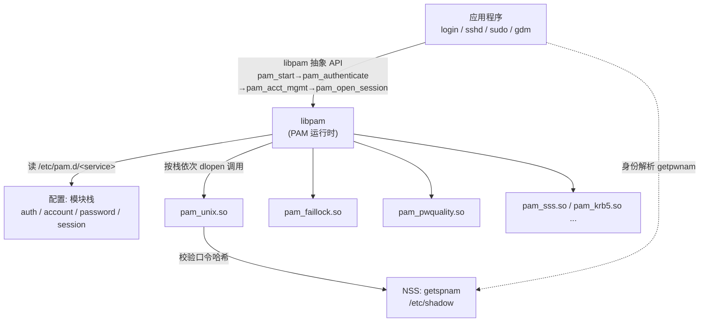

# Linux认证与登录编程 · 系列总览

> 作者原创系列，共 **9** 篇正文。系统拆解 **Linux 的认证与登录编程**，以 **PAM（Pluggable Authentication Modules，可插拔认证模块）** 为主线：从 **登录体系全景**（login/getty/su/sudo/sshd/显示管理器如何各自接入 PAM 与 NSS）、**PAM 架构与四类管理组**（auth/account/password/session）、**配置语法**（`/etc/pam.d`、control 关键字与 `[value=action]` 复杂语法），到 **手写 PAM 模块**（六个 `pam_sm_*` 服务函数、conversation 对话机制、item/data 状态管理）、**核心模块源码剖析**（`pam_unix`/`pam_pwquality`/`pam_faillock`…），再到 **NSS 与 PAM 的分工**（身份解析 vs 认证会话）、**登录集成实战**（sshd/su/sudo/systemd-logind、SSSD/Kerberos/LDAP 企业后端），最后落到 **PAM 安全、陷阱与逆向视角**（配置误用绕过、恶意 PAM 后门检测）。基准平台 **Linux（glibc + Linux-PAM）**，兼述 OpenPAM（BSD/macOS）差异。本系列与 [[30.Windows认证与生物识别编程/00.Windows认证与生物识别编程总览|Windows 认证与生物识别]] 构成**双平台认证对照**，并与 [[37.密码学/00.密码学总览|密码学]]（crypt/yescrypt/密钥）、[[15.操作系统加载与启动/00.操作系统加载与启动总览|操作系统加载与启动]]（登录发生在启动之后）深度互补。

> [!tip] 学习建议
> PAM 的精髓是**"机制与策略分离"**：应用（login/sshd）只调用 `pam_authenticate` 等抽象 API，具体"怎么认证"由管理员通过 `/etc/pam.d` 配置的模块栈决定。建议按 **02 架构 → 03 配置 → 04/05 写模块 → 06 读源码** 的顺序建立"配置者"与"模块开发者"两种视角，再进入 07-08 的系统集成。第 09 篇含安全对抗内容，务必在自有环境实践。

> [!caution] 安全与合规
> 本系列第 **09** 篇涉及 PAM 配置绕过与**恶意 PAM 后门**（如被篡改的 `pam_unix.so`、magic password）分析，一律取 **防御与检测视角**：讲清攻击者如何植入、蓝队如何用 `rpm -V`/`dpkg -V`/`strings`/审计发现，**不提供针对他人系统的可落地后门植入步骤**。仅用于自有系统加固、应急响应与安全研究。

## 一、体系与架构

| # | 章节 | 说明 |
| --- | --- | --- |
| 01 | [[01.Linux登录与认证体系全景]] | login/getty/su/sudo/sshd/DM 如何接入 PAM+NSS；passwd/shadow/group；utmp/wtmp/btmp；与 Windows 对照 |
| 02 | [[02.PAM架构与设计哲学]] | 可插拔由来、四类管理组、模块栈、`pam_start`/`pam_authenticate`/`pam_end` 主控流、Linux-PAM vs OpenPAM |

## 二、配置与模块开发

| # | 章节 | 说明 |
| --- | --- | --- |
| 03 | [[03.PAM配置语法详解]] | `pam.conf` vs `pam.d`、service·type·control·module、`required/requisite/sufficient/optional/include/substack`、`[value=action]`、发行版差异 |
| 04 | [[04.编写PAM模块-服务函数]] | 六个 `pam_sm_*`、`PAM_SM_*` 宏、动态库导出、最小骨架与编译安装 |
| 05 | [[05.编写PAM模块-会话与数据]] | `pam_conv` 对话、`pam_get_item/set_item`、`pam_get_authtok`、`pam_set_data`+cleanup、返回码语义、重入 |
| 06 | [[06.核心PAM模块源码剖析]] | `pam_unix`(crypt/shadow)、deny/permit/warn、`pam_pwquality`、`pam_faillock`、limits/env/nologin/securetty |

## 三、集成与安全

| # | 章节 | 说明 |
| --- | --- | --- |
| 07 | [[07.NSS与PAM的分工]] | nsswitch、`getpwnam/getspnam`、身份解析 vs 认证会话边界、写 NSS 模块、二者协同 |
| 08 | [[08.登录集成实战与会话管理]] | sshd/su/sudo 的 PAM、systemd-logind + `pam_systemd`、SSSD/Kerberos/LDAP 企业后端、离线缓存 |
| 09 | [[09.PAM安全陷阱与逆向视角]] | control-flow 误配绕过、authtok 处理、恶意 PAM 后门检测取证、加固审计（防御视角）|

## PAM 的核心模型

> 一句话：Linux 认证 = **应用调用抽象的 libpam API**（不关心怎么认证）+ **管理员用 `/etc/pam.d` 配置模块栈**（决定认证策略）+ **模块实现具体机制**（`pam_unix` 查 shadow、`pam_sss` 走域）+ **NSS 负责身份解析**（把用户名映射到 UID/GID/home）。看懂这四层的分工，就能配置、开发、排错、加固任何 Linux 登录场景。
