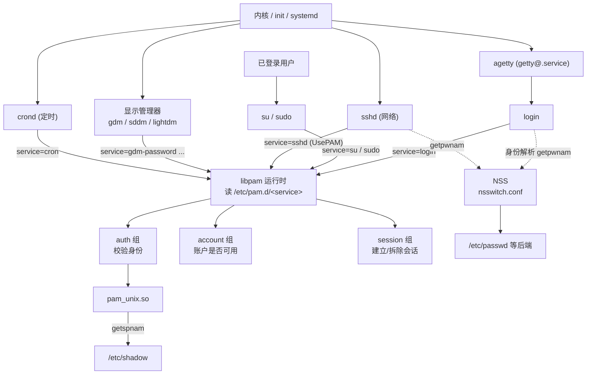
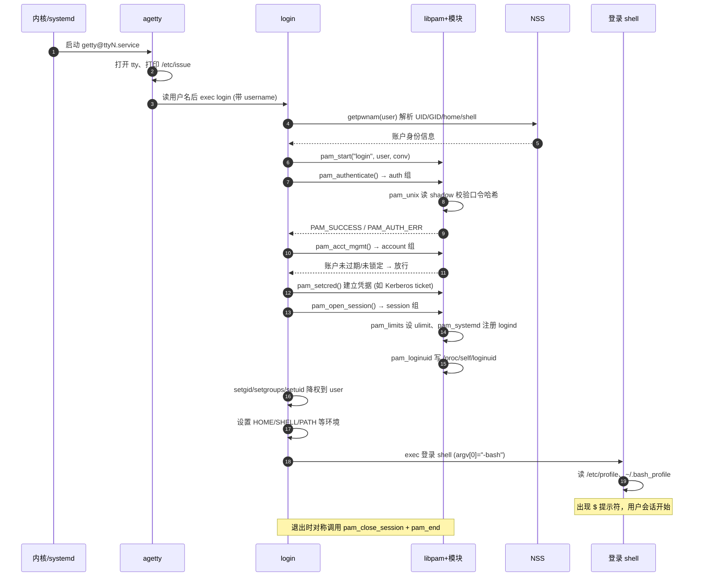

# Linux认证（01）· Linux登录与认证体系全景

本篇是「Linux认证与登录编程」系列的开篇地图。在钻进 PAM 的架构（[[02.PAM架构与设计哲学]]）与配置语法（[[03.PAM配置语法详解]]）之前，先把整张全景图铺开：一次登录从内核把控制权交出去，到出现 shell 提示符，中间到底经过哪些进程、查询哪些数据库、触发哪些子系统。看懂这张图，后续所有"为什么这个配置改了不生效""为什么 ssh 能进而 su 不行"之类的问题都会变成图上某条边的定位问题。

## 概述与定位

> [!abstract] TL;DR
> - **"认证"从来不是一件事，而是 AAA 三/四件事**：Authentication（你是谁）、Authorization（你能干什么）、Session/Accounting（会话建立与记账）。Linux 把它们拆给不同子系统——口令校验交给 PAM，用户名→UID 的身份解析交给 NSS，权限交给内核的 uid/gid + 文件权限/capabilities，登录记账交给 utmp/wtmp/journald。
> - **所有登录入口最终都汇聚到 PAM + NSS 两条总线**：本地 tty（`agetty`→`login`）、`su`/`sudo`、`sshd`、图形显示管理器（gdm/sddm/lightdm）、`cron`，各自对应一个 PAM service 名，但都调用同一套 libpam API，也都通过 NSS 解析身份。
> - **账户数据分三张表**：`/etc/passwd`（公开身份，7 字段）、`/etc/shadow`（口令哈希与老化，9 字段，仅 root 可读）、`/etc/group` + `/etc/gshadow`（组成员）。口令哈希格式为 `$id$salt$hash`，id 决定算法（1=MD5、5=SHA-256、6=SHA-512、y=yescrypt、gy=gost-yescrypt）。
> - **交互式登录是一条严格链路**：内核→`agetty`→`login`→PAM(auth→account→session)→设置 UID/GID/补充组/环境/`PAM_LOGINUID`→`exec` 登录 shell→读 profile。理解这条链是理解一切登录问题的地基。
> - **与 Windows 一一对应**：login/getty ↔ Winlogon、PAM conversation ↔ Credential Provider、PAM 模块 + NSS ↔ LSA 认证包、`/etc/shadow` ↔ SAM、uid/gid+groups ↔ Access Token。

### 把 AAA 拆开看

安全工程里有一个经典缩写 **AAA**：Authentication（认证）、Authorization（授权）、Accounting（记账）。很多人把"登录"笼统当成一件事，但真正做系统编程时必须把它们分开，因为在 Linux 上它们由**完全不同的子系统**负责，出问题时排查路径也完全不同。

- **认证（Authentication）**：回答"你是不是你声称的那个人"。手段包括口令、公钥、指纹、智能卡、一次性口令等。在 Linux 上，认证的**策略与机制由 PAM 承担**——应用程序不自己比对口令，而是委托 PAM 去跑一串模块。
- **授权（Authorization）**：回答"确认身份之后，你能做什么"。这一层在 Linux 上**主要不由 PAM 负责**，而是由内核根据进程的 uid/gid、补充组、文件权限位、capabilities、SELinux/AppArmor 标签共同决定。PAM 里的 account 管理组只做一种"粗授权"：判断这个账户此刻**是否允许登录**（是否过期、是否在允许的时段/终端）。
- **会话与记账（Session / Accounting）**：认证通过后，需要**建立会话**——挂载用户目录、设置资源限制（ulimit）、写环境变量、注册到 systemd-logind、记录一条登录日志。会话结束时还要对称地拆除。这一层由 PAM 的 session 管理组 + utmp/wtmp/btmp + journald 共同完成。

一句话总结职责划分：**"你是谁"问 PAM（认证）+ NSS（身份解析），"你能干嘛"问内核（授权），"你什么时候来的、干了多久"问 utmp/journald（记账）**。本系列的主线是第一件事（PAM），但要先在本篇把四条线的边界划清楚，否则很容易把授权问题误当认证问题去改 `/etc/pam.d`。

### PAM 与 NSS：两个必须区分的角色

初学者最容易混淆的是 **PAM 和 NSS 的分工**（后续 [[07.NSS与PAM的分工]] 专篇展开）。二者都被登录程序调用，但做的是两件正交的事：

- **NSS（Name Service Switch）**回答**身份解析**问题：给一个用户名 `alice`，它的 UID、GID、home 目录、登录 shell 是什么？给一个 UID `1000`，对应哪个用户名？这些映射的**数据来源**由 `/etc/nsswitch.conf` 决定——可以是本地文件（`files`）、LDAP、SSSD、systemd（`systemd` for DynamicUser）等。对应的 C API 是 `getpwnam`/`getpwuid`/`getgrnam` 等。
- **PAM** 回答**认证与会话**问题：`alice` 提供的这个口令对不对？这个账户此刻能不能登录？登录后要挂载什么、记什么日志？

关键区别：**NSS 不校验口令**（它只查身份），**PAM 才校验口令**（`pam_unix` 内部会去读 `/etc/shadow`）。一个常见误区是以为 `/etc/passwd` 里有口令——历史上确有，但现代系统 passwd 的口令字段永远是占位符 `x`，真正的哈希在只有 root 可读的 `/etc/shadow`，且由 PAM 的 `pam_unix` 模块经由 `getspnam` 去读。

## 原理与机制

### 各登录入口如何接入 PAM 与 NSS

Linux 有多条"进入系统"的路径，它们**外观差别很大**（有的敲 tty、有的走网络、有的点图形界面），但内部都遵循同一个模式：**先用 NSS 把用户名解析成账户信息，再用 PAM 跑认证/账户/会话三组模块**。每个应用向 libpam 声明一个 **service 名**，libpam 据此去 `/etc/pam.d/<service>` 找对应的模块栈配置。下表是主流入口与其 PAM service 名的对照：

| 登录入口 | 触发进程链 | PAM service 名 | 配置文件 | 备注 |
|---|---|---|---|---|
| 本地文本终端 | 内核→`init/systemd`→`agetty`(getty)→`login` | `login` | `/etc/pam.d/login` | 经典 tty 登录，`agetty` 打印 issue 并读用户名后 exec `login` |
| 切换用户 | `su` / `su -` | `su` / `su-l` | `/etc/pam.d/su` | `su -` 是登录式 shell，会重读 profile |
| 提权执行 | `sudo <cmd>` | `sudo` | `/etc/pam.d/sudo` | 认证的是**调用者**身份，授权由 `/etc/sudoers` 决定 |
| SSH 远程 | `sshd` | `sshd` | `/etc/pam.d/sshd` | 仅当 `UsePAM yes` 时走 PAM；公钥认证也会跑 account/session |
| 图形登录 | `gdm` / `sddm` / `lightdm` | `gdm-password` / `sddm` / `lightdm` | 各自文件 | 显示管理器实现自己的 conversation UI |
| 定时任务 | `cron` / `crond` | `cron` | `/etc/pam.d/cron` | 不做 auth（没有口令环节），但跑 account + session 建立会话环境 |
| 桌面提权 | `polkit`（旁路） | `polkit-1` | `/etc/pam.d/polkit-1` | 严格说 polkit 是**授权框架**，认证部分才委托 PAM |

几点要展开说清楚：

**1）tty 登录里 `agetty` 和 `login` 的分工。** `agetty`（或 `getty`）由 systemd 的 `getty@.service` 拉起，它负责**打开一个 tty 设备、设置串口/终端参数、打印 `/etc/issue`、读取用户名**，然后 `exec` 成 `login` 程序并把用户名传过去。真正调用 PAM 的是 `login`，不是 `agetty`。这个分工解释了为什么改 `/etc/pam.d/login` 影响的是本地 tty 而不影响 ssh。

**2）`sshd` 的 `UsePAM` 开关。** OpenSSH 有自己的认证代码（公钥、口令），PAM 对它来说是**可选的**。只有 `sshd_config` 里 `UsePAM yes`（现代发行版默认）时，sshd 才会调用 PAM。且即便是**公钥认证成功**，sshd 仍会跑 PAM 的 **account 组**（判断账户是否过期/锁定）和 **session 组**（建立会话、`pam_systemd` 注册 logind），只是跳过 auth 组。这是一个高频误区：以为公钥登录完全绕过 PAM——不是的，account 和 session 仍在跑，`pam_nologin`、`pam_faillock`、`pam_limits` 照样生效。

**3）`sudo` 认证的是谁。** `sudo` 用 PAM 认证的是**当前调用者自己**的口令（默认），而**能不能提权、能跑哪些命令**是由 `/etc/sudoers`（授权，非 PAM）决定的。这再次印证了"认证 ≠ 授权"：PAM 只确认"你确实是 alice"，sudoers 才决定"alice 能否以 root 跑这条命令"。

**4）图形显示管理器。** gdm/sddm/lightdm 实现自己的图形 conversation（就是那个输密码的框），它把用户输入喂给 PAM 的 conversation 回调，本质和 `login` 一样，只是 UI 从文本变成了图形。它们通常还会额外用 `pam_gnome_keyring`/`pam_kwallet` 在登录时解锁桌面密钥环。

### 登录入口全景图



> 图解：左侧是**外观各异的登录入口**，中间它们全部收敛到 **libpam**（虚线是**并行走的 NSS 身份解析**，与 PAM 认证正交），右侧 libpam 按 service 配置分别驱动 auth/account/session 三组模块。记住这张"沙漏"形状：多入口 → libpam 收口 → 多模块，这正是 PAM"机制与策略分离"的物理体现。

## 账户数据库与登录链路详解

### `/etc/passwd`：公开身份表（7 字段）

`/etc/passwd` 全局可读，存放**非敏感的身份信息**。每行 7 个冒号分隔字段：

```text
alice:x:1000:1000:Alice Zhang,,,:/home/alice:/bin/bash
  |   |  |    |        |            |          |
  |   |  |    |        |            |          └─ 登录 shell (第7字段)
  |   |  |    |        |            └─ home 目录 (第6)
  |   |  |    |        └─ GECOS 注释/全名 (第5)
  |   |  |    └─ 主组 GID (第4)
  |   |  └─ UID (第3)
  |   └─ 口令占位符 'x' → 真哈希在 shadow (第2)
  └─ 用户名 (第1)
```

要点：第 2 字段几乎永远是 `x`，表示"口令在 shadow 里"；若这里直接是哈希（历史遗留）则极不安全，因为 passwd 全局可读。UID `0` 是 root；`1..999`（或发行版定义的阈值，见 `/etc/login.defs` 的 `UID_MIN`）通常留给系统账户；`1000+` 是普通用户。第 7 字段若是 `/usr/sbin/nologin` 或 `/bin/false`，则该账户**不能获得交互 shell**（常用于服务账户）。

### `/etc/shadow`：口令与老化（9 字段，仅 root 可读）

`/etc/shadow` 权限通常是 `0640 root:shadow` 或 `0600 root:root`，**普通用户读不到**，这是把哈希从全局可读的 passwd 里分离出来的全部意义。9 个字段：

```text
alice:$6$xyzsalt$hashhashhash...:19700:0:99999:7:14:20089:
  |          |                     |   | |    | |    |    |
  |          |                     |   | |    | |    |    └─(9)保留
  |          |                     |   | |    | |    └─(8)账户过期日
  |          |                     |   | |    | └─(7)过期后禁用宽限
  |          |                     |   | |    └─(6)到期前警告天数
  |          |                     |   | └─(5)口令最长有效天数
  |          |                     |   └─(4)口令最短使用天数
  |          |                     └─(3)最后改密日(自1970起天数)
  |          └─(2)口令哈希
  └─(1)用户名
```

**口令哈希格式 `$id$salt$hash`** 是 crypt(3) 的现代扩展格式：`id` 选算法，`salt` 是盐，`hash` 是结果。常见 id：

| id | 算法 | 说明 |
|---|---|---|
| `1` | MD5 | 已过时，极不推荐 |
| `5` | SHA-256 | 可接受，`rounds=` 可调 |
| `6` | SHA-512 | 长期默认，广泛部署 |
| `y` | yescrypt | 现代默认（Debian 11+/Fedora），抗 GPU 破解 |
| `gy` | gost-yescrypt | 俄标 GOST 变体 |
| `2b`/`2y` | bcrypt | 部分发行版可选 |

**特殊哈希字段语义**要牢记，这是排错高频点：

- **空字段**（`alice::...`）：无口令，任何口令甚至空口令都能登录（危险）。
- **`*`**：账户**无法用口令登录**（哈希不可能匹配任何口令），常见于系统账户。仍可用其他方式（公钥）。
- **`!` 或 `!!` 开头**：账户被**锁定**。`!!` 通常表示"从未设置过口令"（如新建账户）。`!$6$...`（叹号+原哈希）是 `passwd -l alice` 锁定的结果——解锁 `passwd -u` 会去掉叹号还原。
- **`!*` / `*LK*`**：不同工具的锁定表示，语义同"不可登录"。

**账户老化字段**（3-8）驱动口令定期更换策略：字段 3 记录"上次改密距 1970-01-01 的天数"，配合字段 4/5 可强制"多久必须改一次密、改后多久内不许再改"，字段 6 提前警告，字段 7/8 控制宽限与硬过期。这些由 `pam_unix`（登录时检查）和 `chage` 命令（管理）协作使用。

### `/etc/group` 与 `/etc/gshadow`

`/etc/group` 每行 4 字段：`组名:x:GID:成员列表`（成员逗号分隔）。用户的**主组**在 passwd 第 4 字段，**补充组**在这里列出。`/etc/gshadow` 存组口令（`newgrp` 用，罕见）和组管理员，同样仅 root 可读。登录时内核会把用户的主组 + 所有补充组一起设为进程凭据，`id alice` 可查看最终生效的组集合。

### 交互式登录全链路时序

这是本篇最核心的一张图——**一次本地 tty 登录，从内核到 shell 提示符的完整时序**。理解它，几乎所有"环境变量为什么没生效""为什么审计日志里 loginuid 不对"的问题都能定位。



> 图解几个关键点：**(1)** 认证（auth）在**降权之前**由 root 权限的 `login` 执行——必须 root 才能读 shadow。**(2)** `pam_setcred` 与 `pam_authenticate` 是**两回事**：前者建立/刷新凭据（如 Kerberos TGT、组成员），常被漏调导致企业环境票据缺失。**(3)** `pam_loginuid` 把不可变的 `loginuid` 写进内核（`/proc/self/loginuid`），此后该会话所有进程的审计记录都带这个"最初登录者"标签，是 Linux 审计（auditd）追责的锚点。**(4)** 降权（setuid）发生在 session 打开**之后**、exec shell **之前**——顺序错了会导致会话以 root 建立却以 user 运行的权限混乱。**(5)** `argv[0]` 前加 `-` 是登录式 shell 的约定，shell 据此决定读哪些 profile。

## 登录记账与审计

认证只是一瞬间的事，"谁在什么时候从哪登录/登出、当前有谁在线"则由一组**记账文件**长期记录。它们是二进制文件，不能直接 `cat`，要用专门工具读。

| 文件 | 内容 | 查看工具 | 说明 |
|---|---|---|---|
| `/var/run/utmp` | **当前**在线会话 | `who`、`w`、`users` | 实时状态，登出即清 |
| `/var/log/wtmp` | **历史**登录/登出 | `last` | 追加式历史，可回溯 |
| `/var/log/btmp` | **失败**登录尝试 | `lastb`（需 root） | 暴力破解取证关键 |

写这些文件的是 PAM 的 `pam_lastlog` / 应用自身，或 systemd 的记录逻辑。除二进制记账外，**文本审计日志**也很关键，且**发行版路径不同**：

- **Debian/Ubuntu**：认证事件写 `/var/log/auth.log`。
- **RHEL/CentOS/Fedora**：写 `/var/log/secure`。
- **systemd 系统**：统一进 **journald**，用 `journalctl` 查询，如 `journalctl -u ssh`（看 sshd）、`journalctl _COMM=sudo`（看 sudo）、`journalctl /usr/bin/login`。journald 的好处是结构化字段（`_UID`、`_PID`、`_AUDIT_LOGINUID`）可精确过滤。

排查登录失败时的典型三连：`lastb`（看失败来源 IP/用户）→ `journalctl -u ssh --since "1 hour ago"`（看 sshd 拒绝原因）→ 检查 `pam_faillock` 是否已锁定该账户。审计的最深一层是内核 **auditd**，它记录带 `loginuid` 的系统调用级事件，能回答"这个 root 操作最初是谁登录后提权做的"——这正是前面 `pam_loginuid` 埋下的锚点在发挥作用。

## 与 Windows 认证对照

对同时做双平台的读者，把 Linux 的角色映射到 Windows 能极大加速理解（详见 [[30.Windows认证与生物识别编程/00.Windows认证与生物识别编程总览|Windows 认证]]）：

| 概念/职责 | Linux | Windows |
|---|---|---|
| 登录界面/交互主控 | `login` / `getty` / 显示管理器 | **Winlogon** |
| 采集凭据的可插拔 UI | PAM **conversation** 回调 | **Credential Provider** |
| 可插拔认证机制 | PAM **模块**（auth 组）+ NSS | **LSA 认证包**（msv1_0、Kerberos SSP） |
| 本地账户口令存储 | `/etc/shadow`（哈希 `$id$salt$hash`） | **SAM** 数据库（NT hash） |
| 认证后的权限载体 | 进程的 **uid/gid + 补充组** | **Access Token**（SID + 权限 + 组） |
| 身份解析/目录 | **NSS**（files/LDAP/SSSD） | Active Directory + Netlogon |
| 会话建立 | PAM session + systemd-logind | Winlogon 创建**桌面/会话** |
| 提权 | `sudo` / `su` / polkit | **UAC**（Consent/Secure Desktop） |

核心结构性差异：Windows 的认证结果是一个**可传递的 Access Token 对象**，进程持有它；Linux 没有"令牌对象"，认证结果**直接烙进进程的 uid/gid 凭据**，靠 fork 继承传播。这解释了为什么 Linux 里"降权"就是一次不可逆的 `setuid`，而 Windows 可以持有多个 token 做 impersonation。

## 工具视角与实战

把上面的机制落到能敲的命令。这些命令是排查一切登录问题的基本盘。

```bash
# 1) 身份解析：看 NSS 最终返回什么（不只查 /etc/passwd，会走所有后端）
getent passwd alice        # 等价于 getpwnam，含 LDAP/SSSD 后端
getent group alice
id alice                   # 看最终生效的 uid/gid + 全部补充组

# 2) 口令与老化管理
sudo passwd alice          # 改密（内部走 pam_chauthtok / pam_pwquality）
sudo passwd -l alice       # 锁定（shadow 哈希前加 !）
sudo passwd -S alice       # 看账户口令状态（L=锁定 P=有密 NP=空密）
sudo chage -l alice        # 看老化：过期日、最短/最长天数、警告
sudo chage -M 90 alice     # 强制 90 天改一次密

# 3) 看当前/历史/失败登录（记账三件套）
who                        # 当前在线（读 utmp）
w                          # 在线 + 每人在干什么
last -n 20                 # 最近 20 条登录历史（读 wtmp）
sudo lastb -n 20           # 最近 20 条失败尝试（读 btmp）

# 4) 审计日志（注意发行版路径差异）
journalctl -u ssh --since today          # systemd：看 sshd
sudo tail -f /var/log/auth.log           # Debian/Ubuntu
sudo tail -f /var/log/secure             # RHEL/Fedora

# 5) systemd 会话视角（现代登录的会话由 logind 管理）
loginctl list-sessions     # 列出所有登录会话
loginctl session-status 3  # 某会话详情：谁、哪个 tty、什么时候
```

> [!tip] 排查口诀
> "**登不进去**"先分层：能不能解析（`getent passwd`）→ 口令对不对（看 auth.log 的 `pam_unix` 行）→ 账户是否被锁/过期（`passwd -S`、`chage -l`）→ 是否被 faillock 锁（`faillock --user alice`）→ session 是否建立失败（logind、home 挂载）。每一层对应上面全景图的一条边，逐边排除即可。

## 安全性与正确使用

- **shadow 权限是第一道墙**：`/etc/shadow` 必须保持 `root` 属主且普通用户不可读（`0640 root:shadow` 或更严）。一旦它变成全局可读，等于把所有口令哈希交给攻击者离线破解。定期 `ls -l /etc/shadow` 核对，配置管理（Ansible/Puppet）应固化其权限。
- **优先用现代哈希算法**：新系统应默认 yescrypt 或至少 SHA-512（`/etc/login.defs` 的 `ENCRYPT_METHOD`、`/etc/pam.d` 里 `pam_unix` 的 `sha512`/`yescrypt` 参数）。MD5（`$1$`）的哈希在现代 GPU 上近乎明文，发现即应强制全员改密。
- **警惕空口令与错误的锁定语义**：shadow 里口令字段为空表示"无口令即可登录"，是重大隐患；`passwd -l` 只是加 `!` 前缀锁**口令登录**，并**不能阻止公钥/SSH 登录**——要彻底禁用账户需同时改 shell 为 `nologin`、清 `~/.ssh/authorized_keys`、必要时设账户过期（`chage -E 1`）。
- **公钥登录不等于绕过 PAM**：如前所述，即便 ssh 公钥认证，PAM 的 **account 与 session 组仍会执行**。想靠 `pam_nologin`（维护期禁止普通用户登录）、`pam_faillock`（失败锁定）、`pam_access`（来源限制）做防护的，必须确认这些模块在 account 组而非只在 auth 组，否则公钥登录会绕过它们。
- **保护记账文件的完整性**：`btmp`/`wtmp` 是取证证据，攻击者入侵后常擦除。生产环境应把 auth.log/journald 实时转发到独立的日志服务器（rsyslog remote / journald forward），本机日志一旦被篡改仍有异地副本。
- **loginuid 不可变是特性不是 bug**：`pam_loginuid` 写入后内核禁止再改（除非有 `CAP_AUDIT_CONTROL`），确保提权后仍能追溯到最初登录者。自研的 daemon 若绕过 PAM 直接起用户进程，会导致审计链断裂，编写登录类程序时务必调用 `pam_open_session` 让 `pam_loginuid` 生效。

## 小结

1. **认证是 AAA 而非单点**：Linux 把"你是谁/你能干嘛/你什么时候来"拆给 PAM+NSS、内核、utmp/journald 三套子系统，排错要先分清落在哪一层。
2. **所有入口收敛到 PAM+NSS 两条总线**：login/su/sudo/sshd/显示管理器/cron 外观各异，但都用 service 名找 `/etc/pam.d` 配置、都用 NSS 解析身份——这是一张"沙漏图"。
3. **三张账户表各司其职**：passwd（公开身份 7 字段）、shadow（哈希+老化 9 字段，仅 root 可读，`$id$salt$hash`、`!`/`*`/`!!` 语义）、group/gshadow（组成员）。
4. **交互式登录是一条严格链路**：内核→agetty→login→PAM(auth→account→session)→写 loginuid→降权→exec shell→读 profile，认证在降权前以 root 执行，顺序不可乱。
5. **记账与审计是第四条线**：utmp（在线）、wtmp（历史）、btmp（失败），auth.log/secure/journald，loginuid 是审计追责的锚点。
6. **与 Windows 结构性对应但不等价**：PAM↔LSA、shadow↔SAM、uid/gid↔Access Token；最大差异是 Linux 认证结果直接烙进进程凭据而非独立令牌对象。

## 相关阅读

- **下游：PAM 到底是什么架构** → [[02.PAM架构与设计哲学]]
- **配置语法：`/etc/pam.d` 怎么写** → [[03.PAM配置语法详解]]
- **身份解析的另一半** → [[07.NSS与PAM的分工]]
- **登录集成实战（sshd/su/sudo/logind）** → [[08.登录集成实战与会话管理]]
- **口令哈希算法细节（crypt/yescrypt）** → [[37.密码学/00.密码学总览|密码学]]
- **登录发生在启动之后** → [[15.操作系统加载与启动/00.操作系统加载与启动总览|操作系统加载与启动]]
- **Windows 侧对照** → [[30.Windows认证与生物识别编程/00.Windows认证与生物识别编程总览|Windows 认证]]
- **手册**：`man 5 passwd`、`man 5 shadow`、`man 5 nsswitch.conf`、`man 1 login`、`man 8 pam`

---

🏠 [[00.Linux认证与登录编程总览]] ｜ 下一篇 [[02.PAM架构与设计哲学]] ➡️
