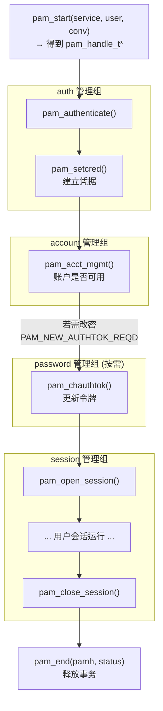
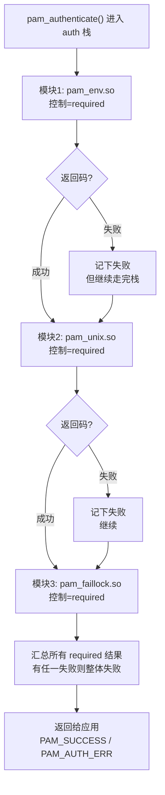

# Linux认证（02）· PAM架构与设计哲学

上一篇 [[01.Linux登录与认证体系全景]] 画出了"多入口→libpam 收口→多模块"的沙漏全景。本篇钻进沙漏的腰部，回答一个更本质的问题：**PAM 到底是一套什么样的架构，它凭什么能让 login、sshd、sudo 这些互不相干的程序共享同一套认证逻辑？** 理解 PAM 的设计哲学（机制与策略分离）与它的四类管理组、主控 API、模块栈求值模型，是后续自己写模块（[[04.编写PAM模块-服务函数]]）和读源码（[[06.核心PAM模块源码剖析]]）的地基。

## 概述与定位

> [!abstract] TL;DR
> - **PAM 解决的痛点是"认证逻辑重复"**：1995 年前，每个需要认证的程序（login、ftpd、su）都自己写一遍读 `/etc/passwd`、比对 crypt 的代码。要换认证方式（加 Kerberos、加双因子）就得改所有程序源码重新编译。PAM 把认证抽象成一层可插拔的库。
> - **核心思想是机制与策略分离**：应用程序只调用抽象 API（`pam_authenticate` 等），**具体怎么认证**（查本地 shadow？走 LDAP？要指纹？）由管理员在 `/etc/pam.d` 里配置的**模块栈**决定，应用完全无感。
> - **四类管理组各管一件事**：**auth**（验证身份 + 建立凭据）、**account**（账户此刻是否可用）、**password**（更新认证令牌/改密）、**session**（会话建立与拆除）。它们互相独立，配置也分开。
> - **一次认证是一个事务**：`pam_start` 开事务拿到 `pam_handle_t` 句柄，中间调 `pam_authenticate`/`pam_acct_mgmt`/`pam_open_session` 等，最后 `pam_end` 收尾。句柄贯穿整个事务，承载 item/data 状态。
> - **模块以栈的形式串联**：同一管理组下可配多个模块，libpam 按顺序 `dlopen` 调用，每个模块的返回码按 control 字段规则汇总成最终结果。
> - **实现有分支**：Linux 用 **Linux-PAM**，FreeBSD/macOS 用 **OpenPAM**，二者 API 大体兼容但有 `pam_get_authtok`（Linux 扩展）、`openpam_*`（BSD 扩展）等差异，跨平台写模块需留意。

### 一段历史：PAM 从哪来

PAM 的概念由 **Sun Microsystems 于 1995 年**在其 Solaris 上首创，随后被写成 **OSF-RFC 86.0**（Open Software Foundation 的提案文档），成为事实标准。Linux 世界的实现是 **Linux-PAM**（Andrew Morgan 等发起），今天几乎所有主流发行版都基于它。BSD 阵营（FreeBSD、后来 macOS）则采用独立实现 **OpenPAM**。

要体会 PAM 的价值，必须回到没有它的年代。假设你运维一台 1994 年的 Unix，想给所有登录加一个"下班后禁止普通用户登录"的策略。你得去改 `login` 的源码、改 `ftpd` 的源码、改 `rlogind` 的源码……每个程序一份，改完全部重编译。更糟的是，若第三方软件（某商业数据库的登录）也要认证，你根本没有它的源码。**认证逻辑与应用程序硬编码耦合**，是当时的核心痛点。PAM 的回答是：把认证从应用里彻底剥离出去，做成一层运行时可配置的中间件。

## 原理与机制

### 机制与策略分离：PAM 的灵魂

PAM 全称 **Pluggable Authentication Modules（可插拔认证模块）**，"可插拔"三个字就是它的全部设计哲学。用软件工程的话说，它做的是**机制（mechanism）与策略（policy）的分离**：

- **机制**：由**应用程序**提供。login 知道怎么显示提示符、读用户输入；sshd 知道怎么收网络包。但它们**不知道也不关心**"这个口令对不对"——它们只是调用 `pam_authenticate()`，把判断委托出去。
- **策略**：由**管理员**通过配置决定。"用本地 shadow 认证还是走公司 LDAP""要不要额外一个 Google Authenticator 验证码""连续失败 3 次锁 10 分钟"——这些都是策略，写在 `/etc/pam.d/<service>` 里，改配置即生效，**不需要重新编译任何程序**。
- **具体认证动作**：由**模块**（`.so` 共享库）实现。`pam_unix.so` 会查 shadow，`pam_ldap.so`/`pam_sss.so` 会走目录服务，`pam_google_authenticator.so` 会验 TOTP。

这三者的解耦带来一个惊人的能力：**给整个系统换认证方式，只需改文本配置**。想给 sshd 加双因子？在 `/etc/pam.d/sshd` 的 auth 栈里加一行 `pam_google_authenticator.so`，重连即生效，OpenSSH 一行代码都不用动。这就是"可插拔"的威力，也是 PAM 二十多年不过时的原因。

### 四类管理组（Management Groups）

PAM 把认证事务切成**四个正交的阶段**，称为管理组或功能类型。它们是理解 PAM 的第一个关键抽象——**同一个模块（如 `pam_unix`）可以在不同管理组里各出一份力，做的事完全不同**：

| 管理组 | 回答的问题 | 典型动作 | 主控 API |
|---|---|---|---|
| **auth** | 你是不是你声称的人？ | 提示并校验口令/指纹/公钥；建立初始凭据 | `pam_authenticate` + `pam_setcred` |
| **account** | 确认身份后，此刻允许登录吗？ | 检查账户是否过期、是否在允许时段/来源、是否被锁 | `pam_acct_mgmt` |
| **password** | 如何更新认证令牌？ | 改密：检查强度、写入新哈希 | `pam_chauthtok` |
| **session** | 会话建立与拆除要做什么？ | 挂载目录、设 ulimit、写环境、记日志、注册 logind | `pam_open_session` / `pam_close_session` |

逐个说清楚它们的边界，这是新手最容易混的地方：

- **auth（认证）**：这是最核心也最狭义的一组，只做一件事——**核实身份**。它通过 conversation 机制向用户索取凭据（口令等），交给模块验证。auth 还有一个常被忽视的搭档 `pam_setcred`：认证成功后**建立/刷新凭据**（如取得 Kerberos TGT、设置组成员、AFS token）。很多企业环境的"登录了但没权限"就是漏调 `pam_setcred` 导致的。
- **account（账户管理）**：注意它**不验证口令**！它在身份已确认的前提下，做一层"粗授权"：这个账户**现在**能不能用？`pam_unix` 在这里检查口令是否过期（shadow 老化字段）；`pam_time` 检查是否在允许登录的时段；`pam_nologin` 检查系统是否处于维护禁登状态；`pam_faillock` 检查是否因失败过多被锁。前一篇强调的"公钥 ssh 登录仍跑 account 组"就是指这一组。
- **password（口令管理）**：只在**改密**时触发（`passwd` 命令、登录时提示"口令已过期请更新"）。`pam_pwquality` 在这里检查新口令强度（长度、复杂度、是否是旧密变体），`pam_unix` 把通过检查的新口令哈希写回 shadow。
- **session（会话管理）**：认证前后各调一次，负责会话的**建立与对称拆除**。`pam_limits` 设资源上限，`pam_systemd`/`pam_elogind` 向 logind 注册会话，`pam_mkhomedir` 首次登录建 home，`pam_env` 设环境变量，`pam_loginuid` 写审计锚点。会话结束时 `pam_close_session` 对称回收。

### 主控 API 与四组的调用流



> 图解：这是一个应用（如 login）驱动 PAM 的**标准剧本**。注意 `pam_setcred` 紧跟 `pam_authenticate`、`pam_close_session` 与 `pam_open_session` 对称、`pam_chauthtok` 仅在 account 返回"口令需更新"时才触发。应用负责**按什么顺序调这些 API**（这是机制），libpam 负责**每个 API 内部去跑哪些模块**（这是策略）。

## 主控 API 与事务对象详解

一次完整的认证在 PAM 里是一个**事务（transaction）**，围绕一个不透明句柄 `pam_handle_t *` 展开。掌握这套对象生命周期，才能看懂应用怎么用 PAM、模块怎么在事务内共享状态。

### 句柄与事务边界：pam_start / pam_end

```c
#include <security/pam_appl.h>

pam_handle_t *pamh = NULL;
struct pam_conv conv = { misc_conv, NULL };   // conversation 回调

// 开启事务：指定 service 名（决定读哪个 /etc/pam.d 文件）、目标用户、对话回调
int rc = pam_start("login", "alice", &conv, &pamh);
// ... 中间调用各主控 API ...
pam_end(pamh, rc);   // 关闭事务，触发所有 pam_set_data 的 cleanup
```

`pam_start` 是一切的起点，三个关键入参：**service 名**（libpam 据此加载 `/etc/pam.d/<service>` 的模块栈，这是应用与配置的连接点）、**用户名**（可为 NULL，届时由模块通过 conversation 询问）、**conversation 结构**（模块与用户交互的唯一通道，详见 [[05.编写PAM模块-会话与数据]]）。成功后返回 `pam_handle_t *`——这个不透明句柄**贯穿整个事务**，承载 item（PAM_USER、PAM_AUTHTOK 等）和模块用 `pam_set_data` 存的私有数据。`pam_end` 对称关闭事务，会依次调用每个模块注册的 cleanup 回调释放资源。**忘记 `pam_end` 会泄漏事务状态与模块资源**。

### 六个主控 API 与它们对应的模块入口

应用侧调用的每个主控 API，都对应模块侧一个 `pam_sm_*` 服务函数（下一篇 [[04.编写PAM模块-服务函数]] 详解），一一对应关系：

| 应用调用（app API） | 触发的管理组 | 模块实现（service 函数） |
|---|---|---|
| `pam_authenticate()` | auth | `pam_sm_authenticate()` |
| `pam_setcred()` | auth | `pam_sm_setcred()` |
| `pam_acct_mgmt()` | account | `pam_sm_acct_mgmt()` |
| `pam_chauthtok()` | password | `pam_sm_chauthtok()` |
| `pam_open_session()` | session | `pam_sm_open_session()` |
| `pam_close_session()` | session | `pam_sm_close_session()` |

这张表是 PAM 架构的枢纽：**左列是应用程序员的世界**（login/sshd 作者调这些），**右列是模块开发者的世界**（写 pam_xxx.so 的人实现这些），**中列是管理员的世界**（在 pam.d 配置哪些模块进哪个组）。三方通过 libpam 这个运行时解耦协作，谁都不需要知道另外两方的实现细节。

### 返回码：一次事务的对象化结果

PAM API 用统一的整型返回码表达结果，模块与应用都用同一套。核心几个：

| 返回码 | 含义 |
|---|---|
| `PAM_SUCCESS` | 成功 |
| `PAM_AUTH_ERR` | 认证失败（口令错） |
| `PAM_USER_UNKNOWN` | 用户不存在 |
| `PAM_ACCT_EXPIRED` | 账户已过期 |
| `PAM_NEW_AUTHTOK_REQD` | 口令过期需更新（account 返回，触发 chauthtok） |
| `PAM_CRED_INSUFFICIENT` | 凭据不足 |
| `PAM_PERM_DENIED` | 权限拒绝 |
| `PAM_IGNORE` | 忽略此模块结果（不计入栈汇总） |
| `PAM_MAXTRIES` | 尝试次数超限 |
| `PAM_ABORT` | 严重错误，立即终止事务 |

用 `pam_strerror(pamh, rc)` 可把返回码转成可读字符串。**`PAM_IGNORE` 值得特别注意**：它不是成功也不是失败，而是"当我不存在"——用于模块判断自己不适用于当前场景（如 `pam_succeed_if` 条件不匹配）时优雅退场，让栈继续。

### 模块栈求值：多个模块的结果如何汇总



> 图解：这是 `required` 控制下最典型的栈求值。**关键机制是"错误累积而不早退"**——某个 required 模块失败时，libpam 记下失败但**继续执行后续模块**，直到栈末才汇总返回。这样做是刻意的安全设计：不让攻击者通过"哪一步先失败"来推断是用户名错还是口令错（避免用户枚举）。不同控制字段（required/requisite/sufficient/optional）如何改变这个求值流程，是下一篇 [[03.PAM配置语法详解]] 的核心内容。

## 部署布局：库、模块与配置目录

PAM 在磁盘上由三部分构成，看懂布局才能定位"模块加载失败""配置不生效"：

**1）运行时库**：
- `libpam.so`：PAM 核心运行时，应用链接它（`ldd $(which login)` 能看到）。它实现 `pam_start`/`pam_authenticate` 等，并负责解析配置、`dlopen` 模块。
- `libpam_misc.so`：辅助库，提供 `misc_conv`（一个现成的文本 conversation 实现）等便利函数，写测试程序常用。
- `libpamc.so`：PAM client，用于二进制 prompt 协议，较少用到。

**2）模块目录**（`.so` 模块所在，**发行版路径不同**）：

| 发行版 | 模块目录 |
|---|---|
| Debian/Ubuntu (multiarch) | `/lib/x86_64-linux-gnu/security/` |
| RHEL/Fedora (64 位) | `/lib64/security/` 或 `/usr/lib64/security/` |
| 部分/旧发行版 | `/usr/lib/security/` |

模块名在配置里可写相对名（`pam_unix.so`，libpam 去默认目录找）或绝对路径（`/path/to/mymod.so`）。**写自定义模块时装错目录**是首要坑，务必确认本机的实际路径。

**3）配置目录**：`/etc/pam.d/`（每 service 一文件，现代主流）或历史的 `/etc/pam.conf`（单文件）。二者语法差异是下一篇的主题。

## Linux-PAM vs OpenPAM

跨平台读者（尤其同时碰 Linux 与 macOS/FreeBSD）必须知道 PAM 有**两套独立实现**，API 兼容但不完全一致：

| 维度 | Linux-PAM | OpenPAM（FreeBSD/macOS） |
|---|---|---|
| 索取口令的便利 API | `pam_get_authtok()`（Linux 扩展，强烈推荐） | 早期无，靠 `pam_get_item(PAM_AUTHTOK)` + conversation |
| 扩展函数命名空间 | `pam_*`（如 `pam_syslog`） | `openpam_*`（如 `openpam_log`、`openpam_get_option`） |
| 模块查找/链式 | 支持 `substack`、`include` | `include` 语义有别，无完全对应的 substack |
| 头文件 | `<security/pam_modules.h>` 等 | 同名但内容有差异 |
| 默认配置风格 | `/etc/pam.d` + 发行版 common-* | `/etc/pam.d` + `/usr/local/etc/pam.d` |
| 模块 ABI | 二者**不二进制兼容**，需分别编译 | 同左 |

实践建议：写**可移植**的 PAM 模块时，尽量只用两边都有的核心 API（`pam_get_item`/`pam_set_data`/`pam_sm_*`），对 `pam_get_authtok` 这类 Linux 独有便利函数做条件编译或提供回退。macOS 的 PAM 基于 OpenPAM 但又叠加了 Apple 的定制（如 `pam_opendirectory` 走 Open Directory），移植时坑更多。

## 工具视角与实战

```bash
# 1) 确认某程序是否/如何用 PAM：看它是否链接 libpam
ldd $(which sshd) | grep libpam       # 有输出 = 走 PAM
ldd $(which login) | grep libpam

# 2) 看某 service 的模块栈配置
cat /etc/pam.d/sshd
cat /etc/pam.d/login

# 3) 列出本机所有 PAM 模块（确认模块目录与已装模块）
ls -1 /lib/x86_64-linux-gnu/security/    # Debian/Ubuntu
ls -1 /lib64/security/                    # RHEL/Fedora

# 4) 查某模块的文档（每个模块通常有 man 手册）
man pam_unix
man pam_faillock
man pam.d          # 配置语法总览
man 3 pam          # 主控 API 总览

# 5) 用 pamtester 手动驱动一次事务（不用真登录就能测配置）
sudo pamtester login alice authenticate      # 只跑 auth
sudo pamtester sshd  alice authenticate acct_mgmt open_session
```

> [!tip] 用 pamtester 建立"事务"直觉
> `pamtester <service> <user> <operation...>` 让你**像应用一样**手动调 `pam_authenticate`/`pam_acct_mgmt`/`pam_open_session`，直接观察某套 `/etc/pam.d` 配置对某用户的判定结果，而不用真的开一个 ssh 或 tty。这是把本篇"主控 API + 管理组"抽象落到可观察实验的最快方式，也是调试配置的利器。

## 安全性与正确使用

- **务必调用 `pam_setcred`**：自研登录程序若只调 `pam_authenticate` 而漏掉 `pam_setcred`，在纯本地口令场景可能"看起来能用"，但在 Kerberos/AFS/企业目录环境会导致**认证成功却拿不到票据/组权限**。标准剧本是 authenticate 成功后立即 setcred。
- **session 必须对称关闭**：`pam_open_session` 与 `pam_close_session` 要配对。只开不关会泄漏会话资源、logind 记录残留、`pam_mkhomedir` 等副作用无法回滚。异常路径（认证后中途失败）也要走 close 与 `pam_end`。
- **返回码不要只看成功/失败**：`PAM_NEW_AUTHTOK_REQD` 必须被应用识别并转去 `pam_chauthtok`，否则口令过期的用户会被永久拒之门外（表现为"密码明明对却登不进"）。`PAM_IGNORE` 也不能当失败处理。
- **模块运行在调用者权限里**：PAM 模块是被 `dlopen` 进**宿主进程地址空间**执行的（login 时是 root）。一个恶意或有漏洞的模块 = 宿主进程的完全沦陷。因此模块目录 `/lib*/security/` 的写权限必须严格锁死（仅 root），任何人能往里放 `.so` 等于能拿 root——这也是第 [[09.PAM安全陷阱与逆向视角]] 篇后门检测的重点。
- **`pam_start` 的 service 名不可受用户控制**：service 名决定读哪份配置，若程序把用户可控的字符串当 service 名传入，攻击者可能指向一个宽松配置。service 名必须是程序硬编码的常量。
- **跨实现别假设 API 存在**：在 Linux 上顺手用了 `pam_get_authtok`，移植到 OpenPAM 会编译失败。可移植模块应把实现差异隔离在薄封装层。

## 小结

1. **PAM 因"认证逻辑重复"而生**：Sun 1995 提出、OSF-RFC 86.0 标准化、Linux-PAM 实现，目的是把认证从每个应用里剥离成可插拔中间件。
2. **灵魂是机制与策略分离**：应用提供机制（调抽象 API）、管理员定策略（配 pam.d 模块栈）、模块实现具体动作，三方通过 libpam 解耦——换认证方式只改配置不改代码。
3. **四类管理组正交**：auth（验身份+建凭据）、account（此刻是否可用）、password（改密）、session（会话建立/拆除），同一模块可在不同组各出一份力。
4. **一次认证是围绕 `pam_handle_t` 的事务**：`pam_start` 开、`pam_end` 关，中间六个主控 API 一一对应模块的六个 `pam_sm_*` 服务函数。
5. **模块以栈串联、返回码按 control 汇总**：required 典型是"记错继续、末尾汇总"，刻意不早退以防用户枚举。
6. **实现有 Linux-PAM 与 OpenPAM 两支**：API 大体兼容但有 `pam_get_authtok`/`openpam_*` 等差异，模块 ABI 不通用，跨平台需当心。

## 相关阅读

- **上游：登录体系全景** → [[01.Linux登录与认证体系全景]]
- **下游：配置语法（control 如何汇总）** → [[03.PAM配置语法详解]]
- **动手写模块的服务函数** → [[04.编写PAM模块-服务函数]]
- **conversation 与数据管理** → [[05.编写PAM模块-会话与数据]]
- **核心模块源码剖析** → [[06.核心PAM模块源码剖析]]
- **PAM 安全与后门检测** → [[09.PAM安全陷阱与逆向视角]]
- **Windows 侧的 LSA/认证包对照** → [[30.Windows认证与生物识别编程/00.Windows认证与生物识别编程总览|Windows 认证]]
- **手册**：`man 3 pam`、`man pam_start`、`man pam_authenticate`、Linux-PAM 官方文档 The Linux-PAM Application Developers' Guide

---

🏠 [[00.Linux认证与登录编程总览]] ｜ 上一篇 [[01.Linux登录与认证体系全景]] ｜ 下一篇 [[03.PAM配置语法详解]] ➡️
