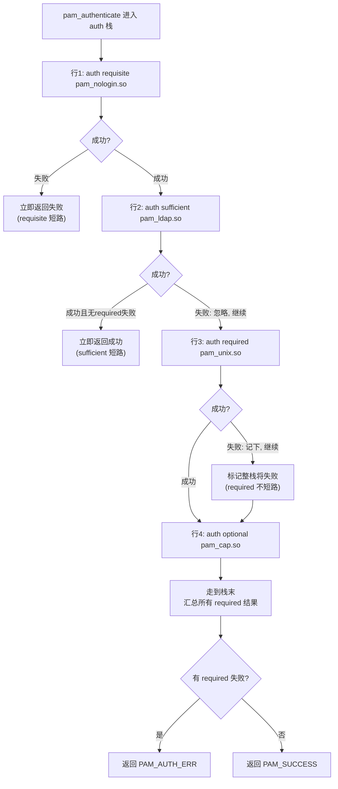

# Linux认证（03）· PAM配置语法详解

上一篇 [[02.PAM架构与设计哲学]] 讲清了"应用调抽象 API、模块实现机制、管理员配策略"三方解耦。本篇聚焦**管理员那一方**：`/etc/pam.d` 里那些看似简单的四列文本，究竟是怎样一门微型语言？control 字段的 `required`/`sufficient` 和 `[success=1 default=ignore]` 分别怎么求值？为什么把一行放错位置就能让整个认证被绕过？这是 PAM 里最需要"精确"而非"大概"的一篇——因为配置的每个词都直接决定谁能进、谁进不来。

## 概述与定位

> [!abstract] TL;DR
> - **两种配置形态**：老式单文件 `/etc/pam.conf`（每行含 service 字段）与现代目录 `/etc/pam.d/<service>`（每 service 一文件，省掉 service 列）。**只要 `/etc/pam.d/` 目录存在，libpam 就忽略 `/etc/pam.conf`**，现代系统一律用前者。
> - **每行四要素**：`type control module-path [args]`。type 是四类管理组之一，control 决定这个模块的成败如何影响整栈，module-path 是 `.so`，后面跟模块参数。
> - **control 有两种写法**：**简单关键字**（`required`/`requisite`/`sufficient`/`optional`/`include`/`substack`）和**复杂语法** `[value1=action1 value2=action2 ...]`。前者是后者的常用组合的别名。
> - **短路语义是核心**：`sufficient` 成功即整栈通过（短路），`requisite` 失败即立刻返回（短路），`required` 失败但走完栈再报错（不短路，防枚举），`optional` 通常不影响结果。
> - **复杂语法能精确控制跳转**：value 是返回码（`success`/`auth_err`/`user_unknown`/`default`…），action 是 `ok`/`done`/`bad`/`die`/`ignore`/`reset` 或数字 N（跳过 N 个模块）。`required` ≈ `[success=ok new_authtok_reqd=ok ignore=ignore default=bad]`。
> - **发行版把配置模块化**：Debian 用 `common-auth`/`common-*` + `pam-auth-update`，RHEL 用 `system-auth`/`password-auth` + `authselect`（旧 `authconfig`），各 service 用 `include`/`substack` 引用公共片段。
> - **顺序即安全**：模块在栈中的先后直接决定绕过与否，把 `sufficient` 放错位置是经典高危误配。

### pam.conf vs pam.d：为什么分家

最早 PAM 用一个大文件 `/etc/pam.conf`，每行五列：`service type control module-path args`。问题很快暴露：所有 service 挤在一个文件里，软件包安装时要**修改**这个共享文件（加自己 service 的行），卸载时要**删除**——多个包并发编辑同一文件极易冲突、难以自动化。

`/etc/pam.d/` 目录方案解决了这个痛点：**每个 service 独立一个文件**（文件名就是 service 名，如 `/etc/pam.d/sshd`），行内省掉 service 列。于是安装 openssh 就丢一个 `sshd` 文件、卸载就删掉它，包管理干净利落，互不干扰。这也是为什么今天你几乎只见 `pam.d`。**优先级规则很硬**：只要 `/etc/pam.d/` 存在，`/etc/pam.conf` 就被完全忽略。

## 原理与机制

### 一行配置的四要素

`/etc/pam.d/<service>` 里每行（注释 `#` 开头、空行忽略）是：

```text
#  type      control      module-path        module-arguments
   auth       required     pam_unix.so        nullok
   account    required     pam_unix.so
   password   requisite    pam_pwquality.so   retry=3
   session    optional     pam_motd.so
```

- **type**：`auth` / `account` / `password` / `session` 四选一（前加 `-` 如 `-session` 表示"模块不存在时静默跳过不报错"，用于可选模块）。它决定这行属于哪个管理组、被哪个主控 API 触发。
- **control**：本行模块的成败如何影响**整个该组栈**的最终结果。两种写法，本篇重点。
- **module-path**：模块 `.so`。相对名（`pam_unix.so`）到默认目录找，绝对路径则直接用。
- **module-arguments**：传给模块的参数，空格分隔（如 `nullok`、`retry=3`），含空格的参数用 `[ ]` 括起。

### 四个简单控制关键字的语义

简单关键字是最常见的写法，逐个讲清它们的**短路行为**与**错误处理**，这是能否读懂任何 pam.d 文件的关键：

| 关键字 | 成功时 | 失败时 | 短路? | 直觉 |
|---|---|---|---|---|
| **required** | 记下成功，继续 | 记下失败，**继续走完栈**，末尾才整体失败 | 否 | "必须过，但不告诉你是在哪一步挂的" |
| **requisite** | 记下成功，继续 | **立即返回失败**，不再走后续 | 是（失败短路） | "必须过，一挂立刻滚" |
| **sufficient** | 若之前无 required 失败，**立即整栈成功返回** | 忽略此失败，继续 | 是（成功短路） | "过了就够了，直接放行" |
| **optional** | 继续 | 继续 | 否 | "过不过通常不影响结果" |

深入每一个的设计意图：

- **required（必需，不短路）**：这是最反直觉但最重要的一个。模块失败时，libpam **不立即返回**，而是记下"整栈将失败"，然后**继续执行栈里剩余的模块**，走到末尾才把失败返回给应用。为什么要这样"明知会失败还继续"？**为了防止信息泄露**：如果口令错就立刻返回、用户不存在也立刻返回，攻击者能通过响应时间/顺序推断"用户名是否存在"（用户枚举）。让所有模块都跑完再统一返回失败，行为对外一致，堵住了这个侧信道。
- **requisite（必需且短路）**：与 required 唯一区别是**失败即刻返回**，不走剩余模块。用于"一旦这步不满足，后面再跑也无意义甚至有害"的场景（如 `pam_pwquality` 新密不合格，就没必要再让 `pam_unix` 去写）。代价是可能暴露"在哪一步失败"，所以要谨慎用在不涉及用户枚举的环节。
- **sufficient（充分，成功短路）**：模块**成功**且此前没有任何 required 模块失败过，则**立即让整栈成功返回**，后续模块全部跳过。这是"多选一"认证的实现方式：比如"本地口令 OR LDAP OR 指纹，任一通过即可"，就把它们都设 sufficient。失败时则**被忽略**（当作没这行），继续往下。**正因为 sufficient 成功会短路，它的位置极其敏感**——放在栈靠前且条件宽松，可能让后面本应强制的检查被整体跳过。
- **optional（可选）**：成功失败都不改变整栈结果——**除非它是该组唯一的模块**（此时它的结果就是整栈结果）。常用于"锦上添花"的模块，如 `pam_motd`（显示欢迎信息）失败了也不该挡登录。

还有两个**结构性关键字**（不是模块判定，而是引用其他配置）：

- **include**：把另一个文件的**同类型行**原地展开进来（`auth required ... \n auth include common-auth` 会把 common-auth 里的 auth 行插进来）。它是**纯文本包含**，被包含内容的 control 语义与当前栈**连续计算**。
- **substack**：也是包含，但被包含内容作为一个**独立子栈**求值，子栈内的 `done`/`die`/跳转**不越出子栈边界**。这个隔离差异下面专门讲。

### 一次 auth 栈的求值流程



> 图解：跟着一个真实 auth 栈走一遍。**requisite 的 `pam_nologin` 失败立刻踢出**（系统维护禁登时直接拒绝）；**sufficient 的 LDAP 成功就短路放行**（走域账户）；LDAP 失败则被忽略、落到 **required 的 `pam_unix`**（本地账户），它失败会标记整栈失败但仍走完 optional 行才返回。看懂这张图，就能预测任意 pam.d 配置对任意用户的判定结果。

## 复杂控制语法 [value=action] 详解

简单关键字覆盖大多数场景，但当你需要**精确控制"遇到某个返回码就跳过接下来 N 个模块"**这类逻辑时，就要用复杂语法。它是 PAM 配置的"汇编级"表达，理解它才算真正吃透 control。

### 语法结构

```text
auth  [success=1 default=ignore]  pam_succeed_if.so  uid >= 1000 quiet
auth  [success=done new_authtok_reqd=done default=die]  pam_unix.so
```

方括号里是一串 **`value=action`** 对，空格分隔。含义是：**当本模块返回码等于某个 value 时，执行对应的 action**。`default` 是兜底（匹配所有未显式列出的返回码）。

**value（左边）** 是模块返回码的小写名（去掉 `PAM_` 前缀）：

| value | 对应返回码 | 含义 |
|---|---|---|
| `success` | PAM_SUCCESS | 成功 |
| `auth_err` | PAM_AUTH_ERR | 认证失败 |
| `user_unknown` | PAM_USER_UNKNOWN | 用户不存在 |
| `new_authtok_reqd` | PAM_NEW_AUTHTOK_REQD | 口令需更新 |
| `acct_expired` | PAM_ACCT_EXPIRED | 账户过期 |
| `default` | （其余全部） | 兜底动作 |

**action（右边）** 决定命中该 value 后怎么办：

| action | 行为 |
|---|---|
| `ok` | 把本模块结果**计入**栈的最终结果（但不短路），若之前是成功则更新为当前 |
| `done` | 若栈尚无失败，**立即成功返回**（成功短路，类似 sufficient 的成功side） |
| `bad` | 标记本模块为失败，结果计入（类似 required 的失败side），**不短路** |
| `die` | 立即失败返回（失败短路，类似 requisite） |
| `ignore` | 忽略本模块结果，不计入栈汇总（相当于 PAM_IGNORE） |
| `reset` | 清空到目前为止累积的栈状态，从本模块起重新开始 |
| `N`（正整数） | **跳过接下来 N 个模块**（实现条件跳转/分支的关键） |

`N`（数字跳转）是复杂语法独有的强大能力：`[success=1 default=ignore]` 意思是"若成功就跳过下 1 行，否则忽略"。这被 Debian 大量用于实现"if-then"逻辑，例如"若 `pam_succeed_if` 判定是本地用户，就跳过后面的 LDAP 行"。

### 简单关键字 ↔ 复杂语法的等价关系

理解这组等价，就明白简单关键字只是复杂语法的**预设别名**：

| 简单关键字 | 等价复杂语法 |
|---|---|
| **required** | `[success=ok new_authtok_reqd=ok ignore=ignore default=bad]` |
| **requisite** | `[success=ok new_authtok_reqd=ok ignore=ignore default=die]` |
| **sufficient** | `[success=done new_authtok_reqd=done default=ignore]` |
| **optional** | `[success=ok new_authtok_reqd=ok default=ignore]` |

对着看就通透了：required 与 requisite 的唯一差别就是 `default` 是 `bad`（不短路）还是 `die`（短路）；sufficient 的成功是 `done`（短路成功）、失败走 `ignore`（当没发生）。**当简单关键字不够用时**（比如你想"用户不存在时短路、口令错时继续"这种细分），就直接写复杂语法自定义每个返回码的动作。

## module-path 与模块参数

module-path 后跟的参数改变模块行为，是配置的重要一环。以最常用的 `pam_unix.so` 为例：

| 参数 | 作用 |
|---|---|
| `nullok` | 允许空口令账户登录（否则空口令一律拒绝）——生产环境慎用 |
| `try_first_pass` | **先尝试**用栈中前一个模块已获取的口令，失败**再提示**用户输入 |
| `use_first_pass` | **只用**前一模块的口令，绝不重新提示（失败即失败） |
| `use_authtok` | （password 组）强制使用栈上游模块（如 pwquality）已验证的新口令，不再自己提示 |
| `sha512` / `yescrypt` | 改密时用指定算法生成哈希 |
| `remember=N` | 记住最近 N 个旧密防重用（配合 `pam_pwhistory`） |

`try_first_pass`/`use_first_pass` 体现了**模块间通过 PAM_AUTHTOK item 共享口令**的机制：栈里第一个索取口令的模块把口令存进 handle 的 PAM_AUTHTOK，后续模块用 `try_first_pass` 就能复用，避免让用户输入好几遍口令。这是多模块协作的典型模式（机制细节见 [[05.编写PAM模块-会话与数据]]）。`use_authtok` 在 password 组尤其重要：它保证 `pam_unix` 写入的正是 `pam_pwquality` 刚校验合格的那个新口令，而非重新问一遍——漏写 `use_authtok` 会导致强度检查被架空。

## include / substack / @include

三种"引用其他配置"的方式，差异微妙但影响求值：

- **`include <file>`**：把目标文件里**相同 type** 的行**平铺**进当前位置，被包含行的 control 与当前栈**连续计算**——被包含内容里若有 `sufficient` 成功短路，会直接让**整个外层栈**返回。
- **`substack <file>`**：把目标文件作为一个**独立子栈**求值。子栈内部的短路（`done`/`die`/数字跳转）**被限制在子栈内**，子栈算出一个"整体结果"后，再作为**一个逻辑单元**参与外层栈。数字跳转 `N` 尤其关键：substack 内的 `success=2` 不会跳出子栈去影响外层的行计数，而 include 会。
- **`@include <file>`（Debian 特有）**：Debian 在 pam.d 文件里用 `@include common-auth` 语法，它是**整文件包含**（不分 type，把 common-auth 的所有行原样插入），比标准 `include`（按 type 过滤）更"粗"。这是 Debian 模块化配置的黏合剂。

> [!warning] include 与 substack 的短路差异是真实的坑
> 当被包含片段里含 `sufficient` 或数字跳转时，用 `include`（短路会穿透到外层）还是 `substack`（短路封闭在内层）结果可能完全不同。企业环境把认证逻辑拆进公共片段时，选错会导致"本该继续的检查被外层短路跳过"。改这类配置务必用 `pamtester` 逐 case 验证。

## 发行版差异：Debian vs RHEL

两大发行版家族都不让你手改每个 service，而是提供**公共片段 + 管理工具**，理解这套机制才能正确改配置：

| 维度 | Debian/Ubuntu | RHEL/Fedora/CentOS |
|---|---|---|
| 公共片段 | `common-auth`/`common-account`/`common-password`/`common-session` | `system-auth`（本地登录）/`password-auth`（网络如 sshd） |
| 各 service 引用 | `@include common-auth` | `substack system-auth` 或 `include` |
| 管理工具 | `pam-auth-update`（读 `/usr/share/pam-configs/`） | `authselect`（新，取代旧 `authconfig`） |
| 改配置正道 | 装 profile 或改 pam-configs 后跑 `pam-auth-update` | `authselect select <profile>` / 自定义 profile |

**为什么不该直接手改公共片段？** 因为 `pam-auth-update` / `authselect` 会**重新生成**这些文件——你手改的内容在下次工具运行（如装了个新认证包）时会被覆盖。正道是通过工具的机制：Debian 往 `/usr/share/pam-configs/` 放 profile 再 `pam-auth-update`；RHEL 用 `authselect create-profile` 定制后 `authselect select`。这套设计的意图是让"加一个认证后端（如加 SSSD）"变成声明式操作，工具负责把它正确编织进所有 service 的栈。

## 工具视角与实战

```bash
# 1) pamtester：不真登录就测配置对某用户的判定
sudo pamtester login alice authenticate
sudo pamtester sshd  bob   authenticate acct_mgmt

# 2) pam_debug.so / 加 debug 参数：让模块吐详细日志到 syslog
#    在某行模块参数后加 debug，再看日志
sudo journalctl -f | grep pam        # 实时看 PAM 日志
sudo tail -f /var/log/auth.log       # Debian
sudo tail -f /var/log/secure         # RHEL

# 3) faillock：查看/清除失败锁定（与 auth 栈的 pam_faillock 交互）
faillock --user alice                 # 看 alice 的失败计数
sudo faillock --user alice --reset    # 解锁

# 4) 发行版工具改配置（不要手改公共片段）
sudo pam-auth-update                  # Debian：交互式启停 profile
sudo authselect select sssd          # RHEL：切到 sssd profile
sudo authselect current               # 看当前 profile

# 5) 语法/顺序自检：先备份再改，改完立刻另开终端测试
sudo cp /etc/pam.d/sshd /root/sshd.bak
```

> [!danger] 改 PAM 配置的铁律：留一个 root 会话
> 编辑 `/etc/pam.d/*` 时**永远保留一个已登录的 root 终端不要关**，另开新会话测试。一旦改错（如把 auth 全写成 requisite pam_deny），新登录会全部失败，若此时手头没有活着的 root 会话，就把自己锁在门外了。配合备份文件，出错时能立刻还原。

## 安全性与正确使用

- **顺序就是安全边界**：模块在栈中的先后直接决定结果。经典高危误配是把宽松的 `sufficient` 模块放在栈**靠前**，导致它一成功就短路，**跳过了后面本应强制执行的检查**（如失败锁定、来源限制）。加固检查的模块（`pam_faillock` preauth、`pam_nologin`）应放在能生效的位置，通常在 `pam_unix` 之前。
- **`sufficient` 是双刃剑**：它实现"多选一"很方便，但每加一个 sufficient 就多一条"成功即放行"的旁路。审计配置时要问：**这条 sufficient 成功后，哪些检查被跳过了？** 确保被跳过的都不是安全关键项。
- **`pam_faillock` 要两处正确摆放**：它需要在 auth 栈里 `preauth`（记录尝试）和 `authfail`（失败计数）两个位置正确配置，且**位置相对 `pam_unix` 有讲究**。摆错会导致锁定不生效或把合法用户误锁。改动后务必用 `faillock` 命令验证计数逻辑。
- **别手改会被工具覆盖的文件**：在 Debian 手改 `common-*`、在 RHEL 手改 `system-auth`，会被 `pam-auth-update`/`authselect` 下次运行覆盖，造成"改了又变回去"的诡异现象和安全策略回退。用工具的正规机制定制。
- **`nullok` 与缺失 `use_authtok` 是常见弱化点**：`pam_unix` 的 `nullok` 允许空口令登录，生产应移除；password 组漏写 `use_authtok` 会让 `pam_pwquality` 的强度校验被架空（unix 自己重新问密、绕过检查）。审计时重点看这两处。
- **改配置必须验证再收工**：PAM 配置错误的后果是"要么谁都进不来、要么谁都能进"。任何改动都应：先备份、保留活 root 会话、改后用 `pamtester` 与真实新会话双重验证，确认无误再离开。

## 小结

1. **两种形态一种优先**：`/etc/pam.conf`（单文件五列）已被 `/etc/pam.d/<service>`（每 service 一文件四列）取代，目录存在则单文件被忽略。
2. **每行四要素**：type（四组之一）、control（成败如何影响整栈）、module-path（.so）、args（模块参数）。
3. **简单关键字的短路语义要背熟**：required（失败不短路、防枚举）、requisite（失败即返回）、sufficient（成功即短路放行）、optional（通常不影响），外加 include/substack 两个结构关键字。
4. **复杂语法 `[value=action]` 是精确控制**：value 是返回码、action 是 ok/done/bad/die/ignore/reset/N，简单关键字只是它的预设别名（如 required ≈ `[...default=bad]`）。
5. **module 参数与 include/substack 影响协作与短路边界**：`try_first_pass`/`use_authtok` 让模块共享口令，include 短路穿透而 substack 封闭。
6. **发行版用公共片段 + 工具管理**：Debian 的 `common-*`+`pam-auth-update`、RHEL 的 `system-auth`/`password-auth`+`authselect`，别手改被工具覆盖的文件。
7. **顺序即安全**：sufficient 放错位置可致绕过；改配置留活 root 会话、备份、`pamtester` 验证，是不可省的纪律。

## 相关阅读

- **上游：PAM 架构与四管理组** → [[02.PAM架构与设计哲学]]
- **control 汇总的底层：返回码与栈** → [[02.PAM架构与设计哲学]]（模块栈求值节）
- **下游：动手写模块** → [[04.编写PAM模块-服务函数]]
- **口令共享机制（try_first_pass 背后）** → [[05.编写PAM模块-会话与数据]]
- **核心模块（pam_unix/pwquality/faillock）细节** → [[06.核心PAM模块源码剖析]]
- **配置误配导致的绕过（安全视角）** → [[09.PAM安全陷阱与逆向视角]]
- **手册**：`man pam.conf`、`man pam.d`、`man pam_unix`、`man pam-auth-update`、`man authselect`、`man pamtester`

---

🏠 [[00.Linux认证与登录编程总览]] ｜ 上一篇 [[02.PAM架构与设计哲学]] ｜ 下一篇 [[04.编写PAM模块-服务函数]] ➡️
