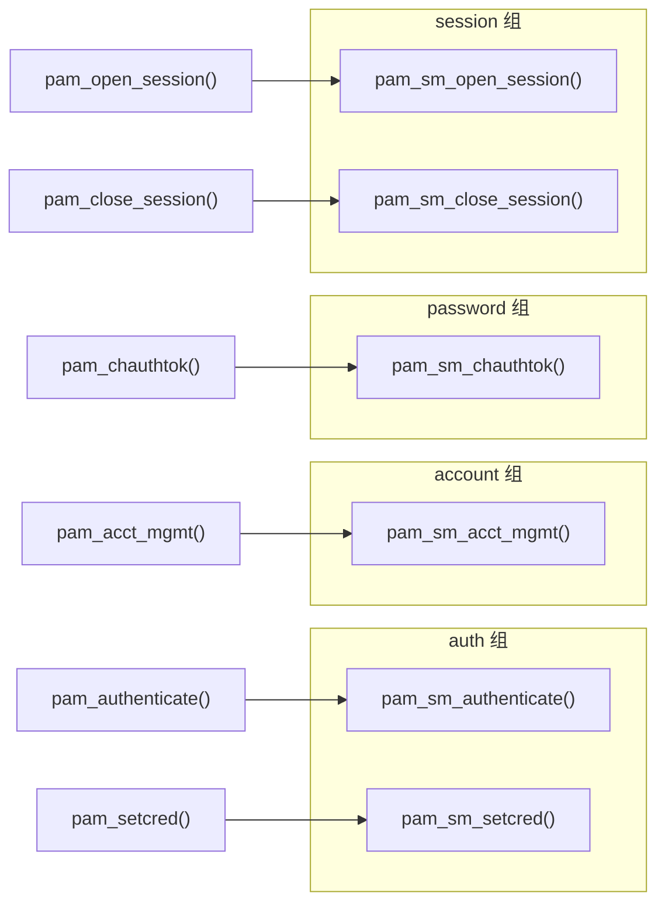

# Linux认证（04）· 编写PAM模块-服务函数

前两篇建立了"配置者"视角：[[02.PAM架构与设计哲学]] 讲清四类管理组与主控 API，[[03.PAM配置语法详解]] 拆透了 `/etc/pam.d` 的每一列。本篇正式切换到**模块开发者**视角——一个 `.so` 文件要长成什么样，才能被 libpam 当作合法的 PAM 模块加载并调用？答案就是：**导出一组约定好名字的 `pam_sm_*` 服务函数**。本篇讲清这六个函数的签名、flags、返回码，给出一个能真跑起来的最小骨架，并把它编译、安装、用 `pamtester` 测通。理解了服务函数，你就跨过了从"读 PAM"到"写 PAM"的门槛。

## 概述与定位

> [!abstract] TL;DR
> - **PAM 模块本质是一个共享库**（`.so`），它不含 `main`，而是**导出六个约定名字的服务函数** `pam_sm_*`。libpam 在求值模块栈时 `dlopen` 这个库、`dlsym` 找到对应函数并调用。
> - **六个服务函数一一对应四类管理组**：`pam_sm_authenticate`/`pam_sm_setcred`（auth）、`pam_sm_acct_mgmt`（account）、`pam_sm_chauthtok`（password）、`pam_sm_open_session`/`pam_sm_close_session`（session）。你只需实现自己关心的那几个。
> - **统一签名**：`int pam_sm_xxx(pam_handle_t *pamh, int flags, int argc, const char **argv)`。`pamh` 是事务句柄，`flags` 是调用标志，`argc`/`argv` 是 pam.d 里写在模块名后的参数。
> - **`PAM_SM_*` 宏**（`PAM_SM_AUTH`/`PAM_SM_ACCOUNT`/`PAM_SM_SESSION`/`PAM_SM_PASSWORD`）在包含头文件前 `#define`，用于控制静态模块时的符号可见性，动态模块惯例上仍会写。
> - **返回码就是模块的"判决"**：`PAM_SUCCESS`（通过）、`PAM_AUTH_ERR`（认证失败）、`PAM_USER_UNKNOWN`（用户不存在）、`PAM_IGNORE`（当我不存在）、`PAM_CRED_INSUFFICIENT`、`PAM_MAXTRIES` 等，配合 pam.d 的 control 字段决定整栈走向。
> - **`pam_sm_chauthtok` 有两阶段**：libpam 分 `PAM_PRELIM_CHECK`（预检，各模块试探能否改密）和 `PAM_UPDATE_AUTHTOK`（真正写入）两趟调用同一个函数，模块要按 flags 分支处理。
> - **编译即一条 `gcc -fPIC -shared`**：产出 `.so` 放进本机模块目录（如 `/lib/x86_64-linux-gnu/security/`），在 `/etc/pam.d` 里引用，用 `pamtester` 免登录验证。

### 模块开发者要回答的三个问题

写一个 PAM 模块，本质是回答三件事：**（1）我要参与哪个管理组？** 决定实现哪几个 `pam_sm_*`。**（2）我拿到句柄后要做什么判断？** 读取用户名/口令/参数，执行你的认证或检查逻辑。**（3）我把结论怎么告诉 libpam？** 通过 return 一个返回码。本篇聚焦第一和第三点（函数骨架与返回码），第二点里"怎么向用户要口令、怎么跨阶段存数据"留给下一篇 [[05.编写PAM模块-会话与数据]]。

## 原理与机制

### 模块是被宿主进程 dlopen 的共享库

一个 PAM 模块**没有 `main` 函数**，它是一个位置无关的动态库。当 login/sshd 调用 `pam_authenticate()` 时，libpam 读 `/etc/pam.d/<service>` 找到 auth 栈里配的模块（如 `pam_unix.so`），对每个模块执行大致这样的动作：`dlopen("/lib/.../pam_unix.so")` → `dlsym(handle, "pam_sm_authenticate")` → 调用它 → 按返回码和 control 决定下一步。这意味着：

- **模块运行在宿主进程的地址空间和权限里**。login 认证时是 root，你的模块也就是 root。模块崩溃或有漏洞，等于宿主进程崩溃或沦陷——这是安全性一节的核心。
- **函数名必须精确匹配**。`dlsym` 按字符串找符号，写错一个字母（`pam_sm_authentificate`）不会编译报错，而是运行时"找不到该服务函数"，libpam 按 control 语义降级处理（通常视为模块无此能力）。
- **模块可以只实现部分函数**。一个只做 account 检查的模块，只导出 `pam_sm_acct_mgmt` 即可；若它被误配进 auth 栈，libpam 找不到 `pam_sm_authenticate`，会返回一个"模块未实现此功能"的结果。

### 六个服务函数与四管理组的映射

这是本篇的骨架图。左边是应用调用的主控 API（[[02.PAM架构与设计哲学]] 已讲），中间是四类管理组，右边是模块必须导出的服务函数——**三者一一对应，是 PAM 分工协作的枢纽**：



> 图解：应用侧每调一个主控 API，libpam 就在对应管理组的栈里，逐个模块调用同名的 `pam_sm_*` 函数。**注意 auth 组有两个函数**（authenticate 验身份、setcred 建凭据），**session 组有两个函数**（open/close 对称），account 与 password 各一个。你写模块时，"我要管什么"直接决定"我导出哪几个 `pam_sm_*`"。

### PAM_SM_* 宏的作用

在实现文件里，你会看到这样的开头：

```c
#define PAM_SM_AUTH          /* 声明本模块提供 auth 功能 */
#define PAM_SM_ACCOUNT       /* 若还提供 account 功能 */
#include <security/pam_modules.h>
```

`PAM_SM_AUTH`/`PAM_SM_ACCOUNT`/`PAM_SM_SESSION`/`PAM_SM_PASSWORD` 这四个宏，在**静态链接 PAM**（把模块编进 libpam 的老式构建）时用于控制哪些符号可见、生成静态模块注册表。对于今天绝大多数**动态模块**（独立 `.so`），它们的实际约束力有限，但**惯例上仍按"本模块实现哪些组就 `#define` 哪些宏"来写**，既是自文档、也保证在静态构建路径下正确。记住：宏声明的是"我打算实现的组"，真正生效的是你**是否真的定义了对应的 `pam_sm_*` 函数**。

## 服务函数与骨架详解

### 统一的函数签名

六个服务函数共享同一套签名，只是函数名不同：

```c
int pam_sm_authenticate(pam_handle_t *pamh, int flags, int argc, const char **argv);
int pam_sm_setcred    (pam_handle_t *pamh, int flags, int argc, const char **argv);
int pam_sm_acct_mgmt  (pam_handle_t *pamh, int flags, int argc, const char **argv);
int pam_sm_chauthtok  (pam_handle_t *pamh, int flags, int argc, const char **argv);
int pam_sm_open_session (pam_handle_t *pamh, int flags, int argc, const char **argv);
int pam_sm_close_session(pam_handle_t *pamh, int flags, int argc, const char **argv);
```

四个参数逐一说清：

- **`pam_handle_t *pamh`**：本次认证事务的**句柄**。它是你与 libpam 交互的唯一入口——通过它取用户名（`pam_get_user`）、要口令（`pam_get_authtok`）、读写 item、存私有数据、写日志。整个事务里所有模块共享同一个 `pamh`，这也是跨模块传值的载体（下一篇详解）。
- **`int flags`**：调用标志位掩码，随管理组不同而不同（下面专门列表）。模块必须**识别并尊重**某些 flag，例如 `PAM_SILENT` 要求不要向用户输出提示、`chauthtok` 的两阶段 flag 决定这趟该预检还是该写入。
- **`int argc` / `const char **argv`**：pam.d 配置行里**写在模块名之后的参数**。例如 `auth required pam_mymod.so debug retries=3`，模块拿到 `argc=2`、`argv={"debug","retries=3"}`。模块自己解析这些字符串来调整行为。注意这**不是**进程的 argc/argv，而是配置传入的模块参数。

### 各管理组的 flags

flags 是新手最容易忽略却影响正确性的一环。按管理组分类：

| flag | 适用函数 | 含义 |
|---|---|---|
| `PAM_SILENT` | 全部 | 不要向用户输出任何消息（应用要求静默） |
| `PAM_DISALLOW_NULL_AUTHTOK` | authenticate | **禁止空口令通过**；模块若允许 nullok，遇此 flag 也必须拒绝空口令 |
| `PAM_ESTABLISH_CRED` | setcred | 建立凭据（认证成功后正常调用） |
| `PAM_DELETE_CRED` | setcred | 删除凭据（会话结束时） |
| `PAM_REINITIALIZE_CRED` | setcred | 重新初始化已有凭据 |
| `PAM_REFRESH_CRED` | setcred | 刷新凭据（延长有效期） |
| `PAM_CHANGE_EXPIRED_AUTHTOK` | chauthtok | 只在口令**已过期**时才改（登录流程触发的强制改密用它，普通 `passwd` 不带） |
| `PAM_PRELIM_CHECK` | chauthtok | 第一阶段：预检，不真正改 |
| `PAM_UPDATE_AUTHTOK` | chauthtok | 第二阶段：真正写入新令牌 |

`PAM_DISALLOW_NULL_AUTHTOK` 尤其要处理正确：它对应 pam.d 里期望"绝不允许空口令"的策略，模块内部即便实现了 nullok，也**必须在见到这个 flag 时收回该宽松行为**，否则就是一个可绕过的弱点。

### 最小可用模块骨架（pam_hello.so）

下面是一个**教育用途、防御导向**的最小模块：它读一个参数决定放行还是拒绝，展示服务函数的完整形态。生产中不会这样用，但它把"骨架长什么样"讲透了。

```c
#define PAM_SM_AUTH
#define PAM_SM_ACCOUNT
#include <security/pam_modules.h>
#include <security/pam_ext.h>     /* pam_syslog */
#include <string.h>
#include <syslog.h>

/* auth 组：验证身份。这里仅演示——真实模块应在此校验凭据 */
int pam_sm_authenticate(pam_handle_t *pamh, int flags,
                        int argc, const char **argv)
{
    const char *user = NULL;
    if (pam_get_user(pamh, &user, NULL) != PAM_SUCCESS || user == NULL)
        return PAM_USER_UNKNOWN;          /* 拿不到用户名 */

    /* 解析模块参数：出现 "deny" 就拒绝，否则忽略(不表态) */
    for (int i = 0; i < argc; i++) {
        if (strcmp(argv[i], "deny") == 0) {
            pam_syslog(pamh, LOG_NOTICE, "pam_hello: deny %s", user);
            return PAM_AUTH_ERR;          /* 认证失败 */
        }
    }
    /* 不参与判定：交回给栈里其它模块 */
    return PAM_IGNORE;
}

/* auth 组：建立凭据。无凭据可建时按惯例返回 SUCCESS */
int pam_sm_setcred(pam_handle_t *pamh, int flags,
                   int argc, const char **argv)
{
    return PAM_SUCCESS;
}

/* account 组：身份已确认后，此刻是否允许 */
int pam_sm_acct_mgmt(pam_handle_t *pamh, int flags,
                     int argc, const char **argv)
{
    return PAM_SUCCESS;                   /* 演示：一律放行 */
}
```

这段骨架的几个要点，比代码本身更值得记住：

- **只实现关心的组**：这里实现了 auth 与 account，没实现 session/password。若被误配进 session 栈，libpam 找不到 `pam_sm_open_session` 会给出"未实现"结果。
- **`pam_sm_setcred` 必须存在**：一旦模块进了 auth 组，libpam 在 `pam_setcred()` 阶段会来找它。即便没有凭据要建，也要提供一个返回 `PAM_SUCCESS` 的实现，否则 setcred 阶段会报"符号缺失"。这是极常见的新手坑。
- **`PAM_IGNORE` 是"弃权"而非"通过"**：返回它表示"这次我不表态"，让栈继续。它与 control 的交互见后文——放在 `required` 里的 IGNORE 不会导致整栈失败，也不会算作成功。
- **凡输出走 `pam_syslog`**：模块不能随便 `printf` 到 stdout（宿主可能是 sshd，根本没终端），要交互得走 conversation（下一篇），要记录得走 `pam_syslog`。

## pam_sm_chauthtok 的两阶段协议

改密（password 组）比其它组复杂，因为它天然是**多模块协作的写操作**，libpam 用"两趟调用"来保证原子性直觉。理解这个协议是写 password 模块的前提。

当应用调 `pam_chauthtok()` 时，libpam **对 password 栈里每个模块调用两次** `pam_sm_chauthtok`：

1. **第一趟 `PAM_PRELIM_CHECK`（预检）**：libpam 带着 `PAM_PRELIM_CHECK` flag 走一遍整个栈，让**每个模块试探性地检查"我现在有没有能力完成改密"**——例如 `pam_unix` 检查 shadow 可写、后端服务可达；`pam_pwquality` 此阶段通常什么都不做或只做轻量校验。**任一模块在预检返回失败，libpam 就不进入第二阶段**，从而避免"改了一半"（比如本地改了、LDAP 没改成）的不一致。
2. **第二趟 `PAM_UPDATE_AUTHTOK`（写入）**：只有预检全过，libpam 才带 `PAM_UPDATE_AUTHTOK` flag 再走一遍，此时模块**真正生成并写入新令牌**（`pam_pwquality` 校验强度、`pam_unix` 把新哈希写回 shadow）。

模块内部因此是这样的分支结构：

```c
int pam_sm_chauthtok(pam_handle_t *pamh, int flags,
                     int argc, const char **argv)
{
    if (flags & PAM_PRELIM_CHECK) {
        /* 预检：能改吗？后端可达吗？可写吗？ */
        return backend_reachable() ? PAM_SUCCESS : PAM_TRY_AGAIN;
    }
    if (flags & PAM_UPDATE_AUTHTOK) {
        /* 真正写入新口令 */
        return do_update_password(pamh);
    }
    return PAM_SYSTEM_ERR;   /* 两个 flag 都没有：异常 */
}
```

> [!note] 为什么要两阶段
> 改密常常要同时更新**多个后端**（本地 shadow + LDAP + Kerberos）。若不预检就直接改，某个后端中途失败会留下"部分账户改了、部分没改"的分裂状态，用户下次登录一半系统用新密、一半用旧密。两阶段协议让 libpam 先确认"所有模块都准备好了"再统一动手，把失败尽量挡在写入之前。`PAM_CHANGE_EXPIRED_AUTHTOK` 则是另一维度：它告诉模块"这是登录时因过期强制改密，不是用户主动 `passwd`"，模块可据此只处理过期账户。

## 返回码语义与 control 的交互

服务函数的返回值是模块唯一的"判决书"。它不是孤立的——**返回码要和 pam.d 里这行的 control 字段一起，才决定整栈走向**（control 语义见 [[03.PAM配置语法详解]]）。核心返回码：

| 返回码 | 含义 | 典型来源 |
|---|---|---|
| `PAM_SUCCESS` | 成功/通过 | 口令正确、检查通过 |
| `PAM_AUTH_ERR` | 认证失败 | 口令错误 |
| `PAM_USER_UNKNOWN` | 用户不存在 | 查不到该用户 |
| `PAM_CRED_INSUFFICIENT` | 凭据不足 | 有身份但凭据不够（如缺少要求的因子） |
| `PAM_MAXTRIES` | 尝试次数超限 | 失败锁定类模块 |
| `PAM_IGNORE` | 弃权，不计入栈汇总 | 模块判断自己不适用当前场景 |
| `PAM_PERM_DENIED` | 权限拒绝 | account 组判定不可用 |
| `PAM_NEW_AUTHTOK_REQD` | 口令需更新 | account 发现口令过期 |

**`PAM_IGNORE` 与 control 的交互最需要说清**：当一行 control 是 `required`，模块返回 `PAM_AUTH_ERR` 会标记整栈失败；但返回 `PAM_IGNORE`，libpam 会**当这行不存在**——既不标记失败也不算成功，栈继续。这正是 `pam_succeed_if`、条件模块"不匹配就退场"的机制。反过来，若一个栈里**所有**模块都返回 `PAM_IGNORE`，整栈没有任何有效结果，libpam 会返回一个类似 `PAM_PERM_DENIED` 的默认失败——"没人表态"不等于"通过"。因此设计模块的返回码时，要想清楚：我在什么情况下该"弃权"（IGNORE），什么情况下该"明确失败"（AUTH_ERR）——这两者对整栈的影响截然不同。

## 工具视角与实战

```bash
# 1) 编译成位置无关的共享库（核心一条命令）
gcc -fPIC -shared -o pam_hello.so pam_hello.c -lpam
#   -fPIC 位置无关代码（共享库必需）
#   -shared 生成 .so
#   -lpam 链接 libpam（用到 pam_syslog/pam_get_user 等）

# 2) 装到本机的 PAM 模块目录（先确认路径！各发行版不同）
ls -d /lib/x86_64-linux-gnu/security/   # Debian/Ubuntu multiarch
ls -d /lib64/security/                  # RHEL/Fedora
sudo install -m 0644 -o root -g root pam_hello.so \
     /lib/x86_64-linux-gnu/security/

# 3) 建一个专用测试 service，避免动 login/sshd 把自己锁外面
sudo tee /etc/pam.d/hellotest >/dev/null <<'EOF'
auth     required   pam_hello.so
account  required   pam_hello.so
EOF

# 4) 用 pamtester 免真登录驱动：观察放行/拒绝
sudo pamtester hellotest "$USER" authenticate         # 无 deny 参数→IGNORE
#   把配置改成:  auth required pam_hello.so deny
sudo pamtester hellotest "$USER" authenticate         # →PAM_AUTH_ERR

# 5) 看模块吐的日志（pam_syslog 落到 auth 日志）
sudo journalctl -t hellotest -f          # 或
sudo tail -f /var/log/auth.log           # Debian
sudo tail -f /var/log/secure             # RHEL
```

> [!danger] 开发 PAM 模块的头号纪律：别拿 login/sshd 当试验田
> 一个有 bug 的模块（段错误、死循环、误拒）配进 `/etc/pam.d/login` 或 `sshd`，可能让你**再也登不进这台机器**。铁律：（1）**先用独立测试 service + `pamtester`** 反复验证；（2）改真实 service 前**留一个已登录的 root 终端不关**；（3）改 sshd 时**先开好第二个 ssh 会话**再动配置。模块崩溃就是宿主进程崩溃，代价是被锁在门外。

## 安全性与正确使用

- **模块以宿主权限运行，代码质量即安全边界**：login 认证时你的模块是 root。缓冲区溢出、格式化字符串、`system()` 拼接用户输入——任何一个漏洞都是 root 级 RCE。模块代码要按"高权限攻击面"标准审计：不信任 `argv`、不信任 conversation 拿到的用户输入、边界检查到位。
- **务必尊重 flags**：见到 `PAM_DISALLOW_NULL_AUTHTOK` 必须拒绝空口令，即便实现了 nullok；见到 `PAM_SILENT` 不要再向用户喷消息。忽略 flags 会让模块行为偏离管理员通过 pam.d 表达的策略，形成隐蔽绕过。
- **`pam_sm_setcred` 不能省**：进了 auth 组就要提供它，哪怕只返回 `PAM_SUCCESS`。缺它会导致 `pam_setcred()` 阶段报错，进而"认证过了但建立凭据失败"，表现为登录成功却无权限。
- **返回码要精确区分弃权与失败**：滥用 `PAM_SUCCESS`（把"我不适用"当"通过"）是危险的——它可能在 `sufficient` 下直接短路放行整栈。不适用就返回 `PAM_IGNORE`，明确失败才返回 `PAM_AUTH_ERR`。
- **两阶段改密不能只实现一阶段**：`pam_sm_chauthtok` 若不区分 `PAM_PRELIM_CHECK`/`PAM_UPDATE_AUTHTOK`，要么在预检就写库（破坏原子性），要么在写入阶段什么都没做（改密静默失效）。两个分支都要正确。
- **模块目录权限必须锁死**：`/lib*/security/` 只能 root 可写。任何用户能往里放 `.so`，等于能让下次登录以 root 执行任意代码。这也是 [[09.PAM安全陷阱与逆向视角]] 检测后门的重点：核对模块目录里每个文件的来源与完整性（`dpkg -V`/`rpm -V`）。

## 小结

1. **PAM 模块是导出 `pam_sm_*` 的共享库**：无 `main`，由 libpam `dlopen`+`dlsym` 调用，运行在宿主进程的权限里。
2. **六个服务函数对应四管理组**：authenticate/setcred（auth）、acct_mgmt（account）、chauthtok（password）、open_session/close_session（session）；只需实现关心的组，但进 auth 组必须一并提供 setcred。
3. **统一签名 `(pamh, flags, argc, argv)`**：`pamh` 是事务句柄与交互入口，`flags` 是调用标志（如 `PAM_SILENT`/`PAM_DISALLOW_NULL_AUTHTOK`/两阶段 flag），`argc`/`argv` 是 pam.d 里的模块参数。
4. **`PAM_SM_*` 宏声明"实现哪些组"**：静态构建时控制符号可见性，动态模块按惯例照写，真正生效的是是否定义了对应函数。
5. **`pam_sm_chauthtok` 分两趟**：`PAM_PRELIM_CHECK` 预检、`PAM_UPDATE_AUTHTOK` 写入，保证多后端改密的原子性直觉。
6. **返回码与 control 联合决定走向**：`PAM_SUCCESS`/`PAM_AUTH_ERR`/`PAM_USER_UNKNOWN`/`PAM_CRED_INSUFFICIENT`/`PAM_MAXTRIES`，而 `PAM_IGNORE` 是"弃权"——在 required 下不致败也不算成功。
7. **编译一条 `gcc -fPIC -shared ... -lpam`**：装进本机模块目录，用独立 service + `pamtester` 免登录验证，永远留活 root 会话防自锁。

## 相关阅读

- **上游：管理组与主控 API** → [[02.PAM架构与设计哲学]]
- **上游：control 如何汇总返回码** → [[03.PAM配置语法详解]]
- **下游：模块怎么向用户要口令、跨阶段存数据** → [[05.编写PAM模块-会话与数据]]
- **真实模块长什么样（pam_unix 剖析）** → [[06.核心PAM模块源码剖析]]
- **模块被恶意篡改的检测（后门视角）** → [[09.PAM安全陷阱与逆向视角]]
- **哈希算法（模块比对口令时用）** → [[37.密码学/00.密码学总览|密码学]]
- **手册**：`man 3 pam_sm_authenticate`、`man 3 pam_sm_chauthtok`、`man pam_get_user`、The Linux-PAM Module Writers' Guide

---

🏠 [[00.Linux认证与登录编程总览]] ｜ 上一篇 [[03.PAM配置语法详解]] ｜ 下一篇 [[05.编写PAM模块-会话与数据]] ➡️
