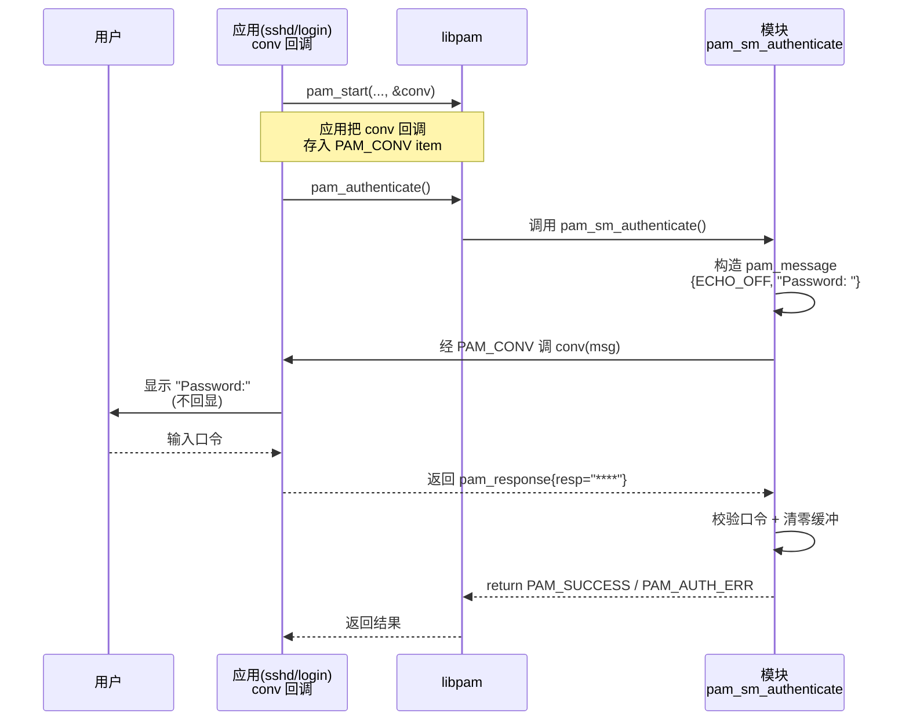

# Linux认证（05）· 编写PAM模块-会话与数据

上一篇 [[04.编写PAM模块-服务函数]] 给出了 `pam_sm_*` 的骨架，但留了一个大坑没填：模块运行在 sshd/login 进程里，**它根本没有终端可以 `printf`、也没法直接 `scanf` 读口令**，那它到底怎么向用户要密码？答案是 PAM 最精妙的设计之一——**conversation（对话）机制**：模块不直接碰 I/O，而是把"请向用户显示这句话、收回一个输入"打包成消息，交给应用提供的回调去完成。本篇讲透 conversation，再讲清模块如何取用户名与令牌（item）、如何跨阶段跨模块传值（data）、如何设环境与写日志，以及贯穿始终的内存与口令安全。掌握本篇，你的模块才真正"能与世界交互"。

## 概述与定位

> [!abstract] TL;DR
> - **conversation 是模块与用户交互的唯一通道**：模块不直接读写终端，而是构造 `struct pam_message` 数组，通过 `pam_conv` 回调交给**应用**（login/sshd）去实际显示提示、收集输入，再以 `struct pam_response` 数组返回。这解耦了"要什么信息"（模块）与"怎么问用户"（应用）。
> - **四种消息类型**：`PAM_PROMPT_ECHO_OFF`（问口令，不回显）、`PAM_PROMPT_ECHO_ON`（问用户名等，回显）、`PAM_ERROR_MSG`（报错）、`PAM_TEXT_INFO`（提示信息）。
> - **便利函数省去手搓 conversation**：`pam_get_user` 取用户名、`pam_get_authtok`（Linux-PAM 扩展）取口令，内部都封装了 conversation 与缓存逻辑，日常写模块优先用它们。
> - **item 是事务级的标准状态**：`pam_get_item`/`pam_set_item` 读写 `PAM_USER`/`PAM_AUTHTOK`/`PAM_RHOST`/`PAM_SERVICE`/`PAM_CONV`/`PAM_TTY` 等预定义槽位，是模块间共享"标准信息"的方式。
> - **data 是模块私有的跨阶段状态**：`pam_set_data`/`pam_get_data` 存任意指针 + 一个 **cleanup 回调**，用于把值从 auth 阶段传到 session 阶段（同一 `pamh` 事务内），`pam_end` 时自动调 cleanup 释放。
> - **环境与日志**：`pam_putenv`/`pam_getenv`/`pam_getenvlist` 操作 PAM 环境（最终注入用户会话），`pam_syslog` 是模块记录日志的正道。
> - **内存与口令安全是硬约束**：`pam_response` 及其内含字符串由**模块负责释放**（misc_conv 分配、模块用完 free）；口令用后要**清零**再释放，避免残留在内存/交换区。

### 为什么模块不能自己读口令

想象你的模块直接 `fgets(stdin)` 读口令。当宿主是 **sshd** 时，认证发生在网络协议层，根本没有本地 stdin/tty；当宿主是**图形登录管理器 gdm** 时，输入来自 GUI 密码框；当宿主是 **su** 时，又是另一个 tty。**只有应用自己知道"用户在哪、怎么问"**。PAM 的解法是把这件事反转：模块只声明"我需要一个不回显的口令输入"，具体怎么呈现给用户，交给应用注入的 conversation 回调。login 的回调走 tty，sshd 的回调走 SSH 协议，gdm 的回调弹对话框——同一个模块，在三种宿主里都能正确要到口令。这就是 conversation 的价值。

## 原理与机制

### 三种状态载体：conversation、item、data

模块要与外界打交道，PAM 提供三种彼此分工的机制，先建立全局观再逐个深入：

| 机制 | 方向 | 生命周期 | 用途 |
|---|---|---|---|
| **conversation** | 模块 ↔ 用户 | 单次调用 | 实时向用户要输入/给提示（口令、验证码、消息） |
| **item** | 模块 ↔ libpam ↔ 模块 | 整个事务 | 读写**预定义**的标准槽位（用户名、口令、rhost、tty…） |
| **data** | 模块 ↔ 模块 | 整个事务 | 存**任意自定义**的私有数据，跨阶段传递 |

一句话区分：**conversation 面向"活人"**（要用户当场输入），**item 是"标准变量"**（PAM 定义好名字的公共信息），**data 是"私有变量"**（模块自己起名、自己解释的状态）。三者都挂在同一个 `pam_handle_t *pamh` 上，`pam_end` 时统一清理。

### pam_conv 结构：应用注入的回调

conversation 的起点在**应用侧**：应用调 `pam_start` 时传入一个 `struct pam_conv`：

```c
struct pam_conv {
    int (*conv)(int num_msg,
                const struct pam_message **msg,
                struct pam_response **resp,
                void *appdata_ptr);
    void *appdata_ptr;      /* 透传给 conv 的应用私有数据 */
};
```

- **`conv` 回调**：由**应用**实现（或用现成的 `misc_conv`）。libpam/模块调用它，把一组消息（`msg`）交给它，它负责显示、收集用户输入，填好 `resp` 返回。
- **`appdata_ptr`**：应用的私有指针，libpam 原样透传给 `conv` 的最后一个参数——让应用的回调能访问自己的上下文（如 GUI 句柄），模块不解释它。

模块侧要用这个回调时，先通过 `pam_get_item(pamh, PAM_CONV, ...)` 取出这个结构，再调用它的 `conv` 成员。不过实践中**极少手动这样做**，因为 `pam_get_authtok` 已经封装好了。

### 四种消息类型

模块构造 `pam_message` 时，用 `msg_style` 字段声明这条消息的性质，应用据此决定呈现方式：

| msg_style | 含义 | 应用典型行为 |
|---|---|---|
| `PAM_PROMPT_ECHO_OFF` | 索取**敏感**输入 | 显示提示，读入但**不回显**（问口令、PIN） |
| `PAM_PROMPT_ECHO_ON` | 索取**非敏感**输入 | 显示提示，读入并回显（问用户名、OTP 序号） |
| `PAM_ERROR_MSG` | 错误消息 | 显示（可能红色/stderr），不收输入 |
| `PAM_TEXT_INFO` | 普通信息 | 显示（如"口令还有 3 天过期"），不收输入 |

前两种要求用户输入、会在 `resp` 里回填内容；后两种只是单向告知，`resp` 对应项为空。这套分类让应用能对"该不该回显""该不该收输入"做正确处理——例如 sshd 会把 `PAM_PROMPT_ECHO_OFF` 映射成 SSH 键盘交互认证的隐藏输入。

## conversation 对话机制详解

### 一次对话的完整时序

把模块要口令的全过程画成时序，是理解 conversation 的最快方式：



> 图解：**主动权在模块**——是模块决定"现在要问口令"，构造消息发起对话；但**执行权在应用**——具体怎么呈现、从哪读输入，由应用的 conv 回调完成。libpam 只是把两者对接起来（通过 `PAM_CONV` item 保存的回调）。看懂这条时序，就明白为什么同一个 `pam_unix` 在 tty、SSH、GUI 三种宿主下都能正确要到口令：变的是 conv 回调，模块代码一字不改。

### misc_conv：现成的文本对话实现

写**测试程序或简单命令行应用**时，不必自己实现 conv 回调——Linux-PAM 的 `libpam_misc` 提供了 `misc_conv`，一个基于终端的标准实现：

```c
#include <security/pam_misc.h>       /* 声明 misc_conv */
/* 链接时加 -lpam_misc */

struct pam_conv conv = { misc_conv, NULL };
pam_start("myservice", user, &conv, &pamh);
```

`misc_conv` 会对 `PAM_PROMPT_ECHO_OFF` 关闭终端回显读口令、对 `PAM_TEXT_INFO` 打印到终端，把繁琐的 termios 处理都封装好了。**注意它属于 libpam_misc（`-lpam_misc`），不是 libpam 本体**，且是 Linux-PAM 特有；OpenPAM 有自己的 `openpam_ttyconv`。生产级图形/网络应用则要实现自己的 conv。

### 手动发起对话 vs 用 pam_get_authtok

理论上模块可以自己取 `PAM_CONV`、构造 `pam_message`、调 conv、解析 `pam_response`——但这套样板代码又长又容易在内存管理上出错。**Linux-PAM 因此提供了 `pam_get_authtok`**，把"要口令"这件最常见的事一把封装：

```c
const char *authtok = NULL;
int rc = pam_get_authtok(pamh, PAM_AUTHTOK, &authtok, NULL);
/* 内部逻辑：先看 PAM_AUTHTOK item 有没有缓存(前一模块已问过)；
   没有就发起 ECHO_OFF 对话问用户；问到后自动存回 PAM_AUTHTOK 供后续模块复用 */
```

这一个调用就实现了 [[03.PAM配置语法详解]] 里 `try_first_pass`/`use_first_pass` 背后的口令共享：**第一个索取口令的模块把它存进 `PAM_AUTHTOK` item，后续模块的 `pam_get_authtok` 直接命中缓存**，用户只输一次。这就是为什么栈里配了好几个 auth 模块，登录却只问一次密码。

## 取用户与令牌：get_user / item

### pam_get_user 取用户名

用户名的获取要用专用函数而非直接读 item：

```c
const char *user = NULL;
int rc = pam_get_user(pamh, &user, "login: ");
/* 若 PAM_USER item 已有(pam_start 传了)就直接返回；
   否则用给定提示发起 ECHO_ON 对话问，问到后存进 PAM_USER */
```

为什么不直接 `pam_get_item(PAM_USER)`？因为 `pam_start` 时用户名可能是 NULL（如 `login` 一开始不知道谁要登录），`pam_get_user` 封装了"没有就去问"的逻辑，而 `pam_get_item` 只会返回 NULL。**取用户名一律用 `pam_get_user`**。

### item：事务级的标准槽位

item 是 PAM 预定义的一组"标准信息槽"，模块用 `pam_get_item`/`pam_set_item` 读写。常用项：

| item | 内容 | 谁设置 |
|---|---|---|
| `PAM_USER` | 目标用户名 | pam_start 或 pam_get_user |
| `PAM_AUTHTOK` | 当前认证令牌（口令） | pam_get_authtok / 模块 |
| `PAM_OLDAUTHTOK` | 旧令牌（改密时） | chauthtok 流程 |
| `PAM_SERVICE` | service 名（决定读哪份配置） | pam_start（只读） |
| `PAM_RHOST` | 远程主机名/IP | 应用（sshd 设为客户端 IP） |
| `PAM_RUSER` | 远程用户名 | 应用 |
| `PAM_TTY` | 终端名 | 应用 |
| `PAM_CONV` | conversation 回调结构 | pam_start |

`pam_get_item` 返回的是**指向 PAM 内部存储的指针，模块不要 free 它**（与后面 conversation response 需要模块 free 形成对比）。`PAM_RHOST` 尤其常用：来源限制类模块（如只允许内网登录）靠读它做判断。**注意 `PAM_RHOST` 由应用设置、可能来自网络，属于"不完全可信输入"**，做安全决策时要考虑它能否被伪造。

## 私有数据 pam_set_data 与跨阶段传值

item 只能存 PAM 预定义的标准项。当模块需要在事务内传递**自定义**状态时——最典型的是**把 auth 阶段算出的东西带到 session 阶段用**——就要用 data 机制：

```c
/* cleanup 回调：pam_end 时被自动调用，负责释放 data */
static void my_cleanup(pam_handle_t *pamh, void *data, int error_status) {
    if (data) { memset(data, 0, sizeof(my_ctx)); free(data); }
}

/* auth 阶段：算出上下文并存入，起个自定义名字 */
my_ctx *ctx = malloc(sizeof(my_ctx));
/* ... 填充 ctx ... */
pam_set_data(pamh, "mymod_ctx", ctx, my_cleanup);

/* session 阶段(同一 pamh)：按名字取回 */
const void *p = NULL;
if (pam_get_data(pamh, "mymod_ctx", &p) == PAM_SUCCESS) {
    const my_ctx *ctx = p;   /* 用 auth 阶段留下的数据 */
}
```

关键机制点：

- **key 是字符串命名空间**：用唯一前缀（如模块名）避免与其它模块撞名。`pam_get_data` 按 key 精确匹配。
- **cleanup 回调是数据的"析构函数"**：注册后，`pam_end` 关闭事务时 libpam 会对每个 data 调用它，`error_status` 指示事务是成功还是失败结束。**这是防内存泄漏的关键**——模块不需要（也不应该）自己在某处 free 这块数据，交给 cleanup。
- **跨阶段而非跨事务**：data 挂在 `pamh` 上，只在**同一次 `pam_start`…`pam_end` 事务内**有效。auth 和 session 是同一事务的不同阶段，能共享；两次独立登录是两个事务，不共享。
- **也用于同阶段跨模块**：栈里靠前的模块存 data，靠后的模块取——但要求两个模块约定好 key，耦合较强，一般用于同一作者的配套模块。

> [!tip] data 与 item 怎么选
> 要传的是 PAM 已定义的标准信息（用户名、口令、rhost）→ 用 **item**（有标准语义，其它模块也认）。要传的是你模块私有的、PAM 不认识的结构（一个句柄、一份中间状态）→ 用 **data**（自定义 key + cleanup）。口令这类敏感项优先走 `PAM_AUTHTOK` item + `pam_get_authtok`，享受自动缓存与共享。

## 环境变量与日志

### PAM 环境：注入用户会话

模块常需要给即将建立的用户会话设置环境变量（如 `pam_env` 读 `/etc/environment`、`pam_krb5` 设 `KRB5CCNAME` 指向票据缓存）。这走 **PAM 环境**（独立于进程 environ 的一块区域，会话建立时被应用合并进用户 environ）：

```c
pam_putenv(pamh, "KRB5CCNAME=FILE:/tmp/krb5cc_1000");  /* 设置 */
const char *v = pam_getenv(pamh, "KRB5CCNAME");        /* 读取 */
char **envlist = pam_getenvlist(pamh);  /* 取全部(应用调, 用于注入会话) */
```

`pam_putenv` 用 `"NAME=VALUE"` 设置、`"NAME="` 置空、`"NAME"`（无等号）删除。**`pam_getenvlist` 返回的数组是 malloc 的，调用方要负责 free**（通常是应用在注入会话后释放）。这套机制让"会话建立时该带哪些环境变量"成为模块可编程的策略。

### pam_syslog：模块日志的正道

模块不能 `printf`（宿主可能无终端），记录事件要用 `pam_syslog`：

```c
#include <security/pam_ext.h>
pam_syslog(pamh, LOG_NOTICE, "auth failed for %s from %s", user, rhost);
```

它比裸 `syslog(3)` 好在**自动带上 service 名等 PAM 上下文**，日志里能看清是哪个 service 的哪次认证。安全事件（失败、锁定、异常参数）都应通过它落盘，供 [[09.PAM安全陷阱与逆向视角]] 的审计与检测使用。OpenPAM 侧对应的是 `openpam_log`。

## 工具视角与实战

```bash
# 1) 写含 conversation 的测试程序，用 misc_conv 免手搓回调
cat > testpam.c <<'EOF'
#include <security/pam_appl.h>
#include <security/pam_misc.h>     /* misc_conv */
#include <stdio.h>
int main(int argc, char **argv) {
    struct pam_conv conv = { misc_conv, NULL };
    pam_handle_t *pamh = NULL;
    int rc = pam_start("myservice", argv[1], &conv, &pamh);   /* 会问口令 */
    if (rc == PAM_SUCCESS) rc = pam_authenticate(pamh, 0);
    printf("result = %s\n", pam_strerror(pamh, rc));
    pam_end(pamh, rc);
    return rc != PAM_SUCCESS;
}
EOF
gcc -o testpam testpam.c -lpam -lpam_misc     # 注意 -lpam_misc

# 2) 观察口令共享：栈里两个模块都 try_first_pass，只问一次
#    在 /etc/pam.d/myservice 配两行 auth，运行 ./testpam alice 看提示次数

# 3) 给模块加 debug 参数, 观察 pam_get_authtok 是命中缓存还是发起对话
sudo journalctl -t myservice -f

# 4) 看某 service 会给会话注入哪些环境(pam_env/pam_putenv 的效果)
sudo pamtester myservice alice open_session
#    登录后在会话里 env | grep -i krb5   等验证
```

> [!warning] conversation response 的内存必须由模块释放
> 当模块**手动**调 conv 回调拿到 `struct pam_response *resp` 时，`resp` 数组及其中每个 `resp[i].resp` 字符串都是回调（如 misc_conv）**malloc 出来的**，**模块用完必须逐个 free**，否则每次认证泄漏一次。口令类字符串还要**先 `memset` 清零再 free**。用 `pam_get_authtok` 则由 libpam 托管这块内存，省心得多——这也是推荐优先用便利函数的原因之一。

## 安全性与正确使用

- **口令用后清零再释放**：明文口令在内存里停留越久，被 core dump、交换分区、冷启动攻击捞到的风险越大。从 conversation/`pam_get_authtok` 拿到口令，校验完立刻 `memset(buf, 0, len)` 覆盖。切忌把口令写进日志或 data 后忘记清理。
- **手动 conversation 的内存所有权要清楚**：`pam_response` 由回调分配、模块释放；`pam_get_item` 返回的指针属 PAM 内部、**不要 free**；`pam_getenvlist` 的数组由调用方 free。混淆这三者会导致 double-free 或泄漏——在 root 权限的长期进程里，泄漏累积很危险。
- **data 一定要注册 cleanup**：存了私有数据却不给 cleanup 回调，`pam_end` 无法释放它，事务结束即泄漏；若数据含敏感信息，还会残留在内存。cleanup 里对敏感数据先清零再 free。
- **不要信任 conversation 收到的输入**：用户输入的用户名、口令、验证码都是外部数据，用作路径、命令、SQL 时必须校验转义。conversation 回来的字符串长度也要检查，别假设有界。
- **`PAM_RHOST` 等应用设置的 item 可能被伪造**：基于来源做安全决策（如"内网免密"）时要意识到 rhost 由应用填、可能来自不可信网络。别把它当强身份凭证。
- **重入与线程**：单个 `pamh` **不是线程安全的**，不要多线程并发操作同一句柄。模块自身应尽量无全局可变状态（用 data 挂在 pamh 上而非全局变量），以免在多次并发认证（如 sshd 多连接）间串味。

## 小结

1. **conversation 是模块与用户交互的唯一通道**：模块构造 `pam_message`、经 `pam_conv` 回调交由应用呈现、收回 `pam_response`，从而在 tty/SSH/GUI 各种宿主下统一要到输入。
2. **四种消息类型**：`PAM_PROMPT_ECHO_OFF`（口令）、`PAM_PROMPT_ECHO_ON`（用户名）、`PAM_ERROR_MSG`、`PAM_TEXT_INFO`；前两种收输入，后两种只告知。
3. **优先用便利函数**：`pam_get_user` 取用户名、`pam_get_authtok` 取口令，内部封装 conversation 与 `PAM_AUTHTOK` 缓存，天然实现 `try_first_pass` 的一次输入多模块复用。
4. **item 是标准槽位**：`pam_get_item`/`pam_set_item` 读写 `PAM_USER`/`PAM_AUTHTOK`/`PAM_RHOST`/`PAM_SERVICE`/`PAM_CONV`/`PAM_TTY`，返回的指针属 PAM 内部、勿 free。
5. **data 是私有跨阶段状态**：`pam_set_data`/`pam_get_data` + cleanup 回调，把值从 auth 带到 session（同一事务），`pam_end` 自动清理。
6. **环境与日志**：`pam_putenv`/`pam_getenv`/`pam_getenvlist` 编排注入会话的环境变量，`pam_syslog` 是模块记录（尤其安全事件）的正道。
7. **内存与口令安全是硬约束**：`pam_response` 由模块释放、口令用后清零、data 必配 cleanup、单 `pamh` 非线程安全——高权限进程里任何疏漏都放大成风险。

## 相关阅读

- **上游：服务函数骨架** → [[04.编写PAM模块-服务函数]]
- **口令共享机制的配置面（try_first_pass）** → [[03.PAM配置语法详解]]
- **便利函数背后：真实模块怎么用（pam_unix）** → [[06.核心PAM模块源码剖析]]
- **事务与句柄生命周期** → [[02.PAM架构与设计哲学]]
- **NSS 如何被模块用来解析用户** → [[07.NSS与PAM的分工]]
- **口令处理不当的安全后果** → [[09.PAM安全陷阱与逆向视角]]
- **手册**：`man 3 pam_conv`、`man 3 pam_get_authtok`、`man 3 pam_set_data`、`man 3 pam_get_item`、`man 3 pam_putenv`、`man 3 pam_syslog`

---

🏠 [[00.Linux认证与登录编程总览]] ｜ 上一篇 [[04.编写PAM模块-服务函数]] ｜ 下一篇 [[06.核心PAM模块源码剖析]] ➡️
