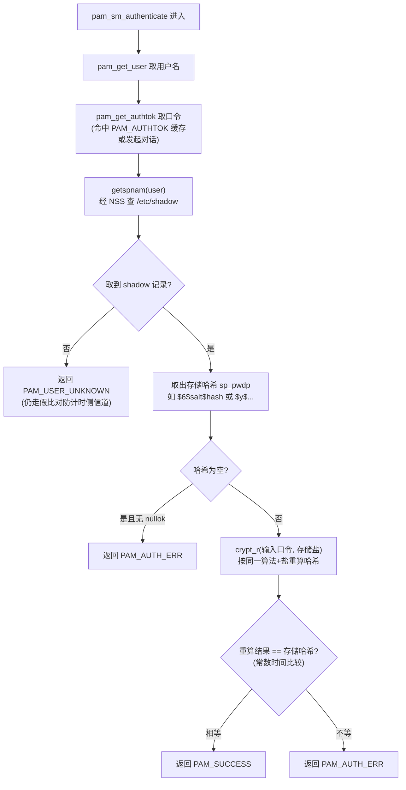

# Linux认证（06）· 核心PAM模块源码剖析

前两篇教你**怎么写**一个 PAM 模块（[[04.编写PAM模块-服务函数]] 的服务函数、[[05.编写PAM模块-会话与数据]] 的对话与数据）。本篇换个方向：**读**——把发行版自带、每天都在你机器上跑的那批核心模块拆开看。`pam_unix` 到底怎么比对口令？`pam_faillock` 如何数失败次数？`pam_pwquality` 凭什么判密码太弱？`pam_limits`/`pam_env`/`pam_wheel` 各在会话里做什么？读懂这些模块的内在逻辑，你才能真正看懂一份 `/etc/pam.d` 配置在运行时发生了什么，也才能在排错与加固时对症下药。本篇按功能把核心模块分成四类逐一剖析，重点手术台是 `pam_unix`。

## 概述与定位

> [!abstract] TL;DR
> - **`pam_unix.so` 是本地口令认证的主力**：auth 组经 NSS 的 `getspnam` 读 `/etc/shadow` 取哈希，用 `crypt`/`crypt_r` 按相同盐重算用户输入的口令哈希、常数时间比对；account 组查 shadow 老化字段；password 组把新口令哈希写回 shadow。
> - **哈希算法看前缀**：`$6$` 是 SHA-512、`$y$` 是 yescrypt（现代默认）、`$1$` MD5（淘汰）、`$2b$` bcrypt；`rounds=` 调代价、`sha512`/`yescrypt` 参数选算法。
> - **决策/告警类模块极简却关键**：`pam_deny`（永远拒）、`pam_permit`（永远过）、`pam_warn`（记日志）、`pam_echo`（显示信息）、`pam_exec`（调外部程序——**高风险**）。
> - **`pam_pwquality`（取代 `pam_cracklib`）管口令强度**：`minlen`/`dcredit`/`ucredit`/`ocredit`/`lcredit`/`retry`/`dictpath` 控制长度、字符类别信用与字典检查。
> - **`pam_faillock`（取代 `pam_tally2`）管失败锁定**：`deny`/`unlock_time`/`fail_interval` 定策略，需在 auth 栈 `preauth`/`authfail` 和 account 栈 `authsucc` **三处**正确摆放，`faillock` 命令查/清计数。
> - **会话/环境类模块**：`pam_limits`（ulimit）、`pam_env`（环境变量）、`pam_nologin`（维护禁登）、`pam_securetty`（限 root 终端）、`pam_wheel`（限 su）、`pam_mkhomedir`（建 home）、`pam_loginuid`（审计锚点）、`pam_lastlog`/`pam_motd`（记录/欢迎）。
> - **读模块 = 读策略执行器**：libpam 是引擎，这些 `.so` 才是真正"干活"的策略执行器，逐个看清它们，配置就不再是黑盒。

### 模块是策略的执行器

回顾 [[02.PAM架构与设计哲学]]：libpam 提供机制（栈求值、事务、对话），管理员用 pam.d 定策略，而**具体动作由模块实现**。所以一份配置真正的"行为"，藏在它引用的每个 `.so` 里。同一行 `auth required pam_unix.so`，其威力全在 `pam_unix` 的实现——它查哪个文件、用什么算法、怎么比对。本篇就是把这些"行为"从二进制里还原成可理解的逻辑。

## 原理与机制

### 核心模块的四大功能分类

发行版自带几十个模块，但按"在认证事务里扮演什么角色"可归成四类，先建立地图：

| 类别 | 代表模块 | 主要参与的组 | 干什么 |
|---|---|---|---|
| **认证主体** | `pam_unix`、`pam_sss`、`pam_krb5` | auth/account/password | 真正校验凭据、查/写账户库 |
| **决策与告警** | `pam_deny`、`pam_permit`、`pam_warn`、`pam_exec` | 任意组 | 无条件裁决、记录、调外部逻辑 |
| **策略增强** | `pam_pwquality`、`pam_faillock`、`pam_time`、`pam_access` | auth/account/password | 口令强度、失败锁定、时段/来源限制 |
| **会话与环境** | `pam_limits`、`pam_env`、`pam_mkhomedir`、`pam_loginuid` | session | 建立会话环境、资源限制、审计、副作用 |

本篇重点剖析第一类的 `pam_unix`，再扫过后三类的关键成员。

## pam_unix 源码剖析

`pam_unix` 是理解 Linux 本地认证的必修课——绝大多数系统的"用本地密码登录"就是它。它在三个管理组各有实现，逐一拆开。

### auth 组：口令怎么被验证

`pam_sm_authenticate` 的核心逻辑，去掉工程细节后是这样一条链：



> 图解：认证的本质是**"重算后比对"**而非"解密"——存储的哈希不可逆，`pam_unix` 拿用户输入的口令、**从存储哈希里解析出算法与盐**、用同样的算法和盐重新计算一遍哈希，再与存储值比较。相等即口令正确。注意两个安全细节：**用户不存在时也走一遍假比对**（避免"查无此人"比"密码错"返回更快、被计时攻击枚举用户名）；**比较用常数时间**（不能逐字节短路，否则泄漏匹配前缀长度）。

拆解链条上的关键环节：

- **`getspnam(user)` 走 NSS**：`pam_unix` 并不直接 `open("/etc/shadow")`，而是调 glibc 的 `getspnam`，由 **NSS**（`/etc/nsswitch.conf` 的 `shadow:` 行）决定去哪取——本地文件、还是 `nis`/`sss`。这正是 [[07.NSS与PAM的分工]] 的分界：**NSS 负责"把用户名解析成账户记录"，PAM 负责"用记录里的哈希做认证"**。二者协作但职责分明。
- **哈希前缀即算法标识**：`sp_pwdp` 字段形如 `$id$salt$hash`。`$1$`=MD5（已淘汰）、`$5$`=SHA-256、`$6$`=SHA-512、`$2b$`=bcrypt、`$y$`=yescrypt（现代发行版默认，内存硬、抗 GPU）。`crypt` 从这个前缀自动识别该用哪个算法，无需 `pam_unix` 显式判断。
- **`crypt` vs `crypt_r`**：`crypt(3)` 用一个**静态缓冲区**返回结果，非线程安全；`crypt_r` 接收调用者提供的 `struct crypt_data`，可重入。多线程宿主（或严谨实现）用 `crypt_r`。现代发行版底层是 **libxcrypt** 提供的实现。
- **`nullok`**：默认**空口令账户一律拒绝登录**；加 `nullok` 才允许（危险，生产应移除）。这也呼应 [[04.编写PAM模块-服务函数]] 讲的 `PAM_DISALLOW_NULL_AUTHTOK` flag——应用可强制禁止空口令，覆盖 nullok。

### account 组：账户老化检查

`pam_sm_acct_mgmt` **不碰口令**，它读 shadow 的老化字段判断账户此刻是否可用：

| shadow 字段 | 含义 | 触发 |
|---|---|---|
| `sp_lstchg` | 上次改密日 | 计算口令年龄 |
| `sp_max` | 口令最长有效天数 | 超过→`PAM_NEW_AUTHTOK_REQD`（强制改密） |
| `sp_min` | 两次改密最小间隔 | 限制频繁改密 |
| `sp_warn` | 到期前几天警告 | 发 `PAM_TEXT_INFO` 提示 |
| `sp_inact` | 口令过期后宽限天数 | 超过→账户失效 |
| `sp_expire` | 账户绝对过期日 | 到期→`PAM_ACCT_EXPIRED` |

这解释了 [[02.PAM架构与设计哲学]] 提的"公钥 ssh 登录也要跑 account 组"：即便 auth 被公钥认证跳过，account 里的 `pam_unix` 仍会检查口令/账户是否过期，过期就返回 `PAM_NEW_AUTHTOK_REQD` 触发改密、或 `PAM_ACCT_EXPIRED` 拒绝。

### password 组：新口令怎么落盘

`pam_sm_chauthtok` 实现 [[04.编写PAM模块-服务函数]] 讲的两阶段：`PAM_PRELIM_CHECK` 阶段检查 shadow 可写、旧口令正确；`PAM_UPDATE_AUTHTOK` 阶段用 `crypt` 按配置算法（`sha512`/`yescrypt`）**生成新盐 + 新哈希**，写回 shadow 的 `sp_pwdp`。关键参数：

- **`use_authtok`**：强制使用栈上游（`pam_pwquality`）已校验的新口令，不再自己提示——**漏写它，`pam_unix` 会重新问密，绕过强度检查**（[[03.PAM配置语法详解]] 强调过的坑）。
- **`sha512` / `yescrypt`**：指定生成新哈希的算法。
- **`rounds=N`**：调哈希迭代代价（越大越慢越抗暴破，也越耗 CPU）。
- **`remember=N`**：配合 `pam_pwhistory` 记住最近 N 个旧哈希防重用。

## 决策与告警类：deny / permit / warn / echo / exec

这几个模块实现极简（有的就几十行），却是配置里的"控制原语"：

| 模块 | 行为 | 典型用法 |
|---|---|---|
| `pam_deny` | **任何**调用都返回失败 | 放栈末兜底"默认拒绝"；或临时封停某 service |
| `pam_permit` | **任何**调用都返回成功 | 危险，几乎只用于测试或明确无认证需求的 service |
| `pam_warn` | 向 syslog 记录本次尝试（用户/rhost/tty），返回成功 | 审计打点，常与其它模块并列 |
| `pam_echo` | 用 conversation 显示一段文本（可含 `%H` 等占位） | 给用户提示信息 |
| `pam_exec` | **调用外部程序** | 认证/会话时挂钩自定义脚本 |

`pam_deny` 的"默认拒绝"哲学值得记：安全的配置常在栈末放一行 `auth required pam_deny.so`，保证"前面没人明确放行就拒绝"。

> [!danger] pam_exec 是把双刃剑
> `pam_exec` 让 PAM 能调外部脚本（如登录时发通知、同步某状态），灵活但**风险极高**：脚本以**宿主进程权限**（登录时是 root）运行，且能通过环境变量拿到 `PAM_USER`/`PAM_RHOST` 甚至（配 `expose_authtok` 时）**stdin 上的明文口令**。一个可被普通用户改写的 `pam_exec` 脚本，等于 root 提权后门。用它务必：脚本路径与内容仅 root 可写、绝不 `expose_authtok`（除非确有必要且脚本安全）、审计每一处 `pam_exec`。这也是 [[09.PAM安全陷阱与逆向视角]] 后门排查的重点对象。

## 口令质量与失败锁定：pwquality / faillock

### pam_pwquality（取代 pam_cracklib）

在 password 组、`pam_unix` **之前**运行，负责校验新口令强度，不合格就让改密失败。核心参数（也可写在 `/etc/security/pwquality.conf`）：

| 参数 | 含义 |
|---|---|
| `minlen=N` | 最小长度（按"信用"折算后的有效长度） |
| `dcredit=N` | 数字的长度信用（负值=强制至少几个数字） |
| `ucredit`/`lcredit`/`ocredit` | 大写/小写/特殊字符的信用（负值=强制最少个数） |
| `retry=N` | 允许用户重试输入几次 |
| `dictpath=` | 字典文件路径（查是否是常见词/其变体） |
| `difok=N` | 新旧口令至少不同的字符数 |

"信用（credit）"机制是它的特色：出现一个某类别字符可**抵扣**一点 minlen 需求（正 credit），或作为**硬性下限**（负 credit）。理解这个才能读懂为什么 `minlen=12 dcredit=-1 ucredit=-1` 表示"至少 12 位且必须含至少 1 数字 1 大写"。它是 `pam_cracklib` 的现代替代，接口更清晰、依赖 libpwquality。

### pam_faillock（取代 pam_tally2）

实现"连续失败 N 次锁定 M 秒"，是防在线暴破的关键。它的**摆放位置极其讲究**——要在**三个地方**正确出现，缺一不可：

```text
auth     required  pam_faillock.so preauth   # ①失败计数已达上限→直接拒绝
auth     [default=die]  pam_faillock.so authfail  # ②本次认证失败→计数+1
account  required  pam_faillock.so           # ③(authsucc语义)认证成功→清零计数
```

- **① preauth**（在 `pam_unix` 之前）：进认证前先看该用户失败数是否已超 `deny`，超了直接挡住，连口令都不必验。
- **② authfail**（在 `pam_unix` 之后）：本次口令验错时，把失败计数 +1。
- **③ account 组**：认证**成功**时清零该用户的失败计数（避免历史失败永久累积）。

关键参数：`deny=N`（失败几次锁）、`unlock_time=S`（锁多少秒后自动解）、`fail_interval=S`（多长时间窗内的失败才计数）、`even_deny_root`（是否也锁 root）。计数存在 `/var/run/faillock/`（或 `/var/log/faillock`），用 `faillock` 命令运维：

```bash
faillock --user alice            # 查 alice 的失败记录
sudo faillock --user alice --reset   # 手动解锁
```

> [!warning] faillock 摆错位置的两种典型故障
> 只配 authfail 不配 preauth：失败会计数，但**达到上限后并不拦截**，锁定形同虚设。只配 auth 两行不配 account 的 authsucc：成功登录**不清零**，历史失败一直累积，合法用户迟早被误锁。三处必须齐全，改完用 `faillock` 命令验证计数增减是否符合预期。

## 会话与环境类模块

session 组的模块在认证通过后、用户会话建立前后运行，负责把"一个能用的会话环境"搭起来。它们大多是 [[08.登录集成实战与会话管理]] 的主角，这里先建立索引：

| 模块 | 组 | 作用 |
|---|---|---|
| `pam_limits` | session | 按 `/etc/security/limits.conf` 设 ulimit（打开文件数、进程数、内存等） |
| `pam_env` | auth/session | 按 `/etc/environment`、`/etc/security/pam_env.conf` 设环境变量 |
| `pam_nologin` | auth/account | 存在 `/etc/nologin` 时禁止非 root 登录（维护期用），并显示其内容 |
| `pam_securetty` | auth | 限制 root 只能从 `/etc/securetty` 列出的终端登录 |
| `pam_wheel` | auth | 限制只有 `wheel` 组成员能 `su` 到 root |
| `pam_mkhomedir` | session | 首次登录时自动创建用户 home 目录（域账户常用） |
| `pam_loginuid` | session | 写 `/proc/self/loginuid`，为**审计（auditd）**锚定这次登录的原始用户 |
| `pam_lastlog` | session | 记录/显示上次登录时间与来源（`/var/log/lastlog`） |
| `pam_motd` | session | 显示 `/etc/motd` 等每日消息（登录欢迎语） |

几个要点：`pam_wheel` 与 `pam_securetty` 是**限制 root 提权/登录入口**的经典加固模块；`pam_loginuid` 对合规审计至关重要——它让 auditd 能把后续所有操作追溯到"最初是谁登进来的"，即使中途 `su` 也不丢失原始身份；`pam_mkhomedir` 是企业域账户"从没在本机建过 home 也能直接登录"的关键。这些模块的失败通常配 `optional`（如 motd 失败不该挡登录），但 `pam_loginuid`/`pam_limits` 往往要 `required`。

## 工具视角与实战

```bash
# 1) 看某模块的完整参数文档(每个核心模块都有 man)
man pam_unix ; man pam_faillock ; man pam_pwquality ; man pam_limits

# 2) 查本机 shadow 里某用户的哈希算法(看前缀 $6$/$y$)
sudo getent shadow alice | cut -d: -f2 | cut -c1-3   # $6$ 或 $y$

# 3) 手动验证 crypt 逻辑：用存储盐重算，理解"重算比对"
#    (仅在自有测试账户上做)
python3 -c 'import crypt; print(crypt.crypt("test123", "$6$somesalt"))'

# 4) faillock 全流程观测
sudo faillock --user testacct              # 看计数
#   故意输错几次密码后再看计数增长, 成功登录后应清零

# 5) pwquality 即时测试新口令强度(不改真密码)
echo "weak" | pwscore        # 返回强度分或拒绝原因
echo "S0me-L0ng-Pass!" | pwscore

# 6) 确认模块来源可信(防被替换成后门, 见 09 篇)
dpkg -V libpam-modules        # Debian: 校验模块完整性
rpm -V pam                    # RHEL
sha256sum /lib/x86_64-linux-gnu/security/pam_unix.so
```

> [!tip] 读模块的最佳路径：man + 源码 + strace
> 想吃透一个模块：先 `man pam_xxx` 看参数语义，再读 Linux-PAM 源码里对应的 `pam_xxx.c`（结构都是 `pam_sm_*` + 参数解析 + 干活），最后 `strace -f -e trace=open,read` 跟一次真实认证，看它到底 open 了哪些文件、走了哪些系统调用。三管齐下，任何模块都不再是黑盒。

## 安全性与正确使用

- **`pam_unix` 的 `nullok` 与缺失 `use_authtok` 是常见弱点**：`nullok` 放行空口令账户，生产必移除；password 组漏写 `use_authtok` 会让 `pam_pwquality` 的强度校验被 `pam_unix` 重新问密绕过。审计配置先盯这两处。
- **`pam_permit` 几乎不该出现在真实 auth 栈**：它无条件放行，一旦被放进认证路径就是彻底绕过。见到它要立刻质疑；栈末该用的是 `pam_deny`（默认拒绝）。
- **`pam_exec` 与 `expose_authtok` 是提权面**：外部脚本以 root 跑、可拿到口令，脚本可写权限失控即后门。除非必要不用，用则锁死脚本权限、拒绝 `expose_authtok`。
- **`pam_faillock` 三处齐全才有效**：preauth/authfail/authsucc 缺一，要么锁定失效、要么误锁合法用户。改后必用 `faillock` 命令验证计数行为。
- **哈希算法要跟上时代**：仍用 `$1$`(MD5) 的老系统应迁到 `$6$`(SHA-512) 或 `$y$`(yescrypt)。改 `/etc/login.defs` 的 `ENCRYPT_METHOD` 或 `pam_unix` 参数，新改的密码才用新算法，旧哈希需用户改密才升级。
- **模块完整性是信任根**：`/lib*/security/` 下的 `.so` 若被替换成带"万能口令"的后门 `pam_unix`，整台机器认证失守。定期 `dpkg -V`/`rpm -V`/比对哈希核验，是 [[09.PAM安全陷阱与逆向视角]] 的核心防线。
- **会话模块的 required/optional 要选对**：`pam_loginuid`/`pam_limits` 失败应挡住会话（required，否则审计缺失/资源不受限）；`pam_motd`/`pam_lastlog` 失败不该挡登录（optional）。选错要么该挡没挡、要么欢迎语故障把人挡在外面。

## 小结

1. **`pam_unix` 是本地认证主力**：auth 组经 NSS `getspnam` 读 shadow、用 `crypt`/`crypt_r` 按存储盐**重算比对**（非解密），account 组查老化字段，password 组按 `sha512`/`yescrypt` 生成新哈希写回。
2. **哈希算法看前缀**：`$6$`SHA-512、`$y$`yescrypt（现代默认）、`$1$`MD5（淘汰）；`nullok`/`use_authtok` 是两个高危配置点。
3. **决策类是控制原语**：`pam_deny`（默认拒绝）、`pam_permit`（危险放行）、`pam_warn`（审计）、`pam_echo`（提示）、`pam_exec`（调外部程序，高风险提权面）。
4. **`pam_pwquality` 管口令强度**：minlen 与 dcredit/ucredit/ocredit 的"信用"机制、retry、dictpath；是 `pam_cracklib` 的现代替代。
5. **`pam_faillock` 管失败锁定**：preauth/authfail/authsucc **三处**齐全才生效，deny/unlock_time/fail_interval 定策略，`faillock` 命令运维；取代 `pam_tally2`。
6. **会话类搭建会话环境**：`pam_limits`(ulimit)、`pam_env`、`pam_nologin`、`pam_securetty`/`pam_wheel`(限 root/su)、`pam_mkhomedir`、`pam_loginuid`(审计)、`pam_lastlog`/`pam_motd`，required/optional 要按"失败是否该挡登录"选。
7. **读模块 = 读策略执行器**：man + 源码 + strace 三管齐下，配置不再是黑盒；模块完整性（`.so` 未被后门替换）是整个认证体系的信任根。

## 相关阅读

- **上游：怎么写这些模块** → [[04.编写PAM模块-服务函数]]、[[05.编写PAM模块-会话与数据]]
- **配置语法（control 如何调度这些模块）** → [[03.PAM配置语法详解]]
- **getspnam 背后：NSS 与 PAM 的分工** → [[07.NSS与PAM的分工]]
- **会话模块的集成实战（logind/SSSD）** → [[08.登录集成实战与会话管理]]
- **后门 pam_unix 与模块完整性检测** → [[09.PAM安全陷阱与逆向视角]]
- **crypt/yescrypt 算法本身** → [[37.密码学/00.密码学总览|密码学]]
- **手册**：`man pam_unix`、`man pam_faillock`、`man pam_pwquality`、`man pam_limits`、`man pam_wheel`、`man crypt`、`man 5 shadow`

---

🏠 [[00.Linux认证与登录编程总览]] ｜ 上一篇 [[05.编写PAM模块-会话与数据]] ｜ 下一篇 [[07.NSS与PAM的分工]] ➡️
