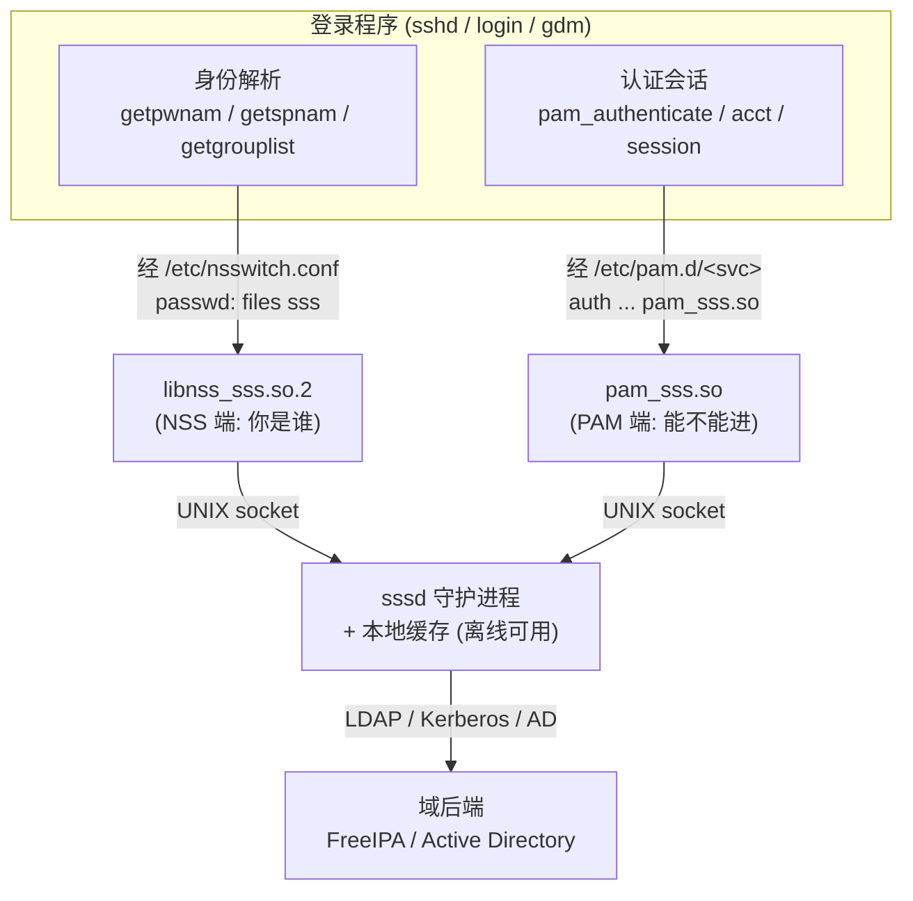

# Linux认证（07）· NSS与PAM的分工

前六篇把 PAM 从架构、配置讲到手写模块与源码剖析，你已经能回答"这次登录允不允许"。但登录还有另一半问题常被忽略：系统怎么知道"alice 这个名字对应哪个 UID、home 在哪、口令哈希存在何处"？这不是 PAM 的活，而是 **NSS（Name Service Switch，名字服务开关）** 的活。本篇讲清 NSS 与 PAM 这两套彼此正交又紧密协作的机制：一个负责**身份解析**（名字→属性），一个负责**认证会话**（能不能进）。看不清这条边界，就会写出"getpwnam 成功就当用户已登录"这类经典安全漏洞。

## 概述与定位

> [!abstract] TL;DR
> - **NSS 回答"你是谁"，PAM 回答"你能不能进"**。NSS 是 glibc 的一套"名字→信息"可插拔解析框架：把用户名映射到 UID/GID/home/shell，把主机名映射到 IP，把组名映射到成员。它**只解析与枚举，从不认证**。
> - **`/etc/nsswitch.conf` 是路由表**：每个 database（`passwd`/`shadow`/`group`/`hosts`…）配一串 provider（`files`/`systemd`/`sss`/`ldap`/`nis`/`winbind`/`compat`）与动作，glibc 按序查询。
> - **身份解析 API**：`getpwnam`/`getpwuid`/`getspnam`/`getgrnam`/`getgrouplist` 及线程安全的 `_r` 可重入版；provider 实现为 `libnss_xxx.so.2`，导出 `_nss_xxx_getpwnam_r`，返回 `enum nss_status`。
> - **PAM 建立在 NSS 之上**：`pam_unix` 认证时**自己不直接打开 `/etc/shadow`**，而是经 NSS `getspnam` 取出哈希，再用 `crypt` 比对。"账户数据在哪"由 NSS 决定，PAM 只管"比对与放行"。
> - **写 NSS 模块**：`libnss_myhr.so.2` + 符号约定 `_nss_myhr_getpwnam_r` + caller 提供的 buffer（不够返回 `ERANGE` 让 caller 加大重试）+ `nss_status` 四态（SUCCESS/NOTFOUND/TRYAGAIN/UNAVAIL）。
> - **SSSD 是协同的教科书**：同一个后端同时暴露 NSS 端（`libnss_sss.so.2`，供身份）与 PAM 端（`pam_sss.so`，供认证），一次配置两个接口都通。
> - **边界陷阱**：`getpwnam` 成功 ≠ 认证通过；`nsswitch.conf` 里 provider 的**顺序即信任链**；`nscd`/`sssd` 缓存可能让旧值滞后生效。

### 一次登录里的两个问题

把"用户 alice 从 sshd 登录"拆开，其实是两个独立问题串在一起：

1. **alice 是谁？**——系统里有没有这个名字？它的 UID/GID/home/shell 是什么？口令哈希存在哪、账户是否过期？这是**身份解析**，由 NSS 回答。
2. **alice 这次能不能进？**——TA 提供的凭据对不对？账户被锁了吗？来源终端允许吗？该建什么会话？这是**认证/授权/会话**，由 PAM 回答。

关键在于：**PAM 在回答第 2 个问题时，反复依赖 NSS 回答的第 1 个问题**。`pam_unix` 要验证口令，得先经 NSS 找到 alice 的哈希；account 组要检查账户有效期，得先经 NSS 读 shadow 的过期字段。所以二者不是并列的两条路，而是**PAM 站在 NSS 的肩膀上**。理解这层依赖，才能解释很多排错现象（"用户明明能 `getent` 到却登不上"往往是 PAM 侧问题，"连 `id alice` 都报 no such user"则是 NSS 侧问题）。

## 原理与机制

### NSS 的由来：把"数据来源"从 libc 里解耦

最早，glibc 的 `getpwnam` 就是硬编码地打开 `/etc/passwd` 逐行 parse。当企业要把账户集中到 **NIS**（早年）或 **LDAP/AD**（现代）时，麻烦来了：难道每加一种后端就重编 libc？

NSS 的设计正是"机制与策略分离"在 libc 层的体现——和 PAM 如出一辙：

- **libc 只定义抽象**：有哪些 database（passwd、group…）、有哪些查询 API（`getpwnam`…）、返回什么结构（`struct passwd`）。
- **具体从哪拿数据，交给可插拔模块**：`libnss_files.so.2` 读 `/etc/*` 文本，`libnss_sss.so.2` 问 SSSD，`libnss_ldap.so.2` 查目录服务……
- **`/etc/nsswitch.conf` 是把二者绑定的路由表**：告诉 libc"passwd 这个 database，先问 files，没有再问 sss"。

于是加一种账户来源 = 装一个 `libnss_*.so.2` + 改一行 `nsswitch.conf`，libc 分毫不动。这与 PAM"加一种认证方式 = 装一个 `pam_*.so` + 改 `/etc/pam.d`"是完全同构的思路，只不过一个作用于**身份数据**，一个作用于**认证决策**。

### databases 与 providers

`nsswitch.conf` 每行是 `<database>: <provider1> <provider2> ...`，可选 `[STATUS=ACTION]` 精调。常见 database 与 provider：

| database | 解析什么 | 对应 API（部分） |
|---|---|---|
| `passwd` | 用户名/UID → 账户基本属性 | `getpwnam`/`getpwuid` |
| `shadow` | 用户名 → 口令哈希与老化策略 | `getspnam` |
| `group` | 组名/GID → 组与成员 | `getgrnam`/`getgrgid`/`getgrouplist` |
| `hosts` | 主机名 ↔ IP | `gethostbyname`/`getaddrinfo` |
| `gshadow` | 组的影子（组管理员/口令） | `getsgnam` |
| `services`/`protocols`/`networks` | 服务名/协议/网络 → 号码 | `getservbyname`… |
| `netgroup` | 网络组（主机/用户集合） | `getnetgrent` |

| provider | 数据来自 |
|---|---|
| `files` | `/etc/passwd`、`/etc/shadow`、`/etc/group` 等本地文本 |
| `systemd` | systemd 动态用户（`DynamicUser=yes` 分配的临时 UID） |
| `sss` | SSSD 守护进程（背后接 LDAP/AD/FreeIPA/Kerberos） |
| `ldap` | 直连 LDAP 目录（老式 `nss_ldap`，现多被 `sss` 取代） |
| `nis`/`nisplus` | Sun NIS/NIS+（历史遗留） |
| `winbind` | Samba `winbindd`，把 AD 域用户映射进 Linux |
| `compat` | 兼容 `+`/`-` 老 NIS 语法 |
| `dns`（仅 hosts） | DNS 解析 |
| `mymachines`/`resolve`（systemd 系） | 容器机器名/systemd-resolved |

一个典型现代配置：

```text
passwd:  files systemd sss
shadow:  files sss
group:   files systemd sss
hosts:   files mymachines resolve [!UNAVAIL=return] dns
```

### 解析流程与 `[STATUS=ACTION]`

以 `getpwnam("alice")` 为例，glibc 内部：

1. 查 `nsswitch.conf` 的 `passwd:` 行，得到 provider 序列 `files systemd sss`。
2. `dlopen` `libnss_files.so.2`，调 `_nss_files_getpwnam_r("alice", ...)`。
3. 看返回的 `nss_status` 与该 provider 后面配的动作决定继续/停止：`SUCCESS` 默认 `return`（拿到即停），`NOTFOUND` 默认 `continue`（换下一个 provider），`UNAVAIL`（模块不可用）默认 `continue`，`TRYAGAIN`（临时故障）默认 `continue`。
4. `files` 里没有 alice（`NOTFOUND`）→ 试 `systemd` → 再试 `sss`（问 SSSD，可能命中域账户）。

`[STATUS=ACTION]` 可覆盖默认，例如 `[NOTFOUND=return]` 表示"这个 provider 说没有，就别再往后问了"。这套四态与动作，和 PAM 的 control 关键字在精神上一致：都是"某模块返回某状态时，如何影响整条链的走向"。

### 身份解析 API 与可重入

| API | 输入 → 输出 |
|---|---|
| `getpwnam(name)` / `getpwuid(uid)` | → `struct passwd*`（pw_name/pw_uid/pw_gid/pw_dir/pw_shell/pw_passwd） |
| `getspnam(name)` | → `struct spwd*`（sp_namp/**sp_pwdp 哈希**/老化字段） |
| `getgrnam(name)` / `getgrgid(gid)` | → `struct group*`（gr_name/gr_gid/gr_mem[]） |
| `getgrouplist(user, gid, groups[], &n)` | → 用户所属全部 GID（初始组 + 附加组） |
| `getpwent`/`setpwent`/`endpwent` | 枚举整个 passwd database |

**可重入与 buffer** 是 NSS 编程的核心细节：`getpwnam` 这类非 `_r` 版把结果存在**内部静态缓冲区**，返回指向它的指针——线程不安全，且下次调用会覆盖。`_r` 版（`getpwnam_r`）则由 **caller 传入 `char *buf` 与 `size_t buflen`**，模块把字符串（name/dir/shell…）打包进这块 caller 内存；**若 buffer 太小，返回 `ERANGE`**，约定 caller 加倍 buffer 后重试。这个"caller 供内存、ERANGE 重试"契约，正是下面手写模块必须遵守的铁律。

## NSS 与 PAM 的边界、协同与手写模块

这是本篇的深度核心：把两套机制的分工、依赖与实现讲透。

### 一张表钉死边界

| 维度 | NSS | PAM |
|---|---|---|
| 回答的问题 | "这个名字是谁？属性是什么？" | "这次登录允不允许？" |
| 典型 API | `getpwnam`/`getspnam`/`getgrouplist` | `pam_authenticate`/`pam_acct_mgmt`/`pam_open_session` |
| 配置文件 | `/etc/nsswitch.conf` | `/etc/pam.d/<service>` |
| 模块命名 | `libnss_xxx.so.2` | `pam_xxx.so` |
| 模块符号 | `_nss_xxx_getpwnam_r` … | `pam_sm_authenticate` … |
| 返回语义 | `nss_status`（找到/没找到/重试/不可用） | `PAM_SUCCESS`/`PAM_AUTH_ERR`… |
| "成功"的含义 | **信息存在并解析出来** | **凭据校验通过、允许放行** |
| 是否触碰凭据 | 取出哈希（`getspnam`），**不比对** | `pam_unix` 取哈希后 **`crypt` 比对** |

**最要命的澄清**：`getpwnam` 返回的 `struct passwd.pw_passwd` 现代系统上通常是 `"x"`（占位符，真哈希在 shadow）；要拿真哈希得 `getspnam` 取 `sp_pwdp`。而"把用户输入 `crypt` 后与 `sp_pwdp` 比对"这一步是 **`pam_unix` 干的，不是 NSS 干的**。NSS 只把哈希从后端搬到内存，比对与放行是 PAM 的职责。所以：**NSS 能查到一个用户，绝不意味着这个用户通过了认证**——把 `getpwnam != NULL` 当作"已登录"，是把"存在"误当"合法"，是典型越权漏洞。

### PAM 如何调用 NSS

追一次 `pam_unix` 的 `pam_sm_authenticate`：

1. 用 `pam_get_user` 拿到用户名 alice。
2. 内部调 `getpwnam("alice")`（经 NSS）确认账户存在、拿 UID/GID。
3. 调 `getspnam("alice")`（经 NSS）取 `sp_pwdp` 哈希。
4. 用 `pam_get_authtok` 拿用户输入的口令，`crypt(输入, 哈希盐)` 后与 `sp_pwdp` 比对。
5. 相等 → `PAM_SUCCESS`；否则 `PAM_AUTH_ERR`。

account 组的 `pam_sm_acct_mgmt` 同样靠 NSS 读 shadow 的老化字段（`sp_lstchg`/`sp_max`/`sp_expire`）判断"口令过期没、账户到期没"。可见 **PAM 的每一次账户相关判断，底层几乎都踩着 NSS**。这也解释了一个现象：如果你把账户搬到 LDAP，只要 `nsswitch.conf` 的 `passwd`/`shadow` 加了 `sss`，`pam_unix` 甚至**不用改**也能验证域账户口令——因为它经 NSS 拿哈希，NSS 已经替它把来源切换好了（实践中域认证多用 `pam_sss` 走更安全的在线校验，但机制上 `pam_unix` + NSS 确实可行）。

### 手写一个 NSS 模块

假设要把"HR 系统里的员工"暴露成 Linux 用户，写一个 `libnss_myhr.so.2`。骨架：

```c
#include <nss.h>
#include <pwd.h>
#include <string.h>
#include <errno.h>

/* 符号约定：_nss_<模块名>_<函数> */
enum nss_status _nss_myhr_getpwnam_r(
        const char *name, struct passwd *result,
        char *buffer, size_t buflen, int *errnop) {

    /* 1) 查后端（此处示意一个硬编码用户 bob/UID 6000） */
    if (strcmp(name, "bob") != 0)
        return NSS_STATUS_NOTFOUND;      /* 没有这个用户 */

    /* 2) 把字符串打包进 caller 提供的 buffer；不够则 ERANGE */
    const char *pw_name = "bob", *dir = "/home/bob", *sh = "/bin/bash";
    size_t need = strlen(pw_name) + strlen(dir) + strlen(sh) + 3 + 2; /* +占位x */
    if (buflen < need) { *errnop = ERANGE; return NSS_STATUS_TRYAGAIN; }

    char *p = buffer;
    result->pw_name  = strcpy(p, pw_name); p += strlen(pw_name) + 1;
    result->pw_passwd= strcpy(p, "x");     p += 2;          /* 哈希走 shadow */
    result->pw_dir   = strcpy(p, dir);     p += strlen(dir) + 1;
    result->pw_shell = strcpy(p, sh);
    result->pw_uid = 6000;
    result->pw_gid = 6000;
    return NSS_STATUS_SUCCESS;
}
```

要点逐条：

- **符号名严格 `_nss_<name>_<api>`**，`<name>` 要与 `nsswitch.conf` 里写的以及 `.so.2` 文件名一致（`myhr` → `libnss_myhr.so.2`、行里写 `passwd: files myhr`）。
- **返回 `enum nss_status` 四态**：`NSS_STATUS_SUCCESS`（找到）、`NSS_STATUS_NOTFOUND`（确实没有，让 glibc 试下一个 provider）、`NSS_STATUS_TRYAGAIN`（临时错误/buffer 太小，配合 `*errnop=ERANGE`）、`NSS_STATUS_UNAVAIL`（后端整体不可用）。四态直接决定 glibc 继续查还是停。
- **绝不自己 `malloc` 返回**：所有可变长字符串必须写进 caller 的 `buffer`，`result` 里的指针指向 buffer 内部。空间不足只能返回 `ERANGE`，由 caller 放大重试——这是 `_r` 契约。
- 编译安装：`gcc -shared -fPIC -o libnss_myhr.so.2 myhr.c` → 放进 `/lib/x86_64-linux-gnu/` → 在 `nsswitch.conf` 的 `passwd:` 加 `myhr`。
- **风险预警**：这个 `.so` 会被**每一个**调用身份解析的进程加载，包括 `sshd`、`sudo` 等 setuid/特权程序。模块里的一个越界、一个后门，影响面等同于 libc 级漏洞——写 NSS 模块的安全标准要拉到最高。

### SSSD：一套后端，两个接口

企业里最常见的协同范式是 **SSSD**。它把"连域"这件重活收进一个守护进程，对操作系统同时暴露两个面：



一句话读图：**NSS 端答"域里 alice 的 UID/组是什么"，PAM 端答"alice 的域口令对不对"，两端共享同一个 SSSD 缓存**，因此断网时既能解析身份（缓存的 UID/组）也能认证（缓存的凭据哈希），实现离线登录。这正是"NSS 管身份、PAM 管认证、二者协同"最完整的工程落地（企业后端细节见 [[08.登录集成实战与会话管理]]）。

## 工具视角与实战

```bash
# 1) getent：直接走 NSS 查任意 database（排错第一命令）
getent passwd alice          # 走完整 nsswitch 链解析 alice
getent passwd 1000           # 按 UID
getent shadow alice          # 需权限；看哈希从哪来
getent group wheel           # 组与成员
getent -s sss passwd alice   # 只用 sss provider（绕过 files，定位是哪层的问题）
getent hosts example.com     # NSS 也管主机名

# 2) id / groups：背后是 getpwnam + getgrouplist
id alice                     # UID/GID/附加组，一次看全
getent initgroups alice      # 初始组列表（getgrouplist 的结果）

# 3) strace 看 getpwnam 到底打开了哪些 .so 和文件
strace -f -e trace=openat id alice 2>&1 | grep -E 'nss|passwd|shadow'
#   能看到依次 dlopen libnss_files.so.2 / libnss_sss.so.2，直观验证 provider 顺序

# 4) 缓存排查（改了账户/组却不生效，常是缓存）
sudo sss_cache -E            # 失效 SSSD 全部缓存
sudo systemctl restart nscd  # 若装了 nscd
getent passwd alice          # 再查确认

# 5) 语法自检：改 nsswitch.conf 前后对比解析结果
sudo cp /etc/nsswitch.conf /root/nsswitch.bak
```

> [!tip] getent 是 NSS/PAM 分层排错的分水岭
> 排"某用户登不上"时，先 `getent passwd 用户名`：**能查到 → 身份解析（NSS）正常，问题在 PAM 侧**（口令/锁定/account 组），去看 `/var/log/auth.log`、`pamtester`；**查不到 → NSS 侧问题**（`nsswitch.conf` 顺序、provider 不可用、SSSD 没连上域）。一条命令就把两层责任分清，避免在错误的层面瞎调。

## 安全性与正确使用

- **`getpwnam` 成功 ≠ 认证通过**：这是最常被自研程序踩的坑。"能解析出用户"只说明**存在**，不说明**合法**。任何"以某用户身份操作"的授权，都必须由 PAM（或等价的凭据校验）背书，绝不能用 `getpwnam() != NULL` 当登录判据。
- **`nsswitch.conf` 的顺序即信任链**：provider 排在前面的先答、先命中。若把一个**不可信来源**（如可被攻击者控制的网络目录）排在 `files` 前面，它可能"抢答"一个 root/系统账户的映射，实现 UID 混淆或提权。系统关键账户应保证由本地 `files` 优先解析。
- **`shadow` 的读取权限是敏感边界**：`getspnam` 要拿到哈希，进程需有读 `/etc/shadow`（或走 SSSD 特权 helper）的权限。这也是为什么 `pam_unix` 常需要特权、或通过 `unix_chkpwd` helper 完成比对——别把 shadow 读权限随意扩大。
- **缓存滞后会架空安全变更**：锁了账户、改了组、删了用户后，`nscd`/`sssd` 缓存可能让**旧值继续生效**一段时间。安全敏感的账户变更后应主动失效缓存（`sss_cache -E`、重启 nscd），否则"已禁用"的账户可能还能登。
- **自写 NSS 模块 = libc 级信任**：模块被所有解析进程（含 setuid 程序）加载、运行在其地址空间、无沙箱。一个越界写或后门等价于系统级后门。第三方 NSS 模块要像内核模块一样审慎，来源、完整性、最小权限缺一不可（后门检测视角见 [[09.PAM安全陷阱与逆向视角]]）。
- **UID 复用与冲突**：不同 provider 可能给出相同 UID 的不同名字（本地 `bob` UID 6000 与域某用户 UID 6000 撞车），导致权限张冠李戴。规划 UID 区间（本地/域/动态分段）避免重叠。

## 小结

1. **两套机制、两个问题**：NSS 答"你是谁"（身份解析/枚举），PAM 答"你能不能进"（认证/授权/会话），正交而协作。
2. **NSS 是 libc 层的可插拔解析**：`nsswitch.conf` 路由表 + `libnss_*.so.2` provider，把数据来源从 libc 解耦，与 PAM 的插件哲学同构。
3. **PAM 站在 NSS 肩上**：`pam_unix` 经 `getspnam` 取哈希、经 shadow 老化字段判过期——PAM 的账户判断底层几乎都踩 NSS。
4. **"解析到" ≠ "认证过"**：`getpwnam` 只证明存在，比对哈希与放行是 PAM 的职责，混淆二者即越权漏洞。
5. **手写 NSS 模块的契约**：符号 `_nss_名_api`、`nss_status` 四态、caller 供 buffer、`ERANGE` 重试；模块跑在所有解析进程里，安全标准拉满。
6. **SSSD 是协同范式**：一后端两接口（`libnss_sss` + `pam_sss`）共享缓存，实现域身份解析与离线认证。
7. **排错先 `getent`**：查得到→PAM 侧问题，查不到→NSS 侧问题；顺序即信任链、缓存会滞后、shadow 权限敏感。

## 相关阅读

- **上游：核心 PAM 模块（pam_unix 如何用 NSS 取哈希）** → [[06.核心PAM模块源码剖析]]
- **PAM 主控流与四管理组** → [[02.PAM架构与设计哲学]]
- **登录体系全景（passwd/shadow/group 布局）** → [[01.Linux登录与认证体系全景]]
- **下游：企业后端与 SSSD/Kerberos 集成** → [[08.登录集成实战与会话管理]]
- **安全：NSS/PAM 模块被篡改的检测** → [[09.PAM安全陷阱与逆向视角]]
- **双平台对照：Windows 的身份与认证子系统** → [[30.Windows认证与生物识别编程/00.Windows认证与生物识别编程总览|Windows 认证]]
- **手册**：`man nsswitch.conf`、`man getpwnam`、`man getspnam`、`man 5 nss`、`man getent`

---

🏠 [[00.Linux认证与登录编程总览]] ｜ 上一篇 [[06.核心PAM模块源码剖析]] ｜ 下一篇 [[08.登录集成实战与会话管理]] ➡️
