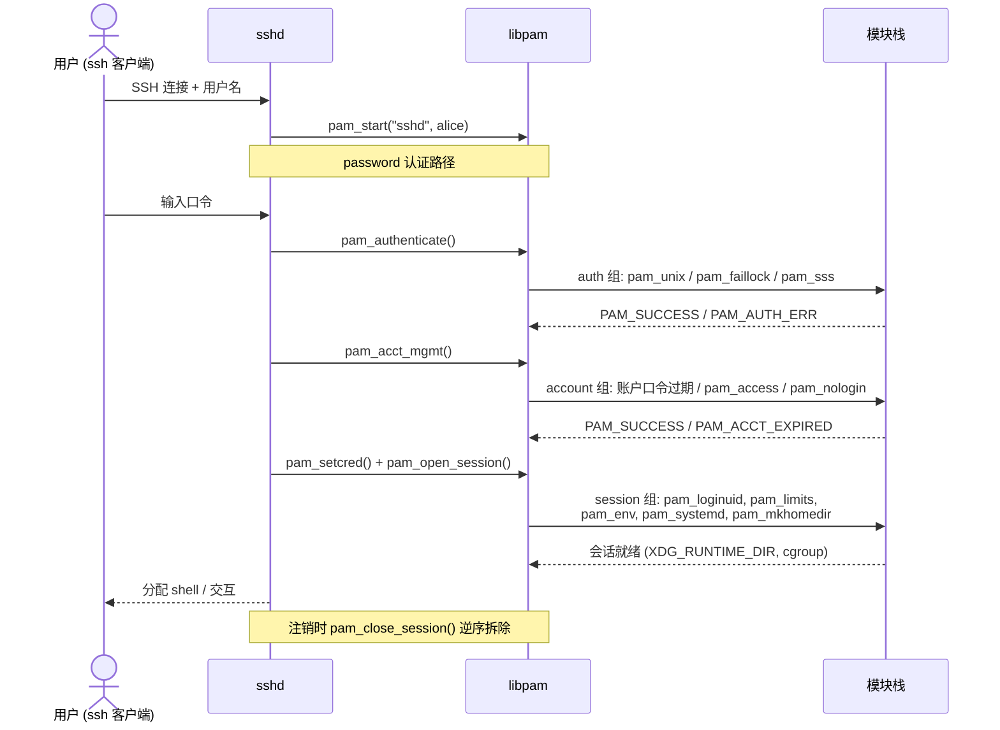
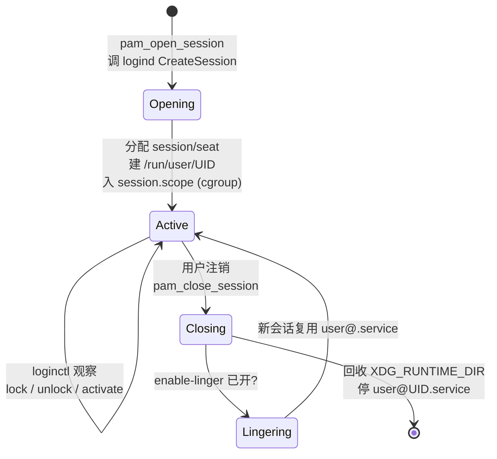

# Linux认证（08）· 登录集成实战与会话管理

前七篇建立了 PAM 与 NSS 的完整心智模型：架构、配置、写模块、读源码、身份解析。本篇把这些零件装回真实系统，回答一个工程问题：当你 `ssh alice@host`、`su - bob`、`sudo -i` 或在图形界面点下登录时，究竟有哪些程序、按什么顺序、穿过哪几个 PAM 管理组，最终把你放进一个可用的会话？更关键的是——会话建立**之后**，是谁在管理它的生命周期、`XDG_RUNTIME_DIR` 从哪来、注销时谁负责回收？答案落在 sshd/login/su/sudo 各自的 PAM 栈，以及 systemd-logind 这个现代会话中枢上。企业环境还要再接一层：SSSD/Kerberos/LDAP/AD 如何让"域账户"在这套本地机制里无缝登录。

## 概述与定位

> [!abstract] TL;DR
> - **service 名决定策略**：sshd/login/su/sudo/gdm 各 `pam_start` 一个不同的 service 名，读 `/etc/pam.d/` 下同名文件；多数还 `include`（或 `substack`）公共的 `common-*`/`system-auth` 片段以复用策略。
> - **sshd 是"半程"参与 PAM**：`UsePAM yes` 下，publickey 认证**成功时跳过 PAM 的 auth 组**（密钥在 sshd 内部校验），但 **account/session 组照走**——所以密钥登录一样受 `pam_nologin`、`pam_access`、`pam_limits`、`pam_systemd` 约束；`keyboard-interactive` 才把整套 auth 交给 PAM（多因素入口）。
> - **su 与 sudo 相反**：`su` 认证**目标用户**口令（root 靠 `pam_rootok` 免密），`pam_wheel` 限谁能 su；`sudo` 认证**发起者自己**的口令，策略在 `/etc/sudoers`，PAM 只做认证/会话。`pam_securetty` 管 root 从哪些终端可登。
> - **systemd-logind + `pam_systemd`**：session 组里的 `pam_systemd.so` 向 logind 注册 **session/seat**，分配 `XDG_RUNTIME_DIR`（`/run/user/UID`）、绑定 scope/slice（cgroup）、管理 seat（座位=键鼠显示器集合），注销时回收。`loginctl` 是观察窗口，lingering 允许无登录也保留用户实例。
> - **会话建立/拆除的连锁**：`pam_open_session` 触发一串 session 模块——`pam_loginuid`（写 audit loginuid）、`pam_env`（设环境）、`pam_limits`（rlimit）、`pam_mkhomedir`（首登建 home）、`pam_systemd`（注册会话）；`pam_close_session` **逆序**拆除。
> - **企业后端**：`pam_sss`（SSSD，接 AD/FreeIPA/LDAP，带离线缓存）、`pam_krb5`（认证即取 TGT，实现 Kerberos SSO）、`pam_ldap`（直连目录，多被 SSSD 取代）、`pam_winbind`（Samba 接 AD）。NSS 侧同时配 `sss`/`winbind` 供身份解析。
> - **排错主线**：`/var/log/auth.log`（或 `journalctl -u sshd`）看 PAM 决策，`loginctl session-status` 看会话状态，`pamtester`/`pam_tty_audit` 复现与审计。

### PAM service 名与程序的绑定

每个接入 PAM 的程序在 `pam_start(service, ...)` 时声明自己的 **service 名**，libpam 据此读 `/etc/pam.d/<service>`。sshd → `sshd`，login → `login`，su → `su`，sudo → `sudo`，gdm → `gdm-password`。这正是"同一台机器，ssh 登录与本地 login 走不同策略"的根源——它们读的是不同的配置文件。理解这条绑定关系，才能解释"改了 `pam.d/sshd` 却不影响本地 login"这类现象。

### 一次登录的两阶段：认证 vs 会话

把登录切成两段看：**认证阶段**（auth+account 组）回答"能不能进"，**会话阶段**（session 组，开会话时）回答"进来后给你搭什么环境"。前七篇重认证；本篇的新增重点是**会话阶段**——`XDG_RUNTIME_DIR`、cgroup 归属、rlimit、home 目录、audit loginuid，全在 `pam_open_session` 这一下里被布置好。很多"登录能成功但桌面/`systemd --user`/临时目录不对"的问题，根子在 session 组而非 auth 组。

## 原理与机制

### sshd：唯一"部分绕过 PAM"的主流入口

sshd 特殊在它有**自己的认证协议**（SSH 层的 publickey、password、keyboard-interactive）。`UsePAM yes`（现代默认）时的耦合关系要精确记住：

- **password 认证**：sshd 把用户输入的口令交给 PAM auth 组校验（等于走 `pam_authenticate`）。
- **publickey 认证**：**密钥验证在 sshd 内部完成，不进 PAM auth 组**。但认证一旦通过，sshd **仍会调 PAM 的 account 组（`pam_acct_mgmt`）和 session 组（`pam_open_session`）**。所以即便你用密钥登录，`pam_nologin`（维护模式禁登）、`pam_access`（按来源限制）、账户过期检查、`pam_limits`、`pam_systemd` 一个都不少。
- **keyboard-interactive**：这是 sshd 把"发问-收答"完全委托给 PAM 的模式——PAM conversation 的 prompt 通过 SSH 协议问到客户端，可实现多因素（如 TOTP 令牌模块）。生产里"想让 PAM 多因素对 ssh 生效"往往要确保 `KbdInteractiveAuthentication yes`。

一句话：**publickey 绕过的是 PAM 的 auth 组，绝不绕过 account/session 组**。把"我用密钥所以 PAM 管不着"当常识是危险误解。下图追一次 password 登录穿过四个管理组：



### login 与 getty：本地控制台的经典路径

本地 tty 登录链是 `getty`（或 `agetty`）监听终端 → 提示 `login:` → 拉起 `login` 程序 → `login` 以 service 名 `login` 跑 PAM。这条路上几个标志性模块：

- `pam_securetty`：限制 **root** 只能从 `/etc/securetty` 列出的"安全终端"登录，挡住 root 从串口/网络 tty 直接登入。
- `pam_lastlog` / `pam_motd`：显示上次登录、每日消息（session 组）。
- `pam_loginuid`：把不可变的 audit loginuid 钉到这次登录，后续 sudo/su 都能溯源到"最初是谁登的"。

### su 与 sudo：提权的两种哲学

两者都"切换身份"，但 PAM 语义相反：

| 维度 | `su` | `sudo` |
|---|---|---|
| 认证谁的口令 | **目标用户**（`su bob` 要 bob 的口令） | **发起者自己**（`sudo` 要你自己的口令） |
| root 免密 | `pam_rootok`：uid==0 时 auth 直接过 | 由 sudoers（`NOPASSWD:`）控制 |
| 谁能用 | `pam_wheel`：限 wheel 组成员才能 `su root` | `/etc/sudoers`（细到命令级） |
| 主要策略层 | PAM + `pam_wheel` | sudoers（PAM 只认证+会话） |
| 会话 | 开新 session（`su -` 走 login shell） | 通常也开 PAM session |

`pam_rootok.so` 的机制值得点破：它在 auth 组，逻辑是"若调用者真实 UID 为 0 直接返回 `PAM_SUCCESS`"，这就是 root `su` 任意用户免密的原因——不是 su 特判，而是 PAM 栈里配了 `auth sufficient pam_rootok.so` 让 root 短路整条 auth 链。

### systemd-logind：现代会话中枢

`pam_systemd.so` 挂在 **session 组**，是本篇的重心。当 `pam_open_session` 调到它，它通过 D-Bus 向 `systemd-logind` 发起 `CreateSession`，做这些事：

- **注册 session**：分配 session ID（如 `c1`、`3`），记录属主 UID、TTY/显示、类型（tty/x11/wayland）、class（user/greeter）、远程与否，落到 `/run/systemd/sessions/<id>`。
- **分配 seat**：seat 是"一套物理输入输出"（键鼠+显示器），本地登录归 `seat0`，远程 ssh 无 seat。多座位（一机多用户）靠 seat 划分。
- **`XDG_RUNTIME_DIR`**：为用户创建 `/run/user/<UID>`（tmpfs、700 权限、用户私有），存放 `systemd --user`、Wayland socket、D-Bus session、音频等运行时文件。用户所有会话退出后由 logind 回收。
- **cgroup 归属**：把会话进程放进 `user-<UID>.slice` 下的 `session-<id>.scope`，实现按用户/会话的资源统计与限制（`systemd-cgls` 可见树状归属）。
- **lingering（驻留）**：默认用户最后一个会话退出即回收其 `/run/user/UID` 与 `user@.service`；`loginctl enable-linger alice` 后，alice 的 `systemd --user` 实例**无需登录也常驻**（跑用户级定时器/服务的关键开关）。

下图是一个 logind 会话的生命周期：



## 会话建立与拆除的连锁反应

这是本篇的深度核心：把"开一个会话"背后连锁触发的模块链讲透，再接上企业后端如何嵌入这条链。

### session 组的模块连锁

`pam_open_session` 按配置顺序依次调用 session 组各模块，一个典型顺序与职责：

1. **`pam_loginuid.so`**：把 `/proc/self/loginuid` 写成本次登录的 UID（一次性、不可变），让 auditd 能把后续所有动作追溯到"最初登录者"。这是审计溯源的地基。
2. **`pam_env.so` / `pam_umask.so`**：从 `/etc/environment`、`/etc/security/pam_env.conf` 设环境变量，设定默认 umask。
3. **`pam_limits.so`**：读 `/etc/security/limits.conf` 施加 rlimit（最大打开文件数、进程数、内存锁定…）。**注意 systemd 服务的限制走 unit 的 `LimitNOFILE=`，`pam_limits` 只对经 PAM 的交互登录生效**——这是"改了 limits.conf 但服务不受影响"的原因。
4. **`pam_mkhomedir.so`**：首次登录若 home 不存在，按 `/etc/skel` 模板创建（域账户首登建 home 的常用手段）。
5. **`pam_systemd.so`**：如上，注册 logind 会话、给 `XDG_RUNTIME_DIR`、入 cgroup。通常排在**较后**，因它要在环境/limits 就绪后建会话。
6. **`pam_lastlog` / `pam_motd` / `pam_mail`**：显示信息类，无副作用。

注销时 `pam_close_session` **逆序**调用各模块的 `pam_sm_close_session`，`pam_systemd` 通知 logind 关闭会话 → 若这是该用户最后一个会话且未 linger，回收 `/run/user/UID`、停 `user@UID.service`。理解这条"开/关对称、开正序关逆序"的链，是排查会话残留与清理问题的钥匙。

### 企业后端：让"域账户"无缝登录

把账户集中到 AD/FreeIPA/LDAP 后，一次登录要在**两个维度**都接上后端：**NSS 侧**（身份解析，见第 07 篇）配 `sss`/`winbind`，**PAM 侧**（认证/会话）配对应模块。四大后端模块：

- **`pam_sss.so`（SSSD，现代首选）**：auth 组把口令交给本机 `sssd` 守护进程，由它去 AD/FreeIPA/LDAP 在线校验；**带离线缓存**——断网时用缓存的凭据验证，实现离线登录。同一个 SSSD 同时提供 `libnss_sss`（身份）与 `pam_sss`（认证），一次配置两端皆通。
- **`pam_krb5.so`（Kerberos）**：认证的"副作用"是**取得 TGT（Ticket Granting Ticket）**放进凭据缓存（`KRB5CCNAME`）。这一步是 **Kerberos 单点登录（SSO）** 的起点——之后访问 Kerberos 化的服务（NFS、HTTP、数据库）用 TGT 换服务票，无需再输口令；GSSAPI 是应用层用这张票做认证的接口（`ssh -K`、手动 `kinit` 同理）。
- **`pam_ldap.so`**：直连 LDAP 做 bind 认证；老式方案，缓存/健壮性不如 SSSD，现多被 SSSD 取代。
- **`pam_winbind.so`**：Samba `winbindd` 把 Windows AD 域用户/组映射进 Linux，`pam_winbind` 用 AD 校验口令；适合已重度使用 Samba 的环境。

一个要点：**PAM 侧配了 `pam_sss` 认证，NSS 侧也必须配 `sss` 供身份解析**，两维缺一，会出现"能认证但 `id` 查不到 UID"或"能查到用户但认证失败"的割裂现象。

### 显示管理器（gdm/sddm）的集成

图形登录由**显示管理器**（gdm、sddm、lightdm）承担，它们同样是 PAM 应用，用 `gdm-password`、`sddm` 等 service 名。特殊点：DM 以 `class=greeter` 先起一个登录界面会话，用户认证通过后再 `pam_open_session` 起真正的 `class=user` 图形会话，`pam_systemd` 给它 `seat0` 与 `XDG_RUNTIME_DIR`，Wayland/X11 的 socket 就落在那里。这解释了"图形会话为何天然有 `XDG_RUNTIME_DIR`，而裸 ssh 会话要留意其缺失"（无 seat、有时 `pam_systemd` 行为不同）。

## 工具视角与实战

```bash
# 1) 看 PAM 决策日志（登录失败先看这里）
sudo journalctl -u sshd -f            # sshd 实时日志（含 PAM 结果）
sudo tail -f /var/log/auth.log        # Debian 系；RHEL 系为 /var/log/secure

# 2) loginctl：观察 logind 会话 / 座位 / 用户
loginctl                              # 列所有会话
loginctl session-status 3             # 某会话详情：leader PID、TTY、seat、scope
loginctl show-session 3 -p Type -p Class -p Remote
loginctl list-seats                   # 座位（seat0 = 本地物理输入输出）
loginctl user-status alice            # 用户级：linger 状态、所属会话
loginctl enable-linger alice          # 开启驻留：无登录也保留 user@ 实例

# 3) 会话的 cgroup / 运行时目录
systemd-cgls | grep -A5 user.slice    # 会话进程在 user-UID.slice / session-N.scope
ls -ld /run/user/$(id -u)             # XDG_RUNTIME_DIR：700、tmpfs、用户私有
echo "$XDG_RUNTIME_DIR"

# 4) 复现 / 调试某 service 的 PAM 栈（不用真连 ssh）
pamtester sshd alice authenticate     # 单独跑 sshd 的 auth 组
pamtester login alice open_session    # 单独跑 session 组，看会话副作用

# 5) 企业后端连通性
getent passwd alice@corp.example      # 经 NSS(sss) 解析域账户 → 身份侧通不通
sssctl user-checks alice              # SSSD 自带：一次跑通 NSS+PAM 检查
klist                                 # pam_krb5 登录后：看有没有 TGT

# 6) 确认 ssh 是否真的经 PAM
grep -E '^UsePAM|Kbd|ChallengeResponse' /etc/ssh/sshd_config
```

> [!tip] 分辨"auth 挂了"还是"session 挂了"
> 登录报错先定位阶段：**连不进 / 提示密码错** → auth/account 组（看 auth.log 的 `pam_unix`/`pam_faillock`/`pam_sss` 行）；**能进但环境不对**（无 `XDG_RUNTIME_DIR`、rlimit 不对、home 没建、`systemd --user` 起不来）→ **session 组**（`pam_systemd`/`pam_limits`/`pam_mkhomedir`）。`loginctl session-status` 能一眼看出 logind 会话有没有正常建立。这一步分层，能省掉大量在错误层面的瞎调。

## 安全性与正确使用

- **publickey 不等于"免疫 PAM 策略"**：密钥登录跳过 auth 组，但 account/session 组照旧。别以为改了 `pam.d/sshd` 的 auth 就管不到密钥登录——`pam_nologin`（维护禁登）、`pam_access`（按来源/时间限制）、账户过期都在 account 组，对密钥登录同样生效。想对 ssh 全面加策略，account/session 组才是着力点。
- **`pam_rootok` 是双刃剑**：它让 root 免密 `su` 任意用户（运维便利），但也意味着**任何拿到 root 的进程能无声切换到任意用户身份**。审计上要靠 `pam_loginuid`+auditd 记住"最初是谁"，否则 root 之后的所有身份切换都溯源不到源头。
- **`XDG_RUNTIME_DIR` 与会话清理**：`/run/user/UID` 是 700 的用户私有 tmpfs，放 D-Bus/Wayland/密钥代理 socket。若会话未被 logind 正确拆除（进程逃逸出 session scope、或 `pam_systemd` 未生效），残留的 runtime 目录与常驻进程可能成为**跨会话信息泄露或提权残留**。确认注销后（无 linger 时）`/run/user/UID` 被回收。
- **lingering 扩大暴露面**：`enable-linger` 让用户 `systemd` 实例常驻，用户级 service/timer 无需登录即运行——方便，但等于给该用户开了"无人值守的常驻执行环境"。对不需要的账户（尤其服务账户）别开 linger。
- **企业后端离线缓存是安全权衡**：SSSD 离线缓存让断网可登，代价是**凭据在本地留存**，且账户在域侧被禁用后，缓存可能让其在有效期内**仍能离线登录**。敏感账户禁用后应同时清理受影响主机的 SSSD 缓存（`sss_cache -E`），并合理设置缓存有效期。
- **service 的 include 链要审计**：多数 `/etc/pam.d/*` 靠 `include common-auth`（Debian）或 `substack system-auth`（RHEL）复用策略，改一个公共片段会波及所有引用它的 service。加固前先理清"这个 service 到底展开成哪几个模块"，避免"改一处、崩一片"。

## 小结

1. **service 名绑定策略**：sshd/login/su/sudo/gdm 各读 `/etc/pam.d/` 下同名文件，多经 `include`/`substack` 复用公共片段。
2. **sshd 半程 PAM**：publickey 跳过 auth 组但 **account/session 照走**；keyboard-interactive 才把整套 auth 交给 PAM（多因素入口）。
3. **su vs sudo**：su 认证目标用户口令（root 靠 `pam_rootok` 免密、`pam_wheel` 限门槛），sudo 认证发起者自身（策略在 sudoers）。
4. **会话阶段是本篇新增重心**：`pam_open_session` 连锁触发 `pam_loginuid`/`pam_env`/`pam_limits`/`pam_mkhomedir`/`pam_systemd`，注销**逆序**拆除。
5. **systemd-logind**：`pam_systemd` 注册 session/seat、给 `XDG_RUNTIME_DIR`、入 cgroup scope/slice，lingering 决定用户实例是否常驻。
6. **企业后端两维接入**：NSS 侧 `sss`/`winbind` 供身份，PAM 侧 `pam_sss`/`pam_krb5`/`pam_ldap`/`pam_winbind` 供认证；`pam_krb5` 取 TGT 实现 Kerberos SSO，SSSD 带离线缓存。
7. **排错分阶段**：连不进查 auth/account（auth.log），进来后环境不对查 session（`loginctl session-status`）。

## 相关阅读

- **上游：NSS 与 PAM 的分工（身份解析如何支撑登录）** → [[07.NSS与PAM的分工]]
- **PAM 配置语法（include/substack/control 如何组合出这些栈）** → [[03.PAM配置语法详解]]
- **核心模块源码（pam_unix/pam_limits/pam_securetty 的实现）** → [[06.核心PAM模块源码剖析]]
- **登录体系全景（getty/login/utmp 的位置）** → [[01.Linux登录与认证体系全景]]
- **下游：安全陷阱与后门检测（配置绕过、恶意模块）** → [[09.PAM安全陷阱与逆向视角]]
- **双平台对照：Windows 的登录会话与 LSA** → [[30.Windows认证与生物识别编程/00.Windows认证与生物识别编程总览|Windows 认证]]
- **手册**：`man pam_systemd`、`man loginctl`、`man sshd_config`、`man su`、`man sudoers`、`man pam_krb5`

---

🏠 [[00.Linux认证与登录编程总览]] ｜ 上一篇 [[07.NSS与PAM的分工]] ｜ 下一篇 [[09.PAM安全陷阱与逆向视角]] ➡️
