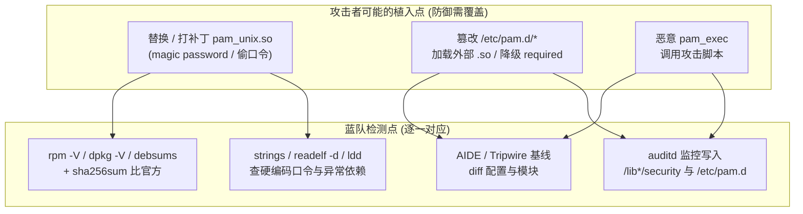

# Linux认证（09）· PAM安全陷阱与逆向视角

前八篇是"如何正确使用 PAM"的建设视角。本篇切到**对抗视角**：同一套"机制与策略分离"的灵活性，落到攻击者手里就是绕过与后门的温床——一行 control 关键字写反，可能让整台机器免密登录；一个被打了补丁的 `pam_unix.so`，能让攻击者用"万能口令"以任意身份登入且不留常规痕迹。本篇讲清两类风险：**配置误用导致的认证绕过**，以及**恶意 PAM 模块/篡改后门**；并给出**蓝队视角**的检测、取证与加固方法。全程只讲"攻击长什么样、如何发现与堵住"，不提供针对他人系统的可落地植入步骤。

## 概述与定位

> [!abstract] TL;DR
> - **control 关键字写错 = 认证绕过**：把宽松模块（`pam_permit`）或 `sufficient` 放错位置、让它**早于**关键 `required` 模块命中，攻击者可短路整条 auth 链。经典事故是 auth 栈里一个"临时放行"的 `sufficient pam_permit.so` 忘了删。
> - **缺 `default=die` / 复杂 `[value=action]` 误配**：新式 `[success=.. default=..]` 语法强大但易错，本该 `default=die` 却写成 `default=ignore` 时，某些失败返回被"忽略"而非"终止"，链继续滑到后面的放行分支。
> - **`nullok` 是空口令后门**：`pam_unix ... nullok` 允许空口令账户直接登录；配合一个 shadow 里哈希为空的账户即免密入口。生产应一律去掉 `nullok`。
> - **authtok 处理不当泄密**：conversation 拿到的明文口令若被模块写日志、留在可 core dump 的内存、或经 `try_first_pass`/`use_first_pass` 传给栈里不该看它的模块，都会造成**明文口令泄露**。
> - **恶意 PAM 后门（检测视角）**：被替换或打补丁的 `pam_unix.so` 可植入 **magic password**（万能口令，任意用户皆过）或**把明文口令偷偷写文件**；恶意 `pam_exec.so` 调用攻击者脚本；直接篡改 `/etc/pam.d/*` 加载攻击者的 `.so`。
> - **检测与取证**：包完整性校验 `rpm -V`/`debsums`/`dpkg -V` 揪出被改的 `pam_*.so`；`sha256sum` 与官方比对；`strings`/`readelf -d`/`ldd` 找可疑字符串（硬编码口令、异常路径）与异常依赖；auditd 监控 `/lib*/security` 与 `/etc/pam.d` 的写入；AIDE/Tripwire 建基线。
> - **加固主线**：最小模块集、去 `nullok`、`pam_faillock` 抗爆破、`pam_pwquality` 强口令、`pam_securetty` 限 root 终端、`pam_wheel` 限 su、`pam_loginuid`+auditd 溯源。

### 为什么 PAM 是高价值攻击面

PAM 处在**每一次认证的必经之路**，且模块以 root 权限、在 sshd/login/sudo 等特权进程的地址空间内运行。攻破它的收益极高：一处改动即可**对所有登录生效、以任意身份放行、并绕过上层日志**。同时它的"可插拔"设计天然欢迎"加一个 `.so`、改一行配置"——对管理员是便利，对攻击者是低成本持久化点。理解这条，才明白为何 PAM 的两个目录（`/lib*/security`、`/etc/pam.d`）值得纳入最高级别的完整性监控。

## 原理与机制

### 陷阱一：control 顺序与 sufficient 短路

回忆 control 语义：`sufficient` 模块**成功即整链通过**（跳过其后 required），`required` 失败记下但继续。危险来自"**放行型模块被排在关键校验之前**"。看错误 vs 正确对照——

错误（危险）配置：

```text
# /etc/pam.d/some-service  —— 反面教材
auth    sufficient  pam_permit.so        # 灾难：任何人 auth 直接过
auth    required    pam_unix.so
```

`pam_permit.so` 无条件返回成功，且是 `sufficient`——第一行就让整条 auth 链通过，`pam_unix` 永远轮不到。这类"调试时临时放行忘了删"是真实事故高发点。

正确配置（校验在前、放行绝不越位）：

```text
auth    required    pam_faillock.so preauth
auth    required    pam_unix.so
auth    required    pam_faillock.so authfail
account required    pam_unix.so
```

### 陷阱二：`[value=action]` 复杂语法与缺 default=die

新式语法把 control 展开成"某返回码 → 某动作"的映射，强大但易错。例如 Debian `common-auth` 里的经典写法：

```text
auth  [success=1 default=ignore]  pam_unix.so
auth  requisite                   pam_deny.so
auth  required                    pam_permit.so
```

其精巧在于：`pam_unix` **成功则 `success=1` 跳过下 1 行**（跳过 `pam_deny`）落到 `pam_permit` 收尾放行；**失败则 `default=ignore`**——继续走到 `pam_deny.so` 把整链拒掉。**危险改写**是：把失败路径的 `pam_deny` 删掉又让 `default` 忽略失败，或把跳转步数算错，导致失败也滑到 `pam_permit`。**正确心法**：失败路径必须有明确的"终止/拒绝"（`default=die` 或后随 `pam_deny`），绝不能让"认证失败"悄悄滑到放行分支。改这类配置前后都要用 `pamtester` 验证"错误口令确实被拒"。

### 陷阱三：nullok 与空口令

`auth ... pam_unix.so nullok` 的 `nullok` 意为"允许空口令"——若某账户 shadow 哈希字段为空，输入空口令即登入。它为历史兼容而存在，今天等价于一个**免密后门开关**。加固时一律用不带 `nullok` 的形式，并审计 shadow 里有无空哈希账户（空哈希 + `nullok` = 谁都能登的入口）。

### 陷阱四：authtok / conversation 处理不当

认证要经 conversation 向用户要口令，明文口令在 PAM item（`PAM_AUTHTOK`）里短暂存在。风险面：

- **写日志泄露**：模块 debug 时把 authtok 打进日志/syslog，明文口令落盘。
- **内存残留与 core dump**：口令用完不清零，进程 core dump 时被一并 dump 出来。
- **`use_first_pass`/`try_first_pass` 的传递**：这两个选项让后一个模块复用前一模块已收的口令（少问一次）。设计是便利，但**栈里每一个模块都能读 `PAM_AUTHTOK`**——若混入不可信模块，前面收的明文口令会经 item 主动传给它，等于把口令喂给可能的恶意模块。所以**模块可信度直接决定口令安全**。

### 恶意 PAM 后门的三种形态（检测视角）

以下只描述"后门长什么样、留下什么痕迹"，供防御识别，不含植入步骤：

- **被打补丁/替换的 `pam_unix.so`**：攻击者用改过的同名 `.so` 覆盖系统模块，植入 **magic password**（比对时若输入等于硬编码口令则无条件返回 `PAM_SUCCESS`，任意用户皆可登），或在比对时**把明文口令追加到某隐藏文件**（窃取所有登录者口令）。痕迹：文件 hash 与官方不符、mtime 异常、`strings` 里出现硬编码口令/可疑写文件路径、体积或依赖异常。
- **恶意 `pam_exec.so` 调用**：在 `/etc/pam.d/*` 插一行 `session optional pam_exec.so /path/evil.sh`，每次登录触发攻击者脚本（回连、落地凭据）。痕迹：pam.d 里出现指向非标准路径脚本的 `pam_exec` 行、脚本本身可疑。
- **篡改 `/etc/pam.d/*` 加载外部模块**：新增一行加载攻击者放在非标准目录的 `.so`，或把某关键 `required` 降级/删除。痕迹：配置行引用 `/lib*/security` 之外的模块路径、与包管理器记录不一致的配置改动。

下图把"攻击者可能的植入点"与"蓝队检测点"逐一对应（防御导向）：



## 后门检测与取证深入

这是本篇的深度核心：把"如何在被入侵主机上判定 PAM 是否被动过"拆成三道递进的闸门。

### 第一道闸：包完整性校验

发行版包管理器记录了每个文件的官方 hash/大小/权限，是**最快揪出被改模块**的手段：

- **RHEL/CentOS/Fedora**：`rpm -V pam`（校验 pam 包所有文件）、`rpm -Va | grep -i security`。输出里 `5` 表示 hash 变了、`S` 大小变、`T` mtime 变。`pam_unix.so` 报 `5` 是重大红旗。
- **Debian/Ubuntu**：`debsums -c libpam-modules`（比对已装 hash）、`dpkg -V`（新版 dpkg 支持校验）。
- **兜底**：从**另一台可信同版本主机或官方源**取原始 `.so`，`sha256sum` 两边比对。**包数据库本身可能被攻击者篡改**，所以离线可信基线比本机 rpm 数据库更可靠。

### 第二道闸：静态特征分析

拿到可疑 `.so`，不需动态运行也能看出很多：

- `strings -a pam_unix.so`：找**硬编码口令串**、异常文件路径（如 `/tmp/.x`、`/dev/shm/...`）、可疑域名/IP。正常 `pam_unix` 不会有一个看着像口令的孤立字符串。
- `readelf -d pam_unix.so` / `ldd pam_unix.so`：看**动态依赖**。多出 `libcurl`（回连）、`libpcap` 等与口令校验无关的依赖是强信号。
- `nm -D` / `objdump -T`：看导出/导入符号有无异常（比如导入了网络相关符号）。
- 比对**体积与节区布局**：与官方版本相比 `.text` 大小骤变、多出可写可执行段，都值得深挖。

### 第三道闸：运行时审计与基线

- **auditd 监控敏感路径**：给 `/lib*/security/`、`/lib64/security/`、`/etc/pam.d/`、`/etc/security/` 加**写监控**规则（如 `auditctl -w /etc/pam.d/ -p wa -k pam_cfg`），任何对 PAM 模块目录与配置的写入都留审计。
- **`pam_tty_audit`**：在 pam.d 里启用可**记录用户 tty 输入**，应急响应时还原攻击者操作序列（注意其涉及键入内容，部署要合规、避免记录口令）。
- **AIDE / Tripwire**：对 `/lib*/security`、`/etc/pam.d`、`/bin`、`/sbin` 建**文件完整性基线**，定期 `aide --check` 报出任何新增/修改/删除。基线库要存到只读介质或远端，防止被一并篡改。
- **loginuid 溯源**：`pam_loginuid` + auditd 让每个动作可回溯到最初登录者，后门若通过某会话操作，审计链能定位入口会话。

### 取证顺序小结

发现异常登录后的推荐次序：① `rpm -V`/`debsums` 快速筛被改模块 → ② 对红旗模块做 `sha256sum`/`strings`/`readelf` 静态分析 → ③ 查 `/etc/pam.d/*` 有无 `pam_exec`/外部 `.so` 异常行 → ④ 拉 auditd/AIDE 历史看改动时间与操作者 → ⑤ 保全样本（只读拷贝、记录 hash）再清除与复原。全过程遵循"先取证、后处置"，避免破坏证据链。

## 工具视角与实战

```bash
# 1) 包完整性：最快揪出被改的 PAM 模块
rpm -V pam                              # RHEL 系；输出含 '5' = hash 变了
rpm -Va | grep security                 # 扫所有含 security 路径的改动
debsums -c libpam-modules               # Debian 系：比对已装文件 hash
dpkg -V libpam-modules

# 2) 与官方基线比对（本机数据库可能已被篡改）
sha256sum /lib/x86_64-linux-gnu/security/pam_unix.so
#   ↑ 与可信同版本主机 / 官方包解包出的同名文件比对

# 3) 静态特征：硬编码口令 / 异常依赖
strings -a /lib/x86_64-linux-gnu/security/pam_unix.so | grep -iE 'passwd|/tmp|/dev/shm|http'
readelf -d /lib/x86_64-linux-gnu/security/pam_unix.so   # 动态依赖异常？
ldd /lib/x86_64-linux-gnu/security/pam_unix.so          # 多出 libcurl 等 = 红旗

# 4) 配置侧：查可疑加载
grep -rniE 'pam_exec|permit|nullok' /etc/pam.d/          # pam_exec / 放行 / 空口令
grep -rn 'pam_' /etc/pam.d/ | grep -v '/lib'             # 引用非标准路径的模块

# 5) 上线持续监控
auditctl -w /etc/pam.d/ -p wa -k pam_cfg                 # 监控配置写入
auditctl -w /lib/x86_64-linux-gnu/security/ -p wa -k pam_mod
aide --init && aide --check                              # 文件完整性基线

# 6) 口令策略加固自检
grep -R 'nullok' /etc/pam.d/                             # 期望为空（无空口令）
grep -R 'pam_faillock\|pam_pwquality\|pam_wheel' /etc/pam.d/
```

> [!tip] 先信"离线基线"，别只信本机
> 高级攻击者会连 `rpm`/包数据库一起改，让 `rpm -V` 显示"一切正常"。因此**权威判断来自与本机无关的可信源**：另一台同版本干净主机、官方下载的包解包出的原始 `.so`、或事先存到只读/远端的 AIDE 基线。本机自证清白的工具，在本机已失陷时不可尽信。

## 安全性与正确使用

> [!caution] 合规与使用边界（务必先读）
> 本篇的后门与绕过内容**一律取防御、检测与教育视角**。所有技术仅用于：**你自有的系统加固**、**获授权的应急响应/取证**、以及**受控实验环境的安全研究**。**严禁**将其用于攻击、未授权访问或针对他人/生产系统的测试。文中刻意**不提供可直接落地的后门植入步骤**，只描述"攻击长什么样、如何发现与修复"。在中国大陆及多数司法辖区，未授权侵入计算机系统、留置后门均属违法——请守住"授权"与"自有系统"这条红线。

- **最小模块集原则**：pam.d 里每多一个模块就多一份攻击面与出错概率。只保留业务必需的模块，删掉临时调试留下的 `pam_permit`/宽松项；每条 `sufficient`/`[...]` 都要能说清"它放行的确切条件"。
- **失败必须有明确终止**：auth 链的失败路径要么 `default=die`、要么后随 `pam_deny.so` 兜底，绝不能让认证失败悄悄滑到放行分支。改复杂 `[value=action]` 前后都用 `pamtester` 验证"错误口令确实被拒"。
- **禁 `nullok`、强口令、抗爆破**：去掉一切 `nullok`（杜绝空口令登录）；`pam_pwquality` 设最小长度/复杂度；`pam_faillock` 对连续失败锁定，挡口令爆破。
- **限制提权入口**：`pam_wheel` 限定只有 wheel 组能 `su root`；`pam_securetty` 限 root 只能从安全终端登录；sudoers 精确到命令级、避免宽泛 `NOPASSWD`。
- **完整性监控常态化**：把 `/lib*/security`、`/etc/pam.d`、`/etc/security` 纳入 AIDE/Tripwire 基线与 auditd 写监控，基线库存只读/远端；定期 `rpm -V`/`debsums` 巡检，异常改动即告警。
- **保护 authtok**：模块日志永不打印口令；生产关掉多余 debug；审慎使用 `try_first_pass`/`use_first_pass`，确认口令只在可信模块间传递。
- **审计可溯源**：`pam_loginuid` + auditd 保证每个动作能追到最初登录者，是事后取证定位入口的地基。

## 小结

1. **配置即安全边界**：control 顺序写反、`sufficient pam_permit` 早于校验、`[value=action]` 缺 `default=die`、`nullok` 空口令，任一都能让认证被绕过。
2. **失败路径必须显式拒绝**：认证失败要落到 `pam_deny`/`default=die`，绝不能滑向放行分支；改复杂语法用 `pamtester` 验证"错误口令被拒"。
3. **authtok 是敏感物**：明文口令经 conversation/item 存在，写日志、core dump、`*_first_pass` 传给不可信模块都会泄露——栈里每个模块的可信度都关乎口令安全。
4. **恶意后门三形态**：被打补丁的 `pam_unix.so`（magic password / 偷口令）、恶意 `pam_exec` 脚本、篡改 `/etc/pam.d` 加载外部模块。
5. **检测靠三道闸**：包完整性（`rpm -V`/`debsums`/`sha256sum` 比官方）、静态特征（`strings`/`readelf`/`ldd` 查硬编码口令与异常依赖）、运行时基线（auditd 监控 `/lib*/security` 与 pam.d、AIDE/Tripwire）。
6. **别只信本机**：高级攻击者会篡改包数据库，权威判断来自离线可信基线与官方 hash。
7. **加固清单**：最小模块集、去 `nullok`、`pam_faillock`、`pam_pwquality`、`pam_wheel`、`pam_securetty`、`pam_loginuid`+auditd。

## 相关阅读

- **上游：登录集成实战（本篇加固的正是这些登录路径）** → [[08.登录集成实战与会话管理]]
- **PAM 配置语法（control 与 `[value=action]` 的完整语义）** → [[03.PAM配置语法详解]]
- **核心模块源码（pam_unix/pam_faillock/pam_pwquality 的正常实现，比对基准）** → [[06.核心PAM模块源码剖析]]
- **写模块与 conversation（authtok 如何被取用）** → [[05.编写PAM模块-会话与数据]]
- **NSS 侧的对应风险（被篡改的 libnss 模块检测）** → [[07.NSS与PAM的分工]]
- **逆向视角延伸：Windows 内核与驱动逆向** → [[38.Windows内核与驱动逆向/00.Windows内核与驱动逆向总览|Windows 内核逆向]]
- **手册**：`man pam.conf`、`man pam_unix`、`man pam_faillock`、`man pam_exec`、`man auditctl`、`man rpm`

---

🏠 [[00.Linux认证与登录编程总览]] ｜ 上一篇 [[08.登录集成实战与会话管理]] ➡️
