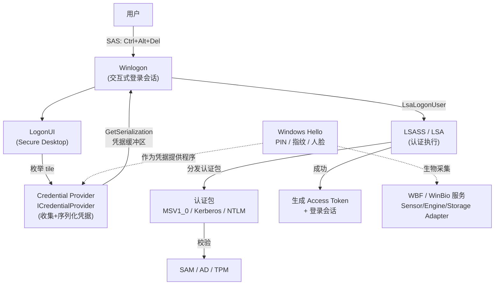

# Windows认证与生物识别编程 · 系列总览

> 作者原创系列，共 **11** 篇正文，**API 与架构以 learn.microsoft.com 官方文档为准**。系统拆解 **Windows 的认证登录与生物识别编程**：从 **交互式登录架构全景**（Winlogon/LogonUI/LSASS(LSA)/SAM、WinSta0/Secure Desktop/SAS）、**从 GINA 到 Credential Provider 的演进**（Vista 起 GINA 被弃用），到 **凭据提供程序编程**（`ICredentialProvider`/`ICredentialProviderCredential2`、字段描述符、序列化 `GetSerialization`、事件与安全）、**LSA 认证包与 SSPI**（认证包 vs 安全包 SSP/AP、`LsaLogonUser`、Kerberos/NTLM/Negotiate）、**凭据存储与保护**（Credential Manager/DPAPI/Credential Guard），再到 **Windows Hello 与 Hello for Business**（passwordless、NGC、TPM）、**WebAuthn/FIDO2/passkey 编程**（`webauthn.h`、CTAP2、plugin passkey manager）、**生物识别框架 WBF**（WinBio 服务、Biometric Unit、Sensor/Engine/Storage Adapter），最后落到 **WBDI 驱动开发** 与 **认证安全与对抗**（LSASS/Credential Guard/模板保护）。基准平台 **Windows 10/11 x64**。本系列与 [[29.Linux认证与登录编程/00.Linux认证与登录编程总览|Linux 认证与登录编程]]（PAM）构成**双平台认证对照**，并与 [[38.Windows内核与驱动逆向/00.Windows内核与驱动逆向总览|Windows 内核与驱动逆向]]（LSASS/Credential Guard/VBS）、[[37.密码学/00.密码学总览|密码学]]（TPM/非对称密钥）互补。

> [!tip] 学习建议
> Windows 登录有一条清晰的**分层链**：**凭据提供程序（Credential Provider）只负责"收集并序列化凭据"**（登录 UI 上的 tile），真正的**认证执行由 LSA 的认证包完成**——官方原文强调 "credential providers are not enforcement mechanisms"。建议按 **01 架构 → 02 演进 → 03/04 写凭据提供程序 → 05 LSA 认证包** 建立"UI 收集层"与"认证执行层"两个视角；生物识别部分（07-10）则从 **Hello（用户体验）→ WebAuthn（无密码协议）→ WBF/WinBio（生物子系统）→ WBDI（驱动）** 自顶向下理解。

> [!caution] 安全与合规
> 本系列第 **11** 篇涉及 LSASS 凭据窃取（mimikatz/pass-the-hash）与生物模板保护，一律取 **防御视角**：讲清 Credential Guard/VBS 如何阻断、Hello 为何抗钓鱼，**不提供针对他人生产系统的凭据窃取或绕过步骤**。仅用于自有环境的安全研究与防御能力建设。

## 一、登录架构与凭据提供程序

| # | 章节 | 说明 |
| --- | --- | --- |
| 01 | [[01.Windows交互式登录架构全景]] | Winlogon/LogonUI/LSASS(LSA)/SAM、WinSta0/Secure Desktop/SAS、登录会话与 Token、与 Linux 对照 |
| 02 | [[02.从GINA到CredentialProvider]] | Vista 为何弃用 GINA(msgina.dll)、Notification Packages/GINA Hooks（历史）、CPUS 使用场景 |
| 03 | [[03.CredentialProvider编程-接口与tile枚举]] | `ICredentialProvider`/`ICredentialProviderCredential2`、字段描述符 `CPFT_*`、Filter/SetUserArray、COM 注册 |
| 04 | [[04.CredentialProvider编程-序列化事件与安全]] | `GetSerialization`/`KERB_INTERACTIVE_UNLOCK_LOGON`/`CredPackAuthenticationBuffer`、`Advise` 事件、`SecureZeroMemory` |

## 二、LSA 认证与凭据保护

| # | 章节 | 说明 |
| --- | --- | --- |
| 05 | [[05.LSA认证包与SSPI深入]] | 认证包 vs SSP/AP、LSA mode/user mode、`SpLsaModeInitialize`/`LsaLogonUser`、SSPI、Kerberos/NTLM/Negotiate |
| 06 | [[06.Windows凭据存储与保护]] | Credential Manager(`CredRead/CredWrite`)、DPAPI、LSA secrets、Credential Guard/VBS/Isolated LSA |

## 三、Windows Hello 与无密码

| # | 章节 | 说明 |
| --- | --- | --- |
| 07 | [[07.WindowsHello与HelloforBusiness架构]] | passwordless、Microsoft Passport/NGC、TPM 保护非对称密钥、PIN vs 生物、抗钓鱼/抗重放 |
| 08 | [[08.WebAuthn与FIDO2与passkey编程]] | `webauthn.h`(`WebAuthNAuthenticatorMakeCredential/GetAssertion`)、CTAP2、passkey、plugin passkey manager、`KeyCredentialManager` |

## 四、生物识别框架与对抗

| # | 章节 | 说明 |
| --- | --- | --- |
| 09 | [[09.WBF架构与WinBio客户端API]] | WBS/WinBio 服务、Biometric Unit、Sensor/Engine/Storage Adapter、Sensor Pools、`winbio.h`(`WinBioOpenSession/Identify/Verify/EnrollBegin`) |
| 10 | [[10.WBDI生物识别驱动与适配器开发]] | `winbio_ioctl.h`、UMDF+WinUSB(推荐)/KMDF/WDM、`GUID_DEVCLASS_BIOMETRIC`、Sensor/Engine/Storage Adapter(`PIBIO_ENGINE_*`) |
| 11 | [[11.Windows认证安全与对抗]] | LSASS dump/pass-the-hash 原理与防御、Credential Guard 阻断、Hello 抗钓鱼、生物模板保护（防御）|

## Windows 登录的分层链

> 一句话：Windows 登录 = **凭据提供程序在 Secure Desktop 上收集凭据并序列化**（`ICredentialProvider`，只收集不判定）→ **Winlogon 经 `LsaLogonUser` 交给 LSA** → **LSA 的认证包（MSV1_0/Kerberos）执行认证并生成 Token**。Windows Hello 本质是一种"生物/PIN 凭据提供程序"，其生物采集下沉到 **WBF/WinBio 子系统**（经 Sensor/Engine/Storage Adapter 与 WBDI 驱动）。看懂"收集层 vs 执行层 vs 生物子系统"的分工，就能开发凭据提供程序、集成 Hello、编写生物驱动。
