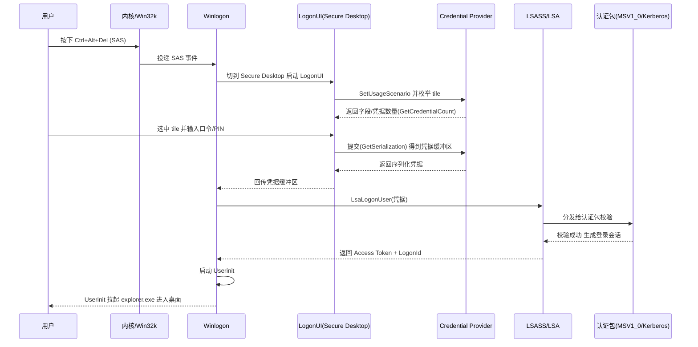
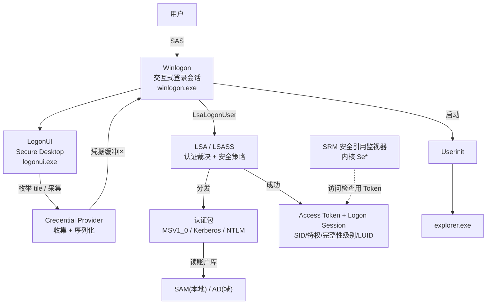

# Windows交互式登录架构全景

## 概述与定位

> [!abstract] TL;DR
> Windows 的交互式登录是一条**跨进程、跨会话、跨桌面**的分层链：`winlogon.exe` 管理交互式登录会话并独占响应 **SAS（Ctrl+Alt+Del）**；`logonui.exe` 在 **Secure Desktop** 上枚举各 **Credential Provider** 的 tile 并采集凭据；`lsass.exe` 中的 **LSA（Local Security Authority）** 才是真正的裁决者，它分发 **认证包**（MSV1_0 / Kerberos）校验凭据、维护本地安全策略、做 name↔SID 转换；校验通过后生成 **Access Token** 与 **Logon Session**，再由 `userinit.exe` 拉起 `explorer.exe`。理解这条链的关键是分清三个角色——**收集层（Credential Provider）、裁决层（LSA 认证包）、令牌与会话层（内核对象）**，它们分别落在不同进程与信任边界内。

本篇是整个《Windows 认证与生物识别编程》系列的**地图篇**。后续所有内容——凭据提供程序编程、LSA 认证包、Windows Hello、生物识别框架——都是这张地图上某一个方块的放大。之所以要先建立全景，是因为 Windows 登录的复杂度并不来自单个算法，而来自**安全边界的层层设防**：每一次凭据的传递都要跨越进程隔离、会话隔离、桌面隔离，任何一环设计不当都会把整机的信任基石掏空。看不懂这张地图，就会把「凭据提供程序」误当成认证的执行者，进而写出既不安全又跑不通的代码。

与 Linux 世界对照，这条链在概念上等价于 `getty/login`（终端与登录发起）→ PAM conversation（凭据对话）→ PAM auth 模块（认证裁决）→ 会话建立，但 Windows 把每一层都放进了更强的**内核对象模型**（Token、Logon Session、Window Station、Desktop）与**进程隔离**中，安全边界比 Linux 的进程内 `dlopen` 模块栈要硬得多。

## 原理与机制

### 为什么要拆成多个进程

一个朴素的问题是：为何不让一个进程从头到尾完成登录？答案是**最小权限**与**故障隔离**。`lsass.exe` 持有系统最敏感的凭据材料（口令哈希、Kerberos 密钥、TGT），它必须尽可能小、尽可能封闭，绝不能把第三方 UI 代码拉进自己的地址空间。而登录界面天生要加载各式各样的第三方 Credential Provider（指纹、智能卡、SSO），这些代码质量参差不齐、随时可能崩溃。于是 Windows 把 **UI 采集** 放进 `logonui.exe`、把 **流程控制** 放进 `winlogon.exe`、把 **安全裁决** 关进 `lsass.exe`——三者通过受控的 RPC/LPC 通信，任何一方崩溃都不会直接污染裁决核心。这正是「Credential Provider 只收集、不裁决」这一架构原则的物理体现。

### SAS：不可伪造的登录入口

**SAS（Secure Attention Sequence）** 即 Ctrl+Alt+Del，其核心价值是**防钓鱼**。键盘上这个组合键被系统设计为**只有 Winlogon 能收到**：它由 Win32k 内核子系统在最底层捕获并直接投递给注册了 SAS 的 Winlogon，任何用户态程序都无法模拟或拦截。这意味着当你按下 Ctrl+Alt+Del，屏幕上出现的一定是**真正的系统登录界面**，而不是某个恶意程序绘制的、用来骗取口令的假窗口。没有 SAS 这道闸，攻击者只需全屏画一个以假乱真的登录框就能钓走口令；有了 SAS，用户永远有一条「可信路径」回到真 Winlogon。这与 Linux 的 **SAK（Secure Attention Key）** 是同一思想。

### 窗口站与桌面隔离：Secure Desktop 的由来

Windows 的 GUI 隔离建立在两级对象上：**Window Station（窗口站）** 与 **Desktop（桌面）**。交互式会话拥有唯一的可见窗口站 **WinSta0**，其下有三个桌面：

- **Default 桌面**——普通用户程序（`explorer.exe` 及所有应用）运行处；
- **Winlogon 桌面**——即 **Secure Desktop（安全桌面）**，登录 UI、锁屏、UAC 提权确认框都在这里；
- **ScreenSaver 桌面**——屏保运行处。

关键机制是：**不同桌面之间的窗口互相不可见、不可发消息、不可截屏、不可注入**。当系统需要采集凭据时会**切换到 Secure Desktop**，用户态恶意程序留在 Default 桌面，既看不到你输入的口令，也无法伪造一个覆盖登录框的窗口，更无法用 `SendInput`/窗口消息模拟点击。UAC 弹框那一瞬间屏幕变暗、其余窗口失去响应，正是切到了 Secure Desktop 的视觉表现。

### Session 0 隔离

从 Windows Vista 起引入 **Session 0 隔离**：所有 Windows 服务被关进 **Session 0**（无交互 UI），第一个登录用户获得 **Session 1**，后续用户依次递增。此前（XP/2003）服务与首个交互用户共处 Session 0，导致著名的 **Shatter 攻击**——低权限程序向高权限服务的窗口发消息即可提权。其根因在于 Win32 窗口消息**不做发送方权限校验**：只要两个进程共享同一桌面，低权限进程就能给高权限进程的窗口投递 `WM_TIMER`、`WM_COPYDATA` 等消息，诱导其执行任意回调。Session 0 隔离把服务从交互桌面彻底剥离，让用户态程序再也够不到服务的窗口句柄，是现代 Windows 登录安全模型的地基之一。

## 登录架构详解

### 核心组件与职责

| 组件 | 进程/位置 | 职责 |
| --- | --- | --- |
| **Winlogon** | `winlogon.exe`（每交互会话一个，SYSTEM） | 管理交互式登录会话、注册并响应 SAS、调度 LogonUI、调用 `LsaLogonUser`、启动 Userinit |
| **LogonUI** | `logonui.exe`（Secure Desktop） | 加载并枚举 Credential Provider、绘制 tile、采集用户输入、回收序列化凭据 |
| **LSA / LSASS** | `lsass.exe` | 认证裁决、维护本地安全策略、name↔SID 转换、颁发 Token、写审计日志 |
| **SAM** | `SAM` 注册表 hive（SYSTEM） | 本地账户数据库，存本地用户口令哈希（域账户则走 AD） |
| **Netlogon** | `netlogon` 服务 | 与域控建立安全通道，转发域认证（NTLM pass-through、定位 DC） |
| **Userinit** | `userinit.exe` | 运行登录脚本、设置用户环境、加载用户配置、启动 shell（`explorer.exe`）后退出 |
| **SRM** | 内核 `Se*` 例程 | 安全引用监视器，执行访问检查、生成审计事件、与 LSA 协作 |

这里最容易被误解的是 **LSA 与 SAM 的关系**：SAM 只是**存储**（本地账户的哈希放在 SAM hive），而 LSA 才是**逻辑**（读取存储、驱动认证包、比对、决策）。域环境下账户库换成 Active Directory，LSA 通过 Netlogon/Kerberos 触达域控，但「收集—裁决—发令牌」的骨架不变。

### 登录会话与访问令牌

认证成功后，LSA 创建一个 **Logon Session（登录会话）**，用一个 **LUID（Locally Unique Identifier）** 唯一标识；同时生成一个 **Access Token（访问令牌）** 作为该用户在本机一切操作的「安全身份证」。Token 是内核对象，主要装载：

- **User SID**（用户安全标识符，等价于 Linux 的 uid）；
- **Group SIDs**（所属组，含 Logon SID，等价于 gid + 补充组）；
- **Privileges**（特权列表，如 `SeDebugPrivilege`、`SeBackupPrivilege`）；
- **Integrity Level**（完整性级别：Low/Medium/High/System，UAC 的分权基础）；
- 关联的 **Logon Session LUID**。

此后进程创建时会**继承或复制**主令牌（primary token）；服务端代客户端操作时用**模拟令牌**（impersonation token）。SRM 在每次访问内核对象时拿 Token 里的 SID 与对象的 **安全描述符（DACL）** 比对，决定放行还是拒绝——这就是 Windows 的强制访问控制落点。

### 登录类型

同一套 `LsaLogonUser` 支撑多种 **Logon Type**，常见有：交互式（Interactive，2）、网络（Network，3，如访问共享）、批处理（Batch，4，计划任务）、服务（Service，5）、解锁（Unlock，7）、远程交互（RemoteInteractive，10，RDP）。不同类型影响 Token 中缓存的凭据形态与网络凭据委派能力——例如 Network 登录默认不缓存可再用的明文/哈希凭据，这也是「pass-the-hash 面」的分界之一。

### 登录时序全链路

### 组件架构鸟瞰

## 工具视角与实战

**进程与令牌观测**：用 Sysinternals **Process Explorer** 观察 `winlogon.exe`/`logonui.exe`/`lsass.exe` 的进程树与所属会话；用内置 `whoami /all` 打印当前 Token 的 SID、组、特权与完整性级别；`whoami /logonid` 看 Logon Session 的 LUID；Sysinternals **logonsessions.exe** 列出全机登录会话及其类型；**PsGetSid** 做 name↔SID 双向解析（对应 LSA 的 `LsaLookupNames`/`LsaLookupSids`）。

**登录审计**：打开事件查看器的「安全」日志，登录成功是 **4624**、失败是 **4625**，其中 **Logon Type** 字段直接对应上文的登录类型（2=交互、3=网络、10=RDP…），**Logon ID** 就是 LUID。这是排查「谁在何时以何种方式登录」最权威的一手数据。域环境再配合 `klist` 查看当前缓存的 Kerberos 票据（TGT/服务票）。

**内核与逆向视角**：在 WinDbg 内核调试下，`!process 0 0 lsass.exe` 定位 LSASS 的 `EPROCESS`，`!token` 展开某进程主令牌的 SID/特权/完整性级别，可以把上文抽象的「Token 结构」落到真实内存布局。需要强调的是，`lsass.exe` 内存中确实驻留着可被利用的凭据材料（这正是 mimikatz 一类工具的目标），但其**采集与对抗属于防御主题**，本系列放到第 11 篇统一从蓝队视角展开，此处只点明「裁决核心即高价值目标」这一架构事实。

**双平台对照速查**：

| Windows | Linux | 角色 |
| --- | --- | --- |
| Winlogon | `getty` / `login` | 登录会话发起与流程控制 |
| Credential Provider | PAM conversation | 凭据采集（收集层） |
| LSA 认证包（MSV1_0/Kerberos） | PAM auth 模块（`pam_unix`/`pam_krb5`） | 认证裁决（执行层） |
| SAM / AD | `/etc/shadow` / LDAP | 账户与哈希存储 |
| Access Token（SID/特权/IL） | uid/gid + 补充组 + capabilities | 进程安全身份 |
| Logon Session（LUID） | session / `loginuid` | 登录会话标识 |
| SAS（Ctrl+Alt+Del） | SAK（Secure Attention Key） | 不可伪造的可信路径 |

## 安全性与正确使用

- **Secure Desktop 是底线**：任何要在登录路径上运行的代码（尤其是自定义 Credential Provider）都跑在 LogonUI 的高信任上下文里，**一旦被注入或崩溃就直接影响全机登录可用性**。严禁在此路径引入未经审计的第三方库、网络阻塞调用或可被劫持的加载点。
- **收集层不等于裁决层**：这是全系列反复强调的架构红线——Credential Provider「不是 enforcement 机制」，它只负责把用户输入**收集并序列化**，真正的口令比对、票据签发、策略强制**全部在 LSA 与认证包内完成**。把安全判定写进 Credential Provider（例如「密码对了才提交」）是典型的错误设计，既可被绕过又破坏了信任边界。
- **凭据材料及时抹除**：采集到的口令/PIN 明文在提交后必须用 `SecureZeroMemory` 抹除，避免残留在可被转储的内存里；不要日志打印、不要写盘。
- **防御纵深**：现代 Windows 用 **Credential Guard / VBS（基于虚拟化的安全）** 把 LSA 的敏感部分隔进独立的虚拟信任级别，即便普通内核被攻破也难以直接读取凭据；这部分与 Session 0 隔离、Secure Desktop 一起构成登录路径的纵深防御，细节见第 06、11 篇。

## 小结

Windows 交互式登录不是一次函数调用，而是一条**收集—裁决—发令牌**的分层链，且每一层都被进程、会话、桌面三重边界包裹：Winlogon 用 SAS 提供不可伪造的入口、LogonUI 在 Secure Desktop 上让 Credential Provider 安全采集、LSA 在封闭的 LSASS 内用认证包裁决、成功后以 Access Token 与 Logon Session 把身份固化进内核对象。牢牢抓住「**收集层只收集、裁决层才裁决、令牌层落身份**」这三分，你就拥有了阅读后续所有章节的骨架——第 02 篇将沿时间轴回看这套模型如何从 GINA 演进而来，第 03/04 篇把「收集层」放大成可编程的 `ICredentialProvider`。

## 相关阅读

- Windows Authentication Architecture — https://learn.microsoft.com/windows-server/security/windows-authentication/windows-authentication-architecture
- LSA Authentication — https://learn.microsoft.com/windows/win32/secauthn/lsa-authentication
- Winlogon and Credential Providers — https://learn.microsoft.com/windows/win32/secauthn/winlogon-and-credential-providers
- Credential Providers in Windows — https://learn.microsoft.com/windows/win32/secauthn/credential-providers-in-windows
- 本库：[[02.从GINA到CredentialProvider]]、[[05.LSA认证包与SSPI深入]]、[[06.Windows凭据存储与保护]]
- 双平台对照：[[29.Linux认证与登录编程/00.Linux认证与登录编程总览|Linux 认证(PAM)]]、[[38.Windows内核与驱动逆向/00.Windows内核与驱动逆向总览|Windows 内核与驱动逆向]]

---

🏠 [[00.Windows认证与生物识别编程总览]] ｜ 下一篇 [[02.从GINA到CredentialProvider]] ➡️
