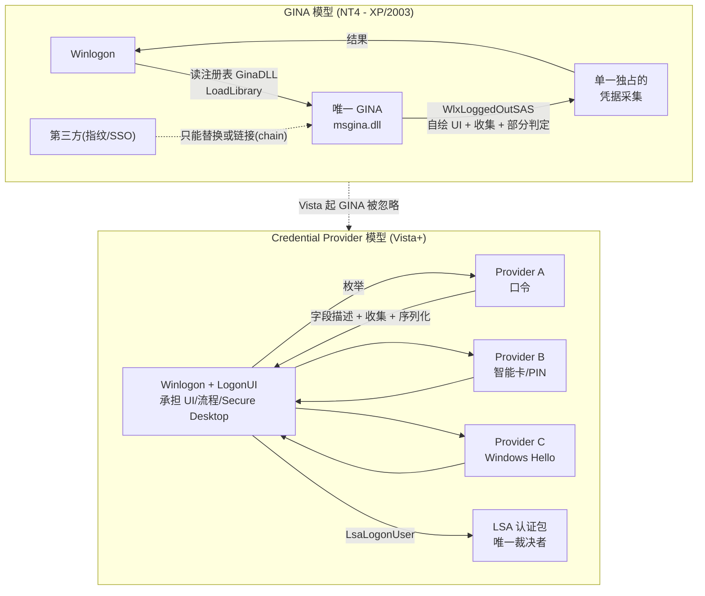

# 从GINA到CredentialProvider

## 概述与定位

> [!abstract] TL;DR
> Windows 扩展登录界面的机制经历了一次彻底换代。**NT4 到 XP/Server 2003** 时代靠 **GINA（Graphical Identification and Authentication）**——一个名为 `msgina.dll`、导出一整套 `WlxXxx` 回调、被 Winlogon **独占加载**的 DLL；第三方要加指纹/智能卡/SSO，只能**替换或链接（chain）** 这唯一的 GINA。这个模型单一独占、链式脆弱、多因素困难、UI 僵化、且 GINA 跑在 Winlogon 地址空间里安全面极大。**Windows Vista 起，GINA DLL 与 Winlogon notification packages 被彻底忽略**，改用 **Credential Provider（凭据提供程序）** 模型：**多个 provider 可并存**、以 **tile（磁贴）** 呈现、繁重的 UI 与流程收归 Winlogon/LogonUI，provider 只负责**描述字段、收集输入、序列化凭据**。一句必须记住的官方定性：**「credential providers are not enforcement mechanisms」**——它们只收集与序列化，裁决权始终在 LSA。provider 通过 **CPUS（使用场景）** 声明自己在登录/解锁/改密/CredUI/PLAP 哪些场景生效。

本篇是**演进篇**，承接第 01 篇的架构地图，沿时间轴讲清「收集层」这一格子是如何从 GINA 长成 Credential Provider 的。理解这段历史不是考古癖：一方面，海量历史资料、老旧安全产品、乃至某些逆向样本仍以 GINA 为语境，看不懂 `WlxLoggedOutSAS` 就读不懂它们；另一方面，**只有先看清 GINA 的痛点，才能真正理解 Credential Provider 的每一个设计决策为什么长成那样**——为什么要多 provider 并存、为什么 UI 由系统统一绘制、为什么严格区分「收集」与「裁决」。

## 原理与机制

### GINA 是如何工作的

在 GINA 模型里，Winlogon 启动时读取注册表 `HKLM\SOFTWARE\Microsoft\Windows NT\CurrentVersion\Winlogon` 下的 **`GinaDLL`** 值，`LoadLibrary` 加载**唯一一个** GINA DLL（默认是系统自带的 `msgina.dll`），并按约定调用它导出的一组 **`WlxXxx` 函数**。这组接口构成了 Winlogon 与 GINA 之间的完整契约，代表性的有：

- `WlxInitialize` / `WlxNegotiate`——初始化与版本协商；
- `WlxDisplaySASNotice`——未登录时显示「按 Ctrl+Alt+Del」提示；
- `WlxLoggedOutSAS`——用户在**注销状态**按下 SAS 时被调用，**GINA 在此弹出登录对话框、采集用户名口令、并向 Winlogon 返回认证结果**；
- `WlxLoggedOnSAS`——已登录状态按 SAS（锁定/切换/任务管理器）；
- `WlxWkstaLockedSAS`——**锁定状态**下按 SAS，用于解锁校验；
- `WlxActivateUserShell`——启动用户 shell；
- `WlxLogoff` / `WlxShutdown`——注销与关机清理。

关键在于 `WlxLoggedOutSAS`：**GINA 自己绘制登录 UI、自己采集凭据、自己（或委托 LSA）判定并把结果回给 Winlogon**。也就是说，在 GINA 时代，「画界面」「收凭据」甚至部分「判定逻辑」是**耦合在同一个 DLL** 里的，而这个 DLL 又运行在 Winlogon 的进程与信任级别上。

### 第三方如何扩展 GINA

由于 GINA 是**独占**的，第三方产品（指纹登录、智能卡中间件、单点登录客户端）无法「新增一个 GINA」，只能二选一：

1. **完全替换**——用自己的 GINA 顶掉 `msgina.dll`，自行实现全部 `WlxXxx`。功能最全但工作量巨大，且要复刻微软的全部登录行为。
2. **链接 / 透传（GINA chaining / stub GINA）**——写一个「桩 GINA」放到 `GinaDLL`，它在内部 `LoadLibrary` 原始的 `msgina.dll`，把大部分 `WlxXxx` 调用**转发**给原 GINA，只在关心的环节（如 `WlxLoggedOutSAS`）插入自己的逻辑（先做指纹识别，成功再转发给 `msgina` 完成标准登录）。

这种「链」看似灵活，实则是整个模型脆弱性的根源——见下节。

### Vista 的换代

**Windows Vista** 引入全新的 **Credential Provider** 模型，并明确宣告：**GINA DLL 以及 Winlogon 的 notification packages（登录通知包）不再被支持、被系统忽略**。新模型把职责重新切分：

- **Winlogon + LogonUI 承担全部繁重工作**——SAS 处理、Secure Desktop、tile 布局与绘制、输入路由、流程编排；
- **Credential Provider 只做三件事**——用**字段描述符**声明自己需要哪些 UI 元素、**收集**用户在这些字段里的输入、把结果**序列化**成一个凭据缓冲区交回；
- **多个 Credential Provider 天然并存**——每个 provider 可枚举零到多个 tile，LogonUI 把所有 provider 的 tile 汇总展示，用户选哪个用哪个。

裁决权则被干净地留在了 LSA：provider 交出的序列化凭据经 Winlogon 的 `LsaLogonUser` 送进 LSASS，由认证包比对判定。这正是那句反复出现的定性——**Credential Provider 不是 enforcement 机制**——的制度化落地。

## 两代登录模型架构详解

### GINA 模型的四大局限

理解 Credential Provider 的最好方式，是逐条盘点 GINA 到底卡在哪里：

- **单一独占**：一台机器只能有**一个** GINA。两个都想接管登录的产品（比如同时装了指纹 SDK 和 SSO 客户端）会直接冲突，只能靠脆弱的链接勉强共处。
- **链式脆弱**：GINA chaining 依赖每一环都正确转发所有 `WlxXxx`、正确处理所有边界状态。链上**任何一个桩 GINA 有 bug 或版本不兼容，整条登录链就崩**——而它崩在 Winlogon 进程里，后果是**整机无法登录**。运维现场「装了某安全软件后蓝屏/进不去桌面」的经典事故多源于此。
- **多因素困难**：GINA 的 `WlxLoggedOutSAS` 是围绕「一次采集、一组凭据」设计的，要在同一界面并列「口令 + 指纹 + 智能卡」多套凭据、让用户自由选择，模型层面就别扭。
- **UI 僵化且安全面大**：GINA **自绘对话框**，风格与系统割裂、可访问性/多语言/高 DPI 都要自己操心；更致命的是它以完整代码运行在 Winlogon 的高信任上下文，**任何内存错误都是系统级漏洞**。

### 逆向与历史安全视角

正因为 GINA 深居登录路径且处理明文凭据，历史上出现过**恶意软件挂钩 `msgina.dll`**（典型手法是 hook `WlxLoggedOutSAS`，在标准登录流程中间截获用户刚输入的明文口令并落盘/外传）的案例。这里仅作**防御视角的旁述**以说明「为什么把收集层从高信任进程里拆出来、为什么要强化 Secure Desktop」——本文**不提供任何可落地的挂钩步骤**。现代系统上 GINA 早已失效，但这段历史解释了 Credential Provider 模型为何要如此强调职责分离与信任边界。

### Credential Provider 模型的对应改进



对照两图即可看出换代的实质：GINA 把「UI + 收集 + 部分判定」压进**一个独占 DLL**，第三方只能挤在同一根脆弱的链上；Credential Provider 则把 **UI/流程上收给系统**、让**多个 provider 平行共存**、把**裁决下沉给 LSA**——三条改动一一对应 GINA 的四大痛点。

### CPUS：使用场景枚举

Credential Provider 通过 `SetUsageScenario` 收到一个 **`CREDENTIAL_PROVIDER_USAGE_SCENARIO`（CPUS）**，据此决定「本场景下我是否出面、出几个 tile、要哪些字段」。官方枚举精确为：

```cpp
typedef enum _CREDENTIAL_PROVIDER_USAGE_SCENARIO {
  CPUS_INVALID = 0,          // 尚未设置场景（初始值）
  CPUS_LOGON,                // 工作站登录（Win10 起也承担解锁）
  CPUS_UNLOCK_WORKSTATION,   // 工作站解锁，需把当前登录用户枚举为默认 tile
  CPUS_CHANGE_PASSWORD,      // 改密：需要向用户索取口令/PIN 才实现
  CPUS_CREDUI,              // Credential UI：远程认证/UAC 越肩提示，独立实例
  CPUS_PLAP                 // 预登录访问（Pre-Logon-Access Provider），如登录前拨 VPN
} CREDENTIAL_PROVIDER_USAGE_SCENARIO;
```

几处**必须吃透的边界**：

- **`CPUS_LOGON` 与 `CPUS_UNLOCK_WORKSTATION` 在 Windows 10 起被合并**——系统允许多用户在锁定后直接登录而不必来回切换会话，因此 `CPUS_LOGON` 现在既覆盖登录也覆盖解锁。但受各类**组策略**（隐藏快速用户切换、不显示上次登录名等）与「控制台 vs 远程会话」影响，系统**仍可能给出 `CPUS_UNLOCK_WORKSTATION`**。所以你的 provider 必须**足够健壮，能按收到的场景动态构造正确的凭据结构**，绝不能假设只会收到某一个。
- **`CPUS_CREDUI` 用的是与登录/解锁/改密完全不同的 provider 实例**，跨这两组场景**状态不可保留**（因为 CredUI 每次 `CredUIPromptForWindowsCredentials` 都新建实例，而 Logon UI 会在整个生命周期内保持同一实例、可记住上次是哪个 tile）。把「记住上次输入」之类状态跨场景复用是常见错误。
- **`CPUS_CHANGE_PASSWORD`**：仅当你确实需要向用户索取口令/PIN 这类机密时才实现；纯展示型 provider 不应插手改密。
- **`CPUS_PLAP`**：预登录访问提供程序注册在**另一个注册表键** `HKLM\SOFTWARE\Microsoft\Windows\CurrentVersion\Authentication\PLAP Providers`（而非普通 Credential Providers 键），用于「登录之前」就需要网络的场景（典型是登录前先建 VPN/DirectAccess 连接）。

### V1 与 V2 的分野

Credential Provider 接口有两代：**V1**（最低 Windows Vista）与 **V2**（最低 Windows 8，官方**推荐**）。V2 的核心增量是 **按用户分组**——Windows 8 引入「登录界面先列出一组**用户 tile**，选中某用户再展开其可用的登录方式」的体验。为支撑它，V2 增加了 `ICredentialProviderCredential2::GetUserSid`（把某个凭据与具体用户 SID 绑定、归到该用户 tile 下），并配套 `ICredentialProviderSetUserArray` / `ICredentialProviderUser`（系统在 `GetCredentialCount` **之前**通过 `SetUserArray` 把「本次要展示哪些用户」告诉 provider）。这些接口的编程细节留给第 03 篇，此处只需记住结论：**新写 provider 一律实现 V2**，以获得与现代登录界面一致的「按用户分组」体验。

## 工具视角与实战

**迁移与共存实战**：如果你手上有一份古董 GINA 代码要迁到现代 Windows，思路不是「翻译」而是「重构」——把 `WlxLoggedOutSAS` 里「画 UI」的部分丢给系统（改为声明字段描述符）、把「收集凭据」的部分映射到 `GetStringValue`/`SetStringValue`、把「判定/提交」的部分改写为 `GetSerialization` 产出凭据缓冲区，判定则彻底交还 LSA。GINA 的「链」在新模型里天然不需要了：你只管注册**自己那一个** provider，与系统 provider、其它第三方 provider **平级共存**，互不干扰。

**场景验证**：开发时最容易踩的是 CPUS 分支没覆盖全。务必在真机/虚拟机上分别验证：正常登录、锁屏后解锁、改密流程、以及（若声明支持）`runas`/UAC 触发的 CredUI。用组策略切换「交互式登录: 不显示上次登录用户名」「隐藏快速用户切换」等，观察系统在何时改发 `CPUS_UNLOCK_WORKSTATION`，确认你的 provider 不会因为「只处理了 `CPUS_LOGON`」而在解锁时消失。

**注册与定位**：普通 provider 注册在 `HKLM\SOFTWARE\Microsoft\Windows\CurrentVersion\Authentication\Credential Providers\{CLSID}`，PLAP provider 在同级的 `PLAP Providers` 键——排查「provider 不出现在登录界面」时，**第一件事就是核对注册的是不是场景对应的那个键**。配合 `ICredentialProviderFilter` 还能在运行时动态过滤/禁用某些 provider（细节见第 03 篇）。

## 安全性与正确使用

- **牢记「不是 enforcement 机制」**：无论 GINA 时代还是 Credential Provider 时代，**在收集层做安全判定都是反模式**。GINA 的历史教训（判定与收集耦合、又跑在高信任进程里）正是新模型刻意规避的；新写 provider 请把「对不对、准不准」全部交给 LSA 认证包，自己只忠实收集与序列化。
- **别再依赖 GINA / notification packages**：任何试图在现代系统上复活 `GinaDLL` 或 Winlogon 登录通知包的做法都**无效**（被系统忽略），且往往是过时资料的误导。遇到这类需求一律用 Credential Provider（或 PLAP）实现。
- **不要 wrapping 系统 provider**：官方明确不建议「包裹/劫持」内置 provider 来复用其功能——这与 GINA chaining 一样脆弱，容易破坏内置 provider、引发登录异常。请写**独立的 custom provider**。
- **CPUS 分支要健壮**：按上文，`CPUS_LOGON`/`CPUS_UNLOCK_WORKSTATION` 会因策略与会话类型动态给出，provider 必须依据实际收到的场景构造凭据，不可硬编码假设，否则会出现「能登录却解不了锁」之类只在特定策略下复现的诡异故障。

## 小结

从 GINA 到 Credential Provider，是 Windows 把登录「收集层」从**一个独占、脆弱、高信任、UI 自绘的 DLL**，重构为**多方并存、职责单一、由系统统一绘制、只收集与序列化**的可插拔模型的过程。GINA 的四大痛点（独占、链脆、多因素难、安全面大）与 Vista 的三条改动（UI 上收、provider 平行、裁决下沉）一一对应；而 CPUS 使用场景枚举则是新模型让 provider「因地制宜」的开关。记住那句定性——**Credential Provider 不是 enforcement 机制**——你就抓住了两代换代真正想守住的东西：**收集与裁决必须分家**。下一篇进入实操，把 `ICredentialProvider` 与 tile 枚举彻底拆开讲。

## 相关阅读

- Credential Providers in Windows — https://learn.microsoft.com/windows/win32/secauthn/credential-providers-in-windows
- CREDENTIAL_PROVIDER_USAGE_SCENARIO enumeration — https://learn.microsoft.com/windows/win32/api/credentialprovider/ne-credentialprovider-credential_provider_usage_scenario
- Winlogon and Credential Providers — https://learn.microsoft.com/windows/win32/secauthn/winlogon-and-credential-providers
- Customizing Winlogon（历史/GINA 背景）— https://learn.microsoft.com/previous-versions/windows/
- 本库：[[01.Windows交互式登录架构全景]]、[[03.CredentialProvider编程-接口与tile枚举]]、[[04.CredentialProvider编程-序列化事件与安全]]
- 对照：[[29.Linux认证与登录编程/00.Linux认证与登录编程总览|Linux 认证(PAM)]]

---

🏠 [[00.Windows认证与生物识别编程总览]] ｜ 上一篇 [[01.Windows交互式登录架构全景]] ｜ 下一篇 [[03.CredentialProvider编程-接口与tile枚举]] ➡️
