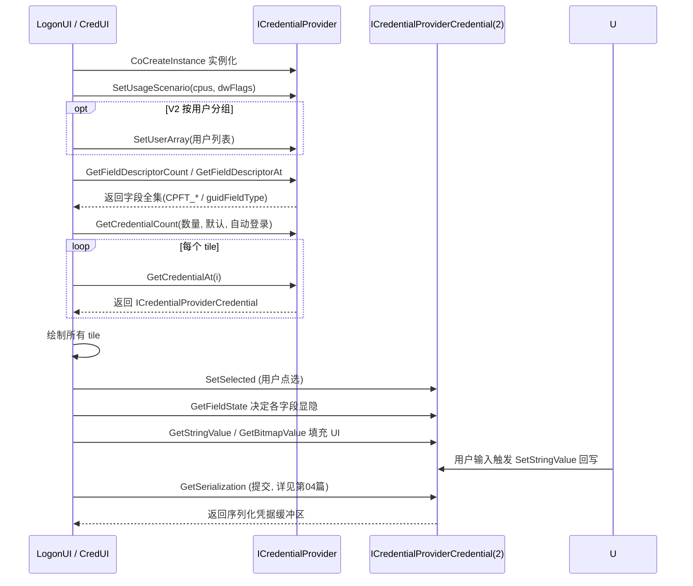

# CredentialProvider编程-接口与tile枚举

## 概述与定位

> [!abstract] TL;DR
> 一个 Credential Provider 本质是一个**进程内 COM 对象**（头文件 `credentialprovider.h`，最低 Windows Vista；V2 接口最低 Windows 8 且**官方推荐**）。你至少要实现两个接口：**`ICredentialProvider`**（描述有哪些字段、枚举出几个凭据 tile）与 **`ICredentialProviderCredential`**（每个 tile 的行为：选中、取字段值、回写、提交）；V2 再加 **`ICredentialProviderCredential2::GetUserSid`** 以便把 tile 归到具体用户下。LogonUI 的 **tile 枚举**是一条固定调用序列：`SetUsageScenario` →（V2：`SetUserArray`）→ `GetFieldDescriptorCount/At` → `GetCredentialCount` → 逐个 `GetCredentialAt` → 用户选中触发 `SetSelected` → 靠 `GetFieldState`/`GetStringValue`/`GetBitmapValue` 把 tile 画出来。字段用 **`CREDENTIAL_PROVIDER_FIELD_DESCRIPTOR`** 描述，类型是 **`CPFT_*`**、可见性是 **`CPFS_*`**。真正的「提交打包」`GetSerialization` 留到第 04 篇。

本篇是**编程篇**，把第 01/02 篇里那个抽象的「收集层」放大成可落地的接口与调用时序。目标是让你读完就能在脑中跑一遍：LogonUI 到底按什么顺序问了 provider 哪些问题、每个问题该返回什么、一个 tile 从「被枚举」到「被点亮」到「可提交」中间经历了哪些回调。所有接口签名与枚举取值均以 `credentialprovider.h` 官方文档为准。

## 原理与机制

### 为什么是 COM 进程内对象

Credential Provider 被设计成 **in-proc COM 对象**（`InprocServer32`），由 LogonUI/CredUI 进程在需要时 `CoCreateInstance` 实例化。选 COM 而非普通导出函数，是因为登录界面要**同时容纳多个来源的 provider**并统一管理其生命周期与接口协商——COM 的 `IUnknown`（`QueryInterface`/`AddRef`/`Release`）恰好提供了「同一对象暴露多个接口、按需查询、引用计数管理」的标准机制。于是「多 provider 并存」在工程上就落成了「宿主进程里并存多个 COM 对象」。

这一选择也决定了两个易被忽视的工程约束。其一是**线程模型**：provider 注册时必须声明 `ThreadingModel = Apartment`，意味着你的方法会在宿主的单线程套间（STA）里被调用，**不要在方法内做长时间阻塞**（网络握手、磁盘轮询），否则会卡住整个登录界面；确需异步的工作应放到后台线程，完成后用 `ICredentialProviderEvents` 通知宿主重新枚举。其二是**生命周期与引用计数**：宿主靠 `AddRef`/`Release` 决定何时卸载你的对象，一旦你多减一次引用就会提前析构、少减一次则 DLL 永远卸不掉（`DllCanUnloadNow` 一直返回占用），二者都会在登录路径上表现为难以复现的崩溃或句柄泄漏，因此 COM 内存与引用的纪律在这里是**安全等级**而非风格问题。

### 两个（或三个）必实现接口的分工

- **`ICredentialProvider`**——**provider 级**。回答「本场景（CPUS）下我要哪些字段、我能枚举出几个凭据、第 i 个凭据对象是谁」。整个登录 UI 生命周期内它只被实例化一次，可借此保存状态（`CPUS_CREDUI` 除外，见第 02 篇）。
- **`ICredentialProviderCredential`**——**tile 级**。每个被枚举出来的凭据就是一个 tile，对应一个该接口实例，回答「我被选中/取消了、我这个字段的当前文本/图片是什么、用户在编辑框里敲字了、请把我提交打包」。
- **`ICredentialProviderCredential2`**——V2 增量，仅多一个 `GetUserSid`，把该 tile 关联到某用户 SID，从而归入 Windows 8+ 的「用户分组」界面。

### 字段：先全部声明，再靠状态显隐

一条**铁律**：**字段一旦为某个使用场景定义好，就不能再增删**。provider 必须在枚举 tile 之前把所有可能出现的字段**一次性全部声明**（哪怕某些字段一开始不显示）。运行中「让字段出现/消失」不是增删字段，而是改变其 **`CREDENTIAL_PROVIDER_FIELD_STATE`**。这条约束深刻影响设计：你要在 `GetFieldDescriptorCount/At` 阶段就规划好全集，之后只玩「显隐」不玩「增删」。

典型例子是指纹登录：界面初始只显示头像与「请按指纹」提示，口令编辑框（`CPFT_PASSWORD_TEXT`）从一开始就**已声明但置为 `CPFS_HIDDEN`**；当指纹识别失败需要回退到口令时，provider 通过 `ICredentialProviderCredentialEvents::SetFieldState` 把该字段改成 `CPFS_DISPLAY_IN_SELECTED_TILE`，口令框「浮现」出来——全程没有新增任何字段，只是切换了既有字段的可见性。理解这一点，才能解释为什么模型要强制「先声明全集」：宿主需要在枚举阶段就拿到稳定的字段布局表，才能高效地为每个 tile 预分配 UI 元素、并在后续只做增量刷新而非重排，这既是性能考量，也避免了运行中字段集合突变带来的 UI 竞态。

## 接口与枚举详解

### ICredentialProvider 方法逐条

`ICredentialProvider` 继承 `IUnknown`，核心方法：

- **`SetUsageScenario(CREDENTIAL_PROVIDER_USAGE_SCENARIO cpus, DWORD dwFlags)`**——初始化时被调用，告知当前 **CPUS**；`dwFlags` 在 CredUI 场景下携带 `Wincred.h` 里的 `CREDUIWIN_*` 位（如 `CREDUIWIN_GENERIC`/`CREDUIWIN_CHECKBOX`/`CREDUIWIN_AUTHPACKAGE_ONLY`/`CREDUIWIN_IN_CRED_ONLY`）。provider 在此决定「本场景我是否出面、如何组织字段」，是整个对象的起点。
- **`SetSerialization(...)`**——接收一份预置的序列化凭据（例如 CredUI 传入的已有凭据），provider 据此预填。注意：`CPUS_LOGON` 场景下即便本方法返回失败，provider 仍会被启用。
- **`Advise(ICredentialProviderEvents *pcpe, UINT_PTR upAdviseContext)` / `UnAdvise()`**——LogonUI 通过 `Advise` 递给 provider 一个 **`ICredentialProviderEvents`** 回调句柄；当 provider 需要**让 UI 重新枚举凭据**（比如插入智能卡后要新增 tile）时，就用它通知宿主。`UnAdvise` 时释放。
- **`GetFieldDescriptorCount(DWORD *pdwCount)` / `GetFieldDescriptorAt(DWORD dwIndex, CREDENTIAL_PROVIDER_FIELD_DESCRIPTOR **ppcpfd)`**——报告字段全集的数量与逐个描述符。这就是上文「先声明全集」的落点。
- **`GetCredentialCount(DWORD *pdwCount, DWORD *pdwDefault, BOOL *pbAutoLogonWithDefault)`**——报告本 provider 要枚举**几个** tile、**默认**选中第几个（`pdwDefault`，无默认用 `CREDENTIAL_PROVIDER_NO_DEFAULT`）、以及是否**自动用默认 tile 直接登录**（`pbAutoLogonWithDefault`，可实现「免点击自动登录」）。
- **`GetCredentialAt(DWORD dwIndex, ICredentialProviderCredential **ppcpc)`**——按下标交出第 `dwIndex` 个凭据对象（即那个 tile 的 `ICredentialProviderCredential`）。LogonUI 用 `GetCredentialCount` + `GetCredentialAt` 组合把所有 tile 拉齐。

### 字段描述符系统

单个字段由结构体描述：

```cpp
typedef struct _CREDENTIAL_PROVIDER_FIELD_DESCRIPTOR {
  DWORD                          dwFieldID;      // 字段唯一 ID（provider 内唯一，含隐藏字段）
  CREDENTIAL_PROVIDER_FIELD_TYPE cpft;           // 字段类型 CPFT_*
  LPWSTR                         pszLabel;       // 友好名（无障碍/提示用，如 "Password"）
  GUID                           guidFieldType;  // 字段语义 GUID（如 CPFG_LOGON_PASSWORD）
} CREDENTIAL_PROVIDER_FIELD_DESCRIPTOR;
```

**字段类型 `CREDENTIAL_PROVIDER_FIELD_TYPE`（CPFT_\*）** 官方全集：

```cpp
typedef enum _CREDENTIAL_PROVIDER_FIELD_TYPE {
  CPFT_INVALID = 0,
  CPFT_LARGE_TEXT,     // 大号文本（常作 tile 标题，如用户名）
  CPFT_SMALL_TEXT,     // 小号文本（说明/标签；也用于 V2 provider 悬浮描述）
  CPFT_COMMAND_LINK,   // 命令链接（可点击，触发 CommandLinkClicked）
  CPFT_EDIT_TEXT,      // 单行编辑框（如用户名输入）
  CPFT_PASSWORD_TEXT,  // 口令编辑框（掩码显示）
  CPFT_TILE_IMAGE,     // tile 图像（用户头像/provider 图标）
  CPFT_CHECKBOX,       // 复选框
  CPFT_COMBOBOX,       // 下拉框
  CPFT_SUBMIT_BUTTON   // 提交按钮
} CREDENTIAL_PROVIDER_FIELD_TYPE;
```

**字段可见性 `CREDENTIAL_PROVIDER_FIELD_STATE`（CPFS_\*）**：

```cpp
typedef enum _CREDENTIAL_PROVIDER_FIELD_STATE {
  CPFS_HIDDEN = 0,                  // 任何状态都不显示（如指纹通过前隐藏口令框）
  CPFS_DISPLAY_IN_SELECTED_TILE,    // 仅 tile 被选中时显示
  CPFS_DISPLAY_IN_DESELECTED_TILE,  // 仅未选中时显示（仅 CPUS_CREDUI 有效）
  CPFS_DISPLAY_IN_BOTH              // 选中/未选中都显示
} CREDENTIAL_PROVIDER_FIELD_STATE;
```

字段的**语义 GUID**（`guidFieldType`，定义于 `Shlguid.h`）把「这个框在语义上是什么」告诉系统，常见有 `CPFG_LOGON_USERNAME`、`CPFG_LOGON_PASSWORD`、`CPFG_SMARTCARD_USERNAME`、`CPFG_SMARTCARD_PIN`，以及 Windows 8 起用于 V2 的 `CPFG_CREDENTIAL_PROVIDER_LOGO`（provider 图标）与 `CPFG_CREDENTIAL_PROVIDER_LABEL`（provider 文字标签）。一个 V2 provider 想在「登录选项」下显示自己的图标，做法就是定义一个 `CPFT_TILE_IMAGE` 字段并把其 `guidFieldType` 设为 `CPFG_CREDENTIAL_PROVIDER_LOGO`（推荐 72×72 像素）；想要悬浮文字则用 `CPFT_SMALL_TEXT` + `CPFG_CREDENTIAL_PROVIDER_LABEL`。

### ICredentialProviderCredential 方法逐条

每个 tile 的行为接口（继承 `IUnknown`），核心方法：

- **`Advise(ICredentialProviderCredentialEvents *pcpce)` / `UnAdvise()`**——拿到**凭据级**回调句柄 `ICredentialProviderCredentialEvents(2)`，用于运行中通知 UI「某字段的状态/文本/位图变了」（如 `SetFieldState`/`SetFieldString`）。应在其它方法之前先调用。
- **`SetSelected(BOOL *pbAutoLogon)` / `SetDeselected()`**——tile 被选中/取消选中。`SetSelected` 里可置 `pbAutoLogon` 请求「一选中就自动提交」（如智能卡插入即登录）。
- **`GetFieldState(DWORD dwFieldID, CREDENTIAL_PROVIDER_FIELD_STATE *pcpfs, CREDENTIAL_PROVIDER_FIELD_INTERACTIVE_STATE *pcpfis)`**——回答某字段当前**是否显示**（`pcpfs`）与**能否交互**（`pcpfis`）。tile 的「长相」主要由此决定。
- **`GetStringValue(DWORD dwFieldID, LPWSTR *ppsz)` / `SetStringValue(DWORD dwFieldID, LPCWSTR psz)`**——读取/回写文本字段。`SetStringValue` 由 UI 在用户于 `CPFT_EDIT_TEXT` 里敲字时回调 provider，让 provider 持有最新输入。
- **`GetBitmapValue(DWORD dwFieldID, HBITMAP *phbmp)`**——返回 `CPFT_TILE_IMAGE` 字段的位图（头像/图标）。
- **`GetCheckboxValue` / `SetCheckboxValue`、`GetComboBoxValueCount` / `GetComboBoxValueAt` / `SetComboBoxSelectedValue`、`CommandLinkClicked`**——对应复选框、下拉框、命令链接的取值与交互。
- **`GetSubmitButtonValue(DWORD dwFieldID, DWORD *pdwAdjacentTo)`**——告诉 UI 提交按钮应挨着哪个字段摆放。
- **`GetSerialization(...)`**——用户提交时被调用，把当前采集到的凭据**打包成序列化缓冲区**交给认证。**这是整个 provider 的产出核心，机制复杂（涉及 `KERB_INTERACTIVE_UNLOCK_LOGON`、`CredPackAuthenticationBuffer` 等），本篇只点到为止，第 04 篇专门展开。**
- **`ReportResult(NTSTATUS ntsStatus, NTSTATUS ntsSubstatus, LPWSTR *ppszOptionalStatusText, CREDENTIAL_PROVIDER_STATUS_ICON *pcpsiOptionalStatusIcon)`**——认证返回后被调用，provider 据状态码把「密码错误/账户锁定」翻译成用户可读提示并选状态图标。

### tile 枚举时序



### 辅助接口

- **`ICredentialProviderFilter`**——**运行时动态过滤** provider：可根据条件启用/禁用某些 provider（含内置的），也能在远程场景更新凭据。适合「策略下只允许某种登录方式」这类需求。
- **`ICredentialProviderSetUserArray` / `ICredentialProviderUser`**（Windows 8+）——支撑 V2 的「按用户分组」。系统在 `GetCredentialCount` **之前**调用 `SetUserArray`，把本次要展示的用户集合（`ICredentialProviderUserArray`，可 `GetCount`/`GetAt` 遍历，每个 `ICredentialProviderUser` 能取 `GetSid`/`GetProviderID`/`GetStringValue`）交给 provider，provider 据此为每个用户生成归属正确的 tile。注意 **`ICredentialProviderUser` 由 Windows 实现，第三方不实现它**，只消费。
- **`ICredentialProviderEvents` / `ICredentialProviderCredentialEvents(2)`**——分别是 provider 级与凭据级的**回调**：前者请求宿主**重新枚举**凭据；后者在运行中**批量更新字段**状态/文本/位图（`ICredentialProviderCredentialEvents2` 还支持 `BeginFieldUpdates`/`EndFieldUpdates` 批处理以减少闪烁）。

### COM 注册

Credential Provider DLL 必须像标准 in-proc COM 组件那样导出 **`DllGetClassObject`** 与 **`DllCanUnloadNow`**（以及可选的自注册 `DllRegisterServer`），并写两处注册表：

1. **登记为凭据提供程序**：`HKLM\SOFTWARE\Microsoft\Windows\CurrentVersion\Authentication\Credential Providers\{你的CLSID}`（PLAP 则写同级的 `PLAP Providers` 键）。
2. **登记 COM 类**：`HKEY_CLASSES_ROOT\CLSID\{你的CLSID}\InprocServer32`，默认值指向你的 DLL 路径，并设 **`ThreadingModel = Apartment`**。

两处缺一不可：少了第 1 处系统不知道「登录界面要加载你」，少了第 2 处 COM 无法实例化你的类。排查「provider 不出现」时先核对这两个键与 CLSID 是否一致、是否写进了场景对应的键。

## 工具视角与实战

**从官方样例起步**：Windows SDK 自带完整可编译样例，路径 `\Samples\Security\CredentialProvider`（也在 microsoft/Windows-classic-samples 仓库）。它演示了字段描述符声明、tile 枚举、`GetSerialization` 打包的标准骨架，是**最可靠的起点**——不要从零手搓，先跑通样例再改。

**调试的特殊性**：Credential Provider 跑在 **LogonUI/CredUI 进程**、且常处于 **Secure Desktop**，普通用户态调试器很难附加。实战做法是：在**虚拟机 + 可回滚快照**里迭代（写坏了直接回滚，避免把宿主机登录搞崩）；用**内核调试器**（WinDbg 双机）或在代码里打 `OutputDebugString` + DebugView（Session 0）观察；用**事件日志**与状态码定位。切记先在 VM 里验证再上真机。

**逐场景自测**：结合第 02 篇的 CPUS，把「登录 / 解锁 / 改密 / CredUI（runas、UAC 越肩）」逐一走一遍，观察 `SetUsageScenario` 收到的场景、`GetCredentialCount` 返回的 tile 数、`GetFieldState` 的显隐是否符合预期。V2 还要验证 `SetUserArray` 后每个用户 tile 的归属（`GetUserSid`）是否正确。

## 安全性与正确使用

- **机密处理即抹除**：`GetStringValue`/`SetStringValue`/`GetSerialization` 会经手口令、PIN 等明文机密，用完**立即 `SecureZeroMemory`** 抹除缓冲区，绝不日志打印、不落盘、不长期驻留。这是登录路径代码的基本操守。
- **不 wrapping 系统 provider**：官方在字段描述符文档里明确——包裹内置 provider「可能导致意外行为并禁用内置 provider」。请写**独立 custom provider**，靠多 provider 并存共处，而非劫持系统 provider。
- **健壮性即安全性**：provider 跑在高信任的 LogonUI 上下文，**任何未处理异常/内存错误都可能让登录界面不可用**。所有方法都要严格判空、检查 `HRESULT`、正确管理 COM 引用计数与 `CoTaskMemAlloc`/`SysAllocString` 内存所有权（谁分配谁释放、按 COM 约定移交）。
- **裁决仍在 LSA**：再次强调——本篇所有接口都属「收集层」，`GetSerialization` 只是**打包**不是**判定**。把「密码是否正确」的逻辑写进 provider 是错误且可被绕过的；正确与否由 LSA 认证包在收到序列化缓冲区后裁决（见第 04、05 篇）。

## 小结

写一个 Credential Provider，就是实现一对（V2 是一组）COM 接口并接住 LogonUI 的固定提问序列：`ICredentialProvider` 在 provider 级声明**字段全集**（`CPFT_*` 类型 + `guidFieldType` 语义）并枚举出若干 **tile**；`ICredentialProviderCredential(2)` 在 tile 级响应**选中、取值、回写、提交**，用 `CPFS_*` 状态控制字段显隐而非增删。tile 枚举时序（`SetUsageScenario` →（`SetUserArray`）→ 字段描述 → `GetCredentialCount`/`GetCredentialAt` → `SetSelected` → 显隐与填充）是必须烂熟于心的主干；辅助接口（Filter、SetUserArray/User、两个 Events）与两处注册表则决定了「能不能被加载、能不能动态更新」。真正把凭据打包送去认证的 `GetSerialization`——以及随之而来的事件与安全细节——是下一篇的主角。

## 相关阅读

- ICredentialProvider interface — https://learn.microsoft.com/windows/win32/api/credentialprovider/nn-credentialprovider-icredentialprovider
- ICredentialProviderCredential interface — https://learn.microsoft.com/windows/win32/api/credentialprovider/nn-credentialprovider-icredentialprovidercredential
- CREDENTIAL_PROVIDER_FIELD_TYPE / FIELD_STATE / FIELD_DESCRIPTOR — https://learn.microsoft.com/windows/win32/api/credentialprovider/
- Credential Providers in Windows — https://learn.microsoft.com/windows/win32/secauthn/credential-providers-in-windows
- 本库：[[02.从GINA到CredentialProvider]]、[[04.CredentialProvider编程-序列化事件与安全]]、[[01.Windows交互式登录架构全景]]
- 对照：[[29.Linux认证与登录编程/00.Linux认证与登录编程总览|Linux 认证(PAM)]]

---

🏠 [[00.Windows认证与生物识别编程总览]] ｜ 上一篇 [[02.从GINA到CredentialProvider]] ｜ 下一篇 [[04.CredentialProvider编程-序列化事件与安全]] ➡️
