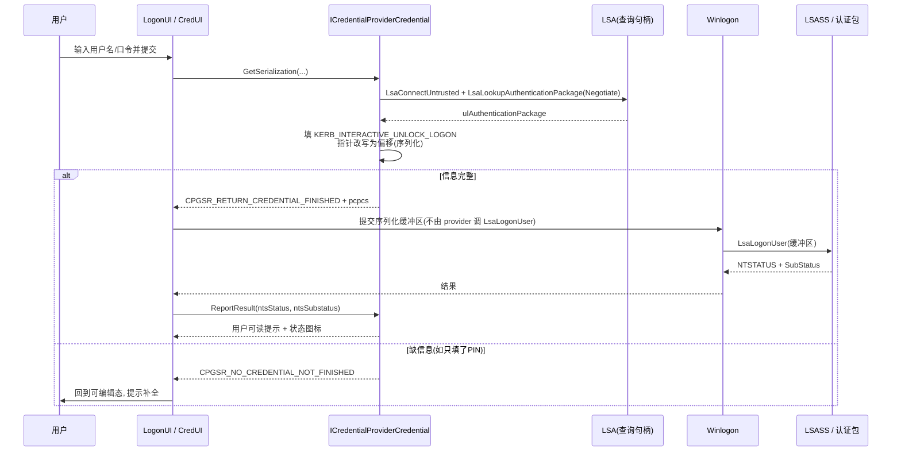

# CredentialProvider编程-序列化事件与安全

## 概述与定位

> [!abstract] TL;DR
> 上一篇把 tile 枚举讲透，本篇聚焦一个 Credential Provider 真正的**产出**：`ICredentialProviderCredential::GetSerialization`。它把用户在 tile 上敲入的用户名/口令/PIN **打包成一段与认证包（AP）匹配的二进制缓冲区**，通过 `CREDENTIAL_PROVIDER_CREDENTIAL_SERIALIZATION`（含 `ulAuthenticationPackage`/`clsidCredentialProvider`/`cbSerialization`/`rgbSerialization`）交回宿主，并用返回码 `CREDENTIAL_PROVIDER_GET_SERIALIZATION_RESPONSE`（`CPGSR_*` 四态）告诉宿主「是否已就绪、要不要提交」。交互式登录场景下缓冲区通常是一个**序列化后的 `KERB_INTERACTIVE_UNLOCK_LOGON`**（其内嵌 `KERB_INTERACTIVE_LOGON`），也可用 `CredPackAuthenticationBuffer` 打包（尤其 CredUI/Negotiate）；认证包 ID 由 `LsaLookupAuthenticationPackage` 查得。**关键约束（官方原文）**：即便是 `CPUS_LOGON`，你也**不直接调 `LsaLogonUser`**——只把缓冲区交给 Winlogon，由系统去调 LSA。异步/事件用 `Advise`+`ICredentialProviderEvents::CredentialsChanged`（请求重新枚举）与 `ICredentialProviderCredentialEvents2`（批量刷新字段）。认证返回后靠 `ReportResult`（NTSTATUS→用户消息）翻译错误。安全上：口令用完立刻 `SecureZeroMemory`，缓冲区按 COM 约定用 `CoTaskMemAlloc` 分配、`CoTaskMemFree` 释放，绝不 wrapping 系统 provider。

本篇是 03 的**下半场**。03 讲「provider 长什么样、tile 怎么被枚举点亮」，本篇讲「用户按下回车之后发生了什么」——凭据如何被序列化、认证包如何被选定、结果如何回吐、以及这条最敏感的代码路径上有哪些必须遵守的内存与机密纪律。所有结构体与函数签名均以 `credentialprovider.h`、`ntsecapi.h`、`wincred.h` 官方文档为准。

## 原理与机制

### 序列化：为什么必须「打包」

LogonUI/CredUI 与真正执行认证的 LSA **不在同一信任边界、往往不在同一进程**。tile 上的字段是一堆散落的 `LPWSTR`、`HBITMAP`、复选框状态；LSA 的认证包只认一段**自包含、可跨进程搬运的字节流**。所谓「序列化」（serialization），就是把散落的输入**收拢成一段结构固定、内部指针已改写为偏移量、可被整体拷贝到 LSA 地址空间**的缓冲区。这解释了为什么不能简单「把口令字符串指针传过去」：跨进程后那个指针无意义，必须把字符串数据本身连同长度打进缓冲区，并把 `UNICODE_STRING::Buffer` 从**绝对指针**改成**相对缓冲区首地址的偏移**，让 LSA 收到后再重定位。

`GetSerialization` 就是这一步的落点。它的四个出参分工明确：

```cpp
HRESULT GetSerialization(
  [out] CREDENTIAL_PROVIDER_GET_SERIALIZATION_RESPONSE *pcpgsr,   // 状态：CPGSR_*
  [out] CREDENTIAL_PROVIDER_CREDENTIAL_SERIALIZATION   *pcpcs,    // 打包好的凭据
  [out] LPWSTR                                         *ppszOptionalStatusText,   // 可选提示
  [out] CREDENTIAL_PROVIDER_STATUS_ICON                *pcpsiOptionalStatusIcon   // 可选图标
);
```

`pcpcs` 就是承载凭据的结构：

```cpp
typedef struct _CREDENTIAL_PROVIDER_CREDENTIAL_SERIALIZATION {
  ULONG ulAuthenticationPackage;   // 认证包 ID（来自 LsaLookupAuthenticationPackage）
  GUID  clsidCredentialProvider;   // 本 provider 的 CLSID
  ULONG cbSerialization;           // rgbSerialization 字节数
  byte  *rgbSerialization;         // 真正的凭据字节流（如序列化后的 KERB_INTERACTIVE_UNLOCK_LOGON）
} CREDENTIAL_PROVIDER_CREDENTIAL_SERIALIZATION;
```

`rgbSerialization` 的**格式由目标认证包决定**——这是理解全篇的钥匙：provider 不定义凭据格式，它只是把用户输入**翻译成某个 AP 能读懂的方言**。选 MSV1_0/Kerberos，就填 `KERB_*` 结构；写了自定义 AP，就填自己的私有格式（此时 `ulAuthenticationPackage` 用自定义值）。

### 四个返回码 CPGSR_* 的语义

`pcpgsr` 决定宿主下一步动作，四态**必须精确使用**：

- **`CPGSR_NO_CREDENTIAL_NOT_FINISHED`**（=0）——没打包凭据，且**还没完成**，需要更多信息。典型：要求 PIN + 密保答案，用户只填了 PIN。宿主据此让 UI 回到可编辑态、给用户再来一次的机会。
- **`CPGSR_NO_CREDENTIAL_FINISHED`**——没打包凭据但**工作已完成**。多义：可能是「不用再试了」，也可能是「本就无需提交但活干完了」——**改密场景（`CPUS_CHANGE_PASSWORD`）成功即返回此值**（改密不产生登录凭据）。
- **`CPGSR_RETURN_CREDENTIAL_FINISHED`**——**成功打包了凭据**，`pcpcs` 里有有效序列化结构，宿主拿去提交认证。这是登录成功路径的目标返回码。
- **`CPGSR_RETURN_NO_CREDENTIAL_FINISHED`**——没打包凭据但已完成，且与 `CPGSR_NO_CREDENTIAL_FINISHED` 的差别是：**强制 LogonUI 返回**，从而对所有 provider 触发 `UnAdvise`。用于「我要主动结束这轮 UI」的场景。

### 场景决定「打包给谁」

同一个 `GetSerialization`，在不同 CPUS 下产出去向不同（官方 Remarks）：

- **`CPUS_LOGON` / `CPUS_UNLOCK_WORKSTATION`**：缓冲区被打成二进制流，**交给 Winlogon，最终转给 LSA**。此时 `KERB_INTERACTIVE_LOGON::MessageType` 分别填 `KerbInteractiveLogon` 或 `KerbWorkstationUnlockLogon`。
- **`CPUS_CREDUI`**：凭据被序列化后**回传给调用方应用**（如发起 `CredUIPromptForWindowsCredentials` 的程序），由它去认证。
- **`CPUS_CHANGE_PASSWORD`**：**不产生凭据序列化**，provider 在此更新用户私有信息并返回 `CPGSR_NO_CREDENTIAL_FINISHED`。

> [!important] 你永远不直接调 LsaLogonUser
> 官方在 `CREDENTIAL_PROVIDER_CREDENTIAL_SERIALIZATION` 文档里明确强调：即使实现的是 `CPUS_LOGON`，**也不要自己调用 `LsaLogonUser`**——那次调用由系统（Winlogon）完成，你只需把凭据交给 Winlogon。把认证发起写进 provider 是越权且错误的。

## GetSerialization 与凭据打包详解

### 路径一：手工填充并序列化 KERB_INTERACTIVE_UNLOCK_LOGON

交互式登录最经典的做法，是构造一个 `KERB_INTERACTIVE_UNLOCK_LOGON`：

```cpp
typedef struct _KERB_INTERACTIVE_LOGON {
  KERB_LOGON_SUBMIT_TYPE MessageType;      // KerbInteractiveLogon / KerbWorkstationUnlockLogon
  UNICODE_STRING         LogonDomainName;  // 域名/机器名
  UNICODE_STRING         UserName;         // 用户名
  UNICODE_STRING         Password;         // 明文口令
} KERB_INTERACTIVE_LOGON;

typedef struct _KERB_INTERACTIVE_UNLOCK_LOGON {
  KERB_INTERACTIVE_LOGON Logon;
  LUID                   LogonId;          // 打包时通常置零，由系统填充
} KERB_INTERACTIVE_UNLOCK_LOGON;
```

填充与序列化分四步：

1. **拆分账户串**：把 tile 上的「`DOMAIN\user`」或「`user@domain`」用 `CredUIParseUserName` 拆成 `UserName` 与 `LogonDomainName`（本机账户域名填计算机名）。
2. **写三个 `UNICODE_STRING`**：让各 `UNICODE_STRING` 的 `Buffer` 先指向 tile 内持有的字符串，`Length`/`MaximumLength` 按字节（不是字符）计。
3. **指针→偏移的序列化**：把整个结构 + 三段字符串数据拷进一段**连续缓冲区**，并把每个 `UNICODE_STRING::Buffer` 改写为**相对缓冲区首地址的偏移**（官方样例中的 `KerbInteractiveUnlockLogonPack`/`KerbInteractiveUnlockLogonInit` 干的就是这件事）。LSA 收到后用 `KerbInteractiveUnlockLogonUnpackInPlace` 把偏移还原成指针。
4. **填 `pcpcs`**：`rgbSerialization` 指向这段缓冲区、`cbSerialization` 是其长度、`ulAuthenticationPackage` 填 Negotiate（`NEGOSSP_NAME`）或 Kerberos 的 AP ID、`clsidCredentialProvider` 填自己的 CLSID，返回 `CPGSR_RETURN_CREDENTIAL_FINISHED`。

**认证包 ID 怎么来**：不能硬编码。用 `LsaConnectUntrusted` 拿一个非可信句柄（查询用途足够，不需 `SeTcbPrivilege`），再 `LsaLookupAuthenticationPackage(hLsa, &名字LSA_STRING, &ulAP)`。名字通常用 `NEGOSSP_NAME_A`（Negotiate/SPNEGO，会优先 Kerberos、回退 NTLM），也可指定 `MSV1_0_PACKAGE_NAME` 或 `MICROSOFT_KERBEROS_NAME_A`。

### 路径二：CredPackAuthenticationBuffer 打包

在 **CredUI** 或需要「通用凭据」时，更省事的是让系统替你打包：

```cpp
BOOL CredPackAuthenticationBuffer(
  DWORD  dwFlags,          // CRED_PACK_PROTECTED_CREDENTIALS / CRED_PACK_GENERIC_CREDENTIALS ...
  LPWSTR pszUserName,
  LPWSTR pszPassword,
  PBYTE  pPackedCredentials,
  DWORD  *pcbPackedCredentials);
```

它把用户名/口令打成一段可直接喂给 `LsaLogonUser` 或回传给 CredUI 调用方的缓冲区；对端用 `CredUnPackAuthenticationBuffer` 还原。`dwFlags` 里 `CRED_PACK_PROTECTED_CREDENTIALS` 会对口令做保护性封装，`CRED_PACK_GENERIC_CREDENTIALS` 用于通用（非域）凭据。**CredUI 场景优先走这条**：既省去手工偏移改写的易错工作，又能自然接上 `CREDUIWIN_*` 标志约定的返回格式。

### SetSerialization：把凭据「接收进来」

`GetSerialization` 是「打包出去」，与它对称的是 `ICredentialProvider::SetSerialization`「接收进来」。系统在 `CPUS_LOGON` 枚举周期里会**零次或一次**调用 `SetSerialization`，把一份预置的序列化凭据交给 provider——来源可能是远程机器传来的凭据，也可能是上一次输错被 CredUI 原样打回的用户口令组合。一个最实用的用途是**预填**：用户输错密码后，CredUI 把无效凭据退回 provider，provider 据此枚举出一个**已填好用户名的 tile**，省得用户重敲整串账户。因此 provider 必须对收到的序列化凭据保持**健壮**：它可能是不完整或部分的凭据，而不完整往往是一种「调用方想收集哪类凭据」的暗示（例如只想收集智能卡凭据的调用方，会传入一份只含智能卡语义的残缺输入）。解析 `SetSerialization` 时严格校验缓冲区长度与类型、对残缺输入优雅降级而非崩溃，是与 `GetSerialization` 同等重要的另一半——两者一进一出，构成 provider 与外部世界交换凭据的完整闭环。

### 事件模型：让 UI「动」起来

登录界面不是一问一答的死板流程，provider 常需**主动**通知 UI 刷新。两级回调：

- **provider 级**：`ICredentialProvider::Advise` 交给你一个 `ICredentialProviderEvents`。当外部条件变化需要**重新枚举 tile**（插入智能卡要新增 tile、指纹匹配成功要切换默认 tile）时，调用 `CredentialsChanged(upAdviseContext)`——宿主随即重跑 `GetCredentialCount`/`GetCredentialAt`。注意后台线程做完异步工作后回到这里通知，**绝不在 STA 方法里阻塞**。
- **凭据级**：`ICredentialProviderCredential::Advise` 交给你 `ICredentialProviderCredentialEvents(2)`，用于**运行中改单个字段**而不重枚举：`SetFieldString`（改文本）、`SetFieldState`/`SetFieldInteractiveState`（改显隐与可交互）、`SetFieldBitmap`（换图）、`SetFieldSubmitButton`（挪提交钮）、`SetFieldComboBoxSelectedItem`/`AppendFieldComboBoxItem` 等。`ICredentialProviderCredentialEvents2` 增加 **`BeginFieldUpdates`/`EndFieldUpdates` 批量更新**（一次性改多个字段、`End` 时统一提交，避免逐次刷新造成的闪烁）与 `SetFieldOptions`——**生物/PIN provider 尤其倚重批量更新**，因为它们常在识别过程中连续改多个字段（提示文本 + 进度 + 回退口令框显隐）。

### autologon：免点击直接登录

三处协同实现「无需用户点击就提交」：

- `GetCredentialCount` 的 `pdwDefault`（默认选中哪个 tile）+ `pbAutoLogonWithDefault`（对默认 tile **立即调 `GetSerialization`**）。
- `ICredentialProviderCredential::SetSelected` 的 `pbAutoLogon`（tile 一被选中就请求自动提交）。
- 异步就绪时先 `CredentialsChanged` 触发重枚举，再在新一轮里把自己设为带 autologon 的默认 tile。

典型：智能卡插入或指纹匹配成功 → provider 后台线程置好内部状态 → `CredentialsChanged` → 重枚举时 `pbAutoLogonWithDefault=TRUE` → LogonUI 直接 `GetSerialization` → 打包送认证，全程用户零点击。

### ReportResult：把 NTSTATUS 翻译给人看

认证返回后（仅 Logon UI 会调，CredUI 不调），宿主调 `ReportResult`：

```cpp
HRESULT ReportResult(
  [in]  NTSTATUS ntsStatus,      // Winlogon 调 LsaLogonUser 的返回
  [in]  NTSTATUS ntsSubstatus,   // LsaLogonUser 的 SubStatus
  [out] LPWSTR   *ppszOptionalStatusText,
  [out] CREDENTIAL_PROVIDER_STATUS_ICON *pcpsiOptionalStatusIcon);
```

provider 据 `ntsStatus`/`ntsSubstatus` 生成**定制错误消息**并选状态图标：`STATUS_LOGON_FAILURE`→「用户名或密码不正确」、`STATUS_ACCOUNT_LOCKED_OUT`→「账户已锁定」、`STATUS_PASSWORD_EXPIRED`/`STATUS_PASSWORD_MUST_CHANGE`→引导改密。文本经 `CoTaskMemAlloc` 分配（宿主负责 `CoTaskMemFree`），图标用 `CPSI_ERROR`/`CPSI_WARNING`/`CPSI_SUCCESS`。这是**提示层**，不改变认证结论。

### 提交时序总览



## 工具视角与实战

**从官方样例改起**：Windows-classic-samples 的 `Security/CredentialProvider` 里的 `CSampleCredential::GetSerialization` 与 `helpers.cpp` 的 `KerbInteractiveUnlockLogonPack`/`ProtectIfNecessaryAndCopyPassword` 是**打包逻辑的标准答案**，指针→偏移改写、口令保护、`CoTaskMemAlloc` 分配 `rgbSerialization` 一应俱全。**不要手搓序列化**——偏移算错、`Length` 用字符数而非字节数、忘记把 `Buffer` 相对化，都会让 LSA 收到乱码而报 `STATUS_INVALID_PARAMETER`，且极难在 Secure Desktop 上调试。

**验证打包正确性**：把你打的 `rgbSerialization` 用 `CredUnPackAuthenticationBuffer`（或对照 `KerbInteractiveUnlockLogonUnpackInPlace` 逻辑）**回解一遍**，确认用户名/域/口令能正确还原、偏移在缓冲区范围内，再上真机。这是最省事的自测闭环。

**调试仍在 VM**：与 03 篇一致——LogonUI/CredUI 跑在 Secure Desktop、普通调试器难附加。用可回滚快照的虚拟机迭代，`OutputDebugString`+DebugView（Session 0）或 WinDbg 双机观察 `GetSerialization` 的入参与返回码；重点盯 `pcpgsr` 是否与预期一致、`cbSerialization` 是否非零。

**逐场景验证 CPGSR**：登录（期望 `CPGSR_RETURN_CREDENTIAL_FINISHED`）、改密成功（期望 `CPGSR_NO_CREDENTIAL_FINISHED`）、信息不全（期望 `CPGSR_NO_CREDENTIAL_NOT_FINISHED`）、主动收尾（`CPGSR_RETURN_NO_CREDENTIAL_FINISHED` 触发 `UnAdvise`）——把四态各走一遍，才算把提交路径覆盖完整。

## 安全性与正确使用

- **机密即用即抹**：`GetStringValue`/`SetStringValue` 经手的口令、`GetSerialization` 里的 `Password` 缓冲区、以及打包完成后的临时明文，**用完立刻 `SecureZeroMemory`** 再释放。官方最佳实践三条：始终安全丢弃机密、用完即刻丢弃、超期未用也要丢弃。绝不 `OutputDebugString` 打印口令、绝不落盘、绝不长期驻留成员变量。
- **内存所有权按 COM 约定**：`rgbSerialization` 与 `ppszOptionalStatusText` 由 provider 用 **`CoTaskMemAlloc` 分配**，**所有权移交宿主**，由宿主 `CoTaskMemFree` 释放——你分配后**不要自己 free**，否则宿主访问已释放内存。反过来，字段字符串等由你持有的机密，你自己抹除。谁分配谁按约定负责，混淆即崩溃或泄漏。
- **CredUI 场景保护口令**：往调用方回传凭据时（`CPUS_CREDUI`），对口令用 `CredProtect`/`CRED_PACK_PROTECTED_CREDENTIALS` 做保护性封装，避免明文缓冲区离开登录信任边界后被读取。
- **不 wrapping 系统 provider**：不要包裹/劫持内置 provider 的 `GetSerialization`——官方明确这「可能导致意外行为并禁用内置 provider」。写独立 custom provider，靠多 provider 并存。
- **裁决在 LSA，不在你这**：再次强调「credential providers are not enforcement mechanisms」。`GetSerialization` 只**打包**不**判定**；把「密码对不对」写进 provider 既错误又可绕过，正确与否由 LSA 认证包裁决（见 05）。任何未处理异常都会让整个登录界面不可用，故全路径严格判空、检查 `HRESULT`、守好引用计数。

## 小结

`GetSerialization` 是 Credential Provider 的**终点也是重点**：把 tile 上散落的输入**序列化成认证包能读懂的字节流**（交互式登录即序列化后的 `KERB_INTERACTIVE_UNLOCK_LOGON`，或用 `CredPackAuthenticationBuffer` 打包），装进 `CREDENTIAL_PROVIDER_CREDENTIAL_SERIALIZATION`（认证包 ID 由 `LsaLookupAuthenticationPackage` 查得），并用 `CPGSR_*` 四态告知宿主是否就绪。你**只把缓冲区交给 Winlogon，绝不自己调 `LsaLogonUser`**。事件层用 `CredentialsChanged` 请求重枚举、用 `ICredentialProviderCredentialEvents2` 批量刷字段实现生物/PIN 的动态 UI 与 autologon；`ReportResult` 把 NTSTATUS 翻译成人话。贯穿全程的是最高等级的机密纪律：`SecureZeroMemory` 抹口令、`CoTaskMemAlloc`/`CoTaskMemFree` 守所有权、不 wrapping 系统 provider、把裁决留给 LSA。下一篇就进入那个「裁决者」——LSA 认证包与 SSPI。

## 相关阅读

- ICredentialProviderCredential::GetSerialization method — https://learn.microsoft.com/windows/win32/api/credentialprovider/nf-credentialprovider-icredentialprovidercredential-getserialization
- CREDENTIAL_PROVIDER_GET_SERIALIZATION_RESPONSE enumeration — https://learn.microsoft.com/windows/win32/api/credentialprovider/ne-credentialprovider-credential_provider_get_serialization_response
- CREDENTIAL_PROVIDER_CREDENTIAL_SERIALIZATION structure — https://learn.microsoft.com/windows/win32/api/credentialprovider/ns-credentialprovider-credential_provider_credential_serialization
- KERB_INTERACTIVE_UNLOCK_LOGON / KERB_INTERACTIVE_LOGON — https://learn.microsoft.com/windows/win32/api/ntsecapi/ns-ntsecapi-kerb_interactive_logon
- CredPackAuthenticationBuffer / CredUnPackAuthenticationBuffer — https://learn.microsoft.com/windows/win32/api/wincred/nf-wincred-credpackauthenticationbufferw
- LsaLookupAuthenticationPackage — https://learn.microsoft.com/windows/win32/api/ntsecapi/nf-ntsecapi-lsalookupauthenticationpackage
- 本库：[[03.CredentialProvider编程-接口与tile枚举]]、[[05.LSA认证包与SSPI深入]]、[[06.Windows凭据存储与保护]]、[[01.Windows交互式登录架构全景]]、[[00.Windows认证与生物识别编程总览]]
- 对照：[[29.Linux认证与登录编程/00.Linux认证与登录编程总览|Linux 认证(PAM)]]、[[37.密码学/00.密码学总览|密码学]]

---

🏠 [[00.Windows认证与生物识别编程总览]] ｜ 上一篇 [[03.CredentialProvider编程-接口与tile枚举]] ｜ 下一篇 [[05.LSA认证包与SSPI深入]] ➡️
