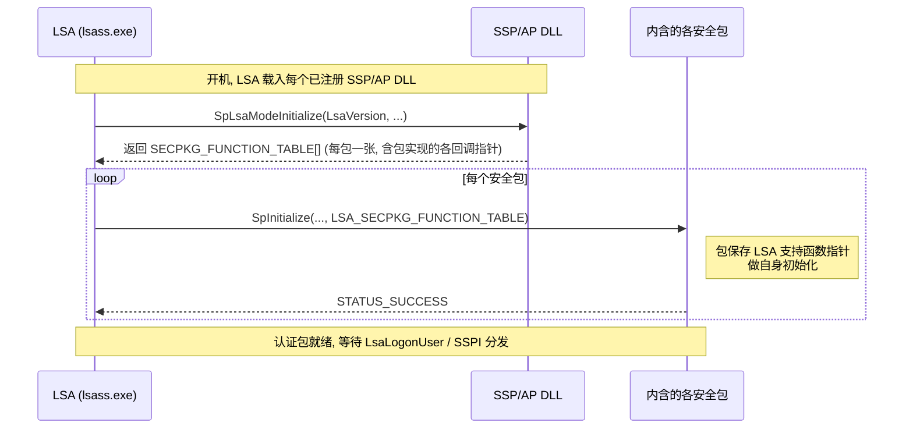

# LSA认证包与SSPI深入

## 概述与定位

> [!abstract] TL;DR
> 03/04 讲的 Credential Provider 只是「收集层」，本篇进入真正的**执行层**：LSA（Local Security Authority，`lsass.exe`）与它加载的**认证包**。Windows 把安全模块统一抽象为 **SSP/AP**（Security Support Provider / Authentication Package），一个 DLL 既能当**认证包**（被 `LsaLogonUser` 用于登录）又能当**安全包**（被 SSPI 用于网络握手）。它有**双态**：在 LSA 进程里叫 **LSA mode**（入口 `SpLsaModeInitialize` 返回一组 `SECPKG_FUNCTION_TABLE`，随后 LSA 逐个调 `SpInitialize` 递入 `LSA_SECPKG_FUNCTION_TABLE`），在客户端/服务端应用进程里叫 **user mode**（入口 `SpUserModeInitialize` 返回 `SECPKG_USER_FUNCTION_TABLE`）。AP 侧的核心回调是 `LsaApInitializePackage`/`LsaApLogonUserEx2`/`LsaApCallPackage`。**调用方**用 `LsaConnectUntrusted`（免特权，仅查询）或 `LsaRegisterLogonProcess`（需 `SeTcbPrivilege`）拿句柄 → `LsaLookupAuthenticationPackage` 取包 ID → `LsaLogonUser`（Interactive/Batch 生成主令牌，Network 生成模拟令牌）。内置包有 MSV1_0、Kerberos、NTLM、Negotiate(SPNEGO)、Schannel、Digest、CloudAP。**SSPI**（用户态统一接口，微软对 GSSAPI 的实现）走 `AcquireCredentialsHandle`→`InitializeSecurityContext`↔`AcceptSecurityContext` 多轮握手→`QueryContextAttributes`→`MakeSignature`/`EncryptMessage` 保护消息。头文件 `Ntsecpkg.h`（SSP/AP）、`Ntsecapi.h`（LSA 登录）、`Sspi.h`（SSPI）。

看懂本篇，就把「凭据缓冲区交给 Winlogon 之后」这段黑盒打开了：LSA 如何加载认证包、`LsaLogonUser` 如何分发到某个包、包如何校验并生成 Token，以及同一套包如何在网络两端完成 SSPI 握手。所有签名以 learn.microsoft.com 官方文档为准。

## 原理与机制

### LSA 是什么、认证包是什么

LSA 是运行在 `lsass.exe` 里的**本地安全权威**，负责本机安全策略、登录会话、审计，以及最核心的——**执行认证**。它自己不实现具体协议，而是把「怎么校验一份凭据」外包给**认证包**。这样设计的好处是**协议可插拔**：Kerberos、NTLM、证书、云账户各是一个包，LSA 只做加载、分发、会话与令牌管理的公共骨架。

两个易混术语要分清（官方 LSA Authentication Model）：

- **认证包（Authentication Package, AP）**：被 `LsaLogonUser`/`LsaCallAuthenticationPackage` 调用，负责**本地登录式认证**——校验凭据、创建登录会话、产出令牌。典型是 **MSV1_0**（本地 SAM / NTLM 网络登录）。
- **安全支持提供程序（Security Support Provider, SSP）**：被 **SSPI** 调用，负责**网络两端建立安全上下文**（握手、签名、加密）。典型是 Kerberos、Schannel。
- 很多包**两者皆是**，故统称 **SSP/AP**（如 Kerberos 既能登录又能网络握手）。

### 双态：LSA mode 与 user mode

同一个 SSP/AP DLL 会被**加载到两处不同进程**，跑两套初始化：

- **LSA mode（`lsass.exe` 内）**：开机时 LSA 把所有注册的 SSP/AP DLL 载入自己地址空间，对每个 DLL 调 **`SpLsaModeInitialize`** 取函数表。敏感操作（读 SAM、生成令牌、持有长期密钥）在此进行——因为 LSA 是高信任进程。
- **user mode（客户端/服务端应用进程内）**：当应用调 SSPI 时，`secur32.dll` 把包载入**应用进程**，调 **`SpUserModeInitialize`** 取用户态函数表。这里做的是**不敏感的活**：格式化协议消息、缓存上下文句柄。真正要动机密时，用户态桩通过 LPC/RPC **回到 LSA mode** 完成。

这种「敏感在 LSA、非敏感在应用」的切分，是 Windows 认证安全模型的基石之一——它把长期密钥牢牢圈在 `lsass.exe`，也正是 Credential Guard（见 06）要进一步隔离的对象。

### LSA mode 初始化两步握手



`SpLsaModeInitialize(LsaVersion, PackageVersion, ppTables, pcTables)`：`ppTables` 指向一个 `SECPKG_FUNCTION_TABLE` 数组，**DLL 里有几个包就返回几张表**，每张表是「该包实现的回调函数指针集合」。随后 LSA 对每个包调 `SpInitialize`，把 **`LSA_SECPKG_FUNCTION_TABLE`**（LSA 提供给包**反向调用**的支持函数：创建令牌、分配 LSA 堆、审计等）递给包保存。至此方向明确：`SECPKG_FUNCTION_TABLE` = 包实现、LSA 来调；`LSA_SECPKG_FUNCTION_TABLE` = LSA 实现、包来调。

## 编写SSP/AP与SSPI握手详解

### 写一个 SSP/AP：必实现的回调

在 `SECPKG_FUNCTION_TABLE` 里，一个自定义 SSP/AP 至少要挂上：

- **`SpGetInfo`**——报告包名、能力、`SecPkgInfo`（当 SSPI 侧调 `QuerySecurityPackageInfo` 时被触发）。
- **`SpInitialize`**——如上，接住 `LSA_SECPKG_FUNCTION_TABLE`，做初始化。
- **`SpAcceptCredentials`**——**函数名固定**（不像其它可自取名）。当有登录发生、LSA 向各包广播「这份主凭据你要不要收」时被调；包据此保存凭据以便后续服务（如为该会话签发票据）。
- **AP 登录回调**：
  - **`LsaApInitializePackage`**——AP 初始化，向 LSA 注册包名。
  - **`LsaApLogonUserEx2`**——**AP 的登录心脏**。`LsaLogonUser` 分发到本包时调它：解析认证信息缓冲区 → 校验凭据（对 SAM/AD/自有存储）→ 通过 `LSA_SECPKG_FUNCTION_TABLE` 里的支持函数**创建登录会话与令牌**、回填主凭据（`SECPKG_PRIMARY_CRED`）与补充凭据（supplemental credentials，供其它包做 SSO）。
  - **`LsaApCallPackage`**——响应 `LsaCallAuthenticationPackage` 的包私有请求（查询/管理服务，不产生登录）。
  - **`LsaApLogonTerminated`**——登录会话结束时清理。
- **SSPI 上下文回调**（当包也做网络握手）：`SpAcquireCredentialsHandle`、`SpInitLsaModeContext`、`SpAcceptLsaModeContext`、`SpDeleteContext` 等——它们是 SSPI 用户态函数在 LSA mode 的落地。

### 注册与加载

包必须先**注册**才会被 LSA 载入。两条途径：

- **静态**（重启生效）：写注册表 `HKLM\SYSTEM\CurrentControlSet\Control\Lsa`：`Security Packages`（REG_MULTI_SZ，用于 SSPI 安全包）与 `Authentication Packages`（用于 `LsaLogonUser` 认证包）两个值里追加你的 DLL 名（不含扩展名）。
- **动态**（免重启）：调 **`AddSecurityPackage`** 在运行中加载一个安全包（对应 `DeleteSecurityPackage` 卸载）。

DLL 需导出 `SpLsaModeInitialize` 与（若有用户态部分）`SpUserModeInitialize`。放置目录、签名、以及 LSA 保护（PPL/RunAsPPL）都会影响能否被加载——PPL 环境下 LSA 只加载微软签名的包。

### 调用方视角：LsaLogonUser 全流程

```mermaid
sequenceDiagram
    participant App as 登录应用 (如 Winlogon)
    participant LSA as LSA
    participant AP as 认证包 (MSV1_0 / Kerberos)
    participant Store as SAM / AD / TPM
    App->>LSA: LsaRegisterLogonProcess (需 SeTcbPrivilege) 或 LsaConnectUntrusted
    LSA-->>App: LsaHandle
    App->>LSA: LsaLookupAuthenticationPackage(名字 = Negotiate/MSV1_0)
    LSA-->>App: ulAuthenticationPackage
    App->>LSA: LsaLogonUser(句柄, OriginName, LogonType, AP, 认证信息缓冲区, ...)
    LSA->>AP: 分发到该包 LsaApLogonUserEx2(认证信息)
    AP->>Store: 校验凭据
    Store-->>AP: 通过 / 失败
    alt 认证通过
        AP-->>LSA: 创建登录会话 + 主凭据 + 令牌
        LSA-->>App: STATUS_SUCCESS + Token + LogonId (Interactive/Batch=主令牌; Network=模拟令牌)
    else 失败
        AP-->>LSA: STATUS_LOGON_FAILURE + SubStatus
        LSA-->>App: 错误码 (SubStatus 细分原因)
    end
```

要点：`LsaConnectUntrusted` 拿的是**非可信句柄**，只够 `LsaLookupAuthenticationPackage`/`LsaCallAuthenticationPackage` 这类查询；要真正 `LsaLogonUser` 登录别人、指定 `LocalGroups`、或用子认证包，需 **`LsaRegisterLogonProcess`**（校验调用者持有 `SeTcbPrivilege`）。`LogonType`（`SECURITY_LOGON_TYPE`）决定令牌形态：`Interactive`/`Batch`→**主令牌**（可代表新用户建进程），`Network`→**模拟令牌**（服务端代客户端行事）。认证信息缓冲区的格式由包定（MSV1_0/Kerberos 用 `KERB_INTERACTIVE_LOGON` 等，正是 04 篇打包的产物）。

### 登录会话、令牌与补充凭据

`LsaApLogonUserEx2` 校验通过后要干三件事，值得拆开看。其一是**建立登录会话**：LSA 为本次登录分配一个 `LUID`（登录标识），登录会话是「令牌—凭据—票据」挂靠的容器，登出时随会话统一回收。其二是**产出令牌**：包通过 `LSA_SECPKG_FUNCTION_TABLE` 里的支持函数，把用户 SID、所属组、特权组装成访问令牌，`Interactive`/`Batch` 得主令牌、`Network` 得模拟令牌。其三是**回填凭据**：`SECPKG_PRIMARY_CRED` 装主凭据，而**补充凭据（supplemental credentials）** 则是实现单点登录的关键——交互式登录时 MSV1_0 会把 NT 哈希作为补充凭据留存于会话，之后 Kerberos 或 NTLM 做网络认证时无需再问用户口令即可代表用户握手，这正是 Windows「登录一次、网络畅通」的 SSO 底层机制。

**NTLM 与 Kerberos 的消息节奏也截然不同**：NTLM 是三段式挑战-响应（协商→挑战→响应），无票据、无双向认证，且响应里带的是口令派生值，故易受中继与 pass-the-hash；Kerberos 是票据式，客户端先向 KDC（域控上的密钥分发中心）换取 TGT、再用 TGT 换服务票据，天然支持双向认证与委派。Negotiate 在两者间协商时，正是看「能否联系到 KDC、目标服务有无注册 SPN」来决定走哪条——这也解释了为什么脱域、用 IP 直连、或跨非信任边界时，握手常悄悄回退到 NTLM。理解这层，才能在抓包或审计里看懂「同一个 Negotiate 调用为何有时是 Kerberos、有时是 NTLM」。

### 内置包与 Negotiate 的选择逻辑

- **MSV1_0**：本地账户（对 SAM）与 NTLM 网络认证的基础 AP。
- **Kerberos**：域环境首选，票据式、支持双向认证与委派。
- **NTLM**：挑战-响应，Kerberos 不可用时的回退。
- **Negotiate（SPNEGO）**：**元包**，不自己认证，而是在 Kerberos 与 NTLM 间**协商**——**优先 Kerberos，条件不满足（无域、无 SPN、跨非信任边界）回退 NTLM**。写通用代码时**用 Negotiate 而非硬编码某包**，让系统择优。
- **Schannel**：TLS/SSL，证书式，用于 HTTPS/LDAPS 等。
- **Digest**、**CloudAP**（Azure AD/Microsoft 账户云认证）等各司其职。

### SSPI：网络两端的握手

SSPI 是**用户态统一门面**（微软对 IETF GSSAPI 的实现），让应用无需绑定具体协议就能做认证与消息保护。一次典型握手：

1. **两端各取凭据句柄**：`AcquireCredentialsHandle`（客户端要 outbound、服务端要 inbound；同一句柄不能两用，既做客户端又做服务端的程序至少取两个）。注意官方提示：这**不是「登录网络」也不收集凭据**，只是拿到既有凭据的句柄。
2. **多轮 token 交换**：客户端 `InitializeSecurityContext` 产出一个 token 发给服务端；服务端 `AcceptSecurityContext` 消费并可能产出回应 token 发回；只要返回 **`SEC_I_CONTINUE_NEEDED`** 就继续来回，直到两端都得 **`SEC_E_OK`**——上下文建立完成。Kerberos 通常一到两轮，NTLM 是三步握手。
3. **请求属性**：`InitializeSecurityContext` 的 `ISC_REQ_*` 声明需求——`ISC_REQ_INTEGRITY`（要签名）、`ISC_REQ_CONFIDENTIALITY`（要加密）、`ISC_REQ_MUTUAL_AUTH`（双向认证）、`ISC_REQ_REPLAY_DETECT`/`ISC_REQ_SEQUENCE_DETECT`（抗重放/乱序）、`ISC_REQ_STREAM`（流式）。
4. **查询与验证**：`QueryContextAttributes`（如取 `SecPkgContext_Sizes` 得签名块大小、取 `SecPkgContext_NativeNames` 验对端身份）。**警告**：`ISC_REQ_MUTUAL_AUTH` 只表示「策略被满足」，要确认真做了双向认证须再 `QueryContextAttributes` 核对。
5. **消息保护**：上下文建好后，`MakeSignature`/`VerifySignature` 做完整性（防篡改、带序号防重放/丢失），`EncryptMessage`/`DecryptMessage` 做机密性。若 `SecPkgContext_Sizes` 的 `cbMaxSignature` 为 0，说明包不支持签名。

SSPI 与 LSA 认证包是**同一批包的两副面孔**：`LsaLogonUser` 走 AP 登录路径，SSPI 走 SSP 握手路径，底层都是那组注册在 LSA 的 SSP/AP。

## 工具视角与实战

**样例与 SDK**：Windows SDK 与 Windows-classic-samples 里有 SSP/AP 与 SSPI 客户端/服务端示例（`Security/SSPI` 等），演示函数表填充、`InitializeSecurityContext`/`AcceptSecurityContext` 的握手循环、以及 `MakeSignature`/`EncryptMessage` 用法。写自定义包**务必从样例骨架起**——函数表漏挂一个必需回调，LSA 加载即失败或运行时崩在 `lsass.exe`（后果是整机登录不可用）。

**枚举与观察**：`AcquireCredentialsHandle` 前可用 `EnumerateSecurityPackages` 列出本机已注册的安全包及能力位（是否支持 `SECPKG_FLAG_INTEGRITY`/`SECPKG_FLAG_PRIVACY` 等），据此选包。命令行侧，`klist` 看 Kerberos 票据、`whoami /logonid` 与 `LsaEnumerateLogonSessions` 看登录会话，帮助把「哪个包、哪次登录、什么令牌」对上号。

**调试的高危性**：自定义 SSP/AP 跑在 `lsass.exe`，且常处于 PPL 保护，普通调试器附加不了。实战一律**在可回滚快照的虚拟机 + 内核调试器（WinDbg 双机）**里迭代；写坏了 `lsass.exe` 会导致系统在几十秒内因关键进程终止而重启，切勿在真机试。

## 安全性与正确使用

- **`lsass.exe` 内代码即最高信任**：SSP/AP 的 LSA mode 代码与操作系统同权。任何缓冲区越界、未校验的认证信息、整数溢出都可能被攻击者用来在 LSA 里执行代码，等于攻破整机安全边界。**严格校验一切外来缓冲区长度与偏移**（尤其 04 篇那种「偏移式」序列化输入），拒绝畸形输入。
- **句柄特权最小化**：能用 `LsaConnectUntrusted` 就别用 `LsaRegisterLogonProcess`——后者要 `SeTcbPrivilege`（本机可信计算基），把它限定给确需替他人登录的系统组件。查询类操作用非可信句柄足矣。
- **优先 Negotiate、优先 Kerberos**：应用层认证**别硬编码 NTLM**。NTLM 无双向认证、易受中继（relay）与 pass-the-hash，能用 Kerberos 就用 Kerberos，用 Negotiate 让系统自动择优并在环境允许时避开 NTLM。
- **消息保护要显式请求**：SSPI 建上下文时若不置 `ISC_REQ_INTEGRITY`/`ISC_REQ_CONFIDENTIALITY`，`MakeSignature`/`EncryptMessage` 可能不可用或 QoP 未含完整性——按需显式声明，并用 `QueryContextAttributes` 核实协商结果（尤其双向认证）。
- **机密处理与抹除**：包持有的口令、密钥、票据用完即 `SecureZeroMemory`；LSA 支持函数分配的缓冲区按约定用对应 LSA 例程释放。凭据不落盘、不进日志。

## 小结

LSA 是 Windows 认证的**执行内核**，通过可插拔的 **SSP/AP** 支撑多协议：一个包在 `lsass.exe` 里以 **LSA mode**（`SpLsaModeInitialize`→`SpInitialize`，实现 `SECPKG_FUNCTION_TABLE`、反用 `LSA_SECPKG_FUNCTION_TABLE`）承载敏感操作，在应用进程里以 **user mode**（`SpUserModeInitialize`）承载非敏感的消息格式化。**AP 路径**由 `LsaLogonUser` 分发到 `LsaApLogonUserEx2` 完成登录并产出令牌（Interactive/Batch 主令牌、Network 模拟令牌）；**SSP 路径**由 SSPI 的 `AcquireCredentialsHandle`→`InitializeSecurityContext`↔`AcceptSecurityContext` 多轮握手建上下文，再用 `MakeSignature`/`EncryptMessage` 保护消息。内置包里 Negotiate 优先 Kerberos、回退 NTLM 是最常用的选择策略。这条路径运行在最高信任的 `lsass.exe` 中，编码纪律直接等同于系统安全等级——下一篇就看 Windows 如何**存储与保护**这些凭据，以及 Credential Guard 如何把 LSA 的机密进一步隔离到 VTL1。

## 相关阅读

- LSA Authentication Model / LSA Mode Initialization — https://learn.microsoft.com/windows/win32/secauthn/lsa-mode-initialization
- SpLsaModeInitializeFn callback — https://learn.microsoft.com/windows/win32/api/ntsecpkg/nc-ntsecpkg-splsamodeinitializefn
- SECPKG_FUNCTION_TABLE / LSA_SECPKG_FUNCTION_TABLE — https://learn.microsoft.com/windows/win32/api/ntsecpkg/ns-ntsecpkg-secpkg_function_table
- LsaLogonUser function — https://learn.microsoft.com/windows/win32/api/ntsecapi/nf-ntsecapi-lsalogonuser
- SSPI (Security Support Provider Interface) — https://learn.microsoft.com/windows/win32/secauthn/sspi
- AcquireCredentialsHandle / InitializeSecurityContext / AcceptSecurityContext — https://learn.microsoft.com/windows/win32/api/sspi/nf-sspi-initializesecuritycontextw
- 本库：[[04.CredentialProvider编程-序列化事件与安全]]、[[06.Windows凭据存储与保护]]、[[03.CredentialProvider编程-接口与tile枚举]]、[[01.Windows交互式登录架构全景]]、[[00.Windows认证与生物识别编程总览]]
- 对照：[[29.Linux认证与登录编程/00.Linux认证与登录编程总览|Linux 认证(PAM)]]、[[38.Windows内核与驱动逆向/00.Windows内核与驱动逆向总览|Windows 内核逆向]]

---

🏠 [[00.Windows认证与生物识别编程总览]] ｜ 上一篇 [[04.CredentialProvider编程-序列化事件与安全]] ｜ 下一篇 [[06.Windows凭据存储与保护]] ➡️
