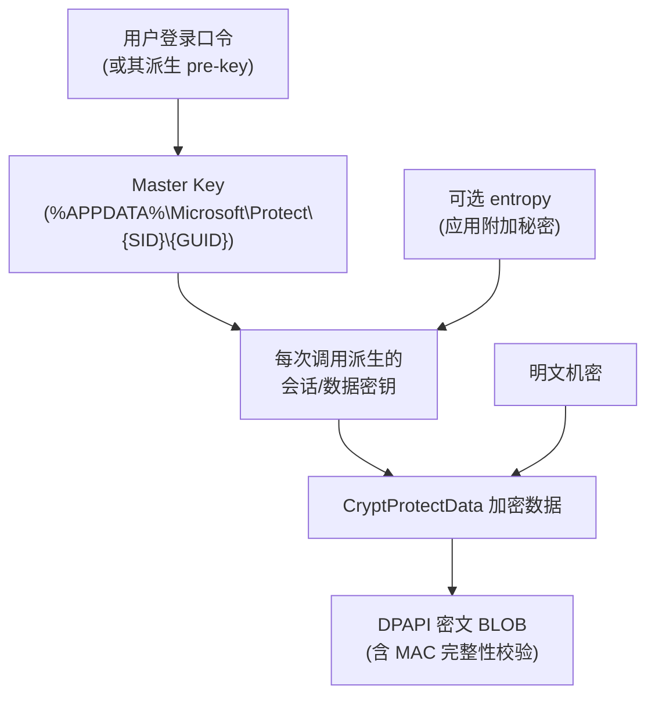
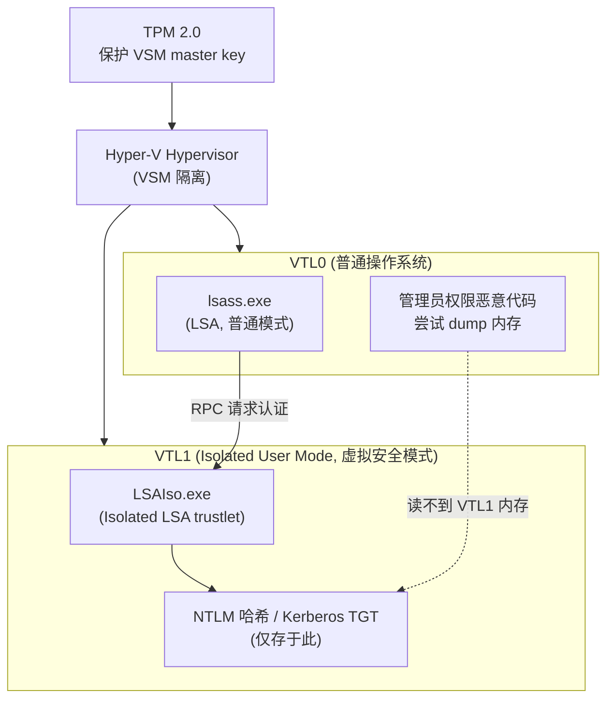

# Windows凭据存储与保护

## 概述与定位

> [!abstract] TL;DR
> 认证执行清楚了（05），凭据本身**存在哪、怎么保护**是本篇主题。Windows 有一条从「应用可见」到「硬件隔离」的存储保护谱系：**Credential Manager / Windows Vault**（`CredWrite`/`CredRead`/`CredEnumerate`/`CredDelete` + `CREDENTIAL` 结构，`CRED_TYPE_*` 分 Generic/Domain，`CRED_PERSIST_*` 定持久化范围）是应用存取用户凭据的入口；底下由 **DPAPI**（`CryptProtectData`/`CryptUnprotectData`，用户/机器范围、可选 entropy）撑起「用登录口令派生 master key、再逐数据加密」的保护链；**DPAPI-NG**（`NCryptProtectSecret`/`NCryptUnprotectSecret` + 保护描述符）把保护对象扩展到「一组主体/跨机器」；系统与服务的机密走 **LSA secrets**（`LsaStorePrivateData`/`LsaRetrievePrivateData`，域机器账户口令存于 `$MACHINE.ACC`）；本地账户的 **NTLM 哈希在 SAM**、由 SYSKEY/bootkey 加密（攻防细节留给 11）。顶层是 **Credential Guard**：用 VBS/虚拟化把一个 **Isolated LSA（`LSAIso.exe`，跑在 VTL1）** 从 `lsass.exe`（VTL0）里切出去，NTLM 哈希与 Kerberos TGT 只存在于 VTL1，**即便 dump 了 LSASS 也读不到**——前提是 UEFI + Secure Boot + VBS。头文件 `wincred.h`/`dpapi.h`/`ncryptprotect.h`/`ntsecapi.h`。

理解本篇，就把「凭据的一生」补全了：收集（03/04）→ 执行（05）→ **存储与保护（06）**。也为 07（Windows Hello 把密钥搬进 TPM）与 11（凭据窃取的攻防）打底。所有 API 以 learn.microsoft.com 官方文档为准。

## 原理与机制

### 三个层次的凭据

Windows 里「凭据」不是一种东西，按存储位置与保护强度分三层，务必先建立坐标系：

- **应用/用户凭据**：用户在浏览器、RDP、网络共享里保存的账号口令，存于 **Credential Manager（Windows Vault）**，底层用 DPAPI 按用户加密。应用可通过 `Cred*` API 读写自己的那部分。
- **系统/机器机密**：服务账户口令、域机器账户口令、缓存的域凭据等，存于 **LSA secrets**（注册表 `HKLM\SECURITY` 下，普通进程无权访问），由系统在启动/登录时使用。
- **登录派生机密**：登录后驻留 `lsass.exe` 的 **NTLM 哈希、Kerberos 票据（TGT/服务票据）**——它们是 pass-the-hash/pass-the-ticket 的目标，也正是 **Credential Guard** 要隔离的对象。

### DPAPI：所有软保护的地基

Credential Manager、浏览器口令、许多应用的「记住密码」底下都是 **DPAPI（Data Protection API）**。它的价值在于**替应用免除了「密钥从哪来、存哪」的难题**：应用只管调 `CryptProtectData` 加密、`CryptUnprotectData` 解密，密钥由系统用**用户登录口令**派生并管理。

```cpp
BOOL CryptProtectData(
  DATA_BLOB *pDataIn,        // 明文
  LPCWSTR    szDataDescr,    // 可读描述(可选)
  DATA_BLOB *pOptionalEntropy, // 附加熵(可选, 解密须提供同一份)
  PVOID      pvReserved,     // 必须 NULL
  CRYPTPROTECT_PROMPTSTRUCT *pPromptStruct, // 可 NULL
  DWORD      dwFlags,        // CRYPTPROTECT_LOCAL_MACHINE / UI_FORBIDDEN / AUDIT
  DATA_BLOB *pDataOut);      // 密文(用完 LocalFree(pDataOut.pbData))
```

**保护链**（user 范围）自上而下：



- **master key** 存于用户配置文件（`%APPDATA%\Microsoft\Protect\{SID}\`），本身**被从用户口令派生的密钥加密**——这就是为什么「换了登录口令、或在别的机器、或没加载用户配置文件（如某些模拟场景）」会解不出：master key 绑定用户口令与本机。
- **user vs machine 范围**：默认 user 范围（只有同一用户能解）；置 `CRYPTPROTECT_LOCAL_MACHINE` 变 machine 范围——**本机任何用户都能解**（用机器密钥，不依赖用户配置文件），适合服务端且信任机器上所有账户的场景，但**降低了隔离**，官方明确提醒谨慎使用。
- **optional entropy**：应用可传一段附加秘密作「第二因子」，加密解密必须用同一份——用于把「即便同一用户的另一应用」也挡在解密之外。
- **完整性**：DPAPI 密文含 MAC，解密时校验是否被篡改（但官方提示不要依赖具体错误码判定篡改，应用层可再加校验）。用完机密务必 `SecureZeroMemory`，输出 BLOB 的 `pbData` 用 `LocalFree`。

### DPAPI-NG：保护给「一组人」

经典 DPAPI 保护对象是「本用户/本机」。**DPAPI-NG（CNG DPAPI）** 用 **`NCryptProtectSecret`/`NCryptUnprotectSecret`** 把保护对象泛化为**保护描述符（protection descriptor）**——一段规则字符串，可表达「保护给某个 SID、某个 AD 安全组、某张证书、本地用户或机器」等。于是一份数据可以**被一组主体、甚至跨机器**解密（借 AD 分发密钥），适合分布式服务、组共享机密。它是 DPAPI 的现代扩展，头文件 `ncryptprotect.h`。

### LSA secrets 与机器账户

系统级机密走 **LSA secrets**：`LsaStorePrivateData`/`LsaRetrievePrivateData`（`ntsecapi.h`）读写 `HKLM\SECURITY\Policy\Secrets` 下的命名秘密（普通进程无权直接读）。用途包括**服务账户口令**（服务以特定账户运行时需要）、**缓存域凭据**、以及**域机器账户口令**——后者对应名为 **`$MACHINE.ACC`** 的秘密，是域成员机与域控之间信任关系的凭据，系统定期自动轮换。这些秘密同样由本机密钥保护，读取需要高权限，是攻击者横向移动时的高价值目标。

### LSA secrets 的命名与缓存域凭据

LSA secrets 内部按**前缀**区分用途：`L$` 开头是本地秘密（不随域复制）、`M$` 是机器相关、`_SC_<服务名>` 存以特定账户运行的服务口令、`$MACHINE.ACC` 存域机器账户口令。另一类高价值机密是**缓存域凭据**（cached domain logon，俗称 DCC2 / MSCache v2）：域成员机为支持「域控不可达时仍能用域账户本地登录」，会把域口令的**二次派生验证子**缓存在注册表 `HKLM\SECURITY\Cache` 下——注意它不是明文、也不是可直接 pass 的 NT 哈希，而是经 PBKDF2 加盐迭代后的产物，**只能用于本地离线验证、无法拿去做网络认证**。即便如此，它仍是离线字典爆破的目标，因此缓存条数（组策略 `CachedLogonsCount`）应按最小必要收敛，高安全环境甚至置零。这些机密同样受本机密钥保护、需高权限才能读取，具体的离线抽取与利用手法见 11，本篇只标注「它在哪、被什么护着」。

### SAM 与 NTLM 哈希（概述）

本地账户的凭据以 **NTLM 哈希**形式存在 **SAM**（Security Account Manager，注册表 `HKLM\SAM`）。SAM 里的哈希再被 **SYSKEY / bootkey**（从 SYSTEM 配置单元散布的引导密钥）加密。登录时 MSV1_0 用它校验（见 05）。**本篇只做定位**——把「如何离线抽取 SAM、SYSKEY 如何合成、pass-the-hash 如何利用」这些攻防细节留到 [[11.Windows认证安全与对抗]]，本篇立场是「知道它在哪、被什么保护」，不展开提取步骤。

## 存储层与保护链详解

### Credential Manager 编程

应用存取用户凭据的正式入口是 `Cred*` 系列（`wincred.h`，`Advapi32.dll`）。核心结构：

```cpp
typedef struct _CREDENTIALW {
  DWORD                  Flags;              // CRED_FLAGS_*
  DWORD                  Type;               // CRED_TYPE_*
  LPWSTR                 TargetName;         // 目标标识(如 "server" 或 "Company_App_xxx")
  LPWSTR                 Comment;
  FILETIME               LastWritten;
  DWORD                  CredentialBlobSize;
  LPBYTE                 CredentialBlob;     // 机密(口令等)
  DWORD                  Persist;            // CRED_PERSIST_*
  DWORD                  AttributeCount;
  PCREDENTIAL_ATTRIBUTEW Attributes;
  LPWSTR                 TargetAlias;
  LPWSTR                 UserName;
} CREDENTIALW;
```

- **`CredWrite(PCREDENTIAL, Flags)`**：以 `TargetName`+`Type` 为键写入/覆盖一条凭据，绑定当前令牌的登录会话。
- **`CredRead(TargetName, Type, 0, &pCred)`**：按键读回（返回的缓冲区用 `CredFree` 释放）。
- **`CredEnumerate(Filter, Flags, &count, &pCreds)`**：枚举（可按前缀过滤）。
- **`CredDelete(TargetName, Type, 0)`**：删除。

**`CRED_TYPE_*` 分两大类**（决定谁能读 blob）：

- **`CRED_TYPE_GENERIC`**：**应用自定义**凭据，`CredentialBlob` 格式由应用定，**应用自己能读**。存「我这个 app 记住的登录」用它，`TargetName` 建议加公司前缀避免撞名。
- **`CRED_TYPE_DOMAIN_PASSWORD` / `CRED_TYPE_DOMAIN_CERTIFICATE`**：**域凭据**，`CredentialBlob`（明文口令 / 证书 PIN）**只有认证包能读、应用读不到**——系统在做域认证时直接取用，避免明文经手应用。`CRED_TYPE_DOMAIN_EXTENDED` 要求 `TargetName` 带命名空间前缀。

**`CRED_PERSIST_*` 定生命周期**：`CRED_PERSIST_SESSION`(=1，仅本登录会话，登出即失)、`CRED_PERSIST_LOCAL_MACHINE`(=2，本机所有后续会话可见、不漫游)、`CRED_PERSIST_ENTERPRISE`(=3，随用户漫游到其它机器，无漫游配置时退化为本地)。这些凭据落地时，其 blob 由 DPAPI 按用户加密——所以「Credential Manager 里的口令」本质是「DPAPI 密文 + 元数据」。

### Credential Guard：把机密搬进 VTL1

即便有 DPAPI，登录后 `lsass.exe` 进程内存里仍**驻留着 NTLM 哈希与 Kerberos TGT**（认证要用）。传统上管理员权限的恶意代码 dump `lsass.exe` 就能捞走它们，实施 pass-the-hash / pass-the-ticket。**Credential Guard** 用**虚拟化安全（VBS）**从根上堵死这条路：



机制要点（官方 How Credential Guard works）：

- 开启后，`lsass.exe`（VTL0）不再自己持有那些机密，而是通过 **RPC** 与一个**隔离 LSA 进程 `LSAIso.exe`**（也写作 LSAiso，一个跑在 **VTL1 / Isolated User Mode** 的 **trustlet**）通信。NTLM 哈希、TGT 只存在于 VTL1，**由 hypervisor 用 VSM（Virtual Secure Mode）隔离，VTL0 的操作系统（含管理员权限恶意代码）读不到**。
- `LSAIso.exe` **不加载任何设备驱动**，只跑一小撮安全必需、且被 VBS 信任证书签名的二进制，签名在进入保护环境前校验。
- 需持久化的 VSM 数据由 **VSM master key** 保护，该 key 在支持的硬件上**由 TPM 2.0 守护**——但 Credential Guard 通常**不持久化** NTLM/TGT（重启即失、用户登录时刷新），故不强依赖 TPM 存这些。
- **前提**：64 位、UEFI、**Secure Boot**、VBS/Hyper-V、SLAT；企业版/教育版。Win11 22H2 起在满足要求的设备上默认启用。

**保护边界与限制**（务必清楚它不保护什么）：

- **不保护 SAM 与 AD 数据库**：本地账户、域控上的目录数据库不在其列。
- **不保护「临时输入」的 NTLM 凭据**：用户被提示后现输入用于 NTLM 认证的口令，仍会经 LSASS 内存，可被读、可被键盘记录器截获。开启 CG 后 NTLMv1、MS-CHAPv2、Digest、CredSSP **无法使用已登录凭据做 SSO**。
- **不保护 Windows Vault 里的凭据、服务票据（只护 TGT）、也挡不住键盘记录器与物理攻击**；也不阻止攻击者用已有权限**冒用**某凭据登录会话。
- **与 LSA 保护（PPL / RunAsPPL）互补**：LSA protection 是较轻量的进程级保护（阻止非可信代码注入与内存 dump，Win11 默认开），CG 是更强的虚拟化隔离，二者可并存。**与 Windows Hello 互补**：Hello 把认证密钥放进 TPM（见 07），CG 把派生机密放进 VTL1，一个管「登录用什么」、一个管「登录后机密存哪」。

## 工具视角与实战

**Credential Manager 观测**：控制面板「凭据管理器」或命令行 `cmdkey /list` 看已存的 Web/Windows 凭据；`rundll32 keymgr.dll,KRShowKeyMgr` 开管理界面。编程侧写个小程序 `CredEnumerate` + `CredRead` 就能列出自己 app 的 `CRED_TYPE_GENERIC` 凭据（域凭据 blob 读不到属预期）。

**DPAPI 自测**：用 .NET 的 `ProtectedData.Protect/Unprotect`（`DataProtectionScope.CurrentUser/LocalMachine`，底层就是 DPAPI）或 Win32 `CryptProtectData` 加密一段串，换个用户/换台机器再解，直观感受「绑定用户口令与本机」的边界；加一段 entropy 再试，验证「少了 entropy 解不出」。

**验证 Credential Guard 是否生效**：`msinfo32` 的「系统摘要」看「基于虚拟化的安全性…已运行的服务」是否含 **Credential Guard**；任务管理器/进程列表里出现 **`LSAIso.exe`** 即已开启。事件查看器 `System` 日志的 WinInit 事件可确认 LSA 是否以受保护进程启动。这些是判断「本机机密是否已进 VTL1」的最快信号。

## 安全性与正确使用

- **别把机密当明文攒着，交给 DPAPI**：需要「记住口令」时用 `CryptProtectData`/Credential Manager，而不是自己写文件或注册表存明文。DPAPI 把密钥管理这件最容易出错的事交给了系统。
- **user 范围优先，慎用 machine 范围**：`CRYPTPROTECT_LOCAL_MACHINE` 让本机所有账户可解，等于放弃用户间隔离——仅在服务端且信任机器上全部账户时用，并配合 entropy 缩小可解范围。
- **entropy 当第二因子**：给 DPAPI 传应用专属 entropy，防止同一用户的其它程序解你的密文；但 entropy 本身别硬编码在明处，否则形同虚设。
- **域凭据存 Domain 类型，别塞 Generic**：域口令用 `CRED_TYPE_DOMAIN_PASSWORD`，让 blob 只被认证包读取、不经应用手；用 Generic 存域口令等于把明文暴露给自己进程。
- **Credential Guard 不是银弹**：它挡 pass-the-hash/pass-the-ticket，但**挡不住键盘记录、物理攻击、临时输入的 NTLM 凭据、以及用已有权限冒用会话**。高价值账户仍需专机、最小权限、禁用弱协议（NTLMv1/Digest/CredSSP）等纵深防御。对 SAM/AD 数据库要另行保护。
- **`SecureZeroMemory` + `LocalFree`/`CredFree`**：解密得到的明文、`Cred*`/DPAPI 返回的缓冲区，用完立刻抹除并按对应例程释放，别让机密在堆上过夜。

## 小结

Windows 的凭据保护是一条**从软到硬、从个体到隔离**的谱系：**Credential Manager/Windows Vault**（`CredWrite`/`CredRead`，`CRED_TYPE_*` 分 Generic/Domain、`CRED_PERSIST_*` 定范围）是应用入口，其 blob 由 **DPAPI**（`CryptProtectData`/`CryptUnprotectData`，用户口令→master key→数据密钥的保护链，user/machine 范围 + entropy）落地；**DPAPI-NG**（`NCryptProtectSecret` + 保护描述符）把保护对象扩展到一组主体与跨机器；系统机密走 **LSA secrets**（`LsaStorePrivateData`、`$MACHINE.ACC`）；本地 NTLM 哈希在 **SAM**、由 SYSKEY 加密（攻防见 11）。最顶层，**Credential Guard** 用 **VBS** 把 NTLM 哈希与 Kerberos TGT 隔离进 **VTL1 的 `LSAIso.exe`**，令 LSASS dump 失效——但它有明确边界（不护 SAM/AD、不护临时 NTLM 输入、不挡物理/键盘记录），须与 LSA 保护、Windows Hello、最小权限组成纵深防御。下一篇转向让口令**彻底消失**的方向——Windows Hello 与无密码认证。

## 相关阅读

- CredWrite / CREDENTIAL structure — https://learn.microsoft.com/windows/win32/api/wincred/nf-wincred-credwritew
- CryptProtectData / CryptUnprotectData (DPAPI) — https://learn.microsoft.com/windows/win32/api/dpapi/nf-dpapi-cryptprotectdata
- NCryptProtectSecret (DPAPI-NG) — https://learn.microsoft.com/windows/win32/api/ncryptprotect/nf-ncryptprotect-ncryptprotectsecret
- LsaStorePrivateData — https://learn.microsoft.com/windows/win32/api/ntsecapi/nf-ntsecapi-lsastoreprivatedata
- How Credential Guard works — https://learn.microsoft.com/windows/security/identity-protection/credential-guard/how-it-works
- 本库：[[05.LSA认证包与SSPI深入]]、[[04.CredentialProvider编程-序列化事件与安全]]、[[07.WindowsHello与HelloforBusiness架构]]、[[11.Windows认证安全与对抗]]、[[00.Windows认证与生物识别编程总览]]
- 对照：[[38.Windows内核与驱动逆向/00.Windows内核与驱动逆向总览|Windows 内核逆向]]、[[37.密码学/00.密码学总览|密码学]]、[[29.Linux认证与登录编程/00.Linux认证与登录编程总览|Linux 认证(PAM)]]

---

🏠 [[00.Windows认证与生物识别编程总览]] ｜ 上一篇 [[05.LSA认证包与SSPI深入]] ｜ 下一篇 [[07.WindowsHello与HelloforBusiness架构]] ➡️
