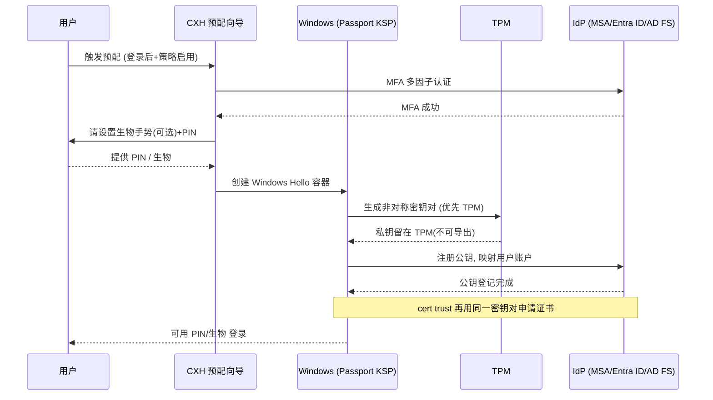
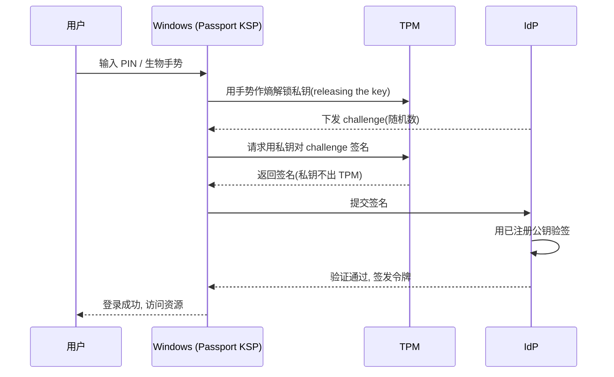

# WindowsHello与HelloforBusiness架构

## 概述与定位

> [!abstract] TL;DR
> Windows Hello 的核心不是"用指纹/人脸/PIN 代替打字"，而是**用一对设备绑定的非对称密钥对（asymmetric key pair）替代口令这种共享秘密（shared secret）**。注册时设备生成公私钥对，**私钥优先落进 TPM**（无 TPM 才软件保护）、永不导出、也永不上网；**公钥注册到身份提供方 IdP**（个人版是 MSA，企业版是 Microsoft Entra ID / Active Directory）。认证时 IdP 下发 challenge，用户用**生物手势或 PIN 在本地解锁私钥**（"releasing the key"）、由私钥对 challenge 签名，IdP 用公钥验签——**PIN 和生物数据只是本地解锁私钥的"用户熵（user-provided entropy）"，从不离开设备**。正因如此，**PIN 是强凭据而非弱口令**：它绑定单台设备、由 TPM 保护、享有 TPM 抗暴力锁定，泄露一台设备的 PIN 对攻击者拿其他设备毫无用处。**Windows Hello（消费者/MSA）与 Windows Hello for Business（企业，前身 Microsoft Passport，凭据称 NGC）**共享同一密钥模型，区别在于后者接入企业 IdP 并有 **key trust / certificate trust** 两种信任部署。密钥无共享秘密、challenge 一次性签名、凭据绑定设备，天然**抗钓鱼、抗重放、抗服务端库泄露**。

本篇是本系列"无密码"三部曲的第一篇，聚焦**架构与密钥模型**——把"为什么 Hello 抗钓鱼""PIN 凭什么比密码安全""企业版多出来的 key/cert trust 是什么"讲透。下一篇（08）转到**可编程的协议与 API**（WebAuthn/FIDO2/passkey、`webauthn.h`），本篇则先建立"设备绑定非对称密钥 + TPM + IdP 注册公钥"这条主干。所有机制均以 learn.microsoft.com 的 Windows Hello for Business 文档为准。

## 原理与机制

### 口令的原罪：共享秘密

传统口令认证是一种**共享秘密（shared secret）**模型：同一个密码，用户记在脑子里、服务器存一份（哪怕是哈希）。这一"两边都有"的结构决定了它的四类致命弱点——**服务端库泄露**（server breach，一次拖库泄露千万口令）、**钓鱼**（phishing，用户被骗把明文密码输进假站点）、**重放**（replay，截获的口令可反复使用）、**复用与暴力破解**（一处泄露处处沦陷、弱口令可枚举）。这些弱点的根源是同一个：**认证凭据是一段可被复制、可被转移、两端共享的静态秘密**。只要秘密会"离开用户设备到达服务器"，上述攻击面就无法根除。Windows Hello 的整套设计，就是要**消灭共享秘密**。

### 非对称密钥对：把秘密留在设备里

Windows Hello 凭据基于**非对称密钥对或证书**，且**绑定到具体设备**。注册（provisioning）时，设备为用户生成一对公私钥：

- **私钥（private key）**：**优先在 TPM 内生成并由 TPM 保护**，标记为**不可导出（can't be exported）**，永远不离开这台设备、永远不发给 IdP。
- **公钥（public key）**：注册（register）到 IdP，与用户账户绑定映射。个人 MSA / 企业 Entra ID 由 **Device Registration Service** 把公钥写入用户对象；本地 AD 场景由 **AD FS** 把公钥写入 Active Directory。

认证时的关键动作是：**用户输入 PIN 或做生物手势 → Windows 用私钥对"要发给 IdP 的数据"做密码学签名 → IdP 用先前注册的公钥验签**。官方原文强调两点——**"PIN 或凭据的私钥部分从不发给 IdP，PIN 也不存储在设备上"**；**"PIN 与生物手势是执行私钥操作时用户提供的熵（user-provided entropy）"**。也就是说，网络上传输的只有"用私钥签过名的一次性数据"，攻击者截获也无法复用（重放），假站点也骗不到可用的东西（钓鱼），服务端只存公钥、拖库拖不出能登录的秘密（server breach）。这三重"抗性"不是补丁，而是**非对称 + 设备绑定 + 一次性签名**的结构性结果。

### PIN 的真相：它为什么是强凭据

初学者最大的误解是"PIN 就是短一点的密码，所以更弱"。恰恰相反。官方明确把 PIN 归为**强凭据**，理由是三条结构性差异：

1. **本地性**：PIN**只在本机有效、从不上网**。它的作用仅仅是**在本地解锁 TPM 里的私钥**（"releasing the key"，像先从口袋里掏出钥匙才能开门），而非作为凭据发往服务器。所以拖库拖不到 PIN，钓鱼也钓不走 PIN——因为它根本不去服务器。
2. **设备绑定**：同一个 PIN "1234" 在你的笔记本和别人的笔记本上解锁的是**完全不同的私钥**。泄露一台设备的 PIN，对攻击者拿到其他设备一文不值；而密码"1234"一旦泄露，处处可用。
3. **TPM 保护与抗暴力**：PIN 解锁走的是 **TPM seal 操作**（以 PIN 作为熵），TPM 自带**抗暴力破解锁定**（连续猜错会锁死硬件），Hello 因此有"内置暴力破解防护"。软件口令没有这层硬件闸门。

所以"something you know"这一因子在 Hello 里换成 PIN 不但没削弱安全，反而因为**本地 + 设备绑定 + TPM**变得比密码更强。生物手势（指纹/人脸）则是把"something you know"进一步替换为"something you are"，二者都只是**本地解锁私钥的熵**，识别与解锁的采集下沉到 **WBF / WinBio 生物子系统**（见 [[09.WBF架构与WinBio客户端API]]），而 Hello 本身作为一种**凭据提供程序**融入 Winlogon 登录界面（见 [[03.CredentialProvider编程-接口与tile枚举]]）。

### 双因子的构成

Windows Hello for Business 是**双因子认证**：把"设备特定凭据（something you have，即受设备安全模块/TPM 保护的私钥）"与"生物或 PIN 手势"组合。用观察到的认证因子表述——它天然包含 **something you have（设备私钥）+ something you know（PIN）**，配合生物硬件还可把后者升级为 **something that's part of you（生物）**，并保留回退到 PIN 的能力。**私钥绑定设备是"你有的东西"，PIN/生物是"你知道/你是的东西"，二者缺一不可**：攻击者必须同时拿到你的设备和你的 PIN/生物，才可能冒充你——这正是 Hello "强化抗凭据窃取"的直接来源。

## Windows Hello 容器与注册/认证流程详解

### Windows Hello 容器：一组逻辑密钥

注册阶段会创建一个 **Windows Hello 容器（container）**——注意官方特别澄清：**磁盘/注册表里并没有真实的"容器"文件夹**，它只是"一组相关密钥材料"的**逻辑单元**。容器里有层次分明的几类密钥：

- **保护者密钥（protector key）**：**每个手势各有一把唯一的 protector key**——注册了 PIN、指纹、人脸，就有三把不同的 protector key。每把 protector key **加密自己那份"认证密钥"的副本**：例如 PIN protector 用 PIN 作熵做 **TPM seal**；无 TPM 时则用 PIN 派生出的密钥对认证密钥做对称加密。
- **认证密钥（authentication key）**：**一个容器只有一把**，是非对称密钥对，注册时生成、每次访问都要用手势解锁。它被各把 protector key 分别包裹（wrap），所以"同一把认证密钥"可以有多份被不同 protector 加密的副本。它用来解锁下面的 user ID key；重置 PIN 会重新生成它。
- **用户 ID 密钥（user ID keys）**：可对称可非对称，取决于 IdP。**MSA、AD、Entra ID 账户都要求非对称密钥对**——设备生成公私钥、把公钥注册给 IdP、私钥安全保存。它才是真正用来**给发往 IdP 的认证请求/令牌签名**的密钥。certificate trust 模式下，这把 user ID 密钥对还会关联企业 CA 签发的证书（兼容 VPN/RDP 等要证书的场景）。
- **管理密钥（administrative key）**：用于必要时重置凭据（如 PIN reset 服务）。TPM 设备还会额外生成一块含 TPM 证明（attestation）的数据。

这套"protector key 包裹 authentication key、authentication key 解锁 user ID key"的**分层包裹**结构，把"手势解锁"与"密钥使用"解耦：换 PIN 只需重新包裹认证密钥，不必重生成所有下层密钥。密钥**可在硬件（TPM 1.2/2.0）或软件生成**，靠策略强制"必须硬件生成"以保证私钥不可导出。

### 注册（provisioning）时序

要点：**预配的前置是先过一次 MFA**——这次两步验证在 IdP 与用户之间建立信任关系，之后"Hello 密钥 + 手势"的组合才被 IdP 认作已验证身份。整个过程私钥从不落 IdP，IdP 手里只有公钥。

### 认证时序

注意一个安全细节：**即使容器已解锁，应用也不能随意使用密钥**。应用只能通过特定 API"请求认证/加密/解密"这类操作，**密钥材料本身不暴露给应用**；必要时应用还能对"已解锁设备"强制要求重新认证（re-authentication），为敏感操作再加一道手势闸门。

### Hello 个人版 vs Hello for Business

| 维度 | Windows Hello（消费者） | Windows Hello for Business（企业） |
| --- | --- | --- |
| 身份提供方 | Microsoft 账户（MSA）/ 本地账户 | Microsoft Entra ID / Active Directory |
| 前身与凭据名 | — | Microsoft Passport → WHfB；凭据称 **NGC（Next Generation Credentials）** |
| 部署 | 消费者开箱即用 | **cloud / hybrid / on-premises** 三种部署 |
| 信任模型 | — | **key trust vs certificate trust** |
| 管理 | 个人 | 组策略 / Intune 集中策略 |

**key trust vs certificate trust** 是企业部署的核心分叉：

- **key trust（密钥信任）**：**直接用注册到 IdP 的公钥/私钥认证**，不签发证书。轻量、无需 PKI，但要求域控具备用密钥直接认证的能力。
- **certificate trust（证书信任）**：注册公钥后，**用同一密钥对再向企业 CA 申请一张证书**，之后用证书认证。适合已有 PKI、且很多组件（VPN、RDP、S/MIME）本就要证书的组织，可在"仍需证书功能"的同时平滑迁离口令。文档里的 KSP 机制正是为此服务——WHfB 用 **Microsoft Passport Key Storage Provider** 生成密钥，并**模拟智能卡（emulates a smart card）**以兼容那些"面向证书/智能卡"的应用；证书 API 通过 KSP 定位到 Passport KSP，Passport KSP 再向用户索要生物/PIN 手势。

## 工具视角与实战

**看清自己设备上的 Hello 状态**：企业环境用 `dsregcmd.exe /status` 查看设备注册状态与 Hello 预配的前置检查是否通过；预配失败时查看**事件查看器 → Applications and Services Logs → Microsoft → Windows → User Device Registration** 管理日志（例如事件 ID 358 表示设备可以开始预配 Hello）。个人设备则在**设置 → 账户 → 登录选项**里管理 PIN、指纹、人脸。

**验证密钥确实进了 TPM**：默认策略下密钥"优先 TPM"，若要**保证只在硬件生成**，必须显式配置策略（"Use a hardware security device"）。可结合 `tpmtool` / `Get-Tpm`（PowerShell）确认 TPM 存在与就绪状态，理解"有无 TPM"直接决定私钥是硬件保护还是软件加密。

**远程桌面与 Hello**：WHfB 通过模拟智能卡支持 RDP 登录（Remote Desktop with Hello for Business），但注意官方限制——**RDP + 生物在 Dual Enrollment 或"用户提供替代凭据"的场景下不工作**，这类边界在排障时常被忽略。

**理解 Hello 在登录栈的位置**：Hello 本质是一种"生物/PIN 凭据提供程序"，它把手势解锁出的签名交给 LSA 完成认证。开发者若要"在自己的登录界面集成 Hello"，落点是 [[03.CredentialProvider编程-接口与tile枚举]] 的凭据提供程序模型，而生物采集下沉到 [[09.WBF架构与WinBio客户端API]]；应用层若只想"用 Hello 保护自己的密钥/签名"，则用下一篇会讲的 WebAuthn 或 `KeyCredentialManager` 高层 API，而非直接碰登录栈。

## 安全性与正确使用

- **私钥不可导出是底线**：Hello 的全部安全性建立在"私钥永不离开 TPM/设备、永不上网"之上。企业务必用策略强制**硬件生成密钥**，否则无 TPM 设备退化为软件保护，抗物理攻击能力显著下降。
- **PIN 不是密码，别按密码思维评估**：不要因为"PIN 短"就认为弱。它的强度来自**本地性 + 设备绑定 + TPM 抗暴力**，而非长度熵。反过来也要守住前提：**一旦 TPM 缺失或被绕过，PIN 的强凭据地位就会打折**。
- **抗钓鱼/抗重放是结构性的，但别越界宣称**：Hello 抗钓鱼、抗重放、抗服务端库泄露，源于"无共享秘密 + challenge 一次性签名 + 设备绑定"。但它**防不住已完全沦陷的本地设备**（攻击者已拿到设备并诱导用户完成手势时的实时中继仍需其他机制应对），这一边界在 [[11.Windows认证安全与对抗]] 展开。
- **MFA 前置不可省**：预配阶段的两步验证是"设备密钥 ↔ 用户身份"信任的锚点。绕过或弱化这一步，等于让攻击者能把自己的设备密钥注册到受害者账户下。
- **生物模板与 PIN 都留在设备**：生物特征数据不离开设备、不上网；对应的模板保护属于 WBF 子系统职责，防御视角详见 [[11.Windows认证安全与对抗]]。

## 小结

Windows Hello 把认证从"共享秘密"范式切换到"**设备绑定的非对称密钥**"范式：注册时生成公私钥对、**私钥入 TPM 不可导出**、**公钥注册到 IdP**；认证时 IdP 下发 challenge、**TPM 内私钥签名**、IdP 用公钥验签。PIN 与生物手势只是**本地解锁私钥的用户熵**，从不上网、从不发给 IdP——这正是"PIN 是强凭据"以及"抗钓鱼/抗重放/抗库泄露"的根因。密钥被组织进 Windows Hello **容器**（protector key 包裹 authentication key、再解锁 user ID key 的分层结构），由 **Microsoft Passport KSP** 管理并模拟智能卡以兼容证书生态。个人版（MSA）与 **Hello for Business**（Entra/AD，前身 Microsoft Passport，凭据 NGC）共享同一密钥模型，企业版多出 **cloud/hybrid/on-premises** 部署与 **key trust / certificate trust** 两种信任。理解了这套"私钥留设备、公钥给 IdP、手势本地解锁、challenge 签名验身"的骨架，下一篇的 WebAuthn/FIDO2 就只是把它标准化、协议化、可编程化。

## 相关阅读

- How Windows Hello for Business works — https://learn.microsoft.com/windows/security/identity-protection/hello-for-business/how-it-works
- Windows Hello for Business overview（benefits / two-factor）— https://learn.microsoft.com/windows/security/identity-protection/hello-for-business/
- Remote Desktop sign-in with Windows Hello for Business（KSP / Passport KSP）— https://learn.microsoft.com/windows/security/identity-protection/hello-for-business/rdp-sign-in
- 本库：[[08.WebAuthn与FIDO2与passkey编程]]、[[06.Windows凭据存储与保护]]、[[03.CredentialProvider编程-接口与tile枚举]]、[[09.WBF架构与WinBio客户端API]]、[[11.Windows认证安全与对抗]]
- 密码学基础（TPM / 非对称密钥）：[[37.密码学/00.密码学总览|密码学]]
- 对照：[[29.Linux认证与登录编程/00.Linux认证与登录编程总览|Linux 认证]]

---

🏠 [[00.Windows认证与生物识别编程总览]] ｜ 上一篇 [[06.Windows凭据存储与保护]] ｜ 下一篇 [[08.WebAuthn与FIDO2与passkey编程]] ➡️
