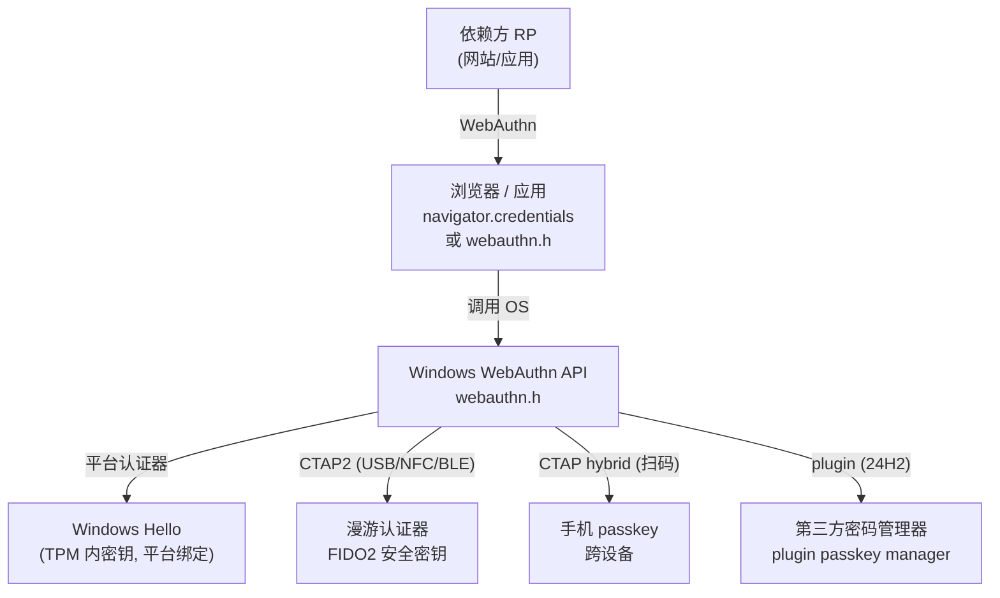
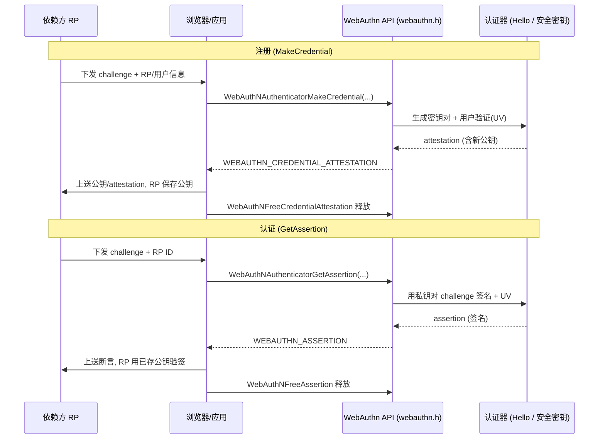

# WebAuthn与FIDO2与passkey编程

## 概述与定位

> [!abstract] TL;DR
> **FIDO2 = W3C 的 WebAuthn + FIDO 联盟的 CTAP2**：WebAuthn 管"依赖方（Relying Party，RP）↔ 浏览器/操作系统"这一段，CTAP2 管"操作系统 ↔ 认证器（authenticator）"这一段，二者拼起来就是一套**天生抗钓鱼（phishing-resistant）**的无密码协议。它复用了上一篇 Windows Hello 的密钥模型——**注册产出 attestation（含公钥），认证产出 assertion（对 challenge 的签名）**，私钥永不离开认证器。Windows 从 **Windows 10 1903** 起提供**原生 WebAuthn Win32 API**（头文件 `webauthn.h`，库 `OneCoreUAP.Lib`）：核心是 `WebAuthNAuthenticatorMakeCredential`（注册）与 `WebAuthNAuthenticatorGetAssertion`（认证），辅以 `WebAuthNGetApiVersionNumber`、`WebAuthNIsUserVerifyingPlatformAuthenticatorAvailable`、`WebAuthNFreeCredentialAttestation` / `WebAuthNFreeAssertion`、`WebAuthNGetErrorName` 等。认证器分**平台认证器（platform，即 Windows Hello）**与**漫游认证器（roaming，FIDO2 安全密钥，USB/NFC/BLE）**。**passkey（通行密钥）**是可发现凭据（discoverable credential），可跨设备（手机扫码走 CTAP hybrid），在**设置 → 账户 → 通行密钥**里管理；**Win11 22H2** 起 WebAuthn 支持 ECC，**Win11 24H2** 起支持 **plugin passkey manager**（`webauthnplugin.h` / `pluginauthenticator.h`，`WebAuthNPluginAddAuthenticator` 等）让第三方密码管理器接入。高层还有 WinRT 的 **`KeyCredentialManager`**（`Windows.Security.Credentials`）封装 Hello 密钥的创建与签名。浏览器的 `navigator.credentials.create/get` 最终就是调用 OS 的这套 WebAuthn API。

本篇是"无密码"三部曲的编程篇。上一篇（07）建立了"设备绑定非对称密钥 + TPM + IdP 注册公钥"的架构直觉，本篇把它**标准化、协议化、可编程化**：讲清 WebAuthn/CTAP2 的角色分工、Windows 原生 API 的调用流与关键结构、平台 vs 漫游认证器、passkey 与 plugin passkey manager、以及 `KeyCredentialManager` 高层封装。所有 API 签名以 learn.microsoft.com 的 `webauthn.h` / `webauthnplugin.h` 文档为准。

## 原理与机制

### FIDO2 的两块拼图：WebAuthn 与 CTAP2

FIDO2 由两份规范拼成，理解它们的**边界**是理解一切的前提：

- **WebAuthn（Web Authentication，W3C 规范）**：定义**依赖方（RP，即你要登录的网站/应用）与客户端（浏览器/操作系统）之间**的 JavaScript / 平台 API。RP 通过它请求"创建凭据"或"获取断言"。
- **CTAP2（Client to Authenticator Protocol 2，FIDO 联盟规范）**：定义**客户端（OS）与认证器之间**的协议（CBOR 编码），把 makeCredential / getAssertion 这类命令下发给具体认证器，并覆盖 USB、NFC、BLE 等传输。

一句话：**WebAuthn 面向"上层的 RP 与浏览器"，CTAP2 面向"下层的认证器硬件"，Windows 的原生 WebAuthn API 正好坐在中间，替应用屏蔽掉 CTAP2 的传输与交互细节**。官方明确提示：当应用使用这套 API 时，**浏览器/应用不再直接访问 FIDO2 传输**，全部交由 Windows 统一处理，从而在不同浏览器上给用户一致体验。

### 四个必须认识的术语

- **Relying Party（RP，依赖方）**：请求认证的一方，由 **RP ID**（通常是域名）标识。凭据与 RP ID 绑定，是**抗钓鱼**的关键——假域名拿不到为真域名注册的凭据。
- **challenge（质询）**：RP 每次生成的随机数，认证器对它签名。一次性 challenge 使**重放攻击**失效。
- **attestation（证明，注册产物）**：`MakeCredential` 的输出，含**新生成的凭据公钥**及可选的认证器出处证明，RP 保存公钥以便日后验签。
- **assertion（断言，认证产物）**：`GetAssertion` 的输出，是**认证器用私钥对 challenge 等数据产生的签名**，代表"用户同意本次事务"。RP 用先前保存的公钥验证它。

这四者与上一篇 Hello 的"公钥注册 IdP、challenge 签名、公钥验签"完全同构——**FIDO2 就是把 Hello 的密钥模型写成了跨厂商的开放标准**。

### 平台认证器 vs 漫游认证器



- **平台认证器（platform authenticator）**：**内建于设备、不可移动**，即 **Windows Hello**——私钥在本机 TPM 里。用 `WebAuthNIsUserVerifyingPlatformAuthenticatorAvailable` 可查询本机是否有可用的、支持用户验证（UV）的平台认证器。
- **漫游认证器（roaming authenticator）**：**可插拔/可携带的 FIDO2 安全密钥**，经 **USB / NFC / BLE** 接入，可在多台机器间漫游。
- **用户验证（User Verification, UV）**：认证器确认"操作者是本人"的步骤，平台认证器上就是**用 Windows Hello（PIN/生物）完成 UV**。

## Windows WebAuthn Win32 API 编程详解

### API 版本与能力协商

`webauthn.h` 随 Windows 演进增加能力，**先协商再调用**是纪律：

- **`WebAuthNGetApiVersionNumber()`**：返回当前 API 版本号。据此判断"能不能用某新特性"——例如枚举认证器的 `WebAuthNGetAuthenticatorList` 要求 API v9+。
- **`WebAuthNIsUserVerifyingPlatformAuthenticatorAvailable(BOOL *pbIsUserVerifyingPlatformAuthenticatorAvailable)`**：查询平台认证器（Hello）是否可用，用于决定 UI 上是否提供"用本机 Hello 登录"。

版本线索（能力随版本增长）：**Windows 10 1903** 引入 WebAuthn Win32 API；**Windows 11 22H2** 起 API 支持 **ECC** 算法；**Windows 11 24H2** 起支持 **plugin passkey manager**。

### 注册：WebAuthNAuthenticatorMakeCredential

注册对应 W3C 的 `authenticatorMakeCredential` 操作，签名如下（参数含义以官方为准）：

```cpp
HRESULT WebAuthNAuthenticatorMakeCredential(
  HWND                                              hWnd,                            // 承载 WebAuthn 模态 UI 的窗口
  PCWEBAUTHN_RP_ENTITY_INFORMATION                  pRpInformation,                 // RP 身份(RP ID/名称)
  PCWEBAUTHN_USER_ENTITY_INFORMATION                pUserInformation,               // 用户账户(user handle 等)
  PCWEBAUTHN_COSE_CREDENTIAL_PARAMETERS             pPubKeyCredParams,              // RP 首选的公钥类型/算法(COSE)有序表
  PCWEBAUTHN_CLIENT_DATA                            pWebAuthNClientData,           // client data hash
  PCWEBAUTHN_AUTHENTICATOR_MAKE_CREDENTIAL_OPTIONS  pWebAuthNMakeCredentialOptions, // 排除列表/认证器选择条件(可 NULL)
  PWEBAUTHN_CREDENTIAL_ATTESTATION                  *ppWebAuthNCredentialAttestation // 出参: 认证器返回的 attestation
);
```

它**创建一个绑定到管理认证器的公钥凭据源，并返回与其私钥配对的凭据公钥**——RP 用这枚公钥验证日后由此凭据源产生的断言。函数是**模态**的，通过 `hWnd` 弹出系统 UI（选认证器、做 UV）；成功返回 `S_OK`，出参 `ppWebAuthNCredentialAttestation` 指向 `WEBAUTHN_CREDENTIAL_ATTESTATION`（含 attestation 对象），**用完必须 `WebAuthNFreeCredentialAttestation` 释放**。`pPubKeyCredParams` 里 RP 按偏好列出算法（如 ES256/ECC、RS256），认证器"尽力"创建最优先且它支持的凭据。

### 认证：WebAuthNAuthenticatorGetAssertion

认证对应 `authenticatorGetAssertion`，签名（官方原样）：

```cpp
HRESULT WebAuthNAuthenticatorGetAssertion(
  HWND                                           hWnd,                          // 显示 UI 的窗口
  LPCWSTR                                        pwszRpId,                      // RP ID
  PCWEBAUTHN_CLIENT_DATA                         pWebAuthNClientData,          // 发给认证器的 client data
  PCWEBAUTHN_AUTHENTICATOR_GET_ASSERTION_OPTIONS pWebAuthNGetAssertionOptions, // 断言选项
  PWEBAUTHN_ASSERTION                            *ppWebAuthNAssertion          // 出参: 断言
);
```

它**产生一个断言签名，代表认证器证明"用户同意了某次具体事务"**（如登录或完成购买）。成功返回 `S_OK`，出参 `ppWebAuthNAssertion` 指向 `WEBAUTHN_ASSERTION`（含验证断言所需的数据），**用完必须 `WebAuthNFreeAssertion` 释放**。两点官方约束：认证器若找不到与该 RP 匹配的凭据会终止并报错；**在本操作前，必须先用 `WebAuthNCancelCurrentOperation` 中止认证器会话中所有其他进行中的操作**。

### 完整调用时序



出错时用 **`WebAuthNGetErrorName`** 取可读错误串、用 **`WebAuthNGetW3CExceptionDOMError`** 映射到 W3C DOM 异常码，便于把 Win32 结果对齐到浏览器语义。

### passkey：可发现凭据与跨设备

**passkey（通行密钥）**是 FIDO2 凭据的现代形态——**可发现凭据（discoverable credential，又称 resident key）**：凭据（含用户句柄）**存在认证器上**，登录时无需先输用户名，认证器能直接"发现"可用凭据。passkey 的两大体验红利是**同步与跨设备**：

- **跨设备（CTAP hybrid）**：手机上的 passkey 可通过**扫码 + 蓝牙邻近校验**（CTAP hybrid transport）为一台没有本地 passkey 的电脑完成登录。
- **Windows 管理入口**：**设置 → 账户 → 通行密钥（Settings → Accounts → Passkeys）** 集中查看/删除保存在本机的 passkey；`WebAuthNGetPlatformCredentialList` / `WebAuthNDeletePlatformCredential` 可枚举与删除平台侧凭据。

### plugin passkey manager（Win11 24H2）

24H2 起，Windows 开放**插件式 passkey 管理器**，让**第三方密码管理器**（如 1Password、Bitwarden 之类的 passkey provider）接入系统 passkey 体验。相关 API 在 `webauthnplugin.h`（库 `WebAuthnPlugin.dll`）与 `pluginauthenticator.h`：

- **`WebAuthNPluginAddAuthenticator`**：把插件认证器注册进 Windows，注册后可在**设置 → 账户 → 通行密钥 → 高级选项**里看到并开关。
- **`WebAuthNPluginAuthenticatorAddCredentials` / `WebAuthNPluginAuthenticatorRemoveCredentials`**：管理插件缓存的凭据元数据（供浏览器自动填充、列表展示）。
- **`WebAuthNPluginPerformUserVerification`**：插件借 **Windows Hello 完成用户验证**。
- **`WebAuthNPluginUpdateAuthenticatorDetails` / `WebAuthNPluginRemoveAuthenticator`**：更新/移除插件认证器。
- **`IPluginAuthenticator`（COM 接口，`pluginauthenticator.h`）**：插件要实现的契约，方法有 `MakeCredential` / `GetAssertion` / `CancelOperation` / `GetLockStatus`——Windows 把 WebAuthn 操作**分发（dispatch）**给插件来处理。

官方提供 **Contoso Passkey Manager**（WinUI 3，Windows-classic-samples 仓库 `Samples/PasskeyManager`）作为可运行示例，演示"注册插件 → 在网站创建 passkey 时由插件保存 → 用 Hello 做 UV"的完整闭环。

### 高层封装：KeyCredentialManager（WinRT）

若只想在自己的应用里"用 Hello 保护一把密钥并签名"，不必直击 WebAuthn 底层，可用 WinRT 的 **`KeyCredentialManager`**（命名空间 `Windows.Security.Credentials`，Windows 10 起）：

- **`KeyCredentialManager.IsSupportedAsync()`** → `bool`：本机与当前用户是否能预配密钥凭据（前提：账户已关联、且设置了 PIN/生物解锁手势）。
- **`KeyCredentialManager.RequestCreateAsync(name, KeyCredentialCreationOption)`** → `KeyCredentialRetrievalResult`：为当前用户与应用创建一把新的密钥凭据（**RSA 2048 位**，安全存储、不可导出）。
- **`KeyCredentialManager.OpenAsync(name)`**：打开已存在的同名密钥凭据。
- **`KeyCredential.RequestSignAsync(IBuffer data)`** → `KeyCredentialOperationResult`：**提示用户做手势并用私钥对数据签名**（签名格式 PKCS#1 RSA-PSS with SHA-256）。

`KeyCredentialManager` 是"Hello 密钥"的轻量封装，适合"应用自建挑战-响应认证"；而 WebAuthn/FIDO2 是**面向 RP 的开放标准**、并能用漫游安全密钥与 passkey。二者定位不同：前者简单但私有，后者标准但更重。

### 与浏览器 API 的关系

网页里的 **`navigator.credentials.create()`（注册）/ `navigator.credentials.get()`（认证）** 并非浏览器自己实现密码学，而是**由浏览器转调操作系统的 WebAuthn 实现**。在 Windows 上，Edge / Chrome 等最终落到本篇的 `webauthn.h` API 上——所以理解了 `MakeCredential` / `GetAssertion`，也就理解了网页 passkey 登录背后真正发生了什么。

## 工具视角与实战

**先查版本再用特性**：任何依赖新能力（ECC、认证器枚举、plugin）的代码路径，都应先 `WebAuthNGetApiVersionNumber` 判版本、`WebAuthNIsUserVerifyingPlatformAuthenticatorAvailable` 判平台认证器可用性，避免在旧系统上直接失败。

**从官方样例起步**：Windows-classic-samples 仓库里有 WebAuthn 与 **Contoso Passkey Manager**（`Samples/PasskeyManager`，WinUI 3）样例，KeyCredentialManager 也有 Windows-universal-samples 示例。**先跑通样例的注册/认证闭环再改**，比从零手搓结构体安全得多——`WEBAUTHN_RP_ENTITY_INFORMATION` / `WEBAUTHN_USER_ENTITY_INFORMATION` / `WEBAUTHN_CLIENT_DATA` 等结构字段多、版本敏感。

**在线联调**：用 **webauthn.io** 这类测试 RP 站点，配合浏览器登录，观察本机 Hello 或插入的 FIDO2 安全密钥被调用；开插件时在**设置 → 账户 → 通行密钥 → 高级选项**里确认第三方 provider 是否已注册、开关是否生效。

**释放纪律**：`MakeCredential` 的 `WEBAUTHN_CREDENTIAL_ATTESTATION` 与 `GetAssertion` 的 `WEBAUTHN_ASSERTION` 都是 API 分配的堆对象，**必须分别用 `WebAuthNFreeCredentialAttestation` / `WebAuthNFreeAssertion` 释放**，否则在登录高频路径上会累积泄漏。

## 安全性与正确使用

- **RP ID 绑定是抗钓鱼的命根子**：凭据与 RP ID（域名）绑定，**切勿放宽 RP ID 校验或接受用户可控的 RP ID**——一旦放宽，抗钓鱼特性即崩塌，假站点就能诱导使用为真站点注册的凭据。
- **challenge 必须由 RP 随机生成且一次性**：客户端不得复用或让 challenge 可预测，否则重放防护失效。`client data` 里 challenge 与 origin 的绑定是签名覆盖的对象，不可被篡改。
- **UV 与 attestation 按需要求，不盲目**：是否强制用户验证（UV）、是否要求 attestation，取决于业务风险等级；过度要求 attestation 会带来隐私与兼容成本，应按 RP 策略权衡。
- **句柄与内存所有权**：`hWnd` 决定模态 UI 归属，传错会导致 UI 无处显示或被劫持焦点；API 分配的对象所有权归调用方，**谁调用谁释放**，且机密性数据用后即弃。
- **passkey 同步的信任边界**：跨设备/同步 passkey 把私钥托付给同步提供方（平台或第三方 plugin），选择 provider 就是选择信任边界；plugin passkey manager 的 UV 借道 Hello，插件本身的凭据保管质量需自行评估。相关对抗与防御视角见 [[11.Windows认证安全与对抗]]。

## 小结

WebAuthn/FIDO2 是把上一篇 Windows Hello 密钥模型**标准化后的可编程形态**：**WebAuthn 管 RP↔浏览器/OS、CTAP2 管 OS↔认证器**，注册产出含公钥的 **attestation**、认证产出对 challenge 的 **assertion**，私钥永不离开认证器，凭据与 **RP ID** 绑定而抗钓鱼、challenge 一次性而抗重放。Windows 从 **10 1903** 起提供原生 `webauthn.h` API，主线是 **`WebAuthNAuthenticatorMakeCredential`（注册）/ `WebAuthNAuthenticatorGetAssertion`（认证）**，配合版本协商（`WebAuthNGetApiVersionNumber`、`WebAuthNIsUserVerifyingPlatformAuthenticatorAvailable`）、错误映射（`WebAuthNGetErrorName` / `WebAuthNGetW3CExceptionDOMError`）与释放（`WebAuthNFreeCredentialAttestation` / `WebAuthNFreeAssertion`）。认证器分**平台（Hello）与漫游（安全密钥）**，**passkey** 作为可发现凭据支持跨设备（CTAP hybrid）并在系统设置里管理；**22H2 引入 ECC、24H2 引入 plugin passkey manager**（`WebAuthNPluginAddAuthenticator`、`IPluginAuthenticator` 等）让第三方密码管理器接入。想轻量使用 Hello 密钥则用 WinRT 的 **`KeyCredentialManager`**。而浏览器的 `navigator.credentials.create/get` 归根结底就是调用这套 OS API——看懂它，就看懂了整个 Windows 无密码登录的编程面。

## 相关阅读

- WebAuthn APIs for passwordless authentication on Windows（1903 起 / 22H2 ECC / 24H2 plugin）— https://learn.microsoft.com/windows/security/identity-protection/hello-for-business/webauthn-apis
- WebAuthNAuthenticatorMakeCredential function (webauthn.h) — https://learn.microsoft.com/windows/win32/api/webauthn/nf-webauthn-webauthnauthenticatormakecredential
- WebAuthNAuthenticatorGetAssertion function (webauthn.h) — https://learn.microsoft.com/windows/win32/api/webauthn/nf-webauthn-webauthnauthenticatorgetassertion
- WebAuthNPluginAddAuthenticator function (webauthnplugin.h) — https://learn.microsoft.com/windows/win32/api/webauthnplugin/nf-webauthnplugin-webauthnpluginaddauthenticator
- KeyCredentialManager Class (Windows.Security.Credentials) — https://learn.microsoft.com/uwp/api/windows.security.credentials.keycredentialmanager
- 本库：[[07.WindowsHello与HelloforBusiness架构]]、[[09.WBF架构与WinBio客户端API]]、[[03.CredentialProvider编程-接口与tile枚举]]、[[11.Windows认证安全与对抗]]
- 密码学基础（非对称密钥 / COSE / 签名）：[[37.密码学/00.密码学总览|密码学]]
- 对照：[[29.Linux认证与登录编程/00.Linux认证与登录编程总览|Linux 认证]]

---

🏠 [[00.Windows认证与生物识别编程总览]] ｜ 上一篇 [[07.WindowsHello与HelloforBusiness架构]] ｜ 下一篇 [[09.WBF架构与WinBio客户端API]] ➡️
