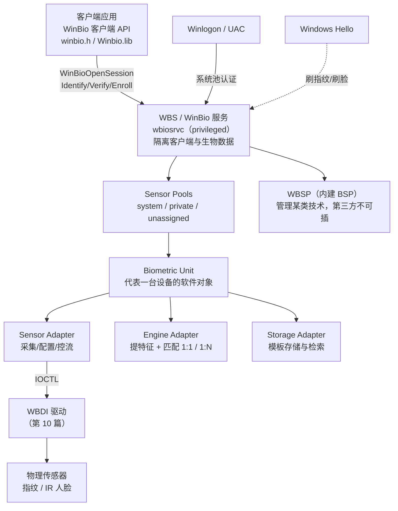

# WBF架构与WinBio客户端API

## 概述与定位

> [!abstract] TL;DR
> **WBF（Windows Biometric Framework）** 是 Windows 7 起内置的**通用生物识别架构**，为指纹、人脸、虹膜等设备提供统一的管理接口与用户体验。它的运行时核心是一个 **privileged 的系统服务——WBS（Windows Biometric Service），也就是 WinBio 服务**（服务名 `wbiosrvc`）：它把**客户端应用与原始生物数据彻底隔离**，任何进程都不能直接摸设备、只能经服务用「不透明标识」访问，从而保护用户隐私。架构上，每个物理设备被抽象成一个 **Biometric Unit（生物单元）**，其能力由三类可插拔 **Adapter** 暴露——**Sensor Adapter（采集）/ Engine Adapter（特征提取与匹配）/ Storage Adapter（模板存储）**；服务把生物单元按策略归入 **Sensor Pools（system / private / unassigned 三种池）**；而管理某一类技术（如指纹）的内置组件叫 **WBSP（Windows Biometric Service Provider），它是服务内建、第三方不可插**。开发者面向服务写代码用的是 **WinBio 客户端 API**（头文件 `winbio.h`，库 `Winbio.lib`，DLL `Winbio.dll`）：`WinBioOpenSession` 开会话、`WinBioEnumBiometricUnits`/`WinBioLocateSensor` 找设备、`WinBioIdentify`（1:N 辨识）vs `WinBioVerify`（1:1 核验）、`WinBioCaptureSample` 采集、`WinBioEnrollBegin`/`WinBioEnrollCapture`/`WinBioEnrollCommit` 三步注册、`WinBioDeleteTemplate` 删模板，异步版则围绕 `WINBIO_ASYNC_RESULT` 展开。指纹/人脸接入 WBF 之后，再由 **Windows Hello** 对最终用户暴露为「刷指纹/刷脸登录」。

本篇是**生物识别子系统的入口篇**。前面 07/08 讲的是 Windows Hello 与 WebAuthn——「用户看得见的无密码体验」与「跨平台协议」；从本篇起下沉到**生物数据究竟在系统里怎么流动、被谁管、如何隔离**。理解 WBF 的分层（客户端 → WinBio 服务 → 生物单元 → 三适配器 → WBDI 驱动 → 硬件）是后面第 10 篇写驱动、第 11 篇讲模板保护的公共地基。全文 API 与术语一律以 learn.microsoft.com 的 Windows Biometric Framework 文档为准。

## 原理与机制

### 为什么要一个 privileged 服务把客户端与生物数据隔开

生物特征与口令有一个根本差异：**口令可换，指纹与人脸不可换**。一旦原始生物样本（指纹图像、人脸深度图）或可反推的模板泄露，用户没有「改密」这条退路。因此 WBF 的第一原则不是「方便调用」，而是**隔离**：官方明确 WBS 的职责首位是「通过把客户端应用与生物数据分离来保护用户隐私」，其次是「要求应用只能用唯一标识符（而非原始数据）来访问」。

这一原则决定了整套架构的形状。应用**永远拿不到**别的用户的模板、也拿不到能重建指纹的原始特征；它能拿到的只是 `WINBIO_IDENTITY`（一个 GUID 或账户 SID）与「匹配成功/失败」这类判定结果。真正接触硬件、持有模板、执行比对的，是跑在受保护上下文里的 WinBio 服务及其加载的适配器。换句话说，**WinBio 客户端 API 的每一次调用，本质是一次跨进程的「委托」**：你把「请辨识当前按指纹的人是谁」这个意图交给服务，服务在你够不到的地方完成采集、提特征、比对，只把结论回给你。理解这一点，就能解释后面很多 API 设计——为什么会话要绑定「池」与「因子」、为什么系统池的操作需要窗口焦点、为什么删模板要管理员权限。

### 组件全景：生物单元、三类适配器、传感器池、WBSP

WBF 的可扩展性建立在几个精确的软件对象上，务必分清：

- **Biometric Unit（生物单元）**——**架构的中心**，一个代表某台生物设备的软件对象。一个物理传感器对应一个生物单元；单元通过标准接口把设备能力暴露给框架。单元有两种工作模式：**basic mode（基础模式）**——只当采集设备用，不用板载处理/存储，样本须符合标准格式（指纹须符合 ANSI INCITS 381-2004），靠软件适配器补齐提特征与存储，目的是保证跨厂商互操作；**advanced mode（高级模式）**——使用板载处理与存储，可用任意私有格式。
- **三类 Adapter（适配器插件）**——把生物单元「接」到具体软硬件上：
  - **Sensor Adapter**：包裹生物设备，提供「配置传感器、采集样本、控制数据流向引擎」的标准接口。
  - **Engine Adapter**：处理样本——归一化数据、提取特征、把样本与既有模板做匹配、给模板建索引。**「指纹到底像不像」这件事发生在这里**。
  - **Storage Adapter**：存储、管理、检索模板数据库。
  - 缺乏板载能力的设备用 Microsoft 提供的默认适配器即可；有板载能力的厂商可提供自定义适配器（详见第 10 篇）。
- **Sensor Pools（传感器池）**——服务按管理策略把生物单元归入三种池：
  - **System pool（系统池）**：一组可共享的生物单元，供 **Winlogon、UAC** 等 Windows 认证服务使用，用**账户 SID** 标识模板，依赖服务提供的可信模板存储。这是「刷指纹登录 Windows」走的池。
  - **Private pool（私有池）**：供某个客户端**独占**的一组单元，支持非 Windows 的、厂商自定义的认证场景。系统上有多少生物单元，就能有多少私有池。
  - **Unassigned pool（未分配池）**：既不属于系统池也不属于私有池的单元（新设备若无法配置进系统池，会先落到这里）。
- **WBSP（Windows Biometric Service Provider）**——服务内部**管理某一类生物技术**（如指纹读取器）的组件。**关键结论：WBSP 是内建于 WinBio 服务的，不是插件，第三方 BSP 不受支持。** 第三方能插的是三类 Adapter，不是 BSP。别把 WBSP 和 Adapter 搞混。

### 术语体系：factor / sub-factor / sample / template / unit / BIR

WBF 文档反复出现一组术语，先对齐定义再看 API 会顺畅得多：

- **Biometric factor（生物因子）**：可测量并用于识别的个人特征，如指纹、手型。
- **Biometric sub-factor（生物子因子）**：进一步限定因子的限定特征。指纹这个因子要完整定位，还得指明「哪根手指」——这就是子因子（如 `WINBIO_ANSI_381_POS_RH_INDEX_FINGER` 表示右手食指）。
- **Biometric sample（样本）**：对单个个体的单个特征做一次测量得到的数据，例如一枚指纹的图像。
- **Biometric template（模板）**：对同一个体同一特征采集**多个样本**后统计平均出的数据，只保留判定新样本是否匹配所必需的特征。
- **Biometric unit（生物单元）**：如上，代表设备、能采集处理样本并创建/保存/匹配模板的软件对象。
- **BIR（Biometric Information Record，生物信息记录）**：承载原始或已处理生物信息的数据结构。WinBio API 里样本常以 `WINBIO_BIR` 形式出现。
- 另有 **Liveness testing（活体检测）**：验证样本不是被伪造或从此前采集的样本重放而来——这是对抗篇（第 11）与 ESS 的关键概念。

## WinBio 客户端 API 编程详解

这一节把「向服务委托」落到具体函数。所有函数声明在 `winbio.h`，链接 `Winbio.lib`。为便于对照，同步版签名如下（异步版见后）。

### 打开与关闭会话：一切的起点

```cpp
HRESULT WinBioOpenSession(
  [in]  WINBIO_BIOMETRIC_TYPE Factor,        // 因子，如 WINBIO_TYPE_FINGERPRINT
  [in]  WINBIO_POOL_TYPE      PoolType,       // WINBIO_POOL_SYSTEM / WINBIO_POOL_PRIVATE
  [in]  WINBIO_SESSION_FLAGS  Flags,          // WINBIO_FLAG_DEFAULT / _RAW / _MAINTENANCE
  [in]  const WINBIO_UNIT_ID  *UnitArray,     // 私有池指定单元；系统池传 NULL
  [in]  SIZE_T                UnitCount,
  [in]  const GUID            *DatabaseId,     // 系统池须用 WINBIO_DB_DEFAULT
  [out] WINBIO_SESSION_HANDLE *SessionHandle
);
```

一个**会话**把「哪个因子、哪个池、用哪个数据库」绑定成一个句柄，后续所有操作都挂在它上面。几处易错点：用 **`WINBIO_POOL_SYSTEM`（系统池）时 `DatabaseId` 必须是 `WINBIO_DB_DEFAULT`**（用默认生物单元配置里的默认库），且不能与私有池的 `DatabaseId` 用法混用；`WINBIO_DB_ONCHIP` 表示库在传感器芯片上、可用于注册与匹配；`WINBIO_DB_BOOTSTRAP` 用于「进入 Windows 之前」的场景，通常在芯片或 BIOS 里、只能做注册与删除。用完必须 `WinBioCloseSession` 关闭。

### 枚举与定位设备

- **`WinBioEnumBiometricUnits(Factor, &UnitSchemaArray, &UnitCount)`**——列出系统上某因子的所有生物单元，返回一组 `WINBIO_UNIT_SCHEMA`（含 `UnitId`、设备描述、能力等），用于「有哪些指纹传感器」这类枚举。返回的数组要用 `WinBioFree` 释放。
- **`WinBioLocateSensor(SessionHandle, &UnitId)`**——**交互式**地让用户「碰一下」传感器，返回被碰的那个单元的 `UnitId`。多传感器机器上「用哪一个」由用户的物理动作决定，比让程序猜更自然。

### WinBioIdentify（1:N 辨识）vs WinBioVerify（1:1 核验）

这是最需要分清的一对，差别在「你是否已经声称自己是谁」：

```cpp
// 1:N —— 不预设身份，回答「按指纹的是谁」
HRESULT WinBioIdentify(
  [in]            WINBIO_SESSION_HANDLE    SessionHandle,
  [out, optional] WINBIO_UNIT_ID           *UnitId,
  [out, optional] WINBIO_IDENTITY          *Identity,     // 命中的身份(GUID/SID)
  [out, optional] WINBIO_BIOMETRIC_SUBTYPE *SubFactor,    // 命中的子因子(哪根手指)
  [out, optional] WINBIO_REJECT_DETAIL     *RejectDetail  // 失败细节
);

// 1:1 —— 预设身份，回答「按指纹的是不是这个人」
HRESULT WinBioVerify(
  [in]            WINBIO_SESSION_HANDLE    SessionHandle,
  [in]            WINBIO_IDENTITY          *Identity,      // 待核验的身份
  [in]            WINBIO_BIOMETRIC_SUBTYPE SubFactor,      // 待核验的子因子
  [out, optional] WINBIO_UNIT_ID           *UnitId,
  [out, optional] BOOLEAN                  *Match,         // 是否匹配
  [out, optional] WINBIO_REJECT_DETAIL     *RejectDetail
);
```

- **`WinBioIdentify`（1:N）**：采一枚样本，在库里搜出**它是谁**，把命中身份写进 `Identity`。登录场景「按指纹直接进入对应用户」用它。
- **`WinBioVerify`（1:1）**：你先声称「我是 Identity 指向的用户」，函数只判断当前样本**是不是这个人**，`Match` 给出布尔结论。解锁已知用户、二次确认用它。
- 二者在**系统池**下都会**阻塞直到应用取得窗口焦点且用户提供了样本**——所以拿到焦点前不要贸然调用（见「焦点管理」）。`RejectDetail` 会告诉你失败原因（太快、太偏、太脏等），可据此提示用户重试。WBF 目前的子因子常量覆盖十指与「四指」，另有 `WINBIO_SUBTYPE_ANY`。

### 采集原始样本：WinBioCaptureSample

```cpp
HRESULT WinBioCaptureSample(
  [in]  WINBIO_SESSION_HANDLE SessionHandle,
  [in]  WINBIO_BIR_PURPOSE    Purpose,        // 采集意图(辨识/核验/注册...)
  [in]  WINBIO_BIR_DATA_FLAGS Flags,          // 数据处理级别(raw/intermediate/processed)
  [out] WINBIO_UNIT_ID        *UnitId,
  [out] WINBIO_BIR            **Sample,        // 采到的样本(BIR)
  [out] SIZE_T                *SampleSize,
  [out] WINBIO_REJECT_DETAIL  *RejectDetail
);
```

当你需要**自己拿到样本**（而非让服务直接给结论）时用它，例如做自定义匹配或诊断。`Purpose` 声明采集意图、`Flags` 声明想要的处理级别。返回的 `WINBIO_BIR` 用完须 `WinBioFree`。注意：能否拿到「原始」数据受隔离策略与传感器能力限制，系统池下通常拿不到可反推的原始特征。

### 注册模板：Begin / Capture / Commit 三步事务

注册（enrollment）是一次**事务**，因为一个可靠模板需要**多次采样**求平均：

1. **`WinBioEnrollBegin(SessionHandle, SubFactor, UnitId)`**——开始注册序列、创建一个空模板；`SubFactor` 指明注册哪根手指，`UnitId` 指定用哪台传感器（同一次注册的所有样本必须来自同一传感器，`UnitId` 不能为 0）。
2. **`WinBioEnrollCapture(SessionHandle, &RejectDetail)`**——采集一枚样本并并入正在注册的模板；**反复调用直到样本数足够**（服务会告诉你还差几枚，`RejectDetail` 提示单次质量问题让用户重按）。
3. **`WinBioEnrollCommit(SessionHandle, &Identity, &IsNewTemplate)`**——**提交事务**，把模板落库并绑定到 `Identity`；`IsNewTemplate` 指示这是新建还是更新。若中途放弃，用 `WinBioEnrollDiscard`。

系统池下调用 `WinBioEnrollBegin` 同样**需要窗口焦点**。这套「Begin/Capture×N/Commit」的形状，和第 10 篇驱动侧 Engine Adapter 的 `CreateEnrollment`/`UpdateEnrollment`/`CommitEnrollment` 是一一对应的——客户端 API 的一次注册，会在服务里翻译成对适配器的一串调用。

### 删除模板

```cpp
HRESULT WinBioDeleteTemplate(
  [in] WINBIO_SESSION_HANDLE    SessionHandle,
  [in] WINBIO_UNIT_ID           UnitId,
  [in] WINBIO_IDENTITY          *Identity,     // 删谁的
  [in] WINBIO_BIOMETRIC_SUBTYPE SubFactor      // 删哪根手指
);
```

按「身份 + 子因子」删除某枚模板。系统池里删别人的模板属特权操作。

### 异步模型：WINBIO_ASYNC_RESULT 与回调

生物操作天然慢（要等用户按、要比对），同步 API 会阻塞线程，GUI 里不友好。异步做法是用 **`WinBioAsyncOpenSession`** 打开异步会话，之后同名操作不再阻塞，框架分配一个 **`WINBIO_ASYNC_RESULT`** 结构承载「成功/失败与结果」，按你在 `NotificationMethod` 里的选择投递：

- **`WINBIO_ASYNC_NOTIFY_CALLBACK`**：实现一个 `PWINBIO_ASYNC_COMPLETION_CALLBACK` 回调，完成时被调用；
- **`WINBIO_ASYNC_NOTIFY_MESSAGE`**：框架把 `WINBIO_ASYNC_RESULT*` 放进窗口消息的 `LPARAM`，你在消息循环里取。

**每个 `WINBIO_ASYNC_RESULT` 用完必须 `WinBioFree` 释放，否则内存泄漏。** 异步版里，操作结果（如 `WinBioIdentify` 的命中身份、`WinBioVerify` 的 `Match`）藏在结果结构的嵌套子结构里，按操作类型取用。

### 焦点管理：WinBioAcquireFocus / ReleaseFocus

如上，**系统池**里的辨识/核验/注册会「阻塞到应用取得窗口焦点」——这是防止后台进程偷偷采集的安全设计。GUI 程序靠处理 `WM_ACTIVATE`/`WM_SETFOCUS` 等消息自然获得焦点；CUI 程序可用 `GetConsoleWindow` + `SetForegroundWindow` 把控制台顶到前台。而**无窗口的分离进程或 Windows 服务**没有可依赖的窗口焦点，就要用 **`WinBioAcquireFocus` / `WinBioReleaseFocus` 手动接管焦点**，用完释放。忘了这一步，常表现为「调用像卡死一样一直不返回」。

### 与 Windows Hello 的关系

WBF 是**底座**，Windows Hello 是**面向用户的上层体验**。一台指纹/人脸设备写好 WBDI 驱动、接入 WBF 之后，其能力经系统池对 Winlogon/Hello 可见，用户在「设置 → 登录选项」里录入指纹/人脸，登录界面上「刷指纹/刷脸」就走通了。生物匹配成功后，真正解锁的不是「把口令交出去」，而是由 Hello 释放受 TPM 保护的非对称密钥去认证（见第 07 篇）——**WBF 负责「确认是本人」，Hello 负责「用密钥完成登录」**，职责分明。启用 ESS（Enhanced Sign-in Security）后，匹配与模板还会被隔离进 VBS（见第 11 篇）。

### WBF 组件架构总览



## 工具视角与实战

**从官方样例与文档起步**：WinBio 客户端 API 在 Windows SDK 里有完整示例（`WinBioEnrollBegin`/`WinBioIdentify` 等页面均带可编译片段，链接 `Winbio.lib`、包含 `Windows.h` 与 `Winbio.h`）。先跑通「枚举单元 → 打开系统池会话 → 焦点 → Identify」的最小闭环，再叠加注册与异步。

**命令行速查**：无需写代码也能观察 WBF 状态。设备管理器的 **Biometric devices** 节点能看到传感器是否被框架正确加载；`net stop wbiosrvc && net start wbiosrvc` 可重启 WinBio 服务（排障常用）；事件查看器 **Applications and Services Logs → Microsoft → Windows → Biometrics → Operational** 记录每个传感器的枚举，日志事件 ID **1108** 表示某传感器被框架成功加载，并标明它是隔离在 **System** 进程还是 **Virtual Secure Mode**（后者即启用了 ESS）。

**调试要点**：区分「是客户端调用错」还是「服务/驱动没就绪」。焦点问题（调用不返回）先查是否 GUI 有焦点或是否漏了 `WinBioAcquireFocus`；「找不到设备」先看 Operational 日志有没有 1108、设备管理器里驱动是否 OK；系统池权限问题（删模板/移除最后一个传感器失败）多半是特权不足。所有返回 `WINBIO_*` 数组/BIR 记得 `WinBioFree`，异步 `WINBIO_ASYNC_RESULT` 同理，否则会泄漏。

## 安全性与正确使用

- **隔离是底线，别试图绕过**：WBF 刻意不让应用碰原始生物数据，你能拿到的就是 `WINBIO_IDENTITY` 与判定结果。不要设计「导出模板/原始特征再自行处理」的流程——既拿不到，也违背隐私模型。系统池的模板由服务可信存储，应用无从访问他人模板。
- **系统池 vs 私有池选对**：需要与 Windows 账户（SID）关联、参与登录/解锁的，用**系统池**；纯厂商自定义、与 Windows 认证无关的，用**私有池**并独占单元。为「省事」把自定义认证塞进系统池是错误的，会与 Winlogon 争用并破坏隔离假设。
- **焦点即防偷采**：系统池强制窗口焦点，是为了防后台静默采集。别用 `WinBioAcquireFocus` 在用户不知情时长期霸占焦点做采集——那正是这套机制要防的滥用。
- **生物识别 ≠ 认证的全部**：`WinBioVerify`/`Identify` 只回答「是不是本人」，最终登录仍由 Hello 用受 TPM 保护的密钥完成、由 LSA 裁决。把「匹配成功」直接当成「授予访问」而跳过密钥/LSA，是把收集层当裁决层的老错误（与第 03/11 篇一脉相承）。
- **资源与错误纪律**：登录路径上的服务客户端，任何句柄泄漏、未判 `HRESULT` 都可能拖垮体验；`WinBioCloseSession`、`WinBioFree` 要成对可靠执行，`RejectDetail` 要翻译成对用户友好的重试提示而非静默失败。

## 小结

WBF 用一条清晰的分层链把「刷指纹/刷脸」这件事拆开：**客户端应用**经 **WinBio 客户端 API**（`winbio.h`）把意图**委托**给 **privileged 的 WinBio 服务（WBS）**；服务在应用够不到的地方，用 **Biometric Unit** 抽象设备、用 **Sensor/Engine/Storage 三类 Adapter** 完成采集/提特征匹配/存储、用 **system/private/unassigned 三种 Sensor Pool** 按策略管理单元、由内建的 **WBSP**（第三方不可插）统管某类技术。编程主干就是那几组函数：开/关会话、枚举/定位、**`WinBioIdentify`（1:N）与 `WinBioVerify`（1:1）** 这对核心、采集、**注册三步事务（Begin/Capture×N/Commit）**、删模板，以及异步的 `WINBIO_ASYNC_RESULT` 与系统池必备的焦点管理。记住贯穿全篇的那条主线——**服务隔离客户端与生物数据、应用只拿身份与判定结果**——你就抓住了 WBF 的设计初衷，也为下一篇「自己写 WBDI 驱动与适配器」铺好了地基。

## 相关阅读

- Biometric Framework overview — https://learn.microsoft.com/windows/win32/secbiomet/biometric-framework-overview
- Biometric Framework terminology（factor/sample/template/BIR）— https://learn.microsoft.com/windows/win32/secbiomet/biometric-framework-terminology
- Plug-in architecture / Sensor Pools — https://learn.microsoft.com/windows/win32/secbiomet/plug-in-architecture
- WinBioOpenSession / WinBioIdentify / WinBioVerify / WinBioEnrollBegin（winbio.h）— https://learn.microsoft.com/windows/win32/api/winbio/
- 本库：[[00.Windows认证与生物识别编程总览]]、[[07.WindowsHello与HelloforBusiness架构]]、[[10.WBDI生物识别驱动与适配器开发]]、[[11.Windows认证安全与对抗]]
- 对照：[[29.Linux认证与登录编程/09.PAM安全陷阱与逆向视角|Linux PAM 安全]]

---

🏠 [[00.Windows认证与生物识别编程总览]] ｜ 上一篇 [[08.WebAuthn与FIDO2与passkey编程]] ｜ 下一篇 [[10.WBDI生物识别驱动与适配器开发]] ➡️
