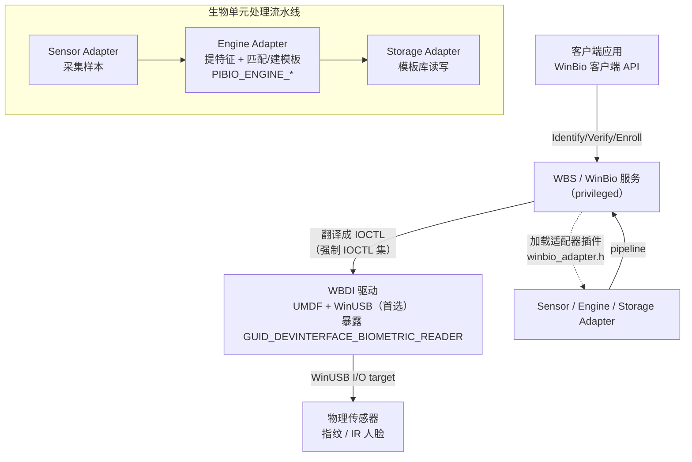

# WBDI生物识别驱动与适配器开发

## 概述与定位

> [!abstract] TL;DR
> **WBDI（Windows Biometric Driver Interface）** 是 WBF 里**驱动侧**的那一半：它是一个 **基于 IOCTL 的驱动接口**，让生物设备驱动能把设备暴露给 **WinBio 服务（WBS）**。与第 09 篇的「客户端 API」正好构成上下两端——**客户端 API 让应用调用服务，WBDI 让服务驱动硬件**。开发 WBDI 驱动的头文件是 `winbio_ioctl.h` 与 `winbio_types.h`。驱动模型有明确优先级：**UMDF + WinUSB I/O target（首选，用户态、稳定、隔离好）** > UMDF + 自定义 KMDF filter/自定义 KMDF I/O target > KMDF > WDM（仅在万不得已时）。安装靠 INF：**`Class=Biometric`、`ClassGuid={53D29EF7-377C-4D14-864B-EB3A85769359}`（即 `Devguid.h` 里的 `GUID_DEVCLASS_BIOMETRIC`）**；UMDF-based WBDI 驱动必须把 **`Exclusive` 置 1**（独占，WBF 才会接管），并用 **ACL 限定只有管理员或本地系统能打开设备**、开启 **selective suspend（`SystemWakeEnabled`/`DeviceIdleEnabled`）** 以支持唤醒解锁；驱动还须暴露设备接口 **`GUID_DEVINTERFACE_BIOMETRIC_READER`**，WBF 服务据此枚举它。设备的采集/提特征/存储三条能力由三类**适配器**（头 `winbio_adapter.h`）承担：**Sensor / Engine / Storage Adapter**；缺板载能力就用 Microsoft 默认适配器，有则写自定义。Engine 适配器是重头，其函数族形如 **`PIBIO_ENGINE_*`**（`PIBIO_ENGINE_CREATE_ENROLLMENT_FN`、`PIBIO_ENGINE_IDENTIFY_FEATURE_SET_FN` 等）。官方范式样例是 **WudfBioUsbSample**（UMDF+WinUSB，基于 `umdf_fx2`，2024 年 2 月归档但 WBDI 接口仍受支持）。进一步还有 **Secure Biometrics / match-on-chip** 的 V4 引擎接口。

本篇是**驱动与适配器实操篇**，承接第 09 篇的架构地图，把「服务如何驱动硬件、厂商如何插入自己的采集/匹配/存储」讲透。它天然与 [[38.Windows内核与驱动逆向/00.Windows内核与驱动逆向总览|Windows 内核与驱动逆向]] 里的 UMDF/WDF 内容互补——那边讲 WDF 框架本身，这边讲 WDF 之上的生物专用契约。所有 GUID、INF 指令、函数名一律以 learn.microsoft.com 的 Biometric（WDK）文档为准。

## 原理与机制

### WBDI 是什么，和 WinBio 客户端 API 的分界线

一句话定位：**WBF 由「一个 IOCTL 驱动接口 WBDI」+「一个 Windows 服务 WBS（即 WinBio 服务）」构成。WBDI 驱动响应来自 WinBio 服务的请求。** 数据流是单向清晰的：

- **应用** 用第 09 篇的 **WinBio 客户端 API**（`winbio.h`）向 **WBS** 发起「辨识/核验/注册」；
- **WBS** 把这些高层意图翻译成对 **WBDI 驱动** 的 **IOCTL** 请求；
- **WBDI 驱动** 暴露 WBDI 接口、响应服务的 IOCTL，去驱动真正的**物理传感器**。

所以两套接口的分界是**进程与信任边界**：客户端 API 在应用进程里、只能拿到身份与判定；WBDI 在驱动栈里、直接接触硬件与原始数据。厂商交付的通常是一个「生物设备驱动 DLL」（UMDF 场景）。**一个合规的 WBDI 驱动必须支持 WBDI 驱动接口 GUID 与全部强制 IOCTL**——这是被 WBF 认领的前提。

### 选择驱动模型：为什么首选 UMDF + WinUSB

开发 WBDI 驱动的第一个决定是选驱动模型。官方推荐次序（从最推荐到最不推荐）：

1. **UMDF + WinUSB I/O target**——**首选**。UMDF 是用户态驱动框架，驱动跑在用户态，崩了不蓝屏、隔离性好、开发调试友好；WinUSB 作为 USB I/O target 省去自写 USB 底层。官方明确「推荐 IHV 用 UMDF + WinUSB」，且用 UMDF 时推荐 **C++**。
2. **UMDF + 自定义 KMDF filter（架在 WinUsb 上）或自定义 KMDF I/O target**——需要更底层控制时。
3. **KMDF**——内核态 WDF，不是首选环境。
4. **WDM**——**仅在绝对必要时**。

选 UMDF 的深层理由是**稳定性与系统健壮性**：生物驱动在登录路径上、又常驻等待用户触摸，一旦内核态驱动出错就是系统级故障；把它放到用户态，配合 WBS 的隔离，风险面小得多。这与第 09 篇「服务隔离生物数据」的思路一致——**能在用户态解决的，就别下内核**。

### WBDI 在 WBF 中的位置



## WBDI 驱动安装、IOCTL 与三类适配器详解

### INF 安装：Biometric 类、独占、ACL、选择性挂起

WBDI 驱动的 INF（实践中常用 INX 生成 INF）有几处**不可省**的约定，取自 `WudfBioUsbSample.inx`：

- **设备类**：
  ```inf
  [Version]
  Class=Biometric
  ClassGuid={53D29EF7-377C-4D14-864B-EB3A85769359}   ; = GUID_DEVCLASS_BIOMETRIC (Devguid.h)
  ```
- **在 `.NT.hw` 段用 `AddReg` 指向三个注册表节**：
  ```inf
  [Biometric_Install.NT.hw]
  AddReg=Biometric_Device_AddReg
  AddReg=DriverPlugInAddReg, DatabaseAddReg
  ```
  1. **`Biometric_Device_AddReg`**——设备级值：设 **`Exclusive`=1**（UMDF-based WBDI **必须**设 1，WBF 才会尝试独占打开并接管该设备；设 0 则表示暴露给传统非 WBDI 栈、WBF 不接管）；前两行用 **ACL** 指定「只有管理员或本地系统账户能打开设备」——这样当 WinBio 服务没运行时，第三方应用也无法打开设备偷采指纹；再设 selective suspend 相关值。
  2. **`DriverPlugInAddReg`**——插件适配器的注册值：样例用 Microsoft 提供的 **sensor adapter + storage adapter**，并**通过设置 `SystemSensor` 值开启 Windows 登录支持**（即把该单元供系统池/登录使用）。
  3. **`DatabaseAddReg`**——数据库服务的值：其中的标识 GUID 对「每个厂商、每种格式的数据库」必须唯一（样例给了一个示例 GUID，厂商要换成自己的）。
- **WDF 专用 DDInstall 段（UMDF + WinUSB）**：
  ```inf
  [Biometric_Install.NT.Wdf]
  KmdfService=WINUSB, WinUsb_Install
  UmdfDispatcher=WinUsb
  UmdfService=WudfBioUsbSample, WudfBioUsbSample_Install
  UmdfServiceOrder=WudfBioUsbSample
  ```
  用 UMDF 的 USB I/O target 时**必须**设 `UmdfDispatcher=WinUsb`。
- **selective suspend（选择性挂起）**：WBDI 驱动应支持 USB 选择性挂起，支持系统唤醒/设备空闲的设备要开：
  ```inf
  HKR,,"SystemWakeEnabled",0x00010001,1
  HKR,,"DeviceIdleEnabled",0x00010001,1
  ```
  理想状态是系统挂起时设备仍「就绪待采」，若挂起期间发生扫描，设备缓存整枚指纹数据，系统唤醒后驱动再读入——这正是「合盖唤醒即刷指纹解锁」体验的底层支撑。
- 为区分 WBDI 与传统驱动，厂商还须在 INX 里设 **Feature Score**（样例未设）。

### 暴露设备接口：让 WBF 认领你

光装上驱动还不够，**驱动必须主动暴露生物读取器设备接口，WBF 才会发现它**。WinBio 服务在**启动时或收到 PnP 即插即用通知时**，扫描系统上支持知名接口 GUID **`GUID_DEVINTERFACE_BIOMETRIC_READER`（E2B5183A-99EA-4cc3-AD6B-80CA8D715B80）** 的硬件；对每台发现的设备，服务会打开句柄、查询能力、读设备与全局插件注册信息，最后**建一个 Biometric Unit** 交给 BSP。UMDF 驱动在队列建立时用 `IWDFDevice::CreateDeviceInterface` + `IWDFDevice::AssignDeviceInterfaceState` 暴露这个接口：

```cpp
hr = m_FxDevice->CreateDeviceInterface(&GUID_DEVINTERFACE_BIOMETRIC_READER, NULL);
hr = m_FxDevice->AssignDeviceInterfaceState(&GUID_DEVINTERFACE_BIOMETRIC_READER, NULL, TRUE);
```

**暴露该接口，会促使 WBF 服务枚举你的驱动**；若同时想给传统（非 WBDI）栈供功能，则另暴露一个传统接口并把 `Exclusive` 设 0——但 WBF 与传统栈**不能同时工作**，WBF 只在设备能被独占打开时才运作。

### IOCTL 集与强制契约

WBDI 是 **IOCTL-based** 的：服务把每个高层操作变成一次或多次 IOCTL 发给驱动。相关控制码与类型定义在 `winbio_ioctl.h` / `winbio_types.h`。驱动**必须实现全部强制 IOCTL** 才算合规；这些 IOCTL 覆盖查询设备属性/能力、控制传感器、采集数据、以及把原始样本回传给服务等。UMDF-USB 场景下，为降低采集延迟，官方建议**保持若干个异步读请求处于挂起（pending）状态**（参见样例 `CBiometricDevice::InitiatePendingRead`：用 `IWDFDriver::CreatePreallocatedWdfMemory` 预分配内存循环下发读请求），这样一枚扫描到来时能立刻取数而非现建请求。

### 三类适配器：默认 vs 自定义

适配器是**生物单元处理流水线**的可插拔环节，头文件 `winbio_adapter.h`。服务通过三个入口函数拿到适配器的函数指针表（`WINBIO_*_INTERFACE` 结构）：`WbioQuerySensorInterface`、`WbioQueryEngineInterface`、`WbioQueryStorageInterface`。三类职责：

- **Sensor Adapter**：包裹设备，提供配置传感器、采集样本、控制数据流向引擎的标准接口（`SensorAdapter*` 函数族）。
- **Engine Adapter**：**从样本生成模板、把样本匹配到既有模板、给模板建索引**——匹配的智力在这里。
- **Storage Adapter**：存储、管理、检索模板数据库（`StorageAdapter*` 函数族）。

**是否自定义取决于设备能力**：只做采集的 basic-mode 设备，Engine/Storage 可直接用 Microsoft 默认适配器，只需写（或用默认）Sensor Adapter；有板载提特征/存储的 advanced-mode 设备，则提供对应的自定义适配器。写自定义引擎适配器时有条纪律——**若某个必需函数你不实现，也必须给它一个返回 `E_NOTIMPL` 的桩**，不能留空。

### Engine 适配器的关键回调 PIBIO_ENGINE_*

Engine Adapter 的函数以 `PIBIO_ENGINE_*_FN` 形式声明（实现名形如 `EngineAdapterXxx`），几个核心：

- **注册事务**：`PIBIO_ENGINE_CREATE_ENROLLMENT_FN`（初始化流水线里的注册对象）→ `PIBIO_ENGINE_UPDATE_ENROLLMENT_FN`（并入一或多个特征集）→ `PIBIO_ENGINE_COMMIT_ENROLLMENT_FN`（**定稿：把注册对象转成模板并存库**）或 `PIBIO_ENGINE_DISCARD_ENROLLMENT_FN`（放弃）。这条链与第 09 篇客户端的 `WinBioEnrollBegin/Capture/Commit` **精确对应**。
- **样本与匹配**：`PIBIO_ENGINE_ACCEPT_SAMPLE_DATA_FN`（收原始样本、提特征集）；`PIBIO_ENGINE_IDENTIFY_FEATURE_SET_FN`（**1:N**，把特征集辨识成身份）；`PIBIO_ENGINE_VERIFY_FEATURE_SET_FN`（**1:1** 核验）；`PIBIO_ENGINE_CHECK_FOR_DUPLICATE_FN`（查重，不管身份地判新模板是否与库中重复）。
- **流水线管理**：`PIBIO_ENGINE_ATTACH_FN`/`DETACH_FN`（把引擎接入/移出生物单元流水线）、`PIBIO_ENGINE_CLEAR_CONTEXT_FN`（为新操作清理上下文）、`PIBIO_ENGINE_QUERY_SAMPLE_HINT_FN`（还需几枚样本才能建模板）、`PIBIO_ENGINE_QUERY_HASH_ALGORITHMS_FN`（支持的哈希算法）。

以注册的适配器侧工作流为例，客户端一次 `WinBioEnrollBegin` 在服务里展开为：`StorageAdapterQueryBySubject` → `SensorAdapterClearContext` → `EngineAdapterClearContext` → `StorageAdapterClearContext` → `EngineAdapterCreateEnrollment` → `EngineAdapterSetEnrollmentParameters`——可见**一条客户端调用背后是三类适配器的协同**。

### Secure Biometrics 与 match-on-chip：V4 引擎接口

Windows 10 起引入 **V4 引擎接口**，新增两个函数支持**基于 TPM 2.0 的安全生物识别（Secure Biometrics）**：**`PIBIO_ENGINE_CREATE_KEY_FN`（`EngineAdapterCreateKey`）** 把一个 HMAC 密钥推给传感器；**`PIBIO_ENGINE_IDENTIFY_FEATURE_SET_SECURE_FN`（`EngineAdapterIdentifyFeatureSetSecure`）** 用该密钥做**受保护的匹配**。其思想是把「匹配」从可被篡改的软件路径，搬到**带微处理器与存储的传感器芯片上完成（match-on-chip / match-on-sensor）**，配合密钥协商建立安全会话，使采集—匹配—模板存储链路可抵抗样本注入与重放。这条线正是第 11 篇 **ESS（Enhanced Sign-in Security）** 在驱动/硬件侧的落点：指纹须 match-on-sensor、出厂烧入 Microsoft 签发证书、由跑在 VBS 里的生物组件校验并建安全通道。

### 官方范式样例：WudfBioUsbSample

学习 WBDI 的标准起点是 **WudfBioUsbSample**：一个 **UMDF-based、用 WinUSB I/O target** 的 WBDI 驱动，基于 `umdf_fx2` 样例，曾随 Windows 7 Beta 到 Windows 11 22H2 的 WDK 一起发布。**注意：该样例已于 2024 年 2 月归档**（可从「Windows 11, version 22H2 - May 2022 Driver Samples Update」发布页下载），**但 WBDI 接口本身仍受 Microsoft 支持**，厂商可继续按此接口开发并送认证。它演示了 INF 三节注册、暴露 `GUID_DEVINTERFACE_BIOMETRIC_READER`、挂起异步读、选择性挂起等全部要点——**别从零手搓，先读懂样例再改**。

## 工具视角与实战

**开发环境**：装 WDK 与对应 Visual Studio，按官方「Roadmap for Developing Biometric Drivers」的步骤走——先懂 WDF/驱动基础，再读 WBDI 与样例，选 UMDF+WinUSB，用 C++ 实现。UMDF 驱动可用用户态调试器附加宿主进程（`WUDFHost.exe`）调试，比内核调试轻便，这也是选 UMDF 的实惠之一。

**验证驱动被 WBF 认领**：装好后在**设备管理器 → Biometric devices** 应能看到设备；WinBio 服务日志在**事件查看器 → Applications and Services Logs → Microsoft → Windows → Biometrics → Operational**，事件 **1108** 表示某传感器被框架成功加载。`net stop wbiosrvc && net start wbiosrvc` 重启服务可触发重新枚举。若设备装上却不被 WBF 认领，优先核对：`Exclusive` 是否为 1、是否暴露了 `GUID_DEVINTERFACE_BIOMETRIC_READER`、INF 三节注册是否齐全、`SystemSensor` 是否设置（若要走登录）。

**用传统驱动替换 WBDI 驱动的顺序**（排障/回退时用）：关闭所有 WBF 应用 → 卸载 WBDI 驱动 → 停 WBF 服务、重启再停 → 安装传统驱动。顺序错了会因「WBF 仍独占着设备」而失败。

## 安全性与正确使用

- **独占 + ACL 是防偷采的第一道闸**：`Exclusive=1` 让 WBF 独占设备，ACL 限定只有管理员/本地系统能打开——二者合起来保证「WinBio 服务没运行时，第三方也打不开设备采指纹」。写驱动时别为「方便测试」把 ACL 放宽或 `Exclusive` 置 0，那会在真机上留下静默采集的口子。
- **能用户态就别进内核**：优先 UMDF+WinUSB。内核态生物驱动一旦出错就是系统级故障且攻击面在 Ring0；官方的模型优先级本身就是一条安全建议。
- **原始生物数据只在受控链路里流动**：驱动虽接触原始样本，但设计上应让其只经适配器流水线进入服务的可信存储，不落盘明文、不旁路外传。走 Secure Biometrics/match-on-chip 的设备更应把匹配与模板留在芯片，配合 VBS 建安全通道（ESS）。
- **合规送认证**：WBDI 是被支持的官方接口，厂商可写并**送 Microsoft 认证**；生产设备应走认证与 WHQL 签名流程，而非用测试签名绕过——认证也是对「独占/ACL/IOCTL 合规」的第三方校验。
- **裁决仍不在驱动**：驱动/引擎给出的是「匹配与否」，最终登录由 Hello 用 TPM 密钥完成、由 LSA 裁决。别在驱动层擅自扩大「匹配成功即放行」的语义。

## 小结

WBDI 是 WBF 的**驱动半边**：一个 **IOCTL 驱动接口**，让生物设备驱动响应 **WinBio 服务** 的请求；它与第 09 篇的客户端 API 以进程/信任边界分工——**API 让应用调服务，WBDI 让服务驱硬件**。写一个合规 WBDI 驱动的要点是：**选 UMDF+WinUSB**（稳定、隔离）；INF 里声明 **`Class=Biometric`/`ClassGuid={53D29EF7-...}`**、置 **`Exclusive`=1**、用 **ACL 锁定 admin/system**、开 **selective suspend**、按需设 `SystemSensor`；**暴露 `GUID_DEVINTERFACE_BIOMETRIC_READER`** 让 WBF 认领；实现**全部强制 IOCTL**。设备能力由 **Sensor/Engine/Storage 三类适配器**（`winbio_adapter.h`）承担，Engine 的 **`PIBIO_ENGINE_*`** 回调（`CreateEnrollment`/`IdentifyFeatureSet`…）与客户端的注册/辨识一一对应；**Secure Biometrics 的 V4 引擎接口（`CreateKey`/`IdentifyFeatureSetSecure`）与 match-on-chip** 则把匹配下沉进芯片、对接 ESS。以 **WudfBioUsbSample** 为范式起步最稳。至此生物子系统的「应用→服务→驱动→硬件」全链打通，下一篇转入认证安全与对抗，收束整个系列。

## 相关阅读

- Getting Started with Biometric Drivers（WBDI 概览与驱动模型）— https://learn.microsoft.com/windows-hardware/drivers/biometric/getting-started-with-biometric-drivers
- Installing a Biometric Driver（INF：Class/ClassGuid/Exclusive/ACL）— https://learn.microsoft.com/windows-hardware/drivers/biometric/installing-a-biometric-driver
- Using WinUSB in a WBDI Driver（UmdfDispatcher/selective suspend）— https://learn.microsoft.com/windows-hardware/drivers/biometric/using-winusb-in-a-wbdi-driver
- winbio_adapter.h header（Sensor/Engine/Storage、PIBIO_ENGINE_*）— https://learn.microsoft.com/windows/win32/api/winbio_adapter/
- Sample Biometric Driver（WudfBioUsbSample）— https://learn.microsoft.com/windows-hardware/drivers/biometric/sample-biometric-driver
- 本库：[[09.WBF架构与WinBio客户端API]]、[[11.Windows认证安全与对抗]]、[[38.Windows内核与驱动逆向/00.Windows内核与驱动逆向总览|Windows 内核与驱动逆向]]

---

🏠 [[00.Windows认证与生物识别编程总览]] ｜ 上一篇 [[09.WBF架构与WinBio客户端API]] ｜ 下一篇 [[11.Windows认证安全与对抗]] ➡️
