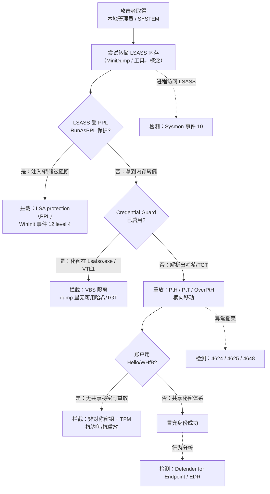

# Windows认证安全与对抗

## 概述与定位

> [!abstract] TL;DR
> 本篇从**防御视角**收束整个系列：Windows 认证链上最值钱的靶子是 **LSASS（`lsass.exe`）进程内存**——历史上它承载过明文口令、**NTLM 口令哈希、Kerberos 票据（TGT）** 以及应用存的域凭据。攻击者若能**转储（dump）LSASS 内存**并解析（`comsvcs.dll` MiniDump / `procdump` / mimikatz `sekurlsa` 等**概念**），就可能拿到这些秘密并发起**重放**：**Pass-the-Hash（PtH，拿 NTLM 哈希免密登录）、Pass-the-Ticket（PtT，重放 Kerberos 票据）、OverPass-the-Hash（用哈希换 TGT）**。微软的应对是**纵深防御**：**Credential Guard**（基于 VBS/虚拟化安全，把秘密搬进**隔离 LSA 进程 `LsaIso.exe`**、置于 VTL1，普通内核也读不到，VSM master key 受 TPM 保护）从根上让「dump LSASS」拿不到可用秘密；**LSASS as PPL（`RunAsPPL`/Protected Process Light）** 阻断对 LSASS 的代码注入与内存转储；**Windows Hello / WHfB 抗钓鱼**——用受 TPM 保护的非对称密钥，**根本不存在可窃取、可重放的共享秘密**；**生物模板保护**——模板不可导出、设备本地、经 WBF 隔离，启用 **ESS** 后更进 VBS；再加 **ELAM、LSA protection、ASR** 等。检测侧靠 **Sysmon 事件 10（进程访问 LSASS）**、安全日志 **4624/4625/4648**、以及 **EDR（Defender for Endpoint）**。**本篇不提供任何可落地的凭据窃取或绕过步骤**，只讲清「攻击面为何存在、各防护层如何拦截」。

本篇是**对抗篇**，也是系列终章。它把前十篇的知识（LSA/认证包、凭据保护、Hello、生物子系统）放到攻防语境里重新审视：**理解攻击面，是为了把防护层配对、把检测点布全**。内容与 [[38.Windows内核与驱动逆向/00.Windows内核与驱动逆向总览|Windows 内核与驱动逆向]]（LSASS/VBS/Credential Guard 的底层）、[[06.Windows凭据存储与保护]] 深度互补，读者应结合阅读。全篇机制以 learn.microsoft.com 的 Credential Guard / LSA protection / Enhanced Sign-in Security 文档为准。

## 原理与机制

### LSASS 为何是靶心

**LSASS（Local Security Authority Subsystem Service）** 是认证的中枢：交互式登录时，用户凭据经它校验、生成访问令牌与登录会话（见第 01/05 篇）。为支持**单点登录（SSO）**——让你登录一次后不必对每个资源重输口令——传统实现会在 LSASS 进程内存里**缓存可重用的认证材料**：NTLM 口令哈希、Kerberos 的 TGT、以及应用作为域凭据保存的秘密。这就是问题所在：**这些材料一旦被读出，往往可直接重放到别的机器**，无需再知道明文口令。

微软官方对这一威胁模型的描述很直白：令牌/哈希模型的一个弱点是「能访问操作系统内核的恶意软件可以翻查内存、收割当前在用的所有访问令牌，再用收割到的令牌登录其它机器、收集更多凭据」——这种「感染一台、横向蔓延全网」的手法就是 **pass-the-hash 攻击**。所以 LSASS 内存是横向移动的黄金矿脉，攻防双方都盯着它。

### 转储手法的「概念」——只讲原理，不给步骤

攻击者要用上述秘密，第一步通常是**把 LSASS 的内存转储下来**离线解析。常被提及的**概念**包括：借助系统自带的 `comsvcs.dll` 的 MiniDump 导出、用 Sysinternals 的 `procdump` 之类合法工具生成转储、或用 mimikatz 的 `sekurlsa` 模块直接从内存提取。**这里只点名「存在这类手法」以说明为何要保护 LSASS，绝不展开任何命令、参数或可复现流程。** 其共同前提是：攻击者已在目标上取得**管理员/SYSTEM 级权限**，且 LSASS **未被 PPL/Credential Guard 保护**。理解这个前提，就理解了后面每一层防护的着力点——要么**抬高读 LSASS 的门槛**（PPL），要么**让读到的东西没用**（Credential Guard），要么**让根本没有可读的共享秘密**（Hello）。

### 重放攻击：PtH / PtT / OverPtH

拿到秘密后的「变现」方式是**重放**，三种经典形态：

- **Pass-the-Hash（PtH）**：NTLM 认证只需要口令的**哈希**而非明文。攻击者拿到某账户的 NTLM 哈希后，**直接用哈希**完成 NTLM 认证、以该账户身份访问资源，全程**不需要破解出明文口令**。
- **Pass-the-Ticket（PtT）**：Kerberos 用票据证明身份。攻击者窃取内存里的 **TGT 或服务票据**，把它**注入自己的会话重放**，冒充票据主人访问服务。
- **OverPass-the-Hash（OverPtH，又称 pass-the-key）**：**混合式**——用窃得的 NTLM 哈希（或 AES 密钥）去向 KDC 换取一张**合法 TGT**，从而把「只有哈希」升级为「拥有完整 Kerberos 身份」，再走标准 Kerberos 横向移动。

三者的**共性**是「**认证材料与口令解耦**」：只要能拿到可重放的派生凭据，改不改口令都拦不住（改密只换明文，哈希/票据体系另说）。这正是纯口令/NTLM 体系的**结构性缺陷**，也是为什么最终答案要指向「消灭可重放的共享秘密」（Hello/WHfB）。

## 纵深防护逐层拆解

没有单一银弹，微软的策略是**层层设卡**：抬高门槛、让赃物失效、消灭秘密、再加监控。逐层看：

### 第一层：Credential Guard —— 让 dump 到的东西没用

**Credential Guard（凭据保护，即 LSA Credential Isolation）** 是最核心的一层。它用 **VBS（Virtualization-Based Security，基于 Hy-V 虚拟机监控程序的虚拟化安全）** 建一个**操作系统内核也进不去**的隔离区：

- 启用后，OS 里的 LSA 进程（`lsass.exe`）会与一个**隔离 LSA 进程 `LsaIso.exe`（isolated LSA process）** 通信，**NTLM 哈希、Kerberos 派生凭据等秘密改由 `LsaIso.exe` 在 VBS 保护的隔离环境（VTL1 / Virtual Secure Mode）里存储与处理**，普通操作系统（含 Ring0 内核、驱动）**访问不到**；`lsass.exe` 只能通过 RPC 向它「请求服务」，拿不到原始秘密。
- 为安全计，隔离 LSA 进程**不加载任何设备驱动**，只装少量经签名校验的安全二进制。
- 秘密在内存中由虚拟机监控程序（hypervisor）用 **VSM** 隔离；在支持 TPM 2.0 的硬件上，需持久化的 VSM 数据由 **VSM master key** 保护，而该 key 受 **TPM** 保护，确保秘密只能在可信环境访问。
- 效果：**即便攻击者拿到管理员权限、成功 dump 了 `lsass.exe`，也拿不到可重放的 NTLM 哈希/TGT**——PtH/PtT 的「弹药」被断供。

配置要点（防御方）：`HKLM\SYSTEM\CurrentControlSet\Control\DeviceGuard` 的 `EnableVirtualizationBasedSecurity=1` 开 VBS；`HKLM\SYSTEM\CurrentControlSet\Control\Lsa` 的 `LsaCfgFlags`（1=带 UEFI 锁启用，2=不带锁启用）开 Credential Guard。**Windows 11 22H2 起，满足要求的设备默认启用 VBS 与 Credential Guard**（仅支持 64 位 Secure Boot 设备）。验证用 `msinfo32` 看「Virtualization-based Security Services Running」是否含 Credential Guard，或 PowerShell 查 `Win32_DeviceGuard` 的 `SecurityServicesRunning`（**不建议**只靠任务管理器看 `LsaIso.exe` 是否在跑来判断）。

### 第二层：LSASS as PPL —— 抬高读取门槛

**LSA protection / `RunAsPPL`（把 LSASS 作为 Protected Process Light 运行）** 是与 Credential Guard **互补**的一层：它把 LSA 进程**隔离进一个受保护容器**，**阻断非可信代码向 LSA 注入、以及对 LSA 进程的内存转储**。也就是说，PPL 直接抬高「打开/读取 LSASS」这一步的门槛，让常规的 dump 手法失效（除非再叠加内核级绕过，那又会撞上 HVCI/驱动签名等其它层）。

配置在 `HKLM\SYSTEM\CurrentControlSet\Control\Lsa` 设 `RunAsPPL`。**Windows 11 起 LSA protection 默认启用**。验证：事件查看器 **Windows Logs → System** 找 **WinInit 事件 12：`LSASS.exe was started as a protected process with level: 4`**，即表示 LSA 以受保护模式启动。PPL 与 Credential Guard 可**同时启用**、互为补充——一个让「读不到」，一个让「读到也没用」。

### 第三层：Windows Hello / WHfB —— 从根上消灭可窃取的共享秘密

前两层是「保护秘密」，Hello 走的是更彻底的路——**让秘密不存在**。**Windows Hello / Hello for Business（WHfB）** 用**非对称密钥对**认证（见第 07 篇）：私钥由 **TPM** 保护、不可导出、绑定设备；认证时用私钥签名挑战，**服务器只见公钥**。于是：

- **没有可被 dump、可被重放的共享秘密**——不像口令/哈希那样「知道就能冒充」，攻击者即便拿到公钥也无用。
- **抗钓鱼、抗重放**：私钥不出 TPM，钓鱼站点骗不到能复用的东西；每次挑战不同，重放无效。
- **PtH/PtT 从源头被削弱**：无共享秘密即无「哈希/票据可传」。这也是「无密码（passwordless）」的安全内核所在。

即便用 PIN 而非生物，凭据也存在受 VBS 保护的安全容器里，防管理员级攻击。**Hello 才是对「凭据窃取」这一类问题的结构性答案**——前两层是补丁，这层是换赛道。

### 第四层：生物模板保护 / ESS —— 别让「不可更换的秘密」泄露

生物特征不可更换（见第 09 篇），故模板保护要求更高：**模板不可导出、设备本地存储、经 WBF 服务隔离**（应用只拿 `WINBIO_IDENTITY` 与判定，摸不到原始特征）。启用 **ESS（Enhanced Sign-in Security）** 后更进一层——用 **VBS + TPM 2.0** 把生物数据与匹配**隔离进受保护环境、并加密数据通道**：

- **人脸**：人脸算法受 VBS 保护、与系统其余部分隔离；hypervisor 划出受保护内存区，只允许摄像头写入，形成从摄像头到匹配算法的**隔离通路**；人脸模板在 VBS 内生成、闲时用只有 VBS 可访问的密钥加密后落盘。
- **指纹**：ESS 只支持 **match-on-sensor（芯片内匹配）** 的指纹传感器——传感器带微处理器与存储，把匹配与模板存储**用硬件隔离**；传感器出厂烧入 **Microsoft 签发的证书**，由跑在 VBS 里的生物组件校验并用 **Secure Device Connection Protocol** 建安全会话，从而抵抗**样本注入、重放、篡改**（活体检测/Liveness 亦属此列）。
- 隔离的 trustlet 如 `bioiso.exe`、`ngciso.exe`；人脸还依赖固件里的 **SDEV（Secure Devices）ACPI 表**。这正是第 10 篇 V4 引擎接口（`CreateKey`/`IdentifyFeatureSetSecure`、match-on-chip）在安全语境下的意义。

### 第五、六层：ELAM / LSA protection / ASR 等辅助层

- **ELAM（Early Launch Anti-Malware）**：让反恶意驱动**先于**其它启动型驱动加载，抢在恶意驱动前建立信任评估，保护启动早期链路。
- **LSA protection**：如上（PPL），Win11 默认开。
- **HVCI / 内存完整性**：VBS 之上的内核代码完整性，防未签名/被篡改驱动加载（挡「下内核绕 PPL」这条路）。
- **ASR（Attack Surface Reduction）规则**：其中有专门「阻止从 LSASS 窃取凭据」的规则，作为策略层加固。
- **Remote Credential Guard**：RDP 时把 Kerberos 请求**重定向回发起端**，凭据及其派生物**不经网络传到目标机**，目标被攻陷也不泄露管理员凭据。

### 攻击路径 vs 防护层拦截点

## 工具视角与实战

**检测与取证（蓝队视角）**是本篇落地的重点：

- **Sysmon 事件 ID 10（ProcessAccess）**：监控**哪个进程以什么访问权限打开了 `lsass.exe`**。对 LSASS 的可疑句柄请求（如带 `PROCESS_VM_READ`）是转储行为的强信号，配好 Sysmon 规则（针对 `TargetImage` 为 lsass 的访问）能早期告警。
- **安全日志 4624 / 4625 / 4648**：`4624` 成功登录、`4625` 失败登录、`4648`「使用显式凭据的登录」。重放攻击常表现为**异常的登录类型、异常源主机、或显式凭据登录激增**；结合登录类型（3 网络、9 NewCredentials 等）能识别 PtH/OverPtH 的痕迹。
- **EDR / Defender for Endpoint**：对「凭据窃取」有专门的行为检测与告警，覆盖 LSASS 访问、可疑派生进程、横向移动模式；配合 ASR「阻止从 LSASS 窃取凭据」规则形成拦截+告警闭环。
- **验证防护是否真生效**：Credential Guard 用 `msinfo32` 或 `Win32_DeviceGuard` 的 `SecurityServicesRunning` 确认；LSA protection 用 WinInit 事件 12（level 4）确认；ESS 用 Biometrics/Operational 日志的 1108 事件看传感器是否隔离在 **Virtual Secure Mode**。**配了不等于生效，务必用日志/查询实证。**

实战心法：**把防护层与检测点配对**——PPL+CG 断供弹药、Sysmon 10 抓转储动作、4648/4624 抓重放、EDR 兜底行为；再用 Hello/WHfB 从体系上把「共享秘密」这一类攻击面逐步退役。

## 安全性与正确使用

> [!caution] 合规边界（务必遵守）
> 本篇一切内容仅用于**防御、检测、安全研究与教育**，且只应在**你自有或已获明确书面授权的环境**中实践。**严禁**将这里对攻击面（LSASS 转储、PtH/PtT/OverPtH、mimikatz/procdump 等）的**原理性描述**用于针对**他人或生产系统**的未授权攻击。本文**刻意不提供任何可直接落地的凭据窃取、内存转储或防护绕过步骤/命令/参数**——凡涉及攻击手法处，一律停留在「存在此类手法、原理如此」的概念层面，以解释「为何要防、如何拦截」。将安全知识用于未授权入侵可能触犯法律并造成实质损害；请始终以防守方身份、在合规前提下使用本篇。

除上述合规底线外，防御方的正确使用要点：

- **纵深部署、逐项验证**：Credential Guard、LSA protection（`RunAsPPL`）、ESS、HVCI、ASR 尽量都开，且**逐项用日志/查询确认生效**（配置 ≠ 生效）。单靠一层不够——PPL 可能被内核级手法挑战，故需 CG 兜住「读到也没用」。
- **向无密码迁移**：把「消灭可窃取的共享秘密」作为长期方向，推进 **Windows Hello for Business / passkey**（第 07/08 篇），从体系上退役 PtH/PtT 赖以生存的共享秘密。
- **最小权限、防提权**：上述攻击的前提多是**本地管理员/SYSTEM**。收紧本地管理员、隔离特权账户（如分层管理、Remote Credential Guard 保护 RDP 凭据）能直接抽掉攻击前提。
- **别把检测当摆设**：Sysmon 10、4624/4625/4648、EDR 要真正接入 SIEM 并配告警与响应，而非只采集不看。
- **官方仍提醒**：Credential Guard 虽强，持久威胁会转向新手法，**不可只依赖单一缓解**，要与整体安全架构（补丁、分段、监控、身份治理）配合。

## 小结

Windows 认证对抗的主线，是一场围绕「**可重放的共享秘密**」的攻防：攻击者盯着 **LSASS 内存**里的 **NTLM 哈希、Kerberos 票据**，用**转储**取得、用 **PtH / PtT / OverPtH** 重放来横向移动；防守方则层层设卡——**LSASS as PPL（`RunAsPPL`）** 抬高读取门槛、**Credential Guard（VBS + 隔离 LSA `LsaIso.exe` + TPM 保护的 VSM key）** 让 dump 到的东西失效、**Windows Hello / WHfB** 用受 TPM 保护的非对称密钥**从根上消灭共享秘密**、**生物模板保护 + ESS** 守住不可更换的生物特征、再以 **ELAM / HVCI / ASR / Remote Credential Guard** 加固周边；检测侧用 **Sysmon 10、4624/4625/4648、EDR** 布网。看清「攻击面为何存在、每层如何拦截」，并守住**合规与防御**的边界，就把这个系列从「怎么写认证代码」升华到了「怎么让认证真正安全」。至此，Windows 认证与生物识别编程系列十一篇终——从登录架构、凭据提供程序、LSA/SSPI、凭据保护，到 Hello/WebAuthn、WBF/WinBio、WBDI 驱动，最后落到这场攻防的收束。

## 相关阅读

- Credential Guard overview / How it works（VBS、LsaIso.exe、VSM）— https://learn.microsoft.com/windows/security/identity-protection/credential-guard/
- Configuring Additional LSA Protection（`RunAsPPL`、WinInit 事件 12）— https://learn.microsoft.com/windows-server/security/credentials-protection-and-management/configuring-additional-lsa-protection
- Windows Hello Enhanced Sign-in Security（ESS、VBS、match-on-sensor）— https://learn.microsoft.com/windows-hardware/design/device-experiences/windows-hello-enhanced-sign-in-security
- How Windows uses the TPM（Credential Guard 与 pass-the-hash）— https://learn.microsoft.com/windows/security/hardware-security/tpm/how-windows-uses-the-tpm
- 本库：[[00.Windows认证与生物识别编程总览]]、[[06.Windows凭据存储与保护]]、[[07.WindowsHello与HelloforBusiness架构]]、[[38.Windows内核与驱动逆向/00.Windows内核与驱动逆向总览|Windows 内核与驱动逆向]]
- 对照：[[29.Linux认证与登录编程/09.PAM安全陷阱与逆向视角|Linux PAM 安全]]

---

🏠 [[00.Windows认证与生物识别编程总览]] ｜ 上一篇 [[10.WBDI生物识别驱动与适配器开发]] ➡️
