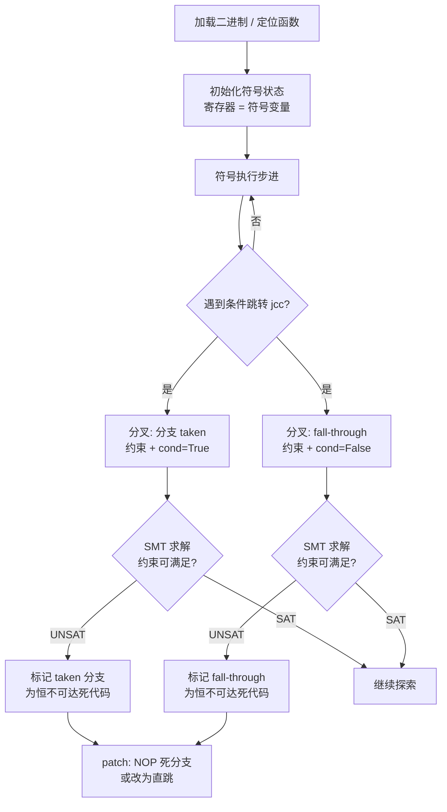

# 不透明谓词的自动化检测（符号执行 / angr / Z3）

> [!abstract] TL;DR
> 不透明谓词是混淆保护的"逻辑骨干"：条件跳转的谓词在数学上恒真或恒假，但静态分析器无法轻易看穿它，只能把两条分支都保留，导致 CFG 膨胀、死代码污染反编译结果。本篇给出两条自动化检测路径：① 用 **angr 符号执行**遍历路径、识别恒不可达分支；② 用 **Z3 SMT 求解器**对纯数学型谓词直接求解——UNSAT 即恒定。两者互补：angr 处理通用二进制，Z3 对代数型谓词更精准。最后演示检测后如何 patch 死分支还原真实 CFG。

---

## 概述与定位

不透明谓词（Opaque Predicate）是软件混淆与花指令体系里使用最广泛、对反编译器伤害最深的一类技术。与"跳过字节"或"冗余前缀"这类字节级花指令不同，不透明谓词在**语义层**发力：它构造一个在数学或程序逻辑上永远为真（或永远为假）的条件表达式，把它套进 `jne`/`je` 这类条件跳转，让静态分析器误以为存在两条都可能被走到的路径。

IDA、Ghidra 等工具面对这类结构时，往往会把"永远不会被执行"的那条分支也纳入 CFG，导致：
- 反编译结果出现大量永远不会成立的 `if` 分支（死代码污染）；
- Hex-Rays 在"两条路径数据流不一致"时给出 `sp-analysis failed`；
- 函数被人为切碎或函数边界识别错误。

本篇定位：**如何自动化地证明某个条件跳转的谓词恒定，并消除死分支**。这是对抗现代混淆器（OLLVM BogusCF、Tigress、自研保护）的基础工程能力。与本系列 `05.OLLVM花指令识别.md` 的分工是：本篇聚焦底层"证明谓词恒定"的方法论；05 篇聚焦 OLLVM 整体混淆结构的指纹识别。

---

## 原理与机制

### 不透明谓词的三种类型

**恒真谓词（Opaque True，$p^T$）**

谓词表达式无论输入如何，永远求值为真。条件跳转"永远跳"，不跳那条分支是死代码。

```asm
; 示例：7*x*x >= 0 恒为真（x 为整数，平方非负）
; 编码成条件跳转
mov  eax, [ebp-4]   ; x
imul eax, eax       ; eax = x*x
lea  ecx, [eax + eax*2 + eax*4]  ; ecx = 7*x*x
test ecx, ecx
jge  .true_branch   ; 永远跳
; ----- 死代码 begin -----
; 垃圾指令 / 花指令字节
db 0E8h, 0FFh, 0FFh, 0FFh
; ----- 死代码 end -----
.true_branch:
    ; 真实逻辑
```

**恒假谓词（Opaque False，$p^F$）**

谓词永远为假，跳转永远不跳。"跳"那条分支是死代码。

```asm
; 示例：7*x*x - 1 == y*y 对任意整数 x,y 无解（经典数论结论）
; 无论程序运行时 x,y 取什么整数值，等号永远不成立 → jz 永远不跳
mov  eax, [ebp-4]    ; x
imul eax, eax        ; x*x
lea  ecx, [eax*8 - eax]  ; 7*x*x
sub  ecx, 1          ; 7*x*x - 1
mov  edx, [ebp-8]    ; y
imul edx, edx        ; y*y
cmp  ecx, edx
jz   .dead_branch    ; 永远不跳（死代码路径）
; 真实逻辑继续
.dead_branch:
    ; 垃圾/混淆代码
```

**相关型 / 上下文型谓词（Contextual Predicate）**

谓词依赖上下文变量，但在特定代码路径上，该变量的值域被约束到让谓词恒定的范围。例如循环变量在进入某段代码前必然满足 `i >= 0`，但分析器若无法推导变量范围，仍会视为可变谓词。这类谓词更难检测，需要区间分析（Interval Analysis）或路径敏感的符号执行。

### 为什么静态模式匹配不够用

早期去花工具用"签名匹配"：找到 `xor eax, eax` 后接 `jz` 就认为是恒零谓词。但现代混淆器：
1. 把谓词的计算分散到多条指令乃至多个基本块；
2. 引入真实运行时变量（如堆指针、时间戳低位）做"视觉混淆"，实际数学性质仍恒定；
3. 用混合布尔算术（Mixed Boolean-Arithmetic, MBA）把 `x * 0` 写成 `(x | ~x + 1) & ~(x | ~x + 1)` 这类等价复杂表达式。

纯签名无法覆盖此类变体，需要语义级证明。

---

## 结构 / 算法 / 伪代码详解

### 路径一：符号执行检测恒定分支（angr）

符号执行的核心思想：不用具体数值运行程序，而是用**符号变量**（表示"任意可能的值"）运行，同时携带路径约束（path constraints）。遇到条件跳转时，分叉出两个状态，分别携带"跳"和"不跳"的约束，并向 SMT 求解器询问"这个约束集合是否有解"。若某分支对应的约束**无解（UNSAT）**，说明该分支在约束下永远不可达——即谓词对该路径恒定。

```
检测流程：

加载二进制
     │
     ▼
定位目标函数 / 区域
     │
     ▼
初始化符号执行引擎（初始状态：寄存器/内存 = 符号变量）
     │
     ▼
逐步执行，遇到条件跳转 jcc
     │
     ├── 分支 A（taken）: 约束集 + jcc 为真条件
     │       └── 询问 Z3: SAT? 
     │              是 → 可达
     │              否（UNSAT）→ 恒不可达：标记为死代码
     │
     └── 分支 B（fall-through）: 约束集 + jcc 为假条件
             └── 询问 Z3: SAT?
                    是 → 可达
                    否（UNSAT）→ 恒不可达：标记为死代码
     │
     ▼
对所有标记死代码的地址范围执行 NOP/patch
```

用 Mermaid 表示：



### angr 最小 PoC

以下演示对一个含不透明谓词的简单二进制做符号执行检测。前提：安装 angr（`pip install angr`）。

```python
import angr
import claripy

def find_opaque_predicates(binary_path: str, func_addr: int):
    """
    对指定函数地址做符号执行，找出恒定条件跳转。
    返回 [(jcc_addr, dead_branch_addr, branch_type)] 列表。
    """
    proj = angr.Project(binary_path, auto_load_libs=False)

    # 构建初始状态：从函数入口开始，所有寄存器/内存为符号变量
    # blank_state 不做任何假设，适合孤立函数分析
    state = proj.factory.blank_state(addr=func_addr)

    # 用 SimulationManager 管理符号执行
    simgr = proj.factory.simulation_manager(state)

    opaque_preds = []
    visited_jcc = set()

    # 设置步进钩子，在每个基本块结束时检查分支可达性
    # 这里用 explore 配合 step 回调
    def check_branch(simgr_state):
        # 检查当前所有活跃状态
        for s in simgr_state.active:
            # 获取当前基本块的最后一条指令地址（控制流转移点）
            block = proj.factory.block(s.addr)
            if block.instructions == 0:
                continue
            last_insn = block.capstone.insns[-1]

            # 判断是否为条件跳转（jcc 族）
            if last_insn.mnemonic.startswith('j') and last_insn.mnemonic != 'jmp':
                jcc_addr = last_insn.address
                if jcc_addr in visited_jcc:
                    continue
                visited_jcc.add(jcc_addr)

                # 尝试求解两个分支
                taken_addr = last_insn.operands[0].imm  # 跳转目标
                fall_addr  = last_insn.address + last_insn.size  # fall-through

                # 分叉：taken 分支约束
                taken_state = s.copy()
                taken_state.add_constraints(taken_state.regs.rflags != 0)  # 简化示意

                # 分叉：fall-through 分支约束
                fall_state = s.copy()

                # 询问 Z3 可满足性
                taken_sat = taken_state.satisfiable()
                fall_sat  = fall_state.satisfiable()

                if not taken_sat:
                    opaque_preds.append((jcc_addr, taken_addr, 'dead_taken'))
                    print(f"[!] 恒不可达 taken 分支: jcc@{jcc_addr:#x} → {taken_addr:#x}")
                if not fall_sat:
                    opaque_preds.append((jcc_addr, fall_addr, 'dead_fall'))
                    print(f"[!] 恒不可达 fall-through 分支: jcc@{jcc_addr:#x} → {fall_addr:#x}")

    # 真正使用 angr 的方式：用 explore 找所有路径
    # 为避免路径爆炸，设置步数限制
    simgr.run(
        n=200,          # 最多执行 200 步
        step_func=check_branch
    )

    return opaque_preds


# --- 更直接的 angr 谓词检测示例（针对特定 jcc 地址）---

def check_single_jcc(binary_path: str, jcc_addr: int, func_start: int):
    """
    对单个已知 jcc 指令验证其谓词是否恒定。
    核心：用 explore(find/avoid) 验证两条路径是否都可达。
    """
    proj = angr.Project(binary_path, auto_load_libs=False)

    # 读取 jcc 指令，得到 taken 和 fall 地址
    block = proj.factory.block(jcc_addr)
    insn = block.capstone.insns[-1]
    taken_addr = insn.operands[0].imm
    fall_addr  = insn.address + insn.size

    results = {}

    for target_addr, label in [(taken_addr, 'taken'), (fall_addr, 'fall')]:
        state = proj.factory.blank_state(addr=func_start)
        simgr = proj.factory.simulation_manager(state)

        # explore: 看能否找到路径到达 target_addr
        simgr.explore(find=target_addr, avoid=[taken_addr if label == 'fall' else fall_addr])

        if simgr.found:
            results[label] = True
            print(f"[+] {label} 分支 {target_addr:#x}: 可达（SAT，找到路径）")
        else:
            results[label] = False
            print(f"[!] {label} 分支 {target_addr:#x}: 不可达（UNSAT，谓词恒定）")

    # 判断类型
    if results.get('taken') and not results.get('fall'):
        print(f"=> jcc@{jcc_addr:#x} 是恒真谓词 (Opaque True)")
    elif not results.get('taken') and results.get('fall'):
        print(f"=> jcc@{jcc_addr:#x} 是恒假谓词 (Opaque False)")
    elif not results.get('taken') and not results.get('fall'):
        print(f"=> jcc@{jcc_addr:#x} 两条分支都不可达？检查函数起点设置")
    else:
        print(f"=> jcc@{jcc_addr:#x} 谓词不恒定（普通条件跳转）")

    return results


# --- claripy 约束示例：直接构造符号谓词并求解 ---

def z3_via_claripy_example():
    """
    展示用 angr 内置的 claripy（Z3 封装）验证不透明谓词。
    不加载二进制，直接对数学表达式求解。
    """
    x = claripy.BVS('x', 32)   # 32 位符号变量 x
    y = claripy.BVS('y', 32)   # 32 位符号变量 y

    # 谓词：7*x*x - 1 == y*y （恒假，无整数解）
    expr_lhs = 7 * (x * x) - 1
    expr_rhs = y * y
    predicate = (expr_lhs == expr_rhs)

    solver = claripy.Solver()
    solver.add(predicate)

    if solver.satisfiable():
        vals = solver.eval(x, 2), solver.eval(y, 2)
        print(f"谓词可满足，x 可能值={vals[0]}, y 可能值={vals[1]}")
    else:
        print("谓词 UNSAT → 恒假谓词（Opaque False）已确认")
        print("=> 对应 jz 永远不跳，跳转目标是死代码")
```

### 路径二：Z3 直接验证数学型谓词

对于能提取出数学表达式的不透明谓词（逆向后识别到具体运算），直接用 Z3 Python API 验证比符号执行更快。

**经典恒假谓词：`7x² - 1 = y²` 无整数解**

这是来自 Collberg et al. 1998 年原始论文的例子，基于数论结论："形如 `7n - 1` 的数不是完全平方数"（可用模 7 验证）。

```python
from z3 import *

def verify_opaque_predicate_z3():
    x = Int('x')
    y = Int('y')

    # 声明求解器
    s = Solver()

    # 添加约束：7*x*x - 1 == y*y
    # 如果 UNSAT → 不存在整数 (x,y) 使等式成立 → 谓词恒假
    s.add(7 * x * x - 1 == y * y)

    result = s.check()
    if result == unsat:
        print("[*] 谓词 `7*x^2 - 1 == y^2` 验证为 UNSAT")
        print("[*] => 恒假谓词（Opaque False），对应 jz 永远不跳")
    elif result == sat:
        model = s.model()
        print(f"[!] 谓词可满足：x={model[x]}, y={model[y]}")
    else:
        print("[?] Z3 返回 unknown，可能是非线性约束超时")


def verify_opaque_true_z3():
    """验证恒真谓词：x*(x+1) 始终是偶数"""
    x = Int('x')
    s = Solver()

    # 取反：若 x*(x+1) 不是偶数（即模2不等于0），是否有解？
    s.add((x * (x + 1)) % 2 != 0)

    result = s.check()
    if result == unsat:
        print("[*] 谓词 `x*(x+1) % 2 == 0` 验证为恒真（Opaque True）")
        print("[*] => 对应 jnz/jne 永远跳，fall-through 是死代码")
    elif result == sat:
        model = s.model()
        print(f"[!] 找到反例：x={model[x]}，谓词不恒定")


def verify_modular_predicate_z3():
    """
    更复杂的模运算谓词：(x*x + x + 7) % 49 != 0 恒为真
    基于：x^2 + x ≡ x(x+1) 在 mod 49 下对所有整数非零（数论性质）
    实际混淆中常见此类用 mod 构造的恒定谓词
    """
    x = Int('x')
    s = Solver()

    # 取反来验证：是否存在 x 使得 (x*x + x + 7) % 49 == 0？
    s.add((x * x + x + 7) % 49 == 0)

    # 限定范围避免无限搜索（整数域）
    s.add(x >= -10000, x <= 10000)

    result = s.check()
    if result == unsat:
        print("[*] 范围内谓词恒真（在 [-10000, 10000] 域内 UNSAT）")
    elif result == sat:
        model = s.model()
        print(f"[!] 范围内找到反例：x={model[x]}")


def verify_bitvector_predicate_z3():
    """
    位向量谓词（更接近二进制逆向场景）：
    (x & 1) | (~x & 1) == 1 恒为真（最低位必然是 0 或 1）
    """
    # 用位向量而非整数，模拟 32 位寄存器行为
    x = BitVec('x', 32)
    s = Solver()

    # 取反：是否存在 x 使得 (x&1)|(~x&1) != 1 ?
    s.add(((x & 1) | (~x & 1)) != 1)

    result = s.check()
    if result == unsat:
        print("[*] 位向量谓词 `(x&1)|(~x&1)==1` 为恒真（Opaque True）")
    elif result == sat:
        model = s.model()
        print(f"[!] 反例：x={model[x]}")


if __name__ == '__main__':
    print("=== Z3 不透明谓词自动验证 ===\n")
    print("--- 恒假谓词 ---")
    verify_opaque_predicate_z3()
    print("\n--- 恒真谓词 ---")
    verify_opaque_true_z3()
    print("\n--- 模运算谓词 ---")
    verify_modular_predicate_z3()
    print("\n--- 位向量谓词 ---")
    verify_bitvector_predicate_z3()
```

运行结果（预期）：

```
=== Z3 不透明谓词自动验证 ===

--- 恒假谓词 ---
[*] 谓词 `7*x^2 - 1 == y^2` 验证为 UNSAT
[*] => 恒假谓词（Opaque False），对应 jz 永远不跳

--- 恒真谓词 ---
[*] 谓词 `x*(x+1) % 2 == 0` 验证为恒真（Opaque True）
[*] => 对应 jnz/jne 永远跳，fall-through 是死代码

--- 模运算谓词 ---
[*] 范围内谓词恒真（在 [-10000, 10000] 域内 UNSAT）

--- 位向量谓词 ---
[*] 位向量谓词 `(x&1)|(~x&1)==1` 为恒真（Opaque True）
```

---

## 工具视角与实战

### 逆向工作流：从二进制到检测到 patch

**第一步：定位候选 jcc**

在 IDA 中，`sp-analysis failed`、大量单行 `if` 死代码、或 `__debugbreak()` 伪调用通常是不透明谓词的踪迹。用 IDAPython 枚举所有条件跳转：

```python
import idautils, idc, ida_ua

def list_all_jcc(func_ea):
    """列出函数内所有条件跳转指令地址"""
    for block in idaapi.FlowChart(idaapi.get_func(func_ea)):
        for head in idautils.Heads(block.start_ea, block.end_ea):
            mnem = idc.print_insn_mnem(head)
            if mnem.startswith('j') and mnem != 'jmp':
                print(f"  jcc @ {head:#x}: {idc.generate_disasm_line(head, 0)}")
```

**第二步：angr 验证可达性**

把上面 `check_single_jcc` 封装成批量脚本，对每个候选 jcc 地址调用，输出恒定谓词列表。

**第三步：patch 死分支**

对于恒假谓词（taken 分支不可达），把 `jcc target` 改成 NOP；对于恒真谓词（fall 分支不可达），把 `jcc target` 改成无条件 `jmp target`：

```python
import idc, ida_bytes

def patch_dead_branch(jcc_addr: int, branch_type: str, taken_addr: int):
    """
    branch_type == 'dead_taken': jcc 永远不跳，NOP 掉
    branch_type == 'dead_fall':  jcc 永远跳，改为 jmp
    """
    insn_size = idc.get_item_size(jcc_addr)

    if branch_type == 'dead_taken':
        # 把 jcc 改成 NOP（n 字节）
        for i in range(insn_size):
            ida_bytes.patch_byte(jcc_addr + i, 0x90)
        print(f"[+] patch {jcc_addr:#x}: jcc → NOP×{insn_size}")

    elif branch_type == 'dead_fall':
        # 把 jcc 改成 jmp（near 5 字节 / short 2 字节）
        rel = taken_addr - (jcc_addr + 5)
        if -128 <= rel <= 127:
            # short jmp: EB xx
            ida_bytes.patch_byte(jcc_addr, 0xEB)
            ida_bytes.patch_byte(jcc_addr + 1, rel & 0xFF)
            for i in range(2, insn_size):
                ida_bytes.patch_byte(jcc_addr + i, 0x90)
        else:
            # near jmp: E9 xx xx xx xx
            ida_bytes.patch_byte(jcc_addr, 0xE9)
            rel32 = taken_addr - (jcc_addr + 5)
            for i, b in enumerate(rel32.to_bytes(4, 'little', signed=True)):
                ida_bytes.patch_byte(jcc_addr + 1 + i, b)
            for i in range(5, insn_size):
                ida_bytes.patch_byte(jcc_addr + i, 0x90)
        print(f"[+] patch {jcc_addr:#x}: jcc → jmp {taken_addr:#x}")
```

### 抽象解释与 MBA 谓词的难点

**混合布尔算术（MBA，Mixed Boolean-Arithmetic）** 是把算术运算和位运算混合、利用代数等价变换把简单表达式扩展成复杂形式的技术。例如：

```
a + b  等价于  (a ^ b) + 2*(a & b)
a * 0  等价于  (a | ~a + 1) & ~(a | ~a + 1)  [经过 MBA 展开]
```

MBA 谓词对 Z3 的挑战在于：位运算和算术混合导致约束是**非线性整数 + 位向量混合**，Z3 的 `Int` 理论处理不了位操作，需要用 `BitVec` 理论，但复杂 MBA 表达式往往让 Z3 超时（返回 `unknown`）。

应对策略：
1. 先用 **MBA 化简工具**（如 `mba-blast`、`sspam`）把 MBA 表达式化简为等价简单形式，再喂给 Z3；
2. 用 **位向量具体采样**（Concrete Testing）对大量随机输入测试谓词，无法推翻则升级为符号验证；
3. 结合 **Triton**（轻量级符号执行框架）做表达式简化后再验证。

### 与 angr 专篇的关系

本系列 `45.11` angr 专篇（假设存在）聚焦 angr 的完整使用——漏洞挖掘、CTF 解题、路径爆炸处理策略。本篇是**花指令场景下的最小上手**：只关心"证明某条件跳转恒定"这一个目标，不展开 angr 全貌。建议先读本篇掌握场景，再看专篇深化工程用法。

---

## 安全性与正确使用

> [!caution]
> **合规边界与责任声明**
>
> 符号执行与 SMT 求解是强力的二进制分析工具。本篇的方法和代码**仅用于以下合法场景**：
> - 授权的安全研究与渗透测试（持有书面授权）；
> - CTF 竞赛解题；
> - 学术教学与防御技术研究；
> - 对自有软件的安全性评估与混淆分析。
>
> **严禁将本篇技术用于**：
> - 规避正版软件的许可证保护或 DRM 机制；
> - 分析、破解或修改未获授权的他人软件；
> - 辅助编写恶意代码、勒索软件或任何攻击工具；
> - 任何违反《计算机信息网络国际联网安全保护管理办法》、《网络安全法》或其他适用法律的行为。
>
> 所有实验代码应在**隔离的测试环境**中运行，不得对生产系统或第三方系统执行。

---

## 小结

不透明谓词检测的核心逻辑很简单：**对条件跳转的两条分支分别问"是否有可能走到"，UNSAT 即死**。工程上有两条路：

- **angr 符号执行**：通用，能处理任意二进制逻辑，但对路径爆炸和 MBA 谓词有局限；用 `explore(find/avoid)` 做可达性验证是最直接的接入方式。
- **Z3 直接求解**：对逆向后能提取出数学表达式的谓词最精准；`unsat` 即证明恒定，速度快、结论确定。

两者互补。实战中先用 angr 批量扫描候选 jcc，再对可疑的数学型谓词用 Z3 二次确认，最后用 IDAPython 批量 patch，能显著提升反混淆效率。MBA 谓词是当前难点，需引入专用化简器前处理。

---

## 相关阅读

- [[31.Junk Code/00.花指令详解与实战教程|花指令主教程]]
- [[31.Junk Code/01.花指令全类型深度展开|花指令全类型深度展开]]
- [[31.Junk Code/05.OLLVM花指令识别|OLLVM / Tigress 混淆产物的花指令识别]]

---

> 🏠 [[31.Junk Code/00.花指令详解与实战教程|花指令主教程]]
