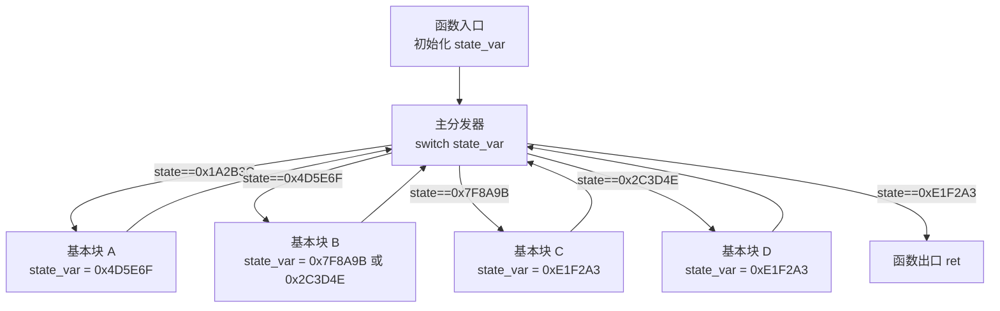

# OLLVM / Tigress 混淆产物的花指令识别

> [!abstract] TL;DR
> OLLVM（obfuscator-LLVM）和 Tigress 是学术界与工程界最具代表性的编译期混淆框架。OLLVM 三大 pass——控制流平坦化（CFF/-fla）、虚假控制流（BogusCF/-bcf）、指令替换（SUB/-sub）——各有鲜明的二进制指纹，逆向时能快速甄别。本篇聚焦**识别**：看到什么特征就能认出 OLLVM/Tigress 混淆；去平坦化的完整还原实战见 40 系列反混淆专篇。

---

## 概述与定位

OLLVM 全称 Obfuscator-LLVM，由瑞士西北应用科学大学（HEIG-VD）于 2010 年前后发布，是第一个将混淆 pass 以插件形式集成进 LLVM 编译管线的开源框架。由于 LLVM 的高可移植性，OLLVM 的混淆原理至今仍被大量商业保护工具（iOS/Android 商用混淆器、自研编译器保护方案）沿用或衍生。Tigress 是 Christian Collberg 团队（不透明谓词原始论文作者）的 C 源码级混淆工具，覆盖虚拟化、控制流混淆、数据混淆等手段，在学术评测中被广泛使用。

**本篇的定位**：从逆向工程师的视角，给出识别这两个框架混淆产物的**快速指纹**。目标读者是面对一个可疑二进制、需要在 5 分钟内判断"它是否经过 OLLVM/Tigress 混淆、用了哪个 pass"的逆向人员。去平坦化的完整工程化还原（如基于 miasm、D810 插件、deflat.py 的实战）是另一个宏大话题，本系列 40 系列反混淆专篇中展开；本篇只讲**识别与指纹**，不展开全量还原。

---

## 原理与机制

### 控制流平坦化（Control Flow Flattening，CFF / `-fla`）

CFF 是 OLLVM 最知名的 pass，也是对逆向伤害最重的一个。其核心思想：把函数内部所有基本块的**顺序执行关系打散**，引入一个**主分发器（main dispatcher）**和一个**状态变量（switch variable）**，所有基本块执行完毕后都跳回分发器，由分发器根据状态变量决定下一个执行哪个块。

**原始 CFG（未混淆）**：

```
入口 → A → B → C → D → 出口
              ↓
              E → 出口
```

**CFF 混淆后的 CFG**：

```
入口（初始化 state）
     │
     ▼
主分发器（switch state）
     ├── state==0 → A → state=1 → 跳回分发器
     ├── state==1 → B → state=2 或 5 → 跳回分发器
     ├── state==2 → C → state=3 → 跳回分发器
     ├── state==3 → D → state=6 → 跳回分发器
     ├── state==4 → E → state=6 → 跳回分发器
     └── state==5 → E → state=6 → 跳回分发器（B 的另一条出口）
```

每个原始基本块变成一个"slot"，通过 `switch` 语句路由。**状态变量通常是一个栈上整数或寄存器值，每个 slot 结尾用赋值或 XOR 更新它**。由于静态分析器无法静态确定每次到达分发器时 state 的值（它在运行时动态变化），CFG 变成**近乎全连通的 switch 图**，函数结构完全不可读。

Mermaid 示意（分发器结构）：



**注意**：OLLVM 的状态变量值通常是大整数常量（随机化），不是简单的 0、1、2……这使得肉眼在 `switch` 里看不出哪个分支对应哪个原始块。

### 虚假控制流（Bogus Control Flow，BogusCF / `-bcf`）

BogusCF 在每个基本块前插入**不透明谓词**，根据谓词结果选择走"真实"路径还是"虚假"路径（虚假路径包含垃圾基本块，内容通常是修改后的原基本块代码副本，但永远不会被执行到）。

核心：用不透明谓词（见本系列 `04.不透明谓词自动化检测.md`）生成一个恒真条件，让 `if (opaque_true)` 走真实块，`else` 走永远不可达的垃圾块。

```c
// 原始代码
int foo(int x) {
    return x * 2 + 1;
}

// BogusCF 混淆后（概念示意）
int foo_obfuscated(int x) {
    int y = /* 某个复杂表达式，实际上是运行时变量 */ ;
    if ((y * y * 7 - 1) != (some_val * some_val)) {  // 不透明谓词：恒为真
        return x * 2 + 1;  // 真实逻辑
    } else {
        return x * 3 - 5;  // 垃圾基本块，永远不执行
    }
}
```

BogusCF 混淆后的二进制指纹：大量条件跳转，其中一条分支包含语义相似但细节错误的代码副本（是原块的"克隆但被破坏的版本"），且对应的谓词表达式具有不透明谓词特征（见 04 篇）。

### 指令替换（Instruction Substitution，SUB / `-sub`）

SUB pass 把简单算术/逻辑指令替换成等价但更复杂的指令序列。例如：

| 原始指令 | 替换序列（示意）|
|----------|-----------------|
| `a = b + c` | `a = b - (~c) - 1`（利用补码恒等式）|
| `a = b - c` | `a = b + (~c) + 1` |
| `a = b & c` | `a = ~(~b | ~c)`（De Morgan）|
| `a = b ^ c` | `a = (b | c) - (b & c)` |
| `a = b | c` | `a = ~(~b & ~c)` |
| `a = !b` | `a = (b == 0) ? 1 : 0`（扩展为条件赋值）|

SUB 单独使用对逆向伤害有限（反编译器能化简很多），但与 CFF + BogusCF 组合使用，使每个 slot 内部的运算也变得复杂，增加人工分析成本。

---

## 结构 / 算法 / 伪代码详解

### CFF 识别：快速指纹三要素

**要素一：主分发器 switch 结构**

在 IDA/Ghidra 的反编译视图中，函数外层是一个巨型 `switch` 语句，case 值为大整数常量（如 `0x8A3F1B2C`）。正常代码的 `switch` case 值通常连续或稀疏但有意义；CFF 的 case 值是完全随机化的 32 位整数。

IDA 中的特征：
- 函数 CFG 视图看起来像"蜘蛛网"——几乎每个基本块都连线到同一个分发器节点；
- 分发器节点 in-degree 极高（所有 slot 都回来跳它）；
- 函数内有大量 `mov [ebp-4], 0x8A3F1B2C` 这类对局部变量赋大整数的操作（更新 state_var）。

**要素二：状态变量特征**

CFF 的状态变量在 x86 二进制中通常是：
```asm
; 函数开头初始化
mov  dword ptr [ebp-4], 0x1A2B3C4D  ; 初始状态

; 每个 slot 结尾更新
mov  dword ptr [ebp-4], 0x5E6F7A8B  ; 跳往下一个 slot
jmp  short dispatcher               ; 无条件跳回分发器
```

arm64 二进制（iOS 常见）：
```asm
; 初始化
mov  w8, #0x3C4D
movk w8, #0x1A2B, lsl #16
str  w8, [sp, #4]

; 更新
mov  w8, #0x7A8B
movk w8, #0x5E6F, lsl #16
str  w8, [sp, #4]
b    dispatcher
```

**要素三：后继块统一返回分发器**

在 IDA CFG 图中，绝大多数基本块的**唯一后继**（或 taken/fall 两条边最终都汇入）是分发器节点。这与正常代码（块间直接跳转，少有中枢节点）形成鲜明对比。

用 IDAPython 快速检测 CFF：

```python
import idaapi, idautils

def detect_cff_dispatcher(func_ea):
    """
    检测函数内是否存在 CFF 主分发器特征：
    找到 in-degree 最高的基本块，如果 in-degree > 函数总块数的 60%，
    则很可能是 CFF 分发器。
    """
    func = idaapi.get_func(func_ea)
    flowchart = idaapi.FlowChart(func)

    blocks = list(flowchart)
    if len(blocks) < 5:
        return None  # 太小的函数不考虑

    # 统计每个块的 in-degree（有多少前驱块）
    in_degree = {b.start_ea: 0 for b in blocks}
    for block in blocks:
        for succ in block.succs():
            if succ.start_ea in in_degree:
                in_degree[succ.start_ea] += 1

    # 找 in-degree 最高的块
    max_block_ea = max(in_degree, key=in_degree.get)
    max_indegree = in_degree[max_block_ea]
    total_blocks = len(blocks)

    ratio = max_indegree / total_blocks
    print(f"函数 {func_ea:#x}: 总块数={total_blocks}, "
          f"最高 in-degree={max_indegree} @ {max_block_ea:#x}, "
          f"占比={ratio:.1%}")

    if ratio > 0.5:
        print(f"  [!] 疑似 CFF 主分发器 @ {max_block_ea:#x}")
        return max_block_ea
    return None


def scan_cff_in_binary():
    """扫描整个二进制，列出所有疑似 CFF 函数"""
    for func_ea in idautils.Functions():
        result = detect_cff_dispatcher(func_ea)
        if result:
            print(f"  => 函数 {func_ea:#x} 疑似 CFF 混淆\n")
```

### BogusCF 识别：不透明谓词 + 垃圾块

BogusCF 的指纹识别依赖两个观察：
1. 条件跳转一侧的基本块是"原始代码的被破坏副本"——内容与另一侧相似但数值不同（因为 OLLVM 把原块内容复制后随机修改了一些常量）；
2. 谓词具有不透明谓词特征（见 04 篇）。

IDA 中看 BogusCF 的典型样子：

```
if ( (7 * (x * x) - 1) != (some_runtime_var * some_runtime_var) )
{
    /* 真实代码 */
    result = a + b;
    return result;
}
else
{
    /* 垃圾块：几乎和真实代码一模一样，但某个常量被改了 */
    result = a + b + 1;   // 多了 +1
    return result;
}
```

快速识别 BogusCF 的经验规则：
- `if/else` 两个分支代码"太像了"，只有一两个常量或运算符不同；
- 反编译器标注某条路径"never reached"或数据流分析警告；
- 谓词表达式含 `y * y`、`x * x`、`% 2`、`% 7` 等数论友好运算（OLLVM 内置的不透明谓词库）。

### CFF 去平坦化思路（概述）

完整去平坦化是复杂工程，本篇只给**思路骨架**，实战见 40 系列：

```
第一步：识别并定位主分发器块（用上面的 in-degree 分析）
     │
第二步：识别状态变量（分发器 switch 操作的那个局部变量/寄存器）
     │
第三步：对每个 slot（case 分支），符号执行求解"执行完这个 slot 后，
        state_var 变成什么值"→ 得到 slot 的后继 slot
     │
第四步：用 slot 的后继关系重建原始控制流图（state 转移图）
     │
第五步：按重建的 CFG 重排基本块，移除分发器和 state 赋值，输出去混淆 CFG
     │
第六步：在 IDA/Ghidra 中用 patch 或 script 重新注释函数
```

工具参考（不展开细节）：
- `deflat.py`（GitHub: cq674350529/deflat）：针对 OLLVM CFF 的 angr 去平坦化脚本；
- `D810`（IDA 插件）：Hex-Rays 反编译器插件，对 OLLVM/BCF 做微码级去混淆；
- `miasm`（Python 逆向框架）：提供符号执行 + CFG 重建，可编写自定义去平坦化；
- `Pharos`（CMU SEI）：基于 ROSE 的静态分析框架，有 CFF 检测模块。

---

## 工具视角与实战

### 快速指纹识别流程

拿到一个可疑二进制，5 分钟内判断是否 OLLVM 混淆的经验步骤：

**步骤一：看函数大小分布**

OLLVM CFF 把原本紧凑的函数展开成庞大的 switch 结构。用 IDA 的 `Functions` 窗口按大小排序——CFF 混淆的函数往往远大于其"语义复杂度"应有的大小（例如一个简单的 20 行 C 函数变成 200+ 基本块）。

**步骤二：看 CFG 形状**

在 IDA Graph View 中，CFF 函数的 CFG 形状是特征性的**"菊花"或"蜘蛛网"**：所有基本块通过箭头汇聚到一个中心节点（分发器），再从分发器辐射出去。正常函数的 CFG 是树形或 DAG 结构，罕有这种高度中心化的形状。

```python
# IDA 脚本：一键检查当前函数是否有 CFF 特征
import idaapi, idautils

def quick_cff_check():
    ea = idaapi.get_screen_ea()
    func = idaapi.get_func(ea)
    if not func:
        print("当前地址不在函数内")
        return
    detect_cff_dispatcher(func.start_ea)  # 用前面定义的函数

quick_cff_check()
```

**步骤三：搜索状态变量赋值模式**

用 IDA 的二进制搜索或 Yara 规则，查找对局部变量赋大整数常量的模式。OLLVM 生成的状态值通常在 `0x10000000`\~`0xFFFFFFFF` 范围内：

```python
# IDAPython：找函数内对局部变量赋大整数的指令
import idc, idautils, ida_ua

def find_state_var_assignments(func_ea):
    for head in idautils.Heads(*idaapi.get_func(func_ea).__iter__()):
        if idc.get_wide_byte(head) == 0xC7:  # MOV r/m32, imm32
            imm = idc.get_operand_value(head, 1)
            if imm > 0x10000000:
                print(f"  疑似状态变量赋值 @ {head:#x}: "
                      f"{idc.generate_disasm_line(head, 0)}")
```

**步骤四：Tigress vs OLLVM 的差异**

| 特征 | OLLVM (CFF) | Tigress (CFF) |
|------|-------------|---------------|
| 作用层 | LLVM IR（编译期） | C 源码（预处理期）|
| 输出 | 任意 LLVM 后端（x86/ARM/...） | C 源码 → 需再编译 |
| 状态变量 | 局部整数，大随机常量 | 局部整数，可配置复杂度 |
| 分发器形式 | `switch` 或 `if-else if` 链 | `switch` 或 computed goto |
| BogusCF 谓词 | 固定几种内置谓词（`y²`、`%2` 等）| 可配置，支持更多类型 |
| 可辨识度 | 较高（内置谓词模式固定）| 较低（可高度定制）|
| 常见于 | iOS/Android 商用 app、CTF 题目 | 学术论文评测 |

Tigress 特有特征：混淆后的 C 源码通常含大量 `__builtin_`、`longjmp`/`setjmp`（虚拟化 pass 用），或 `goto` 密集（goto 混淆 pass）；重新编译后，函数名有时保留 Tigress 的命名模式（如 `__tigress_init`）。

**步骤五：指令替换（SUB）识别**

SUB pass 的特征更难从单个指令判断，但有几个规律：
- 大量 `not`/`neg`/`xor` 组合出现在本应是 `add`/`sub` 的地方；
- `a & b` 被写成多步位运算；
- 反编译器输出中简单赋值变成 3\~5 行等价操作；
- 和 CFF 同时出现时，每个 slot 内部有 SUB 的痕迹。

Yara 规则（检测 OLLVM 编译产物，x86-64 ELF/PE，示意）：

```yara
rule OLLVM_CFF_Fingerprint {
    meta:
        description = "OLLVM 控制流平坦化特征（状态变量大整数赋值模式）"
        author = "geesehoward20000"
        date = "2026-07-02"

    strings:
        // MOV [rbp-N], large_imm32（状态变量赋值，挑几个常见编码）
        $state_mov_1 = { C7 45 ?? ?? ?? ?? [1-3] }
        $state_mov_2 = { C7 85 ?? ?? ?? ?? ?? ?? ?? ?? }

        // 函数内大量 JMP 回同一地址（分发器返回跳）
        $back_jmp = { EB ?? 90 }  // short jmp + 对齐 nop

    condition:
        uint16(0) == 0x5A4D  // PE
        and #state_mov_1 > 20
        and #back_jmp > 15
}
```

### 与 40 系列反混淆篇的分工

本篇（05）聚焦**识别与指纹**：给出"看到什么特征就能认定是 OLLVM/Tigress、哪个 pass"的判断方法，以及快速扫描脚本。

40 系列反混淆专篇（假设已有或将有）处理**还原实战**：如何用 deflat.py / D810 / miasm 完整去平坦化、恢复原始 CFG、清除 BogusCF 死分支，以及处理 OLLVM 和自研变体混合使用时的工程挑战。两篇相辅：先读本篇确认混淆类型，再看 40 系列执行还原。

---

## 安全性与正确使用

> [!caution]
> **合规边界与责任声明**
>
> OLLVM/Tigress 的逆向分析是强力的软件分析能力。本篇的方法和脚本**仅用于以下合法场景**：
> - 授权的安全研究与渗透测试（持有书面授权）；
> - CTF 竞赛解题；
> - 恶意代码分析与防御研究（沙箱环境中对恶意样本的逆向）；
> - 对自有软件混淆保护方案的安全性评估；
> - 学术教学目的。
>
> **严禁将本篇技术用于**：
> - 对正版商业软件进行去混淆以绕过授权验证或 DRM；
> - 对未获得授权的第三方软件进行逆向、分析或修改；
> - 辅助编写以规避检测为目的的恶意代码；
> - 任何违反《著作权法》、《网络安全法》、《计算机软件保护条例》或其他适用法律的行为。
>
> OLLVM 本身是学术开源项目，合法用于研究目的。本篇描述的是**分析和识别**已有混淆产物的方法，而非指导构建攻击性混淆器。所有实验应在**隔离环境**中进行，严禁对生产系统或第三方目标执行未授权分析。

---

## 小结

OLLVM 三大 pass 各有鲜明指纹，逆向时能快速甄别：

- **CFF（控制流平坦化）**：函数 CFG 呈"蜘蛛网/菊花"形，存在高 in-degree 的主分发器节点，大量对局部变量赋大随机整数（状态变量更新），基本块结尾统一无条件跳回分发器。这是对反编译器伤害最重的 pass，但也是最容易通过图结构特征识别的。
- **BogusCF（虚假控制流）**：大量条件跳转，一条分支含"几乎和另一条一样但局部常量被改掉"的垃圾块；谓词含 `y*y`、`%2`、`%7` 等 OLLVM 内置不透明谓词特征。
- **SUB（指令替换）**：简单运算被展开成多步等价位运算；通常与 CFF/BogusCF 联合使用，使每个 slot 内部也更难读。

Tigress 与 OLLVM 在 CFF 原理上高度相似，区别在于作用层（编译 IR vs C 源码）和谓词可定制性。去平坦化的完整工程化方案见 40 系列反混淆专篇；本篇的价值在于让分析人员以最小代价快速判断混淆类型，为后续选择正确工具节省时间。

---

## 相关阅读

- [[31.Junk Code/00.花指令详解与实战教程|花指令主教程]]
- [[31.Junk Code/01.花指令全类型深度展开|花指令全类型深度展开]]
- [[31.Junk Code/04.不透明谓词自动化检测|不透明谓词的自动化检测（符号执行 / angr / Z3）]]

---

> 🏠 [[31.Junk Code/00.花指令详解与实战教程|花指令主教程]]
