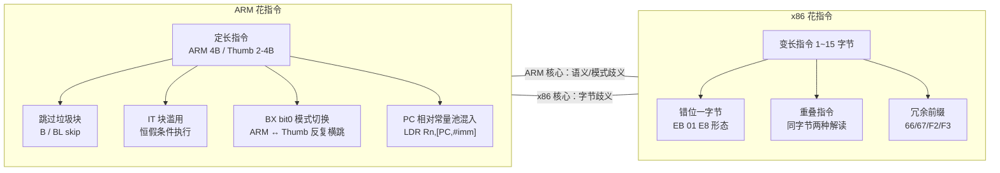

# ARM / AArch64 花指令形态

> [!abstract] TL;DR
> ARM/AArch64 指令定长（ARM 状态 4 字节、Thumb 状态 2/4 字节），不存在 x86 "错位一字节制造歧义"这一最经典的花指令根基。ARM 花指令的核心手法因此截然不同：**利用条件执行语义（IT 块）、ARM/Thumb 模式切换（BX bit0 翻转）、恒假条件跳转绕过垃圾字节块、PC 相对数据混入代码流**，以及 AArch64 的间接跳转混淆（BR/BLR）和常量池注水。分析者须在模式跟踪和数据/代码区分上下功夫，而非依赖 x86 的偏移修正思路。

---

## 概述与定位

ARM 处理器家族（包括 32 位 ARMv7 及 64 位 ARMv8/AArch64）已成为移动端安全研究的主战场：Android NDK 原生库、iOS 系统库、嵌入式固件、车载 ECU 都跑在 ARM 核心上。对应地，保护者与攻击者都在 ARM 体系结构上发展出了独特的花指令手法。

然而，ARM 花指令与 x86 花指令在**根基上就不同**：

- x86 是**变长指令**（1～15 字节），一字节的 `0xE8`（`call` 前缀）混入代码流，就能让线性扫描器从错位偏移开始解码，随即产生雪崩式的反汇编混乱。这是 x86 花指令最经典、最廉价的手法。
- ARM（A32）是**严格 4 字节对齐定长指令**；Thumb（T16）是 2 字节定长；Thumb-2（T32）是 2+2=4 字节混合，但解码起点有 2 字节边界约束。AArch64（A64）是严格 4 字节定长。**定长指令集的字节流不存在"错位一字节"歧义**——即便插入一个 `0xE8` 字节，如果对齐不满足，反汇编器会直接报非法指令而非被错误地解码成 `call xxx`。

这意味着 ARM 花指令必须另辟蹊径，利用的是**条件执行语义、模式切换、数据/代码混合**等机制，而非字节错位。

本篇在 `31.Junk Code/` 系列中承接 [[31.Junk Code/01.花指令全类型深度展开.md|全类型展开]]（x86 为主），补充 ARM/AArch64 视角；同时与 Android 逆向场景（ART/JNI/NDK 分析）高度关联。

---

## 原理与机制

### 2.1 ARM 指令集定长带来的根本差异

ARM A32 的任意 4 字节都是合法编码空间中的某条指令（或 UNDEFINED/UDF）——不存在"解码到一半"的概念。因此：

1. **线性扫描器不会被错位一字节打乱**：每次前进恰好 4 字节，永远对齐。
2. **插入垃圾字节必须是对齐的完整指令**，否则 CPU 抛 `SIGILL`，反而更容易暴露。
3. ARM 花指令的着力点转向**控制流语义**（让某些对齐的真实指令"看起来会执行但实际不会"）和**解析器对模式/上下文的依赖**。

Thumb/Thumb-2 稍微特殊：T16 指令 2 字节对齐，T32 指令看起来是 4 字节但实际按 2 字节边界解析高半字确定宽度。这给了花指令稍多的空间（见 2.4 IT 块滥用）。

### 2.2 花指令的 ARM 适配思路

| x86 惯用手法 | x86 可行原因 | ARM 对应 / 替代方案 |
|---|---|---|
| `EB 01 E8` 错位一字节 | 变长指令，E8 被当 call 解码 | **不可行**，定长无歧义；改用跳过整块垃圾指令 |
| `push/ret` 伪跳转 | 栈操作 + ret 等价 jmp | ARM 用 `PUSH {PC}` + `POP {PC}` 或 `MOV PC, LR` 变体 |
| SEH 异常流 | Windows x86 SEH 结构 | ARM Linux 用信号处理器 / ARM 异常向量；iOS 用 ObjC 异常 |
| 不透明谓词 | 通用，算术恒真/恒假 | **完全适用**，`MOV R0,#0; CMP R0,#0; BEQ junk` |
| 重叠指令 | 字节错位 | **不适用**；Thumb T32 宽度判断可轻微利用 |

---

## 结构/算法/伪代码详解

### 3.1 类型 A：跳过垃圾字节块（B/BL 绕过型）

最直接的 ARM 花指令：在代码流中插入一个无条件跳转（`B label`），跳过紧随其后的若干字节/指令，这些字节/指令永不执行。

```asm
; ARM A32（定长 4 字节）
REAL_FUNC:
    PUSH    {R4, LR}
    B       skip_junk          ; 无条件跳过垃圾块
    ; ---- 以下 3 条是垃圾指令，永不执行 ----
    MOV     R0, #0xDEAD        ; 垃圾
    LDR     R1, [PC, #0x100]   ; 垃圾（同时混淆 PC 相对引用）
    BL      some_bad_addr      ; 垃圾（让工具误建交叉引用）
    ; ---- 跳转落点 ----
skip_junk:
    MOV     R0, #1
    POP     {R4, PC}
```

**对分析器的影响**：反汇编器如果不跟随 `B skip_junk` 而是顺序解析，会把三条垃圾指令加入函数体，并在 `BL some_bad_addr` 上建立错误的调用交叉引用，污染调用图。IDA 一般跟随无条件跳转，但 Ghidra 的某些线性分析模式可能受影响。

### 3.2 类型 B：恒假条件分支（不透明谓词 ARM 变体）

```asm
; ARM A32 恒假谓词
    MOV     R7, #0
    CMP     R7, #1          ; R7 == 1？永远假
    BEQ     dead_branch     ; 永远不跳
    ; ---- 真实代码 ----
    ADD     R0, R0, #1
    B       continue
dead_branch:
    ; ---- 垃圾指令 ----
    MOV     R0, #0xBAD1
    LDR     R1, [R0, #0]    ; 故意构造非法访问，干扰符号执行
continue:
    BX      LR
```

对 IDA 等工具：`dead_branch` 目标处的垃圾代码仍会被解析并出现在反汇编视图，产生噪音；静态数据流分析若不追踪 `R7` 的恒零性质，会把 `dead_branch` 路径当可达路径，在 `LDR R1, [R0, #0]` 处认为存在写 `R0=0xBAD1` 的路径，误判函数行为。

### 3.3 类型 C：IT 块滥用（Thumb-2 特有，分析器最头疼）

**IT（If-Then）块** 是 Thumb-2 特有的条件执行前缀。一条 `IT{T|TE|TEE|TETE}` 指令后最多跟 4 条"条件化"指令，这 4 条指令根据当前标志位选择性执行。

```thumb
; Thumb-2 IT 块花指令
    MOV     R3, #0
    CMP     R3, #0           ; Z 标志 = 1（相等）
    ITE     EQ               ; If Equal Then; Else
    MOVEQ   R0, #1           ; 若 EQ 成立（确实成立）：R0 = 1
    MOVNE   R0, #0xDEAD      ; 若 NE 成立（不成立）：永远不执行
```

**滥用形态**：

1. **多条件嵌套**：`ITTEE NE` 后接 4 条指令，只有第 1、2 条（T）在 NE 时执行，第 3、4 条（E）在 EQ 时执行。保护者人为构造恒为某一状态的标志，使"E"分支永不执行，但填入垃圾指令：

```thumb
    CMP     R5, R5           ; R5 == R5，Z 恒真
    ITTEE   EQ               ; T=EQ, T=EQ, E=NE, E=NE
    MOVEQ   R1, #1           ; 执行
    ADDEQ   R0, R0, R1       ; 执行
    MOVNE   R2, #0xDEAD      ; 永不执行（垃圾）
    BLXNE   R3               ; 永不执行（垃圾，R3 值未知 → 干扰调用图）
```

2. **IT 块跨越函数尾**：在跳转前写 `IT NE`，让跳转目标后的第一条指令被 IT 上下文"条件化"，迷惑部分解析器。

**分析器困惑点**：工具必须精确追踪 IT 状态机（当前 IT mask 的剩余位数 + 当前条件）才能正确判断哪些指令可达。部分旧版 IDA/Capstone 对 IT 块追踪不完整，会把 MOVNE/BLXNE 标注为可达并建立错误交叉引用。

### 3.4 类型 D：ARM/Thumb 模式切换混淆（最具 ARM 特色）

ARM 支持两种指令集状态：ARM（A32，4 字节）和 Thumb（T16/T32，2/4 字节）。切换方式：

- `BX Rn`：跳转到 `Rn` 指定地址，若 `Rn` 的 bit0 = 1，切换到 Thumb 模式；= 0，切换到 ARM 模式（bit0 在执行时自动清零）。
- `BLX label`：带链接的跨模式跳转。
- `BX LR`：函数返回，同时可能切换模式（若 LR bit0 = 1）。

**花指令利用形态**：

```asm
; ARM A32 段
func_arm:
    PUSH    {LR}
    ADD     R0, PC, #1      ; R0 = 当前 PC + 4 + 1 = 下一地址 | 1（bit0 置 1）
    BX      R0              ; 跳转并切换到 Thumb 模式
    ; ---- 以下 ARM 解码下是"指令" ----
    ; ---- 但实际上 CPU 已切到 Thumb，按 2 字节解码 ----
thumb_section:              ; 这里实际是 Thumb 代码
    .thumb
    MOV     R1, #0x42
    BX      LR
```

**对分析器的影响**：

1. 如果反汇编器没有检测到 `BX R0` 会切换模式（因为 R0 的值是运行时计算的，静态分析较难追踪），它会继续用 ARM（4 字节）格式解码 `thumb_section` 处的 Thumb 字节，产生错误的 4 字节指令。
2. 更隐蔽的变体：在多层 `BX` 链中多次反复横跳，让分析器难以全程追踪当前模式。

**反复横跳**（来回模式切换制造最大混乱）：

```asm
; 故意 ARM -> Thumb -> ARM -> Thumb 多次切换
arm1:
    ADR     R0, thumb1+1    ; bit0 = 1，目标是 Thumb
    BX      R0
arm1_after:                 ; ARM 解码者错误认为执行从这里继续
    .word   0xE320F000      ; "NOP" 但实际是垃圾（因为已切 Thumb）
thumb1:
    .thumb
    ADR     R0, arm2        ; bit0 = 0，目标是 ARM
    BX      R0
thumb1_junk:
    .hword  0xBF00          ; Thumb NOP，但 ARM 解码器会误读
arm2:
    .arm
    ; 真实逻辑继续...
```

### 3.5 类型 E：PC 相对数据混入代码流（常量池花指令）

ARM 的 `LDR Rn, [PC, #imm]`（PC 相对加载）允许把常量数据嵌在代码段里（称为"常量池"或"literal pool"）。编译器合法使用此特性；花指令则刻意制造假常量池：

```asm
    LDR     R0, pool_val    ; 合法加载常量
    B       skip_pool       ; 跳过常量池
pool_val:
    .word   0xE92D4FF0      ; 数据值（但字节形态等于 ARM 的 PUSH {R4-R11,LR}）
skip_pool:
    ; 真实代码继续
```

**攻击效果**：线性分析器解到 `pool_val` 处时，`0xE92D4FF0` 会被解码为 `PUSH {R4-R11,LR}`——完全合法的 ARM 指令！这会产生假的函数入口点和假的栈帧，导致分析器认为这里是另一个函数的 prolog。

更高级的变体：把一块 `0xE3A0` 开头的立即数装载序列藏进常量池，IDA 会把整个常量池当作独立函数体分析。

### 3.6 AArch64 花指令（A64 特殊形态）

AArch64（ARMv8-A 的 64 位状态）无 Thumb、无 IT 块，指令严格 4 字节对齐。花指令空间比 ARMv7 窄，但仍有以下手法：

**① 间接跳转混淆（BR/BLR）**

```asm
// AArch64
    ADRP    X9, func_real@PAGE
    ADD     X9, X9, func_real@PAGEOFF
    // 中间插若干垃圾运算（不影响 X9）
    ADD     X10, XZR, XZR    // X10 = 0，垃圾
    LSL     X10, X10, #3     // X10 = 0，垃圾
    BR      X9               // 间接跳转，静态分析需追踪 X9
```

`BR Xn`（寄存器间接跳转）让静态分析器无法直接知道跳转目标，必须做值追踪（value tracking）。配合插入"貌似影响 X9 但实际不影响"的垃圾指令，可以进一步干扰追踪精度。

**② 常量池混入**

AArch64 同样使用 `LDR X0, =value` 形式的常量池。刻意把高字节看起来像合法 A64 指令的数值塞入常量池，和 ARMv7 的手法类似。

**③ 跳过垃圾块型**

```asm
    B       real_code        // 无条件跳转
    .word   0xD65F03C0       // RET 的编码——看起来是合法函数返回，制造假函数边界
    .word   0xD503201F       // NOP 的编码
    .word   0xD2800000       // MOV X0, #0 的编码
real_code:
    ADD     X0, X0, #1
    RET
```

**④ 条件跳转 + 恒假谓词**（完全适用于 A64）

```asm
    MOV     X8, XZR          // X8 = 0
    CBZ     X8, dead         // X8 == 0？永远为真 → 跳到 dead
    // ---- 永不到达的垃圾 ----
    BLR     X19              // 假调用，干扰调用图
dead:
    // 实际上这里才是"活"的分支——但命名迷惑分析者
    ADD     X0, X0, #1
```

注意 `CBZ`（Compare and Branch if Zero）在 AArch64 是常用分支指令，不需要 flags，用于构造"X8 恒零 → CBZ 恒跳"的不透明谓词非常自然。

---

## 工具视角与实战

### 4.1 IDA Pro（ARM/Thumb 分析）

IDA 对 ARM/Thumb 模式切换有专项支持，但有局限：

- **`BX Rn` 目标是寄存器时**，若静态追踪不到 `Rn` 的精确值（如经过多次运算），IDA 会标注 `; CODE XREF: ... indirect`，不能自动标注切换后的代码类型。
- **手动切换解析模式**：选中地址 → `Alt+G`（Change Segment Register Value）→ 改 `T` 寄存器（`T=0` = ARM，`T=1` = Thumb），强制重定义后续解码模式。
- **IDAPython 批量修复 IT 块**：

```python
import idc, ida_bytes, idautils, ida_ua

def fix_it_junk(start, end):
    """扫描区间内 IT 块，将永不执行的条件指令标注为 data"""
    ea = start
    while ea < end:
        mnem = idc.print_insn_mnem(ea)
        if mnem.startswith("IT"):
            # 获取 IT 掩码位数
            it_mask = mnem[2:]  # "T", "TE", "TEE" 等
            print(f"[IT] {ea:#010x}: {mnem}")
            # 后续分析需结合 flags 状态，这里仅打印标注
        ea = idc.next_head(ea, end)
```

- **`make_code` / `del_items`**：在确认垃圾块范围后，先 `del_items(ea, DELIT_SIMPLE, size)` 取消定义，再 `create_insn(ea)` 重新解析真实指令（切换后的 Thumb 或 ARM）。

### 4.2 Ghidra（ARM 支持）

Ghidra 的 ARM 处理器模块支持 ARM/Thumb 模式切换，通过 `TMode` context register 追踪（类似 IDA 的 `T` 寄存器）。

- **`ClearFlowAndRepair`**：在 Script Manager 中运行，可修复部分因模式切换误判导致的错误代码流。
- **Python/Java 脚本**修改 `TMode`：

```java
// Ghidra Java 脚本片段
import ghidra.program.model.address.Address;
import ghidra.program.model.lang.RegisterValue;

Register tModeReg = currentProgram.getRegister("TMode");
Address fixAddr = currentProgram.getAddressFactory().getAddress("0x00012345");
// 设置 TMode=1 表示 Thumb 模式
currentProgram.getProgramContext().setRegisterValue(
    new RegisterValue(tModeReg, java.math.BigInteger.ONE),
    fixAddr, fixAddr.add(0xFF)
);
createFunction(fixAddr, null);
```

- Ghidra 对 IT 块的分析在较新版本（11.x）有改进，但复杂嵌套 IT + 恒假谓词仍可能造成误标。

### 4.3 Capstone（自写分析脚本）

Capstone 支持 ARM/Thumb/ARM64，需显式指定模式：

```python
from capstone import *
from capstone.arm import *

def disasm_arm(code, base, thumb=False):
    mode = CS_MODE_THUMB if thumb else CS_MODE_ARM
    md = Cs(CS_ARCH_ARM, mode)
    md.detail = True
    for insn in md.disasm(code, base):
        print(f"0x{insn.address:x}:\t{insn.mnemonic}\t{insn.op_str}")

def detect_mode_switch(code, base):
    """检测 BX Rn 指令，尝试追踪 Rn 的值以确定模式切换"""
    md = Cs(CS_ARCH_ARM, CS_MODE_ARM)
    md.detail = True
    for insn in md.disasm(code, base):
        if insn.id == ARM_INS_BX:
            print(f"[模式切换候选] 0x{insn.address:x}: {insn.mnemonic} {insn.op_str}")
            # 进一步追踪 op_str 中寄存器的值...
```

追踪 `ADD R0, PC, #1` 类型的 PC 相对计算可以静态推断 `R0 = (当前指令地址 + 8) + 1`（ARM 流水线 PC 超前 8 字节），从而判断 bit0 = 1 → Thumb。

### 4.4 实战案例：Android NDK so 库去花

常见 Android 加固（360 加固、梆梆、娜迦等）在 ARM 原生层插入的花指令以 **IT 块滥用 + 模式切换** 为主。

典型分析流程：

1. 用 `file` 或 `readelf -h` 确认 ELF 入口点的 `e_entry` bit0（= 1 为 Thumb）。
2. IDA 载入时确认"处理器设置"选择 `ARM Little-endian`，让 IDA 自动推断 Thumb。
3. 遇到 `PUSH {R4-R11,LR}` 后紧跟奇怪的 `IT` 序列 → 定位 IT 块，核查条件是否恒真/恒假（结合 `CMP`/`TST` 前的寄存器赋值）。
4. 恒假分支内的 `BLR R3`/`BL bad_addr` 找到后，用 IDAPython `del_items` + `patch_bytes` 替换为 `NOP`（Thumb NOP = `0xBF00`，ARM NOP = `0xE320F000`）。
5. 常量池混入：在 `LDR Rn, [PC, #imm]` 之后紧跟 `B` 的区间，将加载目标地址的内容标注为 `data`，防止 IDA 把常量池当代码解析。

---

## 安全性与正确使用

> [!caution]
> **合规边界**：本节所有技术内容（ARM/Thumb 模式切换混淆、IT 块构造、PC 相对数据混入）属于对抗反汇编的手法描述，仅面向以下合法场景：
> - **授权安全研究**：在合法授权下对目标二进制进行逆向工程分析（渗透测试授权合同、漏洞悬赏计划规则内）。
> - **CTF/逆向赛事**：竞赛题目出题、解题练习。
> - **防御性研究**：恶意样本分析、移动端安全产品研发（检测加固特征）。
> - **教学与学术**：课程实验、论文复现。
>
> **禁止用途**：
> - 将 ARM 花指令技术用于未授权的二进制修改、绕过正版软件保护、规避安全检测机制。
> - 为恶意 APK、恶意 iOS App、恶意固件程序添加混淆层，增加检测难度。
> - 在任何未获授权的目标上进行分析或修改。
>
> ARM 架构覆盖绝大多数移动设备，其上的安全技术风险面尤为广泛，研究者须严格遵守所在地法律法规（如《网络安全法》《数据安全法》《个人信息保护法》及相关计算机犯罪条款）。

### ARM 花指令与 x86 花指令对比总览



| 维度 | x86 | ARM (A32/T32) | AArch64 |
|---|---|---|---|
| 指令宽度 | 可变 1~15 字节 | ARM 4B / Thumb 2/4B | 固定 4B |
| 最核心花指令根基 | 字节错位（变长歧义） | 模式切换 / IT 块 | 间接跳转 / 恒假 CBZ |
| 错位一字节有效？ | 是（最廉价手法） | 否（定长，错位无意义） | 否 |
| 条件执行支持 | 仅 `CMOVcc` 等少数 | 全指令集条件执行（A32）+ IT 块（T32） | 部分指令，无 IT |
| 模式切换 | 保护模式/实模式（极少用于花） | ARM ↔ Thumb（花指令主战场） | 无（仅 A64）|
| 常量池混入 | 较少 | 常见（`LDR PC` 跳表）| 常见 |
| 主流分析工具支持 | 成熟 | 模式追踪有盲区 | 较成熟 |

---

## 小结

ARM/AArch64 花指令的本质与 x86 截然不同：前者依托指令集的**条件执行语义、双模式并存（ARM/Thumb）、PC 相对数据插入**；后者依托**变长指令字节歧义**。理解这一根本差异，才能在面对 Android NDK 二进制或 iOS MachO 时选对分析姿势——既不能用 x86 的"找错位偏移"思路去处理 ARM 的 IT 块，也不能忽视 AArch64 中越来越普遍的 `BR`/`BLR` 间接跳转混淆。

防御者（安全分析师、加固方案研究者）的核心能力点：

1. 模式追踪：全程维护 ARM/Thumb 状态机，`BX Rn` 时精确计算 `Rn` 的 bit0。
2. IT 块语义感知：追踪 IT mask 和 APSR 标志，识别永不执行的条件分支。
3. 数据/代码区分：`LDR Rn, [PC, #imm]` 目标处的字节是数据而非代码，不要强行解析为指令。
4. 常量池边界：函数内 `B` + 数据块 + 落点的三元组是常量池花指令的基本形态，识别后整体标注为 `data`。

---

## 相关阅读

- [[31.Junk Code/00.花指令详解与实战教程|花指令主教程]]
- [[31.Junk Code/01.花指令全类型深度展开|花指令全类型深度展开（x86 为主）]]
- [[31.Junk Code/07.去花工具链对比|去花工具链对比（IDA / Ghidra / Binary Ninja / Capstone）]]

---

> 🏠 [[31.Junk Code/00.花指令详解与实战教程|花指令主教程]]
