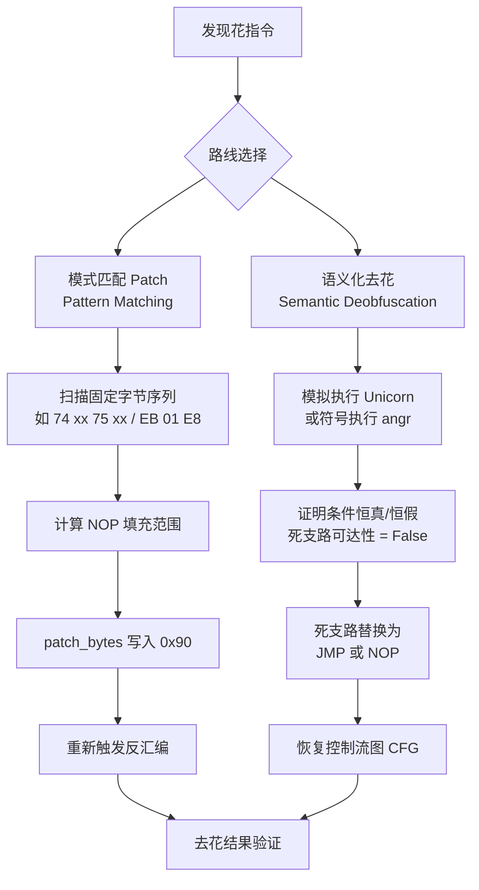

# 去花指令工具链对比（IDA / Ghidra / Binary Ninja / Capstone）

> [!abstract] TL;DR
> 去花本质上有两条路线：**模式匹配 patch**（识别固定字节序列 → NOP 或重写）和**语义化去花**（模拟/符号执行证明等价，再化简）。IDA 的强项在 `ida_bytes` + Hex-Rays microcode API，适合批量 patch 和精准插桩；Ghidra 的 PCode 语义层配合脚本适合自动化语义去花；Binary Ninja 的 LLIL/MLIL 中间表示使结构化去花最清晰；Capstone + Keystone 的组合最轻量，适合 PoC 和 CI 流水线；Unicorn/angr 则是语义化路线的极端武器，代价是运行时间。没有"最好"的工具，只有最匹配目标花指令复杂度和自动化需求的工具。

---

## 概述与定位

花指令在静态分析工具上造成的破坏——函数边界错误、调用图污染、反编译器假路径——必须在正式逆向之前被清除（去花），否则所有后续分析都建立在错误基础上。

去花是一种**面向工具的对抗操作**：它的目标不是修改程序的运行行为，而是修改程序的二进制表示，使静态分析工具能正确还原代码结构。从这个角度看，去花本质上是一种**等价变换**：

```
去花 = 找出 junk 区间 → 证明该区间对程序语义无贡献 → 用语义透明的字节（NOP/无效指令）替换
```

本篇系统梳理主流去花工具链的能力、API 和适用场景，并以一个具体花指令（`jz/jnz` 互补跳转对 + 垃圾块）为轴线，展示各工具如何实现去花，帮助分析师按需选型。

本篇与 [[31.Junk Code/04.不透明谓词自动化检测|不透明谓词自动化检测]] 高度关联：angr 的符号执行部分在两篇中均有涉及，建议结合阅读。

---

## 原理与机制

### 2.1 去花的两条路线



**模式匹配路线**的核心假设：花指令有固定的字节模式（`EB 01 E8`、`74 xx 75 xx`、`push NN; pop reg; ret` 等），只要精确匹配就能安全 patch。

- 优点：速度极快（线性扫描），实现简单，适合批量。
- 缺点：对多态花指令（同语义不同字节形态）无效；需要每种花指令各写一条规则。

**语义化路线**的核心假设：我们能证明某段代码"在所有可能输入下，执行与不执行语义等价"，则可安全删除。

- 优点：原理上可处理任意花指令（包括多态、变体）。
- 缺点：符号执行路径爆炸，Unicorn 需要精心构造初始状态，工程成本高。

实战中两条路线常配合使用：先用模式匹配去掉已知形态的花，再用语义化工具处理剩余的复杂形态。

### 2.2 基准花指令样本

以下这段 `jz/jnz` 互补跳转 + 垃圾块花指令贯穿全篇对照演示：

```asm
; x86 32位，基准花指令
; 地址 0x401000
401000: 74 05       jz  short 401007    ; 跳向 junk_end
401002: 75 03       jnz short 401007    ; 也跳向 junk_end（互补 = 恒跳）
401004: E8 90 90 90 db 0E8h, 90h, 90h, 90h  ; 垃圾字节（永不执行）
401007: 8B 45 08    mov eax, [ebp+8]    ; 真实指令
```

`jz + jnz` 跳向同一目标 = 无条件跳转等价。垃圾字节 `E8 90 90 90`（0xE8 是 `call` 的操作码）会让线性扫描器把后续字节当 `call` 的 rel32 操作数，打乱后续解码。

去花目标：将 `401000`~`401006` 整体替换为 7 个 `0x90` NOP（或替换为 `EB 05 / jmp 401007`），并重触发从 `401007` 起的反汇编。

---

## 结构/算法/伪代码详解

### 3.1 IDAPython（模式匹配 + Microcode API）

#### 3.1.1 基础：`patch_bytes` + `del_items`

IDA 提供两层 API：
- `ida_bytes.patch_byte(ea, val)` / `patch_bytes(ea, data)`：直接修改数据库中的字节。
- `ida_bytes.del_items(ea, flags, size)`：取消 IDA 对该区间的已有定义（代码/数据/字符串）。
- `idc.create_insn(ea)` / `ida_auto.auto_wait()`：重新触发反汇编并等待自动分析完成。

**基准花指令去花脚本（IDAPython）**：

```python
import idaapi, idc, ida_bytes, ida_search, ida_auto

def patch_jz_jnz_pair():
    """
    扫描全库，找 jz xx / jnz xx 互补跳转对（两者目标相同），
    将跳转对 + 垃圾字节替换为 NOP，重触发反汇编。
    """
    ea = idc.get_inf_attr(idc.INF_MIN_EA)
    end = idc.get_inf_attr(idc.INF_MAX_EA)
    count = 0

    while ea < end:
        # 匹配 jz rel8 (74 xx)
        if ida_bytes.get_byte(ea) == 0x74:
            jz_target = ea + 2 + idaapi.as_signed(ida_bytes.get_byte(ea + 1), 8)
            # 下一条是否是 jnz rel8 (75 xx)，且目标相同
            next_ea = ea + 2
            if (ida_bytes.get_byte(next_ea) == 0x75):
                jnz_target = next_ea + 2 + idaapi.as_signed(
                    ida_bytes.get_byte(next_ea + 1), 8)
                if jz_target == jnz_target:
                    # 确认目标一致 → 互补跳转，junk 区间 = [ea, jz_target)
                    junk_size = jz_target - ea
                    print(f"[去花] 0x{ea:08x}: jz/jnz 互补，垃圾 {junk_size} 字节 → NOP")
                    ida_bytes.del_items(ea, ida_bytes.DELIT_SIMPLE, junk_size)
                    ida_bytes.patch_bytes(ea, b'\x90' * junk_size)
                    idc.create_insn(ea)
                    count += 1
                    ea = jz_target
                    continue
        ea = idc.next_head(ea, end)

    ida_auto.auto_wait()
    print(f"[完成] 共去花 {count} 处")

patch_jz_jnz_pair()
```

**注意事项**：
- `del_items` 在取消定义之前必须调用，否则 `patch_bytes` 改了字节但 IDA 的指令缓存仍保留旧解析。
- `jz_target = ea + 2 + signed(offset)` 中 ARM 流水线超前不适用于 x86；x86 `rel8` 偏移相对**下条指令首地址**（= `ea + 2`）计算。
- 对 x86_64 的 `jz rel32`（`0F 84 xx xx xx xx`）需要另外处理。

#### 3.1.2 进阶：Hex-Rays Microcode API 去花

Hex-Rays 在反编译时将汇编提升到 microcode（微码）中间表示，分 `MMAT_PREOPTIMIZED`→`MMAT_LOCOPT`→...→`MMAT_FINAL` 多个阶段。通过注册 `optinsn_t` 或 `optblock_t` 优化器，可以在微码层对花指令做语义化化简，让 Hex-Rays 生成更干净的伪代码，**不修改原始字节**。

```python
import ida_hexrays as hr
import idaapi

class JunkOptimizer(hr.optinsn_t):
    """在 microcode 层识别并删除死代码块对应的微码指令"""
    def func(self, blk, ins, optflags):
        # 识别 jz/jnz 互补 → SET 同一目标 的微码模式
        # microcode 中互补跳转已被提升为 goto，这里处理残留 NOP 微码
        if ins.opcode == hr.m_nop:
            ins.swap(hr.minsn_t(hr.m_nop))  # 保持不变（示意，实际可删除）
            return 1
        return 0

def install_optimizer():
    if not hr.init_hexrays_plugin():
        print("Hex-Rays 不可用")
        return
    opt = JunkOptimizer()
    opt.install()
    print("[Microcode Opt] 已注册花指令优化器")

install_optimizer()
```

微码优化器的真正价值在处理**复杂不透明谓词**（如 `mov eax, x*x+1; cmp eax, 0; jz dead`）：在 MMAT_LOCOPT 阶段可以识别 `x*x+1 > 0` 恒真，从而化简掉 `jz dead` 分支，让反编译结果不出现死支路的 if 块。

### 3.2 Ghidra（PCode + Script）

Ghidra 的中间语言是 **PCode**（P-code），是一种 RISC 风格的虚拟机操作集，所有目标架构的指令先被提升到 PCode 再做分析。

**PCode 层去花的关键 API（Java 脚本）**：

```java
import ghidra.app.script.GhidraScript;
import ghidra.program.model.address.Address;
import ghidra.program.model.listing.*;
import ghidra.program.model.pcode.*;

public class RemoveJzJnzJunk extends GhidraScript {
    @Override
    public void run() throws Exception {
        Listing listing = currentProgram.getListing();
        InstructionIterator it = listing.getInstructions(true);

        while (it.hasNext()) {
            Instruction jzInsn = it.next();
            if (!jzInsn.getMnemonicString().equals("JZ")) continue;

            // 取下一条指令
            Instruction jnzInsn = listing.getInstructionAt(
                jzInsn.getAddress().add(jzInsn.getLength()));
            if (jnzInsn == null || !jnzInsn.getMnemonicString().equals("JNZ")) continue;

            // 检查两者目标是否相同
            Address jzTarget  = (Address) jzInsn.getOpObjects(0)[0];
            Address jnzTarget = (Address) jnzInsn.getOpObjects(0)[0];
            if (!jzTarget.equals(jnzTarget)) continue;

            // 计算垃圾区间
            int junkSize = (int)(jzTarget.getOffset()
                                 - jzInsn.getAddress().getOffset());
            byte[] nops = new byte[junkSize];
            java.util.Arrays.fill(nops, (byte)0x90);

            // 清除定义并写入 NOP
            listing.clearCodeUnits(jzInsn.getAddress(), jzTarget.subtract(1), false);
            currentProgram.getMemory().setBytes(jzInsn.getAddress(), nops);
            listing.createInstruction(jzInsn.getAddress(),
                currentProgram.getLanguage(), null, null);

            printf("[去花] 0x%s: jz/jnz 互补，已 NOP %d 字节%n",
                   jzInsn.getAddress(), junkSize);
        }
        println("去花完成");
    }
}
```

**`ClearFlowAndRepair`**：Ghidra 内置脚本，清除指定地址范围的代码流后重新分析，适合在批量 patch 后修复整个函数的 CFG。在 Script Manager 中搜索 `ClearFlow` 可直接运行。

**Ghidra Python（Jython/Ghidra 11+ 的 PyGhidra）**：

```python
# PyGhidra（Ghidra 11.x，Python 3）
from ghidra.program.flatapi import FlatProgramAPI
from ghidra.util.task import ConsoleTaskMonitor

api = FlatProgramAPI(currentProgram, ConsoleTaskMonitor())
start = api.toAddr(0x401000)
end_excl = api.toAddr(0x401007)

# 清除定义
api.clearListing(start, end_excl)
# 写 NOP
api.setBytes(start, bytes([0x90] * 7))
# 重建代码
api.createFunction(start, None)
api.disassemble(start)
```

### 3.3 Binary Ninja（LLIL/MLIL API）

Binary Ninja 将代码提升经过四层 IR：
- **Disassembly**（原始反汇编）
- **LLIL**（Low-Level IL，接近汇编，带寄存器数据流）
- **MLIL**（Medium-Level IL，变量化，识别局部变量）
- **HLIL**（High-Level IL，结构化，接近源码）

去花既可在字节层（`bv.write`），也可在 LLIL 层做值域分析。

**LLIL 值域分析去花**：

```python
import binaryninja as bn

def find_jz_jnz_junk(bv: bn.BinaryView):
    """用 LLIL 数据流分析找互补跳转对"""
    results = []
    for func in bv.functions:
        for block in func.llil:
            for insn in block:
                # LLIL if 指令 = 条件跳转
                if insn.operation == bn.LowLevelILOperation.LLIL_IF:
                    cond = insn.condition
                    # 若条件表达式的可能值集合 = {0, 1}（全集），
                    # 则两个目标都可达，但若实际是恒真/恒假...
                    possible_vals = func.get_low_level_il_at(insn.address).possible_values
                    if possible_vals.type == bn.RegisterValueType.ConstantValue:
                        const_val = possible_vals.value
                        print(f"[恒定条件] 0x{insn.address:x}: 条件恒={const_val}")
                        results.append((insn.address, const_val))
    return results

def patch_junk(bv: bn.BinaryView, junk_start: int, junk_size: int):
    """将垃圾区间替换为 NOP"""
    nops = b'\x90' * junk_size
    bv.write(junk_start, nops)
    # 重新分析受影响的函数
    for func in bv.get_functions_containing(junk_start):
        func.reanalyze()
    bv.update_analysis_and_wait()
    print(f"[patch] 0x{junk_start:x} + {junk_size} 字节已 NOP")
```

**MLIL 层识别死代码**：

```python
def find_dead_branches_mlil(bv: bn.BinaryView):
    """
    在 MLIL 层查找 if 语句中条件恒假的分支（dead branch）。
    Binary Ninja 的值域传播会自动标注 ConstantValue 的条件。
    """
    for func in bv.functions:
        mlil = func.mlil
        if mlil is None:
            continue
        for block in mlil:
            for insn in block:
                if insn.operation == bn.MediumLevelILOperation.MLIL_IF:
                    cond_vals = insn.condition.possible_values
                    if cond_vals.type == bn.RegisterValueType.ConstantValue:
                        if cond_vals.value == 0:
                            print(f"[恒假 if] 0x{insn.address:x} in {func.name}"
                                  f" → 真分支死代码")
                        elif cond_vals.value == 1:
                            print(f"[恒真 if] 0x{insn.address:x} in {func.name}"
                                  f" → 假分支死代码")
```

Binary Ninja 的 **`BinaryView.convert_to_nop`** 是最直接的 patch API（内部等价于写 `0x90`，并处理架构相关的 NOP 编码，包括 ARM 的 `E320F000`）。

### 3.4 Capstone + Keystone（自写轻量去花）

**Capstone** 是纯反汇编引擎（不建库），**Keystone** 是对应的汇编引擎，两者配合可以实现：扫描 → 识别 → 汇编替换代码 → 写回。

```python
from capstone import *
from capstone.x86 import *
import keystone

def deobf_jz_jnz(binary: bytes, base: int) -> bytes:
    """
    扫描 binary，找 jz/jnz 互补跳转对，替换为 NOP。
    返回修改后的 binary（bytes）。
    """
    md = Cs(CS_ARCH_X86, CS_MODE_32)
    md.detail = True
    result = bytearray(binary)
    insns = list(md.disasm(binary, base))

    i = 0
    while i < len(insns) - 1:
        insn_a = insns[i]
        insn_b = insns[i + 1]

        # jz = 0x74 (rel8) 或 0x0F84 (rel32)
        is_jz  = insn_a.id == X86_INS_JE
        is_jnz = insn_b.id == X86_INS_JNE

        if is_jz and is_jnz:
            target_a = insn_a.operands[0].imm
            target_b = insn_b.operands[0].imm
            if target_a == target_b:
                junk_start_off = insn_a.address - base
                junk_end_off   = target_a - base
                junk_size      = junk_end_off - junk_start_off
                if 0 < junk_size <= 64:   # 合理上限，防误匹配
                    print(f"[去花] 0x{insn_a.address:x}: "
                          f"jz/jnz → 同目标 0x{target_a:x}，"
                          f"NOP {junk_size} 字节")
                    for j in range(junk_size):
                        result[junk_start_off + j] = 0x90
                    i += 2
                    continue
        i += 1

    return bytes(result)

# Keystone 汇编替换示例：把 NOP 区间替换为精确的 JMP
def replace_with_jmp(binary: bytes, src_ea: int, dst_ea: int, base: int) -> bytes:
    ks = keystone.Ks(keystone.KS_ARCH_X86, keystone.KS_MODE_32)
    rel = dst_ea - (src_ea + 5)   # JMP rel32: 5 字节指令，偏移相对下条指令
    asm_str = f"JMP 0x{dst_ea:x}"
    encoding, _ = ks.asm(asm_str, src_ea)
    result = bytearray(binary)
    off = src_ea - base
    for j, byte in enumerate(encoding):
        result[off + j] = byte
    return bytes(result)
```

Capstone + Keystone 的优势是**零 GUI 依赖**，可嵌入 CI/CD 流水线、自动化分析框架（如 LIEF + Capstone 的二进制 patch 管线）。

### 3.5 Unicorn（CPU 模拟器：语义化去花 PoC）

Unicorn 是一个基于 QEMU 的 CPU 模拟框架，可以在沙箱中执行任意二进制片段，观察寄存器/内存状态变化。用于语义化去花的思路：

1. 把目标函数 / 片段 map 到 Unicorn 内存。
2. 多次运行，初始状态随机化（Fuzzing 风格）。
3. 若某条路径的分支条件在 N 次随机输入后始终走同一方向 → 候选恒定分支。
4. 结合 Capstone 确认该分支目标处的代码是垃圾块，再 patch。

```python
from unicorn import *
from unicorn.x86_const import *
import struct

CODE  = 0x401000
STACK = 0x7FF000
SIZE  = 0x1000

def emulate_and_check(binary: bytes, snippet_ea: int, snippet_size: int):
    """
    模拟执行 [snippet_ea, snippet_ea+snippet_size)，
    收集每次执行经过的基本块（用 hook_block）。
    """
    mu = Uc(UC_ARCH_X86, UC_MODE_32)
    mu.mem_map(CODE, SIZE)
    mu.mem_write(CODE, binary[:SIZE])
    mu.mem_map(STACK, SIZE)
    mu.reg_write(UC_X86_REG_ESP, STACK + SIZE // 2)

    visited_blocks = set()

    def hook_block(uc, address, size, user_data):
        visited_blocks.add(address)

    mu.hook_add(UC_HOOK_BLOCK, hook_block)

    # 随机化入参
    import random
    mu.reg_write(UC_X86_REG_EAX, random.randint(0, 0xFFFFFFFF))
    mu.reg_write(UC_X86_REG_EBX, random.randint(0, 0xFFFFFFFF))

    try:
        mu.emu_start(snippet_ea, snippet_ea + snippet_size, timeout=1000000, count=500)
    except UcError:
        pass

    return visited_blocks

# 多次 Fuzz，统计哪些基本块从未被访问 → 候选死代码
all_visited = set()
for _ in range(200):
    visited = emulate_and_check(open("target.bin","rb").read(), CODE, SIZE)
    all_visited |= visited

# all_blocks - all_visited = 候选永不到达的基本块
```

### 3.6 angr（符号执行：最强语义化去花，关联不透明谓词）

angr 对 `jz/jnz` 互补跳转对的处理尤为优雅：符号执行引擎会在第一个 `jz` 时创建两条路径（`jz taken`、`jz not taken`），然后在 `jnz` 时对两条路径分别 fork，但由于路径约束互补，很快会发现两条路径均收敛到同一目标，并将 `junk_block` 标注为不可达。

```python
import angr
import claripy

def angr_find_dead_blocks(binary_path: str, func_addr: int):
    proj = angr.Project(binary_path, auto_load_libs=False)
    cfg = proj.analyses.CFGFast()
    func = cfg.kb.functions.get(func_addr)
    if func is None:
        print(f"函数 0x{func_addr:x} 未找到")
        return

    # 对函数做 VFG（值流图）+ 死代码消除
    # angr 的 DDG/VSA 分析
    vfg = proj.analyses.VFG(cfg=cfg, start=func_addr,
                             context_sensitivity_level=1)

    # 收集所有被标注为 dead 的基本块节点
    dead_nodes = []
    for node in cfg.graph.nodes():
        if node.addr >= func.addr and node.addr < func.addr + func.size:
            preds = list(cfg.graph.predecessors(node))
            if not preds and node.addr != func_addr:
                dead_nodes.append(node)
                print(f"[死代码候选] 0x{node.addr:x} 无前驱 → 可能不可达")

    return dead_nodes

# angr 与不透明谓词自动化检测的联动见：[[31.Junk Code/04.不透明谓词自动化检测]]
```

angr 的完整符号执行（`proj.analyses.Reach`）可以精确证明某路径不可满足（`UNSAT`），是语义化去花的理论最强手段，但对于大型二进制会面临路径爆炸；实战中常配合**函数级切片**（只符号执行目标函数的前若干个基本块）控制开销。

---

## 工具视角与实战

### 4.1 基准花指令对照演示

以 `jz/jnz 互补跳转 + 0xE8 垃圾字节` 为例，各工具去花操作步骤对照：

| 工具 | 核心 API/操作 | 是否修改字节 | 主要输出 |
|---|---|---|---|
| **IDA + IDAPython** | `del_items` → `patch_bytes` → `create_insn` | 是（数据库） | 去花后反汇编 + 交叉引用修复 |
| **Ghidra + Java** | `clearListing` → `setBytes` → `disassemble` | 是（数据库） | 去花后代码视图 |
| **Binary Ninja** | `bv.write` / `convert_to_nop` → `reanalyze` | 是（BinaryView） | 去花后 LLIL/MLIL |
| **Capstone + Keystone** | 扫描 → 模式匹配 → bytearray 写回 | 是（文件字节） | 修改后的二进制文件 |
| **Unicorn** | 多次模拟，统计不可达块 → 外部 patch | 否（需外部工具 patch） | 候选死代码地址列表 |
| **angr** | CFGFast + VFG / 符号执行 | 否（需外部 patch） | 不可达路径证明 |

### 4.2 同一花指令在三大工具的去花操作对照

**花指令字节序列**：`74 05 75 03 E8 90 90 90 8B 45 08`

```
IDA（IDAPython）：
  # 1. 定位
  ea = ida_search.find_binary(0, BADADDR, "74 ?? 75 ??", 16, SEARCH_DOWN)
  # 2. 验证互补
  jz_target  = ea + 2 + idc.get_wide_byte(ea+1)   # 符号扩展
  jnz_target = ea + 4 + idc.get_wide_byte(ea+3)
  assert jz_target == jnz_target
  # 3. 去花
  junk_size = jz_target - ea           # = 7
  ida_bytes.del_items(ea, DELIT_SIMPLE, junk_size)
  ida_bytes.patch_bytes(ea, b'\x90'*7)
  idc.create_insn(ea)                  # 重新解码，变成 7x NOP
  idc.create_insn(jz_target)           # 确保 8B 45 08 被正确解析

Ghidra（Python/Java）：
  start = toAddr(0x401000)
  end   = toAddr(0x401006)             # inclusive
  clearListing(start, end)
  setBytes(start, [0x90]*7)
  disassemble(start)                   # 触发重分析

Binary Ninja：
  patch_start = 0x401000
  bv.convert_to_nop(patch_start, 7)   # 一行搞定
  bv.functions[...].reanalyze()
```

可以看到，Binary Ninja 的 `convert_to_nop` 是三者中最简洁的；IDA 需要最多步骤但控制最精细；Ghidra 居中。

### 4.3 工具选型建议

| 场景 | 推荐工具 | 理由 |
|---|---|---|
| 已知模式批量去花（CTF 快速通关） | IDA + IDAPython 模式匹配脚本 | 脚本生态最成熟，社区有大量现成脚本 |
| 商业加壳（VMProtect/Themida）复杂去花 | IDA Hex-Rays Microcode | Microcode 层去花不污染字节，对反编译器效果最好 |
| 跨架构去花（ARM/MIPS/PPC） | Ghidra 脚本 / Binary Ninja | Ghidra PCode 架构无关；Binja 多架构支持好 |
| 无 GUI，集成到自动化管线 | Capstone + Keystone | 无依赖，可嵌入 Python/CI 环境 |
| 不透明谓词语义化去花 | angr（配合 [[31.Junk Code/04.不透明谓词自动化检测]]） | 符号执行证明等价，理论最强 |
| 检验去花是否安全（行为等价验证） | Unicorn 模拟 | 直接执行片段，验证 patch 前后行为一致 |

---

## 安全性与正确使用

> [!caution]
> **合规边界**：去花工具链本身是中性工具；其合法性完全取决于使用对象和目的。
>
> **合法场景**：
> - 对**自己编写的**代码或**已获授权的**二进制进行去花分析（合同授权的渗透测试、漏洞研究计划、CTF 解题、学术研究）。
> - 恶意样本分析（在隔离沙箱内，目的为防御和威胁情报生产）。
> - 安全产品研发（检测加固特征、构建去混淆能力）。
>
> **禁止场景**：
> - 对未授权的商业软件进行去花以绕过版权保护或许可证验证——此行为在中国、美国（DMCA §1201）及大多数司法管辖区构成违法。
> - 将去花技术用于破解付费软件、游戏外挂、绕过 DRM。
> - 对他人的系统或应用做未授权的逆向工程，并以此为跳板进行进一步攻击。
>
> **误操作风险**：patch_bytes 操作会修改 IDA/Ghidra 数据库或原始二进制，**建议始终在副本上操作，保留原始文件备份**；batch patch 脚本运行前先在小范围验证，避免误 NOP 合法代码段。
>
> 研究者须遵守所在地法律法规及所参与平台的规则（漏洞悬赏计划条款、CTF 比赛规则等）。

---

## 小结

去花是逆向工程的必要前置步骤，工具的选择影响效率和准确度：

- **模式匹配路线**（IDA/Ghidra/Binja/Capstone）速度快、实现简单，适合已知形态花指令的批量处理；核心 API 就是"取消定义 → 写 NOP → 重触发分析"三步曲。
- **语义化路线**（Unicorn 模拟、angr 符号执行、Hex-Rays Microcode Optimizer）理论上可处理任意花指令，包括多态变体，但工程成本显著更高。
- IDA 的 `del_items + patch_bytes + create_insn` 仍是最常用的组合，原因是脚本生态最成熟。
- Ghidra 的 PCode 语义层是跨架构去花的最佳平台，尤其在 ARM/MIPS 等场景下。
- Binary Ninja 的 `convert_to_nop + reanalyze` 是 API 最简洁的选择，MLIL 值域分析也可直接服务于自动化去花决策。
- Capstone + Keystone 组合最轻量，是 CI 流水线和无 GUI 自动化分析的首选。

没有万能工具——理解每种工具在哪一层操作、优势和局限是什么，才能在面对真实样本时快速选型、高效去花。

---

## 相关阅读

- [[31.Junk Code/00.花指令详解与实战教程|花指令主教程]]
- [[31.Junk Code/01.花指令全类型深度展开|花指令全类型深度展开（含 IDAPython 去花示例）]]
- [[31.Junk Code/04.不透明谓词自动化检测|不透明谓词自动化检测（angr 符号执行联动）]]
- [[31.Junk Code/06.ARM花指令|ARM / AArch64 花指令形态]]

---

> 🏠 [[31.Junk Code/00.花指令详解与实战教程|花指令主教程]]
