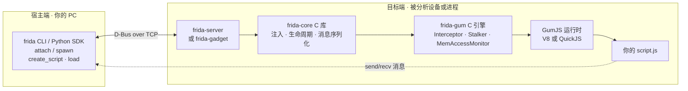

# 09 · Frida 跨平台动态插桩框架

> [!abstract] TL;DR
> Frida 是一套以 JavaScript 为脚本语言的跨平台动态插桩框架，支持 Android、iOS、Linux、Windows、macOS。
> 核心由 frida-core + Gum 引擎 + V8/QuickJS 运行时构成，通过向目标进程注入共享库并执行 JS 脚本来实现对任意函数的拦截与替换。
> `Interceptor.attach` / `Java.use` / `ObjC.classes` 是最常用的三条入口，分别对应 native、Android Java 层、iOS ObjC 层。
> `Stalker` 可做指令级代码追踪；`Gadget` 模式允许在无 root 设备上把 Frida 嵌入 App 包内使用。
> 反检测需关注：默认端口 27042、特征线程名、D-Bus 握手、内存 "frida" 字符串；防御者可通过检测这些特征发现 Frida 存在。

## 概述与定位

Frida（官方名称 "Frida Dynamic instrumentation toolkit"）是由 Ole André V. Ravnås 主导开发的开源动态插桩框架，首次发布于 2013 年。其核心设计理念是：**用 JavaScript 作为脚本语言，在运行时对任意进程进行观测与修改，而不需要源码、不需要重新编译、不需要重启进程（attach 模式下）**。

与 GDB/LLDB 这类以"停止-检查-继续"为核心范式的调试器不同，Frida 的范式是**"不停止地持续观测"**：脚本注入后，目标进程照常运行，hook handler 在目标函数入口/出口透明地执行，收集数据或修改参数/返回值，然后不中断执行流继续向前。这使得 Frida 特别适合以下场景：

- **逆向工程与协议分析**：在不脱壳、不看 native 符号表的情况下，动态观察函数调用参数与返回值，还原网络协议、解密逻辑。
- **移动端 App 分析**：Android Java 层与 native 层同时可 hook；iOS ObjC/Swift runtime 同样支持。
- **漏洞研究与 exploit 开发**：动态修改寄存器、内存、返回值，验证假设。
- **自动化测试与 fuzzing**：以编程方式驱动目标函数执行，采集覆盖率。
- **反作弊与安全研究（防御视角）**：理解攻击者会如何利用 Frida 来绕过，以便构建更健壮的检测机制。

Frida 支持的平台覆盖极广：

| 平台 | 支持情况 |
|---|---|
| Android (ARM/ARM64/x86/x64) | 完整支持，Java + native |
| iOS (ARM64) | 完整支持，ObjC + Swift + native |
| Linux (x86/x64/ARM/ARM64) | 完整支持 |
| Windows (x86/x64/ARM64) | 完整支持 |
| macOS (x64/ARM64) | 完整支持 |
| FreeBSD / QNX / barebox | 有限支持 |

---

## 原理与机制

### 整体架构

Frida 的架构分为宿主端（host side）与目标端（target side）两部分，通过消息通道通信。

```
宿主端（你的 PC）                   目标端（被分析设备/进程）
┌─────────────────────────┐         ┌────────────────────────────────┐
│  frida CLI / Python SDK  │  <───>  │  frida-server / frida-gadget   │
│  frida.attach() / spawn()│  D-Bus  │  frida-core (C library)        │
│  session.create_script() │  over   │  frida-gum (C engine)          │
│  script.load() / exports │  TCP    │  GumJS (V8 or QuickJS)         │
└─────────────────────────┘         │  Your script.js runs here      │
                                     └────────────────────────────────┘
```

用 Mermaid 表达这套宿主—目标架构与消息流向：



各层职责如下：

**frida-server**：运行在目标设备上的守护进程（Android 需要推到 `/data/local/tmp/re.frida.server` 并以 root 权限启动）。它监听来自宿主的连接请求，负责将 frida-core 注入到目标进程。

**frida-core**：核心 C 库，处理进程枚举、注入（通过 `ptrace` 或 Windows 的 `CreateRemoteThread` 等平台相关机制）、脚本运行时生命周期管理、消息序列化。

**frida-gum**：Gum 是 Frida 的底层插桩引擎，纯 C 实现。它提供：
- **Interceptor**：inline hook 引擎，使用 Stalker 的 relocator 安全地重写函数入口字节（类似 Detours 原理，但跨架构，支持 ARM Thumb/ARM64）；
- **Stalker**：指令级跟踪引擎，通过 JIT-recompile 每一个基本块来实现代码路径追踪；
- **MemoryAccessMonitor**：内存访问监控（利用硬件页保护触发异常）；
- **Symbol resolver / Module enumerator**；
- 内存读写 primitives。

**GumJS**：把 frida-gum 的能力暴露给 JavaScript 运行时。Frida 支持两种 JS 引擎：
- **V8**：功能完整、性能高，支持完整的 ES6+，但体积较大；用于 frida-server 默认场景。
- **QuickJS**：体积极小（嵌入式友好），ES2020，用于 frida-gadget 或 frida-swift 等嵌入场景。

**frida-gadget**：一个独立的共享库（`.so` / `.dylib` / `.dll`），可直接嵌入到目标 App（修改 App 的链接依赖，或在加载器搜索路径中预先放置），**无需 root，无需 frida-server**。Gadget 启动后监听 TCP 端口或从文件加载脚本。

### 两种注入模式

#### spawn 模式

```
frida-server 接收 spawn 请求
    │
    ├─ fork + execve 目标程序
    │   目标进程挂起于 pre-main（SIGSTOP 或 CreateProcess DEBUG_ONLY_THIS_PROCESS）
    │
    ├─ 注入 frida-agent.so（ptrace/WriteProcessMemory）
    │   frida-agent 初始化 GumJS 运行时
    │
    ├─ 运行 script.js
    │   ↓
    │   Interceptor.attach / Java.perform 等设置完成
    │
    └─ resume() 恢复目标进程执行
```

spawn 模式的关键优势是**可以 hook 进程启动早期**（JNI_OnLoad、static initializer、`main` 之前的代码），代价是目标进程必须由 Frida 启动。

#### attach 模式

```
frida-server 接收 attach 请求（目标 PID 或进程名）
    │
    ├─ ptrace(PTRACE_ATTACH) 或 Windows DebugActiveProcess
    │   停止目标进程（发 SIGSTOP）
    │
    ├─ mmap 可执行内存
    │   写入 shellcode：dlopen("frida-agent.so")
    │
    ├─ 劫持一个线程寄存器执行 shellcode
    │   frida-agent 加载，恢复原寄存器
    │
    ├─ 恢复目标进程运行
    │
    └─ 通过 D-Bus over TCP 通信，运行 script.js
```

attach 模式不需要控制进程启动，但无法 hook 早期初始化代码，且某些反调试保护（`prctl(PR_SET_DUMPABLE, 0)` / `ptrace(PTRACE_TRACEME)` 自占）会阻止 attach。

### 消息通道与 RPC

Frida 的宿主-目标通信基于 **D-Bus over TCP**（默认端口 27042）。脚本内调用 `send(payload)` 把数据推给宿主；宿主调用 `script.post(msg)` 把消息推给脚本。`rpc.exports` 机制让脚本导出命名函数，宿主可同步调用：

```javascript
// 脚本侧
rpc.exports = {
  readString: function(addr) {
    return ptr(addr).readUtf8String();
  }
};

// 宿主侧（Python）
result = script.exports.read_string(0xdeadbeef)
```

---

## 核心 API 与伪代码详解

### Interceptor.attach —— 函数入口/出口插桩

`Interceptor.attach(target, callbacks)` 是 Frida 最核心的 API。它在 `target`（`NativePointer`）指向的函数入口处写入一个 trampoline（小型 inline hook），当函数被调用时先跳转到 Frida 生成的 stub，执行你的 `onEnter`，再跳回原函数；原函数返回时执行 `onLeave`。

```javascript
// 示例：hook open(2) 系统调用包装，观察打开的文件路径
const openPtr = Module.findExportByName("libc.so", "open");  // Android
// const openPtr = Module.findExportByName("libc.so.6", "open"); // Linux

Interceptor.attach(openPtr, {
  onEnter: function(args) {
    // args[0] 是第一个参数（const char *pathname）
    this.path = args[0].readUtf8String();
    console.log("[open] path:", this.path);
  },
  onLeave: function(retval) {
    // retval 是返回值，可以修改
    console.log("[open] fd:", retval.toInt32(), "for", this.path);
    // 如果要屏蔽某个文件的打开：
    // if (this.path && this.path.includes("secret.db")) retval.replace(-1);
  }
});
```

**`this` 上下文**：`onEnter` 和 `onLeave` 共享同一个 `this` 对象，可以在 `onEnter` 里把需要在 `onLeave` 使用的值存到 `this.xxx`。这对于关联"调用参数"与"返回值"非常有用（如记录 `malloc` 的 size 和返回的指针）。

**`args` 类型**：`args` 是 `InvocationArguments` 数组，每个元素是 `NativePointer`，对应寄存器 / 栈上的实参（遵循目标平台 ABI）。读取方法：`.toInt32()` / `.toUInt32()` / `.toString()` / `.readUtf8String()` / `.readByteArray(n)` 等。

**`retval` 修改**：在 `onLeave` 里 `retval.replace(newValue)` 即可改变返回值，`newValue` 可以是整数或 `NativePointer`。

### Interceptor.replace —— 完全替换函数

```javascript
// 完全替换 strcmp，使其永远返回 0（相等）
const strcmpPtr = Module.findExportByName(null, "strcmp");
const origStrcmp = new NativeFunction(strcmpPtr, "int", ["pointer", "pointer"]);

Interceptor.replace(strcmpPtr, new NativeCallback(
  function(s1, s2) {
    const str1 = s1.readUtf8String();
    const str2 = s2.readUtf8String();
    console.log("[strcmp]", str1, "vs", str2);
    return origStrcmp(s1, s2);  // 仍调用原始
  },
  "int",          // 返回类型
  ["pointer", "pointer"]  // 参数类型
));
```

`Interceptor.replace` 与 `attach` 的区别：`replace` 完全取代原函数（不再执行原函数体，除非你手动调用原函数指针）；`attach` 是在原函数前后注入回调，原函数本体正常执行。

### NativeFunction 与 NativeCallback

**`NativeFunction`**：把一个地址（`NativePointer`）包装成可以从 JS 调用的函数：

```javascript
const malloc = new NativeFunction(
  Module.findExportByName("libc.so", "malloc"),
  "pointer",    // 返回类型
  ["size_t"]    // 参数类型
);
const buf = malloc(1024);
```

类型字符串对应关系：`"void"`, `"bool"`, `"char"`, `"uchar"`, `"short"`, `"ushort"`, `"int"`, `"uint"`, `"long"`, `"ulong"`, `"int8"` ... `"int64"`, `"float"`, `"double"`, `"pointer"`, `"size_t"`, `"ssize_t"`, `"utf8string"`, `"utf16string"`。

**`NativeCallback`**：创建一个可以传递给 native 代码的 JS 函数（回调）：

```javascript
const myCallback = new NativeCallback(function(ctx, data) {
  console.log("called from native with data:", data);
  return 0;
}, "int", ["pointer", "pointer"]);
```

### NativePointer 与内存操作

`ptr("0x1234abcd")` 或 `new NativePointer("0x1234abcd")` 创建指针对象。常用方法：

```javascript
const p = ptr("0xdeadbeef");
p.readU8();         // 读 1 字节无符号整数
p.readS32();        // 读 4 字节有符号整数
p.readByteArray(16); // 读 16 字节，返回 ArrayBuffer
p.readUtf8String(); // 读 null-terminated UTF-8 字符串
p.readPointer();    // 读指针宽度（4 或 8 字节）
p.writeU32(0x1234); // 写 4 字节（需要目标内存可写）
p.add(0x10);        // 指针加法，返回新 NativePointer
p.sub(4);
p.and(0xfffffff0);  // 按位运算
p.equals(otherPtr); // 比较
```

`Memory.alloc(size)` 在目标进程中分配内存，`Memory.copy(dst, src, n)` 复制，`Memory.protect(addr, size, prot)` 修改权限（`"rwx"` 等）。

### Module 枚举与符号查找

```javascript
// 列出所有已加载模块
Process.enumerateModules().forEach(m => {
  console.log(m.name, m.base, m.size);
});

// 按名查找导出符号地址
const addr = Module.findExportByName("libssl.so", "SSL_read");

// 枚举某模块的全部导出
Module.enumerateExports("libcrypto.so").forEach(e => {
  if (e.type === "function") console.log(e.name, e.address);
});

// 模糊匹配符号名（正则）
Process.getModuleByName("libssl.so").enumerateSymbols().filter(s =>
  s.name.includes("SSL_CTX")
).forEach(s => console.log(s.name, s.address));
```

### MemoryAccessMonitor

监控某段内存区域的读/写/执行访问（底层利用 mprotect 触发 SIGSEGV / VEH 异常捕获）：

```javascript
MemoryAccessMonitor.enable([{base: ptr("0x12340000"), size: 4096}], {
  onAccess: function(details) {
    // details.operation: "read" | "write" | "execute"
    // details.from: 访问发生时的指令地址
    // details.address: 被访问的内存地址
    console.log(details.operation, "at", details.address, "from", details.from);
  }
});
// 使用完毕后停止监控
MemoryAccessMonitor.disable();
```

---

## Android Java 层 Hook（Java.perform / Java.use）

在 Android 上，Frida 通过 art-bridge（对接 ART 虚拟机内部结构）实现对 Dalvik/ART 字节码的 hook，无需接触 native 指令层。

### 基本用法

```javascript
Java.perform(function() {
  // 所有 Java API 调用必须在 Java.perform 的回调内
  const Activity = Java.use("android.app.Activity");
  // 替换 onCreate 方法
  Activity.onCreate.overload("android.os.Bundle").implementation = function(bundle) {
    console.log("[Activity.onCreate] called!");
    this.onCreate(bundle);  // 调用原始实现
  };
});
```

**`Java.use(className)`** 返回一个 JS 对象，代表该 Java 类的"包装器"。访问它的方法属性得到方法包装器，对 `.implementation` 赋值即覆盖该方法的实现。如果方法存在重载，需要 `.overload(签名...)` 指定。

### 枚举运行时对象（Java.choose）

```javascript
Java.perform(function() {
  Java.choose("com.example.app.UserManager", {
    onMatch: function(instance) {
      // instance 是已存在的 UserManager 实例
      console.log("found instance:", instance, "token:", instance.getToken());
    },
    onComplete: function() { console.log("done"); }
  });
});
```

`Java.choose` 遍历 ART 堆（heap walk）找到特定类的所有存活实例，可以直接调用实例方法，非常适合在运行时"捞"出单例对象并操作。

### 绕过常见的 SSL Pinning（教学示例，仅用于自有/授权 App）

```javascript
Java.perform(function() {
  // 针对 OkHttp3 的 CertificatePinner
  const CertificatePinner = Java.use("okhttp3.CertificatePinner");
  CertificatePinner.check.overload("java.lang.String", "java.util.List").implementation = function(host, peerCerts) {
    console.log("[SSL Pin bypass] host:", host);
    // 不调用原始实现，直接返回（不抛异常）
  };
});
```

---

## iOS ObjC 层 Hook（ObjC.classes / ObjC.choose）

```javascript
// 列出所有已加载的 ObjC 类
Object.keys(ObjC.classes).slice(0, 10).forEach(name => console.log(name));

// hook NSURLSession 的 dataTaskWithRequest:
const NSURLSession = ObjC.classes.NSURLSession;
const origImp = NSURLSession["- dataTaskWithRequest:completionHandler:"].implementation;

Interceptor.attach(origImp, {
  onEnter: function(args) {
    // args[2] 是第一个显式参数（NSURLRequest *）
    const request = new ObjC.Object(args[2]);
    const url = request.URL().absoluteString().toString();
    console.log("[NSURLSession] request URL:", url);
  }
});

// 枚举堆中 UIViewController 实例（类似 Java.choose）
ObjC.choose(ObjC.classes.UIViewController, {
  onMatch: function(vc) {
    console.log("found:", vc.$className, vc.title());
  },
  onComplete: function() {}
});
```

对于 Swift 类，如果保留了 ObjC 桥接（`@objc`），仍然可通过 `ObjC.classes` 访问。纯 Swift 类需要通过符号表 + `Interceptor.attach` 在 native 层操作。

---

## Stalker —— 指令级代码追踪

Stalker 是 Frida 最强大也最"重"的特性之一。它通过**对目标代码的基本块进行 JIT 重编译**来实现指令级观测：当目标代码即将执行某个基本块时，Stalker 先把该基本块"编译"到自己管理的 code cache 中（插入回调调用点），然后执行 cache 中的副本。

```javascript
const threadId = Process.getCurrentThreadId();
Stalker.follow(threadId, {
  events: {
    call: true,  // 追踪 CALL 指令
    ret: false,
    exec: false  // exec=true 性能极差，追踪每条指令
  },
  onReceive: function(events) {
    // events 是二进制的 GumEvent 数组，用 Stalker.parse() 解析
    const parsed = Stalker.parse(events, { annotate: true, stringify: true });
    parsed.forEach(e => console.log(e));
  }
});

// 在某个时机停止追踪
Stalker.unfollow(threadId);
Stalker.garbageCollect();
```

Stalker 的典型用途：
- 动态代码覆盖率（fuzzing 反馈）；
- 追踪某个函数调用的完整指令执行路径（用于理解脱壳后的混淆代码）；
- 统计热点基本块。

代价：每个新基本块首次执行时有 JIT 开销，code cache 占内存，`exec: true` 模式下性能下降 10-100x。

---

## frida-trace 命令行工具

`frida-trace` 是 Frida 官方提供的命令行快速追踪工具，无需手写 JS 脚本即可追踪函数调用：

```bash
# 追踪 Android 上 App 的所有 Java 方法（按类名通配）
frida-trace -U -f com.example.app -j 'com.example.app.*!*'

# 追踪 Linux 进程的 open / read / write 系统调用包装
frida-trace -p 1234 -i "open" -i "read" -i "write"

# 追踪 iOS App 的 ObjC 方法
frida-trace -U -f com.example.app -m '-[NSURLSession dataTaskWithRequest:*]'
```

`frida-trace` 会自动为每个匹配的函数生成一个 handler JS 文件（放在 `__handlers__/` 目录），你可以编辑这些文件添加自定义逻辑，工具会自动热重载。

---

## Gadget 模式（无 root 部署）

当目标设备没有 root 权限时，可使用 frida-gadget：

1. 从 Frida 官方 release 页下载对应架构的 `frida-gadget.so`（Android）或 `FridaGadget.dylib`（iOS）。
2. 将其注入 App 的 APK/IPA：
   - Android：用 `apktool` 反编译 APK，在某个 activity 的 `.smali` 文件头部插入 `System.loadLibrary("frida-gadget")`；重新打包、重签名。
   - iOS：用 `insert_dylib` 把 `FridaGadget.dylib` 插入目标 binary 的 `LC_LOAD_DYLIB` 列表。
3. Gadget 启动时会暂停 App，监听 TCP 端口（默认 27042），等待宿主连接并下发脚本。

Gadget 的一个"脚本模式"变体：把配置文件与 `.js` 脚本文件跟 gadget 库放在同一目录，Gadget 启动时自动加载脚本，不需要宿主连接，完全离线运行。

---

## 工具视角与实战

### 完整 Python 宿主脚本骨架

```python
import frida, sys

PACKAGE = "com.example.target"
SCRIPT = """
Java.perform(function() {
    const SecretManager = Java.use("com.example.target.SecretManager");
    SecretManager.getToken.implementation = function() {
        const token = this.getToken();
        send({ type: "token", value: token });
        return token;
    };
});
"""

def on_message(message, data):
    if message["type"] == "send":
        print("[+]", message["payload"])
    elif message["type"] == "error":
        print("[-] Error:", message["stack"])

device = frida.get_usb_device()
pid = device.spawn([PACKAGE])
session = device.attach(pid)
script = session.create_script(SCRIPT)
script.on("message", on_message)
script.load()
device.resume(pid)
sys.stdin.read()  # 保持运行
```

### 与 DynamoRIO / QBDI / Pin 的横向对比

| 维度 | Frida | DynamoRIO | QBDI | Intel Pin |
|---|---|---|---|---|
| 脚本语言 | JavaScript | C/C++ API | C/C++ + JS binding | C/C++ Pintool |
| 跨平台 | Android/iOS/Linux/Win/macOS | Linux/Win/macOS | Android/Linux/iOS | Linux/Win/macOS |
| 移动端支持 | 一流 | 无 | 有（QBDI-JNI） | 无 |
| 插桩粒度 | 函数级+指令级(Stalker) | 指令级（DynamoRIO BBs） | 指令级 | 指令级 |
| 需要修改目标 | 否（动态注入） | 需在 DynamoRIO 下启动 | 需集成 | 需在 Pin 下启动 |
| root/权限要求 | frida-server 需 root；Gadget 不需要 | 无特殊要求 | 无特殊要求 | 无特殊要求 |
| 生产环境可观测性 | 否 | 否 | 否 | 否 |
| 开源许可 | Apache 2.0 | LGPL | Apache 2.0 | 专有（免费使用）|

Frida 的核心竞争力在于**移动端支持**和**交互式 JavaScript 脚本语言**——不需要重新编译 Pintool，打开 frida-repl 输一行 JS 就能得到结果，大幅降低逆向分析的交互成本。

---

## 安全性与正确使用

> [!caution]
> Frida 是强力的动态插桩工具，具有读写目标进程任意内存、替换任意函数、截获加密流量等能力。
> **合法边界**：仅用于自有设备/软件、明确授权的渗透测试环境、CTF 靶场、学术安全研究。
> **禁止**：在未经授权的设备/App/生产系统上使用；绕过 DRM 保护（违反 DMCA/类似法规）；用于针对真实用户的恶意软件或间谍软件开发。
> 本文所有示例均以教育/研究为目的，展示防御者理解攻击面所需的最小信息。

### Frida 特征检测（防御者视角）

了解 Frida 的检测特征，是构建反篡改保护的基础：

**1. 端口特征**：frida-server 默认监听 TCP `27042`（D-Bus AUTH 端口）。检测方法：枚举 `/proc/net/tcp`（Linux/Android）或调用 `netstat`，发现 `0.0.0.0:27042` LISTEN 状态即为高度可疑。

**2. 进程/线程名特征**：注入后目标进程会出现名为 `gum-js-loop`、`gmain`、`gdbus` 的线程（GLib 主循环）。检测方法：读取 `/proc/self/task/*/comm` 或调用 `pthread_getname_np` 枚举所有线程名。

**3. 文件系统特征**：Android 上 frida-server 通常位于 `/data/local/tmp/re.frida.server`；gadget 通常被命名为 `libfrida-gadget.so`。检测方法：枚举 `/proc/self/maps` 中的库名，或检查 `/data/local/tmp/` 目录。

**4. 内存字符串特征**：frida-agent.so 在目标进程内存中，可以通过扫描 `/proc/self/maps` 找到匿名 rx 映射，再对其内容进行 "frida"、"FRIDA"、"gum-js" 等字符串扫描。

**5. D-Bus AUTH 握手**：Frida 的进程内通信基于 D-Bus 协议，握手包含固定的 `AUTH EXTERNAL` + `BEGIN` 序列，可以通过 `ptrace`/eBPF 在 `sendmsg`/`recvmsg` 上监控。

**6. 导出符号特征**：`frida_agent_main` 是注入的 frida-agent 的入口符号。检测方法：遍历 `/proc/self/maps` 中所有 so 的 ELF symbol table，寻找该符号。

**7. Stalker 的 JIT 代码 cache 特征**：Stalker 会创建若干匿名 `rwx`（执行） mmap 区域用于存放 JIT 重编译的代码。正常 App 不应有大量匿名 `rwx` 映射。

**开发者加固建议（防御）**：
- 将检测逻辑分散在多处 native 函数中（不要集中在一处，否则被单点 hook 即绕过）；
- 检测触发时采用**延迟行为**（不立即 crash，而是在几分钟后影响核心功能），增加攻击者 bypass 成本；
- 结合代码混淆（OLLVM/PLUTO）使检测代码本身难以被静态分析定位；
- 服务端验证（行为异常 + 时序异常 + attestation）比纯客户端检测更难绕过。

### Frida 本身的稳定性风险

Frida 的 `Interceptor.attach` 是 inline hook，底层要修改目标函数的头几个字节。如果目标函数非常短（短于 trampoline 所需字节数），或者目标函数本身已经被其他工具 hook，可能导致指令破坏与崩溃。Frida 的 relocator 会尽力处理边界情况，但在高度优化的代码（Thumb2 混合指令、手写汇编）上仍有风险。

多线程竞争：`Interceptor.attach` 不是原子操作。在极短函数或高并发场景下，attach 期间其他线程可能正好执行到目标函数，造成竞争崩溃。Frida 使用了短暂的线程暂停来缓解，但并非完全无风险。

---

## 小结

Frida 的架构设计以"易用性优先"为核心：V8/QuickJS 让逆向工程师可以用 JavaScript 这门高级语言操作 native 世界，而不必每次修改 C 代码再编译再部署。`spawn`/`attach` 两种模式覆盖了"从头开始"和"不中断地附加"两大需求；`Java.perform` 和 `ObjC.classes` 把 Android/iOS 两大移动平台的运行时细节透明地包裹起来。

从防御角度看，Frida 的多个稳定特征（D-Bus 端口、线程名、内存字符串）为应用层反篡改检测提供了可靠的锚点，但任何单一检测手段都可能被有经验的攻击者绕过——深度防御（多层次检测 + 服务端验证 + 行为分析）才是更可靠的策略。

理解 Frida 的内部机制（inline hook 原理、Stalker 的 JIT 重编译、Gadget 嵌入方式）是深入逆向工程和移动安全研究的必要基础。

---

## 相关阅读

- [[00.总览|Hook 技术系列总览]]
- [[08-comparison-and-selection|08 · 综合对比与选型决策]]
- [[10-hardware-breakpoint-hook|10 · 硬件断点 Hook（调试寄存器）]]
- [[32.hooks/02-windows-api-hook.md|02 · Windows API Hook（IAT/EAT/Inline Hook）]]
- [[32.hooks/03-linux-hook.md|03 · Linux 用户态与内核态 Hook]]

---

[[00.总览|⬆ 系列总览]] | [[08-comparison-and-selection|← 上一章]] | [[10-hardware-breakpoint-hook|→ 下一章]]
